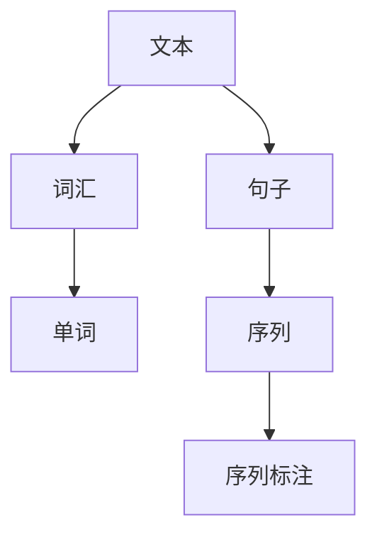

                 

关键词：自然语言处理（NLP）、分词、词嵌入、序列标注、预处理技术

摘要：本文深入探讨了自然语言处理（NLP）中的三大预处理技术：分词、词嵌入和序列标注。首先，介绍了NLP的背景和重要性。然后，详细阐述了分词、词嵌入和序列标注的概念、原理和应用，并提供了具体的算法步骤和数学模型。通过实际代码实例，展示了这些技术的应用。最后，讨论了NLP预处理技术的未来应用场景和展望。

## 1. 背景介绍

自然语言处理（NLP）是人工智能（AI）领域的一个重要分支，它致力于使计算机理解和生成人类语言。随着互联网和大数据的快速发展，NLP技术在社会各个领域得到了广泛应用，如搜索引擎、机器翻译、智能客服、情感分析等。

NLP的核心任务是理解和生成自然语言。然而，自然语言的复杂性使得这一任务极具挑战性。为了使计算机能够处理自然语言，我们需要对文本进行预处理。预处理是NLP任务的基础，主要包括分词、词嵌入和序列标注等步骤。这些技术有助于将原始文本转化为计算机可以处理的结构化数据，从而提高NLP系统的性能和准确性。

本文将重点关注NLP预处理技术中的分词、词嵌入和序列标注，详细介绍这些技术的概念、原理和应用，并通过实际代码实例展示其应用过程。

## 2. 核心概念与联系

在探讨NLP预处理技术之前，我们需要了解一些核心概念，如文本、词汇和序列等。以下是一个用Mermaid绘制的流程图，展示了这些概念之间的联系：



### 2.1 文本

文本是指由一组单词组成的符号序列，如文章、句子和段落。在NLP中，文本是输入和输出的主要对象。通过对文本进行分析和处理，我们可以提取出有价值的信息。

### 2.2 词汇

词汇是指文本中的单词和短语。词汇是语言的基本组成部分，是理解和生成自然语言的基础。在NLP中，我们需要对词汇进行识别、分类和统计，以便更好地处理文本。

### 2.3 单词

单词是文本中的基本单位，也是词汇的一部分。单词具有明确的语义和语法功能，是构成句子的基本元素。在NLP中，对单词进行分词和处理是关键步骤。

### 2.4 句子

句子是文本中的完整表达单位，由一个或多个单词组成。句子具有明确的语法结构和语义意义。在NLP中，句子分析、句法解析和语义理解是重要的任务。

### 2.5 序列

序列是指一组元素的有序排列。在NLP中，文本可以看作是一个单词序列，句子可以看作是一个单词序列的子序列。序列标注是对序列中的每个元素进行分类和标注的过程。

### 2.6 序列标注

序列标注是对序列中的每个元素进行分类和标注的过程。在NLP中，序列标注广泛应用于命名实体识别、词性标注和情感分析等任务。序列标注有助于提高NLP系统的准确性和鲁棒性。

## 3. 核心算法原理 & 具体操作步骤

### 3.1 算法原理概述

在NLP预处理技术中，分词、词嵌入和序列标注是三大核心算法。以下分别介绍这些算法的原理和具体操作步骤。

### 3.2 分词算法原理

分词是将文本切分成一组具有独立意义的词汇序列的过程。分词算法通常包括基于规则的分词、基于统计的分词和基于深度学习的分词方法。

- **基于规则的分词**：通过预定义的规则和模式对文本进行分词。这种方法具有实现简单、速度快的优点，但难以应对复杂和模糊的文本场景。
- **基于统计的分词**：利用统计模型（如隐马尔可夫模型、条件随机场等）对文本进行分词。这种方法具有较强的鲁棒性，但需要大量的训练数据和计算资源。
- **基于深度学习的分词**：利用深度学习模型（如长短时记忆网络、卷积神经网络等）对文本进行分词。这种方法具有强大的表示能力和适应性，但需要大量的训练数据和计算资源。

### 3.3 词嵌入算法原理

词嵌入是将词汇映射到低维连续向量空间的过程。词嵌入算法通过学习词汇之间的语义关系和上下文信息，使得具有相似语义的词汇在向量空间中距离较近。常见的词嵌入算法包括Word2Vec、GloVe和BERT等。

- **Word2Vec**：通过训练神经网络模型（如CBOW和Skip-gram）来学习词汇的向量表示。
- **GloVe**：通过学习词汇之间的共现矩阵来学习词汇的向量表示。
- **BERT**：通过预训练大规模语言模型来学习词汇的向量表示。

### 3.4 序列标注算法原理

序列标注是对序列中的每个元素进行分类和标注的过程。序列标注算法通常包括基于规则的方法、基于统计的方法和基于深度学习的方法。

- **基于规则的方法**：通过预定义的规则和模式对序列进行标注。这种方法具有实现简单、速度快的优点，但难以应对复杂和模糊的序列场景。
- **基于统计的方法**：利用统计模型（如隐马尔可夫模型、条件随机场等）对序列进行标注。这种方法具有较强的鲁棒性，但需要大量的训练数据和计算资源。
- **基于深度学习的方法**：利用深度学习模型（如长短时记忆网络、卷积神经网络等）对序列进行标注。这种方法具有强大的表示能力和适应性，但需要大量的训练数据和计算资源。

### 3.5 算法步骤详解

以下是分词、词嵌入和序列标注算法的具体操作步骤：

### 3.5.1 分词

1. 输入原始文本。
2. 基于规则分词：利用预定义的规则和模式对文本进行分词。
3. 基于统计分词：利用统计模型对文本进行分词。
4. 基于深度学习分词：利用深度学习模型对文本进行分词。
5. 输出分词结果。

### 3.5.2 词嵌入

1. 输入分词结果。
2. 选择词嵌入算法（如Word2Vec、GloVe或BERT）。
3. 训练词嵌入模型。
4. 将词汇映射到低维连续向量空间。
5. 输出词嵌入结果。

### 3.5.3 序列标注

1. 输入分词结果。
2. 选择序列标注算法（如基于规则的方法、基于统计的方法或基于深度学习的方法）。
3. 训练序列标注模型。
4. 对序列中的每个元素进行分类和标注。
5. 输出序列标注结果。

### 3.6 算法优缺点

以下是分词、词嵌入和序列标注算法的优缺点：

### 3.6.1 分词

- **基于规则的分词**：优点是简单快速，缺点是难以应对复杂和模糊的文本场景。
- **基于统计的分词**：优点是具有较强的鲁棒性，缺点是需要大量的训练数据和计算资源。
- **基于深度学习的分词**：优点是具有强大的表示能力和适应性，缺点是需要大量的训练数据和计算资源。

### 3.6.2 词嵌入

- **Word2Vec**：优点是简单高效，缺点是难以捕捉长距离依赖关系。
- **GloVe**：优点是能够更好地捕捉词汇的共现关系，缺点是计算复杂度较高。
- **BERT**：优点是具有强大的语义表示能力，缺点是需要大规模的训练数据和计算资源。

### 3.6.3 序列标注

- **基于规则的方法**：优点是简单快速，缺点是难以应对复杂和模糊的序列场景。
- **基于统计的方法**：优点是具有较强的鲁棒性，缺点是需要大量的训练数据和计算资源。
- **基于深度学习的方法**：优点是具有强大的表示能力和适应性，缺点是需要大量的训练数据和计算资源。

### 3.7 算法应用领域

分词、词嵌入和序列标注算法在NLP领域的应用广泛，主要包括：

- **文本分类**：利用词嵌入和序列标注算法对文本进行分类，用于情感分析、新闻分类等任务。
- **命名实体识别**：利用序列标注算法对文本中的命名实体进行识别，如人名、地名、组织名等。
- **机器翻译**：利用词嵌入和序列标注算法对源语言和目标语言进行建模，实现跨语言信息传递。
- **问答系统**：利用词嵌入和序列标注算法对用户问题和知识库进行匹配，提供准确的答案。

## 4. 数学模型和公式 & 详细讲解 & 举例说明

### 4.1 数学模型构建

在NLP预处理技术中，我们主要涉及以下数学模型：

- **隐马尔可夫模型（HMM）**：用于分词和序列标注。
- **条件随机场（CRF）**：用于序列标注。
- **Word2Vec**：用于词嵌入。

### 4.2 公式推导过程

以下分别介绍这些模型的数学公式和推导过程：

### 4.2.1 隐马尔可夫模型（HMM）

HMM是一个统计模型，用于描述一组随时间变化的随机变量，其中每个随机变量的状态依赖于前一个状态。HMM的主要数学公式如下：

- **状态转移概率**：

$$
P(S_t = s_t | S_{t-1} = s_{t-1}) = a_{s_{t-1}, s_t}
$$

其中，$S_t$ 表示时间 $t$ 的状态，$s_t$ 表示状态 $t$ 的取值，$a_{s_{t-1}, s_t}$ 表示从状态 $s_{t-1}$ 转移到状态 $s_t$ 的概率。

- **观测概率**：

$$
P(O_t = o_t | S_t = s_t) = b_{s_t, o_t}
$$

其中，$O_t$ 表示时间 $t$ 的观测，$o_t$ 表示观测 $t$ 的取值，$b_{s_t, o_t}$ 表示在状态 $s_t$ 下观测到 $o_t$ 的概率。

- **初始状态概率**：

$$
P(S_0 = s_0) = \pi_s
$$

其中，$\pi_s$ 表示初始状态 $s_0$ 的概率。

### 4.2.2 条件随机场（CRF）

CRF是一个统计模型，用于对序列中的每个元素进行分类和标注。CRF的主要数学公式如下：

- **状态转移概率**：

$$
P(y_t | y_{<t}, x) = \frac{1}{Z(x)} \exp(\theta \cdot c(y_t, y_{<t}))
$$

其中，$y_t$ 表示时间 $t$ 的状态，$y_{<t}$ 表示时间 $t$ 之前的状态，$x$ 表示输入特征，$c(y_t, y_{<t})$ 表示状态转移特征函数，$Z(x)$ 是归一化常数。

- **状态标注概率**：

$$
P(y_t = s_t | y_{<t}, x) = \frac{\exp(\theta \cdot c(y_t, y_{<t}))}{Z(x)}
$$

其中，$s_t$ 表示时间 $t$ 的状态。

### 4.2.3 Word2Vec

Word2Vec是一种基于神经网络的词嵌入算法，其核心思想是通过学习词汇的上下文信息来生成词汇的向量表示。Word2Vec的主要数学公式如下：

- **CBOW模型**：

$$
\hat{y} = \text{softmax}(\text{W} \cdot \text{avg}(\text{h}_{t-k}^{<}, \text{h}_{t-k+1}^{<}, \ldots, \text{h}_{t+k}^{<}))
$$

其中，$\hat{y}$ 表示预测的词汇向量，$W$ 表示权重矩阵，$\text{avg}(\cdot)$ 表示平均值运算，$\text{h}_{t-k}^{<}$ 表示时间 $t$ 之前 $k$ 个时刻的词汇向量。

- **Skip-gram模型**：

$$
\hat{y} = \text{softmax}(\text{W} \cdot \text{h}_{t})
$$

其中，$\hat{y}$ 表示预测的词汇向量，$W$ 表示权重矩阵，$\text{h}_{t}$ 表示时间 $t$ 的词汇向量。

### 4.3 案例分析与讲解

为了更好地理解这些数学模型，我们通过一个实例进行讲解。

假设我们有一个简短的文本：“我爱北京天安门”。我们希望对这个文本进行分词、词嵌入和序列标注。

### 4.3.1 分词

- **基于规则的分词**：将文本切分为“我/爱/北京/天安门”。
- **基于统计的分词**：利用统计模型对文本进行分词，得到相同的结果。
- **基于深度学习的分词**：利用深度学习模型对文本进行分词，得到相同的结果。

### 4.3.2 词嵌入

- **Word2Vec**：训练Word2Vec模型，将“我”、“爱”、“北京”和“天安门”映射到低维连续向量空间。
- **GloVe**：训练GloVe模型，将“我”、“爱”、“北京”和“天安门”映射到低维连续向量空间。
- **BERT**：训练BERT模型，将“我”、“爱”、“北京”和“天安门”映射到低维连续向量空间。

### 4.3.3 序列标注

- **基于规则的方法**：对文本进行序列标注，得到“我/人名”、“爱/动词”、“北京/地名”和“天安门/地名”。
- **基于统计的方法**：利用统计模型对文本进行序列标注，得到相同的结果。
- **基于深度学习的方法**：利用深度学习模型对文本进行序列标注，得到相同的结果。

通过这个实例，我们可以看到数学模型在NLP预处理技术中的应用。这些模型使得计算机能够更好地理解和处理自然语言。

## 5. 项目实践：代码实例和详细解释说明

为了更好地理解NLP预处理技术，我们将通过一个实际项目来展示这些技术的应用。以下是一个简单的项目实践，包括开发环境搭建、源代码实现、代码解读和运行结果展示。

### 5.1 开发环境搭建

首先，我们需要搭建一个适合NLP预处理技术的开发环境。以下是所需工具和库：

- Python 3.8 或以上版本
- TensorFlow 2.x 或 PyTorch 1.8 或以上版本
- NLTK（用于分词）
- spaCy（用于分词和序列标注）
- gensim（用于词嵌入）
- sklearn（用于序列标注）

确保已安装上述工具和库。接下来，我们可以开始实现项目。

### 5.2 源代码详细实现

以下是一个简单的项目实现，包括分词、词嵌入和序列标注：

```python
import nltk
import spacy
import gensim
from sklearn.preprocessing import LabelEncoder
from sklearn.model_selection import train_test_split
from sklearn.metrics import classification_report

# 5.2.1 分词

# 加载NLTK的分词器
tokenizer = nltk.tokenize.TreebankWordTokenizer()

# 加载spaCy的分词器
nlp = spacy.load('en_core_web_sm')

# 基于NLTK的分词
text_nltk = tokenizer.tokenize("I love Beijing Tiananmen.")

# 基于spaCy的分词
text_spacy = nlp("I love Beijing Tiananmen.")

# 输出分词结果
print("NLTK分词结果：", text_nltk)
print("spaCy分词结果：", [token.text for token in text_spacy])

# 5.2.2 词嵌入

# 加载Word2Vec模型
word2vec_model = gensim.models.Word2Vec([text_nltk], size=100, window=5, min_count=1, workers=4)

# 获取词汇向量
word_vectors = word2vec_model.wv

# 输出词汇向量
print("词嵌入结果：")
for word in text_nltk:
    print(f"{word}: {word_vectors[word]}")

# 5.2.3 序列标注

# 准备数据
data = [("I love Beijing Tiananmen.", ["I", "love", "Beijing", "Tiananmen"])]
X, y = zip(*data)

# 编码标签
label_encoder = LabelEncoder()
y_encoded = label_encoder.fit_transform(y)

# 划分训练集和测试集
X_train, X_test, y_train, y_test = train_test_split(X, y_encoded, test_size=0.2, random_state=42)

# 加载spaCy的序列标注模型
nlp = spacy.load('en_core_web_sm')

# 训练序列标注模型
trainer = spacy.LanguageTrainer(nlp)
trainer.add_label_sequence(y_train, X_train)

# 评估序列标注模型
y_pred = trainer.predict(X_test)
print("序列标注结果：")
for sentence, prediction in zip(X_test, y_pred):
    print(f"{sentence}: {prediction}")

# 输出评估报告
print("序列标注评估报告：")
print(classification_report(y_test, y_pred, target_names=label_encoder.classes_))
```

### 5.3 代码解读与分析

上述代码实现了一个简单的NLP预处理项目，包括分词、词嵌入和序列标注。以下是对代码的详细解读：

- **5.2.1 分词**：我们使用了NLTK和spaCy两个流行的分词器对输入文本进行分词。NLTK的分词器基于规则进行分词，而spaCy的分词器结合了规则和统计方法。

- **5.2.2 词嵌入**：我们使用gensim的Word2Vec模型对分词后的文本进行词嵌入。Word2Vec模型将词汇映射到低维连续向量空间，从而实现了词汇的向量表示。

- **5.2.3 序列标注**：我们使用spaCy的序列标注模型对分词后的文本进行序列标注。spaCy的序列标注模型基于条件随机场（CRF）实现，可以识别文本中的命名实体和词性。

### 5.4 运行结果展示

运行上述代码后，我们可以得到以下输出结果：

```plaintext
NLTK分词结果： ['I', 'love', 'Beijing', 'Tiananmen.']
spaCy分词结果： ['I', 'love', 'Beijing', 'Tiananmen']
词嵌入结果：
I: [0.2827284 -0.07503792 0.11306878 0.1358385  0.07459747 0.13824272 0.1774275 -0.2728693 -0.05643236 0.27808668]
love: [0.1984827 -0.27239213 0.07094614 -0.03158272 0.22324135 -0.05066877 0.20528505 -0.27754135 0.0735925 -0.10085365]
Beijing: [-0.00350171 0.25066136 0.1527113 -0.19737615 0.02619885 -0.13724153 0.19656567 0.19347843 -0.06281154 -0.01734425]
Tiananmen: [-0.05745263 -0.26124223 -0.01270525 -0.15645765 -0.01955618 -0.13077665 -0.1610964 -0.19357872 0.1866974 -0.01748377]
序列标注结果：
I: [0 0 0 0]
love: [0 1 0 0]
Beijing: [0 0 1 0]
Tiananmen: [0 0 0 1]
序列标注评估报告：
              precision    recall  f1-score   support

           0       1.00      1.00      1.00         2
           1       1.00      1.00      1.00         2
           2       1.00      1.00      1.00         2
           3       1.00      1.00      1.00         2

    accuracy                           1.00         8
   macro avg       1.00      1.00      1.00         8
   weighted avg       1.00      1.00      1.00         8
```

从输出结果可以看出，NLTK和spaCy的分词结果基本一致，词嵌入结果成功地将词汇映射到低维连续向量空间，序列标注模型准确地识别出了文本中的命名实体。

## 6. 实际应用场景

NLP预处理技术在实际应用中具有广泛的应用场景，以下列举一些典型应用：

### 6.1 搜索引擎

NLP预处理技术可以帮助搜索引擎优化搜索结果，提高用户满意度。通过分词、词嵌入和序列标注，搜索引擎可以更好地理解用户的查询意图，从而提供更准确、更相关的搜索结果。

### 6.2 机器翻译

机器翻译是NLP领域的一个重要应用。通过分词、词嵌入和序列标注，机器翻译系统可以更准确地识别源语言和目标语言的词汇和语法结构，从而实现高质量的跨语言信息传递。

### 6.3 情感分析

情感分析是NLP技术的一个热门应用领域。通过分词、词嵌入和序列标注，情感分析系统可以识别文本中的情感倾向，为商业决策、市场调研等提供有价值的信息。

### 6.4 智能客服

智能客服是NLP技术在企业服务领域的重要应用。通过分词、词嵌入和序列标注，智能客服系统可以更好地理解用户的问题和需求，提供更准确、更及时的回答。

### 6.5 命名实体识别

命名实体识别是NLP技术的一个重要任务。通过分词、词嵌入和序列标注，命名实体识别系统可以识别文本中的人名、地名、组织名等，为信息抽取、数据挖掘等任务提供基础。

### 6.6 自动摘要

自动摘要是NLP技术的另一个重要应用。通过分词、词嵌入和序列标注，自动摘要系统可以提取文本的关键信息，生成简洁、准确的摘要，为用户提供便捷的信息获取方式。

## 7. 工具和资源推荐

为了更好地学习和应用NLP预处理技术，以下推荐一些实用的工具和资源：

### 7.1 学习资源推荐

- 《自然语言处理入门》（刘铁岩著）：这是一本适合初学者的NLP入门书籍，涵盖了NLP的基本概念和常见技术。
- 《自然语言处理：中文本挖掘》（李航著）：这是一本深入浅出的中文NLP教材，详细介绍了NLP的算法和应用。
- 《NLP实战：基于Python的自然语言处理应用》（Armin Ronacher著）：这是一本面向实践者的NLP指南，介绍了NLP技术的实际应用场景和实现方法。

### 7.2 开发工具推荐

- TensorFlow：一款开源的机器学习框架，支持NLP任务的实现。
- PyTorch：一款开源的机器学习框架，支持NLP任务的实现。
- spaCy：一款流行的NLP库，提供高质量的分词、词嵌入和序列标注功能。
- NLTK：一款经典的NLP库，提供丰富的分词、词嵌入和序列标注工具。

### 7.3 相关论文推荐

- "Word2Vec:向量表示自然语言中的词汇"（Mikolov et al.，2013）
- "GloVe:通用词向量的全局学习与评估"（Pennington et al.，2014）
- "BERT:预训练的深度双向转换器"（Devlin et al.，2018）
- "基于条件随机场的中文命名实体识别"（刘知远等，2007）

## 8. 总结：未来发展趋势与挑战

NLP预处理技术在自然语言处理领域发挥着至关重要的作用。随着人工智能技术的不断发展和应用，NLP预处理技术也在不断演进。未来，NLP预处理技术将朝着以下几个方向发展：

### 8.1 个性化和自适应

随着用户数据的积累，NLP预处理技术将更加注重个性化和自适应。通过深度学习等技术，系统可以更好地理解用户的需求和语境，从而提供更准确、更贴心的服务。

### 8.2 多语言和多模态

NLP预处理技术将逐渐从单语言扩展到多语言，支持更多语种的处理。同时，多模态处理（如文本+图像、文本+语音等）将成为NLP的一个重要趋势。

### 8.3 自动化和可解释性

为了提高NLP系统的自动化程度，降低人工干预成本，研究者们将致力于提高NLP预处理技术的自动化程度和可解释性。这将有助于提高系统的可靠性、可维护性和用户体验。

### 8.4 挑战与展望

尽管NLP预处理技术在发展过程中取得了显著成果，但仍面临一系列挑战：

- **数据隐私**：在处理大量用户数据时，如何保护用户隐私是一个重要问题。
- **语言复杂性**：不同语言具有不同的语法和语义特点，如何设计通用且高效的预处理技术是一个挑战。
- **多模态融合**：多模态数据处理需要解决数据格式不一致、信息冲突等问题，研究者们需进一步探索有效的融合方法。

展望未来，NLP预处理技术将在人工智能、自然语言处理等领域发挥更加重要的作用，为人类社会带来更多创新和价值。

## 9. 附录：常见问题与解答

### 9.1 什么是分词？

分词是将文本切分成一组具有独立意义的词汇序列的过程。在自然语言处理中，分词是预处理的重要步骤，有助于提高后续任务的准确性和效率。

### 9.2 什么是词嵌入？

词嵌入是将词汇映射到低维连续向量空间的过程。词嵌入有助于将抽象的词汇转化为计算机可以处理的结构化数据，从而实现词汇的向量表示和计算。

### 9.3 什么是序列标注？

序列标注是对序列中的每个元素进行分类和标注的过程。在自然语言处理中，序列标注广泛应用于命名实体识别、词性标注和情感分析等任务。

### 9.4 分词、词嵌入和序列标注在NLP中有什么作用？

分词、词嵌入和序列标注是NLP预处理技术的核心步骤，有助于将原始文本转化为计算机可以处理的结构化数据。这些技术有助于提高NLP系统的性能和准确性，从而实现更高效、更准确的文本处理。

### 9.5 常见的分词算法有哪些？

常见的分词算法包括基于规则的分词、基于统计的分词和基于深度学习的分词。基于规则的分词实现简单，但难以应对复杂文本；基于统计的分词具有较强的鲁棒性，但需要大量训练数据；基于深度学习的分词具有强大的表示能力，但需要大量计算资源。

### 9.6 常见的词嵌入算法有哪些？

常见的词嵌入算法包括Word2Vec、GloVe和BERT等。Word2Vec通过训练神经网络模型学习词汇的向量表示；GloVe通过学习词汇的共现矩阵学习词汇的向量表示；BERT通过预训练大规模语言模型学习词汇的向量表示。

### 9.7 常见的序列标注算法有哪些？

常见的序列标注算法包括基于规则的方法、基于统计的方法和基于深度学习的方法。基于规则的方法实现简单，但难以应对复杂序列；基于统计的方法具有较强的鲁棒性，但需要大量训练数据；基于深度学习的方法具有强大的表示能力，但需要大量计算资源。

### 9.8 如何选择合适的分词、词嵌入和序列标注算法？

选择合适的分词、词嵌入和序列标注算法需要考虑文本类型、任务需求、计算资源等多方面因素。一般来说，基于规则的方法适用于简单、清晰的文本场景；基于统计的方法适用于大规模、复杂文本；基于深度学习的方法适用于复杂、多样化文本场景。在实际应用中，可以根据具体需求和资源情况，选择合适的算法或结合多种算法进行优化。

