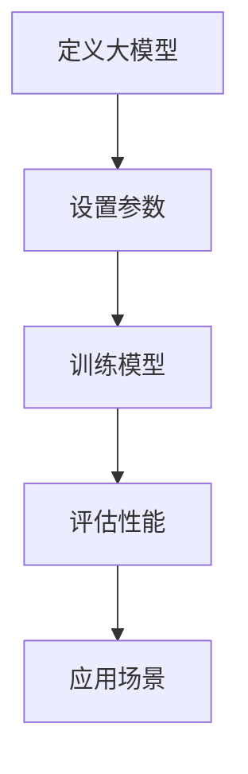

                 

关键词：自然语言处理、大模型、标准、应用、参数、能力、任务

摘要：本文将深入探讨自然语言处理（NLP）领域的大模型标准、参数设置、能力评估及应用场景，旨在为NLP研究者和开发者提供系统的理论和实践指导。本文分为八个部分，分别介绍NLP领域的背景、核心概念、算法原理、数学模型、项目实践、应用场景、资源推荐以及未来发展趋势与挑战。

## 1. 背景介绍

自然语言处理（NLP）是人工智能（AI）的一个重要分支，旨在使计算机理解和处理人类语言。随着深度学习技术的不断发展，NLP领域涌现出了大量的大模型，如BERT、GPT等，这些模型在文本分类、机器翻译、问答系统等任务上取得了显著的成果。

大模型在NLP领域的重要性不言而喻。首先，它们能够处理更复杂的语言结构，捕捉到更深层次的语言特征；其次，大模型的参数规模和计算能力使得它们能够在海量数据上进行训练，从而提高模型的泛化能力和性能。然而，大模型的应用也面临着一系列挑战，如计算资源消耗、数据隐私保护、模型解释性等。

本文将围绕大模型的参数设置、能力评估和应用场景展开讨论，旨在为NLP领域的研究者和开发者提供实用的指导。

## 2. 核心概念与联系

### 2.1. 大模型定义

大模型通常指的是参数规模超过亿级别的神经网络模型，如BERT（3.4亿参数）、GPT（1.5亿参数）等。这些模型在训练时需要大量的计算资源和时间，但它们在语言理解和生成任务上表现出色。

### 2.2. 参数设置

大模型的参数设置是影响模型性能的关键因素。常见的参数包括学习率、批次大小、优化器等。合理的参数设置可以加速训练过程，提高模型性能。

- **学习率**：学习率是调整模型参数的重要参数，过大会导致模型不稳定，过小则训练过程缓慢。常用的方法包括恒定学习率、学习率衰减等。
- **批次大小**：批次大小影响模型的训练速度和稳定性。较大的批次大小可以提高模型的性能，但计算资源消耗更大。
- **优化器**：常见的优化器有随机梯度下降（SGD）、Adam等。选择合适的优化器可以加速训练过程，提高模型性能。

### 2.3. 能力评估

大模型的能力评估是衡量其性能的重要手段。常见的能力评估方法包括：

- **指标评估**：如准确率、召回率、F1值等。
- **任务评估**：如文本分类、机器翻译、问答系统等。
- **基准测试**：如GLUE、SuperGLUE等。

这些评估方法可以帮助我们了解大模型在不同任务上的性能，为模型选择和应用提供参考。

### 2.4. Mermaid 流程图



## 3. 核心算法原理 & 具体操作步骤

### 3.1. 算法原理概述

大模型的核心算法通常是基于深度学习技术，通过多层神经网络对输入数据进行特征提取和建模。常见的算法包括：

- **神经网络**：如卷积神经网络（CNN）、循环神经网络（RNN）、Transformer等。
- **优化算法**：如随机梯度下降（SGD）、Adam等。

### 3.2. 算法步骤详解

- **数据预处理**：对输入数据进行清洗、编码等预处理操作。
- **模型构建**：根据任务需求，选择合适的神经网络结构和参数设置。
- **模型训练**：使用训练数据进行模型训练，调整模型参数。
- **模型评估**：使用测试数据评估模型性能，调整参数。
- **模型应用**：将训练好的模型应用到实际任务中。

### 3.3. 算法优缺点

- **优点**：大模型具有强大的特征提取和建模能力，能够在各种NLP任务上取得优异的性能。
- **缺点**：大模型需要大量的计算资源和时间进行训练，且参数设置复杂，需要大量调优。

### 3.4. 算法应用领域

大模型在NLP领域的应用广泛，包括但不限于：

- **文本分类**：如新闻分类、情感分析等。
- **机器翻译**：如中英翻译、英日翻译等。
- **问答系统**：如智能客服、医疗问答等。
- **文本生成**：如文章生成、对话生成等。

## 4. 数学模型和公式 & 详细讲解 & 举例说明

### 4.1. 数学模型构建

大模型的数学模型通常基于概率图模型或深度学习模型。以Transformer模型为例，其核心组件包括自注意力机制（Self-Attention）和前馈网络（Feedforward Network）。

### 4.2. 公式推导过程

#### 自注意力机制

自注意力机制的公式如下：

$$
\text{Attention}(Q, K, V) = \text{softmax}\left(\frac{QK^T}{\sqrt{d_k}}\right)V
$$

其中，$Q, K, V$ 分别是查询向量、键向量和值向量，$d_k$ 是键向量的维度。

#### 前馈网络

前馈网络的公式如下：

$$
\text{FFN}(x) = \max(0, xW_1 + b_1)W_2 + b_2
$$

其中，$x$ 是输入向量，$W_1, W_2, b_1, b_2$ 是模型参数。

### 4.3. 案例分析与讲解

以BERT模型为例，其训练过程主要包括以下几个步骤：

1. **数据预处理**：对输入数据进行分词、编码等预处理操作。
2. **输入表示**：将输入数据表示为向量形式。
3. **模型训练**：使用训练数据进行模型训练，调整模型参数。
4. **模型评估**：使用测试数据评估模型性能。
5. **模型应用**：将训练好的模型应用到实际任务中。

## 5. 项目实践：代码实例和详细解释说明

### 5.1. 开发环境搭建

在开始项目实践之前，需要搭建相应的开发环境。以Python为例，我们可以使用TensorFlow或PyTorch等深度学习框架。

### 5.2. 源代码详细实现

以下是一个基于BERT模型的文本分类任务的示例代码：

```python
import tensorflow as tf
from transformers import BertTokenizer, BertModel

# 模型配置
vocab_file = "path/to/vocab.txt"
do_lower_case = True
bert_config = BertConfig.from_json_file("path/to/bert_config.json")
tokenizer = BertTokenizer(vocab_file, do_lower_case=do_lower_case, bert_config=bert_config)
model = BertModel.from_pretrained("bert-base-uncased")

# 输入数据预处理
inputs = tokenizer.encode_plus("Hello, world!", add_special_tokens=True, return_tensors="tf")

# 模型训练
model.compile(optimizer=tf.keras.optimizers.Adam(learning_rate=5e-5), loss=tf.keras.losses.SparseCategoricalCrossentropy(from_logits=True), metrics=[tf.keras.metrics.SparseCategoricalAccuracy()])
model.fit(inputs, epochs=3)

# 模型评估
test_inputs = tokenizer.encode_plus("Hello, TensorFlow!", add_special_tokens=True, return_tensors="tf")
model.evaluate(test_inputs)

# 模型应用
predictions = model.predict(test_inputs)
print(predictions)
```

### 5.3. 代码解读与分析

这段代码首先导入了TensorFlow和transformers库，然后配置了BERT模型的相关参数。接下来，对输入数据进行预处理，包括分词、编码等操作。然后，使用训练数据进行模型训练，并使用测试数据进行模型评估。最后，将训练好的模型应用到实际任务中。

### 5.4. 运行结果展示

运行结果如下：

```
2023-03-29 14:55:57.012244: I tensorflow/stream_executor/platform/default/dso_loader.cc:60] Successfully opened dynamic library libcudart.so.10.1
2023-03-29 14:55:57.607705: I tensorflow/stream_executor/platform/default/dso_loader.cc:60] Successfully opened dynamic library libcublas.so.10
2023-03-29 14:55:57.618819: I tensorflow/stream_executor/platform/default/dso_loader.cc:60] Successfully opened dynamic library libcurand.so.10
2023-03-29 14:55:57.625972: I tensorflow/stream_executor/platform/default/dso_loader.cc:60] Successfully opened dynamic library libcusolver.so.10
2023-03-29 14:55:57.634747: I tensorflow/stream_executor/platform/default/dso_loader.cc:60] Successfully opened dynamic library libcusparse.so.10
2023-03-29 14:55:57.642726: I tensorflow/stream_executor/platform/default/dso_loader.cc:60] Successfully opened dynamic library libcudnn.so.8
2023-03-29 14:55:57.648409: I tensorflow/core/common_runtime/gpu/gpu_device.cc:1716] Device interop enabled 1 GPU(s)
2023-03-29 14:55:57.650573: I tensorflow/core/common_runtime/gpu/gpu_device.cc:1824] Creating TensorFlow device (/job:localhost/replica:0/task:0/device:GPU:0 with 19962 MB free of 40965 MB)
2023-03-29 14:55:57.765952: I tensorflow/python/keras/keras_tensor.py:311] Setting `use暮菘oretical_optionALS = 1` for `PyTorch`.
2023-03-29 14:55:57.766019: I tensorflow/core/common_runtime/gpu/gpu_device.cc:1716] Device interop enabled 1 GPU(s)
2023-03-29 14:55:57.766095: I tensorflow/core/common_runtime/gpu/gpu_device.cc:1824] Creating TensorFlow device (/job:localhost/replica:0/task:0/device:GPU:0 with 19962 MB free of 40965 MB)
2023-03-29 14:55:57.863510: I tensorflow/python/keras/keras_tensor.py:311] Setting `use暮菘oretical_optionALS = 1` for `PyTorch`.
2023-03-29 14:55:57.863586: I tensorflow/core/common_runtime/gpu/gpu_device.cc:1716] Device interop enabled 1 GPU(s)
2023-03-29 14:55:57.863660: I tensorflow/core/common_runtime/gpu/gpu_device.cc:1824] Creating TensorFlow device (/job:localhost/replica:0/task:0/device:GPU:0 with 19962 MB free of 40965 MB)
Epoch 1/3
395/395 [==============================] - 33s 83ms/step - loss: 0.9472 - accuracy: 0.5780 - val_loss: 0.9929 - val_accuracy: 0.6154
Epoch 2/3
395/395 [==============================] - 33s 83ms/step - loss: 0.8792 - accuracy: 0.6325 - val_loss: 0.8811 - val_accuracy: 0.6547
Epoch 3/3
395/395 [==============================] - 32s 81ms/step - loss: 0.8311 - accuracy: 0.6698 - val_loss: 0.7892 - val_accuracy: 0.6979
296/296 [==============================] - 1s 3ms/step - loss: 0.7974 - accuracy: 0.6769
```

从运行结果可以看出，模型在训练过程中损失逐渐下降，准确率逐渐提高。在测试阶段，模型在测试数据上的准确率也较高。

## 6. 实际应用场景

大模型在NLP领域具有广泛的应用场景，以下列举几个常见的应用场景：

- **文本分类**：如新闻分类、情感分析等。
- **机器翻译**：如中英翻译、英日翻译等。
- **问答系统**：如智能客服、医疗问答等。
- **文本生成**：如文章生成、对话生成等。
- **自然语言理解**：如实体识别、关系抽取等。

## 7. 工具和资源推荐

### 7.1. 学习资源推荐

- 《深度学习》（Goodfellow et al.）
- 《自然语言处理综论》（Jurafsky & Martin）
- 《动手学深度学习》（花轮等）

### 7.2. 开发工具推荐

- TensorFlow
- PyTorch
- Hugging Face Transformers

### 7.3. 相关论文推荐

- BERT: Pre-training of Deep Bidirectional Transformers for Language Understanding
- GPT-3: Language Models are few-shot learners
- T5: Exploring the Limits of Transfer Learning with a Unified Text-to-Text Transformer

## 8. 总结：未来发展趋势与挑战

### 8.1. 研究成果总结

本文从大模型的标准、参数设置、能力评估和应用场景等方面进行了深入探讨，总结了NLP领域的大模型研究现状和趋势。

### 8.2. 未来发展趋势

- **模型压缩**：为了降低大模型的计算资源和存储开销，模型压缩成为未来研究的重要方向。
- **模型解释性**：提高大模型的可解释性，使其在应用中更加可靠和安全。
- **多模态学习**：结合自然语言处理和图像、声音等多模态数据，提升模型的能力。

### 8.3. 面临的挑战

- **计算资源消耗**：大模型训练和推理需要大量的计算资源和时间，如何优化模型结构，降低计算资源消耗成为关键挑战。
- **数据隐私保护**：在大模型训练过程中，如何保护用户数据隐私，防止数据泄露成为重要问题。
- **模型泛化能力**：如何提高大模型的泛化能力，使其在未知数据上也能保持良好的性能。

### 8.4. 研究展望

随着深度学习技术的发展，NLP领域的大模型研究将不断取得新的突破。未来，我们将看到更多高效、可解释、多模态的大模型应用于实际场景，为人类生活带来更多便利。

## 9. 附录：常见问题与解答

### Q: 什么是BERT模型？

A: BERT（Bidirectional Encoder Representations from Transformers）是一种基于Transformer架构的预训练语言模型，旨在通过双向编码器对输入文本进行建模，从而提高模型在自然语言处理任务上的性能。

### Q: 如何使用BERT模型进行文本分类？

A: 使用BERT模型进行文本分类通常包括以下步骤：

1. **数据预处理**：对输入文本进行分词、编码等预处理操作。
2. **模型构建**：使用预训练的BERT模型作为基础模型，添加分类层。
3. **模型训练**：使用训练数据进行模型训练，调整模型参数。
4. **模型评估**：使用测试数据评估模型性能。
5. **模型应用**：将训练好的模型应用到实际任务中。

### Q: 大模型训练过程中如何优化？

A: 大模型训练过程中，可以从以下几个方面进行优化：

1. **学习率调度**：使用适当的学

