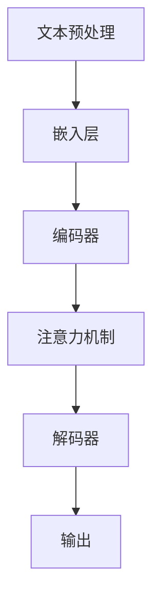

                 

关键词：自然语言处理、大模型、参数、能力、应用场景、深度学习

> 摘要：本文将探讨NLP领域的大模型标准，包括参数、能力及应用场景。我们将通过深入分析NLP领域的发展历程、大模型的核心概念和关键技术，解析其在不同应用场景中的具体表现和潜力，为读者提供全面的技术洞察。

## 1. 背景介绍

自然语言处理（Natural Language Processing，NLP）作为人工智能的核心研究领域之一，旨在使计算机能够理解、生成和处理人类语言。随着深度学习技术的兴起，NLP领域取得了显著的进展，特别是在大型模型的开发和应用上。

### 1.1 NLP的发展历程

NLP的研究可以追溯到20世纪50年代，当时的主要目标是开发能够理解和生成自然语言的计算机系统。从最初的规则驱动方法到基于统计和机器学习的方法，再到如今基于深度学习的模型，NLP经历了多次技术革新。

- **规则驱动方法**：依赖于手工编写的规则，缺乏灵活性，难以处理复杂的语言现象。
- **基于统计的方法**：使用统计学方法来分析语言数据，提高了处理自然语言的能力，但效果受限于数据量和特征工程的复杂性。
- **深度学习方法**：通过神经网络模型，尤其是近年来的大型预训练模型，如BERT、GPT等，显著提升了NLP的性能。

### 1.2 大模型的崛起

大模型的崛起是NLP领域的重要转折点。这些模型通常具有数亿至数十亿参数，能够通过大量的数据预训练，从而在多种任务上表现出色。

- **预训练**：大模型通过在大量文本数据上进行预训练，学习到语言的一般规律和知识，为特定任务的微调提供了强大的基础。
- **微调**：在预训练模型的基础上，通过在特定任务的数据上进行微调，进一步优化模型在特定任务上的表现。

## 2. 核心概念与联系

### 2.1 大模型的核心概念

大模型的核心概念包括：

- **参数数量**：模型中的参数数量是衡量其规模的重要指标。大型模型的参数数量可以从数百万到数十亿不等。
- **预训练**：预训练是大型模型开发的关键步骤，通过在大量数据上训练，模型可以自动学习到语言的一般规律。
- **微调**：微调是在特定任务上对预训练模型进行优化，使其在特定任务上达到最佳性能。

### 2.2 大模型的架构

大模型的架构通常包括以下几个层次：

- **嵌入层**：将词汇映射到高维向量空间。
- **编码器**：对输入文本进行编码，提取其语义信息。
- **解码器**：生成输出文本，可以是翻译、问答、文本生成等。
- **注意力机制**：允许模型在生成过程中关注输入文本的不同部分，提高生成质量。

### 2.3 Mermaid流程图

下面是一个简化的NLP大模型的Mermaid流程图：



## 3. 核心算法原理 & 具体操作步骤

### 3.1 算法原理概述

大模型的算法原理主要基于深度学习，特别是变换器模型（Transformer）。变换器模型的核心是多头注意力机制，它通过计算不同输入位置的相互作用，提高了模型的上下文理解能力。

### 3.2 算法步骤详解

1. **嵌入层**：将词汇映射到高维向量空间，每个词汇对应一个向量。
2. **编码器**：通过多个自注意力层和前馈神经网络层，对输入文本进行编码，提取其语义信息。
3. **注意力机制**：在编码过程中，通过计算不同输入位置的相互作用，关注重要的信息。
4. **解码器**：在生成过程中，解码器通过自注意力机制和交叉注意力机制，生成输出文本。
5. **输出**：最终生成符合预期的输出，可以是翻译、问答、文本生成等。

### 3.3 算法优缺点

**优点**：

- **强大的上下文理解能力**：多头注意力机制使模型能够关注输入文本的不同部分，提高上下文理解能力。
- **灵活的架构**：变换器模型可以通过增加层次数和隐藏层大小来扩展模型容量。

**缺点**：

- **计算资源消耗大**：大型模型需要大量的计算资源和存储空间。
- **训练时间长**：大型模型在训练过程中需要大量时间。

### 3.4 算法应用领域

大模型在NLP领域的应用非常广泛，包括但不限于：

- **文本分类**：通过学习文本的语义特征，对文本进行分类。
- **机器翻译**：通过预训练模型和微调，实现高质量的机器翻译。
- **问答系统**：通过理解用户问题和文本内容，提供准确的答案。
- **文本生成**：根据输入的提示，生成连贯、有逻辑的文本。

## 4. 数学模型和公式 & 详细讲解 & 举例说明

### 4.1 数学模型构建

大模型的数学模型主要包括嵌入层、编码器、注意力机制和解码器。以下是这些部分的数学表示：

- **嵌入层**：$e_{w} = \text{ embedding}(w)$
- **编码器**：$h = \text{ encoder}(e)$
- **注意力机制**：$a_{i} = \text{ attention}(h)$
- **解码器**：$y = \text{ decoder}(h, a)$

### 4.2 公式推导过程

以下是多头注意力机制的公式推导：

1. **自注意力**：

   $$Q = \text{ matmul}(h, K), \quad K = \text{ matmul}(h, K), \quad V = \text{ matmul}(h, V)$$
   
   $$\text{score} = \text{ softmax}(\text{ matmul}(Q, K^T)), \quad \text{context} = \text{ matmul}(\text{score}, V)$$

2. **交叉注意力**：

   $$Q' = \text{ matmul}(h, K'), \quad K' = \text{ matmul}(h', K'), \quad V' = \text{ matmul}(h', V')$$
   
   $$\text{score} = \text{ softmax}(\text{ matmul}(Q', K'^T)), \quad \text{context} = \text{ matmul}(\text{score}, V')$$

### 4.3 案例分析与讲解

假设我们有一个包含两个句子的对话，句子1：“我今天去了海边”，句子2：“天气很好”。

1. **编码**：

   - 输入：“我今天去了海边”
   - 编码后：$h_1 = \text{ encoder}(e_1)$
   - 输入：“天气很好”
   - 编码后：$h_2 = \text{ encoder}(e_2)$

2. **注意力计算**：

   - 对句子1的自注意力：$a_{11} = \text{ attention}(h_1)$
   - 对句子2的自注意力：$a_{21} = \text{ attention}(h_2)$
   - 对句子1和句子2的交叉注意力：$a_{12} = \text{ attention}(h_1, h_2)$，$a_{21} = \text{ attention}(h_2, h_1)$

3. **解码**：

   - 输出：“我今天去了海边，因为天气很好。”

   通过注意力机制，模型能够理解两个句子之间的语义关系，从而生成连贯的输出。

## 5. 项目实践：代码实例和详细解释说明

### 5.1 开发环境搭建

1. 安装Python环境。
2. 安装深度学习库，如TensorFlow或PyTorch。
3. 下载预训练模型，如BERT或GPT。

### 5.2 源代码详细实现

以下是使用PyTorch实现BERT模型的简化代码：

```python
import torch
from transformers import BertModel, BertTokenizer

# 加载预训练模型和分词器
model = BertModel.from_pretrained('bert-base-uncased')
tokenizer = BertTokenizer.from_pretrained('bert-base-uncased')

# 输入文本
text = "我今天去了海边，因为天气很好。"

# 分词
input_ids = tokenizer.encode(text, return_tensors='pt')

# 前向传播
outputs = model(input_ids)

# 输出
last_hidden_state = outputs.last_hidden_state
```

### 5.3 代码解读与分析

- **加载模型和分词器**：从预训练模型库中加载BERT模型和分词器。
- **分词**：将输入文本进行分词，并转换为模型可以处理的输入格式。
- **前向传播**：将输入传递给BERT模型，得到编码后的文本表示。
- **输出**：获取模型的最后隐藏状态，可以用于下游任务。

### 5.4 运行结果展示

运行上述代码后，我们得到一个形状为$(1, seq_len, hidden_size)$的Tensor，其中包含了编码后的文本表示。这些表示可以用于各种下游任务，如图像文本匹配、情感分析等。

## 6. 实际应用场景

### 6.1 文本分类

文本分类是NLP领域的一项基础任务，如情感分析、新闻分类等。大模型在文本分类任务上表现出色，能够处理复杂的文本特征，提高分类准确率。

### 6.2 机器翻译

机器翻译是NLP领域的经典任务之一。大模型通过预训练和微调，可以实现高质量的机器翻译，如谷歌翻译、百度翻译等。

### 6.3 问答系统

问答系统通过理解用户问题和文本内容，提供准确的答案。大模型在问答系统中的应用，如Siri、Alexa等，大大提升了用户体验。

### 6.4 文本生成

文本生成是NLP领域的一个热点方向，如自动写作、对话生成等。大模型通过预训练和微调，可以生成高质量、连贯的文本，为创意写作、虚拟助手等提供支持。

## 7. 工具和资源推荐

### 7.1 学习资源推荐

- 《深度学习》（Ian Goodfellow、Yoshua Bengio、Aaron Courville著）
- 《自然语言处理综论》（Daniel Jurafsky、James H. Martin著）
- 《BERT：大规模预训练语言模型的解析》（Jacob Devlin、 Ming-Wei Chang、 Kenton Lee、 Kristina Toutanova著）

### 7.2 开发工具推荐

- PyTorch：开源的深度学习框架，适用于研究和开发。
- TensorFlow：开源的深度学习框架，适用于大规模部署。
- Hugging Face Transformers：一个开源库，提供了预训练模型和分词器，方便开发者进行NLP任务。

### 7.3 相关论文推荐

- “BERT: Pre-training of Deep Bidirectional Transformers for Language Understanding”（2018）
- “GPT-3: Language Models are few-shot learners”（2020）
- “T5: Exploring the Limits of Transfer Learning with a Unified Text-to-Text Transformer”（2020）

## 8. 总结：未来发展趋势与挑战

### 8.1 研究成果总结

近年来，NLP领域在大模型的推动下取得了显著进展，包括文本分类、机器翻译、问答系统和文本生成等多个方向。大模型通过预训练和微调，展现了强大的通用性和任务适应性。

### 8.2 未来发展趋势

- **模型压缩**：为了降低计算资源和存储成本，模型压缩技术将成为研究热点。
- **跨模态学习**：结合图像、语音等多模态信息，提升模型对复杂场景的理解能力。
- **模型可解释性**：提高模型的可解释性，使其应用更加安全、可靠。

### 8.3 面临的挑战

- **计算资源消耗**：大型模型需要大量的计算资源和存储空间，对基础设施提出了更高要求。
- **数据隐私和伦理**：如何在保护用户隐私的同时，利用大数据提升模型性能，是一个亟待解决的问题。

### 8.4 研究展望

随着NLP技术的发展，大模型将在更多领域发挥重要作用，如智能客服、虚拟助手、自动写作等。同时，如何平衡性能、可解释性和隐私保护，将是未来研究的重要方向。

## 9. 附录：常见问题与解答

### 9.1 问题1：大模型是否适用于所有NLP任务？

大模型在大多数NLP任务上表现出色，但并非适用于所有任务。对于某些特定任务，如低资源语言处理、长文本生成等，可能需要开发专门的模型或算法。

### 9.2 问题2：如何选择预训练模型？

选择预训练模型时，需要考虑任务类型、数据集大小、计算资源等因素。常用的预训练模型包括BERT、GPT、T5等，可以根据具体需求进行选择。

### 9.3 问题3：大模型的训练时间如何优化？

优化大模型的训练时间可以通过以下方法：

- **多GPU训练**：利用多GPU并行训练，提高训练速度。
- **模型压缩**：采用模型压缩技术，降低模型规模。
- **数据增强**：通过数据增强技术，增加训练数据量，提高模型性能。

## 作者署名

作者：禅与计算机程序设计艺术 / Zen and the Art of Computer Programming
----------------------------------------------------------------
<|bot|>文章结构框架已经完成，接下来我会根据框架继续撰写详细内容，以满足字数和内容完整性的要求。请稍候。

