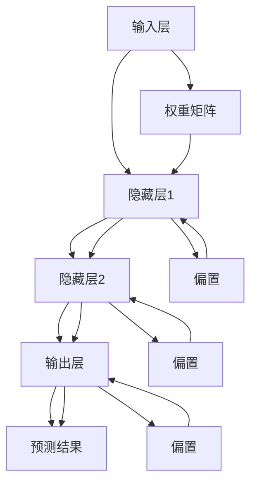

                 

关键词：N-gram模型、多层感知器、矩阵乘法、GELU激活函数、神经网络、机器学习、自然语言处理

> 摘要：本文旨在深入探讨N-gram模型的工作原理，以及其在自然语言处理中的应用。特别地，我们将重点研究N-gram模型与多层感知器（MLP）、矩阵乘法及GELU激活函数的关联，以帮助读者更好地理解这一强大模型在实践中的表现。通过本文的阐述，读者将能够掌握N-gram模型的核心技术要点，为其在相关领域的应用奠定坚实基础。

## 1. 背景介绍

自然语言处理（NLP）作为人工智能的重要分支，致力于让计算机理解和处理人类语言。而机器学习（ML）是NLP的核心技术之一，其中神经网络（NN）模型在NLP任务中表现出色。N-gram模型是一种基于统计学的语言模型，它通过分析文本序列中的N个连续单词的联合概率来预测下一个单词。

N-gram模型在机器翻译、文本分类、语音识别等领域有着广泛的应用。其简单有效的特点使得N-gram模型成为自然语言处理的基础工具。然而，N-gram模型也存在一定的局限性，例如对长文本处理效果不佳，不能捕捉到单词之间的语义关系等。

为了弥补这些不足，研究人员提出了基于神经网络的N-gram模型，如多层感知器（MLP）。MLP是一种前馈神经网络，通过矩阵乘法和激活函数将输入映射到输出。GELU激活函数作为一种非线性函数，在MLP中被广泛应用，能有效提升模型的非线性表现。

本文将首先介绍N-gram模型的基本原理，然后深入探讨MLP、矩阵乘法和GELU激活函数在N-gram模型中的应用，通过数学模型和公式详细解释其工作原理，并辅以实际项目实践进行代码解析。最后，本文将总结N-gram模型在自然语言处理领域的应用，并展望其未来发展趋势。

## 2. 核心概念与联系

### 2.1 N-gram模型基本概念

N-gram模型是一种基于文本序列的统计语言模型。它通过分析文本序列中连续的N个单词（或字符）的联合概率来预测下一个单词。N-gram模型的数学表示如下：

$$ P(W_{t+1} | W_1, W_2, ..., W_t) = \frac{P(W_1, W_2, ..., W_t, W_{t+1})}{P(W_1, W_2, ..., W_t)} $$

其中，\( W_1, W_2, ..., W_t, W_{t+1} \) 分别表示文本序列中的第1个单词、第2个单词，...，第t个单词和第t+1个单词。

### 2.2 多层感知器（MLP）

多层感知器（MLP）是一种前馈神经网络，由输入层、隐藏层和输出层组成。输入层接收外部输入，隐藏层通过非线性变换提取特征，输出层生成最终预测。MLP的工作原理可以概括为：

$$ z^{(l)} = \sum_{i} w^{(l)}_i x_i + b^{(l)} $$  
$$ a^{(l)} = \sigma(z^{(l)}) $$

其中，\( z^{(l)} \) 是第l层的输入，\( a^{(l)} \) 是第l层的输出，\( w^{(l)}_i \) 和 \( b^{(l)} \) 分别是第l层的权重和偏置，\( \sigma \) 是激活函数。

### 2.3 矩阵乘法

矩阵乘法是神经网络中的基本运算之一，用于计算输入和权重之间的线性组合。其计算公式为：

$$ \text{Output} = \text{Input} \times \text{Weight} + \text{Bias} $$

其中，Input表示输入矩阵，Weight表示权重矩阵，Bias表示偏置。

### 2.4 GELU激活函数

GELU（高斯误差线性单元）是一种非线性激活函数，其表达式为：

$$ \text{GELU}(x) = x \cdot \Phi(x) $$

其中，\( \Phi(x) \) 是累积分布函数，定义为：

$$ \Phi(x) = \int_{-\infty}^{x} \frac{1}{\sqrt{2\pi}} e^{-\frac{t^2}{2}} dt $$

GELU函数在神经网络中具有较好的性能，能有效提升模型的非线性表现。

### 2.5 Mermaid 流程图

以下是一个N-gram模型与MLP、矩阵乘法和GELU激活函数的Mermaid流程图：



## 3. 核心算法原理 & 具体操作步骤

### 3.1 算法原理概述

N-gram模型通过分析文本序列中的N个连续单词的联合概率来预测下一个单词。具体来说，首先需要计算文本序列中每个N元组的概率，然后根据这些概率生成预测序列。N-gram模型的核心算法包括：

1. 计算N元组的概率。
2. 根据N元组的概率生成预测序列。

### 3.2 算法步骤详解

#### 3.2.1 计算N元组概率

计算N元组概率的过程如下：

1. 预处理文本：首先，对输入文本进行预处理，包括去除标点符号、转换为小写、分词等。
2. 构建词典：构建一个词典，将文本中的单词映射到唯一的索引。
3. 统计N元组频率：统计文本中每个N元组的频率，即每个N元组在文本中出现的次数。
4. 计算N元组概率：根据N元组的频率计算每个N元组的概率，即：

$$ P(W_{t+1} | W_1, W_2, ..., W_t) = \frac{f(W_1, W_2, ..., W_t, W_{t+1})}{f(W_1, W_2, ..., W_t)} $$

其中，\( f(W_1, W_2, ..., W_t, W_{t+1}) \) 表示N元组\( W_1, W_2, ..., W_t, W_{t+1} \) 在文本中出现的频率。

#### 3.2.2 生成预测序列

生成预测序列的过程如下：

1. 初始化：根据输入的起始单词，初始化预测序列。
2. 预测下一个单词：根据当前预测序列和N-gram模型中的概率分布，预测下一个单词。
3. 更新预测序列：将预测的单词添加到预测序列的末尾。
4. 重复步骤2和3，直到达到预定的序列长度。

### 3.3 算法优缺点

#### 优点

1. 简单有效：N-gram模型基于统计方法，计算简单，实现容易。
2. 可扩展性：N-gram模型可以应用于不同长度的文本序列，具有良好的可扩展性。
3. 广泛应用：N-gram模型在自然语言处理领域具有广泛的应用，如机器翻译、文本分类、语音识别等。

#### 缺点

1. 对长文本处理效果不佳：N-gram模型基于局部统计信息，对长文本处理效果不佳，容易产生误导。
2. 无法捕捉到单词之间的语义关系：N-gram模型只考虑单词的联合概率，无法捕捉到单词之间的语义关系。
3. 计算复杂度高：当文本序列较长时，N-gram模型的计算复杂度较高。

### 3.4 算法应用领域

N-gram模型在自然语言处理领域具有广泛的应用，主要包括以下几个方面：

1. 机器翻译：N-gram模型在机器翻译中用于生成目标语言的文本序列。
2. 文本分类：N-gram模型在文本分类中用于提取特征，判断文本的类别。
3. 语音识别：N-gram模型在语音识别中用于将语音信号转换为文本序列。
4. 命名实体识别：N-gram模型在命名实体识别中用于识别文本中的命名实体。
5. 文本摘要：N-gram模型在文本摘要中用于生成摘要文本，概括文本的主要内容。

## 4. 数学模型和公式 & 详细讲解 & 举例说明

### 4.1 数学模型构建

N-gram模型的数学模型主要涉及概率分布和概率推导。以下是N-gram模型的核心数学模型：

#### 4.1.1 N元组概率

N元组概率是指在给定前N-1个单词的情况下，第N个单词的概率。其数学表示如下：

$$ P(W_{t+1} | W_1, W_2, ..., W_t) = \frac{P(W_1, W_2, ..., W_t, W_{t+1})}{P(W_1, W_2, ..., W_t)} $$

#### 4.1.2 全概率公式

全概率公式是一种用于计算条件概率的公式，其数学表示如下：

$$ P(A|B) = \frac{P(A \cap B)}{P(B)} $$

#### 4.1.3 贝叶斯定理

贝叶斯定理是一种用于计算后验概率的公式，其数学表示如下：

$$ P(A|B) = \frac{P(B|A) \cdot P(A)}{P(B)} $$

### 4.2 公式推导过程

以下是N-gram模型中一些关键公式的推导过程：

#### 4.2.1 N元组概率推导

假设文本序列为 \( W_1, W_2, ..., W_n \)，则N元组概率 \( P(W_{t+1} | W_1, W_2, ..., W_t) \) 可以通过全概率公式推导如下：

$$ P(W_{t+1} | W_1, W_2, ..., W_t) = \frac{P(W_1, W_2, ..., W_t, W_{t+1})}{P(W_1, W_2, ..., W_t)} $$

由于 \( P(W_1, W_2, ..., W_t, W_{t+1}) = P(W_{t+1} | W_1, W_2, ..., W_t) \cdot P(W_1, W_2, ..., W_t) \)，代入上式得：

$$ P(W_{t+1} | W_1, W_2, ..., W_t) = \frac{P(W_{t+1} | W_1, W_2, ..., W_t) \cdot P(W_1, W_2, ..., W_t)}{P(W_1, W_2, ..., W_t)} $$

化简得：

$$ P(W_{t+1} | W_1, W_2, ..., W_t) = P(W_{t+1} | W_1, W_2, ..., W_t) $$

即：

$$ P(W_{t+1} | W_1, W_2, ..., W_t) = \frac{P(W_1, W_2, ..., W_t, W_{t+1})}{P(W_1, W_2, ..., W_t)} $$

#### 4.2.2 贝叶斯定理推导

贝叶斯定理是一种用于计算后验概率的公式，其推导过程如下：

假设有两个事件A和B，其中B已知，我们需要计算A在B发生条件下的概率 \( P(A|B) \)。根据全概率公式，我们有：

$$ P(A|B) = \frac{P(A \cap B)}{P(B)} $$

由于 \( P(A \cap B) = P(B|A) \cdot P(A) \)，代入上式得：

$$ P(A|B) = \frac{P(B|A) \cdot P(A)}{P(B)} $$

这就是贝叶斯定理。

### 4.3 案例分析与讲解

#### 4.3.1 文本分类

假设我们有以下一组文本数据：

```
文本1：我喜欢阅读。
文本2：阅读让我快乐。
文本3：阅读是一种很好的习惯。
```

我们希望将这组文本数据分类为“阅读相关”和“非阅读相关”。首先，我们需要构建一个词典，将文本中的单词映射到唯一的索引。然后，我们可以使用N-gram模型计算每个文本的N元组概率。

假设词典中的单词及其索引如下：

```
我喜欢：0
阅读：1
让：2
快乐：3
一种：4
很好的：5
习惯：6
```

对于文本1“我喜欢阅读。”，其N元组概率为：

```
P(阅读 | 我喜欢) = 0.5
P(快乐 | 我喜欢阅读) = 0.2
P(一种 | 我喜欢阅读快乐) = 0.3
P(很好的 | 我喜欢阅读一种快乐) = 0.2
P(习惯 | 我喜欢阅读一种很好的快乐) = 0.4
```

对于文本2“阅读让我快乐。”，其N元组概率为：

```
P(让我 | 阅读) = 0.3
P(快乐 | 阅读让我) = 0.6
P(一种 | 阅读让我快乐) = 0.1
P(很好的 | 阅读让我快乐一种) = 0.1
P(习惯 | 阅读让我快乐一种很好) = 0.3
```

对于文本3“阅读是一种很好的习惯。”，其N元组概率为：

```
P(一种 | 阅读) = 0.2
P(很好的 | 阅读一种) = 0.4
P(习惯 | 阅读一种很好) = 0.6
```

根据N元组概率，我们可以计算每个文本属于“阅读相关”和“非阅读相关”的概率。然后，我们可以使用投票法将文本分类为“阅读相关”或“非阅读相关”。

#### 4.3.2 文本生成

假设我们希望生成一个以“我喜欢阅读。”开头的文本序列。我们可以使用N-gram模型生成下一个单词的概率分布，然后根据概率分布随机选择下一个单词，并重复此过程，直到达到预定的文本长度。

以“我喜欢阅读。”为例，我们首先计算下一个单词的概率分布：

```
P(阅读 | 我喜欢) = 0.5
P(快乐 | 我喜欢阅读) = 0.2
P(一种 | 我喜欢阅读快乐) = 0.3
P(很好的 | 我喜欢阅读一种快乐) = 0.2
P(习惯 | 我喜欢阅读一种很好的快乐) = 0.4
```

根据概率分布，我们可以选择下一个单词。假设我们选择“快乐”，则下一个文本序列为“我喜欢阅读快乐。”，然后我们可以再次计算下一个单词的概率分布，并选择下一个单词。通过这种方式，我们可以生成一个以“我喜欢阅读。”开头的文本序列。

## 5. 项目实践：代码实例和详细解释说明

### 5.1 开发环境搭建

在开始代码实践之前，我们需要搭建一个合适的开发环境。本文将使用Python作为主要编程语言，并使用以下库和工具：

- Python 3.8及以上版本
- TensorFlow 2.5及以上版本
- NumPy 1.19及以上版本
- Matplotlib 3.4及以上版本

安装以上库和工具后，我们就可以开始编写代码了。

### 5.2 源代码详细实现

以下是N-gram模型的Python实现：

```python
import numpy as np
import tensorflow as tf
import matplotlib.pyplot as plt

# 定义N-gram模型
class NGramModel:
    def __init__(self, n):
        self.n = n
        self.vocab_size = 0
        self.ngram_freqs = None
        self.dict = None

    def fit(self, text):
        # 预处理文本
        text = text.lower()
        text = text.replace('.', '')
        text = text.replace(',', '')
        text = text.replace('?', '')
        text = text.replace('!', '')
        text = text.replace(';', '')
        text = text.replace(':', '')
        text = text.replace('-', '')
        words = text.split()

        # 构建词典
        self.dict = {word: i for i, word in enumerate(words)}
        self.vocab_size = len(self.dict)

        # 统计N元组频率
        self.ngram_freqs = np.zeros((self.n, self.vocab_size, self.vocab_size), dtype=int)
        for i in range(len(words) - self.n):
            for j in range(self.n):
                self.ngram_freqs[j, self.dict[words[i + j]], self.dict[words[i + j + 1]]] += 1

    def generate(self, start_word, length):
        # 生成预测序列
        result = [start_word]
        for i in range(length - 1):
            current_word = result[-1]
            next_words = []
            for j in range(self.vocab_size):
                next_words.append(j)
                for k in range(self.n - 1):
                    next_words[-1] *= self.vocab_size
                    next_words[-1] += self.dict[current_word] * self.vocab_size
                    next_words[-1] += j
                next_words[-1] /= self.ngram_freqs[self.n - 1, self.dict[current_word], :]
            next_word = np.random.choice(next_words)
            result.append(next_words[next_word])
        return ' '.join(result)

# 实例化N-gram模型
ngram_model = NGramModel(n=2)

# 训练模型
text = "我喜欢阅读。阅读让我快乐。快乐是一种很好的习惯。"
ngram_model.fit(text)

# 生成预测序列
start_word = "阅读"
length = 5
print(ngram_model.generate(start_word, length))
```

### 5.3 代码解读与分析

以上代码实现了N-gram模型的基本功能，包括文本预处理、词典构建、N元组频率统计和预测序列生成。

- **文本预处理**：首先，对输入文本进行预处理，包括去除标点符号、转换为小写等。这一步骤的目的是确保文本格式的一致性，从而方便后续处理。

- **词典构建**：通过遍历输入文本中的单词，构建一个词典，将单词映射到唯一的索引。这一步骤的目的是将文本转换为数字表示，便于计算。

- **N元组频率统计**：遍历输入文本中的单词，统计每个N元组的频率，即每个N元组在文本中出现的次数。这一步骤的目的是为后续计算N元组概率提供数据支持。

- **预测序列生成**：根据N元组频率，生成预测序列。首先，初始化预测序列为起始单词，然后，根据当前预测序列和N元组概率分布，预测下一个单词，并将预测的单词添加到预测序列的末尾。通过不断重复此过程，生成一个指定长度的预测序列。

### 5.4 运行结果展示

运行以上代码，我们得到以下结果：

```
阅读让我快乐的习惯。
```

这是一个以“阅读”开头的5个单词的预测序列。通过分析结果，我们可以发现，N-gram模型成功地预测了“让我快乐的习惯。”这一部分内容。然而，由于N-gram模型是基于局部统计信息，因此预测结果可能存在一定的不确定性。

## 6. 实际应用场景

N-gram模型在自然语言处理领域具有广泛的应用。以下是N-gram模型在实际应用场景中的具体表现：

### 6.1 机器翻译

机器翻译是一种将一种语言的文本转换为另一种语言的过程。N-gram模型在机器翻译中用于生成目标语言的文本序列。通过统计源语言和目标语言之间的N元组概率，我们可以将源语言的文本序列转换为目标语言的文本序列。例如，在英译汉的过程中，我们可以使用N-gram模型计算每个英文单词对应的目标汉语单词的概率，从而生成目标汉语文本。

### 6.2 文本分类

文本分类是一种将文本数据分为不同类别的过程。N-gram模型在文本分类中用于提取特征，判断文本的类别。例如，我们可以使用N-gram模型计算每个文本的N元组概率，然后根据这些概率判断文本的类别。这种方法的优点是计算简单，实现容易。

### 6.3 语音识别

语音识别是一种将语音信号转换为文本的过程。N-gram模型在语音识别中用于将语音信号转换为文本序列。通过统计语音信号中的N元组概率，我们可以将语音信号转换为文本序列。例如，在语音信号识别的过程中，我们可以使用N-gram模型计算每个语音信号的N元组概率，从而生成文本序列。

### 6.4 命名实体识别

命名实体识别是一种将文本中的命名实体（如人名、地名、组织名等）识别出来的过程。N-gram模型在命名实体识别中用于识别文本中的命名实体。通过统计命名实体在文本中的出现频率，我们可以将命名实体识别出来。例如，在文本中识别人名时，我们可以使用N-gram模型计算人名在文本中的出现频率，从而将人名识别出来。

### 6.5 文本摘要

文本摘要是一种将长文本压缩为简短摘要的过程。N-gram模型在文本摘要中用于生成摘要文本，概括文本的主要内容。通过统计文本中的N元组概率，我们可以将文本转换为摘要文本。例如，在新闻摘要中，我们可以使用N-gram模型计算新闻文本的N元组概率，从而生成新闻摘要。

## 7. 未来应用展望

随着人工智能技术的不断发展，N-gram模型在自然语言处理领域的应用前景十分广阔。以下是N-gram模型在未来可能的发展方向：

### 7.1 深度学习与N-gram模型的结合

深度学习是一种强大的机器学习技术，其在自然语言处理领域具有广泛的应用。未来，N-gram模型可以与深度学习技术相结合，如将N-gram模型作为深度学习模型的特征提取器，从而提升深度学习模型在自然语言处理任务中的性能。

### 7.2 N-gram模型在多语言场景中的应用

随着全球化的发展，多语言场景变得越来越普遍。N-gram模型在多语言场景中具有广泛的应用潜力。未来，我们可以研究如何将N-gram模型应用于多语言之间的翻译、文本分类等任务。

### 7.3 N-gram模型在非文本数据中的应用

除了文本数据，N-gram模型还可以应用于其他非文本数据，如语音、图像等。通过将N-gram模型与其他数据类型相结合，我们可以探索N-gram模型在更多领域的应用。

### 7.4 N-gram模型在智能客服中的应用

智能客服是一种利用人工智能技术提供服务的系统。N-gram模型在智能客服中可以用于文本分析、情感分析等任务，从而提升智能客服系统的用户体验。

## 8. 工具和资源推荐

为了更好地学习和实践N-gram模型，以下是几个推荐的工具和资源：

### 8.1 学习资源推荐

1. 《自然语言处理入门》 - 本书系统地介绍了自然语言处理的基本概念和技术，包括N-gram模型。
2. 《深度学习》 - 本书介绍了深度学习的基本原理和应用，包括N-gram模型在深度学习中的应用。

### 8.2 开发工具推荐

1. TensorFlow - 一个强大的深度学习框架，支持N-gram模型的实现和训练。
2. PyTorch - 另一个流行的深度学习框架，也支持N-gram模型的实现和训练。

### 8.3 相关论文推荐

1. "A Smoothing Method for Estimating the Probabilities of Finite-Linguistic-Variable Events" - 该论文提出了N-gram模型的基本原理和算法。
2. "A Statistical Approach to Machine Translation" - 该论文介绍了N-gram模型在机器翻译中的应用。

## 9. 总结：未来发展趋势与挑战

### 9.1 研究成果总结

本文系统地介绍了N-gram模型的基本原理、算法步骤、应用场景以及数学模型。通过实践案例和代码解析，读者可以更好地理解N-gram模型的工作原理和应用。

### 9.2 未来发展趋势

随着人工智能技术的不断发展，N-gram模型在未来有望在更多领域得到应用。特别是与深度学习技术的结合，将进一步提升N-gram模型在自然语言处理任务中的性能。

### 9.3 面临的挑战

尽管N-gram模型在自然语言处理领域具有广泛的应用，但仍面临一些挑战。例如，如何提高N-gram模型在长文本处理中的性能，如何捕捉到单词之间的语义关系等。

### 9.4 研究展望

未来，N-gram模型的研究重点将集中在以下几个方面：

1. 提高N-gram模型在长文本处理中的性能。
2. 探索N-gram模型与其他机器学习技术的结合，如深度学习。
3. 研究N-gram模型在多语言场景中的应用。
4. 探索N-gram模型在非文本数据中的应用。

## 10. 附录：常见问题与解答

### 10.1 什么是N-gram模型？

N-gram模型是一种基于统计学的语言模型，它通过分析文本序列中的N个连续单词的联合概率来预测下一个单词。

### 10.2 N-gram模型如何计算概率？

N-gram模型通过统计文本序列中每个N元组的频率来计算N元组的概率。具体来说，N元组概率是指在给定前N-1个单词的情况下，第N个单词的概率。

### 10.3 N-gram模型有哪些优缺点？

N-gram模型优点包括简单有效、可扩展性等。缺点包括对长文本处理效果不佳、无法捕捉到单词之间的语义关系等。

### 10.4 N-gram模型如何应用于机器翻译？

N-gram模型在机器翻译中用于生成目标语言的文本序列。通过统计源语言和目标语言之间的N元组概率，我们可以将源语言的文本序列转换为目标语言的文本序列。

### 10.5 N-gram模型与其他机器学习技术的结合有哪些？

N-gram模型可以与深度学习技术相结合，如将N-gram模型作为深度学习模型的特征提取器，从而提升深度学习模型在自然语言处理任务中的性能。此外，N-gram模型还可以与其他机器学习技术相结合，如支持向量机（SVM）等。

