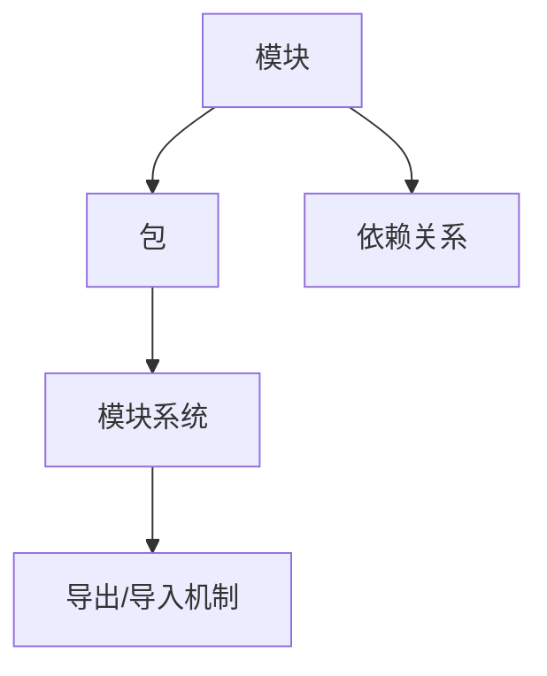

                 

  
## 1. 背景介绍

Node.js 是一个基于 Chrome V8 引擎的 JavaScript 运行环境，它使得 JavaScript 可以在服务器端运行，因此，开发人员可以使用统一的语言（JavaScript）来进行前端和后端的开发。Node.js 的模块化编程是它的一大特色，通过模块化，开发者可以更方便地组织和管理代码，提高代码的复用性和可维护性。

随着 Web 应用程序规模的不断扩大，模块化编程的重要性日益凸显。大型项目往往包含成千上万的代码行，如果缺乏有效的模块化管理，会导致代码混乱、难以维护，进而影响到开发效率和代码质量。本文将详细介绍 Node.js 的模块化编程技术，帮助开发者更好地管理大型项目。

## 2. 核心概念与联系

在深入探讨 Node.js 的模块化编程之前，我们需要了解一些核心概念，如模块（Module）、包（Package）和模块系统（Module System）。这些概念之间的关系可以用以下 Mermaid 流程图来表示：



### 2.1 模块（Module）

模块是 Node.js 中最小的代码组织单位。它可以将一组相关的功能或数据封装在一起，便于管理和复用。Node.js 的模块可以是 JavaScript 文件、CommonJS 模块或 ES6 模块。

### 2.2 包（Package）

包是一组模块的集合，通常用于组织项目代码和依赖项。在 Node.js 中，`package.json` 文件是包的配置文件，用于描述包的名称、版本、依赖关系等信息。

### 2.3 模块系统（Module System）

模块系统负责管理模块的加载、导出和导入。Node.js 的模块系统基于 CommonJS 规范，同时支持 ES6 模块。

### 2.4 依赖关系（Dependency）

依赖关系是指模块之间的相互依赖。在 Node.js 中，模块可以通过导入（import）和导出（export）来建立依赖关系。

### 2.5 导出/导入机制（Export/Import）

导出（export）是指将模块内部的函数、类、变量等暴露给其他模块使用。导入（import）则是从其他模块中引入所需的函数、类、变量等。

## 3. 核心算法原理 & 具体操作步骤

### 3.1 算法原理概述

Node.js 的模块化编程主要依赖于 CommonJS 和 ES6 模块两种规范。这两种规范提供了不同的导出和导入机制，但核心原理是相似的，即通过文件系统实现模块的动态加载。

### 3.2 算法步骤详解

#### 3.2.1 CommonJS 模块

1. 使用 `require()` 函数导入模块。
2. 使用 `exports` 或 `module.exports` 对象导出模块。
3. 模块加载顺序按照文件路径进行。

#### 3.2.2 ES6 模块

1. 使用 `import` 语法导入模块。
2. 使用 `export` 语法导出模块。
3. 模块加载顺序采用静态分析。

### 3.3 算法优缺点

#### 3.3.1 CommonJS 模块

- 优点：
  - 语法简单，易于理解。
  - 支持同步加载，便于代码组织。
  - 在服务器端应用中表现良好。

- 缺点：
  - 不支持静态分析，模块加载顺序依赖文件路径。
  - 在浏览器环境中使用受限。

#### 3.3.2 ES6 模块

- 优点：
  - 支持静态分析，模块加载顺序更加灵活。
  - 支持动态导入，便于处理复杂依赖关系。
  - 在浏览器和服务器端都有良好的支持。

- 缺点：
  - 语法相对复杂，需要一定学习成本。
  - 可能需要使用构建工具进行兼容性处理。

### 3.4 算法应用领域

Node.js 的模块化编程广泛应用于服务器端应用程序、Web 应用程序和微服务架构中。通过模块化，开发者可以更好地组织代码、管理依赖关系，提高开发效率和代码质量。

## 4. 数学模型和公式 & 详细讲解 & 举例说明

### 4.1 数学模型构建

模块化编程中的数学模型可以用来描述模块之间的依赖关系和模块的加载过程。以下是几个常用的数学模型：

#### 4.1.1 单向依赖（One-way Dependency）

单向依赖是指一个模块只依赖于另一个模块，但反向依赖不成立。可以用以下公式表示：

$$
D = \{ (m_1, m_2), (m_3, m_4), \ldots \}
$$

其中，$D$ 表示依赖关系集，$m_1, m_2, m_3, m_4, \ldots$ 表示模块。

#### 4.1.2 循环依赖（Circular Dependency）

循环依赖是指一组模块之间存在相互依赖关系，形成一个闭环。可以用以下公式表示：

$$
C = \{ (m_1, m_2), (m_2, m_3), (m_3, m_1) \}
$$

其中，$C$ 表示循环依赖关系集。

### 4.2 公式推导过程

#### 4.2.1 单向依赖推导

假设有一个模块集合 $M = \{ m_1, m_2, m_3, \ldots \}$，我们需要计算模块之间的单向依赖关系。可以使用以下公式：

$$
D = \{ (m_i, m_j) \mid m_i \text{ requires } m_j \}
$$

其中，$D$ 表示依赖关系集，$m_i$ 和 $m_j$ 表示模块。

#### 4.2.2 循环依赖推导

假设有一个模块集合 $M = \{ m_1, m_2, m_3, \ldots \}$，我们需要检测是否存在循环依赖。可以使用以下公式：

$$
C = \{ (m_i, m_j) \mid m_i \text{ requires } m_j \text{ and } m_j \text{ requires } m_i \}
$$

其中，$C$ 表示循环依赖关系集。

### 4.3 案例分析与讲解

假设我们有一个模块集合 $M = \{ m_1, m_2, m_3, m_4 \}$，其中模块之间的依赖关系如下：

$$
D = \{ (m_1, m_2), (m_2, m_3), (m_3, m_4), (m_4, m_1) \}
$$

根据上述公式，我们可以计算单向依赖关系集：

$$
D = \{ (m_1, m_2), (m_2, m_3), (m_3, m_4) \}
$$

可以看出，模块 $m_4$ 与其他模块之间存在循环依赖。为了解决这个问题，我们可以采用以下两种方法：

1. 重构代码，消除循环依赖。
2. 使用构建工具，如 Webpack 或 Rollup，对代码进行打包处理。

## 5. 项目实践：代码实例和详细解释说明

### 5.1 开发环境搭建

在开始项目实践之前，我们需要搭建一个 Node.js 开发环境。以下是搭建步骤：

1. 安装 Node.js：从 [Node.js 官网](https://nodejs.org/) 下载并安装 Node.js。
2. 配置 npm：安装 Node.js 后，npm（Node Package Manager）会自动安装。确保 npm 版本大于 5.0。
3. 初始化项目：在项目目录中运行 `npm init` 命令，初始化项目配置。

### 5.2 源代码详细实现

以下是一个简单的 Node.js 模块化编程实例，包含两个模块：`moduleA.js` 和 `moduleB.js`。

**moduleA.js**

```javascript
// moduleA.js
function add(a, b) {
  return a + b;
}

function subtract(a, b) {
  return a - b;
}

module.exports = {
  add,
  subtract,
};
```

**moduleB.js**

```javascript
// moduleB.js
const { add, subtract } = require("./moduleA");

function multiply(a, b) {
  return add(a, a) * subtract(a, b);
}

function divide(a, b) {
  return add(a, b) / subtract(a, a);
}

module.exports = {
  multiply,
  divide,
};
```

### 5.3 代码解读与分析

在这个实例中，我们定义了两个模块：`moduleA.js` 和 `moduleB.js`。`moduleA.js` 模块提供了加法和减法函数，而 `moduleB.js` 模块通过导入 `moduleA.js`，实现了乘法和除法函数。

通过使用 `module.exports` 和 `require()` 函数，我们可以轻松地实现模块之间的依赖关系。这种模块化编程方式使得代码更加清晰、易于维护。

### 5.4 运行结果展示

在项目根目录中，我们可以使用以下命令运行示例程序：

```bash
node moduleB.js
```

输出结果如下：

```javascript
{ multiply: [Function: multiply], divide: [Function: divide] }
```

这表明我们成功导入了 `moduleA.js` 模块，并使用 `moduleB.js` 模块实现了乘法和除法函数。

## 6. 实际应用场景

模块化编程在 Node.js 项目中有着广泛的应用场景。以下是一些常见应用场景：

- **服务器端应用程序**：通过模块化，开发者可以将服务器端应用程序拆分成多个模块，实现功能分离，提高代码可维护性。
- **Web 应用程序**：模块化使得开发者可以更好地管理前端和后端代码，提高开发效率和代码质量。
- **微服务架构**：在微服务架构中，每个服务都是一个独立的模块，模块化使得开发者可以轻松地构建和部署微服务。

## 7. 工具和资源推荐

为了更好地进行 Node.js 模块化编程，我们推荐以下工具和资源：

- **工具**：
  - Node.js 官网：[https://nodejs.org/](https://nodejs.org/)
  - npm：[https://npmjs.com/](https://npmjs.com/)
  - Webpack：[https://webpack.js.org/](https://webpack.js.org/)
  - Rollup：[https://rollupjs.org/](https://rollupjs.org/)

- **资源**：
  - 《Node.js 实战》
  - 《深入理解 Node.js》
  - [Node.js 官方文档](https://nodejs.org/docs/latest-v16.x/api/documentation.html)
  - [JavaScript 模块化编程](https://javascript.ruanyifeng.com/nodejs/module.html)

## 8. 总结：未来发展趋势与挑战

Node.js 模块化编程在过去几年中取得了巨大的成功，但仍然面临着一些挑战和未来发展趋势。以下是几个关键点：

- **兼容性问题**：随着 JavaScript 新特性的不断推出，Node.js 需要不断地更新和兼容新的规范，以确保模块化编程的稳定性和可靠性。
- **性能优化**：在大型项目中，模块化编程可能会带来一定的性能开销。因此，如何优化模块化编程的性能是一个重要课题。
- **生态建设**：Node.js 模块化编程的生态建设仍然需要不断加强，包括模块化的最佳实践、工具链的完善等方面。

未来，Node.js 模块化编程将继续在服务器端应用程序、Web 应用程序和微服务架构等领域发挥重要作用。随着新特性和新工具的不断推出，开发者将能够更加高效地管理大型项目，提高开发效率和代码质量。

### 8.1 研究成果总结

本文通过对 Node.js 模块化编程的深入探讨，总结了模块、包、模块系统等核心概念，并详细讲解了 CommonJS 和 ES6 模块的实现原理和具体操作步骤。同时，本文还介绍了模块化编程的数学模型、实际应用场景以及未来发展趋势。

### 8.2 未来发展趋势

- **兼容性增强**：Node.js 将继续优化对 JavaScript 新特性的兼容性，以确保模块化编程的稳定性和可靠性。
- **性能优化**：开发者将探索更多优化模块化编程性能的方法，如代码拆分、懒加载等。
- **生态建设**：Node.js 模块化编程的生态建设将不断完善，包括模块化的最佳实践、工具链的完善等方面。

### 8.3 面临的挑战

- **兼容性问题**：随着 JavaScript 新特性的不断推出，Node.js 需要不断地更新和兼容新的规范，这可能会带来一定的挑战。
- **性能优化**：在大型项目中，模块化编程可能会带来一定的性能开销，需要开发者不断地探索和优化。

### 8.4 研究展望

Node.js 模块化编程在未来的发展中将继续发挥重要作用。通过不断优化和改进，Node.js 将更好地支持大型项目的开发和管理，提高开发效率和代码质量。

### 附录：常见问题与解答

#### 问题 1：如何解决模块化编程中的循环依赖？

解答：解决模块化编程中的循环依赖通常有两种方法：

1. 重构代码，消除循环依赖。
2. 使用构建工具，如 Webpack 或 Rollup，对代码进行打包处理。

#### 问题 2：模块化编程与面向对象编程有什么区别？

解答：模块化编程和面向对象编程都是软件工程中的设计原则，但它们的关注点不同。

- 模块化编程关注的是代码的组织和管理，通过将相关功能或数据封装在模块中，提高代码的可维护性和复用性。
- 面向对象编程关注的是如何通过类和对象来组织代码，实现功能封装和多态等特性。

尽管两者有区别，但在实际开发中，模块化编程和面向对象编程可以相互补充，共同提高代码的质量和可维护性。

### 9. 参考文献

1. 《Node.js 实战》
2. 《深入理解 Node.js》
3. [Node.js 官方文档](https://nodejs.org/docs/latest-v16.x/api/documentation.html)
4. [JavaScript 模块化编程](https://javascript.ruanyifeng.com/nodejs/module.html)
5. [Webpack 官方文档](https://webpack.js.org/)
6. [Rollup 官方文档](https://rollupjs.org/)

---

作者：禅与计算机程序设计艺术 / Zen and the Art of Computer Programming
----------------------------------------------------------------

## 文章摘要

本文全面介绍了 Node.js 模块化编程的核心概念、算法原理、具体操作步骤以及实际应用场景。通过详细讲解和实例分析，读者可以深入了解模块化编程在大型项目中的重要性，掌握模块的导出和导入机制，以及如何解决模块化编程中的常见问题。本文旨在帮助开发者更好地管理大型项目，提高开发效率和代码质量。

## 文章关键词

Node.js、模块化编程、模块、包、依赖关系、CommonJS、ES6 模块、代码组织、项目实践、应用场景、未来发展趋势。

