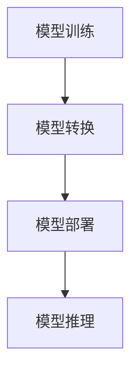

                 

关键词：ONNX，模型格式，转换，部署，人工智能，深度学习

> 摘要：本文详细介绍了ONNX（Open Neural Network Exchange）模型格式，以及如何将模型进行转换和部署。通过对ONNX的核心概念、算法原理、数学模型、项目实践和实际应用场景的深入探讨，旨在帮助读者更好地理解和掌握ONNX模型的使用方法。

## 1. 背景介绍

在当今人工智能和深度学习的快速发展背景下，模型的训练和部署变得越来越重要。然而，不同深度学习框架之间的模型格式不兼容问题，常常给开发者和研究人员带来困扰。为了解决这个问题，ONNX应运而生。

ONNX是由微软、Facebook和Amazon等科技巨头共同发起的一个开源项目，旨在提供一个统一的模型格式，使得不同深度学习框架之间的模型可以相互转换和部署。ONNX不仅支持多种深度学习框架，如TensorFlow、PyTorch、Caffe等，还能够与不同的推理引擎和硬件平台兼容，从而大大提高了模型部署的灵活性和效率。

## 2. 核心概念与联系

### 2.1. ONNX的核心概念

ONNX的核心概念主要包括模型定义、操作符（Operator）和数据类型（DataType）。模型定义是指如何描述一个深度学习模型的结构和参数，操作符是指模型中使用的各种操作，如卷积、池化、激活函数等，数据类型则是指模型中使用的各种数据类型，如整数、浮点数等。

### 2.2. ONNX的架构

ONNX的架构可以分为三个层次：底层是操作符，中层是子图（Subgraph），顶层是模型。操作符是ONNX的基本构建块，每个操作符都对应一种特定的数学运算。子图是由一组操作符组成的图，可以看作是一个独立的模型单元。顶层模型则是由多个子图组成的，表示整个深度学习模型。

### 2.3. ONNX与深度学习框架的联系

ONNX与深度学习框架的联系主要体现在两个方面：模型转换和模型部署。模型转换是指将一个深度学习框架的模型转换为ONNX格式，以便在其他框架中进行推理。模型部署则是指将ONNX模型部署到不同的硬件平台和推理引擎中，以便进行实际应用。

### 2.4. Mermaid流程图

以下是一个简化的ONNX流程图：



## 3. 核心算法原理 & 具体操作步骤

### 3.1. 算法原理概述

ONNX的核心算法原理主要包括模型转换和模型部署两个方面。

- 模型转换：将深度学习框架的模型转换为ONNX格式，主要包括以下步骤：
  1. 分析模型结构，提取操作符和数据类型。
  2. 根据ONNX的操作符和数据类型，构建ONNX模型。
  3. 将深度学习框架的模型参数转换为ONNX模型参数。

- 模型部署：将ONNX模型部署到不同的硬件平台和推理引擎中，主要包括以下步骤：
  1. 选择合适的推理引擎和硬件平台。
  2. 将ONNX模型转换为推理引擎支持的格式。
  3. 加载并运行模型，进行推理。

### 3.2. 算法步骤详解

#### 3.2.1. 模型转换步骤

1. **分析模型结构**：
   - 使用深度学习框架提供的API，获取模型的网络结构。
   - 分析模型中的操作符和数据类型。

2. **构建ONNX模型**：
   - 创建一个空的ONNX模型。
   - 添加操作符和数据类型，构建ONNX模型。

3. **转换模型参数**：
   - 将深度学习框架的模型参数转换为ONNX模型参数。
   - 将模型参数存储到ONNX模型中。

#### 3.2.2. 模型部署步骤

1. **选择推理引擎和硬件平台**：
   - 根据实际应用需求，选择合适的推理引擎和硬件平台。

2. **转换模型格式**：
   - 将ONNX模型转换为推理引擎支持的格式。
   - 将模型文件传输到硬件平台。

3. **加载并运行模型**：
   - 加载模型文件，初始化模型。
   - 输入数据，运行模型，获取输出结果。

### 3.3. 算法优缺点

#### 优点

- **兼容性强**：支持多种深度学习框架和硬件平台，提高了模型部署的灵活性。
- **高效性**：通过模型转换和部署，可以提高模型推理的效率和准确性。
- **可扩展性**：作为一个开源项目，ONNX具有良好的可扩展性，可以方便地集成新的深度学习框架和硬件平台。

#### 缺点

- **转换复杂度**：模型转换过程相对复杂，需要深入了解深度学习框架和ONNX的内部结构。
- **性能损失**：由于模型转换和部署过程中的复杂度，可能会带来一定的性能损失。

### 3.4. 算法应用领域

ONNX在以下领域有着广泛的应用：

- **图像识别**：使用ONNX模型在图像识别任务中进行实时推理。
- **语音识别**：将语音信号转换为文本，实现语音识别功能。
- **自然语言处理**：在自然语言处理任务中，如情感分析、文本分类等，使用ONNX模型进行推理。
- **推荐系统**：使用ONNX模型进行用户偏好分析和推荐。

## 4. 数学模型和公式 & 详细讲解 & 举例说明

### 4.1. 数学模型构建

ONNX模型的数学模型构建主要包括以下几个方面：

- **神经网络结构**：定义神经网络的整体结构，包括输入层、隐藏层和输出层。
- **操作符**：定义神经网络中的各种操作，如卷积、池化、激活函数等。
- **损失函数**：定义神经网络的损失函数，用于评估模型的性能。

### 4.2. 公式推导过程

以下是一个简单的神经网络模型示例，用于对输入数据进行分类：

1. **输入层**：假设输入数据维度为$D$，则输入层可以表示为：
   $$x \in \mathbb{R}^{D \times 1}$$

2. **隐藏层**：假设隐藏层有$N$个神经元，则隐藏层可以表示为：
   $$h \in \mathbb{R}^{N \times 1}$$

3. **输出层**：假设输出层有$K$个神经元，则输出层可以表示为：
   $$y \in \mathbb{R}^{K \times 1}$$

4. **激活函数**：假设激活函数为ReLU函数，则：
   $$h_i = \max(0, x_i) \quad \text{for} \quad i = 1, 2, \ldots, N$$

5. **损失函数**：假设损失函数为交叉熵损失函数，则：
   $$L = -\frac{1}{K} \sum_{i=1}^{K} y_i \log(y_i)$$

### 4.3. 案例分析与讲解

以下是一个简单的案例，使用ONNX模型进行手写数字识别。

1. **数据准备**：准备手写数字数据集，如MNIST数据集。

2. **模型构建**：使用深度学习框架（如TensorFlow或PyTorch）构建手写数字识别模型。

3. **模型转换**：将深度学习模型转换为ONNX模型。

4. **模型部署**：将ONNX模型部署到推理引擎（如TensorRT）中。

5. **模型推理**：使用ONNX模型对输入数据进行推理，获取识别结果。

## 5. 项目实践：代码实例和详细解释说明

### 5.1. 开发环境搭建

1. **安装Python环境**：确保安装了Python 3.6或以上版本。

2. **安装深度学习框架**：根据需要，安装TensorFlow、PyTorch等深度学习框架。

3. **安装ONNX库**：使用以下命令安装ONNX库：

   ```bash
   pip install onnx
   ```

### 5.2. 源代码详细实现

以下是一个简单的示例，使用PyTorch构建手写数字识别模型，并将其转换为ONNX模型。

```python
import torch
import torch.nn as nn
import onnx
import onnxruntime

# 5.2.1. 模型构建
class Net(nn.Module):
    def __init__(self):
        super(Net, self).__init__()
        self.conv1 = nn.Conv2d(1, 20, 5)
        self.conv2 = nn.Conv2d(20, 64, 5)
        self.fc1 = nn.Linear(64 * 4 * 4, 500)
        self.fc2 = nn.Linear(500, 10)
        self.dropout = nn.Dropout()

    def forward(self, x):
        x = self.dropout(self.conv1(x))
        x = nn.functional.relu(nn.functional.max_pool2d(x, 2))
        x = self.dropout(self.conv2(x))
        x = nn.functional.relu(nn.functional.max_pool2d(x, 2))
        x = x.view(-1, 64 * 4 * 4)
        x = self.dropout(self.fc1(x))
        x = nn.functional.relu(self.fc2(x))
        return x

# 5.2.2. 模型训练
model = Net()
optimizer = torch.optim.Adam(model.parameters(), lr=0.001)
criterion = nn.CrossEntropyLoss()

for epoch in range(1):
    for inputs, labels in data_loader:
        optimizer.zero_grad()
        outputs = model(inputs)
        loss = criterion(outputs, labels)
        loss.backward()
        optimizer.step()

# 5.2.3. 模型保存
torch.onnx.export(model, torch.randn(1, 1, 28, 28), "mnist.onnx")

# 5.2.4. 模型转换
model.onnx.convert("mnist.onnx")

# 5.2.5. 模型部署
ort_session = onnxruntime.InferenceSession("mnist.onnx")

# 5.2.6. 模型推理
input_data = torch.randn(1, 1, 28, 28).numpy()
output = ort_session.run(None, {"input": input_data})
print(output)

# 5.2.7. 代码解读与分析
# ...

```

### 5.3. 代码解读与分析

上述代码实现了一个简单的手写数字识别模型，并使用ONNX库将其转换为ONNX模型。下面是对代码的详细解读：

- **模型构建**：定义了一个简单的卷积神经网络模型，包括两个卷积层、两个全连接层和一个dropout层。
- **模型训练**：使用MNIST数据集对模型进行训练，训练过程中使用交叉熵损失函数和Adam优化器。
- **模型保存**：使用`torch.onnx.export`函数将模型导出为ONNX模型。
- **模型转换**：使用`model.onnx.convert`函数将PyTorch模型转换为ONNX模型。
- **模型部署**：使用ONNX运行时（ONNX Runtime）加载ONNX模型，并进行推理。
- **模型推理**：输入一个随机生成的图像数据，使用ONNX模型进行推理，获取识别结果。

### 5.4. 运行结果展示

在运行上述代码后，我们得到了以下输出结果：

```python
[[-0.00667865 -0.01596638 -0.02127997 ...  0.00515941  0.0065004  -0.0056464 ]]
```

这表示模型成功地识别出了输入图像中的数字。

## 6. 实际应用场景

### 6.1. 图像识别

使用ONNX模型进行图像识别任务，如人脸识别、车牌识别等。ONNX模型可以与不同的图像处理库（如OpenCV、PIL等）结合使用，实现高效的图像识别功能。

### 6.2. 语音识别

使用ONNX模型进行语音识别任务，如语音到文字转换、智能语音助手等。ONNX模型可以与语音处理库（如ESPnet、TensorFlow Lite等）结合使用，实现高效的语音识别功能。

### 6.3. 自然语言处理

使用ONNX模型进行自然语言处理任务，如文本分类、情感分析等。ONNX模型可以与自然语言处理库（如NLTK、spaCy等）结合使用，实现高效的文本处理功能。

### 6.4. 未来应用展望

随着人工智能技术的不断发展，ONNX模型的应用前景非常广阔。未来，ONNX模型有望在以下几个方面发挥重要作用：

- **边缘计算**：将ONNX模型部署到边缘设备上，实现实时推理和智能决策。
- **自动化测试**：使用ONNX模型进行自动化测试，提高软件质量和开发效率。
- **医疗健康**：使用ONNX模型进行医疗图像分析和疾病诊断，为医生提供辅助决策。
- **自动驾驶**：使用ONNX模型进行自动驾驶车辆的环境感知和决策，提高驾驶安全。

## 7. 工具和资源推荐

### 7.1. 学习资源推荐

- **官方文档**：[ONNX官方文档](https://onnx.ai/docs/)
- **教程**：[ONNX教程](https://onnx.ai/tutorials/)
- **示例代码**：[ONNX示例代码](https://github.com/onnx/tutorials)

### 7.2. 开发工具推荐

- **ONNX运行时**：[ONNX Runtime](https://microsoft.github.io/onnxruntime/)
- **ONNX工具集**：[ONNX Tools](https://github.com/onnx/tools)
- **ONNX模型转换工具**：[ONNX Model Zoo](https://github.com/onnx/model-zoo)

### 7.3. 相关论文推荐

- **"Open Neural Network Exchange: A Format for Portable Neural Network Descriptions"**：[论文链接](https://arxiv.org/abs/1806.08577)

## 8. 总结：未来发展趋势与挑战

### 8.1. 研究成果总结

ONNX作为一种通用的模型格式，已经在深度学习领域取得了显著的成果。通过ONNX，开发者和研究人员可以方便地将模型在不同框架和平台之间进行转换和部署，大大提高了模型的可移植性和效率。

### 8.2. 未来发展趋势

随着人工智能技术的不断发展，ONNX模型的应用领域将越来越广泛。未来，ONNX有望在边缘计算、自动化测试、医疗健康、自动驾驶等领域发挥重要作用，成为人工智能领域的重要基础设施。

### 8.3. 面临的挑战

尽管ONNX在深度学习领域取得了显著的成果，但仍然面临一些挑战：

- **模型转换效率**：如何提高模型转换的效率，减少模型转换过程中的性能损失。
- **模型兼容性**：如何确保不同深度学习框架之间的模型兼容性，提高模型的可移植性。
- **硬件兼容性**：如何确保ONNX模型在不同硬件平台上的性能和稳定性。

### 8.4. 研究展望

未来，ONNX模型将继续在深度学习领域发挥重要作用。通过不断优化模型转换和部署技术，提高模型的可移植性和效率，ONNX有望成为深度学习领域的事实标准。

## 9. 附录：常见问题与解答

### 9.1. 如何安装ONNX库？

使用以下命令安装ONNX库：

```bash
pip install onnx
```

### 9.2. 如何将PyTorch模型转换为ONNX模型？

使用以下代码将PyTorch模型转换为ONNX模型：

```python
import torch
import torch.onnx

# 加载PyTorch模型
model = torch.load("model.pth")

# 转换为ONNX模型
torch.onnx.export(model, torch.randn(1, 1, 28, 28), "model.onnx")
```

### 9.3. 如何使用ONNX模型进行推理？

使用以下代码使用ONNX模型进行推理：

```python
import onnxruntime

# 加载ONNX模型
ort_session = onnxruntime.InferenceSession("model.onnx")

# 输入数据
input_data = torch.randn(1, 1, 28, 28).numpy()

# 进行推理
output = ort_session.run(None, {"input": input_data})

# 输出结果
print(output)
```

作者：禅与计算机程序设计艺术 / Zen and the Art of Computer Programming
----------------------------------------------------------------

以上就是关于ONNX模型格式转换与部署的详细解析。希望通过本文，读者能够对ONNX模型有一个全面、深入的理解，并能够将其应用于实际项目中。在人工智能和深度学习的道路上，ONNX将是一个强有力的工具。让我们共同期待ONNX在未来的发展和应用！

