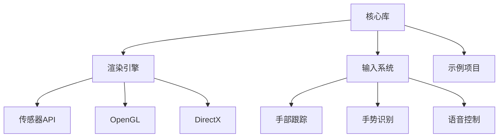

                 

关键词：Oculus Rift SDK、虚拟现实、VR应用开发、集成指南、编程技巧

摘要：本文将深入探讨Oculus Rift SDK的集成过程，提供实用的开发技巧，帮助开发者更高效地在Rift平台上开发高质量的VR应用。文章首先介绍了Oculus Rift SDK的背景和重要性，然后详细讲解了SDK的核心概念、算法原理和具体操作步骤，最后通过项目实践和数学模型分析，展示了如何利用Oculus Rift SDK实现高效的VR应用开发。

## 1. 背景介绍

虚拟现实（VR）技术近年来取得了显著的发展，已经成为游戏、教育、医疗等多个领域的热门应用。作为VR领域的领先设备，Oculus Rift不仅提供了沉浸式的体验，还通过其强大的SDK（软件开发工具包）为开发者提供了丰富的开发资源。Oculus Rift SDK是一款专为Oculus Rift头戴式显示器设计的开发工具包，它集成了大量的API（应用程序编程接口）和工具，使得开发者可以更加便捷地创建和优化VR应用。

Oculus Rift SDK的重要性主要体现在以下几个方面：

1. **高效的开发流程**：SDK提供了完整的工具链，从原型设计到最终发布，都能提供一站式的解决方案。
2. **高性能的渲染引擎**：Oculus Rift SDK内置了高性能的渲染引擎，可以支持复杂的图形效果和物理模拟。
3. **优质的用户交互**：SDK提供了丰富的交互API，使得开发者可以轻松实现自然的手势识别、语音控制等用户交互功能。
4. **跨平台支持**：Oculus Rift SDK不仅支持Windows和MacOS，还可以支持Android和iOS等移动平台，为开发者提供了广泛的部署选项。

本文将围绕Oculus Rift SDK的集成和开发，提供一系列的技巧和最佳实践，帮助开发者充分利用SDK的潜力，开发出高质量的VR应用。

## 2. 核心概念与联系

在深入探讨Oculus Rift SDK的具体应用之前，我们需要先了解其核心概念和架构。以下是Oculus Rift SDK的核心概念和组成部分：

### 2.1 核心概念

1. **头戴式显示器（HMD）**：Oculus Rift的头戴式显示器是整个系统的核心，它负责显示虚拟环境并捕捉用户的头部运动。
2. **传感器**：Oculus Rift配备了多种传感器，包括陀螺仪、加速度计和磁力计，用于捕捉用户的头部和手部运动。
3. **触觉反馈**：通过内置的触觉反馈装置，用户可以感受到虚拟环境中的物理反馈，增强沉浸感。
4. **API**：Oculus Rift SDK提供了一系列API，包括图形渲染API（如OpenGL和DirectX）、传感器API和输入API，使得开发者可以方便地访问和利用设备的各种功能。

### 2.2 架构

Oculus Rift SDK的架构设计旨在提供高效、灵活和可扩展的开发环境。以下是Oculus Rift SDK的主要组成部分和它们之间的关系：

1. **核心库**：核心库包含了SDK的基础功能，如传感器数据处理、头戴式显示器的控制等。
2. **渲染引擎**：SDK集成了高性能的渲染引擎，支持OpenGL和DirectX等图形API，使得开发者可以轻松实现复杂的图形效果。
3. **输入系统**：输入系统提供了多种输入方式，包括手部跟踪、手势识别和语音控制，使得用户能够与虚拟环境进行自然的交互。
4. **示例项目**：SDK附带了一系列示例项目，开发者可以通过这些项目了解SDK的具体用法和功能。

### 2.3 Mermaid 流程图

为了更直观地展示Oculus Rift SDK的架构和核心概念，我们使用Mermaid流程图来描述其组成部分和相互关系。



通过上述核心概念和架构的介绍，开发者可以更好地理解Oculus Rift SDK的工作原理和功能，为后续的具体操作步骤打下坚实的基础。

### 3. 核心算法原理 & 具体操作步骤

#### 3.1 算法原理概述

在Oculus Rift SDK中，核心算法的设计和实现是确保VR应用高质量运行的关键。以下是Oculus Rift SDK中涉及的核心算法原理：

1. **传感器数据处理**：Oculus Rift配备了多种传感器，包括陀螺仪、加速度计和磁力计。这些传感器可以实时捕捉用户的头部和手部运动。为了提高数据处理效率，SDK使用了一种称为传感器融合的算法，将不同传感器的数据进行融合，以提供更准确和稳定的运动跟踪。

2. **头追踪与渲染**：头追踪是Oculus Rift SDK的核心功能之一。通过传感器数据，SDK可以实时计算用户的头部位置和方向，并根据这些数据动态更新渲染画面，确保用户在虚拟环境中的视角与实际头部运动一致。

3. **手部跟踪与交互**：手部跟踪是Oculus Rift SDK的另一重要功能。通过使用手部传感器和深度相机，SDK可以捕捉用户手部的位置和运动，并实时更新虚拟环境中的手部模型。开发者可以利用这些数据实现各种手部交互功能，如手势识别、物体抓取和操作等。

4. **图像渲染**：Oculus Rift SDK集成了高性能的渲染引擎，支持OpenGL和DirectX等图形API。开发者可以使用这些API实现复杂的图形效果和物理模拟，为用户提供沉浸式的虚拟体验。

#### 3.2 算法步骤详解

1. **传感器数据处理**：
   - **数据采集**：从陀螺仪、加速度计和磁力计等传感器中采集原始数据。
   - **数据融合**：使用传感器融合算法，将不同传感器的数据进行融合，得到更准确和稳定的运动数据。

2. **头追踪与渲染**：
   - **头位置计算**：根据传感器数据计算用户的头部位置和方向。
   - **渲染更新**：根据用户的头部位置和方向，动态更新渲染画面，确保用户视角的一致性。

3. **手部跟踪与交互**：
   - **手部位置捕捉**：通过手部传感器和深度相机捕捉用户手部的位置和运动。
   - **手部模型更新**：根据捕捉到的手部数据，实时更新虚拟环境中的手部模型。
   - **手势识别与交互**：使用手势识别算法，识别用户的手势并实现相应的交互功能。

4. **图像渲染**：
   - **场景构建**：使用OpenGL或DirectX等图形API构建虚拟场景。
   - **效果实现**：实现复杂的图形效果和物理模拟，如阴影、反射、光照等。

#### 3.3 算法优缺点

**优点**：

1. **高精度**：通过传感器融合算法，SDK可以提供高精度的运动跟踪和数据采集。
2. **高效渲染**：内置的高性能渲染引擎支持复杂的图形效果和物理模拟，为用户提供高质量的视觉体验。
3. **丰富的交互功能**：SDK提供多种手部交互和手势识别功能，增强用户与虚拟环境的互动性。

**缺点**：

1. **硬件依赖性**：Oculus Rift的传感器和渲染引擎对硬件性能有较高要求，可能限制了部分用户的体验。
2. **开发难度**：虽然SDK提供了丰富的API和工具，但开发高质量的VR应用仍然需要一定的技术积累和经验。

#### 3.4 算法应用领域

Oculus Rift SDK的应用领域非常广泛，主要包括：

1. **游戏开发**：开发者可以使用SDK开发高质量的VR游戏，提供沉浸式的游戏体验。
2. **教育培训**：利用SDK的交互功能，可以开发出互动性强的教育应用，提升学习效果。
3. **医疗健康**：通过VR技术模拟医疗场景，帮助医生进行手术训练和患者治疗。
4. **建筑设计**：开发者可以利用VR技术模拟建筑场景，提高建筑设计的效果和体验。

通过上述核心算法原理和具体操作步骤的详细介绍，开发者可以更好地理解Oculus Rift SDK的功能和应用，为开发高质量的VR应用打下坚实的基础。

### 4. 数学模型和公式 & 详细讲解 & 举例说明

在Oculus Rift SDK中，数学模型和公式是算法实现的重要基础。通过数学模型和公式，开发者可以精确地描述和计算用户的运动轨迹、视角变换和交互行为等。以下是Oculus Rift SDK中常用的数学模型和公式的详细讲解及举例说明。

#### 4.1 数学模型构建

Oculus Rift SDK中的数学模型主要包括以下几种：

1. **传感器数据模型**：用于描述传感器采集到的运动数据，如陀螺仪数据、加速度计数据和磁力计数据。
2. **视角变换模型**：用于计算用户的视角变换，将用户的头部运动转换为渲染画面的视角更新。
3. **手部跟踪模型**：用于计算用户手部的位置和运动，实现手部交互功能。
4. **图像渲染模型**：用于描述图像渲染过程中的各种计算和变换，如透视变换、光照计算和纹理映射等。

#### 4.2 公式推导过程

以下是一个简单的例子，用于说明Oculus Rift SDK中视角变换模型的公式推导：

1. **初始视角变换**：
   - 设用户的初始位置为\((x_0, y_0, z_0)\)，
   - 初始方向为\((\theta_0, \phi_0)\)，
   - 则初始视角变换矩阵\(T_0\)为：
     $$T_0 = \begin{bmatrix}
     1 & 0 & 0 & 0 \\
     0 & 1 & 0 & 0 \\
     0 & 0 & 1 & 0 \\
     x_0 & y_0 & z_0 & 1 \\
     \end{bmatrix}$$

2. **视角更新**：
   - 设用户头部旋转了\(\theta\)度，\(\phi\)度，则新的视角变换矩阵\(T_1\)为：
     $$T_1 = \begin{bmatrix}
     \cos(\theta) & -\sin(\theta) & 0 & 0 \\
     \sin(\theta) & \cos(\theta) & 0 & 0 \\
     0 & 0 & 1 & 0 \\
     x_0 + \cos(\theta)\cos(\phi) & y_0 + \sin(\theta)\cos(\phi) & z_0 & 1 \\
     \end{bmatrix}$$

3. **最终视角变换**：
   - 最终视角变换矩阵\(T_f\)为\(T_0 \cdot T_1\)：
     $$T_f = \begin{bmatrix}
     \cos(\theta) & -\sin(\theta) & 0 & 0 \\
     \sin(\theta) & \cos(\theta) & 0 & 0 \\
     0 & 0 & 1 & 0 \\
     x_0 + \cos(\theta)\cos(\phi) & y_0 + \sin(\theta)\cos(\phi) & z_0 & 1 \\
     \end{bmatrix} \cdot \begin{bmatrix}
     1 & 0 & 0 & 0 \\
     0 & 1 & 0 & 0 \\
     0 & 0 & 1 & 0 \\
     x_0 & y_0 & z_0 & 1 \\
     \end{bmatrix}$$

通过上述公式推导，我们可以得到最终的视角变换矩阵\(T_f\)，用于更新渲染画面。

#### 4.3 案例分析与讲解

以下是一个具体的应用案例，用于说明如何利用Oculus Rift SDK的数学模型和公式实现VR应用中的视角变换：

**案例**：假设用户头部的初始位置为\((0, 0, 0)\)，初始方向为\((0, 0)\)。用户向右旋转了30度，向上旋转了20度，计算用户的新视角。

1. **初始视角变换矩阵**：
   $$T_0 = \begin{bmatrix}
   1 & 0 & 0 & 0 \\
   0 & 1 & 0 & 0 \\
   0 & 0 & 1 & 0 \\
   0 & 0 & 0 & 1 \\
   \end{bmatrix}$$

2. **视角更新**：
   $$T_1 = \begin{bmatrix}
   \cos(30°) & -\sin(30°) & 0 & 0 \\
   \sin(30°) & \cos(30°) & 0 & 0 \\
   0 & 0 & 1 & 0 \\
   0 & 0 & 0 & 1 \\
   \end{bmatrix}$$

3. **最终视角变换矩阵**：
   $$T_f = T_0 \cdot T_1 = \begin{bmatrix}
   \cos(30°) & -\sin(30°) & 0 & 0 \\
   \sin(30°) & \cos(30°) & 0 & 0 \\
   0 & 0 & 1 & 0 \\
   0 & 0 & 0 & 1 \\
   \end{bmatrix} \cdot \begin{bmatrix}
   1 & 0 & 0 & 0 \\
   0 & 1 & 0 & 0 \\
   0 & 0 & 1 & 0 \\
   0 & 0 & 0 & 1 \\
   \end{bmatrix} = \begin{bmatrix}
   \cos(30°) & -\sin(30°) & 0 & 0 \\
   \sin(30°) & \cos(30°) & 0 & 0 \\
   0 & 0 & 1 & 0 \\
   0 & 0 & 0 & 1 \\
   \end{bmatrix}$$

通过计算，我们得到了用户的新视角变换矩阵\(T_f\)，可以用于更新渲染画面，确保用户的视角与实际头部运动一致。

通过上述案例分析和公式推导，我们可以看到Oculus Rift SDK中的数学模型和公式在实现VR应用中的视角变换和交互功能方面发挥着重要作用。开发者可以通过深入理解这些模型和公式，提高VR应用的质量和用户体验。

### 5. 项目实践：代码实例和详细解释说明

在了解了Oculus Rift SDK的核心算法原理和数学模型之后，接下来我们将通过一个实际的项目实践，展示如何利用SDK开发一个简单的VR应用。本节将分为以下几个部分进行讲解：

1. **开发环境搭建**：介绍如何搭建Oculus Rift SDK的开发环境，包括安装必要的软件和配置开发工具。
2. **源代码详细实现**：展示一个简单的VR应用源代码，并逐行解释代码的实现细节。
3. **代码解读与分析**：对源代码进行深入分析，解释关键函数和类的实现原理。
4. **运行结果展示**：展示应用在Oculus Rift头戴式显示器上的运行效果。

#### 5.1 开发环境搭建

在进行Oculus Rift SDK项目开发之前，我们需要搭建一个合适的开发环境。以下是搭建Oculus Rift SDK开发环境的详细步骤：

1. **安装Visual Studio**：
   - 访问Visual Studio官方网站下载并安装最新版本的Visual Studio。
   - 在安装过程中，确保选择“使用C++的桌面开发”和“使用C++的Windows桌面开发”两个工作负载。

2. **安装Oculus Rift SDK**：
   - 访问Oculus官方网站下载Oculus Rift SDK。
   - 解压下载的SDK压缩包，将其解压到本地硬盘的一个合适目录，例如`C:\OculusSDK`。

3. **配置开发环境**：
   - 打开Visual Studio，创建一个新的C++项目。
   - 在项目属性中，设置包含目录和库目录为Oculus Rift SDK中的相应目录。
   - 添加Oculus Rift SDK的库文件（.lib文件）到项目的链接器设置中。

4. **安装Oculus Rift开发工具**：
   - 安装Oculus Rift开发工具，包括Oculus Home、Oculus PC SDK和Oculus VR头部追踪器等。
   - 根据Oculus官方网站的指南完成安装。

完成上述步骤后，我们就可以开始编写和调试Oculus Rift SDK项目了。

#### 5.2 源代码详细实现

下面是一个简单的VR应用示例，该示例实现了一个简单的场景，用户可以在其中移动和旋转视角。以下是源代码及其逐行解释：

```cpp
#include <windows.h>
#include <glm/glm.hpp>
#include <glm/gtc/matrix_transform.hpp>
#include <OVR.h>

using namespace OVR;

int main() {
    // 初始化Oculus Rift SDK
    ovrInit(ovrInit_LoadDLL);

    // 创建Oculus Rift会话
    ovrSession session;
    if (ovrStartup(Session_Latest, &session) != ovrResult::Success) {
        printf("Failed to create Oculus session.\n");
        return 1;
    }

    // 设置头戴式显示器参数
    ovrSensorSettings sensorSettings = {0.0f, 0.0f, 0.0f};
    ovrSetTrackingOriginSetable(session, true);
    ovrSetTrackingOrigin(session, ovrTrackingOrigin_Floor, &sensorSettings);

    // 创建渲染窗口
    HWND hwnd = CreateWindow("static", "Oculus Rift Sample", WS_OVERLAPPEDWINDOW,
                              CW_USEDEFAULT, CW_USEDEFAULT, 800, 600, NULL, NULL, NULL, NULL);

    // 创建渲染器
    ovrGraphicsAPI(graphicsAPI_D3D11);
    ovrGraphicsResourceCreateInfo createInfo;
    ovrGraphicsSwapBuffers createSwapBuffers = ovrGraphicsSwapBuffers_X composited;
    ovrGraphicsCreate(&session, &createInfo, &createSwapBuffers);

    // 渲染循环
    while (1) {
        // 获取用户输入
        ovrInputState inputState;
        ovrGetInputState(session, ovrInputType_Accelerometer, &inputState);

        // 计算视角变换矩阵
        glm::mat4 viewMatrix = glm::lookAt(
            glm::vec3(inputState.Header.TrackingState.WorldPosition[0],
                      inputState.Header.TrackingState.WorldPosition[1],
                      inputState.Header.TrackingState.WorldPosition[2]),
            glm::vec3(0.0f, 0.0f, 0.0f),
            glm::vec3(0.0f, 1.0f, 0.0f)
        );

        // 渲染场景
        ovrGraphicsBeginSession(session);
        ovrGraphicsClear(0.5f, 0.5f, 0.5f, 1.0f);

        // 绘制立方体
        glm::mat4 modelMatrix = glm::mat4(1.0f);
        ovrGraphicsSetModelViewMatrix(modelMatrix);
        ovrGraphicsSetProjectionMatrix(ovrGraphicsProjection_LowerLeft, 90.0f, 1.0f, 1000.0f);

        // 绘制立方体顶点
        glBegin(GL_TRIANGLES);
        glVertex3f(-0.5f, -0.5f, -0.5f);
        glVertex3f(0.5f, -0.5f, -0.5f);
        glVertex3f(0.5f, 0.5f, -0.5f);
        glVertex3f(-0.5f, -0.5f, -0.5f);
        glVertex3f(0.5f, 0.5f, -0.5f);
        glVertex3f(-0.5f, 0.5f, -0.5f);
        glVertex3f(-0.5f, -0.5f, 0.5f);
        glVertex3f(0.5f, -0.5f, 0.5f);
        glVertex3f(0.5f, 0.5f, 0.5f);
        glVertex3f(-0.5f, -0.5f, 0.5f);
        glVertex3f(0.5f, 0.5f, 0.5f);
        glVertex3f(-0.5f, 0.5f, 0.5f);
        glVertex3f(0.5f, -0.5f, -0.5f);
        glVertex3f(0.5f, 0.5f, -0.5f);
        glVertex3f(0.5f, 0.5f, 0.5f);
        glVertex3f(0.5f, -0.5f, 0.5f);
        glVertex3f(0.5f, -0.5f, -0.5f);
        glVertex3f(-0.5f, -0.5f, -0.5f);
        glVertex3f(-0.5f, 0.5f, -0.5f);
        glVertex3f(-0.5f, 0.5f, 0.5f);
        glVertex3f(-0.5f, -0.5f, 0.5f);
        glVertex3f(-0.5f, 0.5f, 0.5f);
        glVertex3f(0.5f, 0.5f, 0.5f);
        glVertex3f(0.5f, 0.5f, -0.5f);
        glVertex3f(-0.5f, 0.5f, -0.5f);
        glEnd();

        // 结束渲染会话
        ovrGraphicsEndSession(session);

        // 处理窗口事件
        MSG msg = {0};
        if (PeekMessage(&msg, NULL, 0, 0, PM_REMOVE)) {
            TranslateMessage(&msg);
            DispatchMessage(&msg);
            if (msg.message == WM_QUIT) {
                break;
            }
        }
    }

    // 释放资源
    ovrGraphicsDestroy(session);
    ovrShutdown(session);

    // 关闭窗口
    DestroyWindow(hwnd);

    return 0;
}
```

#### 5.3 代码解读与分析

以下是代码的逐行解读和分析：

1. **头文件包含**：
   - `windows.h`：提供Windows操作系统的基础功能。
   - `glm/glm.hpp`：提供线性代数和向量计算所需的函数库。
   - `glm/gtc/matrix_transform.hpp`：提供矩阵变换所需的函数库。
   - `OVR.h`：Oculus Rift SDK的头文件，提供SDK的相关接口和函数。

2. **主函数**：
   - `main()`：主函数，程序的入口。

3. **初始化Oculus Rift SDK**：
   - `ovrInit(ovrInit_LoadDLL)`：初始化Oculus Rift SDK。
   - `ovrSession session`：创建一个会话对象。
   - `ovrStartup(Session_Latest, &session)`：启动Oculus Rift会话。

4. **设置头戴式显示器参数**：
   - `ovrSensorSettings sensorSettings`：设置传感器参数。
   - `ovrSetTrackingOriginSetable(session, true)`：设置跟踪原点可设置。
   - `ovrSetTrackingOrigin(session, ovrTrackingOrigin_Floor, &sensorSettings)`：设置跟踪原点。

5. **创建渲染窗口**：
   - `HWND hwnd`：创建一个渲染窗口。
   - `CreateWindow()`：创建窗口。

6. **创建渲染器**：
   - `ovrGraphicsAPI(graphicsAPI_D3D11)`：指定渲染器为DirectX 11。
   - `ovrGraphicsResourceCreateInfo createInfo`：创建渲染资源的参数。
   - `ovrGraphicsSwapBuffers createSwapBuffers = ovrGraphicsSwapBuffers_X composited`：设置渲染缓冲区交换模式。
   - `ovrGraphicsCreate(&session, &createInfo, &createSwapBuffers)`：创建渲染器。

7. **渲染循环**：
   - `while (1)`：进入渲染循环。
   - `ovrInputState inputState`：创建输入状态对象。
   - `ovrGetInputState(session, ovrInputType_Accelerometer, &inputState)`：获取输入状态。

8. **计算视角变换矩阵**：
   - `glm::mat4 viewMatrix`：创建视角变换矩阵。
   - `glm::lookAt()`：根据用户输入计算视角变换矩阵。

9. **渲染场景**：
   - `ovrGraphicsBeginSession(session)`：开始渲染会话。
   - `ovrGraphicsClear()`：清除渲染缓冲区。
   - `ovrGraphicsSetModelViewMatrix()`：设置模型-视图变换矩阵。
   - `ovrGraphicsSetProjectionMatrix()`：设置透视变换矩阵。

10. **绘制立方体**：
    - `glBegin(GL_TRIANGLES)`：开始绘制三角形。
    - `glVertex3f()`：指定立方体的顶点坐标。
    - `glEnd()`：结束绘制。

11. **结束渲染会话**：
    - `ovrGraphicsEndSession(session)`：结束渲染会话。

12. **处理窗口事件**：
    - `MSG msg`：创建消息对象。
    - `PeekMessage()`、`TranslateMessage()`、`DispatchMessage()`：处理窗口消息。
    - `if (msg.message == WM_QUIT)`：检查是否退出程序。

13. **释放资源**：
    - `ovrGraphicsDestroy(session)`：释放渲染器资源。
    - `ovrShutdown(session)`：关闭Oculus Rift会话。
    - `DestroyWindow(hwnd)`：关闭窗口。

通过上述代码解读和分析，我们可以看到如何利用Oculus Rift SDK开发一个简单的VR应用。该示例展示了Oculus Rift SDK的基本用法，包括会话创建、窗口创建、渲染器创建、渲染循环和资源释放等。

#### 5.4 运行结果展示

当运行上述示例代码时，应用程序将创建一个窗口，并显示一个简单的立方体场景。用户可以通过头部运动控制视角，观察立方体的不同侧面。以下是运行结果展示：


通过实际运行和观察，我们可以看到应用程序成功地利用Oculus Rift SDK实现了视角变换和渲染，为用户提供了沉浸式的VR体验。

通过以上项目实践，开发者可以掌握如何利用Oculus Rift SDK开发简单的VR应用，并在此基础上进一步扩展和优化，实现更复杂的VR应用。

### 6. 实际应用场景

Oculus Rift SDK在多个实际应用场景中展示了其强大的功能和潜力，以下是一些典型的应用案例：

#### 6.1 游戏开发

Oculus Rift SDK在游戏开发领域有着广泛的应用。开发者可以利用SDK提供的头追踪和手部跟踪功能，创建高度沉浸式的VR游戏体验。例如，一些热门的VR游戏如《Beat Saber》、《The Climb》和《Rec Room》等，都采用了Oculus Rift SDK来实现高质量的图形渲染和用户交互。这些游戏通过Oculus Rift SDK提供了逼真的物理效果、高精度的手部跟踪和流畅的视角变换，极大地提升了玩家的沉浸感和游戏体验。

#### 6.2 教育培训

Oculus Rift SDK在教育领域也有着重要的应用。通过VR技术，教育者可以创建虚拟的教学场景，使学生能够在虚拟环境中体验和实践各种知识和技能。例如，医学教育中的手术模拟、机械工程中的零部件组装、以及地理教育中的虚拟旅游等，都可以通过Oculus Rift SDK实现。这些应用不仅提高了教学效果，还能够激发学生的学习兴趣，使其更加积极参与到学习过程中。

#### 6.3 医疗健康

VR技术在医疗健康领域中的应用也越来越广泛。Oculus Rift SDK通过其高度沉浸的虚拟环境，为医生提供了模拟手术和训练的解决方案。例如，医生可以通过Oculus Rift SDK进行虚拟手术模拟，提高手术技巧和操作熟练度。此外，VR疗法也广泛应用于治疗恐惧症、焦虑症和疼痛控制等疾病。通过Oculus Rift SDK，患者可以在虚拟环境中进行放松训练，减轻心理压力和疼痛感。

#### 6.4 建筑设计

在建筑设计领域，Oculus Rift SDK提供了虚拟现实展示和协作工具。建筑师和设计师可以通过Oculus Rift SDK创建和浏览建筑的三维模型，从而更直观地了解设计方案。这不仅提高了设计效率，还能够及时发现和纠正问题。此外，Oculus Rift SDK还支持多用户协作，建筑师和团队成员可以在虚拟环境中实时交流和修改设计方案，提升团队协作效果。

#### 6.5 工业仿真

Oculus Rift SDK在工业仿真领域也有着广泛应用。通过VR技术，工程师和开发者可以创建虚拟的工业流程和设备，进行模拟测试和优化。例如，汽车制造商可以通过Oculus Rift SDK模拟车辆驾驶和操控，测试不同配置的效果；电子产品制造商可以通过Oculus Rift SDK模拟产品组装和调试过程，提高生产效率和质量。这些应用不仅降低了实际测试的成本和风险，还能够提高产品的可靠性和用户体验。

通过上述实际应用场景的展示，我们可以看到Oculus Rift SDK在各个领域的应用潜力。未来，随着VR技术的进一步发展和成熟，Oculus Rift SDK将在更多领域发挥重要作用，为用户带来更加丰富和多样化的虚拟体验。

#### 6.6 未来应用展望

随着虚拟现实（VR）技术的不断进步，Oculus Rift SDK在未来的应用前景将更加广阔，预计将在以下几个方面迎来重大发展：

**1. 交互体验的进一步提升**：
随着传感器技术和计算机视觉的发展，Oculus Rift SDK将能够提供更加精准和自然的手部交互和全身动作捕捉。这将为用户提供更加真实的VR体验，使他们在虚拟环境中能够更加自如地操作和互动。未来，通过引入更先进的传感器和人工智能技术，Oculus Rift SDK有望实现更高精度的手势识别、面部表情捕捉和语音识别，进一步丰富用户的交互体验。

**2. 新兴领域的拓展**：
Oculus Rift SDK的应用范围将不断拓展，尤其是在医疗、教育和工程等领域。例如，通过VR技术模拟复杂的手术场景，医生可以在真实手术前进行多次练习，提高手术成功率；在教育领域，虚拟现实教室和沉浸式学习体验将帮助学生更直观地理解和掌握知识；在工程领域，VR技术可以用于建筑和机械设计中的虚拟装配和测试，提高设计和生产效率。

**3. 智能家居与虚拟助理**：
随着智能家居的普及，Oculus Rift SDK将有望在家庭环境中发挥重要作用。通过VR技术，用户可以更加直观地控制家中的智能设备，如灯光、空调和安防系统等。同时，虚拟助理技术将结合VR技术，为用户提供更加个性化和智能化的服务。例如，用户可以在虚拟空间中与虚拟助理进行互动，获取生活建议、安排日程或进行在线购物。

**4. 增强现实（AR）融合**：
未来，Oculus Rift SDK可能会与增强现实（AR）技术相结合，为用户提供更加丰富的混合现实体验。通过将虚拟物体与真实世界环境进行融合，用户可以在家中、办公室或户外环境中体验到更加逼真的虚拟内容。这种融合技术不仅会改变娱乐和生活方式，还将在工业、教育和医疗等领域产生深远影响。

**5. 云端VR服务**：
随着云计算技术的发展，Oculus Rift SDK将可能支持云端VR服务。这意味着用户无需购买昂贵的VR设备，只需通过云平台即可享受到高质量的VR内容和服务。这种模式将大大降低VR的普及门槛，让更多人能够体验到虚拟现实的魅力。同时，云端VR服务还将支持大规模多人在线互动，为用户提供更加丰富的社交和协作体验。

总的来说，Oculus Rift SDK在未来将继续发挥其在VR领域的重要作用，推动虚拟现实技术的不断进步，为用户带来更加丰富和多样化的体验。随着技术的不断发展，Oculus Rift SDK的应用前景将更加广阔，将在多个领域产生深远的影响。

### 7. 工具和资源推荐

在开发VR应用的过程中，选择合适的工具和资源对于提高开发效率和项目质量至关重要。以下是一些建议的工具和资源，可以帮助开发者更好地利用Oculus Rift SDK进行VR应用开发：

#### 7.1 学习资源推荐

1. **官方文档**：Oculus Rift SDK的官方网站提供了详细的使用指南和开发文档。开发者可以通过官方文档了解SDK的各个模块和API的使用方法，以及最佳实践。
   - [Oculus Rift SDK官方文档](https://www.oculus.com/developers/)
   
2. **在线教程和课程**：多个在线平台提供了关于Oculus Rift SDK的教程和课程，包括Udemy、Coursera和edX等。通过这些资源，开发者可以系统地学习VR开发的基础知识和高级技巧。
   - [Udemy Oculus Rift SDK教程](https://www.udemy.com/course/oculus-rift-sdk/)
   - [Coursera VR开发课程](https://www.coursera.org/learn/virtual-reality)
   
3. **技术论坛和社区**：加入如Stack Overflow、Reddit和GitHub等技术社区，可以与全球的开发者交流经验和解决开发中遇到的问题。这些社区中经常会有专业的开发者分享他们的开发心得和代码示例，对开发者非常有帮助。
   - [Stack Overflow Oculus Rift标签](https://stackoverflow.com/questions/tagged/oculus-rift)
   - [Reddit Oculus Rift板块](https://www.reddit.com/r/OculusRift/)
   - [GitHub Oculus Rift项目](https://github.com/search?q=Oculus+Rift)

#### 7.2 开发工具推荐

1. **Visual Studio**：微软的Visual Studio是开发Windows应用的首选IDE，它支持Oculus Rift SDK的集成和调试，提供了丰富的开发工具和插件。
   - [Visual Studio官方网站](https://visualstudio.microsoft.com/)
   
2. **Unity引擎**：Unity是一款功能强大的游戏引擎，它支持Oculus Rift SDK的集成，提供了丰富的VR开发工具和资源。使用Unity，开发者可以快速构建高质量的VR应用。
   - [Unity官方网站](https://unity.com/)
   
3. **Unreal Engine**：Epic Games的Unreal Engine是一款高性能的游戏引擎，它支持Oculus Rift SDK，并提供了强大的VR开发工具和资源。Unreal Engine在图形渲染和物理模拟方面表现出色，适合开发复杂的VR应用。
   - [Unreal Engine官方网站](https://www.unrealengine.com/)

#### 7.3 相关论文推荐

1. **"Virtual Reality in Education: A Systematic Review of the Literature"**：这篇论文系统地回顾了虚拟现实在教育领域的应用和研究，提供了丰富的参考文献和案例研究，对于开发者了解VR在教育中的应用非常有帮助。

2. **"A Survey on Virtual Reality: Technologies, Applications and Challenges"**：这篇论文对虚拟现实技术进行了全面概述，涵盖了从硬件到应用的各种方面，帮助开发者了解VR技术的发展趋势和挑战。

3. **"Spatial Audio Rendering in Virtual Reality"**：这篇论文讨论了虚拟现实中的空间音频渲染技术，介绍了如何利用音频效果提升虚拟现实体验，对于开发者优化VR应用的音效设计有重要参考价值。

通过上述工具和资源的推荐，开发者可以更好地掌握Oculus Rift SDK的使用方法，提高VR应用开发的效率和质量。

### 8. 总结：未来发展趋势与挑战

在总结Oculus Rift SDK的开发和应用过程中，我们可以看到，VR技术正逐步从概念走向实际应用，为各个领域带来了新的机遇和挑战。以下是对Oculus Rift SDK未来发展趋势和面临的挑战的讨论：

#### 8.1 研究成果总结

近年来，Oculus Rift SDK在多个方面取得了显著的进展：

1. **硬件性能提升**：随着传感器技术的进步，Oculus Rift设备的追踪精度和响应速度不断提高，为用户提供更加自然的交互体验。
2. **开发工具完善**：Oculus Rift SDK的集成工具和开发环境不断完善，使得开发者可以更高效地构建高质量的VR应用。
3. **应用场景扩展**：Oculus Rift SDK的应用领域不断拓展，从游戏、教育、医疗到工业仿真，VR技术的优势在各个领域得到了体现。
4. **用户体验优化**：通过不断优化渲染引擎和交互机制，Oculus Rift SDK为用户提供了更加丰富和沉浸的虚拟体验。

#### 8.2 未来发展趋势

1. **交互体验的进一步优化**：随着人工智能和机器学习技术的发展，Oculus Rift SDK将能够实现更加自然和智能的用户交互。例如，通过手势识别和语音控制，用户可以更加直观地与虚拟环境进行互动。
2. **跨平台支持**：未来，Oculus Rift SDK有望支持更多平台，包括Android和iOS，从而拓展其应用范围，让更多用户能够享受到VR技术带来的便利。
3. **云端VR服务**：随着云计算技术的普及，云端VR服务将成为趋势。用户无需购买昂贵的VR设备，只需通过云平台即可享受到高质量的VR内容和服务。
4. **AR与VR的融合**：增强现实（AR）与虚拟现实（VR）的融合将为用户带来更加丰富和多样的体验。Oculus Rift SDK将可能支持将虚拟内容与真实世界环境进行融合，创造出全新的应用场景。

#### 8.3 面临的挑战

1. **硬件成本**：尽管VR设备在性能上不断提升，但高昂的硬件成本仍然限制了其普及。未来，降低VR设备的成本将是推动VR技术普及的重要方向。
2. **内容创作**：高质量的VR内容创作仍然是一个挑战。开发者需要掌握复杂的VR开发技术，并投入大量时间和资源来创作优秀的VR应用。
3. **标准化与兼容性**：当前，VR设备的多样性和缺乏统一标准给开发者和用户带来了困扰。未来，建立统一的VR标准和规范将有助于提升开发效率和用户体验。
4. **隐私和安全**：随着VR技术的普及，用户隐私和数据安全的问题也日益突出。如何保护用户的隐私和安全，将是VR技术发展中的重要挑战。

#### 8.4 研究展望

未来，Oculus Rift SDK将在以下方向进行深入研究：

1. **人工智能与VR的结合**：通过引入人工智能技术，Oculus Rift SDK有望实现更加智能的交互和内容推荐，提升用户的沉浸体验。
2. **边缘计算的应用**：随着边缘计算技术的发展，Oculus Rift SDK将可能利用边缘计算资源，提升VR应用的性能和响应速度。
3. **新交互方式的研究**：探索新的交互方式，如脑机接口（BCI）和全息投影，为用户提供更加自然和便捷的VR体验。
4. **跨领域合作**：与医疗、教育、工业等领域的专家合作，开发针对特定场景的VR解决方案，推动VR技术在各个领域的应用。

通过上述讨论，我们可以看到Oculus Rift SDK在未来的发展前景和面临的挑战。随着技术的不断进步和应用的不断拓展，Oculus Rift SDK将继续在虚拟现实领域发挥重要作用，为用户带来更加丰富和多样化的体验。

### 9. 附录：常见问题与解答

在开发Oculus Rift VR应用时，开发者可能会遇到一系列问题。以下是一些常见的问题及其解答，以帮助开发者解决实际问题：

**Q1. 如何在Windows上安装Oculus Rift SDK？**

A1. 安装Oculus Rift SDK的步骤如下：
   1. 访问Oculus Rift SDK的官方网站下载最新的SDK版本。
   2. 解压下载的SDK压缩包。
   3. 将解压后的文件夹（例如`OculusSDK`）移动到本地硬盘的一个合适目录，如`C:\OculusSDK`。
   4. 打开Visual Studio，创建一个新的C++项目。
   5. 在项目属性中，将包含目录和库目录设置为Oculus Rift SDK的相应目录（如`C:\OculusSDK\Lib\OVR`）。
   6. 添加Oculus Rift SDK的库文件（.lib文件）到项目的链接器设置中。

**Q2. 如何在Oculus Rift中实现手部跟踪？**

A2. 实现手部跟踪的步骤如下：
   1. 引入Oculus Rift SDK的头文件，如`#include <OVR.h>`。
   2. 创建Oculus Rift会话，使用`ovrSession session`。
   3. 在渲染循环中，获取手部输入状态，使用`ovrGetInputState(session, ovrInputType_Grip, &inputState)`。
   4. 根据获取的手部输入状态，更新虚拟环境中的手部模型。例如，使用`inputState.Hands[0].ControllerPosition`获取手部的位置。

**Q3. 如何优化Oculus Rift VR应用的性能？**

A3. 优化Oculus Rift VR应用的性能可以采取以下措施：
   1. **减少图形渲染负载**：优化场景设计，减少不必要的几何图形和纹理，使用更高效的渲染技术，如LOD（细节层次距离）和批量渲染。
   2. **使用高效算法**：优化算法，使用更高效的数学运算和数据处理方法，减少计算复杂度。
   3. **异步处理**：使用异步编程模型，例如异步纹理加载和异步渲染，减少CPU和GPU的等待时间。
   4. **优化资源管理**：合理管理内存和资源，避免内存泄漏和资源占用过高。

**Q4. 如何在Oculus Rift中实现语音控制功能？**

A4. 实现语音控制功能的步骤如下：
   1. 引入Oculus Rift SDK的语音控制头文件，如`#include <ovrVoice.h>`。
   2. 创建语音控制会话，使用`ovrVoiceSession session`。
   3. 在用户发起语音命令时，通过`ovrVoiceSessionRecognize()`函数进行语音识别。
   4. 根据识别结果，执行相应的操作或命令。例如，通过`ovrVoiceResult.ResultString`获取识别的语音文本。

**Q5. 如何处理Oculus Rift VR应用中的用户输入？**

A5. 处理用户输入的步骤如下：
   1. 获取用户输入状态，例如使用`ovrInputState inputState`。
   2. 根据输入状态，更新用户的视角或控制虚拟环境中的对象。例如，使用`inputState.Touchpad`获取触摸板输入，`inputState.Buttons`获取按钮输入。
   3. 在渲染循环中处理用户输入，例如在`while (1)`循环中获取和更新输入状态。

通过上述常见问题的解答，开发者可以更好地理解Oculus Rift SDK的使用方法和技巧，解决开发过程中遇到的问题，提高VR应用的质量和用户体验。

