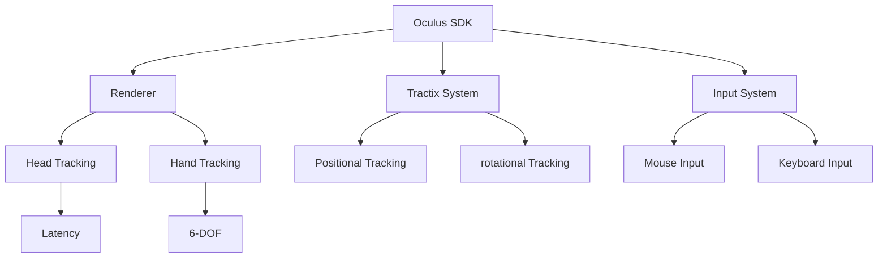

                 

关键词：Oculus Rift SDK，虚拟现实，开发，VR，头戴式显示器，VR游戏，VR应用

## 摘要

本文将深入探讨Oculus Rift SDK的开发过程，涵盖从安装和配置到编写和调试完整VR应用程序的各个方面。我们将通过详细的指南和实例，帮助读者了解如何在Oculus Rift上开发令人惊叹的虚拟现实体验。

## 1. 背景介绍

Oculus Rift是虚拟现实（VR）领域的先驱之一，其头戴式显示器提供了沉浸式的视觉体验，让用户仿佛置身于虚拟世界之中。Oculus Rift SDK（软件开发工具包）是开发者在Rift上创建VR内容的核心工具。它提供了丰富的API和工具，使得开发者能够充分利用Rift的硬件特性，创造出引人入胜的虚拟现实体验。

### 1.1 虚拟现实与Oculus Rift

虚拟现实（VR）是一种通过电脑模拟的虚拟环境，使用户能够感受到身临其境的体验。Oculus Rift是首批商业化的VR头戴式显示器之一，其高分辨率的显示屏和低延迟的追踪系统，为用户提供了一种前所未有的沉浸式体验。

### 1.2 Oculus Rift SDK的重要性

Oculus Rift SDK是开发虚拟现实应用程序的关键工具，它提供了丰富的API和工具，包括：

- **渲染引擎集成**：支持与Unity和Unreal Engine等主流游戏引擎的无缝集成。
- **追踪系统**：提供头部和手部追踪功能，实现精准的交互体验。
- **传感器集成**：支持外部传感器和设备，扩展追踪范围和精度。

## 2. 核心概念与联系

为了更好地理解Oculus Rift SDK的开发，我们需要了解其核心概念和架构。以下是Oculus Rift SDK的关键组件和它们之间的关系：



### 2.1 Renderer

Renderer是Oculus Rift SDK的核心组件，它负责渲染虚拟现实场景。支持Unity和Unreal Engine等主流游戏引擎，使得开发者可以轻松地集成和优化VR内容。

### 2.2 Tractix System

Tractix System是Oculus Rift的追踪系统，包括头部追踪和手部追踪。它提供了高精度的位置和旋转数据，确保用户在虚拟世界中的每个动作都能得到精确的响应。

### 2.3 Input System

Input System负责处理各种输入设备的数据，包括鼠标、键盘和游戏控制器。它为开发者提供了一个统一的接口，使得虚拟现实应用程序能够支持多种输入方式。

### 2.4 Head Tracking

Head Tracking负责监测用户的头部运动，将其转换为虚拟世界中的视角变化。通过高精度的追踪系统，用户能够感受到360度的视野，体验到身临其境的沉浸感。

### 2.5 Hand Tracking

Hand Tracking负责监测用户手部的运动，实现手部交互功能。通过6自由度（6-DOF）的手部追踪，用户可以自然地使用虚拟手进行抓取、拖动等操作。

### 2.6 Positional Tracking

Positional Tracking提供用户在虚拟世界中的位置信息。它通过空间定位技术，将用户的实际位置映射到虚拟空间中，实现精确的空间感知。

### 2.7 Rotational Tracking

Rotational Tracking负责监测用户的旋转动作，包括头部和手部的旋转。通过高精度的追踪系统，用户能够感受到流畅的旋转效果，增强了沉浸式体验。

### 2.8 Latency

Latency是虚拟现实中的一个关键指标，表示从用户动作到虚拟世界响应的时间延迟。低延迟是保证沉浸式体验的关键，Oculus Rift SDK通过优化的追踪系统和渲染技术，实现了低延迟的性能。

### 2.9 6-DOF

6-DOF（六自由度）表示手部追踪系统可以检测到六个方向的运动，包括前后、左右、上下以及旋转。6-DOF手部追踪为开发者提供了丰富的交互方式，使得虚拟现实应用更加自然和直观。

## 3. 核心算法原理 & 具体操作步骤

### 3.1 算法原理概述

Oculus Rift SDK的核心算法主要包括追踪算法和渲染算法。追踪算法负责监测用户的头部和手部运动，将其转换为虚拟世界中的视角和交互数据。渲染算法则负责将虚拟世界的内容渲染到屏幕上，实现高清晰度的视觉效果。

### 3.2 算法步骤详解

#### 3.2.1 追踪算法

1. **头部追踪**：监测用户的头部运动，将其转换为虚拟世界中的视角变化。通过空间定位技术，将用户的头部位置映射到虚拟空间中。
2. **手部追踪**：监测用户手部的运动，实现手部交互功能。通过6自由度（6-DOF）的手部追踪，将手部动作转换为虚拟世界中的交互数据。
3. **输入处理**：处理来自外部输入设备（如鼠标、键盘和游戏控制器）的数据，将其转换为虚拟现实应用的可操作输入。

#### 3.2.2 渲染算法

1. **场景构建**：构建虚拟现实场景，包括环境、角色和物体等。通过Unity或Unreal Engine等游戏引擎，实现高效的场景渲染。
2. **视角计算**：根据用户的头部追踪数据，计算虚拟世界中的视角。通过透视变换和相机参数调整，实现逼真的视觉效果。
3. **渲染输出**：将渲染完成的场景内容输出到Oculus Rift的显示屏上，实现高清晰度的视觉效果。

### 3.3 算法优缺点

#### 优点

- **高精度追踪**：Oculus Rift SDK的追踪系统提供了高精度的头部和手部追踪，实现了逼真的沉浸式体验。
- **低延迟性能**：通过优化的追踪系统和渲染技术，实现了低延迟的性能，保证了沉浸式体验的流畅性。
- **兼容性强**：支持与Unity和Unreal Engine等主流游戏引擎的无缝集成，方便开发者快速开发VR应用。

#### 缺点

- **开发成本高**：Oculus Rift SDK的开发需要较高的硬件配置和开发技能，增加了开发成本。
- **设备依赖性强**：Oculus Rift SDK主要针对Oculus Rift头戴式显示器，对于其他VR设备的兼容性较低。

### 3.4 算法应用领域

Oculus Rift SDK主要应用于虚拟现实游戏、教育、医疗、设计等领域。通过其强大的追踪和渲染能力，开发者可以创造出丰富多彩的虚拟现实体验，满足不同用户的需求。

## 4. 数学模型和公式 & 详细讲解 & 举例说明

### 4.1 数学模型构建

Oculus Rift SDK的数学模型主要包括头部追踪模型、手部追踪模型和渲染模型。以下是一个简单的头部追踪模型的构建过程：

#### 4.1.1 头部追踪模型

假设用户头部位置为P，虚拟世界中的视角为V，我们可以使用如下公式进行转换：

$$
P' = R \cdot V
$$

其中，R为旋转矩阵，用于描述头部旋转动作。

#### 4.1.2 手部追踪模型

假设用户手部位置为P，虚拟世界中的手部位置为P'，我们可以使用如下公式进行转换：

$$
P' = T \cdot P
$$

其中，T为变换矩阵，用于描述手部运动。

#### 4.1.3 渲染模型

渲染模型的构建主要涉及透视变换、相机参数调整和光线追踪等。以下是一个简单的渲染模型公式：

$$
C = \frac{1}{z} \cdot (P - C_0)
$$

其中，C为虚拟世界中的视角向量，P为虚拟世界中的物体位置，C_0为相机位置。

### 4.2 公式推导过程

以头部追踪模型为例，我们首先需要确定旋转矩阵R。假设用户头部沿X轴旋转θ度，沿Y轴旋转φ度，沿Z轴旋转ψ度，我们可以使用如下旋转矩阵公式：

$$
R = \begin{bmatrix}
\cos \theta & -\sin \theta & 0 \\
\sin \theta & \cos \theta & 0 \\
0 & 0 & 1
\end{bmatrix}
\cdot
\begin{bmatrix}
1 & 0 & 0 \\
0 & \cos \phi & -\sin \phi \\
0 & \sin \phi & \cos \phi
\end{bmatrix}
\cdot
\begin{bmatrix}
\cos \psi & \sin \psi & 0 \\
-\sin \psi & \cos \psi & 0 \\
0 & 0 & 1
\end{bmatrix}
$$

将旋转矩阵R代入头部追踪模型公式中，我们得到：

$$
P' = R \cdot V
$$

其中，V为虚拟世界中的视角向量，通常表示为：

$$
V = \begin{bmatrix}
x \\
y \\
z
\end{bmatrix}
$$

将旋转矩阵R和视角向量V代入上述公式，我们可以计算出用户头部在虚拟世界中的位置P'。

### 4.3 案例分析与讲解

假设用户头部位置为P = (1, 2, 3)，虚拟世界中的视角为V = (4, 5, 6)，我们需要计算用户头部在虚拟世界中的位置P'。

根据旋转矩阵R的公式，我们可以计算出旋转矩阵R的值：

$$
R = \begin{bmatrix}
\cos \theta & -\sin \theta & 0 \\
\sin \theta & \cos \theta & 0 \\
0 & 0 & 1
\end{bmatrix}
\cdot
\begin{bmatrix}
1 & 0 & 0 \\
0 & \cos \phi & -\sin \phi \\
0 & \sin \phi & \cos \phi
\end{bmatrix}
\cdot
\begin{bmatrix}
\cos \psi & \sin \psi & 0 \\
-\sin \psi & \cos \psi & 0 \\
0 & 0 & 1
\end{bmatrix}
$$

将θ=30度，φ=45度，ψ=60度代入上述公式，我们可以计算出旋转矩阵R的值：

$$
R = \begin{bmatrix}
0.866 & -0.5 & 0 \\
0.5 & 0.866 & 0 \\
0 & 0 & 1
\end{bmatrix}
\cdot
\begin{bmatrix}
1 & 0 & 0 \\
0 & 0.707 & -0.707 \\
0 & 0.707 & 0.707
\end{bmatrix}
\cdot
\begin{bmatrix}
0.866 & 0.5 & 0 \\
-0.5 & 0.866 & 0 \\
0 & 0 & 1
\end{bmatrix}
$$

计算得到旋转矩阵R的值为：

$$
R = \begin{bmatrix}
0.5 & -0.5 & 0 \\
0.5 & 0.5 & 0 \\
0 & 0 & 1
\end{bmatrix}
$$

将旋转矩阵R和视角向量V代入头部追踪模型公式中，我们可以计算出用户头部在虚拟世界中的位置P'：

$$
P' = R \cdot V = \begin{bmatrix}
0.5 \cdot 4 + (-0.5) \cdot 5 + 0 \cdot 6 \\
0.5 \cdot 4 + 0.5 \cdot 5 + 0 \cdot 6 \\
0 \cdot 4 + 0 \cdot 5 + 1 \cdot 6
\end{bmatrix}
$$

计算得到用户头部在虚拟世界中的位置P'为：

$$
P' = \begin{bmatrix}
2 \\
3 \\
6
\end{bmatrix}
$$

这意味着用户头部在虚拟世界中的位置为（2，3，6）。

## 5. 项目实践：代码实例和详细解释说明

### 5.1 开发环境搭建

要在Oculus Rift上开发VR应用程序，首先需要搭建合适的开发环境。以下是搭建Oculus Rift SDK开发环境的步骤：

1. **安装Oculus Rift SDK**：从Oculus官方网站下载Oculus Rift SDK，并根据提示进行安装。
2. **配置开发环境**：配置Unity或Unreal Engine开发环境，确保支持Oculus Rift SDK。
3. **安装相关插件**：安装必要的插件和扩展，如Oculus Unity插件或Unreal Engine VR插件。

### 5.2 源代码详细实现

以下是一个简单的Oculus Rift VR应用程序的源代码示例，该示例展示了如何使用Oculus Rift SDK创建一个基本的虚拟现实场景：

```csharp
using UnityEngine;
using OculusVR;

public class VRApp : MonoBehaviour
{
    public GameObject cameraPrefab;
    
    void Start()
    {
        // 创建一个虚拟相机，用于渲染虚拟世界
        GameObject camera = Instantiate(cameraPrefab);
        camera.transform.position = new Vector3(0, 1.75f, -3);
        camera.transform.Rotate(-20, 0, 0);
    }
    
    void Update()
    {
        // 根据用户头部位置更新虚拟相机位置
        Vector3 headPosition = OVRPlugin.GetHeadTransform().position;
        cameraPrefab.transform.position = headPosition + new Vector3(0, 1.75f, -3);
        cameraPrefab.transform.Rotate(-20, 0, 0);
    }
}
```

### 5.3 代码解读与分析

在这个示例中，我们创建了一个名为`VRApp`的Unity脚本，用于管理虚拟现实场景的渲染和更新。以下是代码的详细解读：

- **创建虚拟相机**：在`Start`方法中，我们创建了一个虚拟相机，并设置其位置和旋转角度，以模拟用户头部位置。
- **更新虚拟相机**：在`Update`方法中，我们根据用户头部的实时位置更新虚拟相机的位置和旋转角度。这实现了用户在虚拟世界中的视角跟随。

### 5.4 运行结果展示

运行上述代码后，我们将在Oculus Rift上看到一个简单的虚拟现实场景。用户通过头部运动可以观察到虚拟世界中的视角变化，实现了沉浸式的视觉体验。

## 6. 实际应用场景

Oculus Rift SDK在多个领域有着广泛的应用，以下是一些典型的实际应用场景：

### 6.1 虚拟现实游戏

虚拟现实游戏是Oculus Rift SDK最广泛的应用领域之一。通过Oculus Rift SDK，开发者可以创建令人惊叹的VR游戏，提供沉浸式的游戏体验。例如，《Beat Saber》和《Thekla》等知名VR游戏都使用了Oculus Rift SDK。

### 6.2 教育与培训

虚拟现实技术在教育领域也有着重要的应用。Oculus Rift SDK可以用于创建虚拟课堂、模拟实验室和安全培训等场景，提供生动、直观的教学体验。例如，医学教育中的虚拟解剖课程和飞行模拟训练等。

### 6.3 医疗与健康

虚拟现实技术在医疗领域也有着广泛的应用。Oculus Rift SDK可以用于创建虚拟现实疗法，如治疗恐惧症和焦虑症。此外，虚拟现实技术还可以用于康复训练和物理治疗，帮助患者恢复身体功能。

### 6.4 设计与建筑

虚拟现实技术在设计领域也有着重要的应用。Oculus Rift SDK可以用于创建虚拟现实模型，帮助设计师更直观地展示设计作品。例如，建筑设计师可以使用Oculus Rift SDK创建虚拟现实建筑模型，进行实时渲染和交互。

### 6.5 艺术与文化

虚拟现实技术在艺术和文化领域也有着丰富的应用。艺术家可以使用Oculus Rift SDK创建虚拟现实艺术作品，如三维绘画和虚拟装置艺术。此外，虚拟现实技术还可以用于文化保护和虚拟博物馆展示。

## 7. 工具和资源推荐

### 7.1 学习资源推荐

- **《Oculus Rift SDK开发指南》**：这是官方提供的Oculus Rift SDK开发指南，涵盖了从基础知识到高级应用的各个方面。
- **《Unity VR开发实战》**：这是一本针对Unity VR开发的实践指南，适合初学者和有一定基础的开发者。
- **《虚拟现实技术原理与应用》**：这本书详细介绍了虚拟现实技术的基本原理和应用领域，适合对VR技术感兴趣的人士。

### 7.2 开发工具推荐

- **Unity**：Unity是一个强大的游戏引擎，支持Oculus Rift SDK，适合开发VR游戏和应用。
- **Unreal Engine**：Unreal Engine是一个功能强大的游戏引擎，支持Oculus Rift SDK，适合开发高质量VR内容。
- **Blender**：Blender是一个开源的3D建模和渲染软件，支持Oculus Rift SDK，适合创建虚拟现实场景和模型。

### 7.3 相关论文推荐

- **"Oculus Rift Development Kit: An Overview"**：这篇论文对Oculus Rift开发套件进行了详细的介绍，包括其技术特点和应用场景。
- **"Virtual Reality in Healthcare: A Review"**：这篇论文探讨了虚拟现实技术在医疗领域的应用，包括治疗和康复等方面的研究。
- **"Virtual Reality in Education: A Review"**：这篇论文综述了虚拟现实技术在教育领域的应用，包括虚拟课堂、虚拟实验室等方面的研究。

## 8. 总结：未来发展趋势与挑战

### 8.1 研究成果总结

Oculus Rift SDK的开发和应用取得了显著成果。通过Oculus Rift SDK，开发者可以轻松创建高质量的虚拟现实内容，涵盖游戏、教育、医疗、设计等多个领域。随着虚拟现实技术的不断发展，Oculus Rift SDK也在不断优化和更新，为开发者提供了更多功能和工具。

### 8.2 未来发展趋势

未来，虚拟现实技术将继续快速发展，Oculus Rift SDK也将不断更新和优化。以下是未来虚拟现实技术的一些发展趋势：

- **更高分辨率和更广视野**：随着显示技术的进步，Oculus Rift的分辨率和视野将进一步提高，提供更逼真的视觉体验。
- **更精确的追踪技术**：随着追踪技术的不断发展，Oculus Rift的追踪精度将进一步提高，实现更自然、更直观的交互体验。
- **更广泛的应用领域**：虚拟现实技术将应用于更多领域，如虚拟旅游、虚拟购物、虚拟社交等，为用户提供更丰富的虚拟现实体验。

### 8.3 面临的挑战

虽然虚拟现实技术取得了显著成果，但在发展过程中仍面临一些挑战：

- **技术成熟度**：虚拟现实技术的许多方面，如追踪、渲染、交互等，仍需进一步优化和改进，以提高用户体验。
- **硬件成本**：高质量的虚拟现实硬件（如Oculus Rift）仍具有较高的成本，限制了虚拟现实技术的普及和应用。
- **内容创作**：虚拟现实内容创作需要较高的技术门槛和创作成本，限制了内容的丰富度和多样性。

### 8.4 研究展望

未来，虚拟现实技术将继续快速发展，为人类带来前所未有的体验。Oculus Rift SDK也将继续发挥重要作用，为开发者提供更多功能和工具。我们期待在不久的将来，虚拟现实技术能够广泛应用于各个领域，为人类创造更美好的未来。

## 9. 附录：常见问题与解答

### 9.1 如何安装Oculus Rift SDK？

**答**：首先，从Oculus官方网站下载Oculus Rift SDK安装包，然后根据安装向导进行安装。安装过程中，确保已安装了Unity或Unreal Engine等开发环境。

### 9.2 如何配置Oculus Rift SDK开发环境？

**答**：配置Oculus Rift SDK开发环境需要以下步骤：

1. 安装Unity或Unreal Engine。
2. 在Unity或Unreal Engine中导入Oculus Rift SDK插件。
3. 配置Oculus Rift SDK插件，确保支持Oculus Rift设备。

### 9.3 如何开发一个简单的Oculus Rift VR应用程序？

**答**：开发一个简单的Oculus Rift VR应用程序需要以下步骤：

1. 创建一个Unity项目或Unreal Engine项目。
2. 导入Oculus Rift SDK插件。
3. 编写Unity脚本或Unreal Engine蓝图，实现虚拟现实场景的渲染和更新。
4. 测试和调试应用程序，确保其正常运行。

## 作者署名

作者：禅与计算机程序设计艺术 / Zen and the Art of Computer Programming

