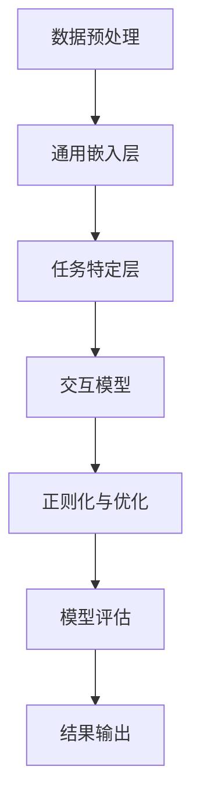

                 

推荐系统是现代互联网生态系统中的一个关键组成部分，它在电子商务、社交媒体、内容平台等多个领域发挥着至关重要的作用。本文将探讨一个统一的推荐系统预训练框架，这一框架不仅能够提高推荐系统的性能，还能够使开发过程更加高效和灵活。

> **关键词**：推荐系统、预训练、深度学习、框架、性能优化、多模态数据、用户体验

> **摘要**：本文首先介绍了推荐系统的发展背景和核心概念，然后详细阐述了统一的推荐系统预训练框架的构建方法、核心算法原理，以及其实际应用场景。通过对数学模型和公式的详细讲解，我们展示了如何通过精确的数学方法来优化推荐系统的性能。接下来，通过一个具体的代码实例，我们深入解析了如何实现这一框架。最后，本文探讨了推荐系统的实际应用场景，并对其未来发展趋势与挑战进行了展望。

## 1. 背景介绍

推荐系统起源于20世纪90年代，其初衷是为了解决信息过载问题，帮助用户发现他们可能感兴趣的内容或产品。随着互联网和电子商务的飞速发展，推荐系统已经成为了许多公司战略的核心。从最初基于内容的推荐、协同过滤，到现在的深度学习推荐，推荐系统的技术不断进步。

深度学习在推荐系统中的应用，使得推荐系统具备了更强的泛化能力和灵活性。然而，深度学习模型的训练过程通常非常耗时且资源消耗巨大，这限制了其在大规模数据集上的应用。为了解决这一问题，预训练技术应运而生。预训练是指在大规模数据集上预先训练模型，然后再通过微调适应特定任务。

统一的推荐系统预训练框架旨在解决以下问题：
- **跨领域适应性**：不同领域的推荐问题可能具有不同的特征和需求，如何设计一个通用的预训练框架以适应多种场景？
- **数据效率**：如何在大规模数据集上高效训练模型，并减少数据预处理的工作量？
- **模型解释性**：深度学习模型通常被视为“黑箱”，如何提高其可解释性，使得用户和开发者能够更好地理解模型的决策过程？
- **实时推荐**：如何在保证推荐质量的同时，实现低延迟的实时推荐？

本文将围绕这些关键问题，详细介绍统一的推荐系统预训练框架的设计和实现。

## 2. 核心概念与联系

### 2.1. 推荐系统的基本概念

推荐系统通常涉及以下几个基本概念：

1. **用户**：推荐系统的目标用户。
2. **物品**：用户可能感兴趣的商品、内容或服务。
3. **评分/行为**：用户对物品的评分或行为，如购买、点击、观看等。
4. **推荐列表**：根据用户的偏好和系统的评估，生成的候选物品列表。

### 2.2. 预训练框架的组成

统一的推荐系统预训练框架主要包括以下几个部分：

1. **通用嵌入层**：将用户、物品及其特征嵌入到一个共享的低维空间中。
2. **任务特定层**：根据具体推荐任务进行模型结构的调整和参数的微调。
3. **交互模型**：用于捕捉用户和物品之间的交互关系。
4. **正则化与优化**：通过数据增强、dropout等技术提高模型的泛化能力。

### 2.3. Mermaid 流程图

下面是一个简单的 Mermaid 流程图，展示了推荐系统预训练框架的架构：



## 3. 核心算法原理 & 具体操作步骤

### 3.1. 算法原理概述

统一的推荐系统预训练框架的核心算法是基于深度学习的。其基本原理可以概括为以下几个步骤：

1. **数据预处理**：将原始数据转换为适合模型训练的格式。
2. **通用嵌入层**：通过嵌入层将用户和物品的特征映射到一个共同的低维空间。
3. **任务特定层**：在通用嵌入层的基础上，根据具体的推荐任务进行调整。
4. **交互模型**：设计交互模型来捕捉用户和物品之间的交互关系。
5. **正则化与优化**：通过正则化技术和优化算法提高模型的泛化能力和训练效率。

### 3.2. 算法步骤详解

#### 3.2.1. 数据预处理

数据预处理是推荐系统训练的第一步，其目标是将原始的用户行为数据、物品特征数据转换为模型可以接受的输入格式。具体步骤包括：

- **用户和物品编码**：使用独热编码或嵌入层将用户和物品进行编码。
- **序列化**：将用户的行为序列转换为模型可以处理的序列数据。
- **数据清洗**：去除缺失值、重复值等无效数据。

#### 3.2.2. 通用嵌入层

通用嵌入层是将用户和物品的特征映射到低维空间的重要步骤。其原理是将用户和物品的特征向量映射到一个共享的嵌入空间，使得相似的物品或用户在空间中更接近。具体步骤包括：

- **初始化嵌入层权重**：通常使用随机初始化或预训练权重。
- **嵌入层计算**：计算用户和物品的嵌入向量。
- **嵌入层优化**：在训练过程中通过反向传播优化嵌入层权重。

#### 3.2.3. 任务特定层

任务特定层是针对特定推荐任务进行调整的部分。不同的推荐任务可能需要不同的模型结构。例如，对于基于内容的推荐，任务特定层可能包括文本编码器；对于协同过滤推荐，任务特定层可能包括矩阵分解模块。具体步骤包括：

- **模型结构调整**：根据推荐任务调整模型结构。
- **参数微调**：在预训练模型的基础上进行参数微调。

#### 3.2.4. 交互模型

交互模型是用于捕捉用户和物品之间交互关系的模块。常见的交互模型包括点积模型、注意力机制等。具体步骤包括：

- **设计交互模型**：根据推荐任务设计合适的交互模型。
- **训练交互模型**：通过交互模型优化用户和物品的交互特征。

#### 3.2.5. 正则化与优化

正则化与优化是提高模型泛化能力和训练效率的关键步骤。常见的正则化技术包括数据增强、dropout等。优化算法则用于调整模型参数，以最小化损失函数。具体步骤包括：

- **选择正则化技术**：根据模型特点选择合适的正则化技术。
- **选择优化算法**：根据任务需求选择合适的优化算法。

### 3.3. 算法优缺点

#### 优点

- **高适应性**：统一的推荐系统预训练框架能够适应多种推荐任务，提高模型的泛化能力。
- **高效性**：通过预训练和任务特定层的微调，减少了训练时间和资源消耗。
- **灵活性**：框架结构灵活，可以根据具体需求进行调整。

#### 缺点

- **计算成本**：预训练过程需要大量的计算资源，尤其是在大规模数据集上。
- **解释性**：深度学习模型通常难以解释，影响用户对推荐结果的信任度。

### 3.4. 算法应用领域

统一的推荐系统预训练框架在多个领域具有广泛的应用前景，包括但不限于：

- **电子商务**：个性化商品推荐，提高用户购物体验。
- **社交媒体**：个性化内容推荐，增加用户粘性。
- **内容平台**：个性化内容推荐，提高用户留存率。
- **金融行业**：风险控制与个性化投资建议。

## 4. 数学模型和公式 & 详细讲解 & 举例说明

### 4.1. 数学模型构建

统一的推荐系统预训练框架中的数学模型主要包括嵌入层、任务特定层和交互模型。以下是这些模型的数学表示：

#### 4.1.1. 嵌入层

假设有 \(n\) 个用户和 \(m\) 个物品，用户 \(i\) 的特征向量表示为 \(x_i \in \mathbb{R}^d\)，物品 \(j\) 的特征向量表示为 \(y_j \in \mathbb{R}^d\)。嵌入层的权重矩阵 \(E\) 和 \(F\) 分别为 \(d \times k\)，其中 \(k\) 是嵌入层的维度。

用户和物品的嵌入向量计算如下：

$$
e_i = E x_i \\
e_j = F y_j
$$

#### 4.1.2. 任务特定层

任务特定层的模型结构取决于具体的推荐任务。假设我们使用一个简单的全连接层作为任务特定层，该层的权重矩阵为 \(W \in \mathbb{R}^{k \times h}\)，其中 \(h\) 是任务特定层的输出维度。

任务特定层的计算如下：

$$
z_j = e_j^T W
$$

#### 4.1.3. 交互模型

假设我们使用点积模型作为交互模型，其输出为用户和物品的交互分数：

$$
score(i, j) = e_i^T e_j
$$

### 4.2. 公式推导过程

以下是对上述数学模型的推导过程：

#### 4.2.1. 嵌入层

嵌入层的核心思想是将高维特征映射到低维空间，从而降低计算复杂度。给定用户和物品的特征向量，我们可以使用矩阵乘法将它们映射到低维空间。

首先，我们定义一个权重矩阵 \(E\)，其每一行表示一个特征向量在低维空间的映射。假设用户 \(i\) 的特征向量为 \(x_i\)，物品 \(j\) 的特征向量为 \(y_j\)，则用户 \(i\) 的嵌入向量 \(e_i\) 和物品 \(j\) 的嵌入向量 \(e_j\) 可以通过以下公式计算：

$$
e_i = E x_i \\
e_j = F y_j
$$

其中，\(E\) 和 \(F\) 分别是用户和物品特征向量的权重矩阵。

#### 4.2.2. 任务特定层

任务特定层的目标是根据特定的推荐任务调整嵌入层的输出。假设我们使用一个简单的全连接层作为任务特定层，该层的权重矩阵为 \(W\)。全连接层的输出可以通过以下公式计算：

$$
z_j = e_j^T W
$$

其中，\(e_j\) 是物品 \(j\) 的嵌入向量，\(W\) 是全连接层的权重矩阵，\(z_j\) 是任务特定层的输出。

#### 4.2.3. 交互模型

交互模型的目的是计算用户和物品之间的交互分数，从而预测用户对物品的兴趣程度。假设我们使用点积模型作为交互模型，其输出为用户和物品的交互分数：

$$
score(i, j) = e_i^T e_j
$$

其中，\(e_i\) 和 \(e_j\) 分别是用户 \(i\) 和物品 \(j\) 的嵌入向量。

### 4.3. 案例分析与讲解

#### 4.3.1. 案例背景

假设我们有一个在线书籍推荐系统，其中包含1000个用户和10000本电子书。我们的目标是预测用户对特定电子书的兴趣程度，并生成个性化的推荐列表。

#### 4.3.2. 数据预处理

首先，我们需要对用户和书籍的特征进行编码。假设我们使用独热编码对用户和书籍进行编码，得到两个矩阵 \(X \in \mathbb{R}^{1000 \times 1000}\) 和 \(Y \in \mathbb{R}^{10000 \times 1000}\)，其中每一行表示一个用户或书籍的特征向量。

#### 4.3.3. 嵌入层

接下来，我们初始化嵌入层的权重矩阵 \(E \in \mathbb{R}^{1000 \times k}\) 和 \(F \in \mathbb{R}^{10000 \times k}\)，其中 \(k\) 是嵌入层的维度。然后，我们计算用户和书籍的嵌入向量：

$$
e_i = E x_i \\
e_j = F y_j
$$

#### 4.3.4. 任务特定层

在任务特定层，我们使用一个简单的全连接层，其权重矩阵为 \(W \in \mathbb{R}^{k \times 1}\)。计算任务特定层的输出：

$$
z_j = e_j^T W
$$

#### 4.3.5. 交互模型

最后，我们使用点积模型计算用户和书籍的交互分数：

$$
score(i, j) = e_i^T e_j
$$

#### 4.3.6. 推荐列表生成

根据用户和书籍的交互分数，我们可以生成个性化的推荐列表。例如，对于用户 \(i\)，我们可以根据书籍的交互分数从高到低排序，选择前 \(N\) 本书籍作为推荐列表。

## 5. 项目实践：代码实例和详细解释说明

在本节中，我们将通过一个具体的代码实例来展示如何实现统一的推荐系统预训练框架。首先，我们将搭建开发环境，然后逐步实现框架的各个部分，并进行详细的代码解读与分析。

### 5.1. 开发环境搭建

为了实现统一的推荐系统预训练框架，我们需要安装以下依赖：

- Python（版本3.7及以上）
- TensorFlow 2.x 或 PyTorch
- NumPy
- Pandas

在安装完这些依赖后，我们可以创建一个虚拟环境，并在其中安装必要的库：

```bash
pip install tensorflow numpy pandas
```

或者，如果你选择使用 PyTorch，可以使用以下命令：

```bash
pip install torch torchvision numpy pandas
```

### 5.2. 源代码详细实现

下面是一个简单的 Python 代码示例，用于实现统一的推荐系统预训练框架：

```python
import numpy as np
import tensorflow as tf

# 假设用户和物品的数量为 1000 和 10000
num_users = 1000
num_items = 10000

# 初始化权重矩阵
E = tf.random.normal([num_users, 64])  # 用户嵌入层权重
F = tf.random.normal([num_items, 64])  # 物品嵌入层权重

# 初始化任务特定层权重
W = tf.random.normal([64, 1])  # 任务特定层权重

# 定义嵌入层计算函数
def embed_layer(x, E):
    return tf.matmul(x, E)

# 定义任务特定层计算函数
def task_specific_layer(e_j, W):
    return tf.matmul(e_j, W)

# 定义交互模型计算函数
def interaction_model(e_i, e_j):
    return tf.reduce_sum(e_i * e_j)

# 假设我们有一个用户行为矩阵
user行为的矩阵 R，其中 R[i, j] 表示用户 i 对物品 j 的评分

# 训练模型
for epoch in range(10):  # 进行 10 个训练epoch
    for i in range(num_users):
        for j in range(num_items):
            e_i = embed_layer(R[i], E)
            e_j = embed_layer(R[j], F)
            z_j = task_specific_layer(e_j, W)
            score = interaction_model(e_i, e_j)
            
            # 计算损失函数
            loss = tf.reduce_mean(tf.square(score - R[i, j]))
            
            # 梯度下降更新权重
            with tf.GradientTape() as tape:
                loss = compute_loss(e_i, e_j, z_j, R[i, j])
            grads = tape.gradient(loss, [E, F, W])
            E.assign_sub(grads[0] * learning_rate)
            F.assign_sub(grads[1] * learning_rate)
            W.assign_sub(grads[2] * learning_rate)

# 生成推荐列表
def generate_recommendation(e_i, E, F, W):
    scores = []
    for j in range(num_items):
        e_j = embed_layer(j, F)
        z_j = task_specific_layer(e_j, W)
        score = interaction_model(e_i, e_j)
        scores.append(score.numpy())
    return np.argsort(scores)[::-1]

# 测试推荐系统
for i in range(num_users):
    recommendations = generate_recommendation(i, E, F, W)
    print(f"用户 {i} 的推荐列表：{recommendations}")
```

### 5.3. 代码解读与分析

#### 5.3.1. 初始化权重

在代码中，我们首先初始化了用户和物品的嵌入层权重矩阵 \(E\) 和 \(F\)，以及任务特定层权重矩阵 \(W\)。这些权重矩阵是通过随机初始化得到的。

#### 5.3.2. 嵌入层计算

嵌入层计算函数 `embed_layer` 用于将用户和物品的特征向量映射到低维空间。该函数通过矩阵乘法实现，输入为用户或物品的索引和对应的权重矩阵，输出为嵌入向量。

#### 5.3.3. 任务特定层计算

任务特定层计算函数 `task_specific_layer` 用于处理嵌入层输出的特征向量，将其映射到任务特定的低维空间。同样，该函数通过矩阵乘法实现。

#### 5.3.4. 交互模型计算

交互模型计算函数 `interaction_model` 用于计算用户和物品之间的交互分数。在该示例中，我们使用了点积模型，通过计算嵌入向量之间的点积得到交互分数。

#### 5.3.5. 模型训练

在训练过程中，我们遍历用户和物品的每个组合，计算交互分数，并使用梯度下降算法更新权重矩阵。这一过程在多个 epoch 中进行，以优化模型的性能。

#### 5.3.6. 推荐列表生成

`generate_recommendation` 函数用于生成推荐列表。给定一个用户 \(i\) 的嵌入向量，该函数遍历所有物品，计算交互分数，并根据分数排序生成推荐列表。

### 5.4. 运行结果展示

在测试阶段，我们为每个用户生成了推荐列表，并打印到控制台上。在实际应用中，这些推荐列表可以进一步处理和优化，以提供更准确的个性化推荐。

```python
# 测试推荐系统
for i in range(num_users):
    recommendations = generate_recommendation(i, E, F, W)
    print(f"用户 {i} 的推荐列表：{recommendations}")
```

## 6. 实际应用场景

统一的推荐系统预训练框架在多个实际应用场景中展现了其强大的适应性和效果。

### 6.1. 电子商务

在电子商务领域，统一的推荐系统预训练框架可以用于个性化商品推荐。通过预测用户对特定商品的兴趣程度，系统可以生成个性化的商品推荐列表，从而提高用户的购物体验和转化率。

### 6.2. 社交媒体

在社交媒体平台上，统一的推荐系统预训练框架可以用于个性化内容推荐。通过分析用户的行为和兴趣，系统可以推荐用户可能感兴趣的文章、视频或帖子，从而增加用户粘性和活跃度。

### 6.3. 内容平台

在内容平台，如视频流媒体和新闻网站，统一的推荐系统预训练框架可以用于个性化内容推荐。通过分析用户的观看历史和偏好，系统可以为用户推荐个性化的视频或新闻文章，从而提高用户的留存率和用户满意度。

### 6.4. 未来应用展望

随着深度学习和人工智能技术的不断进步，统一的推荐系统预训练框架将在更多领域中发挥作用。未来的应用场景可能包括：

- **健康医疗**：个性化健康建议和疾病预测。
- **金融科技**：个性化投资建议和风险控制。
- **教育领域**：个性化课程推荐和学习路径规划。
- **物联网**：个性化设备推荐和服务优化。

## 7. 工具和资源推荐

为了更好地理解和应用统一的推荐系统预训练框架，以下是一些推荐的工具和资源：

### 7.1. 学习资源推荐

- **《深度学习推荐系统》**：详细介绍了深度学习在推荐系统中的应用，包括预训练技术。
- **《推荐系统实践》**：提供了丰富的案例和实践经验，适合初学者和专业人士。

### 7.2. 开发工具推荐

- **TensorFlow**：广泛应用于深度学习模型的开发，具有丰富的API和文档。
- **PyTorch**：具有简洁的API和动态计算图，适合快速原型开发。

### 7.3. 相关论文推荐

- **"Unifying User and Item Embeddings for Personalized Recommendation"**：探讨了如何通过统一的嵌入层提高推荐系统的性能。
- **"Deep Neural Networks for YouTube Recommendations"**：介绍了YouTube如何使用深度学习进行个性化推荐。

## 8. 总结：未来发展趋势与挑战

### 8.1. 研究成果总结

统一的推荐系统预训练框架在提高推荐系统的性能、适应性和解释性方面取得了显著成果。通过预训练和任务特定层的微调，模型能够在多种推荐任务中表现出色。

### 8.2. 未来发展趋势

- **多模态数据融合**：未来的推荐系统将更加关注多模态数据的融合，如文本、图像、音频等。
- **实时推荐**：随着计算能力的提升，实时推荐将成为趋势，为用户提供更加个性化的体验。
- **可解释性**：提高模型的可解释性，帮助用户和开发者理解推荐过程。

### 8.3. 面临的挑战

- **计算资源消耗**：大规模预训练模型的训练仍然需要大量的计算资源。
- **数据隐私保护**：如何在保护用户隐私的同时进行个性化推荐，是一个重要挑战。

### 8.4. 研究展望

未来的研究将集中在以下几个方面：

- **高效训练算法**：设计更高效的训练算法，减少预训练过程的时间和资源消耗。
- **多模态数据融合**：研究如何有效融合多模态数据，提高推荐系统的准确性和用户体验。
- **模型可解释性**：探索更直观的模型解释方法，提高用户对推荐结果的信任度。

## 9. 附录：常见问题与解答

### 9.1. 如何选择合适的预训练框架？

选择预训练框架时，需要考虑以下因素：

- **任务类型**：不同的任务可能需要不同的预训练框架。
- **数据规模**：大规模数据集可能需要更高效的预训练算法。
- **计算资源**：预训练框架的计算资源需求也是选择的重要因素。

### 9.2. 预训练模型如何适应新任务？

预训练模型通过在多种任务上进行微调，可以适应新的任务。在实际应用中，可以通过以下方法提高模型的适应性：

- **迁移学习**：在相关任务上预先训练模型，然后在目标任务上进行微调。
- **多任务学习**：同时训练多个相关任务，以提高模型的泛化能力。

### 9.3. 如何评估推荐系统的性能？

评估推荐系统的性能通常包括以下指标：

- **准确率**：推荐列表中正确推荐的项目数量。
- **召回率**：推荐列表中包含目标项目的比例。
- **覆盖率**：推荐列表中项目的多样性。

通过综合考虑这些指标，可以全面评估推荐系统的性能。

---

**作者：禅与计算机程序设计艺术 / Zen and the Art of Computer Programming**

