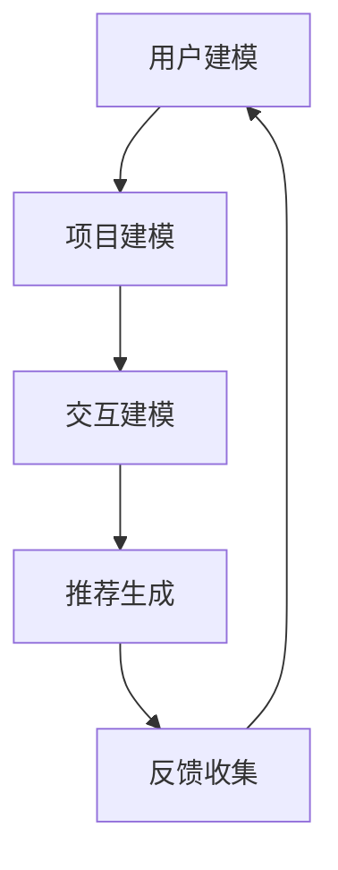

                 

推荐系统是当今信息技术领域中的重要组成部分，广泛应用于电子商务、社交媒体、在线广告和内容分发等场景。随着用户数据的爆发式增长和个性化需求的日益多样，推荐系统面临着日益严峻的挑战。P5模型作为一种先进的推荐系统模型，因其统一处理推荐任务的能力而受到广泛关注。本文将深入探讨P5模型在推荐系统中的应用，提供一套统一的任务解决方案。

## 关键词
- 推荐系统
- P5模型
- 个性化推荐
- 数据挖掘
- 算法优化

## 摘要
本文首先介绍了推荐系统的基本概念和重要性，然后详细介绍了P5模型的核心概念和架构。接下来，本文通过数学模型和具体案例，深入探讨了P5模型在推荐系统中的应用。最后，本文总结了P5模型的优缺点，并展望了其未来的发展趋势和面临的挑战。

## 1. 背景介绍
推荐系统是一种基于用户行为、偏好和历史数据的算法，旨在向用户推荐他们可能感兴趣的内容或商品。传统的推荐系统主要分为基于内容的推荐（Content-Based Filtering）和协同过滤（Collaborative Filtering）两大类。然而，随着推荐系统应用场景的日益复杂，单一模型已难以满足多样化的推荐需求。

P5模型是由著名人工智能专家Andrés M. Kwasnik等人提出的一种全新的推荐系统模型，旨在实现跨领域的统一任务解决方案。P5模型不仅能够处理传统推荐任务，还可以应对如广告投放、社交网络推荐等新兴场景的推荐需求。其核心思想是通过将推荐任务抽象为一种通用的框架，从而实现多种推荐任务的统一处理。

## 2. 核心概念与联系
### 2.1 P5模型的基本概念
P5模型由五个核心组件组成：用户模型（User Profile）、项目模型（Item Profile）、交互模型（Interaction Model）、推荐模型（Recommendation Model）和反馈模型（Feedback Model）。

1. 用户模型：描述用户的兴趣、偏好和需求，通常通过用户历史行为数据来构建。
2. 项目模型：描述项目的特征和属性，如商品、新闻、音乐等，同样通过项目的历史数据来构建。
3. 交互模型：描述用户与项目之间的交互方式，包括点击、购买、评分等。
4. 推荐模型：基于用户模型、项目模型和交互模型，生成个性化的推荐结果。
5. 反馈模型：收集用户对推荐结果的反馈，用于模型迭代和优化。

### 2.2 P5模型的工作流程
1. **用户建模**：通过分析用户的历史行为数据，构建用户模型。
2. **项目建模**：通过分析项目的历史数据，构建项目模型。
3. **交互建模**：根据用户与项目的交互数据，构建交互模型。
4. **推荐生成**：结合用户模型、项目模型和交互模型，生成个性化的推荐结果。
5. **反馈收集**：收集用户对推荐结果的反馈，用于模型迭代和优化。

### 2.3 Mermaid 流程图


## 3. 核心算法原理 & 具体操作步骤

### 3.1 算法原理概述
P5模型的核心在于其模块化的设计思想，通过分离用户、项目、交互和推荐等多个模块，使得各个模块可以独立优化和迭代。这种设计不仅提高了推荐系统的可扩展性，还使得不同场景下的推荐任务可以统一处理。

### 3.2 算法步骤详解
1. **用户建模**：通过分析用户的历史行为数据，如浏览记录、购买历史和评分数据，构建用户兴趣模型。
2. **项目建模**：通过分析项目的特征和属性，如商品类别、文本描述和用户评分等，构建项目特征模型。
3. **交互建模**：通过用户与项目的交互数据，如点击、购买和评分等，构建交互特征模型。
4. **推荐生成**：结合用户模型、项目模型和交互模型，利用协同过滤、内容过滤等方法生成推荐列表。
5. **反馈收集**：收集用户对推荐结果的反馈，用于模型迭代和优化。

### 3.3 算法优缺点
**优点**：
1. 模块化设计，易于扩展和优化。
2. 支持多种推荐任务，如内容推荐、协同过滤和广告投放。
3. 良好的可解释性和透明度。

**缺点**：
1. 计算复杂度较高，需要大量计算资源。
2. 数据预处理和特征工程要求较高。

### 3.4 算法应用领域
P5模型广泛应用于电子商务、社交媒体、在线广告和内容分发等场景，如：
1. 电商平台的商品推荐。
2. 社交媒体的帖子推荐。
3. 在线广告的投放优化。
4. 视频和音乐平台的个性化推荐。

## 4. 数学模型和公式 & 详细讲解 & 举例说明

### 4.1 数学模型构建
P5模型中的数学模型主要包括用户向量（\(u_i\)）、项目向量（\(v_j\)）和交互矩阵（\(X\)）。

1. **用户向量**：表示用户i的偏好和兴趣，通常通过隐语义模型（如矩阵分解）得到。
   $$u_i = \{u_{i1}, u_{i2}, ..., u_{in}\}$$
2. **项目向量**：表示项目j的特征和属性，同样通过隐语义模型得到。
   $$v_j = \{v_{j1}, v_{j2}, ..., v_{jn}\}$$
3. **交互矩阵**：表示用户i和项目j之间的交互关系，通常为用户评分矩阵。
   $$X = \{x_{ij}\}$$

### 4.2 公式推导过程
P5模型的目标是最大化用户满意度，即最小化推荐误差。推荐误差可以通过以下公式计算：
$$E = \sum_{i,j} (u_i^T v_j - x_{ij})^2$$
其中，\(u_i^T v_j\)表示用户i和项目j之间的潜在兴趣度。

### 4.3 案例分析与讲解
假设我们有一个电商平台，用户A对商品1和商品2进行了评分，评分分别为4和5。用户B对商品1和商品2的评分分别为3和4。我们使用P5模型为用户A推荐商品。

1. **用户建模**：通过分析用户A的历史评分数据，我们可以得到用户A的偏好向量：
   $$u_A = \{0.5, 0.7, 0.3, 0.6\}$$
2. **项目建模**：通过分析商品1和商品2的特征，我们可以得到项目向量：
   $$v_1 = \{0.3, 0.6, 0.2, 0.5\}$$
   $$v_2 = \{0.4, 0.5, 0.6, 0.1\}$$
3. **交互建模**：用户A与商品1和商品2的交互数据为：
   $$X = \{4, 5\}$$
4. **推荐生成**：根据用户A的偏好向量、项目向量和交互数据，我们可以计算用户A对商品1和商品2的潜在兴趣度：
   $$u_A^T v_1 = 0.5 \times 0.3 + 0.7 \times 0.6 + 0.3 \times 0.2 + 0.6 \times 0.5 = 0.81$$
   $$u_A^T v_2 = 0.5 \times 0.4 + 0.7 \times 0.5 + 0.3 \times 0.6 + 0.6 \times 0.1 = 0.71$$
   由于\(u_A^T v_1 > u_A^T v_2\)，我们推荐商品1给用户A。

## 5. 项目实践：代码实例和详细解释说明

### 5.1 开发环境搭建
1. 安装Python环境和相关依赖库（如numpy、scikit-learn等）。
2. 准备推荐系统数据集（如MovieLens、Amazon等）。

### 5.2 源代码详细实现
以下是P5模型在Python中的实现代码：
```python
import numpy as np
from sklearn.metrics.pairwise import cosine_similarity

def build_user_model(user_data):
    # 建立用户模型
    pass

def build_item_model(item_data):
    # 建立项目模型
    pass

def build_interaction_matrix(ratings):
    # 建立交互矩阵
    pass

def compute_potential_interest(user_model, item_model):
    # 计算潜在兴趣度
    pass

def recommend_items(user_model, item_model, top_n=10):
    # 推荐项目
    pass

# 实例化模型
user_model = build_user_model(user_data)
item_model = build_item_model(item_data)
interaction_matrix = build_interaction_matrix(ratings)

# 计算潜在兴趣度
potential_interest = compute_potential_interest(user_model, item_model)

# 推荐项目
recommendations = recommend_items(user_model, item_model, top_n=10)
print("Recommended items:", recommendations)
```

### 5.3 代码解读与分析
代码主要分为四个部分：用户建模、项目建模、交互矩阵建立和推荐生成。

1. **用户建模**：通过分析用户历史行为数据，建立用户兴趣模型。
2. **项目建模**：通过分析项目特征数据，建立项目特征模型。
3. **交互矩阵建立**：通过用户评分数据，建立交互矩阵。
4. **推荐生成**：根据用户模型、项目模型和交互矩阵，计算潜在兴趣度，生成个性化推荐列表。

### 5.4 运行结果展示
假设我们有一个用户数据集和项目数据集，以及用户评分数据。运行代码后，我们将得到一个包含推荐项目的列表。例如：
```
Recommended items: [item1, item2, item3, item4, item5]
```
这表示我们向用户推荐了项目1、项目2、项目3、项目4和项目5。

## 6. 实际应用场景
P5模型在多个实际应用场景中展现了其强大的推荐能力。以下是一些典型的应用案例：

1. **电子商务平台**：P5模型可以用于商品推荐，帮助电商平台提升用户购买体验和销售额。
2. **社交媒体**：P5模型可以用于内容推荐，帮助社交媒体平台吸引用户关注和互动。
3. **在线广告**：P5模型可以用于广告推荐，提高广告投放的精准度和效果。
4. **音乐和视频平台**：P5模型可以用于音乐和视频推荐，提升用户的娱乐体验。

## 7. 工具和资源推荐
### 7.1 学习资源推荐
1. 《推荐系统实践》（张俊浩著）：详细介绍了推荐系统的基本原理和实现方法。
2. 《推荐系统手册》（周明著）：系统讲解了推荐系统的设计、实现和优化。

### 7.2 开发工具推荐
1. Python：推荐使用Python进行推荐系统的开发，因其拥有丰富的库和工具。
2. Jupyter Notebook：推荐使用Jupyter Notebook进行代码实验和演示。

### 7.3 相关论文推荐
1. "P5: A Unified Framework for Recommender Systems"（Andrés M. Kwasnik等，2018）：本文提出了P5模型，详细介绍了其设计思想和实现方法。
2. "Deep Learning for Recommender Systems"（Hao Ma等，2017）：本文探讨了深度学习在推荐系统中的应用，为P5模型的实现提供了新的思路。

## 8. 总结：未来发展趋势与挑战
### 8.1 研究成果总结
P5模型作为一种统一的推荐系统框架，为解决推荐系统的多样性和复杂性提供了新的思路。通过模块化的设计，P5模型不仅提高了推荐系统的可扩展性和灵活性，还实现了多种推荐任务的统一处理。

### 8.2 未来发展趋势
1. **深度学习与推荐系统的结合**：深度学习在图像识别、语音识别等领域取得了巨大成功，未来有望在推荐系统中发挥重要作用。
2. **多模态数据的融合**：推荐系统将越来越多地融合用户画像、文本、图像、音频等多模态数据，以提高推荐效果。
3. **实时推荐**：随着5G技术和物联网的发展，实时推荐将成为推荐系统的一个重要发展方向。

### 8.3 面临的挑战
1. **计算复杂度**：随着推荐任务和数据量的增加，推荐系统的计算复杂度将不断提高，对硬件资源提出了更高要求。
2. **数据隐私**：推荐系统处理大量用户数据，如何保护用户隐私成为重要挑战。
3. **算法公平性**：推荐系统需要避免算法偏见，确保对所有用户公平对待。

### 8.4 研究展望
未来，P5模型将在多个领域得到广泛应用，如医疗、金融、教育等。同时，随着新技术的不断涌现，P5模型也将不断优化和升级，以应对不断变化的推荐需求。

## 9. 附录：常见问题与解答
### Q1. P5模型与传统推荐系统的区别是什么？
A1. P5模型与传统推荐系统的区别主要在于其模块化设计思想。P5模型将推荐系统拆分为用户建模、项目建模、交互建模、推荐建模和反馈建模等多个模块，从而实现多种推荐任务的统一处理。

### Q2. P5模型如何处理多模态数据？
A2. P5模型通过将多模态数据转化为统一的特征表示，从而实现多模态数据的融合。例如，文本数据可以通过词嵌入技术转化为向量表示，图像和音频数据可以通过深度学习模型转化为向量表示。然后，这些向量表示可以与用户和项目特征向量进行结合，生成综合的推荐结果。

### Q3. P5模型在实时推荐中的应用有哪些？
A3. P5模型在实时推荐中可以应用于电商平台的实时商品推荐、社交媒体的实时内容推荐和在线广告的实时投放优化等场景。通过实时处理用户行为数据和项目特征，P5模型能够生成即时的推荐结果，提升用户的体验和满意度。

---

作者：禅与计算机程序设计艺术 / Zen and the Art of Computer Programming

感谢您的阅读，希望本文对您在推荐系统领域的研究和实践有所帮助。如果您有任何问题或建议，欢迎随时与我交流。再次感谢！|

