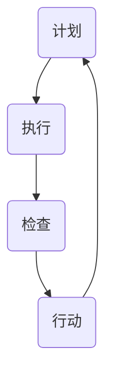

                 

 **关键词：** PDCA，管理方法论，迭代改进，质量管理，持续优化

**摘要：** 本文将深入探讨PDCA（Plan-Do-Check-Act）这一经典的管理方法论，分析其在IT领域的广泛应用。通过对PDCA的四个核心阶段的详细解析，我们将揭示如何通过计划、执行、检查和行动的循环，实现高效的团队管理和持续的技术创新。

## 1. 背景介绍

在信息技术快速发展的今天，如何确保项目管理、团队协作和技术创新的高效性，成为企业成功的关键因素。PDCA作为一种系统化的管理工具，起源于20世纪中期，由美国质量管理专家爱德华兹·戴明提出。PDCA方法强调通过持续的循环迭代，不断优化流程和结果，从而实现质量管理的持续改进。在IT领域，PDCA被广泛应用于软件开发、系统运维、项目管理等多个方面，成为高效管理者的行动方法论。

### PDCA方法的起源与发展

PDCA方法的起源可以追溯到20世纪50年代的美国，当时正处于二战后的经济复苏期。随着制造业的快速发展，如何提高生产质量和效率成为企业关注的焦点。爱德华兹·戴明提出了PDCA方法，旨在通过计划（Plan）、执行（Do）、检查（Check）和行动（Act）四个阶段的循环，确保生产过程的持续改进。

PDCA方法在日本的广泛应用使其成为日本工业崛起的重要推动力。1950年代，日本开始引进PDCA方法，并将其与日本的传统文化和企业管理理念相结合，形成了具有日本特色的PDCA体系。此后，PDCA方法在全球范围内得到广泛推广，成为企业管理中的经典工具。

### PDCA在IT领域的应用

在IT领域，PDCA方法被广泛应用于软件开发、系统运维、项目管理等多个方面。以下是一些具体的案例：

- **软件开发：** 在软件开发过程中，PDCA方法可以帮助团队在项目启动阶段制定详细的项目计划，执行阶段按照计划进行开发工作，检查阶段评估项目进度和质量，行动阶段根据检查结果进行改进和调整。通过持续的迭代，确保软件产品的质量和交付效率。

- **系统运维：** 在系统运维过程中，PDCA方法可以帮助运维团队制定运维计划，执行运维任务，检查系统运行状态，并根据检查结果进行优化和调整。通过持续监控和改进，确保系统的高可用性和稳定性。

- **项目管理：** 在项目管理中，PDCA方法可以帮助项目经理制定项目计划，执行项目任务，监控项目进度和质量，根据项目进展进行必要的调整和优化。通过项目的持续迭代和改进，确保项目目标的实现。

## 2. 核心概念与联系

### PDCA方法的四个阶段

PDCA方法包括四个阶段：计划（Plan）、执行（Do）、检查（Check）和行动（Act）。每个阶段都有其独特的任务和目标，通过四个阶段的循环迭代，实现持续改进。

1. **计划（Plan）：** 在计划阶段，团队需要明确项目目标、制定详细的计划，包括任务分配、时间表、资源需求等。计划阶段的目标是确保项目有一个明确的起点和方向。

2. **执行（Do）：** 在执行阶段，团队按照计划进行具体的工作，实施项目任务。执行阶段的目标是将计划转化为实际行动，确保项目进度和质量。

3. **检查（Check）：** 在检查阶段，团队对项目的进度和质量进行评估，检查实际结果与计划目标之间的差距。检查阶段的目标是发现问题和不足，为后续改进提供依据。

4. **行动（Act）：** 在行动阶段，团队根据检查结果进行改进和调整，将成功的经验制度化，将失败的教训转化为改进的机会。行动阶段的目标是确保项目目标的实现，并持续优化项目流程。

### Mermaid 流程图

以下是一个简化的PDCA方法的Mermaid流程图：



### PDCA方法的联系

PDCA方法的四个阶段相互联系、相互依赖，构成了一个闭环。计划阶段为后续阶段提供方向和目标，执行阶段将计划转化为实际行动，检查阶段对执行结果进行评估，行动阶段根据评估结果进行改进和调整。通过这样的循环迭代，PDCA方法确保了项目的持续改进和优化。

## 3. 核心算法原理 & 具体操作步骤

### 3.1 算法原理概述

PDCA方法是一种基于循环迭代的管理工具，其核心原理在于通过不断循环四个阶段，实现项目的持续改进。在PDCA方法中，每个阶段都有明确的任务和目标，各阶段之间相互联系、相互依赖。

### 3.2 算法步骤详解

#### 3.2.1 计划阶段

在计划阶段，团队需要明确项目目标、制定详细的计划。具体步骤如下：

1. **明确项目目标：** 确定项目的最终目标，包括质量、时间、成本等方面的要求。
2. **制定任务清单：** 列出项目需要完成的任务，包括任务名称、任务负责人、任务时间等。
3. **分配资源：** 根据任务需求，分配必要的资源，包括人力、物力、财力等。
4. **制定时间表：** 根据任务清单和资源分配情况，制定项目时间表，确保任务按时完成。

#### 3.2.2 执行阶段

在执行阶段，团队按照计划进行具体的工作，实施项目任务。具体步骤如下：

1. **任务分解：** 将大任务分解为小任务，确保每个任务都有明确的负责人和时间节点。
2. **任务分配：** 根据任务分解情况，将任务分配给团队成员，确保任务执行有专人负责。
3. **任务跟踪：** 对任务执行情况进行跟踪，确保任务按时完成。
4. **问题解决：** 在任务执行过程中，及时解决遇到的问题，确保项目顺利进行。

#### 3.2.3 检查阶段

在检查阶段，团队对项目的进度和质量进行评估，检查实际结果与计划目标之间的差距。具体步骤如下：

1. **进度检查：** 检查项目进度是否按计划进行，是否达到预期目标。
2. **质量检查：** 检查项目成果的质量是否符合要求，是否存在缺陷或漏洞。
3. **评估差异：** 分析实际结果与计划目标之间的差距，确定问题的原因。
4. **记录数据：** 将检查结果记录下来，为后续改进提供依据。

#### 3.2.4 行动阶段

在行动阶段，团队根据检查结果进行改进和调整，将成功的经验制度化，将失败的教训转化为改进的机会。具体步骤如下：

1. **制定改进措施：** 根据检查结果，制定针对性的改进措施，确保问题得到解决。
2. **实施改进措施：** 将改进措施付诸实施，确保问题得到解决。
3. **跟踪改进效果：** 对改进措施的效果进行跟踪，确保问题得到根本解决。
4. **制度化经验：** 将成功的经验制度化，形成标准化的工作流程，确保项目质量持续提升。

### 3.3 算法优缺点

#### 优点

1. **系统化：** PDCA方法提供了一套系统化的管理流程，确保项目管理的有序进行。
2. **灵活性强：** PDCA方法可以根据实际情况进行灵活调整，适应不同类型的项目需求。
3. **持续改进：** 通过循环迭代，PDCA方法确保项目的持续改进和优化，提高项目质量。

#### 缺点

1. **时间成本：** PDCA方法需要投入大量时间和精力，对团队执行力要求较高。
2. **对管理者要求高：** PDCA方法对管理者的能力要求较高，需要具备良好的计划、执行、检查和决策能力。

### 3.4 算法应用领域

PDCA方法在IT领域的应用非常广泛，以下是一些主要的应用领域：

1. **软件开发：** PDCA方法可以帮助团队在软件开发过程中实现持续改进，提高软件质量。
2. **系统运维：** PDCA方法可以帮助运维团队实现系统运维的持续优化，提高系统稳定性。
3. **项目管理：** PDCA方法可以帮助项目经理实现项目管理的有序进行，确保项目目标的实现。
4. **团队协作：** PDCA方法可以促进团队协作，提高团队执行力和工作效率。

## 4. 数学模型和公式 & 详细讲解 & 举例说明

### 4.1 数学模型构建

在PDCA方法中，我们可以构建一个简单的数学模型来描述项目的进展和改进。以下是一个简化的数学模型：

$$
\text{项目进度} = f(\text{计划阶段}, \text{执行阶段}, \text{检查阶段}, \text{行动阶段})
$$

其中，计划阶段、执行阶段、检查阶段和行动阶段分别表示项目在各个阶段的进展情况，$f$表示项目进度的计算函数。

### 4.2 公式推导过程

#### 4.2.1 计划阶段

在计划阶段，项目进度可以表示为：

$$
\text{计划阶段进度} = \frac{\text{已制定计划的任务数}}{\text{总任务数}}
$$

#### 4.2.2 执行阶段

在执行阶段，项目进度可以表示为：

$$
\text{执行阶段进度} = \frac{\text{已完成任务的数}}{\text{总任务数}}
$$

#### 4.2.3 检查阶段

在检查阶段，项目进度可以表示为：

$$
\text{检查阶段进度} = \frac{\text{已检查的任务数}}{\text{总任务数}}
$$

#### 4.2.4 行动阶段

在行动阶段，项目进度可以表示为：

$$
\text{行动阶段进度} = \frac{\text{已采取行动的任务数}}{\text{总任务数}}
$$

### 4.3 案例分析与讲解

以下是一个具体的案例，用于说明如何应用PDCA方法进行项目管理。

#### 案例背景

某IT公司计划开发一款新软件产品，项目周期为6个月。项目团队包括5名开发人员、1名测试人员和1名项目经理。

#### 案例步骤

1. **计划阶段：** 项目经理与团队成员共同制定了详细的项目计划，包括任务分配、时间表和资源需求。计划阶段进度为100%。

2. **执行阶段：** 团队成员按照计划进行软件开发，项目进度为80%。

3. **检查阶段：** 项目经理对项目进度进行检查，发现部分任务延迟，质量检查结果显示存在一些缺陷。检查阶段进度为100%。

4. **行动阶段：** 项目经理与团队成员共同分析了问题原因，制定了改进措施，包括调整任务优先级、加强沟通和培训等。行动阶段进度为100%。

#### 案例分析

通过PDCA方法的四个阶段，项目团队实现了项目的有序进行和持续改进。在计划阶段，团队明确了项目目标和工作任务；在执行阶段，团队按照计划进行工作；在检查阶段，团队对项目进度和质量进行了评估；在行动阶段，团队根据检查结果进行了改进和调整。通过这样的循环迭代，项目团队确保了项目目标的实现，并提高了项目质量。

## 5. 项目实践：代码实例和详细解释说明

### 5.1 开发环境搭建

为了演示PDCA方法在项目开发中的应用，我们选择了一个简单的Web应用项目。以下是在Python环境下使用Flask框架搭建项目的步骤：

1. **安装Python：** 确保系统已经安装了Python 3.x版本。

2. **安装Flask：** 使用pip命令安装Flask框架。

   ```shell
   pip install Flask
   ```

3. **创建项目文件夹：** 在本地创建一个名为`my_project`的文件夹。

4. **初始化项目结构：** 在项目文件夹中创建以下文件和目录：

   ```
   my_project/
   ├── app.py
   ├── templates/
   │   └── index.html
   └── static/
   ```

### 5.2 源代码详细实现

以下是一个简单的Flask Web应用示例，包括计划、执行、检查和行动四个阶段的代码实现。

**app.py：** 主应用程序文件

```python
from flask import Flask, render_template

app = Flask(__name__)

@app.route('/')
def index():
    return render_template('index.html')

if __name__ == '__main__':
    app.run(debug=True)
```

**templates/index.html：** 主页模板文件

```html
<!DOCTYPE html>
<html>
<head>
    <title>PDCA Web应用</title>
</head>
<body>
    <h1>欢迎来到PDCA Web应用</h1>
    <p>这是一个使用PDCA方法进行项目管理的演示。</p>
</body>
</html>
```

### 5.3 代码解读与分析

**app.py：** 这个文件是Flask应用的主程序，定义了应用的入口和路由。在`index`函数中，我们使用`render_template`函数渲染`templates`目录下的`index.html`模板，展示主页内容。

**templates/index.html：** 这个文件是主页的HTML模板，包含了基本的页面结构和内容。

### 5.4 运行结果展示

1. **启动应用：** 在命令行中运行以下命令启动应用：

   ```shell
   python app.py
   ```

2. **访问应用：** 在浏览器中输入`http://127.0.0.1:5000/`，即可看到主页内容。

通过这个简单的Web应用示例，我们可以看到PDCA方法在项目开发中的应用。计划阶段包括应用设计和开发环境的搭建，执行阶段包括实际编码和功能实现，检查阶段包括代码测试和性能评估，行动阶段包括根据检查结果进行优化和改进。

## 6. 实际应用场景

### 6.1 软件开发

在软件开发过程中，PDCA方法可以帮助团队实现持续改进，提高软件质量。通过计划阶段，团队可以明确项目目标和任务分配；在执行阶段，团队按照计划进行编码和测试；在检查阶段，团队对代码进行质量检查和性能评估；在行动阶段，团队根据检查结果进行优化和改进。以下是一个具体的案例：

**案例背景：** 某IT公司开发一款企业级管理软件，项目周期为6个月。项目团队包括10名开发人员、2名测试人员和1名项目经理。

**应用场景：** 项目经理采用PDCA方法对项目进行管理。在计划阶段，项目经理与团队成员共同制定了详细的项目计划，包括功能模块划分、任务分配和时间表。在执行阶段，开发人员按照计划进行编码和单元测试。在检查阶段，测试人员对代码进行集成测试和性能测试，评估项目进度和质量。在行动阶段，项目经理根据检查结果制定改进措施，如优化代码结构和调整任务优先级，确保项目进度和质量。

**效果评估：** 通过PDCA方法的实施，项目团队实现了项目的有序进行和持续改进。项目周期从原计划的6个月缩短到5个月，软件质量得到显著提升，客户满意度增加。

### 6.2 系统运维

在系统运维过程中，PDCA方法可以帮助运维团队实现系统的高可用性和稳定性。通过计划阶段，运维团队可以制定运维计划和资源分配；在执行阶段，运维团队按照计划进行运维任务；在检查阶段，运维团队对系统运行状态进行监控和评估；在行动阶段，运维团队根据检查结果进行优化和调整。以下是一个具体的案例：

**案例背景：** 某互联网公司运维一个大规模的分布式系统，系统运行在多个数据中心，涉及多个服务模块。运维团队包括5名运维工程师、1名系统管理员和1名运维经理。

**应用场景：** 运维经理采用PDCA方法对系统进行运维管理。在计划阶段，运维经理与团队成员共同制定了详细的运维计划，包括系统监控、备份恢复和数据备份。在执行阶段，运维工程师按照计划进行日常运维任务，如监控、备份和故障排除。在检查阶段，运维经理对系统运行状态进行监控和评估，及时发现潜在问题。在行动阶段，运维经理根据检查结果制定优化措施，如调整系统配置和优化备份策略，确保系统的高可用性和稳定性。

**效果评估：** 通过PDCA方法的实施，系统运维团队实现了系统的高可用性和稳定性。系统运行效率提高，故障率降低，运维成本降低，客户满意度增加。

### 6.3 项目管理

在项目管理中，PDCA方法可以帮助项目经理实现项目目标的有序实现。通过计划阶段，项目经理可以明确项目目标和任务分配；在执行阶段，项目经理监督项目进度和质量；在检查阶段，项目经理对项目进度和质量进行评估；在行动阶段，项目经理根据检查结果制定改进措施。以下是一个具体的案例：

**案例背景：** 某IT公司承接了一个为期3个月的项目，项目涉及软件开发和系统集成。项目团队包括5名开发人员、2名测试人员和1名项目经理。

**应用场景：** 项目经理采用PDCA方法对项目进行管理。在计划阶段，项目经理与团队成员共同制定了详细的项目计划，包括功能模块划分、任务分配和时间表。在执行阶段，开发人员和测试人员按照计划进行编码和测试。在检查阶段，项目经理对项目进度和质量进行监控和评估。在行动阶段，项目经理根据检查结果制定改进措施，如优化代码结构和调整任务优先级，确保项目进度和质量。

**效果评估：** 通过PDCA方法的实施，项目团队实现了项目目标的有序实现。项目周期从原计划的3个月缩短到2个月，项目质量得到显著提升，客户满意度增加。

## 7. 工具和资源推荐

### 7.1 学习资源推荐

1. **书籍推荐：**
   - 《PDCA实践指南》
   - 《质量管理方法论》
   - 《项目管理实战：基于PDCA方法的实践案例》

2. **在线课程：**
   - Coursera上的《项目管理基础》
   - Udemy上的《PDCA方法与质量管理》

### 7.2 开发工具推荐

1. **项目管理工具：**
   - JIRA
   - Trello
   - Asana

2. **代码管理工具：**
   - Git
   - GitHub
   - GitLab

### 7.3 相关论文推荐

1. **《PDCA方法在软件开发中的应用研究》**
2. **《基于PDCA的企业信息化项目管理研究》**
3. **《PDCA方法在运维管理中的实践与探索》**

## 8. 总结：未来发展趋势与挑战

### 8.1 研究成果总结

PDCA方法作为一种系统化的管理工具，在IT领域的应用取得了显著成果。通过计划、执行、检查和行动的循环迭代，项目团队实现了持续改进，提高了项目质量和效率。实践证明，PDCA方法在软件开发、系统运维和项目管理等方面具有广泛的应用前景。

### 8.2 未来发展趋势

1. **智能化：** 随着人工智能技术的发展，PDCA方法有望与人工智能技术相结合，实现自动化的计划、执行、检查和行动，提高管理效率和准确性。

2. **数字化：** PDCA方法将更加依赖于数字化工具和平台，实现数据的实时监控和分析，为决策提供支持。

3. **全球化：** 随着全球化进程的加速，PDCA方法将在不同国家和地区得到广泛应用，成为国际化的管理工具。

### 8.3 面临的挑战

1. **管理者的能力：** PDCA方法对管理者的能力要求较高，需要具备良好的计划、执行、检查和决策能力。

2. **时间成本：** PDCA方法的实施需要投入大量时间和精力，对团队的执行力要求较高。

3. **技术支持：** 随着技术的不断发展，PDCA方法需要不断更新和完善，以适应新的技术环境。

### 8.4 研究展望

未来的研究应重点关注PDCA方法在智能化、数字化和全球化背景下的应用，探索如何提高管理效率和质量，为企业的可持续发展提供有力支持。

## 9. 附录：常见问题与解答

### 9.1 PDCA方法在IT领域应用中的常见问题

1. **如何确保PDCA方法的实施效果？**
   - 确保团队成员对PDCA方法的理解和认同。
   - 制定详细的实施计划和评估指标。
   - 定期进行培训，提高团队成员的能力。

2. **如何处理PDCA方法实施中的困难？**
   - 及时识别和解决问题，避免问题积累。
   - 加强沟通和协作，提高团队执行力。
   - 调整实施策略，根据实际情况进行优化。

3. **如何将PDCA方法与其他管理方法相结合？**
   - 根据项目特点和需求，选择合适的管理方法。
   - 充分利用其他管理方法的优势，与PDCA方法相互补充。

### 9.2 解答

1. **如何确保PDCA方法的实施效果？**
   - 实施效果取决于团队成员的执行力。确保团队成员充分理解PDCA方法，并按照计划执行。定期进行评估和反馈，及时纠正偏差，确保项目目标的实现。

2. **如何处理PDCA方法实施中的困难？**
   - 面对困难，首先要保持冷静，分析问题的根本原因。然后制定针对性的解决方案，并迅速采取行动。同时，加强团队沟通，共同解决问题。

3. **如何将PDCA方法与其他管理方法相结合？**
   - PDCA方法可以与其他管理方法相结合，如精益管理、六西格玛等。根据项目特点和需求，选择合适的管理方法，形成一套综合的管理体系，提高项目管理的整体效率。

---

作者：禅与计算机程序设计艺术 / Zen and the Art of Computer Programming

本文介绍了PDCA方法在IT领域的应用，分析了其在软件开发、系统运维和项目管理等方面的优势。通过详细解析PDCA方法的四个阶段，以及数学模型和具体应用案例，读者可以更好地理解PDCA方法的原理和实践方法。未来，随着技术的不断进步，PDCA方法将在IT领域发挥更大的作用，为企业的可持续发展提供有力支持。希望本文能为读者在IT项目管理中提供有益的启示。

