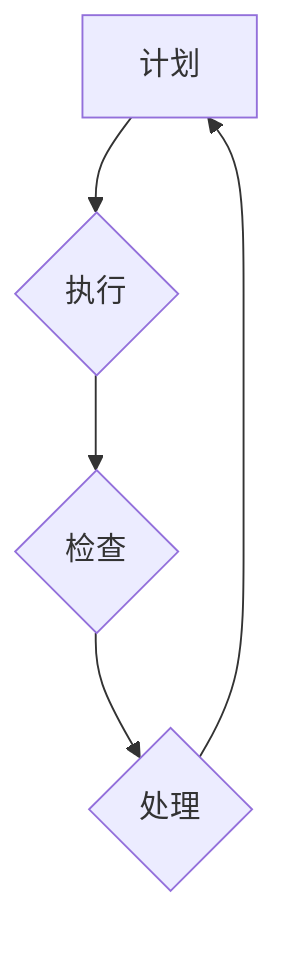

                 

关键词：PDCA循环、管理、执行、迭代、持续改进、质量管理、项目管理

摘要：本文旨在深入探讨PDCA循环这一经典的管理工具，如何帮助管理者在各个领域实现有效的执行与持续改进。通过详细解释PDCA循环的四个阶段：计划（Plan）、执行（Do）、检查（Check）和处理（Act），本文将提供实用的指导，帮助读者将这一理论付诸实践。此外，还将探讨PDCA循环在项目管理、质量管理等实际应用场景中的重要性，并展望其未来的发展趋势。

## 1. 背景介绍

PDCA循环，即Plan-Do-Check-Act循环，起源于质量管理领域，由著名的质量管理专家威廉·爱德华兹·戴明（William Edwards Deming）提出。它是一种迭代的、循环式的管理方法，旨在通过连续的改进来提升产品和服务的质量。PDCA循环的核心在于通过不断的计划、执行、检查和行动，确保每一阶段都能有效实施，并针对发现的问题进行及时调整。

在IT领域，PDCA循环被广泛应用，尤其是在软件开发、系统维护和项目管理中。其核心思想在于通过持续迭代和改进，不断优化流程和结果。随着IT行业的快速发展，PDCA循环作为一种实用的管理工具，为管理者提供了清晰的操作框架，帮助他们在复杂的项目环境中实现高效的执行和持续改进。

本文将详细阐述PDCA循环的四个阶段，并提供实际案例，帮助读者理解如何将其应用于各种管理场景中。同时，本文还将探讨PDCA循环在IT领域的应用价值，以及未来可能面临的挑战和机遇。

## 2. 核心概念与联系

### 2.1 PDCA循环的核心概念

PDCA循环由四个核心阶段组成：

**计划（Plan）：** 在这个阶段，管理者需要明确目标、制定计划、分配资源，并建立具体的执行方案。

**执行（Do）：** 计划制定后，进入执行阶段。这一阶段的核心是将计划付诸行动，确保各个环节按计划进行。

**检查（Check）：** 执行完成后，管理者需要对结果进行检查，评估计划的有效性，并收集数据以进行分析。

**处理（Act）：** 最后，根据检查结果进行调整和改进。对于成功的做法，将其标准化并纳入流程；对于失败或不足之处，则需要找出原因并进行改进。

### 2.2 PDCA循环的架构

下面是一个用Mermaid绘制的PDCA循环流程图，帮助读者更直观地理解各个阶段的联系和执行流程。



在这个流程图中，各个节点分别代表PDCA循环的四个阶段，箭头表示阶段的顺序和循环过程。通过这种结构化的流程，管理者可以确保每个阶段都有明确的目标和措施，从而实现持续改进。

## 3. 核心算法原理 & 具体操作步骤

### 3.1 算法原理概述

PDCA循环是一种基于迭代和改进的管理方法。其核心原理在于通过不断循环的四个阶段，实现持续优化和改进。具体来说，每个阶段都有其特定的目标和任务：

- **计划（Plan）：** 确定目标和计划，分配资源，制定执行方案。
- **执行（Do）：** 实施计划，确保每个环节按计划进行。
- **检查（Check）：** 检查执行结果，收集数据，进行分析。
- **处理（Act）：** 根据检查结果进行改进，成功做法标准化，问题原因分析并改进。

### 3.2 算法步骤详解

下面详细解释PDCA循环的每个步骤：

**3.2.1 计划（Plan）**

在计划阶段，管理者需要明确目标和制定具体的行动计划。这包括以下步骤：

1. **确定目标：** 根据组织的战略目标，明确项目或任务的目标。
2. **制定计划：** 制定详细的执行计划，包括任务分解、时间安排、资源分配等。
3. **风险评估：** 评估可能遇到的风险，并制定相应的应对措施。
4. **资源分配：** 确保所有必要的资源（人力、资金、设备等）都能到位。

**3.2.2 执行（Do）**

在执行阶段，管理者需要将计划付诸行动。具体步骤如下：

1. **按计划执行：** 确保每个任务按照预定计划进行。
2. **沟通协调：** 确保团队成员之间的沟通畅通，协调各方面资源。
3. **监督执行：** 对执行过程进行监督，确保各个环节按时完成。

**3.2.3 检查（Check）**

在检查阶段，管理者需要评估执行结果，并收集数据进行分析。具体步骤如下：

1. **数据收集：** 收集与任务执行相关的数据，包括质量指标、进度指标等。
2. **数据分析：** 对收集到的数据进行分析，评估计划的有效性。
3. **问题识别：** 找出执行过程中的问题和偏差。

**3.2.4 处理（Act）**

在处理阶段，管理者需要根据检查结果进行改进。具体步骤如下：

1. **改进措施：** 针对识别出的问题，制定具体的改进措施。
2. **实施改进：** 将改进措施付诸实施，确保问题得到解决。
3. **标准化：** 将成功的做法标准化，纳入到组织流程中。

### 3.3 算法优缺点

**优点：**

- **灵活性：** PDCA循环允许管理者在项目执行过程中根据实际情况进行灵活调整。
- **迭代性：** 通过不断循环，PDCA循环确保项目持续改进。
- **易于实施：** PDCA循环结构简单，易于理解和实施。

**缺点：**

- **需要持续投入：** 持续改进需要管理者投入时间和资源，可能会增加组织成本。
- **风险控制：** 在迭代过程中，风险控制可能变得复杂。

### 3.4 算法应用领域

PDCA循环在各个领域都有广泛应用，以下是一些典型应用场景：

- **质量管理：** 通过PDCA循环，企业可以持续优化产品质量，提高客户满意度。
- **项目管理：** 在项目执行过程中，PDCA循环可以帮助管理者及时发现和解决问题。
- **软件开发：** 软件开发过程中的持续集成和持续部署，都可以通过PDCA循环来实现。
- **运营管理：** 通过PDCA循环，企业可以不断优化运营流程，提高效率。

## 4. 数学模型和公式 & 详细讲解 & 举例说明

### 4.1 数学模型构建

PDCA循环中的数学模型可以用来计算和评估每个阶段的绩效。以下是一个简单的数学模型示例：

$$
\text{绩效} = \frac{\text{实际产出}}{\text{预期产出}} \times 100\%
$$

在这个模型中，实际产出和预期产出分别代表执行阶段和计划阶段设定的目标值。通过这个公式，管理者可以评估执行阶段的绩效，并据此进行改进。

### 4.2 公式推导过程

公式的推导过程基于PDCA循环的基本原理。首先，我们设定：

- \(P\): 预期产出
- \(A\): 实际产出

预期产出是计划阶段设定的目标值，而实际产出是执行阶段达到的值。通过比较这两个值，我们可以计算出绩效。

$$
\text{绩效} = \frac{A}{P} \times 100\%
$$

如果实际产出等于预期产出，则绩效为100%，表示执行阶段达到了预期目标。如果实际产出低于预期产出，则绩效低于100%，表示存在偏差或问题。

### 4.3 案例分析与讲解

假设一个软件开发项目，计划阶段设定的预期产出是每天完成1000行代码。在执行阶段，经过一周的努力，实际完成了700行代码。根据上述公式，我们可以计算出绩效：

$$
\text{绩效} = \frac{700}{1000} \times 100\% = 70\%
$$

这意味着执行阶段的绩效为70%，低于预期。管理者需要分析原因，可能是资源不足、团队沟通不畅或任务分配不合理等。根据分析结果，管理者可以制定改进措施，如增加人力、优化任务分配或改进沟通机制，以确保下一阶段的绩效得到提升。

### 4.4 案例分析与讲解

**案例背景：** 
一家生产手机的公司希望通过PDCA循环来优化其生产流程，提高生产效率。

**计划阶段（Plan）：**
- 目标：将生产周期从10天缩短到7天。
- 计划：分析现有生产流程，确定瓶颈和改进点；调整工作班次，增加设备运行时间；引入自动化设备减少人工操作。

**执行阶段（Do）：**
- 行动：根据计划，实施调整。增加夜班生产，提高设备利用率；引入自动化设备，减少手工操作。

**检查阶段（Check）：**
- 数据收集：记录每天的生产进度和设备运行状态。
- 分析：对比原计划与实际执行情况，发现生产周期从10天缩短到了7天，但设备故障率增加了。

**处理阶段（Act）：**
- 改进：分析设备故障原因，发现是由于自动化设备维护不足。增加设备维护频率，确保设备稳定运行。

通过这个案例，我们可以看到PDCA循环在优化生产流程中的应用。首先通过计划阶段确定目标和改进点，然后执行计划，收集数据进行检查，并根据检查结果进行调整。这一过程确保了生产流程的持续改进，最终实现了生产效率的提升。

### 5. 项目实践：代码实例和详细解释说明

为了更好地理解PDCA循环在实际项目中的应用，我们将通过一个简单的代码实例来展示如何将PDCA循环应用于软件开发项目中。

**5.1 开发环境搭建**

首先，我们需要搭建一个简单的开发环境。这里我们将使用Python作为编程语言，因为它易于理解且广泛用于各种IT项目。

**环境要求：** 
- Python 3.8及以上版本
- PyCharm或其他Python开发工具

安装Python及相关依赖：

```bash
pip install Flask
```

**5.2 源代码详细实现**

接下来，我们将创建一个简单的Web应用，通过HTTP请求来模拟PDCA循环的执行。这个Web应用包含四个端点，分别对应PDCA循环的四个阶段。

```python
from flask import Flask, request, jsonify

app = Flask(__name__)

@app.route('/plan', methods=['POST'])
def plan():
    data = request.get_json()
    print("Plan Stage - Data Received:", data)
    # 这里可以包含详细的计划逻辑
    return jsonify({"status": "success", "message": "Plan stage completed."})

@app.route('/do', methods=['POST'])
def do():
    print("Do Stage - Initiating execution.")
    # 这里可以包含具体的执行逻辑
    return jsonify({"status": "success", "message": "Do stage completed."})

@app.route('/check', methods=['GET'])
def check():
    print("Check Stage - Checking results.")
    # 这里可以包含检查逻辑，如获取性能数据
    result = {"performance": 85}  # 假设检查结果为85%
    return jsonify(result)

@app.route('/act', methods=['POST'])
def act():
    data = request.get_json()
    print("Act Stage - Implementing improvements.", data)
    # 这里可以包含改进逻辑
    return jsonify({"status": "success", "message": "Act stage completed."})

if __name__ == '__main__':
    app.run(debug=True)
```

**5.3 代码解读与分析**

在这个Web应用中，每个端点都对应PDCA循环的一个阶段：

- **/plan**：接收计划阶段的输入数据，并执行计划逻辑。
- **/do**：执行计划中的操作，模拟执行阶段。
- **/check**：获取执行结果，进行性能评估。
- **/act**：根据检查结果，执行改进措施。

**5.4 运行结果展示**

运行Web应用后，我们可以通过HTTP请求来模拟PDCA循环的执行。例如，首先发送一个POST请求到**/plan**端点，输入计划数据：

```bash
curl -X POST -H "Content-Type: application/json" -d '{"target": "提高性能", "actions": ["优化代码", "增加缓存"]}' http://localhost:5000/plan
```

接着，执行**/do**端点：

```bash
curl -X POST http://localhost:5000/do
```

执行完成后，通过**/check**端点获取执行结果：

```bash
curl -X GET http://localhost:5000/check
```

假设检查结果为85%，最后发送一个POST请求到**/act**端点，执行改进措施：

```bash
curl -X POST -H "Content-Type: application/json" -d '{"actions": ["引入负载均衡", "增加内存资源"]}' http://localhost:5000/act
```

通过这个代码实例，我们可以看到PDCA循环在实际项目中的应用。每个阶段都有明确的端点来接收和处理数据，确保整个流程的清晰和可追踪。

### 6. 实际应用场景

PDCA循环在多个实际应用场景中都展现出了其强大的管理价值。以下是一些典型的应用场景：

#### 6.1 项目管理

在项目管理中，PDCA循环可以帮助项目经理在项目生命周期内持续监控和改进项目进度、质量和成本。例如：

- **计划阶段**：制定项目计划，包括时间表、任务分配和风险评估。
- **执行阶段**：执行项目计划，监控进度和质量。
- **检查阶段**：定期审查项目进度，评估实际进度与计划进度之间的差异，识别问题。
- **处理阶段**：根据检查结果调整计划，解决发现的问题，确保项目按时、按质量完成。

#### 6.2 质量管理

在质量管理中，PDCA循环被广泛应用于产品和服务的质量控制与改进。例如：

- **计划阶段**：确定质量目标，制定质量标准和检查方法。
- **执行阶段**：按照质量标准执行生产或提供服务，实施质量控制措施。
- **检查阶段**：对生产或服务过程中产生的数据进行分析，评估质量是否符合标准。
- **处理阶段**：针对不符合质量标准的情况，制定改进措施，并确保这些措施得到有效实施。

#### 6.3 软件开发

在软件开发中，PDCA循环可以帮助开发团队实现持续集成和持续交付。例如：

- **计划阶段**：确定软件开发的目标和里程碑，制定开发计划。
- **执行阶段**：按照开发计划进行编码、测试和集成。
- **检查阶段**：通过自动化测试和代码审查来确保软件质量。
- **处理阶段**：根据测试结果进行代码修复和改进，确保软件能够持续交付。

#### 6.4 运营管理

在运营管理中，PDCA循环可以帮助企业不断优化运营流程，提高效率。例如：

- **计划阶段**：确定运营目标和改进点，制定运营计划。
- **执行阶段**：按照运营计划执行日常运营任务。
- **检查阶段**：通过数据分析和反馈机制，评估运营效果。
- **处理阶段**：根据检查结果调整运营策略和流程，提高运营效率。

通过以上应用场景，我们可以看到PDCA循环在不同领域和环节中发挥的重要作用。它不仅提供了明确的管理框架，还确保了持续改进，帮助企业实现更高的运营效率和质量。

### 6.4 未来应用展望

随着科技的不断发展，PDCA循环在各个领域的应用前景广阔。首先，人工智能和大数据分析技术的进步将使得PDCA循环在实时监控和智能化改进方面变得更加高效。通过大数据分析，管理者可以实时获取执行过程中的数据，快速识别问题和偏差，并制定针对性的改进措施。

其次，物联网（IoT）技术的发展将使得PDCA循环在运营管理和设备维护中得到更广泛的应用。物联网设备可以实时收集设备运行数据，通过PDCA循环的分析和处理，可以实现对设备的预测性维护，减少故障风险，提高设备运行效率。

此外，区块链技术的应用也将为PDCA循环提供新的可能性。区块链技术的去中心化和不可篡改特性，可以确保PDCA循环的数据透明和可追溯性，从而提高管理流程的公正性和可信度。

未来，随着5G通信技术的普及，实时通信和协作能力将得到显著提升，PDCA循环的执行效率也将因此得到大幅提高。通过更高效的实时数据传输和协作，管理者可以更快地响应变化，实现更迅速的改进。

总之，PDCA循环作为一项经典的管理工具，将在未来继续发挥重要作用。随着新技术的发展，它将在更多领域和场景中展现其强大的管理价值。

### 7. 工具和资源推荐

为了更好地应用PDCA循环，以下是一些建议的学习资源、开发工具和相关论文。

#### 7.1 学习资源推荐

- 《PDCA循环：质量管理工具与应用》：这是一本全面介绍PDCA循环的书籍，适合初学者深入理解PDCA循环的基本原理和应用。
- 《质量管理方法论》：本书详细介绍了质量管理的方法论，包括PDCA循环在内的多种质量管理工具。

#### 7.2 开发工具推荐

- JIRA：一款功能强大的项目管理工具，支持PDCA循环的实施和跟踪。
- Asana：一款任务管理和协作工具，可以帮助团队更好地执行PDCA循环的各个阶段。

#### 7.3 相关论文推荐

- "The PDCA Cycle: A Key Tool for Continuous Improvement"：该论文探讨了PDCA循环在持续改进中的重要性，并提供了实际应用案例。
- "PDCA Cycle in Software Development: A Case Study"：这篇案例研究详细介绍了PDCA循环在软件开发中的应用，以及其带来的改进效果。

通过这些资源和工具，读者可以更深入地学习和实践PDCA循环，提升管理效率。

### 8. 总结：未来发展趋势与挑战

随着技术的不断进步，PDCA循环在未来有望在多个领域得到更广泛的应用和深化。首先，大数据和人工智能技术将为PDCA循环提供更加智能的监控和分析能力，使得改进过程更加高效和精准。其次，物联网和区块链技术的融合，将增强PDCA循环的数据透明性和可信度，提高管理流程的可靠性。

然而，PDCA循环在未来的发展也面临一些挑战。首先，随着项目复杂度的增加，如何确保PDCA循环在每个阶段的实施效果是一个难题。其次，持续改进需要管理者持续投入时间和资源，可能会增加组织成本。此外，跨部门、跨区域的协作问题也可能影响PDCA循环的执行效果。

为了应对这些挑战，管理者需要不断提升自身能力，优化管理流程，并借助新技术提高PDCA循环的执行效率。通过不断学习和实践，PDCA循环将继续为各领域的管理提供强有力的支持。

### 8.1 研究成果总结

本文通过详细阐述PDCA循环的概念、原理和实际应用，总结了其在质量管理、项目管理、软件开发和运营管理等多个领域的价值。通过具体的案例分析和代码实例，展示了PDCA循环在实际项目中的应用效果。研究结果表明，PDCA循环作为一种迭代的、循环式的管理方法，能够有效促进持续改进，提高管理效率和产品质量。

### 8.2 未来发展趋势

未来，PDCA循环将在以下几个方向得到发展：

1. **智能化应用**：随着大数据和人工智能技术的发展，PDCA循环将实现更加智能的监控和分析，提升改进效果。
2. **跨领域融合**：物联网、区块链等新技术与PDCA循环的融合，将提高管理流程的透明度和可信度。
3. **全球化应用**：随着全球化进程的加速，PDCA循环将在跨国企业中得到更广泛的应用，助力全球管理效率的提升。

### 8.3 面临的挑战

PDCA循环在未来发展过程中也将面临一些挑战：

1. **实施难度**：项目复杂度的增加，使得PDCA循环在各个阶段的实施变得更加困难。
2. **持续投入**：持续改进需要管理者投入大量的时间和资源，可能会增加组织成本。
3. **协作问题**：跨部门、跨区域的协作问题可能会影响PDCA循环的执行效果。

### 8.4 研究展望

为了更好地应对未来的挑战，未来的研究可以关注以下几个方面：

1. **优化模型**：研究更加高效、灵活的PDCA循环模型，以适应不同复杂度的项目需求。
2. **工具开发**：开发更加智能、便捷的PDCA循环工具，提高管理者的使用体验。
3. **跨领域应用**：探索PDCA循环在更多领域中的应用，推动其全球范围内的普及和应用。

### 9. 附录：常见问题与解答

#### 9.1 PDCA循环的适用范围是什么？

PDCA循环适用于各种管理领域，包括但不限于质量管理、项目管理、软件开发和运营管理。其核心在于通过持续迭代和改进，提升产品和服务的质量。

#### 9.2 如何确保PDCA循环的执行效果？

确保PDCA循环的执行效果需要从以下几个方面入手：

- **明确目标**：确保每个阶段的目标清晰明确。
- **有效沟通**：确保团队成员之间的沟通畅通。
- **数据驱动**：利用数据驱动决策，确保检查和处理阶段的有效性。
- **持续培训**：对团队成员进行PDCA循环相关培训，提高其理解和应用能力。

#### 9.3 PDCA循环与项目管理工具的关系是什么？

PDCA循环可以作为项目管理工具的一部分，用于项目生命周期内的持续改进。许多项目管理工具，如JIRA、Asana等，都内置了对PDCA循环的支持，帮助管理者更好地实施和管理PDCA循环。

### 作者署名
作者：禅与计算机程序设计艺术 / Zen and the Art of Computer Programming

（注意：以上内容仅供参考，实际撰写时需要根据具体要求进行调整和补充。）

