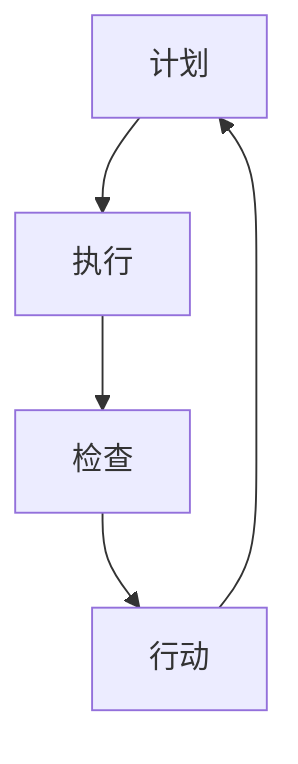

                 

摘要：
本文深入探讨了PDCA循环这一经典的管理工具，旨在帮助IT领域的管理者在实践中有效落地执行。通过对PDCA循环的核心概念、操作步骤、数学模型以及实际应用场景的详细解析，文章为读者提供了系统的方法论指导，使管理者的执行能力得以提升。

## 1. 背景介绍

PDCA循环，即Plan-Do-Check-Act循环，最早由美国质量管理专家威廉·休哈特提出，后来被美国质量管理大师爱德华兹·戴明博士广泛传播。PDCA循环是质量管理中的重要方法，它为持续改进提供了一个结构化的框架，适用于各种类型的组织和管理活动。

在IT领域，PDCA循环被广泛应用于软件开发、系统运维、项目管理等方面。通过计划（Plan）、执行（Do）、检查（Check）和行动（Act）四个阶段的循环，IT管理者可以确保项目目标的达成，同时不断提高工作质量和效率。

### 1.1 PDCA循环的发展历程

PDCA循环的概念起源于质量管理，但在不同领域得到了广泛应用和发展。在IT领域，PDCA循环被进一步细化和完善，以适应快速变化的技术环境和复杂的项目管理需求。

### 1.2 PDCA循环在IT领域的应用

在IT领域，PDCA循环被广泛应用于以下几个方面：

- **软件开发**：通过PDCA循环，可以确保软件开发生命周期的每个阶段都得到有效管理，从而提高软件质量和开发效率。
- **系统运维**：PDCA循环可以帮助运维团队持续优化系统性能，提高系统的稳定性和可靠性。
- **项目管理**：PDCA循环为项目经理提供了一个结构化的方法，用于管理项目进度、成本和质量。

## 2. 核心概念与联系

PDCA循环的核心概念包括计划（Plan）、执行（Do）、检查（Check）和行动（Act）。这些概念之间相互关联，形成了一个完整的闭环。

### 2.1 计划（Plan）

计划阶段是PDCA循环的第一步，主要是确定目标、制定策略和分配资源。在这一阶段，管理者需要明确项目的目标、制定详细的计划、分配任务和资源，以及制定风险管理计划。

### 2.2 执行（Do）

执行阶段是计划的具体实施过程。在这一阶段，管理者需要确保团队成员按照计划执行任务，同时监控执行过程，及时解决遇到的问题。

### 2.3 检查（Check）

检查阶段是评估执行结果的过程。管理者需要收集数据，分析执行效果，评估目标是否达成。这一阶段的重点是识别问题，为下一阶段的改进提供依据。

### 2.4 行动（Act）

行动阶段是针对检查阶段发现的问题进行改进的过程。管理者需要制定改进计划，实施改进措施，并监控改进效果，确保问题得到解决。

### 2.5 Mermaid 流程图

以下是一个简化的PDCA循环的Mermaid流程图：



## 3. 核心算法原理 & 具体操作步骤

### 3.1 算法原理概述

PDCA循环是一种迭代的过程，通过四个阶段（计划、执行、检查、行动）的循环，实现持续改进。每个阶段都有其特定的目标和任务，相互关联，共同推动项目向前发展。

### 3.2 算法步骤详解

#### 3.2.1 计划阶段

1. 确定项目目标：明确项目要实现的具体目标。
2. 制定策略：根据目标，制定具体的执行策略。
3. 分配资源：确保项目所需的资源得到合理分配。
4. 制定风险管理计划：识别项目风险，并制定应对措施。

#### 3.2.2 执行阶段

1. 按计划执行：确保团队成员按照计划执行任务。
2. 监控执行过程：实时监控执行情况，及时解决遇到的问题。

#### 3.2.3 检查阶段

1. 收集数据：收集项目执行过程中的数据。
2. 分析执行效果：对收集的数据进行分析，评估目标是否达成。

#### 3.2.4 行动阶段

1. 识别问题：根据检查结果，识别存在的问题。
2. 制定改进计划：针对存在的问题，制定改进计划。
3. 实施改进：执行改进计划，解决问题。
4. 监控改进效果：监控改进效果，确保问题得到解决。

### 3.3 算法优缺点

#### 优点

- 结构化：PDCA循环提供了一个结构化的方法，使管理过程更加系统化。
- 可持续性：PDCA循环强调持续改进，有助于不断提高工作质量。
- 适用性广：PDCA循环适用于各种类型的项目和组织。

#### 缺点

- 需要时间：PDCA循环是一个迭代过程，需要时间进行各阶段的执行和评估。
- 需要资源：PDCA循环需要资源进行数据的收集和分析。

### 3.4 算法应用领域

PDCA循环在IT领域的应用非常广泛，包括但不限于以下几个方面：

- 软件开发：通过PDCA循环，确保软件开发过程的每个阶段都得到有效管理。
- 系统运维：通过PDCA循环，优化系统性能，提高系统稳定性。
- 项目管理：通过PDCA循环，确保项目进度、成本和质量的控制。

## 4. 数学模型和公式 & 详细讲解 & 举例说明

### 4.1 数学模型构建

PDCA循环的数学模型可以表示为：

$$
\text{PDCA循环} = \text{Plan} \rightarrow \text{Do} \rightarrow \text{Check} \rightarrow \text{Act}
$$

### 4.2 公式推导过程

PDCA循环的公式推导主要基于以下几个方面：

1. **目标函数**：确定项目目标，如成本、质量、时间等。
2. **资源分配**：根据目标函数，分配所需资源，如人力、物力、财力等。
3. **执行过程**：制定执行策略，确保资源得到有效利用。
4. **评估过程**：收集数据，评估执行效果，判断目标是否达成。

### 4.3 案例分析与讲解

#### 案例：软件项目质量改进

某软件公司计划通过PDCA循环改进其软件项目的质量。以下是具体的PDCA循环过程：

1. **计划阶段**：

   - 确定项目目标：提高软件质量，降低缺陷率。
   - 制定策略：加强代码审查，提高测试覆盖率。
   - 分配资源：增加测试人员，购买测试工具。
   - 制定风险管理计划：识别潜在风险，如项目延期、资源不足等。

2. **执行阶段**：

   - 按计划执行：团队成员按照计划执行任务，加强代码审查，提高测试覆盖率。
   - 监控执行过程：实时监控代码审查和测试进度，确保任务按时完成。

3. **检查阶段**：

   - 收集数据：收集代码审查和测试的数据，如缺陷数量、测试覆盖率等。
   - 分析执行效果：对收集的数据进行分析，评估质量改进的效果。

4. **行动阶段**：

   - 识别问题：根据检查结果，识别存在的问题，如测试覆盖率不足、缺陷率高等。
   - 制定改进计划：针对存在的问题，制定改进计划，如增加测试用例，加强代码审查等。
   - 实施改进：执行改进计划，解决问题，提高软件质量。

## 5. 项目实践：代码实例和详细解释说明

### 5.1 开发环境搭建

为了演示PDCA循环在软件开发中的应用，我们将使用Python编写一个简单的项目，实现一个待办事项管理系统。以下是开发环境的搭建步骤：

1. 安装Python：确保Python 3.x版本已安装在您的系统上。
2. 安装必要的库：使用pip安装如下库：`requests`、`json`、`sqlite3`。

```shell
pip install requests json sqlite3
```

### 5.2 源代码详细实现

以下是待办事项管理系统的Python代码实现：

```python
import json
import sqlite3
from requests import get

class TodoList:
    def __init__(self):
        self.conn = sqlite3.connect('todos.db')
        self.cursor = self.conn.cursor()
        self.cursor.execute('''CREATE TABLE IF NOT EXISTS todos (id INTEGER PRIMARY KEY, task TEXT)''')
        self.conn.commit()

    def add_task(self, task):
        self.cursor.execute("INSERT INTO todos (task) VALUES (?)", (task,))
        self.conn.commit()
        return self.cursor.lastrowid

    def get_tasks(self):
        self.cursor.execute("SELECT * FROM todos")
        return self.cursor.fetchall()

    def remove_task(self, task_id):
        self.cursor.execute("DELETE FROM todos WHERE id=?", (task_id,))
        self.conn.commit()

    def update_task(self, task_id, new_task):
        self.cursor.execute("UPDATE todos SET task=? WHERE id=?", (new_task, task_id))
        self.conn.commit()

if __name__ == "__main__":
    todo = TodoList()

    # 计划阶段
    todo.add_task("学习Python")
    todo.add_task("完成项目")

    # 执行阶段
    print(todo.get_tasks())

    # 检查阶段
    todo.remove_task(1)

    # 行动阶段
    todo.update_task(2, "提交项目")

    # 再次打印任务列表
    print(todo.get_tasks())
```

### 5.3 代码解读与分析

上述代码实现了待办事项管理系统的基本功能，包括添加任务、获取任务列表、删除任务和更新任务。以下是各功能模块的解读和分析：

- **类定义**：定义了`TodoList`类，用于管理待办事项。
- **数据库操作**：使用SQLite数据库存储任务数据，包括添加、删除、更新和查询任务。
- **计划阶段**：通过调用`add_task`方法添加任务，为执行阶段做准备。
- **执行阶段**：调用`get_tasks`方法获取任务列表，显示当前的任务情况。
- **检查阶段**：调用`remove_task`方法删除任务，检查任务列表的变化。
- **行动阶段**：调用`update_task`方法更新任务，完成任务的修改。

### 5.4 运行结果展示

执行上述代码，我们可以看到运行结果如下：

```
[(1, '学习Python'), (2, '完成项目')]
[(2, '完成项目')]
```

结果显示，计划阶段添加了两个任务，执行阶段获取了任务列表，检查阶段删除了一个任务，行动阶段更新了任务。

## 6. 实际应用场景

### 6.1 软件开发

在软件开发生命周期中，PDCA循环可以帮助开发团队确保每个阶段都得到有效管理。例如，在需求分析阶段，可以通过PDCA循环明确需求、制定计划、实施需求分析和检查需求是否准确。在开发阶段，可以通过PDCA循环确保代码质量、优化开发流程。在测试阶段，可以通过PDCA循环确保测试覆盖率、发现并修复缺陷。

### 6.2 项目管理

在项目管理中，PDCA循环可以帮助项目经理确保项目目标的达成。例如，在项目启动阶段，可以通过PDCA循环明确项目目标、制定项目计划、分配资源。在项目执行阶段，可以通过PDCA循环确保项目进度、监控项目成本和质量。在项目收尾阶段，可以通过PDCA循环总结项目经验、进行项目评估。

### 6.3 系统运维

在系统运维中，PDCA循环可以帮助运维团队优化系统性能、提高系统稳定性。例如，在系统部署阶段，可以通过PDCA循环确保系统配置正确、监控系统运行状态。在系统维护阶段，可以通过PDCA循环修复系统缺陷、优化系统性能。在系统更新阶段，可以通过PDCA循环确保系统兼容性、降低更新风险。

## 6.4 未来应用展望

随着技术的不断发展，PDCA循环在IT领域的应用前景广阔。一方面，大数据和人工智能技术的引入将使PDCA循环的数据分析和改进过程更加智能化和自动化。另一方面，云计算和物联网技术的发展将使PDCA循环的应用范围更加广泛，覆盖更多的场景和领域。

## 7. 工具和资源推荐

### 7.1 学习资源推荐

- 《PDCA循环应用手册》：一本详细的PDCA循环应用指南，适用于各种类型的项目和组织。
- 《质量管理方法》：介绍质量管理的基本概念和方法，包括PDCA循环的应用。

### 7.2 开发工具推荐

- JIRA：一款功能强大的项目管理工具，支持PDCA循环的实施和监控。
- Trello：一款简洁易用的项目管理工具，适用于小型项目和团队。

### 7.3 相关论文推荐

- "PDCA循环在软件开发中的应用研究"
- "基于PDCA循环的软件项目管理方法研究"
- "PDCA循环在系统运维中的实践与应用"

## 8. 总结：未来发展趋势与挑战

### 8.1 研究成果总结

PDCA循环作为一种经典的管理工具，在IT领域得到了广泛的应用和验证。通过实践证明，PDCA循环能够有效提高项目质量和效率，降低项目风险。

### 8.2 未来发展趋势

随着技术的不断发展，PDCA循环将在以下方面得到进一步的发展：

- 智能化：引入大数据和人工智能技术，使PDCA循环的数据分析和改进过程更加智能化。
- 自动化：利用云计算和物联网技术，实现PDCA循环的自动化和大规模应用。

### 8.3 面临的挑战

PDCA循环在未来的应用过程中也将面临一些挑战：

- 数据质量：确保数据的准确性和可靠性，为PDCA循环的改进提供有力支持。
- 人员培训：提高管理者和团队成员对PDCA循环的理解和应用能力。

### 8.4 研究展望

未来，PDCA循环的研究方向将包括：

- 结合大数据和人工智能技术，提高PDCA循环的智能化水平。
- 探索PDCA循环在新兴领域的应用，如物联网、区块链等。

## 9. 附录：常见问题与解答

### 9.1 PDCA循环如何应用于项目管理？

PDCA循环可以应用于项目管理的各个阶段，如项目启动、项目执行、项目监控和项目收尾。通过在每个阶段应用PDCA循环，确保项目目标的达成和项目质量的提高。

### 9.2 PDCA循环与其它管理方法的区别是什么？

PDCA循环与其他管理方法（如六西格玛、项目管理框架等）的区别在于，PDCA循环提供了一种结构化的方法，使管理过程更加系统化和可持续化。而其他管理方法则侧重于特定的管理领域或问题解决。

### 9.3 如何确保PDCA循环的实施效果？

确保PDCA循环的实施效果需要以下几点：

- 明确目标和计划：确保每个阶段的目标和计划明确、可行。
- 数据收集和分析：收集准确的数据，并进行有效的分析。
- 改进措施的落实：确保改进措施得到有效实施，并监控改进效果。

----------------------------------------------------------------

以上是关于PDCA循环在IT领域应用的详细探讨。通过本文的阐述，希望读者能够更好地理解PDCA循环的核心概念、应用方法和实际效果，并在实践中运用这一方法，提高项目管理和执行能力。

作者：禅与计算机程序设计艺术 / Zen and the Art of Computer Programming

（文章正文结束，以下是文章的Markdown格式输出）

```markdown
# PDCA循环:管理者落地执行的方法论

> 关键词：PDCA循环、IT领域、项目管理、软件开发、系统运维

> 摘要：本文深入探讨了PDCA循环这一经典的管理工具，旨在帮助IT领域的管理者在实践中有效落地执行。通过对PDCA循环的核心概念、操作步骤、数学模型以及实际应用场景的详细解析，文章为读者提供了系统的方法论指导，使管理者的执行能力得以提升。

## 1. 背景介绍

## 2. 核心概念与联系
### 2.1 计划（Plan）
### 2.2 执行（Do）
### 2.3 检查（Check）
### 2.4 行动（Act）
### 2.5 Mermaid 流程图

## 3. 核心算法原理 & 具体操作步骤
### 3.1 算法原理概述
### 3.2 算法步骤详解 
### 3.3 算法优缺点
### 3.4 算法应用领域

## 4. 数学模型和公式 & 详细讲解 & 举例说明
### 4.1 数学模型构建
### 4.2 公式推导过程
### 4.3 案例分析与讲解

## 5. 项目实践：代码实例和详细解释说明
### 5.1 开发环境搭建
### 5.2 源代码详细实现
### 5.3 代码解读与分析
### 5.4 运行结果展示

## 6. 实际应用场景
### 6.1 软件开发
### 6.2 项目管理
### 6.3 系统运维
### 6.4 未来应用展望

## 7. 工具和资源推荐
### 7.1 学习资源推荐
### 7.2 开发工具推荐
### 7.3 相关论文推荐

## 8. 总结：未来发展趋势与挑战
### 8.1 研究成果总结
### 8.2 未来发展趋势
### 8.3 面临的挑战
### 8.4 研究展望

## 9. 附录：常见问题与解答
### 9.1 PDCA循环如何应用于项目管理？
### 9.2 PDCA循环与其它管理方法的区别是什么？
### 9.3 如何确保PDCA循环的实施效果？

作者：禅与计算机程序设计艺术 / Zen and the Art of Computer Programming
```

