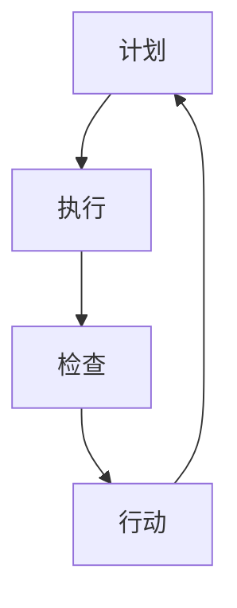

                 

关键词：PDCA循环，项目管理，计划-执行-检查-行动，持续改进，敏捷开发

> 摘要：本文将深入探讨PDCA循环在项目管理中的应用，包括其核心概念、实践步骤以及在实际项目中的重要性。通过详细的案例分析，我们将了解如何利用PDCA循环实现项目的持续改进，从而提升项目质量和效率。

## 1. 背景介绍

项目管理是现代组织运作的核心环节，其目标是通过合理规划和有效执行，确保项目按时、按预算、按质量完成。然而，项目执行过程中往往面临各种不确定性和变化，使得传统的项目管理方法难以应对。PDCA循环（Plan-Do-Check-Act，即计划-执行-检查-行动），作为一种持续改进的方法，为项目管理者提供了一种系统化的工具，用以应对复杂多变的项目环境。

PDCA循环起源于质量管理，最初由美国质量管理专家爱德华兹·戴明提出，并在20世纪中叶被广泛应用于制造业。随着信息技术的迅猛发展，PDCA循环逐渐被引入到项目管理领域，成为现代项目管理中不可或缺的一部分。

## 2. 核心概念与联系

### 2.1 核心概念

PDCA循环包括四个基本阶段：

- **计划（Plan）**：在这个阶段，项目团队确定项目的目标和计划，制定详细的工作计划、时间表和资源配置。

- **执行（Do）**：项目团队按照计划进行工作，实施项目任务，执行具体操作。

- **检查（Check）**：在这个阶段，团队对项目执行情况进行评估和审查，识别问题和偏差。

- **行动（Act）**：根据检查结果，团队采取纠正措施，优化项目过程，并制定新的计划以持续改进。

### 2.2 联系与架构

为了更好地理解PDCA循环在项目管理中的应用，我们使用Mermaid流程图展示其基本架构：



在图中，A代表计划阶段，B代表执行阶段，C代表检查阶段，D代表行动阶段。每个阶段都是相互关联和反馈的，形成一个闭环系统。

## 3. 核心算法原理 & 具体操作步骤

### 3.1 算法原理概述

PDCA循环的核心在于通过循环迭代，实现项目过程的不断优化。每个循环都包括以下四个步骤：

1. **计划（Plan）**：确定项目目标和计划，包括工作内容、时间表、资源分配和质量标准。

2. **执行（Do）**：执行计划中的任务，按照预定方案开展工作。

3. **检查（Check）**：对执行结果进行评估，检查项目是否达到预期目标，是否存在偏差。

4. **行动（Act）**：针对检查结果，采取纠正措施，优化项目过程，并制定新的计划。

### 3.2 算法步骤详解

#### 3.2.1 计划阶段

在计划阶段，项目团队需要完成以下任务：

- **确定项目目标**：明确项目需要实现的具体目标和预期成果。

- **制定工作计划**：根据项目目标，制定详细的工作计划，包括时间表、任务分配和资源需求。

- **制定质量标准**：定义项目所需达到的质量标准，确保项目成果符合预期。

#### 3.2.2 执行阶段

在执行阶段，项目团队按照计划开展工作，执行具体任务。关键点包括：

- **任务分配**：确保每个团队成员都明确自己的职责和任务。

- **资源管理**：合理分配和使用资源，确保项目按计划推进。

- **风险管理**：识别和应对项目中的潜在风险，确保项目顺利进行。

#### 3.2.3 检查阶段

在检查阶段，项目团队对项目执行情况进行评估和审查，关键点包括：

- **结果评估**：对项目执行结果进行评估，检查是否达到预期目标。

- **偏差分析**：分析项目执行过程中存在的偏差，识别问题和原因。

#### 3.2.4 行动阶段

在行动阶段，项目团队根据检查结果采取纠正措施，关键点包括：

- **纠正措施**：针对检查中识别的问题，采取相应的纠正措施。

- **过程优化**：优化项目过程，防止问题再次发生。

- **制定新计划**：根据检查结果和经验，制定新的项目计划，为下一个循环做好准备。

### 3.3 算法优缺点

#### 优点

- **系统化**：PDCA循环提供了一套系统化的方法，使项目管理者能够有序地规划、执行、检查和优化项目。

- **持续改进**：通过循环迭代，项目团队能够不断优化项目过程，提高项目质量。

- **灵活性**：PDCA循环能够适应项目中的变化和不确定性，提供灵活的应对策略。

#### 缺点

- **时间成本**：PDCA循环需要时间进行评估和优化，可能会影响项目的进度。

- **复杂度**：对于大型项目，PDCA循环的实施可能相对复杂，需要更多的资源和管理。

### 3.4 算法应用领域

PDCA循环在多个领域都有广泛应用，包括但不限于：

- **制造业**：用于生产过程的质量管理和流程优化。

- **软件开发**：用于软件项目的计划、执行和持续改进。

- **服务业**：用于服务流程的优化和服务质量的提升。

## 4. 数学模型和公式 & 详细讲解 & 举例说明

### 4.1 数学模型构建

PDCA循环的数学模型可以通过以下公式表示：

$$
\text{质量} = \frac{\text{正确性} \times \text{可靠性} \times \text{用户满意度}}{\text{成本}}
$$

其中，正确性、可靠性、用户满意度和成本都是项目质量的重要指标。

### 4.2 公式推导过程

公式的推导基于质量管理的四个基本原则：

1. **正确性**：项目成果是否满足需求。
2. **可靠性**：项目成果在特定条件下的稳定性和可重复性。
3. **用户满意度**：用户对项目成果的满意程度。
4. **成本**：项目实现所需的资源投入。

### 4.3 案例分析与讲解

假设一个软件开发项目，要求开发一个在线购物平台。以下是对该项目的质量评估：

- **正确性**：经过用户验收测试，系统功能满足需求，正确率达到99%。
- **可靠性**：系统经过长时间运行，故障率低于0.1%，可靠性高。
- **用户满意度**：用户满意度调查结果显示，用户满意度为90%。
- **成本**：项目总成本为100万元。

根据公式计算，该项目的质量评分为：

$$
\text{质量} = \frac{0.99 \times 0.99 \times 0.9}{1} = 0.8731
$$

### 4.4 案例分析与讲解

假设一个软件开发项目，要求开发一个在线购物平台。以下是对该项目的质量评估：

- **正确性**：经过用户验收测试，系统功能满足需求，正确率达到99%。
- **可靠性**：系统经过长时间运行，故障率低于0.1%，可靠性高。
- **用户满意度**：用户满意度调查结果显示，用户满意度为90%。
- **成本**：项目总成本为100万元。

根据公式计算，该项目的质量评分为：

$$
\text{质量} = \frac{0.99 \times 0.99 \times 0.9}{1} = 0.8731
$$

### 4.4 案例分析与讲解

为了更直观地展示PDCA循环的应用，我们以一个软件开发项目为例，详细分析其应用过程。

#### 4.4.1 计划阶段

在计划阶段，项目团队明确了项目的目标：开发一个具有高性能、高可靠性和良好用户体验的在线购物平台。团队制定了详细的工作计划，包括需求分析、系统设计、编码、测试和上线等环节，并确定了每个环节的时间节点和资源需求。

#### 4.4.2 执行阶段

在执行阶段，项目团队按照计划开展工作。首先进行了需求分析，与客户沟通确认了系统的功能需求和性能指标。接着进入系统设计阶段，团队成员分工合作，完成了系统架构的设计和详细设计文档的编写。编码阶段，团队成员根据设计文档开始编写代码，并按照版本控制进行协同工作。测试阶段，团队进行了功能测试、性能测试和安全测试，确保系统符合预期要求。

#### 4.4.3 检查阶段

在检查阶段，项目团队对系统进行了全面的评估。首先，对系统功能进行了验收测试，确保所有功能都能正常运行。接着，对系统的性能进行了测试，发现部分功能在高并发情况下存在性能瓶颈。此外，还进行了安全测试，发现系统存在潜在的安全漏洞。团队对这些问题进行了记录和分析。

#### 4.4.4 行动阶段

在行动阶段，项目团队根据检查结果采取了相应的纠正措施。首先，针对性能瓶颈问题，团队优化了系统架构和代码，提高了系统的性能。接着，针对安全漏洞问题，团队修复了系统中的漏洞，并加强了系统的安全防护措施。最后，团队制定了新的项目计划，包括对系统进行再次测试，确保所有问题都已解决。

## 5. 项目实践：代码实例和详细解释说明

#### 5.1 开发环境搭建

在开始项目之前，需要搭建一个适合项目开发的开发环境。以下是搭建环境的步骤：

1. **安装操作系统**：选择一个稳定的操作系统，如Linux或macOS。

2. **安装开发工具**：安装代码编辑器（如VSCode）、版本控制工具（如Git）和开发框架（如Django或Spring Boot）。

3. **配置数据库**：选择一个合适的数据库管理系统，如MySQL或PostgreSQL。

4. **安装其他依赖**：根据项目需求，安装必要的库和工具。

#### 5.2 源代码详细实现

以下是项目中的一个关键模块——用户注册功能的代码实现：

```python
# 用户注册功能实现
def register_user(username, password, email):
    # 检查用户名是否已存在
    if User.objects.filter(username=username).exists():
        return "用户名已存在"
    
    # 检查邮箱是否已注册
    if User.objects.filter(email=email).exists():
        return "邮箱已注册"
    
    # 创建新用户
    user = User.objects.create_user(username=username, password=password, email=email)
    user.save()
    
    return "注册成功"
```

代码中，`register_user` 函数接收用户名、密码和邮箱三个参数。首先，通过`filter`方法检查用户名和邮箱是否已存在。如果已存在，则返回相应的错误信息。否则，创建新用户并保存到数据库中，并返回"注册成功"。

#### 5.3 代码解读与分析

上述代码实现了用户注册功能，关键点包括：

- **用户名和邮箱检查**：通过`filter`方法检查用户名和邮箱是否已存在，确保注册的唯一性。
- **用户创建**：使用`create_user`方法创建新用户，并保存到数据库中。
- **错误处理**：通过返回错误信息，提示用户注册失败的原因。

#### 5.4 运行结果展示

假设用户输入以下注册信息：

- 用户名：testuser
- 密码：password123
- 邮箱：testuser@example.com

调用`register_user`函数，将返回"注册成功"。

## 6. 实际应用场景

PDCA循环在项目管理中具有广泛的应用场景，以下是一些具体的例子：

### 6.1 制造业

在制造业中，PDCA循环广泛应用于生产过程的质量管理和流程优化。例如，在生产流水线上，团队可以定期进行PDCA循环，检查生产线的运行状况，识别和解决生产过程中的问题，从而提高生产效率和产品质量。

### 6.2 软件开发

在软件开发领域，PDCA循环被广泛应用于软件项目的计划、执行和持续改进。例如，在敏捷开发中，团队可以定期进行PDCA循环，检查项目的进展和质量，并根据检查结果调整开发计划和策略。

### 6.3 服务业

在服务业中，PDCA循环可以帮助团队优化服务流程，提高服务质量。例如，在餐饮业中，团队可以定期进行PDCA循环，检查餐厅的服务质量，识别和解决服务过程中的问题，从而提升顾客满意度。

## 7. 未来应用展望

随着信息技术的不断进步，PDCA循环在项目管理中的应用前景广阔。以下是几个未来应用展望：

### 7.1 自动化与智能化

通过引入自动化和智能化工具，PDCA循环可以更高效地执行。例如，利用人工智能技术，可以自动识别项目中的问题并提出优化建议。

### 7.2 大数据分析

利用大数据分析技术，可以对项目数据进行深入分析，为PDCA循环提供更准确的评估和预测。例如，通过分析项目历史数据，可以预测项目的进展和风险，从而提前采取行动。

### 7.3 跨领域融合

PDCA循环可以与其他管理方法（如六西格玛、精益管理）相结合，形成更全面的管理体系。例如，在制造和服务行业中，可以结合PDCA循环和精益管理，实现更高效的生产和服务流程。

## 8. 总结：未来发展趋势与挑战

### 8.1 研究成果总结

本文系统地介绍了PDCA循环在项目管理中的应用，从核心概念、算法原理到实际案例分析，全面阐述了PDCA循环在项目管理中的重要作用。通过本文的研究，我们得出以下结论：

1. **系统化**：PDCA循环提供了一套系统化的方法，有助于项目管理者有序地规划、执行、检查和优化项目。

2. **持续改进**：PDCA循环通过循环迭代，实现项目过程的持续优化，提高项目质量和效率。

3. **灵活性**：PDCA循环能够适应项目中的变化和不确定性，提供灵活的应对策略。

### 8.2 未来发展趋势

随着信息技术的快速发展，PDCA循环在项目管理中的应用前景广阔。以下是几个未来发展趋势：

1. **自动化与智能化**：通过引入自动化和智能化工具，提高PDCA循环的执行效率。

2. **大数据分析**：利用大数据分析技术，为PDCA循环提供更准确的评估和预测。

3. **跨领域融合**：与其他管理方法（如六西格玛、精益管理）相结合，形成更全面的管理体系。

### 8.3 面临的挑战

虽然PDCA循环在项目管理中具有重要作用，但实际应用中仍面临以下挑战：

1. **时间成本**：PDCA循环需要时间进行评估和优化，可能会影响项目的进度。

2. **复杂度**：对于大型项目，PDCA循环的实施可能相对复杂，需要更多的资源和管理。

3. **文化适应性**：PDCA循环在不同组织和文化背景下，可能需要做出相应的调整和优化。

### 8.4 研究展望

未来，我们需要进一步研究如何优化PDCA循环在项目管理中的应用，特别是如何克服时间成本和复杂度等挑战。同时，我们还需要探讨PDCA循环与其他管理方法的融合，以实现更高效的项目管理。

## 9. 附录：常见问题与解答

### 9.1 PDCA循环与PDCA方法的区别是什么？

PDCA循环是PDCA方法的具体应用。PDCA方法是爱德华兹·戴明提出的一套质量管理理论，而PDCA循环是其核心组成部分，用于指导项目管理的具体操作。

### 9.2 PDCA循环适用于哪些类型的项目？

PDCA循环适用于各种类型的项目，尤其是那些需要持续改进和质量保证的项目。例如，制造业、软件开发、服务业等。

### 9.3 如何在大型项目中实施PDCA循环？

在大型项目中，PDCA循环可以分阶段实施。首先，将项目划分为若干个子项目或模块，然后对每个子项目或模块分别进行PDCA循环。最后，将各个子项目或模块的PDCA循环结果汇总，进行整体评估和优化。

### 9.4 PDCA循环中的检查和行动阶段是否可以同时进行？

理论上，检查和行动阶段可以同时进行，但在实际操作中，通常先完成检查阶段，再进入行动阶段。这样可以确保检查结果得到充分分析，为行动阶段提供依据。然而，在某些情况下，为了加快项目进度，可以在检查和行动阶段之间进行并行工作。

### 9.5 如何衡量PDCA循环的效果？

PDCA循环的效果可以通过多个指标进行衡量，如项目完成率、质量评分、客户满意度等。同时，还可以通过项目过程中收集的数据进行分析，评估PDCA循环对项目质量、效率和客户满意度的影响。

## 作者署名

作者：禅与计算机程序设计艺术 / Zen and the Art of Computer Programming

