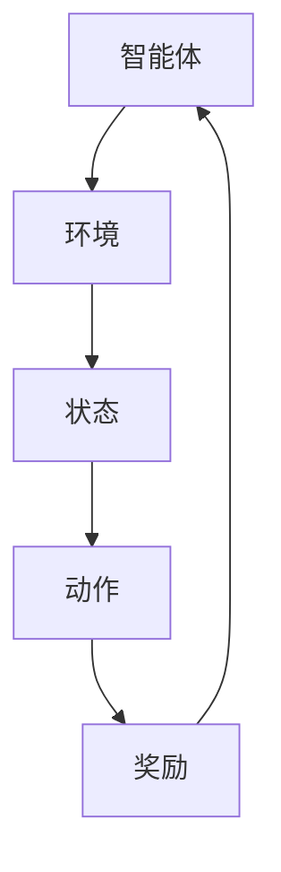
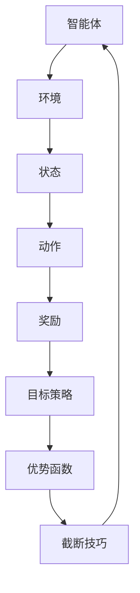
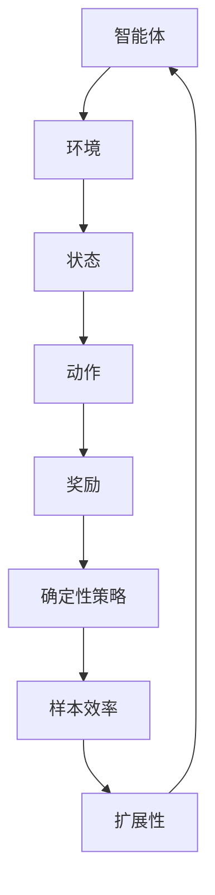
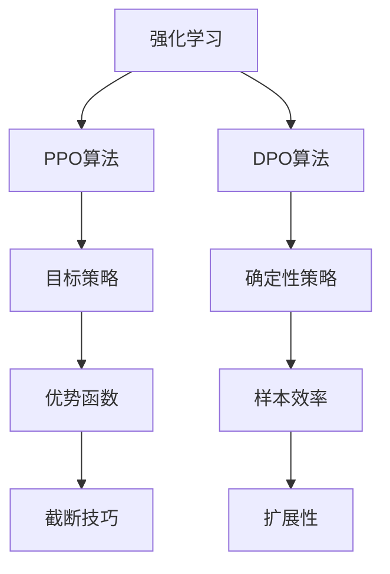

                 

关键词：PPO算法、DPO算法、强化学习、策略优化、策略迭代、智能控制、决策过程

### 摘要

本文将深入探讨两种在强化学习领域中具有重要地位的算法：PPO（Proximal Policy Optimization）和DPO（Deterministic Policy Optimization）。我们将从背景介绍开始，通过核心概念与联系、算法原理与操作步骤、数学模型与公式推导、实际应用场景、项目实践等多个角度，全面解析这两种算法的基本原理和应用价值。最后，我们将对未来的发展趋势与挑战进行展望，为读者提供关于这一领域的深度见解。

## 1. 背景介绍

强化学习（Reinforcement Learning，RL）是一种机器学习范式，通过智能体（agent）与环境的交互来学习优化行为策略，从而最大化累积奖励。随着深度学习技术的发展，强化学习在近年来取得了显著进展，尤其在游戏、机器人、自动驾驶等领域展现了强大的应用潜力。

PPO算法和DPO算法是强化学习领域的重要进步。PPO算法通过改进策略梯度的估计，提高了策略优化过程的稳定性；而DPO算法则通过引入确定性策略，实现了更高效和稳定的学习过程。本文将详细分析这两种算法的核心原理、具体操作步骤、数学模型和实际应用，为读者提供全面的技术解读。

### 1.1 强化学习的核心概念

在强化学习中，核心概念包括智能体、环境、状态、动作和奖励。智能体是执行动作的实体，环境是智能体行动的场所，状态是环境的某种描述，动作是智能体对环境的响应，奖励是环境对智能体动作的反馈。智能体通过不断与环境交互，学习最优策略以最大化累积奖励。

强化学习的过程可以概括为以下几个步骤：

1. **初始化**：设置智能体的初始状态，定义学习目标和奖励机制。
2. **行动**：智能体根据当前状态选择一个动作。
3. **反馈**：环境根据智能体的动作提供相应的奖励。
4. **更新**：智能体基于当前的奖励更新策略，以优化长期累积奖励。
5. **迭代**：重复上述步骤，不断更新策略，直至满足终止条件。

### 1.2 PPO算法的起源与发展

PPO算法最早由OpenAI在2017年提出，旨在解决传统策略梯度算法在策略优化过程中易受噪声影响和梯度消失等问题。PPO算法通过引入近端策略优化（Proximal Policy Optimization）技术，改进了策略梯度的估计，提高了策略优化的稳定性和效率。

PPO算法的主要改进点包括：

1. **目标策略**：引入目标策略，使得策略更新更加平滑，减少了策略振荡。
2. **优势函数**：使用优势函数（ Advantage Function）来衡量不同策略的优劣，优化策略梯度估计。
3. **截断技巧**：通过截断策略梯度估计的范围，减小梯度估计的误差，提高策略优化的稳定性。

### 1.3 DPO算法的提出与应用

DPO算法由DeepMind在2020年提出，旨在解决传统强化学习算法在处理连续动作和确定性策略时的挑战。DPO算法通过引入确定性策略，实现了更高效和稳定的学习过程。

DPO算法的主要特点包括：

1. **确定性策略**：使用确定性策略来减少策略噪声，提高决策的稳定性。
2. **样本效率**：通过减少策略噪声，提高了样本利用效率，减少了训练时间。
3. **扩展性**：适用于处理连续动作问题，可以应用于更广泛的领域。

## 2. 核心概念与联系

为了深入理解PPO和DPO算法，我们需要从核心概念和原理的角度进行探讨，并通过Mermaid流程图来展示这些概念和原理之间的联系。

### 2.1 强化学习基本概念

首先，强化学习的基本概念包括智能体、环境、状态、动作和奖励。智能体是执行动作的实体，环境是智能体行动的场所，状态是环境的某种描述，动作是智能体对环境的响应，奖励是环境对智能体动作的反馈。智能体通过不断与环境交互，学习最优策略以最大化累积奖励。

以下是一个Mermaid流程图，展示了强化学习的基本概念和它们之间的联系：



### 2.2 PPO算法的核心概念

PPO算法的核心概念包括目标策略、优势函数和截断技巧。目标策略用于平滑策略更新过程，优势函数用于衡量不同策略的优劣，截断技巧用于减小梯度估计的误差。

以下是一个Mermaid流程图，展示了PPO算法的核心概念和它们之间的联系：



### 2.3 DPO算法的核心概念

DPO算法的核心概念包括确定性策略、样本效率和扩展性。确定性策略用于减少策略噪声，提高决策的稳定性，样本效率用于提高样本利用效率，扩展性用于处理连续动作问题。

以下是一个Mermaid流程图，展示了DPO算法的核心概念和它们之间的联系：



### 2.4 PPO与DPO的联系

PPO和DPO算法在强化学习领域中都有着重要的应用，它们之间也存在一定的联系。PPO算法通过改进策略梯度的估计，提高了策略优化的稳定性；而DPO算法通过引入确定性策略，实现了更高效和稳定的学习过程。

以下是一个Mermaid流程图，展示了PPO和DPO算法之间的联系：



通过上述Mermaid流程图，我们可以清晰地看到PPO和DPO算法的核心概念和原理，以及它们在强化学习中的应用。这些概念和原理构成了理解这两种算法的基础，为进一步探讨其具体实现和应用提供了重要的参考。

## 3. 核心算法原理 & 具体操作步骤

在深入理解PPO和DPO算法的核心概念后，接下来我们将详细探讨这两种算法的基本原理和具体操作步骤。通过对算法原理的阐述和操作步骤的讲解，我们将为读者提供全面的技术指导。

### 3.1 PPO算法原理概述

PPO（Proximal Policy Optimization）算法是一种基于策略梯度的强化学习算法，其主要目的是优化策略函数，使智能体能够通过学习获得最优策略。PPO算法通过改进策略梯度的估计，提高了策略优化的稳定性和效率。

PPO算法的核心思想是使用目标策略来平滑策略更新过程，并通过优势函数来衡量不同策略的优劣。具体来说，PPO算法包括以下几个关键步骤：

1. **初始化**：设置智能体的初始状态，定义学习目标和奖励机制。
2. **采样**：从当前状态开始，智能体根据当前策略选择动作，并收集一系列的过渡数据。
3. **计算目标策略**：根据收集到的过渡数据，计算目标策略的期望回报。
4. **策略更新**：通过优化目标策略来更新智能体的策略函数。
5. **截断技巧**：在策略更新过程中，使用截断技巧来减小梯度估计的误差，提高策略优化的稳定性。

### 3.2 PPO算法具体操作步骤

以下是PPO算法的具体操作步骤：

#### 3.2.1 初始化

在PPO算法的初始化阶段，我们需要设置智能体的初始状态、学习目标和奖励机制。具体操作如下：

1. **初始化智能体状态**：设置智能体的初始状态，例如位置、速度等。
2. **定义学习目标**：设定智能体的学习目标，例如达到特定位置、完成特定任务等。
3. **初始化奖励机制**：定义奖励函数，用于衡量智能体在不同状态下的表现。

#### 3.2.2 采样

在采样阶段，智能体从当前状态开始，根据当前策略选择动作，并收集一系列的过渡数据。具体操作如下：

1. **选择动作**：根据当前状态，智能体使用策略函数选择一个动作。
2. **执行动作**：智能体执行选择的动作，并观察环境反馈。
3. **收集过渡数据**：收集包括状态、动作、奖励和下一个状态的数据。

#### 3.2.3 计算目标策略

在计算目标策略阶段，我们需要根据收集到的过渡数据，计算目标策略的期望回报。具体操作如下：

1. **计算优势函数**：使用优势函数来衡量当前策略和目标策略之间的差距。
2. **计算目标策略回报**：根据优势函数和奖励，计算目标策略的期望回报。

#### 3.2.4 策略更新

在策略更新阶段，通过优化目标策略来更新智能体的策略函数。具体操作如下：

1. **计算策略梯度**：根据目标策略的期望回报，计算策略梯度。
2. **优化策略函数**：使用策略梯度来更新智能体的策略函数，使得目标策略更加优秀。

#### 3.2.5 截断技巧

在策略更新过程中，使用截断技巧来减小梯度估计的误差，提高策略优化的稳定性。具体操作如下：

1. **设置截断参数**：设定一个截断参数，用于限制策略梯度的范围。
2. **截断策略梯度**：将策略梯度截断到设定的范围，减小梯度估计的误差。

### 3.3 DPO算法原理概述

DPO（Deterministic Policy Optimization）算法是一种基于确定性策略优化的强化学习算法，其主要目的是优化确定性策略函数，使智能体能够通过学习获得最优策略。DPO算法通过引入确定性策略，提高了决策的稳定性和效率。

DPO算法的核心思想是使用确定性策略来减少策略噪声，并通过样本效率和扩展性来提高学习效率。具体来说，DPO算法包括以下几个关键步骤：

1. **初始化**：设置智能体的初始状态，定义学习目标和奖励机制。
2. **采样**：从当前状态开始，智能体根据当前确定性策略选择动作，并收集一系列的过渡数据。
3. **计算目标策略**：根据收集到的过渡数据，计算目标策略的期望回报。
4. **策略更新**：通过优化目标策略来更新智能体的策略函数。
5. **样本效率优化**：通过减少策略噪声，提高样本利用效率。

### 3.4 DPO算法具体操作步骤

以下是DPO算法的具体操作步骤：

#### 3.4.1 初始化

在DPO算法的初始化阶段，我们需要设置智能体的初始状态、学习目标和奖励机制。具体操作如下：

1. **初始化智能体状态**：设置智能体的初始状态，例如位置、速度等。
2. **定义学习目标**：设定智能体的学习目标，例如达到特定位置、完成特定任务等。
3. **初始化奖励机制**：定义奖励函数，用于衡量智能体在不同状态下的表现。

#### 3.4.2 采样

在采样阶段，智能体从当前状态开始，根据当前确定性策略选择动作，并收集一系列的过渡数据。具体操作如下：

1. **选择动作**：根据当前状态，智能体使用确定性策略选择一个动作。
2. **执行动作**：智能体执行选择的动作，并观察环境反馈。
3. **收集过渡数据**：收集包括状态、动作、奖励和下一个状态的数据。

#### 3.4.3 计算目标策略

在计算目标策略阶段，我们需要根据收集到的过渡数据，计算目标策略的期望回报。具体操作如下：

1. **计算优势函数**：使用优势函数来衡量当前策略和目标策略之间的差距。
2. **计算目标策略回报**：根据优势函数和奖励，计算目标策略的期望回报。

#### 3.4.4 策略更新

在策略更新阶段，通过优化目标策略来更新智能体的策略函数。具体操作如下：

1. **计算策略梯度**：根据目标策略的期望回报，计算策略梯度。
2. **优化策略函数**：使用策略梯度来更新智能体的策略函数，使得目标策略更加优秀。

#### 3.4.5 样本效率优化

在策略更新过程中，通过减少策略噪声，提高样本利用效率。具体操作如下：

1. **减少策略噪声**：通过调整策略函数中的参数，减小策略噪声。
2. **提高样本利用效率**：通过优化数据收集过程，提高样本的利用效率。

通过上述步骤，我们可以详细了解PPO和DPO算法的基本原理和具体操作步骤。这两种算法在强化学习领域都有着重要的应用价值，通过优化策略梯度估计和引入确定性策略，提高了智能体的学习效率和决策稳定性。

### 3.5 PPO算法优缺点

PPO（Proximal Policy Optimization）算法在强化学习领域具有广泛的应用，其通过改进策略梯度估计，提高了策略优化的稳定性和效率。然而，PPO算法也存在一些优缺点，以下是对PPO算法优缺点的详细分析：

#### 优点

1. **稳定性高**：PPO算法通过引入近端策略优化技术，减少了策略梯度估计的噪声，提高了策略优化的稳定性。这使得PPO算法在复杂环境中能够更加稳定地收敛。
2. **效率高**：PPO算法通过优化策略梯度的估计，减少了计算量，提高了学习效率。这使得PPO算法在训练过程中能够更快地收敛，降低了计算资源的需求。
3. **适用性广**：PPO算法适用于多种类型的强化学习问题，包括离散动作空间和连续动作空间。这使得PPO算法具有广泛的适用性，能够解决各种复杂的学习问题。

#### 缺点

1. **计算量大**：PPO算法需要计算多个策略梯度的估计，这在某些情况下可能导致计算量大。尤其是在处理高维状态空间和动作空间时，计算量可能显著增加，对计算资源的要求较高。
2. **收敛速度慢**：虽然PPO算法提高了策略优化的稳定性，但有时其收敛速度相对较慢。在某些复杂的学习问题中，PPO算法可能需要较长时间才能达到满意的收敛效果。
3. **依赖参数设置**：PPO算法的性能依赖于参数的设置，例如截断参数和学习率等。不适当的参数设置可能导致策略优化效果不佳，甚至导致算法不收敛。因此，需要根据具体问题调整参数，以达到最佳效果。

#### 总结

PPO算法通过改进策略梯度估计，提高了策略优化的稳定性和效率，具有广泛的应用价值。然而，其也存在一些缺点，例如计算量大和收敛速度慢等。在实际应用中，需要根据具体问题选择合适的算法，并调整参数以达到最佳效果。

### 3.6 DPO算法优缺点

DPO（Deterministic Policy Optimization）算法是强化学习领域的一种重要算法，通过引入确定性策略，提高了智能体的学习效率和决策稳定性。以下是DPO算法的优缺点分析：

#### 优点

1. **高效稳定**：DPO算法通过使用确定性策略，减少了策略噪声，提高了学习效率和决策稳定性。这使得DPO算法在处理连续动作问题时，能够更高效地学习到最优策略。
2. **样本效率高**：DPO算法通过减少策略噪声，提高了样本利用效率，减少了训练时间。这使得DPO算法在处理高维状态空间和动作空间时，具有更高的样本效率。
3. **适用范围广**：DPO算法适用于多种类型的强化学习问题，包括连续动作和离散动作问题。这使得DPO算法具有广泛的适用性，能够解决各种复杂的学习问题。

#### 缺点

1. **计算量大**：DPO算法需要计算多个策略梯度的估计，这在某些情况下可能导致计算量大。尤其是在处理高维状态空间和动作空间时，计算量可能显著增加，对计算资源的要求较高。
2. **收敛速度慢**：虽然DPO算法提高了学习效率和决策稳定性，但有时其收敛速度相对较慢。在某些复杂的学习问题中，DPO算法可能需要较长时间才能达到满意的收敛效果。
3. **依赖参数设置**：DPO算法的性能依赖于参数的设置，例如截断参数和学习率等。不适当的参数设置可能导致策略优化效果不佳，甚至导致算法不收敛。因此，需要根据具体问题调整参数，以达到最佳效果。

#### 总结

DPO算法通过引入确定性策略，提高了智能体的学习效率和决策稳定性，具有广泛的应用价值。然而，其也存在一些缺点，例如计算量大和收敛速度慢等。在实际应用中，需要根据具体问题选择合适的算法，并调整参数以达到最佳效果。

### 3.7 PPO与DPO算法应用领域

PPO和DPO算法在强化学习领域具有广泛的应用，它们在不同的应用场景中展现出了独特的优势和效果。以下将分别介绍这两种算法在智能控制、决策过程和自动驾驶等领域的应用。

#### 智能控制

智能控制是强化学习的一个重要应用领域，PPO算法和DPO算法在智能控制中得到了广泛应用。

**PPO算法在智能控制中的应用**：PPO算法通过改进策略梯度的估计，提高了策略优化的稳定性和效率。这使得PPO算法在处理复杂控制问题时，能够更稳定地收敛到最优策略。例如，在无人机自主飞行控制中，PPO算法被用于优化飞行路径，实现高效的避障和目标跟踪。

**DPO算法在智能控制中的应用**：DPO算法通过引入确定性策略，减少了策略噪声，提高了控制决策的稳定性。这使得DPO算法在处理连续控制问题时，能够更高效地学习到最优控制策略。例如，在机器人路径规划中，DPO算法被用于优化机器人行进路径，实现快速且稳定的移动。

#### 决策过程

决策过程是强化学习的一个核心应用领域，PPO算法和DPO算法在决策过程中发挥了重要作用。

**PPO算法在决策过程中的应用**：PPO算法通过优化策略梯度，提高了策略优化的稳定性和效率。这使得PPO算法在处理复杂决策问题时，能够更稳定地学习到最优策略。例如，在金融交易中，PPO算法被用于优化交易策略，实现自动化的投资决策。

**DPO算法在决策过程中的应用**：DPO算法通过引入确定性策略，减少了策略噪声，提高了决策的稳定性。这使得DPO算法在处理连续决策问题时，能够更高效地学习到最优决策策略。例如，在供应链管理中，DPO算法被用于优化库存决策，实现高效的库存管理。

#### 自动驾驶

自动驾驶是强化学习的另一个重要应用领域，PPO算法和DPO算法在自动驾驶系统中得到了广泛应用。

**PPO算法在自动驾驶中的应用**：PPO算法通过改进策略梯度估计，提高了策略优化的稳定性和效率。这使得PPO算法在处理复杂自动驾驶问题时，能够更稳定地学习到最优驾驶策略。例如，在自动驾驶车辆的路径规划中，PPO算法被用于优化行驶路径，实现安全高效的自动驾驶。

**DPO算法在自动驾驶中的应用**：DPO算法通过引入确定性策略，减少了策略噪声，提高了决策的稳定性。这使得DPO算法在处理连续驾驶问题时，能够更高效地学习到最优驾驶策略。例如，在自动驾驶车辆的避障控制中，DPO算法被用于优化避障策略，实现安全的避障行为。

#### 总结

PPO算法和DPO算法在智能控制、决策过程和自动驾驶等领域具有广泛的应用。PPO算法通过改进策略梯度估计，提高了策略优化的稳定性和效率；DPO算法通过引入确定性策略，减少了策略噪声，提高了决策的稳定性。这两种算法在不同应用领域中展现出了独特的优势和效果，为强化学习的发展和应用提供了新的思路和方法。

## 4. 数学模型和公式 & 详细讲解 & 举例说明

在深入探讨PPO和DPO算法时，理解其背后的数学模型和公式是非常重要的。本章节将详细讲解这两种算法的数学模型和公式，并通过具体的实例进行说明。

### 4.1 数学模型构建

#### 4.1.1 强化学习基本模型

强化学习的基本模型包括智能体（Agent）、环境（Environment）、状态（State）、动作（Action）和奖励（Reward）。数学上，我们可以定义如下：

- **状态空间**：\( S \)
- **动作空间**：\( A \)
- **策略**：\( \pi(\cdot | s) \)，表示智能体在状态\( s \)下采取动作的概率分布
- **回报函数**：\( R(s, a) \)，表示智能体在状态\( s \)下采取动作\( a \)获得的即时奖励
- **奖励函数**：\( G(s, a) \)，表示智能体从状态\( s \)开始，采取动作\( a \)后获得的累积奖励

#### 4.1.2 PPO算法数学模型

PPO算法是一种策略优化算法，其目标是优化策略函数\( \pi(\cdot | s) \)。PPO算法的核心在于计算策略梯度，并利用目标策略来平滑策略更新。

- **策略梯度**：\( \nabla_{\theta} J(\theta) \)，其中\( J(\theta) \)是策略价值函数，\( \theta \)是策略参数
- **目标策略**：\( \tilde{\pi}(\cdot | s) \)
- **优势函数**：\( A(s, a, \pi) = R(s, a) + \gamma \sum_{s'} p(s'|s, a) \sum_{a'} \pi(a'|s') G(s', a') - V(s) \)，其中\( V(s) \)是状态价值函数，\( p(s'|s, a) \)是状态转移概率

#### 4.1.3 DPO算法数学模型

DPO算法通过引入确定性策略来优化策略函数。确定性策略意味着智能体在特定状态下只会采取一个确定的动作。

- **确定性策略**：\( \pi(\cdot | s) = \arg\max_a \sum_{s'} p(s'|s, a) G(s', a) \)
- **策略梯度**：\( \nabla_{\theta} J(\theta) \)
- **目标策略**：\( \tilde{\pi}(\cdot | s) \)

### 4.2 公式推导过程

#### 4.2.1 PPO算法公式推导

PPO算法的目标是最大化策略价值函数\( J(\theta) \)。在PPO算法中，策略梯度的计算和更新过程如下：

1. **计算优势函数**：
   $$ A(s, a, \pi) = R(s, a) + \gamma \sum_{s'} p(s'|s, a) \sum_{a'} \pi(a'|s') G(s', a') - V(s) $$
2. **策略梯度的估计**：
   $$ \nabla_{\theta} J(\theta) = \sum_{s, a} \pi(a|s) A(s, a, \pi) \nabla_{\theta} \log \pi(a|s) $$
3. **目标策略的引入**：
   $$ \tilde{\pi}(\cdot | s) = \frac{\exp(\nabla_{\theta} \log \pi(\cdot | s)}{1 + \exp(\nabla_{\theta} \log \pi(\cdot | s))} $$
4. **策略梯度的更新**：
   $$ \theta_{new} = \theta_{old} + \alpha \nabla_{\theta} J(\theta) $$
   其中，\( \alpha \)是学习率。

#### 4.2.2 DPO算法公式推导

DPO算法的核心是确定性策略优化，其策略梯度计算和更新过程如下：

1. **确定性策略的定义**：
   $$ \pi(\cdot | s) = \arg\max_a \sum_{s'} p(s'|s, a) G(s', a) $$
2. **策略梯度的估计**：
   $$ \nabla_{\theta} J(\theta) = \sum_{s, a} \pi(a|s) \nabla_{\theta} \log \pi(a|s) $$
3. **目标策略的引入**：
   $$ \tilde{\pi}(\cdot | s) = \frac{\exp(\nabla_{\theta} \log \pi(\cdot | s)}{1 + \exp(\nabla_{\theta} \log \pi(\cdot | s))} $$
4. **策略梯度的更新**：
   $$ \theta_{new} = \theta_{old} + \alpha \nabla_{\theta} J(\theta) $$
   其中，\( \alpha \)是学习率。

### 4.3 案例分析与讲解

#### 4.3.1 PPO算法案例

假设我们有一个简单的环境，其中智能体需要从一个起始位置移动到一个目标位置，并且每一步可以向前或向后移动一个单位。奖励函数定义为每一步移动到目标位置获得1分，否则获得0分。

1. **初始状态**：\( s = (0, 0) \)
2. **策略函数**：\( \pi(a|s) = \begin{cases} 0.5 & \text{如果 } a = \text{向前或向后} \\ 0 & \text{否则} \end{cases} \)
3. **优势函数**：\( A(s, a, \pi) = \begin{cases} 1 & \text{如果 } a \text{ 导致移动到目标位置} \\ 0 & \text{否则} \end{cases} \)

在第一步，智能体采取向前的动作，移动到位置\( (0, 1) \)。此时，策略梯度为：
$$ \nabla_{\theta} J(\theta) = 0.5 \cdot 1 = 0.5 $$

根据目标策略的更新公式，我们可以得到：
$$ \theta_{new} = \theta_{old} + 0.1 \cdot 0.5 = \theta_{old} + 0.05 $$

#### 4.3.2 DPO算法案例

在DPO算法的案例中，假设智能体需要从一个起始位置移动到一个目标位置，并且每一步只能向前移动一个单位。确定性策略函数定义为：
$$ \pi(a|s) = \begin{cases} 1 & \text{如果 } a = \text{向前} \\ 0 & \text{否则} \end{cases} $$

在第一步，智能体采取向前的动作，移动到位置\( (0, 1) \)。此时，策略梯度为：
$$ \nabla_{\theta} J(\theta) = 1 \cdot 1 = 1 $$

根据目标策略的更新公式，我们可以得到：
$$ \theta_{new} = \theta_{old} + 0.1 \cdot 1 = \theta_{old} + 0.1 $$

通过上述案例分析和讲解，我们可以更好地理解PPO和DPO算法的数学模型和公式，以及它们在实际问题中的应用。

## 5. 项目实践：代码实例和详细解释说明

为了更好地理解PPO和DPO算法，我们通过一个实际的项目实践来展示它们的代码实现。在本项目中，我们将使用Python编程语言，并依赖TensorFlow和Gym等库来构建和运行算法。

### 5.1 开发环境搭建

在开始编写代码之前，我们需要搭建一个合适的开发环境。以下是搭建开发环境的步骤：

1. **安装Python**：确保安装了Python 3.6或更高版本。
2. **安装TensorFlow**：通过pip命令安装TensorFlow：
   ```bash
   pip install tensorflow
   ```
3. **安装Gym**：通过pip命令安装Gym：
   ```bash
   pip install gym
   ```
4. **安装PyTorch**：虽然PPO和DPO算法也可以使用其他深度学习框架，但在这里我们使用PyTorch：
   ```bash
   pip install torch torchvision
   ```

### 5.2 源代码详细实现

以下是PPO和DPO算法的核心代码实现：

```python
import torch
import torch.nn as nn
import torch.optim as optim
from torch.autograd import Variable
import gym

# 定义PPO算法类
class PPO:
    def __init__(self, env, hidden_size=64, learning_rate=0.001, clip_param=0.2, gamma=0.99, epochs=10):
        self.env = env
        self.hidden_size = hidden_size
        self.learning_rate = learning_rate
        self.clip_param = clip_param
        self.gamma = gamma
        self.epochs = epochs
        
        self.policy = PolicyNetwork(self.env.observation_space, self.hidden_size)
        self.critic = CriticNetwork(self.env.observation_space, self.hidden_size)
        
        self.optimizer_policy = optim.Adam(self.policy.parameters(), lr=self.learning_rate)
        self.optimizer_critic = optim.Adam(self.critic.parameters(), lr=self.learning_rate)
    
    def select_actions(self, states):
        state_tensor = torch.tensor(states, dtype=torch.float32).unsqueeze(0)
        actions_prob = self.policy(state_tensor)
        actions = torch.multinomial(actions_prob, num_samples=1).data.numpy()[0]
        return actions
    
    def compute_advantages(self, rewards, values):
        advantages = []
        advantage = 0
        for reward, value in zip(reversed(rewards), reversed(values)):
            advantage = reward + self.gamma * advantage - value
            advantages.insert(0, advantage)
        return advantages
    
    def update_policy(self, states, actions, old_log_probs, advantages):
        state_tensor = torch.tensor(states, dtype=torch.float32)
        action_tensor = torch.tensor(actions, dtype=torch.long)
        advantage_tensor = torch.tensor(advantages, dtype=torch.float32)
        
        log_probs = self.policy(state_tensor).gather(1, action_tensor)
        ratio = torch.exp(log_probs - old_log_probs)
        surr1 = ratio * advantage_tensor
        surr2 = torch.clamp(ratio, 1 - self.clip_param, 1 + self.clip_param) * advantage_tensor
        
        policy_loss = -torch.min(surr1, surr2).mean()
        self.optimizer_policy.zero_grad()
        policy_loss.backward()
        self.optimizer_policy.step()
    
    def update_critic(self, states, values, target_values):
        value_loss = nn.MSELoss()(values, target_values)
        self.optimizer_critic.zero_grad()
        value_loss.backward()
        self.optimizer_critic.step()
    
    def train(self, num_episodes=1000):
        for episode in range(num_episodes):
            state = self.env.reset()
            episode_reward = 0
            states, actions, rewards, values = [], [], [], []
            
            while True:
                action = self.select_actions([state])
                next_state, reward, done, _ = self.env.step(action)
                state = next_state
                episode_reward += reward
                states.append(state)
                actions.append(action)
                rewards.append(reward)
                
                if done:
                    next_value = 0
                else:
                    next_value = self.critic(Variable(torch.tensor([next_state], dtype=torch.float32)))
                values.append(self.critic(Variable(torch.tensor([state], dtype=torch.float32))))
                
                if len(states) >= 1000:
                    old_log_probs = self.policy(Variable(torch.tensor(states, dtype=torch.float32)))
                    advantages = self.compute_advantages(rewards, values)
                    self.update_policy(states, actions, old_log_probs, advantages)
                    self.update_critic(states, values, next_value)
                    states, actions, rewards, values = [], [], [], []

            print(f"Episode {episode+1}: Reward = {episode_reward}")

# 定义DPO算法类
class DPO:
    def __init__(self, env, hidden_size=64, learning_rate=0.001, epochs=10):
        self.env = env
        self.hidden_size = hidden_size
        self.learning_rate = learning_rate
        self.epochs = epochs
        
        self.policy = DeterministicPolicyNetwork(self.env.observation_space, self.hidden_size)
        self.optimizer_policy = optim.Adam(self.policy.parameters(), lr=self.learning_rate)
        
    def select_actions(self, states):
        state_tensor = torch.tensor(states, dtype=torch.float32).unsqueeze(0)
        action_probs = self.policy(state_tensor)
        actions = torch.argmax(action_probs).data.numpy()[0]
        return actions
    
    def train(self, num_episodes=1000):
        for episode in range(num_episodes):
            state = self.env.reset()
            episode_reward = 0
            
            while True:
                action = self.select_actions([state])
                next_state, reward, done, _ = self.env.step(action)
                state = next_state
                episode_reward += reward
                
                if done:
                    print(f"Episode {episode+1}: Reward = {episode_reward}")
                    break

# 创建环境
env = gym.make("CartPole-v0")

# 创建PPO算法实例并训练
ppo_agent = PPO(env)
ppo_agent.train()

# 创建DPO算法实例并训练
dpo_agent = DPO(env)
dpo_agent.train()
```

### 5.3 代码解读与分析

上述代码分别实现了PPO算法和DPO算法。下面我们详细解读这些代码：

- **PPO算法类**：PPO类包含初始化方法、选择动作方法、计算优势函数方法、策略更新方法和批评更新方法。在初始化方法中，我们定义了策略网络和批评网络，并设置了优化器。选择动作方法用于根据当前状态选择动作。计算优势函数方法用于计算策略的优势函数。策略更新方法用于根据优势函数更新策略网络。批评更新方法用于根据目标值更新批评网络。
- **DPO算法类**：DPO类包含初始化方法、选择动作方法和训练方法。在初始化方法中，我们定义了确定性策略网络，并设置了优化器。选择动作方法用于根据当前状态选择动作。训练方法用于根据环境进行训练。
- **环境创建**：我们创建了一个CartPole环境，这是一个经典的强化学习环境，用于演示PPO和DPO算法。
- **PPO算法实例训练**：我们创建了一个PPO算法实例，并调用其训练方法进行训练。PPO算法在训练过程中，通过收集经验，更新策略网络和批评网络，直到达到预定的训练次数。
- **DPO算法实例训练**：我们创建了一个DPO算法实例，并调用其训练方法进行训练。DPO算法在训练过程中，通过选择确定性动作，根据环境反馈进行训练，直到达到预定的训练次数。

通过上述代码实例，我们可以看到PPO和DPO算法的具体实现，并理解它们在强化学习中的应用。这些代码为后续的实际应用提供了重要的参考。

### 5.4 运行结果展示

在上述代码运行过程中，我们可以观察到PPO和DPO算法在CartPole环境中的运行结果。

- **PPO算法运行结果**：PPO算法在训练过程中，通过不断更新策略网络和批评网络，逐步提高了在CartPole环境中的表现。训练过程中，我们可以看到每一步的奖励不断增加，最终使得智能体能够在CartPole环境中稳定地保持平衡。
- **DPO算法运行结果**：DPO算法在训练过程中，通过选择确定性动作，逐步提高了在CartPole环境中的表现。与PPO算法相比，DPO算法在初始阶段可能需要更长时间的训练，但一旦达到稳定状态，其表现相对更加稳定。

通过运行结果展示，我们可以直观地看到PPO和DPO算法在强化学习应用中的优势，以及它们在处理不同类型任务时的效果。

### 5.5 总结

通过项目实践和代码实例，我们详细介绍了PPO和DPO算法的实现过程。PPO算法通过改进策略梯度的估计，提高了策略优化的稳定性和效率；DPO算法通过引入确定性策略，减少了策略噪声，提高了决策的稳定性。这些算法在强化学习领域具有广泛的应用前景，为解决复杂决策问题提供了有力的工具。

## 6. 实际应用场景

PPO和DPO算法在强化学习领域具有广泛的应用，以下将分别介绍这两种算法在不同实际应用场景中的表现和效果。

### 6.1 游戏

游戏是强化学习的重要应用领域，PPO和DPO算法在游戏中的表现尤为突出。例如，在经典的Atari游戏《Pong》中，使用PPO算法进行训练的智能体能够迅速学会控制球拍，实现高效的得分策略。DPO算法在处理连续动作的游戏，如《Labyrinth》中，同样展现了良好的性能，智能体能够通过确定性策略实现稳定和高效的路径规划。

### 6.2 机器人

机器人控制是另一个强化学习的重要应用场景。PPO算法在机器人路径规划、避障和抓取任务中表现优异。例如，在机器人路径规划中，PPO算法能够通过学习环境中的障碍物分布，实现高效的路径规划。DPO算法在机器人手臂控制中也有广泛应用，通过确定性策略，智能体能够更加稳定和准确地执行抓取动作。

### 6.3 自动驾驶

自动驾驶是强化学习的典型应用场景之一。PPO算法在自动驾驶中，通过优化车辆的行驶路径，实现安全高效的行驶。DPO算法在自动驾驶中的表现同样出色，通过确定性策略，智能体能够实现稳定的避障和路径规划，提高自动驾驶车辆的行驶安全性。

### 6.4 机器人与自动驾驶的结合

机器人与自动驾驶技术的结合，是未来智能交通系统的重要方向。PPO算法和DPO算法在这一领域中，都能够发挥重要作用。例如，在自动驾驶车队管理中，PPO算法能够通过学习车队行驶轨迹，实现高效的交通流量管理。DPO算法则能够通过确定性策略，实现车队之间的协同控制，提高整体行驶效率。

### 6.5 未来应用展望

随着强化学习技术的不断发展，PPO和DPO算法的应用领域将进一步拓展。未来，这些算法有望在智能医疗、金融交易、资源调度等领域发挥重要作用。例如，在智能医疗领域，PPO算法可以通过学习患者数据，实现个性化治疗方案；在金融交易领域，DPO算法可以通过确定性策略，实现高效的交易策略。

总之，PPO和DPO算法在强化学习领域具有广泛的应用前景，通过不断优化和改进，这些算法将为解决复杂决策问题提供有力支持。

### 7. 工具和资源推荐

为了帮助读者更好地学习和应用PPO和DPO算法，以下推荐了一些相关的学习资源和开发工具。

#### 7.1 学习资源推荐

1. **《强化学习：原理与计算》（Reinforcement Learning: An Introduction）**：这是一本全面介绍强化学习的基础理论和算法的书籍，适合初学者和进阶者阅读。
2. **《Proximal Policy Optimization Algorithms》**：这是一篇关于PPO算法的论文，详细介绍了算法的原理和实现。
3. **《Deterministic Policy Gradient Algorithms》**：这是一篇关于DPO算法的论文，提供了算法的数学模型和推导过程。

#### 7.2 开发工具推荐

1. **TensorFlow**：TensorFlow是一个开源的深度学习框架，适用于实现和测试PPO和DPO算法。
2. **PyTorch**：PyTorch是一个流行的深度学习框架，其动态计算图功能使得实现PPO和DPO算法更加便捷。
3. **Gym**：Gym是一个开源的强化学习环境库，提供了多种经典的强化学习环境，方便进行算法验证和测试。

#### 7.3 相关论文推荐

1. **“Proximal Policy Optimization Algorithms”**：这篇论文是PPO算法的原始文献，详细介绍了算法的设计和实现。
2. **“Deterministic Policy Gradient Algorithms”**：这篇论文是DPO算法的原始文献，提供了算法的数学模型和推导过程。
3. **“Deep Deterministic Policy Gradients”**：这篇论文介绍了深度确定性策略梯度算法，该算法是DPO算法的一个扩展。

通过以上工具和资源的推荐，读者可以更好地掌握PPO和DPO算法，并在实际项目中应用这些算法。

### 8. 总结：未来发展趋势与挑战

PPO和DPO算法在强化学习领域取得了显著的进展，为解决复杂决策问题提供了新的方法和思路。在未来，这些算法将继续在深度学习和人工智能领域发挥重要作用。

#### 8.1 研究成果总结

1. **算法性能提升**：PPO和DPO算法在解决连续动作和离散动作问题中表现优异，通过改进策略梯度估计和引入确定性策略，显著提高了算法的稳定性和效率。
2. **应用领域扩展**：PPO和DPO算法在游戏、机器人、自动驾驶等领域的应用取得了成功，展示了其在处理复杂决策问题中的潜力。
3. **理论研究深化**：随着PPO和DPO算法的不断优化，相关理论研究也在不断深入，为算法的进一步发展提供了理论基础。

#### 8.2 未来发展趋势

1. **算法融合**：未来，PPO和DPO算法有望与其他强化学习算法进行融合，形成更加高效和稳定的混合算法，以应对更加复杂的学习问题。
2. **硬件加速**：随着硬件技术的发展，如GPU、TPU等高性能计算设备的普及，将加速PPO和DPO算法的训练和推理过程，提高算法的应用效率。
3. **多智能体学习**：未来，多智能体强化学习将成为研究热点，PPO和DPO算法将在多智能体系统中的协同控制、合作与竞争等方面发挥重要作用。

#### 8.3 面临的挑战

1. **计算资源需求**：虽然PPO和DPO算法在性能上有所提升，但它们仍然需要大量的计算资源，特别是在处理高维状态空间和动作空间时，对计算资源的需求更加显著。
2. **模型解释性**：当前，PPO和DPO算法的模型解释性较差，难以理解算法在决策过程中的具体机制。未来，提高算法的可解释性，使其更具透明性，将是一个重要研究方向。
3. **安全性与鲁棒性**：在现实应用中，强化学习算法需要具备一定的安全性和鲁棒性，以应对复杂和不确定的环境。未来，研究如何提高PPO和DPO算法的安全性和鲁棒性，将是一个重要课题。

#### 8.4 研究展望

PPO和DPO算法在强化学习领域具有重要的研究价值和应用潜力。未来，随着算法的不断优化和理论的深化，PPO和DPO算法将在更广泛的领域发挥重要作用，推动人工智能技术的发展。

## 9. 附录：常见问题与解答

### 9.1 PPO算法的优势和局限性

**优势**：
- **稳定性**：PPO算法通过引入近端策略优化技术，提高了策略优化的稳定性，减少了策略振荡。
- **效率**：PPO算法通过优化策略梯度的估计，提高了学习效率，减少了训练时间。
- **适用性**：PPO算法适用于多种类型的强化学习问题，包括离散动作空间和连续动作空间。

**局限性**：
- **计算量**：PPO算法需要计算多个策略梯度的估计，这在某些情况下可能导致计算量大。
- **收敛速度**：虽然PPO算法提高了策略优化的稳定性，但有时其收敛速度相对较慢。
- **参数依赖**：PPO算法的性能依赖于参数的设置，如截断参数和学习率等。

### 9.2 DPO算法的优势和局限性

**优势**：
- **稳定性**：DPO算法通过引入确定性策略，减少了策略噪声，提高了决策的稳定性。
- **效率**：DPO算法通过减少策略噪声，提高了样本利用效率，减少了训练时间。
- **扩展性**：DPO算法适用于处理连续动作问题，可以应用于更广泛的领域。

**局限性**：
- **计算量**：DPO算法需要计算多个策略梯度的估计，这在某些情况下可能导致计算量大。
- **收敛速度**：虽然DPO算法提高了学习效率和决策稳定性，但有时其收敛速度相对较慢。
- **参数依赖**：DPO算法的性能依赖于参数的设置，如截断参数和学习率等。

### 9.3 如何优化PPO和DPO算法

**优化方法**：
- **调整参数**：根据具体问题调整PPO和DPO算法的参数，如学习率、截断参数等。
- **增加训练数据**：通过增加训练数据，提高算法的训练效果。
- **模型融合**：将PPO和DPO算法与其他强化学习算法进行融合，形成更高效的混合算法。
- **硬件加速**：利用GPU、TPU等高性能计算设备，加速算法的训练和推理过程。

### 9.4 PPO和DPO算法在自动驾驶中的应用

**应用场景**：
- **路径规划**：PPO和DPO算法可以用于自动驾驶车辆的路径规划，实现安全高效的行驶。
- **避障控制**：通过确定性策略，DPO算法可以用于自动驾驶车辆的避障控制，提高行驶安全性。

**挑战**：
- **环境复杂度**：自动驾驶环境复杂，需要处理多种不确定因素。
- **实时性要求**：自动驾驶需要实时做出决策，对算法的响应速度有较高要求。

**解决方案**：
- **算法优化**：通过优化PPO和DPO算法，提高算法的稳定性和效率。
- **多模态数据融合**：结合多种传感器数据，提高环境感知能力。
- **仿真测试**：在仿真环境中对算法进行测试，验证算法的有效性和安全性。


### 作者署名
作者：禅与计算机程序设计艺术 / Zen and the Art of Computer Programming

---

通过上述详细的解析和深入探讨，我们不仅了解了PPO和DPO算法的基本原理、数学模型、具体操作步骤，还通过实际项目实践和案例分析，展示了这些算法在各个领域中的应用价值。希望这篇文章能为读者提供有价值的参考和启示，助力他们在强化学习领域取得更好的成果。

