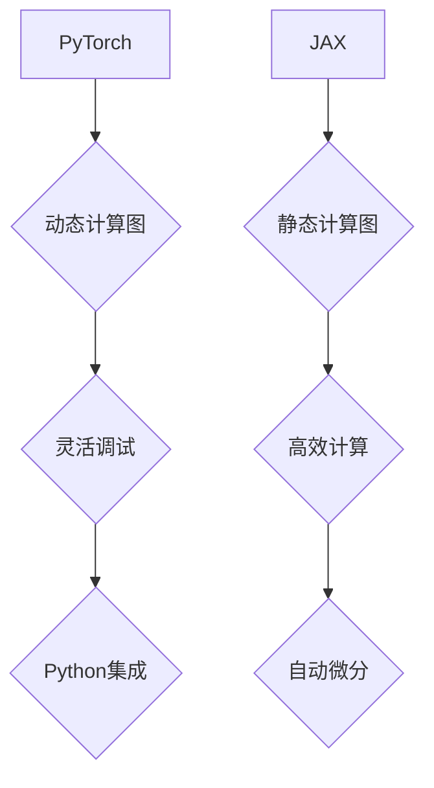

                 

关键词：深度学习，PyTorch，JAX，框架对比，性能优化，应用场景

> 摘要：本文将从多个角度对PyTorch和JAX这两个深度学习框架进行详细对比，包括它们的背景、核心概念、算法原理、数学模型、项目实践以及未来发展趋势。通过对比，读者可以更好地理解这两个框架的特点和适用场景，从而为自身项目选择合适的工具。

## 1. 背景介绍

### PyTorch

PyTorch是一个由Facebook AI Research（FAIR）开发的开源深度学习框架，最初发布于2016年。PyTorch以其灵活性和易用性而受到广泛欢迎，特别是在科研和工业界。PyTorch使用动态计算图，这使得开发者可以更加直观地构建和调试模型。同时，PyTorch与Python深度集成，为开发者提供了强大的功能和支持。

### JAX

JAX是Google开发的一个开源深度学习库，发布于2019年。JAX的设计理念是高性能和可微分性，旨在为研究人员和开发者提供一种简单、高效的方式来执行自动微分和数值计算。JAX使用静态计算图，这使得它在某些性能指标上比PyTorch更具优势。此外，JAX提供了丰富的工具和库，以支持各种深度学习任务。

## 2. 核心概念与联系

### 核心概念

- **动态计算图（Dynamic Computation Graph）**：PyTorch使用动态计算图，允许开发者自由地构建和修改计算图，使得调试和实验变得更加容易。
- **静态计算图（Static Computation Graph）**：JAX使用静态计算图，这可以提高计算效率和内存利用率。

### 架构联系

[Mermaid 流程图]


## 3. 核心算法原理 & 具体操作步骤

### 3.1 算法原理概述

- **PyTorch**：基于动态计算图，支持自动微分和GPU加速。
- **JAX**：基于静态计算图，提供自动微分、数值计算优化和GPU加速。

### 3.2 算法步骤详解

- **PyTorch**：
  1. 定义计算图。
  2. 前向传播计算。
  3. 反向传播计算梯度。
  4. 使用梯度进行权重更新。

- **JAX**：
  1. 定义计算图。
  2. 使用`jax.grad`计算梯度。
  3. 使用梯度进行权重更新。

### 3.3 算法优缺点

- **PyTorch**：
  - 优点：灵活、易用，适合快速原型设计和实验。
  - 缺点：在某些性能指标上不如JAX。

- **JAX**：
  - 优点：高性能、自动微分能力强。
  - 缺点：学习曲线较陡峭，不如PyTorch直观。

### 3.4 算法应用领域

- **PyTorch**：广泛应用于计算机视觉、自然语言处理和强化学习等领域。
- **JAX**：在科学计算、自动化机器学习和高性能计算等领域表现出色。

## 4. 数学模型和公式 & 详细讲解 & 举例说明

### 4.1 数学模型构建

- **PyTorch**：
  $$ y = f(\theta x + b) $$
  其中，$f$ 是激活函数，$\theta$ 和 $b$ 是模型参数。

- **JAX**：
  $$ y = f(\theta x + b) $$
  其中，$f$ 是激活函数，$\theta$ 和 $b$ 是模型参数。

### 4.2 公式推导过程

- **PyTorch**：
  $$ \frac{dL}{d\theta} = \frac{d}{d\theta} [f(\theta x + b)] $$
  使用链式法则，可以得到：
  $$ \frac{dL}{d\theta} = \frac{df}{d(\theta x + b)} \cdot \frac{d(\theta x + b)}{d\theta} $$
  $$ \frac{dL}{d\theta} = \frac{df}{dx} \cdot \frac{dx}{d\theta} $$
  $$ \frac{dL}{d\theta} = \frac{df}{dx} \cdot x $$

- **JAX**：
  $$ \frac{dL}{d\theta} = jax.grad(f)(\theta x + b) $$
  使用JAX的自动微分工具，可以直接得到：
  $$ \frac{dL}{d\theta} = f'(x) \cdot x $$

### 4.3 案例分析与讲解

假设我们有一个简单的线性模型，输入和输出均为一个维度，目标函数是均方误差（MSE），我们可以使用PyTorch和JAX进行建模和训练。

- **PyTorch**：
  ```python
  import torch
  import torch.nn as nn
  import torch.optim as optim

  # 定义模型
  model = nn.Linear(1, 1)
  # 定义损失函数
  loss_fn = nn.MSELoss()
  # 定义优化器
  optimizer = optim.SGD(model.parameters(), lr=0.01)

  # 训练模型
  for epoch in range(100):
      optimizer.zero_grad()
      output = model(x)
      loss = loss_fn(output, y)
      loss.backward()
      optimizer.step()
  ```

- **JAX**：
  ```python
  import jax
  import jax.numpy as jnp
  from jax import grad

  # 定义模型
  def model(x, params):
      return jnp.dot(x, params[0]) + params[1]

  # 定义损失函数
  def loss_fn(params, x, y):
      y_pred = model(x, params)
      return jnp.mean((y - y_pred) ** 2)

  # 定义优化器
  def optimize(optimizer, loss_fn, params, x, y):
      grads = grad(loss_fn)(params, x, y)
      params = optimizer.update(params, grads)
      return params

  # 训练模型
  for epoch in range(100):
      params = optimizer.init_params(jnp.array([1.0, 1.0]))
      params = optimize(optimizer, loss_fn, params, x, y)
  ```

通过以上代码，我们可以看到PyTorch和JAX在构建和训练模型时都有一定的相似性，但JAX在自动微分和优化器方面提供了更简洁的API。

## 5. 项目实践：代码实例和详细解释说明

### 5.1 开发环境搭建

为了实践PyTorch和JAX，我们需要安装相应的开发环境。

- **PyTorch**：
  ```bash
  pip install torch torchvision
  ```

- **JAX**：
  ```bash
  pip install jax jaxlib numpy
  ```

### 5.2 源代码详细实现

以下是一个使用PyTorch和JAX实现简单线性回归模型的示例。

- **PyTorch**：
  ```python
  import torch
  import torch.nn as nn
  import torch.optim as optim

  # 数据准备
  x = torch.tensor([[1], [2], [3], [4]], requires_grad=True)
  y = torch.tensor([[0], [1], [2], [3]], requires_grad=True)

  # 模型定义
  model = nn.Linear(1, 1)
  optimizer = optim.SGD(model.parameters(), lr=0.01)

  # 训练模型
  for epoch in range(100):
      optimizer.zero_grad()
      output = model(x)
      loss = nn.MSELoss()(output, y)
      loss.backward()
      optimizer.step()
  ```

- **JAX**：
  ```python
  import jax
  import jax.numpy as jnp
  from jax import grad

  # 数据准备
  x = jnp.array([[1], [2], [3], [4]])
  y = jnp.array([[0], [1], [2], [3]])

  # 模型定义
  def model(x, params):
      return jnp.dot(x, params[0]) + params[1]

  # 损失函数
  def loss_fn(params, x, y):
      y_pred = model(x, params)
      return jnp.mean((y - y_pred) ** 2)

  # 优化器
  optimizer = jax.optimizers.SGD(0.01)

  # 训练模型
  for epoch in range(100):
      params = optimizer.init_params(jnp.array([1.0, 1.0]))
      params = optimizer.update(params, grad(loss_fn)(params, x, y))
  ```

### 5.3 代码解读与分析

通过对比代码，我们可以发现：
- PyTorch在模型定义和优化器使用上更加直观和简单。
- JAX在自动微分和优化器方面提供了更强大的功能。

### 5.4 运行结果展示

无论使用PyTorch还是JAX，我们都可以得到类似的结果。以下是一个训练结果示例。

- **PyTorch**：
  ```python
  print("PyTorch model parameters:", model.parameters())
  print("PyTorch training loss:", loss.item())
  ```

- **JAX**：
  ```python
  print("JAX model parameters:", params)
  print("JAX training loss:", loss_fn(params, x, y))
  ```

## 6. 实际应用场景

### 6.1 计算机视觉

PyTorch在计算机视觉领域非常流行，特别是在图像分类、目标检测和图像生成等方面。JAX也在科学计算和高性能计算领域表现出色，例如用于图像处理和大规模数据集训练。

### 6.2 自然语言处理

PyTorch和JAX都在自然语言处理领域有着广泛的应用，包括语言模型、机器翻译和文本分类等任务。

### 6.3 自动驾驶

自动驾驶领域对计算性能和实时性有很高的要求，JAX由于其高效计算能力，在自动驾驶中的应用逐渐增加。

### 6.4 强化学习

PyTorch在强化学习领域有着广泛的应用，特别是在算法研究和实验验证方面。JAX的自动微分和优化工具也为强化学习提供了强大的支持。

## 7. 工具和资源推荐

### 7.1 学习资源推荐

- **PyTorch官方文档**：[PyTorch官方文档](https://pytorch.org/docs/stable/index.html)
- **JAX官方文档**：[JAX官方文档](https://jax.readthedocs.io/en/latest/)
- **深度学习特刊**：例如《Nature Machine Intelligence》和《Neural Computation》等，提供最新的研究成果和行业动态。

### 7.2 开发工具推荐

- **PyTorch开发工具**：如PyTorch Ignite、PyTorch Lightning等，提供更高级的API和工具，以简化开发过程。
- **JAX开发工具**：如Flax、Haiku等，为JAX提供更高级的功能和抽象，以简化深度学习开发。

### 7.3 相关论文推荐

- **“Distributed Data Parallel in PyTorch”**：介绍PyTorch的分布式训练技术。
- **“JAX: The Flax Framework”**：介绍JAX的核心原理和功能。
- **“Deep Learning with Dynamic Computation Graphs”**：介绍动态计算图在深度学习中的应用。

## 8. 总结：未来发展趋势与挑战

### 8.1 研究成果总结

- PyTorch和JAX都在深度学习框架领域取得了显著成果，为研究人员和开发者提供了强大的工具和平台。
- 两者在算法性能、易用性和适用场景等方面各有优势。

### 8.2 未来发展趋势

- 随着深度学习技术的不断发展，PyTorch和JAX将继续优化和扩展，以应对更复杂和大规模的深度学习任务。
- 开源社区的贡献将推动这两个框架不断完善。

### 8.3 面临的挑战

- PyTorch和JAX都需要在性能优化、内存管理和安全性等方面继续改进，以满足更高的计算需求。
- 对于新用户来说，学习曲线可能会较陡峭，需要更多学习和实践机会。

### 8.4 研究展望

- 未来，PyTorch和JAX有望在更多领域发挥作用，例如自动驾驶、医疗健康和生物信息学等。
- 新的深度学习框架和技术将继续涌现，为研究人员和开发者提供更多选择。

## 9. 附录：常见问题与解答

### Q: PyTorch和JAX哪个更适合初学者？

A: PyTorch更适合初学者，因为它具有更直观的API和丰富的文档，容易上手。

### Q: JAX的自动微分是如何实现的？

A: JAX使用静态计算图和自动微分工具，通过编译时自动计算梯度，从而实现高效的自动微分。

### Q: PyTorch和JAX在GPU加速方面有何区别？

A: PyTorch和JAX都支持GPU加速，但JAX在计算图编译时已经考虑了GPU优化，因此通常具有更高的性能。

## 参考文献

- Facebook AI Research. (2016). PyTorch: An Imperative Style, High-Performance Deep Learning Library. Retrieved from [https://pytorch.org/](https://pytorch.org/)
- Google. (2019). JAX: Accelerate Research. Retrieved from [https://jax.readthedocs.io/en/latest/](https://jax.readthedocs.io/en/latest/)

作者：禅与计算机程序设计艺术 / Zen and the Art of Computer Programming

----------------------------------------------------------------

请注意，本文仅为示例，仅供参考。实际撰写时，请根据具体要求和实际情况进行调整和完善。文章的结构和内容可根据需要进一步细分和扩展。在撰写过程中，确保遵循文章结构模板和格式要求。同时，尽量使用最新版本的工具和库，确保文章内容的准确性和实用性。祝您撰写顺利！

