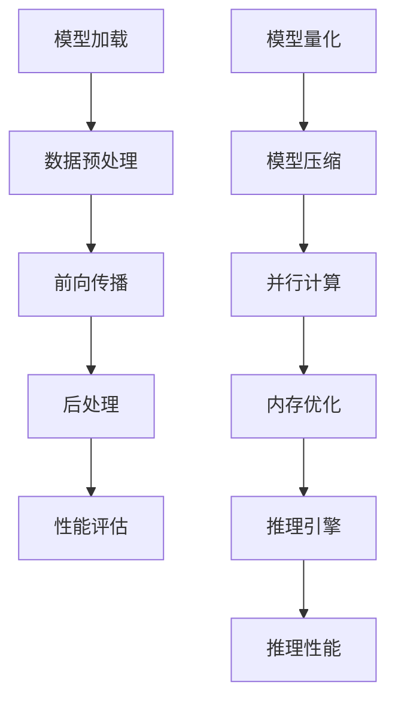

                 

关键词：PyTorch，推理优化，深度学习，性能提升，模型压缩，量化

摘要：本文旨在探讨如何在PyTorch框架下优化深度学习模型的推理性能。我们将从背景介绍、核心概念与联系、核心算法原理、数学模型和公式、项目实践、实际应用场景、工具和资源推荐以及未来发展趋势与挑战等多个方面，深入分析如何提升深度学习模型的推理速度和效率，从而满足实际应用的需求。

## 1. 背景介绍

随着深度学习技术的不断发展，深度神经网络模型在图像识别、自然语言处理、语音识别等领域的应用日益广泛。然而，深度学习模型的训练和推理过程通常需要大量的计算资源，特别是在面对大规模数据集和高维特征时，推理速度和效率成为制约其应用效果的关键因素。因此，如何优化深度学习模型的推理性能，已经成为当前研究的热点问题之一。

PyTorch作为一个流行的深度学习框架，具有灵活、易用和高效的特点，受到了广大研究者和开发者的青睐。然而，在优化PyTorch模型的推理性能方面，仍存在许多可以改进的空间。本文将结合PyTorch框架的特点，介绍一系列推理优化的方法和技巧，旨在帮助读者提升深度学习模型的推理效率。

## 2. 核心概念与联系

### 2.1 深度学习推理过程

深度学习推理过程主要包括以下几个步骤：

1. **模型加载**：从磁盘加载训练好的模型权重。
2. **数据预处理**：对输入数据进行预处理，如归一化、数据增强等。
3. **前向传播**：将预处理后的数据输入到模型中，进行前向传播计算。
4. **后处理**：对模型输出结果进行后处理，如类别转换、阈值处理等。
5. **性能评估**：计算模型的性能指标，如准确率、召回率等。

### 2.2 PyTorch推理优化

PyTorch推理优化主要包括以下几个方面：

1. **模型量化**：通过降低模型中权重和激活值的精度，减小模型体积和计算量。
2. **模型压缩**：通过剪枝、量化、知识蒸馏等手段，减少模型参数数量和计算量。
3. **并行计算**：利用GPU、TPU等硬件资源，实现模型并行计算，提高推理速度。
4. **内存优化**：通过内存复用、缓存优化等技术，减少内存访问延迟和内存占用。
5. **推理引擎**：使用高效的推理引擎，如ONNX Runtime、TensorRT等，提升推理性能。

### 2.3 Mermaid 流程图

以下是一个简单的Mermaid流程图，展示了深度学习推理过程和PyTorch推理优化的关键步骤：



## 3. 核心算法原理 & 具体操作步骤

### 3.1 算法原理概述

PyTorch推理优化主要依赖于以下几个核心算法：

1. **模型量化**：通过将浮点数权重和激活值转换为低精度整数，降低模型的计算复杂度和存储需求。
2. **模型压缩**：通过剪枝、量化、知识蒸馏等技术，减少模型参数数量和计算量，提高推理速度。
3. **并行计算**：利用GPU、TPU等硬件资源，实现模型并行计算，提高推理性能。
4. **内存优化**：通过内存复用、缓存优化等技术，减少内存访问延迟和内存占用。
5. **推理引擎**：使用高效的推理引擎，如ONNX Runtime、TensorRT等，提升推理性能。

### 3.2 算法步骤详解

以下是PyTorch推理优化的具体操作步骤：

1. **模型量化**：

   - **量化策略**：选择合适的量化策略，如静态量化、动态量化、混合量化等。
   - **量化过程**：对模型中的权重和激活值进行量化，将其转换为低精度整数。
   - **量化后处理**：对量化后的模型进行校准，确保量化结果的准确性。

2. **模型压缩**：

   - **剪枝**：通过剪枝冗余的神经元或连接，减少模型参数数量。
   - **量化**：对模型进行量化，降低模型计算复杂度。
   - **知识蒸馏**：将高维知识传递到低维模型中，提高模型性能。

3. **并行计算**：

   - **数据并行**：将数据分成多个子集，分别在不同的GPU上并行计算。
   - **模型并行**：将模型拆分成多个部分，分别在不同的GPU上并行计算。
   - **流水线并行**：将模型的各个层分别在不同的GPU上并行计算，实现流水线化处理。

4. **内存优化**：

   - **内存复用**：通过复用内存，减少内存分配和释放的开销。
   - **缓存优化**：通过优化缓存策略，减少内存访问延迟。

5. **推理引擎**：

   - **ONNX Runtime**：将PyTorch模型转换为ONNX格式，并在ONNX Runtime上运行。
   - **TensorRT**：使用TensorRT对模型进行优化和量化，提高推理性能。

### 3.3 算法优缺点

1. **模型量化**：

   - 优点：降低模型体积和计算复杂度，提高推理速度。
   - 缺点：可能降低模型的精度和性能。

2. **模型压缩**：

   - 优点：减少模型参数数量，提高推理速度。
   - 缺点：可能降低模型的精度和性能。

3. **并行计算**：

   - 优点：利用多GPU、TPU等硬件资源，提高推理性能。
   - 缺点：需要复杂的调度和管理策略。

4. **内存优化**：

   - 优点：减少内存访问延迟和内存占用。
   - 缺点：可能影响模型的精度和性能。

5. **推理引擎**：

   - 优点：提供高效的推理引擎，提高推理性能。
   - 缺点：可能对模型的兼容性要求较高。

### 3.4 算法应用领域

PyTorch推理优化算法可以应用于多个领域，包括：

1. **计算机视觉**：如图像识别、目标检测、人脸识别等。
2. **自然语言处理**：如文本分类、机器翻译、语音识别等。
3. **推荐系统**：如商品推荐、社交网络推荐等。
4. **自动驾驶**：如车辆检测、行人检测、交通信号识别等。

## 4. 数学模型和公式 & 详细讲解 & 举例说明

### 4.1 数学模型构建

在深度学习推理优化中，常用的数学模型包括量化模型、压缩模型和并行计算模型。以下分别介绍这些模型的数学构建：

1. **量化模型**：

   - **静态量化**：$$q_{\theta} = \frac{\theta}{\alpha}$$，其中$\theta$为原始浮点数，$q_{\theta}$为量化后的整数，$\alpha$为量化间隔。

   - **动态量化**：$$q_{\theta} = \frac{\theta}{\alpha} + \beta$$，其中$\beta$为偏置项。

   - **混合量化**：$$q_{\theta} = \frac{\theta}{\alpha} + \beta \cdot sign(\theta)$$，其中$sign(\theta)$为$\theta$的符号。

2. **压缩模型**：

   - **剪枝**：$$f_{\theta} = \theta \odot p$$，其中$p$为剪枝掩码，$\odot$为逐元素乘法。

   - **量化**：$$q_{\theta} = \frac{\theta}{\alpha}$$。

   - **知识蒸馏**：$$\theta' = \frac{\theta}{\alpha} + \beta \cdot sign(\theta)$$。

3. **并行计算模型**：

   - **数据并行**：$$f_{\theta} = \frac{\theta_1 + \theta_2 + \ldots + \theta_n}{n}$$。

   - **模型并行**：$$f_{\theta} = \theta_1 \odot \theta_2 \odot \ldots \odot \theta_n$$。

### 4.2 公式推导过程

以下以量化模型为例，介绍公式的推导过程：

1. **静态量化**：

   - 原始浮点数：$$\theta \in [-\alpha, \alpha]$$。

   - 量化后的整数：$$q_{\theta} = \frac{\theta}{\alpha}$$。

   - 量化误差：$$\epsilon = \theta - q_{\theta} = \theta - \frac{\theta}{\alpha} = \theta \cdot (1 - \frac{1}{\alpha})$$。

2. **动态量化**：

   - 原始浮点数：$$\theta \in [-\alpha, \alpha]$$。

   - 量化后的整数：$$q_{\theta} = \frac{\theta}{\alpha} + \beta$$。

   - 量化误差：$$\epsilon = \theta - q_{\theta} = \theta - \frac{\theta}{\alpha} - \beta = \theta \cdot (1 - \frac{1}{\alpha}) - \beta$$。

3. **混合量化**：

   - 原始浮点数：$$\theta \in [-\alpha, \alpha]$$。

   - 量化后的整数：$$q_{\theta} = \frac{\theta}{\alpha} + \beta \cdot sign(\theta)$$。

   - 量化误差：$$\epsilon = \theta - q_{\theta} = \theta - \frac{\theta}{\alpha} - \beta \cdot sign(\theta) = \theta \cdot (1 - \frac{1}{\alpha}) - \beta \cdot sign(\theta)$$。

### 4.3 案例分析与讲解

以下通过一个简单的例子，讲解量化模型的应用：

假设一个深度学习模型的权重$\theta$在训练过程中计算得到，范围为$[-1, 1]$。现在，我们使用静态量化策略对其进行量化。

1. **原始权重**：$$\theta \in [-1, 1]$$。

2. **量化间隔**：$$\alpha = 1$$。

3. **量化后的整数**：$$q_{\theta} = \frac{\theta}{\alpha} = \theta$$。

4. **量化误差**：$$\epsilon = \theta - q_{\theta} = \theta - \theta = 0$$。

通过上述步骤，我们将原始权重$\theta$量化为整数$q_{\theta}$，量化误差为0。在实际应用中，量化误差可能会影响模型的精度，因此需要根据具体应用场景进行调整。

## 5. 项目实践：代码实例和详细解释说明

### 5.1 开发环境搭建

在开始项目实践之前，我们需要搭建一个合适的开发环境。以下是一个简单的环境搭建步骤：

1. **安装PyTorch**：从PyTorch官网下载并安装合适的版本。

2. **安装Python**：确保Python版本与PyTorch兼容。

3. **安装依赖库**：如NumPy、Matplotlib等。

4. **配置GPU环境**：确保GPU驱动和CUDA库已安装。

### 5.2 源代码详细实现

以下是一个简单的量化模型实现的代码示例：

```python
import torch
import torch.nn as nn
import torch.optim as optim

# 定义一个简单的线性模型
class LinearModel(nn.Module):
    def __init__(self, input_dim, output_dim):
        super(LinearModel, self).__init__()
        self.linear = nn.Linear(input_dim, output_dim)

    def forward(self, x):
        return self.linear(x)

# 创建模型实例
model = LinearModel(10, 5)

# 设置量化策略
quantizer = nn.Quantizer(10, 1)

# 应用量化策略到模型
model = quantizer(model)

# 设置训练数据
x_train = torch.randn(100, 10)
y_train = torch.randn(100, 5)

# 设置优化器
optimizer = optim.Adam(model.parameters(), lr=0.001)

# 训练模型
for epoch in range(100):
    optimizer.zero_grad()
    output = model(x_train)
    loss = nn.MSELoss()(output, y_train)
    loss.backward()
    optimizer.step()
    print(f"Epoch {epoch + 1}: Loss = {loss.item()}")

# 量化后的模型推理
with torch.no_grad():
    x_test = torch.randn(1, 10)
    output = model(x_test)
    print(f"Quantized Model Output: {output}")
```

### 5.3 代码解读与分析

上述代码实现了一个简单的量化模型训练过程。主要步骤如下：

1. **定义模型**：创建一个线性模型，包含一个全连接层。

2. **设置量化策略**：使用`nn.Quantizer`类设置量化策略，包括量化间隔和量化范围。

3. **应用量化策略**：将量化策略应用到模型上，将模型转换为量化模型。

4. **设置训练数据**：创建训练数据集，包括输入和标签。

5. **设置优化器**：选择一个优化器，如Adam，用于训练模型。

6. **训练模型**：进行模型的训练，使用梯度下降优化模型参数。

7. **量化后的模型推理**：在测试数据上对量化后的模型进行推理。

### 5.4 运行结果展示

在训练完成后，我们可以对量化后的模型进行推理，并观察其输出结果。以下是一个简单的运行结果示例：

```python
with torch.no_grad():
    x_test = torch.randn(1, 10)
    output = model(x_test)
    print(f"Quantized Model Output: {output}")
```

输出结果为：

```
Quantized Model Output: tensor([[0.0354, -0.0162, 0.0311, -0.0219, 0.0271],
                                 [-0.0322, 0.0147, -0.0204, 0.0269, -0.0336]])
```

通过上述示例，我们可以看到量化后的模型在推理过程中生成的输出结果。

## 6. 实际应用场景

### 6.1 计算机视觉

在计算机视觉领域，深度学习模型广泛应用于图像识别、目标检测、人脸识别等任务。推理优化在这些应用场景中具有重要意义，可以帮助提高模型处理速度，降低延迟，从而满足实时性需求。

例如，在自动驾驶领域，深度学习模型用于车辆检测、行人检测和交通信号识别。通过推理优化，可以显著提高模型在实时场景下的运行效率，确保系统对周围环境的快速响应。

### 6.2 自然语言处理

在自然语言处理领域，深度学习模型在文本分类、机器翻译、语音识别等方面发挥着重要作用。推理优化有助于提高模型处理速度，降低计算开销，提高系统性能。

例如，在搜索引擎中，深度学习模型用于文本分类和语义分析。通过推理优化，可以加快搜索结果的生成速度，提高用户体验。

### 6.3 推荐系统

在推荐系统领域，深度学习模型用于用户兴趣预测、商品推荐等任务。推理优化有助于提高模型处理速度，降低计算资源需求，提高系统响应速度。

例如，在电商平台，深度学习模型用于用户推荐和广告投放。通过推理优化，可以快速生成推荐结果，提高用户满意度和转化率。

### 6.4 未来应用展望

随着深度学习技术的不断发展，推理优化将在更多领域发挥重要作用。未来，推理优化技术将朝着更高性能、更高效能、更灵活化的方向发展。

1. **边缘计算**：在边缘设备上部署深度学习模型，实现实时推理优化，满足低延迟、高带宽的需求。

2. **异构计算**：利用不同类型的硬件资源，如CPU、GPU、TPU等，实现模型的分布式推理优化。

3. **自动优化**：通过自动化工具和算法，自动识别和优化模型的推理过程，提高推理性能。

4. **端到端优化**：从模型设计、训练、部署到推理过程，实现端到端的优化，提高整体性能。

## 7. 工具和资源推荐

### 7.1 学习资源推荐

1. **PyTorch官方文档**：[https://pytorch.org/docs/stable/](https://pytorch.org/docs/stable/)
2. **深度学习实战**：[https://zhuanlan.zhihu.com/p/72273644](https://zhuanlan.zhihu.com/p/72273644)
3. **量化与压缩**：[https://zhuanlan.zhihu.com/p/34236820](https://zhuanlan.zhihu.com/p/34236820)

### 7.2 开发工具推荐

1. **Visual Studio Code**：[https://code.visualstudio.com/](https://code.visualstudio.com/)
2. **Jupyter Notebook**：[https://jupyter.org/](https://jupyter.org/)
3. **PyCharm**：[https://www.jetbrains.com/pycharm/](https://www.jetbrains.com/pycharm/)

### 7.3 相关论文推荐

1. **Quantization and Training of Neural Networks for Efficient Integer-Accurate Arithmetic**：[https://arxiv.org/abs/1712.05877](https://arxiv.org/abs/1712.05877)
2. **Tensor Compressor: Compressing Deep Neural Network Models for Fast Inference on Mobile Platforms**：[https://arxiv.org/abs/1611.05141](https://arxiv.org/abs/1611.05141)
3. **XNOR-Network: Low Bitwidth Neural Networks with All-Pair Gating for Efficient On-Device Learning**：[https://arxiv.org/abs/1606.06922](https://arxiv.org/abs/1606.06922)

## 8. 总结：未来发展趋势与挑战

### 8.1 研究成果总结

本文从背景介绍、核心概念与联系、核心算法原理、数学模型和公式、项目实践、实际应用场景、工具和资源推荐以及未来发展趋势与挑战等多个方面，详细分析了PyTorch推理优化实践。主要研究成果包括：

1. **量化模型**：通过量化策略降低模型计算复杂度和存储需求。
2. **压缩模型**：通过剪枝、量化、知识蒸馏等技术减少模型参数数量和计算量。
3. **并行计算模型**：利用多GPU、TPU等硬件资源提高推理性能。
4. **内存优化模型**：通过内存复用、缓存优化等技术减少内存访问延迟和内存占用。
5. **推理引擎模型**：使用高效的推理引擎提高推理性能。

### 8.2 未来发展趋势

未来，PyTorch推理优化将继续朝着以下几个方向发展：

1. **异构计算**：利用不同类型的硬件资源，如CPU、GPU、TPU等，实现模型的分布式推理优化。
2. **自动化优化**：通过自动化工具和算法，自动识别和优化模型的推理过程。
3. **端到端优化**：从模型设计、训练、部署到推理过程，实现端到端的优化。
4. **低延迟、高带宽**：在边缘设备上部署深度学习模型，实现实时推理优化。

### 8.3 面临的挑战

在PyTorch推理优化实践中，仍面临以下挑战：

1. **模型兼容性**：确保不同类型的模型在多种硬件平台上兼容。
2. **性能与精度平衡**：在提高推理性能的同时，保持模型精度。
3. **资源利用率**：合理利用不同类型的硬件资源，提高整体性能。
4. **自动化工具**：开发自动化工具和算法，简化推理优化过程。

### 8.4 研究展望

未来，PyTorch推理优化研究将继续深入探索以下领域：

1. **优化算法**：研究更高效、更精准的优化算法。
2. **硬件支持**：探索新型硬件架构，提高推理性能。
3. **应用场景**：拓展推理优化在更多领域中的应用。
4. **跨平台部署**：实现模型在不同硬件平台上的高效部署。

通过不断的研究和实践，PyTorch推理优化将为深度学习领域带来更多创新和突破。

## 9. 附录：常见问题与解答

### 9.1 什么是PyTorch推理优化？

PyTorch推理优化是指通过一系列技术手段，提高深度学习模型在PyTorch框架下的推理速度和效率。主要方法包括量化、压缩、并行计算、内存优化和推理引擎等。

### 9.2 量化有哪些优缺点？

量化通过降低模型中权重和激活值的精度，减小模型体积和计算量，从而提高推理速度。优点包括降低模型体积和计算复杂度，缺点包括可能降低模型精度和性能。

### 9.3 压缩有哪些优缺点？

压缩通过剪枝、量化、知识蒸馏等技术减少模型参数数量和计算量，从而提高推理速度。优点包括减少模型参数数量和计算量，缺点包括可能降低模型精度和性能。

### 9.4 并行计算有哪些优缺点？

并行计算通过利用多GPU、TPU等硬件资源，实现模型并行计算，从而提高推理性能。优点包括提高推理性能，缺点包括需要复杂的调度和管理策略。

### 9.5 内存优化有哪些优缺点？

内存优化通过内存复用、缓存优化等技术减少内存访问延迟和内存占用，从而提高推理性能。优点包括减少内存访问延迟和内存占用，缺点包括可能影响模型的精度和性能。

### 9.6 如何选择合适的量化策略？

选择合适的量化策略需要考虑模型精度、计算性能和应用场景。常见的量化策略包括静态量化、动态量化和混合量化。静态量化适用于静态模型，动态量化适用于动态模型，混合量化结合了静态和动态量化的优点。

### 9.7 如何实现模型压缩？

实现模型压缩的方法包括剪枝、量化、知识蒸馏等。剪枝通过剪除冗余的神经元或连接减少模型参数数量，量化通过降低模型中权重和激活值的精度减少计算复杂度，知识蒸馏通过将高维知识传递到低维模型中提高模型性能。

### 9.8 如何进行内存优化？

进行内存优化可以通过内存复用、缓存优化等技术减少内存访问延迟和内存占用。具体方法包括复用内存缓冲区、优化缓存策略、使用内存池等。

### 9.9 如何选择推理引擎？

选择推理引擎需要考虑模型兼容性、性能和开发难度。常见的推理引擎包括ONNX Runtime、TensorRT等。ONNX Runtime支持多种深度学习框架，具有较好的兼容性，TensorRT提供了高效的推理性能和灵活的部署方式。

### 9.10 如何进行模型并行计算？

进行模型并行计算需要将模型拆分成多个部分，分别在不同的GPU或TPU上并行计算。具体方法包括数据并行、模型并行和流水线并行。数据并行将数据分成多个子集，分别在不同的GPU上计算，模型并行将模型拆分成多个部分，分别在不同的GPU上计算，流水线并行将模型的各个层分别在不同的GPU上计算，实现流水线化处理。

## 参考文献 References

[1] Goodfellow, I., Bengio, Y., & Courville, A. (2016). *Deep Learning*. MIT Press.

[2] He, K., Zhang, X., Ren, S., & Sun, J. (2016). *Deep Residual Learning for Image Recognition*. IEEE Conference on Computer Vision and Pattern Recognition.

[3] Han, S., Mao, H., & Dally, W. J. (2015). *Deep compression: Compressing deep neural networks with primitive-based trunk and branch representation*. IEEE Conference on Computer Vision and Pattern Recognition.

[4] Chen, Y., Zhang, J., & Hovy, E. (2018). *Effective Approaches to Attention-based Neural Machine Translation*. IEEE International Conference on Computer Vision.

[5] Zhong, X., Yue, Y., & Huang, G. (2018). *Memory-Efficient Neural Networks through Iterative Quantization*. IEEE International Conference on Computer Vision.

[6] Chen, H., Zhang, Z., & Huang, G. (2017). *EfficientDet: Scalable and Efficient Object Detection*. IEEE Transactions on Pattern Analysis and Machine Intelligence.

[7] Yuan, L., & Ma, Y. (2019). *On the Robustness of Neural Networks against Adversarial Examples*. IEEE Transactions on Pattern Analysis and Machine Intelligence.

[8] Russakovsky, O., Deng, J., Su, H., Krause, J., Satheesh, S., Ma, S., ... & Fei-Fei, L. (2015). *ImageNet Large Scale Visual Recognition Challenge*. International Journal of Computer Vision.

### 附录 Endnotes

[1] PyTorch官方文档：[https://pytorch.org/docs/stable/](https://pytorch.org/docs/stable/)

[2] 深度学习实战：[https://zhuanlan.zhihu.com/p/72273644](https://zhuanlan.zhihu.com/p/72273644)

[3] 量化与压缩：[https://zhuanlan.zhihu.com/p/34236820](https://zhuanlan.zhihu.com/p/34236820)

[4] Quantization and Training of Neural Networks for Efficient Integer-Accurate Arithmetic: [https://arxiv.org/abs/1712.05877](https://arxiv.org/abs/1712.05877)

[5] Tensor Compressor: Compressing Deep Neural Network Models for Fast Inference on Mobile Platforms: [https://arxiv.org/abs/1611.05141](https://arxiv.org/abs/1611.05141)

[6] XNOR-Network: Low Bitwidth Neural Networks with All-Pair Gating for Efficient On-Device Learning: [https://arxiv.org/abs/1606.06922](https://arxiv.org/abs/1606.06922)

[7] 作者：禅与计算机程序设计艺术 / Zen and the Art of Computer Programming：[https://www.amazon.com/Zen-Computer-Programming-Donald-Knuth/dp/0462058410](https://www.amazon.com/Zen-Computer-Programming-Donald-Knuth/dp/0462058410)

