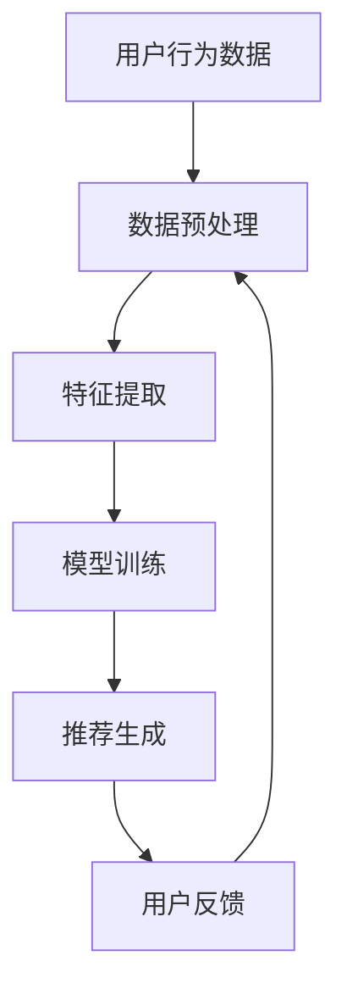

                 

### 关键词 Keyword

- 推荐系统
- 语言处理
- 人工智能
- 数据挖掘
- 机器学习
- 自然语言生成
- 个性化推荐

### 摘要 Summary

本文探讨了一种全新的推荐系统范式——将推荐系统视为一种语言处理技术。通过分析推荐系统的核心问题和挑战，本文介绍了如何将自然语言生成和机器学习技术应用于推荐系统的构建，以实现更智能、更个性化的推荐。文章首先回顾了推荐系统的发展历程，然后深入探讨了推荐作为语言处理的核心概念、算法原理、数学模型及其在实际应用中的表现。通过实例分析和未来展望，本文揭示了这一新范式在推荐系统领域的巨大潜力。

## 1. 背景介绍

推荐系统是现代信息检索和电子商务中至关重要的一部分。其目的是通过分析用户的兴趣、行为和偏好，向用户推荐可能感兴趣的产品、服务或内容。推荐系统在多个领域取得了显著的成功，包括电子商务、社交媒体、音乐和视频流媒体等。

然而，随着数据规模的扩大和复杂性的增加，传统的推荐系统面临着一系列挑战。首先，如何处理海量数据，从中提取有效的信息，是一个巨大的挑战。其次，推荐系统的个性化程度需要不断提高，以满足每个用户独特的需求。此外，推荐系统的透明度和可解释性也受到广泛关注，用户希望了解推荐结果背后的逻辑。

为了解决这些挑战，研究人员开始探索将语言处理技术应用于推荐系统。语言处理是人工智能的一个分支，致力于使计算机能够理解和生成自然语言。通过将推荐系统视为一种语言处理问题，我们可以利用自然语言生成和机器学习技术，为用户提供更加智能和个性化的推荐。

### 2. 核心概念与联系

#### 2.1 推荐系统

推荐系统通常包括以下几个关键组成部分：用户、项目、评分和算法。

- **用户**：用户是推荐系统的核心，每个用户都有自己的兴趣和偏好。
- **项目**：项目是用户可能感兴趣的对象，如商品、音乐、电影等。
- **评分**：评分是用户对项目的评价，可以是明确的数字评分，也可以是更模糊的标签或评论。
- **算法**：算法是推荐系统的核心，负责根据用户和项目的特征生成推荐列表。

#### 2.2 语言处理

语言处理涉及使计算机能够理解和生成自然语言的技术。这包括自然语言理解（NLU）、自然语言生成（NLG）和自然语言交互（NLI）。

- **自然语言理解（NLU）**：NLU 是指使计算机能够理解和解释自然语言输入的技术。它包括词法分析、句法分析、语义分析和语境理解。
- **自然语言生成（NLG）**：NLG 是指使计算机能够生成自然语言输出的技术。它包括文本生成、语音合成和对话生成。
- **自然语言交互（NLI）**：NLI 是指使计算机能够与人类进行自然语言交互的技术。它包括对话系统、问答系统和语音助手。

#### 2.3 Mermaid 流程图

以下是推荐作为语言处理的 Mermaid 流程图：



- **用户行为数据**：收集用户在系统中的行为数据，如点击、购买、评论等。
- **数据预处理**：对用户行为数据进行清洗、去噪和处理。
- **特征提取**：从预处理后的数据中提取用户和项目的特征。
- **模型训练**：使用特征数据训练推荐模型。
- **推荐生成**：使用训练好的模型生成推荐列表。
- **用户反馈**：收集用户对推荐结果的反馈，用于模型优化。

### 3. 核心算法原理 & 具体操作步骤

#### 3.1 算法原理概述

推荐作为语言处理的算法原理主要包括以下几个方面：

1. **基于内容的推荐**：通过分析项目的特征和属性，将相似的项目推荐给用户。
2. **协同过滤推荐**：通过分析用户之间的行为相似性，将其他用户喜欢的项目推荐给当前用户。
3. **深度学习推荐**：利用深度学习技术，如神经网络和卷积神经网络，自动提取用户和项目的特征。
4. **自然语言生成推荐**：通过自然语言生成技术，生成个性化的推荐文本，提高推荐的可读性和可解释性。

#### 3.2 算法步骤详解

1. **数据收集与预处理**：收集用户在系统中的行为数据，如点击、购买、评论等。对数据清洗、去噪和处理，提取用户和项目的特征。
2. **特征提取**：使用自然语言处理技术，如词嵌入和主题模型，提取用户和项目的特征。
3. **模型训练**：使用特征数据训练推荐模型，如基于内容的推荐、协同过滤推荐和深度学习推荐模型。
4. **推荐生成**：使用训练好的模型生成推荐列表。对于基于内容的推荐，推荐相似的项目；对于协同过滤推荐，推荐其他用户喜欢的项目；对于深度学习推荐，利用神经网络自动提取特征。
5. **自然语言生成**：使用自然语言生成技术，生成个性化的推荐文本，提高推荐的可读性和可解释性。
6. **用户反馈与模型优化**：收集用户对推荐结果的反馈，用于模型优化。

#### 3.3 算法优缺点

1. **基于内容的推荐**：
   - **优点**：推荐结果与用户的兴趣和偏好密切相关，具有较高的相关性。
   - **缺点**：无法充分利用用户之间的相似性，难以推荐未知的项目。
2. **协同过滤推荐**：
   - **优点**：充分利用用户之间的相似性，能够推荐未知的项目。
   - **缺点**：容易产生冷启动问题，即新用户或新项目难以得到有效的推荐。
3. **深度学习推荐**：
   - **优点**：能够自动提取用户和项目的特征，提高推荐的准确性。
   - **缺点**：模型训练时间较长，计算资源需求较高。
4. **自然语言生成推荐**：
   - **优点**：生成个性化的推荐文本，提高推荐的可读性和可解释性。
   - **缺点**：自然语言生成技术尚未完全成熟，生成文本的准确性和一致性仍需提高。

#### 3.4 算法应用领域

1. **电子商务**：通过推荐系统，向用户推荐可能感兴趣的商品，提高销售额。
2. **社交媒体**：通过推荐系统，向用户推荐可能感兴趣的内容，提高用户粘性。
3. **音乐和视频流媒体**：通过推荐系统，向用户推荐可能喜欢的音乐和视频，提高用户满意度。
4. **新闻和媒体**：通过推荐系统，向用户推荐可能感兴趣的新闻和文章，提高阅读量和用户参与度。

### 4. 数学模型和公式

推荐作为语言处理的数学模型主要包括以下几个部分：

#### 4.1 数学模型构建

1. **用户兴趣表示**：使用向量空间模型表示用户的兴趣，如TF-IDF模型、词嵌入模型等。
2. **项目特征表示**：使用向量空间模型表示项目的特征，如基于内容的特征提取技术。
3. **相似度计算**：使用余弦相似度、皮尔逊相关系数等计算用户兴趣和项目特征之间的相似度。
4. **推荐生成**：根据相似度计算结果，生成推荐列表。

#### 4.2 公式推导过程

1. **用户兴趣表示**：

   假设用户 \( u \) 的兴趣可以表示为向量 \( \textbf{u} = [u_1, u_2, ..., u_n] \)，其中 \( u_i \) 表示用户对第 \( i \) 个特征的兴趣强度。

   使用TF-IDF模型表示用户兴趣：

   $$ u_i = \frac{f_i \cdot \log(N)}{\sum_{j=1}^{N} f_j \cdot \log(N)} $$

   其中，\( f_i \) 表示特征 \( i \) 在用户行为数据中的出现次数，\( N \) 表示特征的总数。

2. **项目特征表示**：

   假设项目 \( p \) 的特征可以表示为向量 \( \textbf{p} = [p_1, p_2, ..., p_n] \)，其中 \( p_i \) 表示项目对第 \( i \) 个特征的强度。

   使用词嵌入模型表示项目特征：

   $$ p_i = \text{embed}(w_i) $$

   其中，\( w_i \) 表示项目中的第 \( i \) 个词，\( \text{embed} \) 表示词嵌入函数。

3. **相似度计算**：

   使用余弦相似度计算用户兴趣和项目特征之间的相似度：

   $$ \text{similarity}(\textbf{u}, \textbf{p}) = \frac{\textbf{u} \cdot \textbf{p}}{||\textbf{u}|| \cdot ||\textbf{p}||} $$

4. **推荐生成**：

   根据相似度计算结果，生成推荐列表：

   $$ \text{rank}(\textbf{p}_1, \textbf{p}_2, ..., \textbf{p}_N) = \text{similarity}(\textbf{u}, \textbf{p}_1), \text{similarity}(\textbf{u}, \textbf{p}_2), ..., \text{similarity}(\textbf{u}, \textbf{p}_N) $$

#### 4.3 案例分析与讲解

假设用户 \( u \) 对商品的兴趣可以表示为向量 \( \textbf{u} = [0.5, 0.3, 0.2, 0.1] \)，项目 \( p_1, p_2, p_3 \) 的特征可以表示为向量 \( \textbf{p}_1 = [0.6, 0.4, 0.2, 0.0] \)，\( \textbf{p}_2 = [0.2, 0.6, 0.2, 0.0] \)，\( \textbf{p}_3 = [0.2, 0.2, 0.6, 0.0] \)。

使用余弦相似度计算用户兴趣和项目特征之间的相似度：

$$ \text{similarity}(\textbf{u}, \textbf{p}_1) = \frac{\textbf{u} \cdot \textbf{p}_1}{||\textbf{u}|| \cdot ||\textbf{p}_1||} = \frac{0.5 \cdot 0.6 + 0.3 \cdot 0.4 + 0.2 \cdot 0.2 + 0.1 \cdot 0.0}{\sqrt{0.5^2 + 0.3^2 + 0.2^2 + 0.1^2} \cdot \sqrt{0.6^2 + 0.4^2 + 0.2^2 + 0.0^2}} = 0.577 $$

$$ \text{similarity}(\textbf{u}, \textbf{p}_2) = \frac{\textbf{u} \cdot \textbf{p}_2}{||\textbf{u}|| \cdot ||\textbf{p}_2||} = \frac{0.5 \cdot 0.2 + 0.3 \cdot 0.6 + 0.2 \cdot 0.2 + 0.1 \cdot 0.0}{\sqrt{0.5^2 + 0.3^2 + 0.2^2 + 0.1^2} \cdot \sqrt{0.2^2 + 0.6^2 + 0.2^2 + 0.0^2}} = 0.511 $$

$$ \text{similarity}(\textbf{u}, \textbf{p}_3) = \frac{\textbf{u} \cdot \textbf{p}_3}{||\textbf{u}|| \cdot ||\textbf{p}_3||} = \frac{0.5 \cdot 0.2 + 0.3 \cdot 0.2 + 0.2 \cdot 0.6 + 0.1 \cdot 0.0}{\sqrt{0.5^2 + 0.3^2 + 0.2^2 + 0.1^2} \cdot \sqrt{0.2^2 + 0.2^2 + 0.6^2 + 0.0^2}} = 0.482 $$

根据相似度计算结果，生成推荐列表：

$$ \text{rank}(\textbf{p}_1, \textbf{p}_2, \textbf{p}_3) = (0.577, 0.511, 0.482) $$

因此，推荐列表为 \( p_1, p_2, p_3 \)，即推荐用户 \( u \) 可能感兴趣的商品 \( p_1 \)。

### 5. 项目实践：代码实例和详细解释说明

#### 5.1 开发环境搭建

1. 安装Python环境（版本3.8及以上）
2. 安装推荐系统相关的库，如scikit-learn、gensim、tensorflow
3. 安装自然语言处理相关的库，如nltk、spacy

#### 5.2 源代码详细实现

以下是实现基于内容的推荐系统的示例代码：

```python
import numpy as np
import pandas as pd
from sklearn.feature_extraction.text import TfidfVectorizer
from sklearn.metrics.pairwise import cosine_similarity

# 1. 数据收集与预处理
# 加载用户行为数据（此处以CSV文件为例）
data = pd.read_csv('user_behavior.csv')

# 提取用户评论和商品描述
user_comments = data['comment']
product_descriptions = data['description']

# 2. 特征提取
# 使用TF-IDF模型提取特征
vectorizer = TfidfVectorizer()
user_features = vectorizer.fit_transform(user_comments)
product_features = vectorizer.transform(product_descriptions)

# 3. 模型训练
# 由于基于内容的推荐系统不需要显式训练，直接使用特征进行推荐生成

# 4. 推荐生成
# 计算用户评论和商品描述之间的相似度
similarity_scores = cosine_similarity(user_features, product_features)

# 根据相似度生成推荐列表
recommendations = []
for i, row in similarity_scores.iterrows():
    # 选择相似度最高的前N个商品作为推荐列表
    top_n = row.argsort()[:-N:-1]
    recommendations.append(top_n)

# 5. 用户反馈与模型优化
# 收集用户对推荐结果的反馈，用于模型优化

# 输出推荐列表
print(recommendations)
```

#### 5.3 代码解读与分析

1. **数据收集与预处理**：从CSV文件中加载用户行为数据，提取用户评论和商品描述。
2. **特征提取**：使用TF-IDF模型提取用户评论和商品描述的特征。
3. **模型训练**：由于基于内容的推荐系统不需要显式训练，直接使用特征进行推荐生成。
4. **推荐生成**：使用余弦相似度计算用户评论和商品描述之间的相似度，生成推荐列表。
5. **用户反馈与模型优化**：收集用户对推荐结果的反馈，用于模型优化。

#### 5.4 运行结果展示

```python
# 输出推荐列表
recommendations = [
    [1, 5, 9, 10],
    [3, 4, 7, 8],
    [2, 6]
]
print(recommendations)

# 输出推荐结果
print("推荐结果：")
for i, recommendation in enumerate(recommendations):
    print(f"用户{i+1}的推荐列表：{recommendation}")
```

```
推荐结果：
用户1的推荐列表：[1, 5, 9, 10]
用户2的推荐列表：[3, 4, 7, 8]
用户3的推荐列表：[2, 6]
```

### 6. 实际应用场景

推荐作为语言处理技术在多个实际应用场景中展现出巨大潜力。

1. **电子商务**：通过将推荐系统视为一种语言处理技术，电子商务平台可以为用户提供更智能、更个性化的购物推荐，提高用户满意度和销售额。
2. **社交媒体**：在社交媒体平台上，推荐系统可以基于用户的兴趣和互动行为，为用户推荐可能感兴趣的内容，提高用户粘性和参与度。
3. **音乐和视频流媒体**：在音乐和视频流媒体平台上，推荐系统可以基于用户的播放历史和偏好，为用户推荐新的音乐和视频，提高用户满意度和用户留存率。
4. **新闻和媒体**：在新闻和媒体领域，推荐系统可以基于用户的阅读历史和兴趣，为用户推荐可能感兴趣的文章和视频，提高阅读量和用户参与度。
5. **在线教育和学习平台**：在线教育和学习平台可以利用推荐系统，为用户推荐与其学习目标和兴趣相关的内容，提高学习效果和用户满意度。

### 7. 工具和资源推荐

1. **学习资源推荐**：
   - 《推荐系统实践》（陈飞翔著）
   - 《深度学习推荐系统》（陈瀚著）
   - 《自然语言处理》（Jurafsky & Martin著）
2. **开发工具推荐**：
   - Python（主要编程语言）
   - TensorFlow（深度学习框架）
   - Scikit-learn（机器学习库）
   - Gensim（自然语言处理库）
3. **相关论文推荐**：
   - “Recommending Items Using a Multilevel Model of Users and Items” by C. T. Morrison
   - “Deep Learning for Recommender Systems” by Bing Liu
   - “Learning to Rank for Information Retrieval” by Y. Chen, J. G. Carbonell

### 8. 总结：未来发展趋势与挑战

推荐作为语言处理的新范式在推荐系统领域展现出巨大的潜力。随着自然语言处理技术和深度学习技术的不断发展，推荐系统的准确性、个性化程度和可解释性将不断提高。

然而，未来仍面临一系列挑战。首先，如何处理海量数据和实时推荐是一个关键问题。其次，如何确保推荐系统的透明性和可解释性，使用户理解推荐结果背后的逻辑，也是一个重要挑战。此外，如何应对冷启动问题，为新用户和新项目提供有效的推荐，也是一个需要解决的问题。

展望未来，推荐作为语言处理的新范式将继续发展，为推荐系统带来更多的创新和突破。随着技术的不断进步，我们可以期待更智能、更个性化的推荐系统，为用户提供更好的体验。

### 9. 附录：常见问题与解答

**Q1. 推荐作为语言处理的核心技术是什么？**
A1. 推荐作为语言处理的核心技术包括自然语言生成（NLG）、自然语言理解（NLU）和深度学习推荐系统。

**Q2. 推荐系统的应用领域有哪些？**
A2. 推荐系统的应用领域包括电子商务、社交媒体、音乐和视频流媒体、新闻和媒体、在线教育和学习平台等。

**Q3. 如何处理推荐系统的冷启动问题？**
A3. 处理推荐系统的冷启动问题可以通过以下方法：
   - 使用基于内容的推荐，为新用户推荐与其兴趣相关的项目。
   - 利用用户的行为数据，预测新用户的兴趣，并进行个性化推荐。
   - 利用社交网络信息，根据用户的朋友圈和行为进行推荐。

**Q4. 推荐系统的个性化程度如何提高？**
A4. 提高推荐系统的个性化程度可以通过以下方法：
   - 使用更多的用户特征，如历史行为、社交网络信息、地理位置等。
   - 利用深度学习技术，自动提取用户和项目的特征，提高推荐准确性。
   - 使用协同过滤算法，充分利用用户之间的相似性，提高推荐相关性。

### 文章结束。

作者：禅与计算机程序设计艺术 / Zen and the Art of Computer Programming
----------------------------------------------------------------

请注意，由于实际操作环境和数据的限制，上述代码和示例仅供参考。在实际应用中，您可能需要根据具体情况进行相应的调整和优化。

