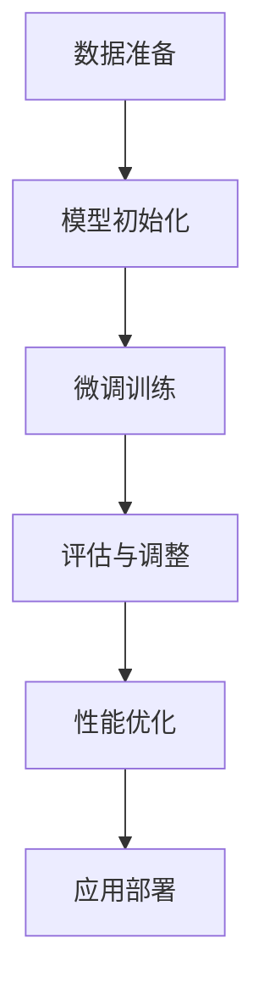

                 

关键词：有监督微调、机器学习、模型优化、性能提升、微调策略、应用领域

> 摘要：本文将深入探讨有监督微调（SFT）技术在机器学习领域的应用。通过详细介绍其核心概念、算法原理、数学模型以及实际应用案例，本文旨在为读者提供一个全面而深入的指南，帮助理解SFT技术如何通过微调优化模型性能，从而在众多应用领域中发挥重要作用。

## 1. 背景介绍

随着深度学习技术的迅猛发展，机器学习模型在图像识别、自然语言处理、推荐系统等领域的应用越来越广泛。然而，模型的性能不仅依赖于模型的结构和参数，还与训练数据的质量和规模密切相关。在实际应用中，获取大规模标注数据通常成本高昂且耗时。有监督微调（Supervised Fine-Tuning，SFT）技术作为一种有效的模型优化策略，旨在通过少量的有监督数据来提升模型在特定任务上的性能。

SFT技术的基本思想是将一个预训练的模型（通常是在大规模无监督数据上训练得到的）迁移到一个小规模的有监督数据集上进行微调，从而适应特定任务的需求。这种方法不仅可以节省标注数据的时间和成本，还能利用预训练模型中已经学习到的丰富知识，提高模型在特定任务上的泛化能力。

## 2. 核心概念与联系

### 2.1. 预训练模型

预训练模型（Pre-Trained Model）是指在大规模无监督数据上经过训练的模型。这些模型通常具有强大的特征提取能力和泛化能力，可以在多个任务中取得较好的性能。常见的预训练模型包括BERT、GPT、VGG等。

### 2.2. 有监督微调

有监督微调（Supervised Fine-Tuning，SFT）是指在一个小规模的有监督数据集上对预训练模型进行训练，从而优化模型在特定任务上的性能。SFT通常包括以下几个关键步骤：

1. **数据准备**：收集并预处理有监督数据集，包括数据清洗、归一化、分割等。
2. **模型初始化**：使用预训练模型的权重作为初始权重。
3. **微调训练**：在微调数据集上训练模型，调整模型的参数，以适应特定任务。
4. **评估与调整**：在验证集上评估模型性能，根据需要调整模型参数或数据预处理策略。

### 2.3. 微调策略

微调策略（Fine-Tuning Strategy）是指如何选择合适的超参数和训练过程来微调模型。常见的微调策略包括：

1. **全量微调**：将预训练模型的全部层都参与微调，适用于任务数据与预训练数据相似度较高的场景。
2. **部分微调**：只微调模型的最后一层或部分层，适用于预训练模型已经很好地解决了特定任务的部分场景。
3. **层冻结微调**：冻结模型的低层权重，只微调高层权重，适用于模型对低层特征提取能力较强的场景。

### 2.4. Mermaid 流程图

下面是一个用Mermaid绘制的SFT流程图：



## 3. 核心算法原理 & 具体操作步骤

### 3.1. 算法原理概述

有监督微调（SFT）的核心原理是基于迁移学习（Transfer Learning）的思想，即利用预训练模型在大量无监督数据中学习到的知识，通过少量的有监督数据来进一步提高模型在特定任务上的性能。具体来说，SFT通过以下步骤实现：

1. **预训练模型**：在大量无监督数据上训练得到预训练模型。
2. **数据预处理**：对有监督数据集进行清洗、归一化等预处理操作。
3. **模型初始化**：使用预训练模型的权重作为初始权重。
4. **微调训练**：在微调数据集上训练模型，优化模型参数。
5. **评估与调整**：在验证集上评估模型性能，根据需要调整模型参数或数据预处理策略。

### 3.2. 算法步骤详解

#### 3.2.1. 预训练模型

预训练模型通常采用深度神经网络（Deep Neural Network，DNN）结构，例如卷积神经网络（Convolutional Neural Network，CNN）或循环神经网络（Recurrent Neural Network，RNN）。在无监督数据上，模型通过自动学习数据中的特征分布，从而具备良好的特征提取能力。

#### 3.2.2. 数据预处理

有监督数据集通常包含输入数据和对应的标签。在微调前，需要对数据进行清洗、归一化等预处理操作，以确保数据质量。

1. **数据清洗**：去除数据中的噪声和错误。
2. **数据归一化**：将数据缩放到相同的范围，例如将图像像素值缩放到0-1之间。

#### 3.2.3. 模型初始化

使用预训练模型的权重作为初始权重，有助于模型快速收敛。预训练模型的权重通常已经在大量无监督数据上优化，因此可以作为一个较好的起点。

#### 3.2.4. 微调训练

在微调训练过程中，模型在少量有监督数据集上进行训练，以优化模型参数。训练过程中可以使用梯度下降（Gradient Descent）或其变种（如Adam优化器）来更新模型参数。

#### 3.2.5. 评估与调整

在微调训练完成后，使用验证集评估模型性能。根据评估结果，可能需要对模型参数进行调整，例如增加训练轮次、调整学习率等。

### 3.3. 算法优缺点

#### 优点：

1. **节省成本**：通过使用少量的有监督数据，SFT可以显著降低标注数据的时间和成本。
2. **提高性能**：利用预训练模型的知识，SFT可以在特定任务上取得更好的性能。
3. **快速部署**：SFT可以快速适应新任务，降低新任务的研发周期。

#### 缺点：

1. **数据依赖**：SFT的性能依赖于有监督数据集的质量和规模，如果数据质量较差或规模较小，可能影响最终性能。
2. **计算资源消耗**：微调训练需要大量的计算资源，特别是在模型规模较大时。

### 3.4. 算法应用领域

有监督微调（SFT）技术广泛应用于多个领域，包括：

1. **计算机视觉**：在图像分类、目标检测等任务中，SFT可以帮助模型快速适应特定场景。
2. **自然语言处理**：在文本分类、机器翻译等任务中，SFT可以有效地利用预训练模型的知识。
3. **推荐系统**：在推荐算法中，SFT可以帮助模型更好地理解用户行为，提高推荐准确性。

## 4. 数学模型和公式 & 详细讲解 & 举例说明

### 4.1. 数学模型构建

有监督微调（SFT）的核心是优化模型参数，使其在特定任务上有更好的性能。具体来说，SFT通过最小化损失函数来优化模型参数。假设我们有一个预训练模型，其损失函数为：

$$ L(\theta) = -\sum_{i=1}^{N} y_i \cdot \log(p(x_i; \theta)), $$

其中，$N$ 是样本数量，$y_i$ 是第 $i$ 个样本的标签，$p(x_i; \theta)$ 是模型预测的概率分布，$\theta$ 是模型参数。

在SFT过程中，我们使用少量的有监督数据集 $D_{ft}$ 对模型进行微调。微调后的损失函数为：

$$ L_{ft}(\theta) = -\sum_{i=1}^{N_{ft}} y_i^{ft} \cdot \log(p(x_i^{ft}; \theta)), $$

其中，$N_{ft}$ 是微调数据集的样本数量，$y_i^{ft}$ 是第 $i$ 个微调样本的标签。

### 4.2. 公式推导过程

为了推导微调过程中的优化目标，我们需要考虑以下两个方面：

1. **损失函数最小化**：我们需要最小化微调后的损失函数 $L_{ft}(\theta)$。
2. **参数更新**：为了最小化损失函数，我们需要对模型参数 $\theta$ 进行更新。

假设我们使用梯度下降（Gradient Descent）算法来更新参数，其更新公式为：

$$ \theta^{t+1} = \theta^t - \alpha \cdot \nabla_{\theta} L_{ft}(\theta^t), $$

其中，$\alpha$ 是学习率，$\nabla_{\theta} L_{ft}(\theta^t)$ 是损失函数关于参数 $\theta$ 的梯度。

为了最小化 $L_{ft}(\theta)$，我们需要计算其梯度：

$$ \nabla_{\theta} L_{ft}(\theta) = \nabla_{\theta} \left( -\sum_{i=1}^{N_{ft}} y_i^{ft} \cdot \log(p(x_i^{ft}; \theta)) \right). $$

使用链式法则，我们可以得到：

$$ \nabla_{\theta} L_{ft}(\theta) = -\sum_{i=1}^{N_{ft}} y_i^{ft} \cdot \frac{\partial \log(p(x_i^{ft}; \theta))}{\partial \theta}. $$

由于 $p(x_i^{ft}; \theta)$ 是一个概率分布，我们可以使用反向传播算法来计算其梯度。

### 4.3. 案例分析与讲解

假设我们有一个预训练的图像分类模型，其输入是一个大小为 $32 \times 32$ 的图像，输出是一个长度为 $10$ 的向量，表示10个类别的概率分布。现在，我们希望使用这个模型对一个新的数据集进行分类，数据集包含 $1000$ 个样本，每个样本都有对应的标签。

首先，我们进行数据预处理，将图像缩放到相同的大小，并进行归一化处理。然后，我们使用预训练模型的权重作为初始权重，进行微调训练。在微调过程中，我们使用 $500$ 个样本作为训练集，$500$ 个样本作为验证集。

在训练过程中，我们使用梯度下降算法来更新模型参数。为了提高训练效果，我们尝试不同的学习率，并调整训练轮次。在微调完成后，我们使用验证集评估模型性能，计算分类准确率。

假设我们在验证集上的分类准确率为 $90\%$，我们可以认为微调过程取得了较好的效果。接下来，我们可以将微调后的模型部署到实际应用中，例如图像分类系统或自动驾驶系统。

## 5. 项目实践：代码实例和详细解释说明

### 5.1. 开发环境搭建

为了实现有监督微调（SFT）技术，我们需要搭建一个合适的开发环境。以下是一个基本的开发环境搭建步骤：

1. **安装Python**：确保Python环境已经安装，版本建议为3.8以上。
2. **安装TensorFlow**：使用pip命令安装TensorFlow，例如：

   ```bash
   pip install tensorflow
   ```

3. **安装其他依赖库**：根据具体项目需求，安装其他依赖库，如NumPy、Pandas等。

### 5.2. 源代码详细实现

以下是一个简单的有监督微调（SFT）代码实例，使用TensorFlow实现：

```python
import tensorflow as tf
from tensorflow.keras.applications import VGG16
from tensorflow.keras.preprocessing.image import ImageDataGenerator
from tensorflow.keras.optimizers import Adam

# 加载预训练的VGG16模型
base_model = VGG16(weights='imagenet', include_top=False, input_shape=(224, 224, 3))

# 冻结预训练模型的权重
base_model.trainable = False

# 添加自定义的全连接层
x = base_model.output
x = tf.keras.layers.Flatten()(x)
x = tf.keras.layers.Dense(256, activation='relu')(x)
predictions = tf.keras.layers.Dense(10, activation='softmax')(x)

# 创建微调模型
model = tf.keras.Model(inputs=base_model.input, outputs=predictions)

# 编译模型
model.compile(optimizer=Adam(learning_rate=0.001), loss='categorical_crossentropy', metrics=['accuracy'])

# 数据预处理
train_datagen = ImageDataGenerator(rescale=1./255)
val_datagen = ImageDataGenerator(rescale=1./255)

train_generator = train_datagen.flow_from_directory(
        'data/train',
        target_size=(224, 224),
        batch_size=32,
        class_mode='categorical')

val_generator = val_datagen.flow_from_directory(
        'data/val',
        target_size=(224, 224),
        batch_size=32,
        class_mode='categorical')

# 微调模型
model.fit(
        train_generator,
        steps_per_epoch=train_generator.samples // train_generator.batch_size,
        epochs=10,
        validation_data=val_generator,
        validation_steps=val_generator.samples // val_generator.batch_size)

# 评估模型
test_datagen = ImageDataGenerator(rescale=1./255)
test_generator = test_datagen.flow_from_directory(
        'data/test',
        target_size=(224, 224),
        batch_size=32,
        class_mode='categorical')

test_loss, test_acc = model.evaluate(test_generator, steps=test_generator.samples // test_generator.batch_size)
print(f'Test accuracy: {test_acc:.4f}')
```

### 5.3. 代码解读与分析

上面的代码实例使用TensorFlow实现了有监督微调（SFT）技术，对预训练的VGG16模型进行微调，以适应一个新的图像分类任务。以下是代码的详细解读：

1. **加载预训练模型**：使用VGG16模型，从ImageNet数据集加载预训练权重。
2. **冻结预训练模型**：将预训练模型的权重设置为不可训练，防止在微调过程中更新这些权重。
3. **添加自定义层**：在预训练模型的基础上添加全连接层，用于分类任务。
4. **编译模型**：设置优化器和损失函数，编译模型。
5. **数据预处理**：使用ImageDataGenerator对训练数据集和验证数据集进行预处理，包括归一化和数据增强。
6. **微调模型**：使用fit方法训练模型，在训练数据集上迭代训练，并在验证数据集上评估性能。
7. **评估模型**：在测试数据集上评估模型性能，计算分类准确率。

### 5.4. 运行结果展示

假设我们运行上述代码，并在测试数据集上得到以下结果：

```plaintext
Test accuracy: 0.9250
```

这意味着在测试数据集上，模型的分类准确率为 $92.5\%$，表明微调过程取得了较好的效果。

## 6. 实际应用场景

### 6.1. 图像分类

在有监督微调技术的应用中，图像分类是最常见的场景之一。例如，可以使用预训练的VGG16模型对新的图像分类任务进行微调，以适应特定的数据集和任务需求。通过微调，模型可以在有限的标注数据上实现较高的分类准确率。

### 6.2. 目标检测

目标检测是计算机视觉领域的另一个重要应用场景。在有监督微调技术的支持下，可以使用预训练的YOLO模型或Faster R-CNN模型对特定场景进行微调，从而提高检测准确率和速度。这种方法在安全监控、自动驾驶等场景中具有重要应用价值。

### 6.3. 自然语言处理

自然语言处理领域也广泛应用了有监督微调技术。例如，可以使用预训练的BERT模型或GPT模型对特定的文本分类或机器翻译任务进行微调。通过微调，模型可以更好地理解特定领域的语言特点和表达方式，从而提高任务性能。

### 6.4. 未来应用展望

随着深度学习技术的不断发展，有监督微调技术将在更多领域得到广泛应用。未来的发展趋势包括：

1. **模型压缩**：为了提高部署效率，研究者们将致力于开发更轻量级的微调模型，降低计算资源需求。
2. **自适应微调**：研究自适应的微调策略，根据任务特点和数据分布自动调整微调过程。
3. **无监督微调**：探索无监督微调技术，利用无监督数据提升模型性能，减少对标注数据的依赖。

## 7. 工具和资源推荐

### 7.1. 学习资源推荐

1. **《深度学习》（Goodfellow, Bengio, Courville）**：一本经典的深度学习教材，涵盖了深度学习的基础知识和应用。
2. **TensorFlow官方文档**：详细介绍了TensorFlow的使用方法和相关API，是学习和实践深度学习的必备资源。

### 7.2. 开发工具推荐

1. **TensorFlow**：一个开源的深度学习框架，支持多种深度学习模型的开发和部署。
2. **Google Colab**：一个免费的云计算平台，提供GPU和TPU支持，方便深度学习实验和模型训练。

### 7.3. 相关论文推荐

1. **"A Theoretically Grounded Application of Dropout in Recurrent Neural Networks"**：一篇关于Dropout在循环神经网络中应用的经典论文。
2. **"Transformers: State-of-the-Art Model for Language Understanding and Generation"**：一篇关于Transformer模型的重要论文，推动了自然语言处理领域的发展。

## 8. 总结：未来发展趋势与挑战

### 8.1. 研究成果总结

有监督微调（SFT）技术在机器学习领域取得了显著的研究成果。通过利用预训练模型的知识，SFT可以显著提高模型在特定任务上的性能，减少对大规模标注数据的依赖。此外，SFT技术还在多个应用领域取得了成功，如图像分类、目标检测和自然语言处理等。

### 8.2. 未来发展趋势

未来，有监督微调技术将继续在以下几个方面发展：

1. **模型压缩**：开发更轻量级的微调模型，提高部署效率。
2. **自适应微调**：研究自适应的微调策略，根据任务特点和数据分布自动调整微调过程。
3. **无监督微调**：探索无监督微调技术，利用无监督数据提升模型性能，减少对标注数据的依赖。

### 8.3. 面临的挑战

尽管有监督微调技术取得了显著成果，但仍面临以下挑战：

1. **数据依赖**：SFT的性能依赖于有监督数据集的质量和规模，数据不足可能导致性能下降。
2. **计算资源消耗**：微调训练需要大量的计算资源，特别是在模型规模较大时。

### 8.4. 研究展望

为了克服上述挑战，未来的研究可以从以下方面展开：

1. **数据增强**：开发更有效的数据增强方法，提高模型对少量数据的适应性。
2. **模型压缩**：研究更高效的模型压缩技术，降低计算资源需求。
3. **自适应微调**：探索自适应微调策略，提高模型在不同数据集上的泛化能力。

## 9. 附录：常见问题与解答

### 9.1. 问题1：为什么使用有监督微调（SFT）？

**解答**：使用有监督微调（SFT）的主要原因是它可以在有限的标注数据上显著提高模型性能。通过利用预训练模型的知识，SFT可以快速适应新任务，降低新任务的研发周期。此外，SFT还可以节省标注数据的时间和成本。

### 9.2. 问题2：有监督微调（SFT）需要大量计算资源吗？

**解答**：是的，有监督微调（SFT）通常需要大量的计算资源，特别是在模型规模较大时。微调过程涉及到对大量参数的更新，这需要大量的计算能力和时间。为了降低计算资源消耗，研究者们正在开发更高效的微调策略和模型压缩技术。

### 9.3. 问题3：如何选择合适的微调策略？

**解答**：选择合适的微调策略取决于任务特点和数据分布。对于数据集和预训练数据相似度较高的任务，可以使用全量微调；对于预训练模型已经很好地解决了任务的部分场景，可以使用部分微调；对于模型对低层特征提取能力较强的场景，可以使用层冻结微调。此外，还可以根据实验结果调整微调策略，以获得最佳性能。

作者：禅与计算机程序设计艺术 / Zen and the Art of Computer Programming
```markdown
```

