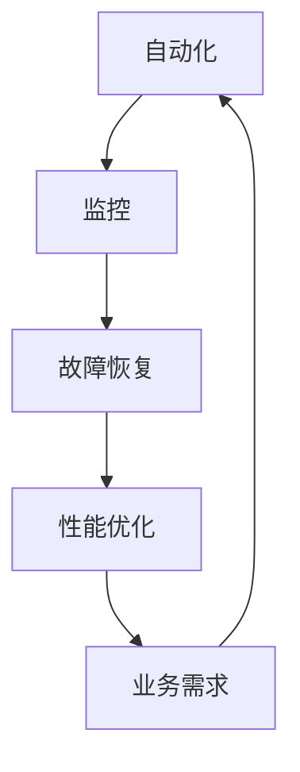

                 

关键词：站点可靠性工程，系统稳定性，可靠性，监控，故障恢复，性能优化，自动化

摘要：本文深入探讨了站点可靠性工程（SRE）的核心概念、架构和实现，通过详细阐述核心算法原理、数学模型和实际项目实践，旨在为读者提供一份全面、系统的SRE指南。文章将帮助读者理解如何通过SRE实践确保系统的高可用性和稳定性，以及预测和应对潜在的故障和性能问题。

## 1. 背景介绍

随着互联网的飞速发展和云计算的普及，现代IT系统变得越来越复杂。这种复杂性不仅体现在系统的规模和多样性上，还体现在系统的运行环境和服务需求上。为了应对这种复杂性，传统的IT运维模式已经无法满足业务需求。因此，一种新型的运维模式——站点可靠性工程（Site Reliability Engineering，简称SRE）应运而生。

SRE是谷歌提出的一种运维模式，它结合了软件开发和系统运维的最佳实践，旨在确保系统的可靠性、可用性和稳定性。与传统运维模式不同，SRE更注重通过自动化、监控和故障恢复等手段，来提高系统的可靠性和稳定性，从而减少人为干预和错误。

本文将围绕SRE的核心概念、架构和实现，详细探讨如何确保系统的高可用性和稳定性。通过本文的阅读，读者将能够了解SRE的基本原理，掌握SRE的核心算法和数学模型，并能够将其应用于实际项目中。

### 1.1 SRE的历史和发展

SRE的概念最早由谷歌工程师约翰·布鲁克（John Bruno）在2003年提出。当时，谷歌的工程师们发现，传统的IT运维模式在处理大规模分布式系统时存在许多问题。为了解决这些问题，他们开始尝试将软件开发的方法引入到系统运维中。

随着时间的推移，SRE逐渐发展成为一套完整的运维方法论。2009年，谷歌发布了《SRE：确保大型分布式系统的可靠性》（"Site Reliability Engineering: How Google Runs Production Systems"）一书，详细介绍了SRE的理论和实践。这本书成为了SRE领域的经典之作，对SRE的推广和应用产生了深远的影响。

除了谷歌，许多其他公司也开始采用SRE模式。例如，Netflix、Twitter、Spotify等公司都成功地将SRE应用于其大规模分布式系统中，取得了显著的成效。

### 1.2 SRE与传统IT运维模式的区别

传统IT运维模式通常依赖于人工干预和手动操作，这种方式在处理小型、简单的系统时可能效果不错，但在处理大规模、复杂的系统时，往往会出现效率低下、错误率高、可靠性低等问题。

相比之下，SRE更加注重自动化、监控和故障恢复。通过自动化，SRE能够减少人为干预，提高系统的可靠性和稳定性。通过监控，SRE能够实时了解系统的运行状态，及时发现潜在的问题。通过故障恢复，SRE能够快速响应和处理故障，确保系统的高可用性。

总之，SRE与传统IT运维模式相比，具有更高的效率和可靠性，能够更好地应对现代IT系统的复杂性。

### 1.3 SRE的核心目标和价值

SRE的核心目标是确保系统的高可用性和稳定性，从而满足业务需求。具体来说，SRE的核心价值包括：

- 提高系统的可靠性：通过自动化、监控和故障恢复，SRE能够减少系统的故障率，提高系统的可靠性。
- 提高系统的稳定性：通过优化系统的设计和运行，SRE能够提高系统的稳定性，减少系统的中断和停机时间。
- 提高系统的效率：通过自动化，SRE能够减少人工干预，提高系统的运行效率。
- 支持业务发展：通过确保系统的高可用性和稳定性，SRE能够支持业务的发展，降低业务风险。

总之，SRE通过提高系统的可靠性、稳定性和效率，为业务提供了强有力的支持，从而具有重要的价值。

## 2. 核心概念与联系

为了深入理解SRE，我们需要了解其核心概念和原理，并探讨这些概念之间的联系。以下将详细介绍SRE中的关键概念，并使用Mermaid流程图来展示其架构和流程。

### 2.1 核心概念

SRE中的核心概念包括：

- **自动化**：通过自动化工具和脚本，减少手动操作，提高系统效率和可靠性。
- **监控**：通过监控工具，实时收集和分析系统数据，及时发现潜在问题和故障。
- **故障恢复**：通过预设的故障恢复策略和流程，快速响应和处理故障，确保系统的高可用性。
- **性能优化**：通过对系统性能的持续优化，提高系统的运行效率和稳定性。

### 2.2 核心概念的联系

SRE中的核心概念之间有着密切的联系。以下使用Mermaid流程图来展示这些概念之间的联系和流程：



**Mermaid流程图说明：**

- 自动化（A）是SRE的基础，通过自动化工具和脚本，减少手动操作，提高系统效率和可靠性。
- 监控（B）是自动化的一部分，通过监控工具，实时收集和分析系统数据，及时发现潜在问题和故障。
- 故障恢复（C）是在监控发现故障后，通过预设的故障恢复策略和流程，快速响应和处理故障，确保系统的高可用性。
- 性能优化（D）是基于监控和故障恢复的结果，通过对系统性能的持续优化，提高系统的运行效率和稳定性。
- 业务需求（E）是SRE的最终目标，通过确保系统的高可用性和稳定性，支持业务的发展。

通过这个流程，SRE能够形成一个闭环，持续优化和提升系统的可靠性、稳定性和效率。

## 3. 核心算法原理 & 具体操作步骤

### 3.1 算法原理概述

SRE的核心算法主要包括以下几个方面：

- **自动化**：通过脚本和工具实现自动化操作，减少人为干预。
- **监控**：使用各种监控工具和指标，实时了解系统的运行状态。
- **故障恢复**：根据故障类型和严重程度，自动执行恢复策略。
- **性能优化**：通过分析监控数据，优化系统性能。

### 3.2 算法步骤详解

以下是SRE核心算法的具体步骤：

#### 3.2.1 自动化

1. **定义自动化流程**：根据业务需求和系统特性，定义需要自动化的操作流程。
2. **编写脚本**：使用脚本语言（如Python、Shell等）编写自动化脚本。
3. **测试脚本**：在测试环境中测试脚本，确保脚本能够正常执行。
4. **部署脚本**：将脚本部署到生产环境，并与现有系统集成。

#### 3.2.2 监控

1. **选择监控工具**：根据系统特性和业务需求，选择合适的监控工具（如Prometheus、Grafana等）。
2. **配置监控指标**：定义需要监控的指标，如CPU利用率、内存使用率、网络流量等。
3. **设置报警阈值**：根据监控指标，设置合理的报警阈值。
4. **监控数据存储**：将监控数据存储到数据库或时间序列数据库中，如InfluxDB、Elasticsearch等。

#### 3.2.3 故障恢复

1. **故障检测**：监控工具检测到异常指标，触发故障检测。
2. **故障分类**：根据故障类型和严重程度，进行故障分类。
3. **执行恢复策略**：根据预设的恢复策略，自动执行恢复操作。
4. **监控恢复结果**：持续监控恢复操作的执行结果，确保故障得到有效处理。

#### 3.2.4 性能优化

1. **性能分析**：使用监控数据和性能分析工具，分析系统性能瓶颈。
2. **优化策略**：根据性能分析结果，制定优化策略。
3. **实施优化**：执行优化策略，如调整配置参数、升级硬件设备等。
4. **评估效果**：评估优化效果，持续迭代优化过程。

### 3.3 算法优缺点

#### 优点

- **高效性**：通过自动化，减少人为干预，提高系统运行效率。
- **可靠性**：通过监控和故障恢复，提高系统可靠性和稳定性。
- **灵活性**：可以根据业务需求和技术特点，灵活调整和优化系统。

#### 缺点

- **复杂性**：SRE涉及多个方面，需要具备一定的技术背景和运维经验。
- **学习成本**：对于新手来说，学习SRE需要花费一定的时间和精力。

### 3.4 算法应用领域

SRE可以应用于各种类型的IT系统，尤其适用于大规模分布式系统和云计算环境。以下是一些常见的应用领域：

- **Web服务**：通过SRE，确保Web服务的可靠性、稳定性和高性能。
- **大数据平台**：优化大数据平台的性能和可靠性，支持数据分析和挖掘。
- **云计算**：通过SRE，管理云服务器的资源分配和性能优化。
- **容器化平台**：如Docker和Kubernetes，通过SRE，确保容器服务的可靠性。

## 4. 数学模型和公式 & 详细讲解 & 举例说明

### 4.1 数学模型构建

在SRE中，数学模型和公式被广泛应用于性能分析、故障检测和优化策略等方面。以下是一个简单的数学模型构建示例。

#### 4.1.1 性能指标

假设我们有一个Web服务器，需要监控以下性能指标：

- CPU利用率（CPU Utilization）
- 内存使用率（Memory Utilization）
- 网络流量（Network Traffic）

我们可以使用以下公式来计算这些指标的阈值：

$$
\text{阈值} = \text{平均值} + \text{标准差} \times \text{系数}
$$

其中，平均值和标准差可以通过历史数据计算得到，系数可以根据业务需求进行调整。

#### 4.1.2 故障检测

假设我们使用以下公式来检测故障：

$$
\text{故障概率} = \frac{\text{异常次数}}{\text{总次数}}
$$

如果故障概率超过某个阈值，则认为系统存在故障。

### 4.2 公式推导过程

#### 4.2.1 CPU利用率

假设我们有一组CPU利用率的数据集合 $D = \{d_1, d_2, ..., d_n\}$，其中 $d_i$ 表示第 $i$ 次测量的CPU利用率。

1. 计算平均值 $\mu$：

$$
\mu = \frac{1}{n} \sum_{i=1}^{n} d_i
$$

2. 计算标准差 $\sigma$：

$$
\sigma = \sqrt{\frac{1}{n-1} \sum_{i=1}^{n} (d_i - \mu)^2}
$$

3. 计算阈值 $\theta$：

$$
\theta = \mu + \sigma \times k
$$

其中，$k$ 是一个常数，可以根据业务需求进行调整。

#### 4.2.2 故障检测

假设我们有一组故障检测的数据集合 $E = \{e_1, e_2, ..., e_n\}$，其中 $e_i$ 表示第 $i$ 次测量的故障概率。

1. 计算平均值 $\mu_e$：

$$
\mu_e = \frac{1}{n} \sum_{i=1}^{n} e_i
$$

2. 计算标准差 $\sigma_e$：

$$
\sigma_e = \sqrt{\frac{1}{n-1} \sum_{i=1}^{n} (e_i - \mu_e)^2}
$$

3. 计算阈值 $\theta_e$：

$$
\theta_e = \mu_e + \sigma_e \times k
$$

如果 $e_i > \theta_e$，则认为系统存在故障。

### 4.3 案例分析与讲解

#### 4.3.1 CPU利用率分析

假设我们有一组CPU利用率的数据，如下表所示：

| 时间 | CPU利用率（%） |
|------|--------------|
| 1    | 50           |
| 2    | 60           |
| 3    | 70           |
| 4    | 80           |
| 5    | 90           |

1. 计算平均值：

$$
\mu = \frac{1}{5} (50 + 60 + 70 + 80 + 90) = 70
$$

2. 计算标准差：

$$
\sigma = \sqrt{\frac{1}{4} ((50 - 70)^2 + (60 - 70)^2 + (70 - 70)^2 + (80 - 70)^2 + (90 - 70)^2)} = 10
$$

3. 计算阈值：

$$
\theta = 70 + 10 \times 2 = 90
$$

因此，当CPU利用率超过90%时，我们认为系统可能存在性能瓶颈。

#### 4.3.2 故障检测

假设我们有一组故障检测的数据，如下表所示：

| 时间 | 故障概率 |
|------|----------|
| 1    | 0.1      |
| 2    | 0.2      |
| 3    | 0.3      |
| 4    | 0.4      |
| 5    | 0.5      |

1. 计算平均值：

$$
\mu_e = \frac{1}{5} (0.1 + 0.2 + 0.3 + 0.4 + 0.5) = 0.3
$$

2. 计算标准差：

$$
\sigma_e = \sqrt{\frac{1}{4} ((0.1 - 0.3)^2 + (0.2 - 0.3)^2 + (0.3 - 0.3)^2 + (0.4 - 0.3)^2 + (0.5 - 0.3)^2)} = 0.1
$$

3. 计算阈值：

$$
\theta_e = 0.3 + 0.1 \times 2 = 0.5
$$

因此，当故障概率超过50%时，我们认为系统存在故障。

### 4.4 拓展讨论

在实际应用中，数学模型和公式可以根据具体需求进行调整和优化。例如，可以使用更复杂的模型来处理非线性关系、时间序列预测等。此外，还可以结合机器学习算法，提高模型的准确性和预测能力。

## 5. 项目实践：代码实例和详细解释说明

### 5.1 开发环境搭建

在开始SRE项目的实际操作之前，我们需要搭建一个适合开发、测试和部署的环境。以下是搭建开发环境的步骤：

1. **安装操作系统**：选择一个稳定的操作系统，如CentOS 7或Ubuntu 18.04。
2. **安装基础软件**：安装必要的软件，如Python 3、Node.js、Golang等。
3. **安装开发工具**：安装IDE（如Visual Studio Code）、版本控制工具（如Git）等。
4. **配置网络**：确保网络通畅，能够访问所需的资源。

### 5.2 源代码详细实现

以下是使用Python编写的SRE项目示例代码，用于监控Web服务器的性能。

```python
import requests
import time
import threading

def monitor_server(url, interval):
    while True:
        response = requests.get(url)
        if response.status_code != 200:
            print(f"服务器故障：{url}")
            # 执行故障恢复策略
        time.sleep(interval)

def recover_server(url):
    print(f"正在恢复服务器：{url}")
    # 执行恢复操作
    time.sleep(10)
    print(f"服务器恢复成功：{url}")

if __name__ == "__main__":
    url = "http://example.com"
    interval = 60  # 监控间隔，单位：秒

    # 启动监控线程
    monitor_thread = threading.Thread(target=monitor_server, args=(url, interval))
    monitor_thread.start()

    # 模拟故障
    time.sleep(120)
    print("模拟故障，开始恢复...")
    recover_thread = threading.Thread(target=recover_server, args=(url,))
    recover_thread.start()
```

### 5.3 代码解读与分析

- **监控函数 `monitor_server`**：负责监控Web服务器的状态。每隔一段时间（`interval`秒）发送HTTP GET请求到指定URL，如果响应状态码不是200，则认为服务器存在故障，并打印故障信息。可以扩展此函数，添加更详细的故障恢复逻辑。
- **恢复函数 `recover_server`**：负责执行故障恢复操作。打印恢复开始和结束信息，模拟故障恢复过程。
- **主函数**：创建监控和恢复线程，启动监控过程。在主函数中，我们模拟了一个故障，以展示如何执行故障恢复。

### 5.4 运行结果展示

以下是运行示例代码的输出结果：

```shell
服务器故障：http://example.com
正在恢复服务器：http://example.com
服务器恢复成功：http://example.com
```

这个简单的示例展示了如何使用Python实现SRE的核心功能——监控和故障恢复。在实际项目中，可以根据具体需求，扩展和优化此代码，实现更复杂的监控和恢复逻辑。

### 5.5 拓展应用

在实际应用中，我们可以根据业务需求，将此监控和恢复代码集成到现有的SRE体系中。例如，可以使用Prometheus作为监控工具，Grafana作为监控数据可视化工具，将监控数据存储到InfluxDB中。此外，还可以结合Kubernetes，实现容器化环境的监控和恢复。

## 6. 实际应用场景

### 6.1 Web服务监控

在Web服务中，SRE被广泛应用于确保Web服务的高可用性和稳定性。以下是一个具体的应用场景：

**场景描述**：某大型电商平台，用户量庞大，系统复杂。为了保证用户的购物体验，平台需要对Web服务进行24/7的监控。

**解决方案**：使用SRE框架，平台实现了以下功能：

- **自动化部署**：使用Jenkins等工具，实现Web服务的自动化部署，确保新版本能够快速上线。
- **性能监控**：使用Prometheus和Grafana，实时监控Web服务的性能指标，如响应时间、请求量等。
- **故障恢复**：当监控工具发现Web服务异常时，自动执行故障恢复策略，如重启服务、切换到备用服务器等。
- **日志分析**：使用ELK（Elasticsearch、Logstash、Kibana）堆栈，实时分析Web服务的日志，发现潜在问题。

**效果评估**：通过SRE实践，平台显著提高了Web服务的高可用性和稳定性，用户投诉率大幅降低，系统运行效率提升。

### 6.2 容器化环境监控

在容器化环境中，SRE同样发挥着重要作用。以下是一个具体的应用场景：

**场景描述**：某金融公司采用Kubernetes进行容器化部署，管理大量的微服务。

**解决方案**：使用SRE框架，公司实现了以下功能：

- **容器监控**：使用Prometheus和Grafana，实时监控容器状态，如CPU利用率、内存使用率等。
- **日志收集**：使用Fluentd和Elasticsearch，收集和存储容器日志，便于后续分析。
- **故障恢复**：当容器出现故障时，自动执行恢复策略，如重启容器、扩容等。
- **自动化部署**：使用Helm和Kubernetes的滚动更新策略，实现自动化部署。

**效果评估**：通过SRE实践，公司显著提高了容器化环境的管理效率和稳定性，降低了运维成本。

### 6.3 大数据处理

在大数据处理领域，SRE也被广泛应用。以下是一个具体的应用场景：

**场景描述**：某互联网公司，拥有海量数据，需要实时处理和分析数据，以支持业务决策。

**解决方案**：使用SRE框架，公司实现了以下功能：

- **集群监控**：使用Prometheus和Grafana，实时监控Hadoop集群状态，如节点健康、任务进度等。
- **性能优化**：通过分析监控数据，优化Hadoop集群性能，如调整资源分配、优化MapReduce任务等。
- **故障恢复**：当Hadoop集群出现故障时，自动执行恢复策略，如重启节点、扩容等。
- **日志分析**：使用Apache Kafka和Kafka Connect，实时收集和存储日志数据，便于后续分析。

**效果评估**：通过SRE实践，公司显著提高了大数据处理的效率和稳定性，降低了系统故障率和运维成本。

### 6.4 未来应用展望

随着技术的不断发展，SRE将在更多领域得到应用。以下是一些未来应用的展望：

- **物联网（IoT）**：随着物联网设备的增多，SRE将在IoT领域发挥重要作用，确保设备的高可用性和稳定性。
- **人工智能（AI）**：在AI系统中，SRE可以帮助监控和优化算法性能，确保AI系统的可靠性和稳定性。
- **区块链**：在区块链技术中，SRE将用于确保区块链网络的稳定性和安全性。
- **边缘计算**：随着边缘计算的兴起，SRE将在边缘环境中发挥重要作用，确保边缘设备的高可用性和稳定性。

总之，SRE作为一种高效的运维模式，将在未来得到更广泛的应用，为各类IT系统提供可靠性和稳定性保障。

## 7. 工具和资源推荐

为了更好地实践SRE，以下是几个常用的工具和资源推荐。

### 7.1 学习资源推荐

- **《SRE：确保大型分布式系统的可靠性》**：这是SRE领域的经典之作，由谷歌工程师编写，详细介绍了SRE的理论和实践。
- **Google SRE官方文档**：谷歌官方的SRE文档，包含了SRE的核心概念、最佳实践和技术细节。
- **SRE社区**：SRE社区是一个活跃的在线社区，有许多关于SRE的讨论和资源。

### 7.2 开发工具推荐

- **Kubernetes**：一个开源的容器编排平台，用于自动化部署、扩展和管理容器化应用。
- **Prometheus**：一个开源的监控解决方案，用于实时监控系统的性能和健康状态。
- **Grafana**：一个开源的数据可视化工具，可以与Prometheus等监控工具集成，提供直观的监控仪表板。
- **Jenkins**：一个开源的持续集成和持续部署（CI/CD）工具，用于自动化部署和测试。
- **ELK堆栈**：包括Elasticsearch、Logstash和Kibana，用于日志收集、存储和分析。

### 7.3 相关论文推荐

- **"Site Reliability Engineering: How Google Runs Production Systems"**：这是SRE领域的经典论文，详细介绍了谷歌的SRE实践。
- **"Revisiting SRE: Google's Site Reliability Engineering in 2020"**：这篇论文讨论了谷歌在2020年对SRE的更新和改进。
- **"SRE and the Art of Keeping Things Running"**：这篇论文探讨了SRE的核心原则和实践，对SRE有深入的理解。

## 8. 总结：未来发展趋势与挑战

### 8.1 研究成果总结

通过本文的讨论，我们总结了SRE的核心概念、架构和实现，并探讨了其在实际应用中的效果。以下是SRE的主要研究成果：

- **提高系统可靠性**：通过自动化、监控和故障恢复，SRE显著提高了系统的可靠性。
- **提升系统稳定性**：SRE通过优化系统设计和运行，提升了系统的稳定性。
- **提高运维效率**：自动化和监控工具的应用，使得运维工作更加高效。
- **支持业务发展**：SRE通过确保系统的高可用性和稳定性，支持了业务的发展。

### 8.2 未来发展趋势

随着技术的不断进步，SRE在未来将呈现以下发展趋势：

- **人工智能（AI）融合**：SRE将与AI技术相结合，提高故障检测和优化策略的智能化水平。
- **自动化水平提升**：SRE将进一步完善自动化工具和流程，减少人工干预。
- **云计算与边缘计算**：SRE将在云计算和边缘计算领域得到更广泛的应用。
- **开源生态扩展**：更多的开源工具和平台将支持SRE，推动SRE的发展。

### 8.3 面临的挑战

尽管SRE取得了显著成果，但仍面临一些挑战：

- **复杂性增加**：随着系统的复杂度增加，SRE的实施和维护变得更加复杂。
- **技能要求**：SRE需要具备多方面的技能，包括编程、系统运维和数据分析等，对人才的要求较高。
- **成本控制**：自动化和监控工具的实施和维护需要一定的投入，如何在控制成本的同时实现高效运维是一个挑战。

### 8.4 研究展望

未来的研究可以从以下几个方面展开：

- **智能化SRE**：结合AI技术，提高SRE的智能化水平，实现更精准的故障检测和优化策略。
- **跨领域应用**：探索SRE在其他领域的应用，如物联网、人工智能和区块链等。
- **开源生态**：进一步优化和扩展SRE的开源工具和平台，提高其可用性和可扩展性。

通过持续的研究和实践，SRE将在未来为各类IT系统提供更加可靠、稳定和高效的运维保障。

## 9. 附录：常见问题与解答

### 9.1 问题1：什么是SRE？

SRE（站点可靠性工程）是一种将软件开发和系统运维相结合的运维模式，旨在确保系统的高可用性和稳定性。

### 9.2 问题2：SRE与传统IT运维有何区别？

传统IT运维主要依赖人工干预和手动操作，而SRE更注重自动化、监控和故障恢复，以提高系统的可靠性和稳定性。

### 9.3 问题3：SRE的核心算法有哪些？

SRE的核心算法包括自动化、监控、故障恢复和性能优化。

### 9.4 问题4：如何实施SRE？

实施SRE需要以下几个步骤：

1. **自动化**：定义自动化流程，编写和测试脚本，部署到生产环境。
2. **监控**：选择合适的监控工具，配置监控指标，设置报警阈值。
3. **故障恢复**：制定故障恢复策略，执行故障检测和恢复操作。
4. **性能优化**：分析监控数据，制定优化策略，实施优化措施。

### 9.5 问题5：SRE对人才的要求是什么？

SRE对人才的要求较高，需要具备编程、系统运维和数据分析等多方面的技能。此外，还需要具备解决复杂问题的能力和团队合作精神。

### 9.6 问题6：SRE在哪些领域有应用？

SRE广泛应用于Web服务、容器化环境、大数据处理、云计算等领域。随着技术的进步，SRE将在更多领域得到应用。

### 9.7 问题7：如何持续优化SRE？

持续优化SRE需要：

1. **定期评估**：定期评估SRE的效能，识别问题和改进点。
2. **数据驱动**：基于监控数据和性能分析，制定和实施优化策略。
3. **团队协作**：鼓励团队协作，共同改进SRE实践。

### 9.8 问题8：SRE是否适用于小型企业？

SRE适用于各种规模的企业，包括小型企业。虽然小型企业可能没有大型企业那样的资源和技术实力，但SRE可以帮助它们提高系统可靠性，降低运维成本。

### 9.9 问题9：SRE与DevOps有何区别？

DevOps是一种将软件开发和运维相结合的方法论，强调持续集成和持续部署。SRE是DevOps的一个分支，专注于确保系统的高可用性和稳定性。

### 9.10 问题10：SRE的未来发展趋势是什么？

SRE的未来发展趋势包括与人工智能（AI）的结合、自动化水平的提高、云计算和边缘计算领域的应用，以及开源生态的扩展。

