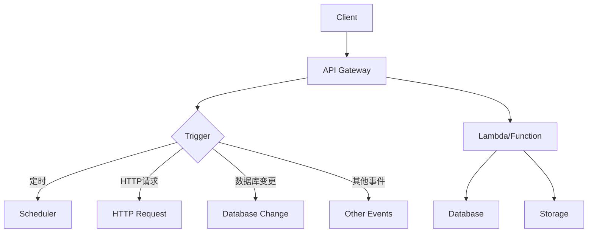

                 

关键词：Serverless架构、AWS Lambda、Azure Functions、云计算、微服务、无服务器计算

> 摘要：本文深入探讨了Serverless架构的核心概念，重点分析了AWS Lambda和Azure Functions这两大主流Serverless平台。通过对比它们的特点、优势和应用场景，我们揭示了无服务器计算的革命性潜力，为开发者提供了实用的指导和见解。

## 1. 背景介绍

Serverless架构，顾名思义，是一种无需关注底层服务器管理的云计算模型。开发者只需专注于编写业务逻辑代码，无需关心服务器配置、维护和扩展等复杂问题。这一架构的出现，源于云计算的快速发展以及微服务架构的广泛应用。

传统的云计算模型要求开发者不仅要编写应用程序代码，还要负责服务器的选购、部署、维护和扩展等工作。随着业务规模的扩大，服务器管理的复杂性也不断增加。而Serverless架构通过将服务器管理外包给云服务提供商，彻底解放了开发者，使他们能够将更多精力投入到业务创新和优化中。

AWS Lambda和Azure Functions是当前最流行的两个Serverless平台。AWS Lambda由亚马逊网络服务（AWS）提供，而Azure Functions则是由微软的Azure云服务支持。它们都为开发者提供了便捷的Serverless开发环境，支持多种编程语言，并具备高度的可扩展性。

## 2. 核心概念与联系

### 2.1 Serverless架构核心概念

Serverless架构的核心概念包括：

- **函数即服务（Functions as a Service，FaaS）**：开发者只需编写函数代码，无需关心服务器管理，云服务商会自动部署和扩展函数。
- **事件驱动（Event-Driven）**：函数的执行是由外部事件触发的，可以是HTTP请求、定时任务、数据库变更等。
- **无状态（Stateless）**：函数在执行过程中不维护状态信息，每次执行都是独立的。

### 2.2 架构联系

下面是一个简化的Serverless架构的Mermaid流程图：



### 2.3 AWS Lambda与Azure Functions的关系

AWS Lambda和Azure Functions都是Serverless架构的典型代表。它们之间的主要区别在于：

- **支持语言**：AWS Lambda支持超过300种编程语言和框架，而Azure Functions主要支持.NET、Java和Python等语言。
- **执行模型**：AWS Lambda采用基于事件触发的异步执行模型，而Azure Functions则提供更加灵活的同步和异步执行模式。
- **生态系统**：AWS Lambda拥有更广泛的生态系统，包括众多的集成服务，如S3、DynamoDB和Kinesis等。Azure Functions则与Azure的其他服务紧密集成，如Azure SQL数据库和Azure Blob存储。

## 3. 核心算法原理 & 具体操作步骤

### 3.1 算法原理概述

Serverless架构的核心算法原理是事件驱动和无服务器计算。开发者需要编写的函数代码在事件触发时执行，函数的执行状态和上下文信息被保存在云服务提供商提供的存储系统中。这使得函数具有高度的灵活性和可扩展性。

### 3.2 算法步骤详解

1. **编写函数代码**：开发者使用支持的语言和框架编写函数代码，并将其上传到云服务提供商的平台上。
2. **配置触发器**：为函数配置触发器，可以是HTTP请求、定时任务、数据库变更等。
3. **部署函数**：云服务提供商会自动部署函数，并在触发器触发时执行函数代码。
4. **执行函数**：函数执行完成后，将结果返回给客户端或存储在指定的存储系统中。

### 3.3 算法优缺点

#### 优点

- **简化服务器管理**：开发者无需关注服务器配置和扩展，降低了运维成本。
- **提高开发效率**：函数即服务使得开发者可以快速开发和部署应用。
- **弹性伸缩**：云服务商会根据需求自动扩展或缩小资源，确保应用性能。

#### 缺点

- **高依赖性**：Serverless架构高度依赖于云服务提供商，迁移成本较高。
- **冷启动问题**：长时间未被调用的函数在执行时可能会出现性能下降。
- **监控和调试难度**：由于函数执行环境的动态性，监控和调试变得更加复杂。

### 3.4 算法应用领域

Serverless架构在以下领域具有广泛的应用：

- **Web应用后端**：用于处理用户请求和数据处理。
- **数据管道**：用于数据传输和转换。
- **自动化任务**：用于定时任务和自动化流程。
- **边缘计算**：用于边缘设备的数据处理和响应。

## 4. 数学模型和公式 & 详细讲解 & 举例说明

### 4.1 数学模型构建

Serverless架构的数学模型主要涉及函数执行的成本和性能。以下是一个简化的数学模型：

$$
C = a \cdot n + b \cdot t
$$

其中，$C$表示执行成本，$a$和$b$为常数，$n$为函数执行次数，$t$为函数执行时间。

### 4.2 公式推导过程

执行成本由两部分组成：固定成本和可变成本。固定成本$a \cdot n$表示每次函数执行的固定开销，如函数部署和初始化成本。可变成本$b \cdot t$表示函数执行时间的可变开销，如CPU计算和I/O操作成本。

### 4.3 案例分析与讲解

假设一个简单的Web应用后端函数，平均每次执行耗时10ms，每天执行10000次。根据上述数学模型，执行成本计算如下：

$$
C = a \cdot 10000 + b \cdot 10
$$

如果$a=0.01$，$b=0.001$，则每天的总执行成本为：

$$
C = 0.01 \cdot 10000 + 0.001 \cdot 10 = 100.1
$$

这意味着每天只需要支付100.1美分的执行费用。通过优化函数代码和减少执行次数，可以进一步降低成本。

## 5. 项目实践：代码实例和详细解释说明

### 5.1 开发环境搭建

首先，我们需要搭建一个开发环境。以AWS Lambda为例，我们可以使用AWS Management Console或AWS CLI创建一个AWS账户，并配置AWS CLI工具。具体步骤如下：

1. 在AWS Management Console中创建一个AWS账户。
2. 安装并配置AWS CLI工具。
3. 设置AWS CLI凭证。

### 5.2 源代码详细实现

下面是一个简单的AWS Lambda函数示例，用于处理HTTP请求并返回响应：

```python
import json

def lambda_handler(event, context):
    # 获取请求参数
    name = event['queryStringParameters']['name']
    age = event['queryStringParameters']['age']
    
    # 构造响应
    response = {
        'statusCode': 200,
        'body': json.dumps({'message': f'Hello, {name}! You are {age} years old.'})
    }
    return response
```

### 5.3 代码解读与分析

这个Lambda函数接收一个HTTP请求，从请求参数中获取用户名和年龄，然后构造一个响应并返回。以下是代码的详细解读：

- 第1行：导入json模块，用于处理JSON数据。
- 第2行：定义Lambda函数的入口点，即`lambda_handler`函数。
- 第3行：获取请求参数，使用`event`对象的`queryStringParameters`属性。
- 第4行：构造响应，使用`json.dumps`函数将响应体转换为JSON格式。
- 第5行：返回响应，使用`response`对象。

### 5.4 运行结果展示

要测试这个Lambda函数，我们需要将其部署到AWS Lambda平台上，并配置一个API Gateway来接收HTTP请求。以下是部署和测试步骤：

1. 在AWS Management Console中创建一个Lambda函数，并将上面的代码粘贴到函数代码区域。
2. 配置函数的触发器，如API Gateway。
3. 部署函数。
4. 在浏览器中访问API Gateway的URL，如`https://your-api-gateway-url/`，可以看到函数的响应。

例如，访问`https://your-api-gateway-url/?name=John&age=30`，将得到以下响应：

```json
{
  "message": "Hello, John! You are 30 years old."
}
```

## 6. 实际应用场景

### 6.1 Web应用后端

Serverless架构非常适合构建Web应用的后端服务。开发者可以使用AWS Lambda或Azure Functions快速构建RESTful API，处理用户请求和数据处理任务。

### 6.2 数据管道

Serverless架构可以用于构建数据管道，用于数据传输、转换和存储。例如，可以使用AWS Lambda从数据库中提取数据，并将其转换为JSON格式，然后存储在S3桶中。

### 6.3 自动化任务

Serverless架构非常适合构建自动化任务，如定时任务、通知发送和数据备份等。开发者可以使用AWS Lambda或Azure Functions轻松实现这些任务。

### 6.4 边缘计算

Serverless架构可以用于边缘计算，用于处理边缘设备的数据处理和响应。例如，可以使用AWS Lambda在边缘设备上运行函数，处理传感器数据并触发相应的事件。

## 7. 工具和资源推荐

### 7.1 学习资源推荐

- 《Serverless Computing: A Brief Introduction》
- 《Serverless Framework: Up and Running》
- 《AWS Lambda: The Definitive Guide》

### 7.2 开发工具推荐

- AWS Management Console
- Azure Portal
- Serverless Framework
- AWS CLI
- Azure CLI

### 7.3 相关论文推荐

- "Serverless Architectures: Benefits, Risks, and Challenges"
- "Serverless Architectures: A Taxonomy and Security Analysis"
- "Serverless Framework: A Serverless Computing Platform for Dynamic Resource Provisioning"

## 8. 总结：未来发展趋势与挑战

### 8.1 研究成果总结

Serverless架构在云计算领域取得了显著成果。其高效、灵活和可扩展的特点使其成为开发者构建现代应用的理想选择。随着云计算的不断发展，Serverless架构的应用场景和生态系统也在不断拓展。

### 8.2 未来发展趋势

1. **跨云支持**：未来，Serverless架构将实现跨云支持，提供更加灵活的部署和迁移选项。
2. **AI集成**：Serverless架构将与人工智能技术深度融合，为开发者提供更强大的数据处理和分析能力。
3. **开源生态**：开源Serverless工具和框架将逐渐成熟，为开发者提供更多的选择和灵活性。

### 8.3 面临的挑战

1. **成本控制**：Serverless架构的执行成本可能较高，需要开发者进行精细的成本管理。
2. **冷启动问题**：长时间未被调用的函数在执行时可能会出现性能下降，需要优化函数代码和部署策略。
3. **安全性**：Serverless架构的安全性是一个重要挑战，需要加强安全管理和防护措施。

### 8.4 研究展望

Serverless架构将继续在云计算领域发挥重要作用。未来，我们需要进一步研究和优化Serverless架构的性能、成本和安全问题，以充分发挥其潜力，推动云计算技术的发展。

## 9. 附录：常见问题与解答

### 9.1 Serverless架构与传统云计算有什么区别？

Serverless架构与传统云计算的区别在于服务器管理。传统云计算要求开发者负责服务器配置和运维，而Serverless架构将服务器管理外包给云服务提供商。

### 9.2 AWS Lambda和Azure Functions有哪些主要区别？

AWS Lambda和Azure Functions的主要区别在于支持语言和执行模型。AWS Lambda支持多种编程语言，采用基于事件触发的异步执行模型。而Azure Functions主要支持.NET、Java和Python等语言，提供更加灵活的同步和异步执行模式。

### 9.3 如何降低Serverless架构的执行成本？

要降低Serverless架构的执行成本，可以采取以下措施：

- 优化函数代码，减少不必要的计算和I/O操作。
- 定期删除长时间未被调用的函数，释放资源。
- 使用批量处理和并发执行，提高资源利用率。

### 9.4 Serverless架构是否安全？

Serverless架构本身并不比传统云计算更不安全。安全性取决于云服务提供商的安全措施和开发者对安全的管理。开发者应遵循最佳实践，如使用加密、身份验证和访问控制等，确保Serverless架构的安全性。


作者：禅与计算机程序设计艺术 / Zen and the Art of Computer Programming

