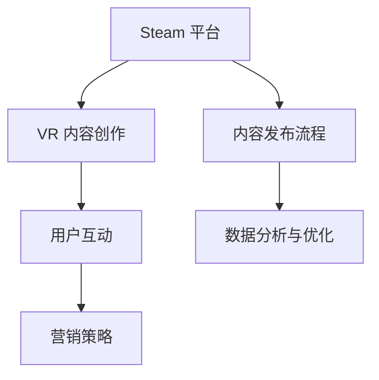

                 

关键词：SteamVR、内容发布、VR 体验、Steam 平台、营销策略、用户互动、技术创新

> 摘要：本文旨在探讨如何通过在 Steam 平台上有效发布 VR 内容，以推广 VR 体验，吸引并留住用户。我们将从平台背景、内容创作、营销策略、用户互动和未来展望等多个方面进行分析和讨论。

## 1. 背景介绍

虚拟现实（VR）作为一种新兴的交互技术，正迅速改变着人们的娱乐方式和生活体验。SteamVR 作为 VR 内容的集中平台，拥有庞大的用户基础和丰富的 VR 应用程序。然而，随着 VR 内容的日益增多，如何在 Steam 平台上脱颖而出，吸引并留住用户，成为 VR 内容创作者和开发者面临的重要问题。

## 2. 核心概念与联系

为了在 Steam 平台上成功发布 VR 内容，我们需要了解几个核心概念，包括：

- **Steam 平台生态系统**：了解 Steam 平台的架构、功能和服务对于内容发布至关重要。
- **VR 内容创作**：探讨如何创作高质量的 VR 内容，包括故事叙述、交互设计和视觉效果。
- **用户互动**：分析如何与用户互动，提升用户满意度和粘性。

下面是核心概念与联系的一个简单的 Mermaid 流程图：



## 3. 核心算法原理 & 具体操作步骤

### 3.1 算法原理概述

在 Steam 平台上发布 VR 内容，核心算法原理包括：

- **搜索引擎优化（SEO）**：通过优化内容标题、描述和标签，提高内容在搜索结果中的排名。
- **用户行为分析**：通过分析用户行为数据，了解用户偏好，优化内容推荐。
- **社交媒体整合**：利用社交媒体平台推广 VR 内容，扩大影响力。

### 3.2 算法步骤详解

以下是发布 VR 内容的具体操作步骤：

1. **内容创作**：
   - 确定目标受众和内容类型。
   - 使用高质量的图像和视频素材。
   - 创作引人入胜的故事情节和交互设计。

2. **内容优化**：
   - 编写吸引人的内容描述。
   - 使用合适的关键词和标签。
   - 优化元数据，包括标题、副标题和封面图片。

3. **发布内容**：
   - 在 Steam 平台上创建商店页面。
   - 上传内容文件和相关素材。
   - 设置合理的价格和销售策略。

4. **用户互动**：
   - 回应用户评论和反馈。
   - 组织线上活动，如直播和讨论会。
   - 利用社交媒体平台与用户互动。

5. **数据分析与优化**：
   - 监控用户行为数据，如访问量、下载量和用户评价。
   - 根据数据调整内容策略，优化用户体验。

### 3.3 算法优缺点

**优点**：
- 提高内容可见性和用户参与度。
- 通过数据分析，不断优化内容质量和用户满意度。

**缺点**：
- 需要大量的时间和资源进行内容创作和优化。
- 难以控制用户反馈和评价，可能面临负面评价的风险。

### 3.4 算法应用领域

- **游戏开发**：VR 游戏的开发和发布。
- **教育应用**：虚拟教学和培训内容的发布。
- **医疗应用**：虚拟现实治疗和康复。
- **艺术和设计**：VR 艺术作品的创作和展示。

## 4. 数学模型和公式 & 详细讲解 & 举例说明

在 VR 内容发布中，我们可以使用以下数学模型和公式来分析用户行为和优化内容策略：

### 4.1 数学模型构建

用户行为模型可以表示为：

$$
UserBehavior = f(Interest, Engagement, Satisfaction)
$$

其中：
- **Interest（兴趣）**：用户对 VR 内容的兴趣程度。
- **Engagement（参与度）**：用户与 VR 内容的互动程度。
- **Satisfaction（满意度）**：用户对 VR 内容的总体满意度。

### 4.2 公式推导过程

用户行为模型可以进一步分解为：

$$
Interest = f(Content Quality, Brand Reputation)
$$

$$
Engagement = f(User Interaction, Content Depth)
$$

$$
Satisfaction = f(Expectation, Reality)
$$

这些公式说明了用户行为是如何受到内容质量、品牌声誉、用户互动、内容深度、预期和实际体验的影响的。

### 4.3 案例分析与讲解

假设一个 VR 内容创作者想要提升用户满意度，我们可以通过以下步骤进行分析：

1. **确定关键因素**：
   - 内容质量：通过用户反馈和数据分析，了解内容的优缺点。
   - 用户互动：分析用户在平台上的行为，如评论、分享和下载。

2. **制定优化策略**：
   - 提升内容质量：改进故事叙述、视觉效果和交互设计。
   - 增加用户互动：举办线上活动，鼓励用户参与和分享。

3. **评估效果**：
   - 监控用户满意度指标，如评分、评论数量和用户留存率。
   - 调整策略，持续优化内容。

## 5. 项目实践：代码实例和详细解释说明

### 5.1 开发环境搭建

在开始 VR 内容发布之前，我们需要搭建一个合适的开发环境。以下是步骤：

1. 安装 SteamVR SDK。
2. 配置 Unity 或 Unreal Engine 开发环境。
3. 安装必要的 VR 头显和控制器。

### 5.2 源代码详细实现

以下是一个简单的 Unity 项目，展示了如何创建一个基本的 VR 应用程序：

```csharp
using UnityEngine;

public class VRApplication : MonoBehaviour
{
    public Transform cameraRig;
    public Transform VRController;

    void Update()
    {
        if (Input.GetButtonDown("Submit"))
        {
            // 交互逻辑
            Debug.Log("VR Controller Pressed");
        }

        // 更新控制器位置
        VRController.position = cameraRig.position;
        VRController.rotation = cameraRig.rotation;
    }
}
```

### 5.3 代码解读与分析

这段代码定义了一个简单的 VR 应用程序，其中包含以下关键部分：

- **cameraRig**：表示 VR 头显和控制器的基础框架。
- **VRController**：代表用户交互的虚拟控制器。
- **Update 方法**：在每一帧更新控制器位置和旋转，以匹配头显的实时位置和方向。

### 5.4 运行结果展示

当运行这个应用程序时，用户可以通过 VR 头显和控制器在虚拟环境中移动和交互。例如，按下控制器上的按钮可以触发交互逻辑。

## 6. 实际应用场景

VR 内容在 Steam 平台上有广泛的应用场景，包括：

- **游戏**：VR 游戏提供了沉浸式体验，吸引了大量玩家。
- **教育**：虚拟教学和培训提供了新的学习方式。
- **医疗**：虚拟现实技术用于治疗和心理康复。
- **艺术和设计**：VR 艺术作品展示了全新的创意空间。

## 7. 工具和资源推荐

### 7.1 学习资源推荐

- 《Virtual Reality Programming for the Real World》
- 《Unity 2018 VR Game Development Cookbook》

### 7.2 开发工具推荐

- Unity Engine
- Unreal Engine

### 7.3 相关论文推荐

- “Virtual Reality: Theory, Applications, and Systems”
- “The Design and Implementation of a Virtual Reality Application for Medicine”

## 8. 总结：未来发展趋势与挑战

### 8.1 研究成果总结

随着 VR 技术的不断发展，VR 内容发布和营销策略也在不断演进。通过优化内容创作、用户互动和数据分析，VR 内容创作者可以更好地吸引用户，提升满意度。

### 8.2 未来发展趋势

- **更高分辨率和更低的延迟**：提供更逼真的 VR 体验。
- **跨平台兼容性**：实现 VR 内容在多种设备上的运行。
- **更多应用场景**：VR 技术将在更多领域得到应用。

### 8.3 面临的挑战

- **内容质量**：创作高质量、有吸引力的 VR 内容。
- **用户体验**：优化用户交互和操作体验。
- **市场饱和**：在激烈的市场竞争中脱颖而出。

### 8.4 研究展望

未来，VR 内容发布将更加注重个性化推荐和用户参与。通过深入研究和不断创新，VR 内容创作者可以更好地满足用户需求，推动 VR 技术的发展。

## 9. 附录：常见问题与解答

- **Q：如何优化 VR 内容的搜索引擎排名？**
  A：通过使用合适的关键词和标签，编写高质量的内容描述，以及定期更新内容。

- **Q：如何提升 VR 内容的用户满意度？**
  A：通过优化交互设计、提供丰富的功能和高质量的视觉体验，以及积极回应用户反馈。

- **Q：如何推广 VR 内容？**
  A：利用社交媒体平台、在线广告和合作伙伴关系进行推广，同时举办线下活动，提高品牌知名度。

以上是关于在 Steam 平台上推广 VR 体验的详细分析和实践指导。希望对 VR 内容创作者和开发者有所启发和帮助。

### 作者署名

作者：禅与计算机程序设计艺术 / Zen and the Art of Computer Programming

通过以上内容，我们详细探讨了如何在 Steam 平台上成功发布 VR 内容，以推广 VR 体验。从背景介绍到核心算法原理，再到项目实践和实际应用场景，我们提供了一系列实用的技巧和策略。希望这篇文章能够为 VR 内容创作者和开发者提供有价值的参考和指导。

