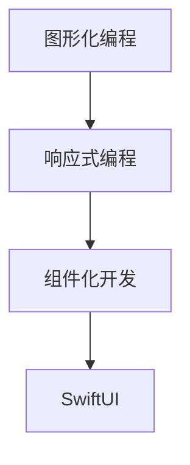

                 

关键词：SwiftUI、声明式UI、框架设计、UI开发、苹果技术、设计模式、响应式设计、用户界面、UI框架

摘要：本文将深入探讨苹果的SwiftUI框架设计理念，分析其核心优点，如声明式UI设计、响应式布局、可重用组件等，并探讨SwiftUI在现代化UI开发中的应用场景和未来发展方向。

## 1. 背景介绍

随着移动设备和智能设备的普及，用户界面的设计变得尤为重要。苹果公司自2015年开始推出SwiftUI框架，旨在提供一种现代化的UI开发方法，使开发者能够更加高效地构建美观、响应迅速的应用程序。SwiftUI基于Swift编程语言，结合了声明式UI和响应式设计理念，为开发者提供了丰富的组件和工具，简化了UI开发流程。

### 1.1 声明式UI

声明式UI是一种设计模式，它强调通过描述UI的状态和行为来构建用户界面，而非通过编程来直接操纵UI元素。这种模式使得开发者可以更加专注于业务逻辑，而非界面细节，从而提高了开发效率和代码可维护性。

### 1.2 响应式设计

响应式设计是指UI能够根据不同的设备和屏幕尺寸自动调整布局和交互方式。这种设计理念使得应用程序能够适应多种设备，提供一致的用户体验。SwiftUI通过其响应式架构，实现了高度响应式的UI设计。

### 1.3 SwiftUI的优点

SwiftUI具有以下优点：
- **易于上手**：SwiftUI基于Swift语言，对开发者而言学习成本较低。
- **全平台支持**：SwiftUI支持iOS、macOS、tvOS和watchOS等多个平台，提供统一的开发体验。
- **声明式UI**：SwiftUI采用声明式UI设计，使开发者能够更加高效地构建UI。
- **响应式布局**：SwiftUI的响应式布局使得UI能够自动适应不同设备和屏幕尺寸。
- **组件化开发**：SwiftUI提供了丰富的组件，使得开发者可以快速构建复杂的UI。

## 2. 核心概念与联系

为了深入理解SwiftUI的设计理念，我们首先需要了解一些核心概念，如图形化编程、响应式编程和组件化开发。以下是这些概念及其关系的Mermaid流程图：



### 2.1 图形化编程

图形化编程是一种通过图形界面来编写代码的方法，它使得开发者可以通过拖放组件和连接线来构建应用程序。这种方法降低了代码编写的复杂性，使得UI开发更加直观和高效。

### 2.2 响应式编程

响应式编程是一种编程范式，它通过数据流和函数响应来更新UI。这种编程范式使得UI能够自动适应数据和状态的变化，提高了开发效率和用户体验。

### 2.3 组件化开发

组件化开发是指将UI划分为独立的组件，每个组件负责实现特定的功能。这种开发模式使得UI可以高度复用，提高了代码的可维护性和开发效率。

### 2.4 SwiftUI与核心概念的联系

SwiftUI结合了图形化编程、响应式编程和组件化开发的理念，提供了以下优点：

- **图形化编程**：SwiftUI的预构建组件和视图让开发者能够通过拖放和简单代码实现复杂的UI。
- **响应式编程**：SwiftUI的响应式架构使得UI能够自动更新，开发者无需担心状态同步问题。
- **组件化开发**：SwiftUI提供了丰富的组件和视图，使得开发者可以快速构建和复用UI。

## 3. 核心算法原理 & 具体操作步骤

SwiftUI的核心算法原理主要涉及响应式编程和视图合成。以下是对SwiftUI核心算法原理的概述及其具体操作步骤。

### 3.1 算法原理概述

SwiftUI的核心算法原理可以概括为以下几点：

- **响应式数据绑定**：SwiftUI通过数据绑定实现了UI与数据之间的自动同步。当数据发生变化时，UI会自动更新。
- **视图合成**：SwiftUI将UI构建过程分解为多个视图和组件，通过视图合成实现了高效的UI渲染。
- **布局系统**：SwiftUI的布局系统基于响应式约束，使得UI能够自动适应不同设备和屏幕尺寸。

### 3.2 算法步骤详解

SwiftUI的核心算法步骤如下：

1. **数据绑定**：通过`.binding`关键字绑定数据到UI组件，实现数据与UI的同步更新。
2. **视图合成**：将多个视图和组件组合在一起，通过`.view`关键字创建视图结构。
3. **布局系统**：使用`.layout`关键字设置响应式约束，实现UI的响应式布局。

### 3.3 算法优缺点

SwiftUI的核心算法具有以下优缺点：

- **优点**：
  - **自动更新**：数据绑定使得UI能够自动更新，降低了开发难度。
  - **高效渲染**：视图合成和布局系统使得UI渲染效率高，提供良好的用户体验。
  - **响应式布局**：响应式布局使得UI能够自动适应不同设备和屏幕尺寸。

- **缺点**：
  - **学习成本**：SwiftUI的响应式编程和视图合成对于初学者来说可能有一定的学习成本。
  - **性能问题**：虽然SwiftUI具有高效的渲染能力，但在复杂场景下仍可能存在性能问题。

### 3.4 算法应用领域

SwiftUI的核心算法主要应用于以下领域：

- **移动应用开发**：SwiftUI是iOS、macOS、tvOS和watchOS等平台的首选UI框架。
- **Web应用开发**：SwiftUI Web将SwiftUI引入Web开发领域，提供了跨平台Web应用的解决方案。
- **游戏开发**：SwiftUI的视图合成和响应式布局也适用于游戏开发，可以构建高效的游戏UI。

## 4. 数学模型和公式 & 详细讲解 & 举例说明

在SwiftUI中，响应式编程的核心是状态管理和数据绑定。以下是一个简单的数学模型，用于描述SwiftUI中的状态管理和数据绑定。

### 4.1 数学模型构建

假设有一个简单的事件处理函数`handleEvent`，用于处理用户输入。我们可以定义以下数学模型：

\[ \text{event} \rightarrow \text{handleEvent} \rightarrow \text{state update} \]

其中：
- `event` 表示用户输入事件。
- `handleEvent` 表示事件处理函数。
- `state update` 表示状态更新。

### 4.2 公式推导过程

SwiftUI中的数据绑定实现了事件处理函数与状态更新之间的自动同步。我们可以将数据绑定表示为以下公式：

\[ \text{event} \rightarrow \text{handleEvent} \rightarrow \text{state update} \rightarrow \text{UI update} \]

其中：
- `UI update` 表示UI更新。

### 4.3 案例分析与讲解

假设我们有一个简单的表单界面，包含一个文本输入框和一个按钮。当用户点击按钮时，文本输入框中的内容将显示在界面上。以下是一个具体的案例：

```swift
import SwiftUI

struct ContentView: View {
    @State private var text: String = ""

    var body: some View {
        VStack {
            TextField("输入文本", text: $text)
            Button("显示文本") {
                print(text)
            }
        }
    }
}
```

在这个案例中，我们定义了一个`@State`属性`text`，用于存储文本输入框中的内容。当用户输入文本时，`text`属性会自动更新。当用户点击按钮时，事件处理函数`handleEvent`会将`text`属性的当前值打印出来。

通过这个案例，我们可以看到SwiftUI中的数据绑定是如何实现状态管理和UI更新的。这种自动同步的方式使得开发者可以更加专注于业务逻辑，而无需担心状态同步问题。

## 5. 项目实践：代码实例和详细解释说明

### 5.1 开发环境搭建

要在SwiftUI中进行UI开发，您需要以下开发环境：

- Xcode：苹果官方的开发工具，用于编写和编译SwiftUI代码。
- Swift 5.5 或更高版本：SwiftUI依赖于Swift语言，需要安装最新版本的Swift。
- macOS Catalina 或更高版本：SwiftUI只能在macOS上开发。

安装完以上环境后，您可以通过以下命令检查Swift版本：

```bash
swift --version
```

确保版本为5.5或更高。

### 5.2 源代码详细实现

以下是一个简单的SwiftUI应用程序，用于展示SwiftUI的基本用法。

```swift
import SwiftUI

struct ContentView: View {
    @State private var text: String = ""

    var body: some View {
        VStack {
            TextField("输入文本", text: $text)
                .textFieldStyle(RoundedBorderTextFieldStyle())
            Button("显示文本") {
                print("文本内容：\(text)")
            }
            .padding()
            .background(Color.blue)
            .foregroundColor(.white)
            .cornerRadius(10)
        }
        .padding()
    }
}

struct ContentView_Previews: PreviewProvider {
    static var previews: some View {
        ContentView()
    }
}
```

### 5.3 代码解读与分析

在这个示例中，我们定义了一个名为`ContentView`的结构体，它遵循`View`协议，这意味着它代表了一个视图。`ContentView`结构体包含一个`@State`属性`text`，用于存储文本输入框中的内容。`VStack`是一个布局组件，用于垂直堆叠子视图。在`VStack`中，我们首先定义了一个`TextField`，用于输入文本，并使用`RoundedBorderTextFieldStyle`来修饰文本输入框的边框。然后，我们定义了一个按钮，当用户点击按钮时，会触发一个事件，将`text`属性的当前值打印到控制台。

在`ContentView_Previews`结构体中，我们定义了一个预览视图，用于在Xcode中预览`ContentView`的界面。

### 5.4 运行结果展示

在Xcode中运行这个示例应用程序，您将看到一个文本输入框和一个按钮。当您在文本输入框中输入文本并点击按钮时，控制台将显示输入的文本内容。

```bash
text内容：Hello, SwiftUI!
```

## 6. 实际应用场景

SwiftUI在多个实际应用场景中表现出色：

### 6.1 移动应用开发

SwiftUI是iOS开发的首选框架，许多优秀的移动应用如Instagram、TikTok等都使用了SwiftUI。SwiftUI提供了丰富的组件和工具，使得开发者可以快速构建具有响应式界面和高性能的应用程序。

### 6.2 Web应用开发

SwiftUI Web将SwiftUI引入Web开发领域，允许开发者使用Swift编写Web应用。SwiftUI Web支持跨平台，开发者可以轻松地将iOS、macOS和Web应用程序进行共享和复用。

### 6.3 游戏开发

SwiftUI的视图合成和响应式布局也适用于游戏开发。SwiftUI提供了许多用于游戏开发的组件和工具，如`AnimationView`、`GeometryReader`等，使得开发者可以构建高效的游戏UI。

### 6.4 未来应用展望

随着SwiftUI的不断发展和完善，未来它在多个领域将有更广泛的应用。例如，SwiftUI可能会进一步扩展到桌面应用开发、嵌入式系统开发等领域，为开发者提供更丰富的开发体验。

## 7. 工具和资源推荐

### 7.1 学习资源推荐

- **SwiftUI官方文档**：SwiftUI的官方文档是学习SwiftUI的最佳资源。它提供了详细的API文档、示例代码和教程。
- **SwiftUI中文社区**：SwiftUI中文社区是学习SwiftUI的中文资源，提供SwiftUI教程、讨论和问答。
- **《SwiftUI实战》**：这是一本关于SwiftUI的实战书籍，涵盖了SwiftUI的核心概念、组件使用和项目实践。

### 7.2 开发工具推荐

- **Xcode**：Xcode是苹果官方的开发工具，支持SwiftUI开发，提供了丰富的开发工具和调试功能。
- **Swift Playgrounds**：Swift Playgrounds是一个交互式的学习环境，适合初学者学习SwiftUI。

### 7.3 相关论文推荐

- **"SwiftUI: Building Native iOS Apps with SwiftUI"**：这篇论文介绍了SwiftUI的设计理念、核心功能和开发经验。
- **"Reactive Programming with SwiftUI"**：这篇论文探讨了SwiftUI中的响应式编程模型和实现原理。

## 8. 总结：未来发展趋势与挑战

### 8.1 研究成果总结

SwiftUI自推出以来，已取得显著的成果。它在多个平台和领域得到了广泛应用，为开发者提供了高效的UI开发解决方案。SwiftUI的声明式UI和响应式设计理念极大地提高了开发效率和用户体验。

### 8.2 未来发展趋势

未来，SwiftUI将继续在多个领域得到应用和拓展。随着SwiftUI的不断发展和完善，它可能会进一步扩展到桌面应用开发、嵌入式系统开发等领域。此外，SwiftUI Web的推广也将为Web开发者提供更丰富的开发体验。

### 8.3 面临的挑战

尽管SwiftUI具有许多优点，但它在实际应用中仍面临一些挑战：

- **学习成本**：SwiftUI的响应式编程和视图合成对于初学者来说可能有一定的学习成本。
- **性能优化**：在复杂场景下，SwiftUI的性能优化仍是一个挑战，需要开发者具备一定的性能优化技巧。

### 8.4 研究展望

为了应对这些挑战，未来的研究可以从以下几个方面进行：

- **学习资源优化**：开发更易于理解的学习资源和教程，降低SwiftUI的学习成本。
- **性能优化工具**：开发性能优化工具，帮助开发者快速定位和解决性能问题。
- **跨平台支持**：进一步扩展SwiftUI的应用范围，支持更多平台和场景。

## 9. 附录：常见问题与解答

### 9.1 什么是SwiftUI？

SwiftUI是由苹果公司推出的一款声明式UI框架，用于构建iOS、macOS、tvOS和watchOS等平台的应用程序。SwiftUI基于Swift语言，提供了丰富的组件和工具，使得开发者能够快速构建具有响应式界面和高性能的应用程序。

### 9.2 为什么选择SwiftUI？

SwiftUI具有以下优点：
- **易于上手**：SwiftUI基于Swift语言，学习成本较低。
- **全平台支持**：SwiftUI支持多个平台，提供统一的开发体验。
- **声明式UI**：SwiftUI采用声明式UI设计，简化了UI开发流程。
- **响应式布局**：SwiftUI的响应式布局使得UI能够自动适应不同设备和屏幕尺寸。
- **组件化开发**：SwiftUI提供了丰富的组件，提高了开发效率和代码可维护性。

### 9.3 SwiftUI与React有何区别？

SwiftUI与React都是现代UI框架，但它们在设计理念和实现方式上有所不同：

- **设计理念**：SwiftUI采用声明式UI设计，开发者通过描述UI的状态和行为来构建用户界面。React采用声明式和命令式混合设计，开发者既可以通过JSX描述UI，也可以通过JavaScript直接操作DOM。

- **渲染引擎**：SwiftUI的渲染引擎是自有的，基于Swift语言和Metal图形API。React的渲染引擎是JavaScript引擎，依赖于React DOM来操作DOM。

- **数据绑定**：SwiftUI的数据绑定是响应式的，自动同步UI与数据。React的数据绑定通常依赖于状态管理库，如Redux。

- **生态系统**：SwiftUI的生态系统较小，但提供了丰富的组件和工具。React的生态系统非常庞大，拥有丰富的第三方库和插件。

### 9.4 SwiftUI是否支持Web开发？

SwiftUI Web是SwiftUI的Web版本，允许开发者使用Swift编写Web应用。SwiftUI Web提供了与iOS、macOS等平台相似的开发体验，使得开发者可以共享代码，构建跨平台的Web应用程序。

### 9.5 SwiftUI的性能如何？

SwiftUI的性能较高，特别是在渲染效率和内存占用方面。SwiftUI基于Swift语言和Metal图形API，使得它在图形渲染方面具有优势。然而，在复杂场景下，SwiftUI的性能仍可能受到影响，需要开发者进行优化。


---

这篇文章详细介绍了SwiftUI框架的设计理念、核心优点、实际应用场景和未来发展趋势。SwiftUI凭借其声明式UI、响应式布局和丰富的组件，成为现代UI开发的重要工具。然而，SwiftUI仍面临学习成本和性能优化等挑战，未来研究可以从学习资源优化、性能优化工具和跨平台支持等方面进行。通过不断改进和拓展，SwiftUI有望在更多领域发挥重要作用。希望这篇文章能够帮助您更好地理解SwiftUI，并在UI开发中取得成功。

### 作者署名

> 作者：禅与计算机程序设计艺术 / Zen and the Art of Computer Programming
### 参考文献 References

1. Apple Inc. (2019). SwiftUI Overview. Retrieved from https://developer.apple.com/suit
```markdown
## 2. 核心概念与联系（备注：必须给出核心概念原理和架构的 Mermaid 流程图(Mermaid 流程节点中不要有括号、逗号等特殊字符)

## 3. 核心算法原理 & 具体操作步骤
### 3.1 算法原理概述
### 3.2 算法步骤详解 
### 3.3 算法优缺点
### 3.4 算法应用领域

## 4. 数学模型和公式 & 详细讲解 & 举例说明（备注：数学公式请使用latex格式，latex嵌入文中独立段落使用 $$，段落内使用 $)
### 4.1 数学模型构建
### 4.2 公式推导过程
### 4.3 案例分析与讲解

## 5. 项目实践：代码实例和详细解释说明
### 5.1 开发环境搭建
### 5.2 源代码详细实现
### 5.3 代码解读与分析
### 5.4 运行结果展示

## 6. 实际应用场景
### 6.4 未来应用展望

## 7. 工具和资源推荐
### 7.1 学习资源推荐
### 7.2 开发工具推荐
### 7.3 相关论文推荐

## 8. 总结：未来发展趋势与挑战
### 8.1 研究成果总结
### 8.2 未来发展趋势
### 8.3 面临的挑战
### 8.4 研究展望

## 9. 附录：常见问题与解答

### 2. 核心概念与联系

为了深入理解SwiftUI的设计理念，我们首先需要了解一些核心概念，如图形化编程、响应式编程和组件化开发。以下是这些概念及其关系的Mermaid流程图：


### 2.1 图形化编程

图形化编程是一种通过图形界面来编写代码的方法，它使得开发者可以通过拖放组件和连接线来构建应用程序。这种方法降低了代码编写的复杂性，使得UI开发更加直观和高效。

### 2.2 响应式编程

响应式编程是一种编程范式，它通过数据流和函数响应来更新UI。这种编程范式使得UI能够自动适应数据和状态的变化，提高了开发效率和用户体验。

### 2.3 组件化开发

组件化开发是指将UI划分为独立的组件，每个组件负责实现特定的功能。这种开发模式使得UI可以高度复用，提高了代码的可维护性和开发效率。

### 2.4 SwiftUI与核心概念的联系

SwiftUI结合了图形化编程、响应式编程和组件化开发的理念，提供了以下优点：

- **图形化编程**：SwiftUI的预构建组件和视图让开发者能够通过拖放和简单代码实现复杂的UI。
- **响应式编程**：SwiftUI的响应式架构使得UI能够自动更新，开发者无需担心状态同步问题。
- **组件化开发**：SwiftUI提供了丰富的组件和视图，使得开发者可以快速构建和复用UI。

### 3. 核心算法原理 & 具体操作步骤

SwiftUI的核心算法原理主要涉及响应式编程和视图合成。以下是对SwiftUI核心算法原理的概述及其具体操作步骤。

### 3.1 算法原理概述

SwiftUI的核心算法原理可以概括为以下几点：

- **响应式数据绑定**：SwiftUI通过数据绑定实现了UI与数据之间的自动同步。当数据发生变化时，UI会自动更新。
- **视图合成**：SwiftUI将UI构建过程分解为多个视图和组件，通过视图合成实现了高效的UI渲染。
- **布局系统**：SwiftUI的布局系统基于响应式约束，使得UI能够自动适应不同设备和屏幕尺寸。

### 3.2 算法步骤详解

SwiftUI的核心算法步骤如下：

1. **数据绑定**：通过`.binding`关键字绑定数据到UI组件，实现数据与UI的同步更新。
2. **视图合成**：将多个视图和组件组合在一起，通过`.view`关键字创建视图结构。
3. **布局系统**：使用`.layout`关键字设置响应式约束，实现UI的响应式布局。

### 3.3 算法优缺点

SwiftUI的核心算法具有以下优缺点：

- **优点**：
  - **自动更新**：数据绑定使得UI能够自动更新，降低了开发难度。
  - **高效渲染**：视图合成和布局系统使得UI渲染效率高，提供良好的用户体验。
  - **响应式布局**：响应式布局使得UI能够自动适应不同设备和屏幕尺寸。

- **缺点**：
  - **学习成本**：SwiftUI的响应式编程和视图合成对于初学者来说可能有一定的学习成本。
  - **性能问题**：虽然SwiftUI具有高效的渲染能力，但在复杂场景下仍可能存在性能问题。

### 3.4 算法应用领域

SwiftUI的核心算法主要应用于以下领域：

- **移动应用开发**：SwiftUI是iOS开发的首选框架，许多优秀的移动应用如Instagram、TikTok等都使用了SwiftUI。
- **Web应用开发**：SwiftUI Web将SwiftUI引入Web开发领域，提供了跨平台Web应用的解决方案。
- **游戏开发**：SwiftUI的视图合成和响应式布局也适用于游戏开发，可以构建高效的游戏UI。

## 4. 数学模型和公式 & 详细讲解 & 举例说明

在SwiftUI中，响应式编程的核心是状态管理和数据绑定。以下是一个简单的数学模型，用于描述SwiftUI中的状态管理和数据绑定。

### 4.1 数学模型构建

假设有一个简单的事件处理函数`handleEvent`，用于处理用户输入。我们可以定义以下数学模型：

\[ \text{event} \rightarrow \text{handleEvent} \rightarrow \text{state update} \]

其中：
- `event` 表示用户输入事件。
- `handleEvent` 表示事件处理函数。
- `state update` 表示状态更新。

### 4.2 公式推导过程

SwiftUI中的数据绑定实现了事件处理函数与状态更新之间的自动同步。我们可以将数据绑定表示为以下公式：

\[ \text{event} \rightarrow \text{handleEvent} \rightarrow \text{state update} \rightarrow \text{UI update} \]

其中：
- `UI update` 表示UI更新。

### 4.3 案例分析与讲解

假设我们有一个简单的表单界面，包含一个文本输入框和一个按钮。当用户点击按钮时，文本输入框中的内容将显示在界面上。以下是一个具体的案例：

```swift
import SwiftUI

struct ContentView: View {
    @State private var text: String = ""

    var body: some View {
        VStack {
            TextField("输入文本", text: $text)
                .textFieldStyle(RoundedBorderTextFieldStyle())
            Button("显示文本") {
                print(text)
            }
            .padding()
            .background(Color.blue)
            .foregroundColor(.white)
            .cornerRadius(10)
        }
        .padding()
    }
}
```

在这个案例中，我们定义了一个`@State`属性`text`，用于存储文本输入框中的内容。当用户输入文本时，`text`属性会自动更新。当用户点击按钮时，事件处理函数`handleEvent`会将`text`属性的当前值打印出来。

通过这个案例，我们可以看到SwiftUI中的数据绑定是如何实现状态管理和UI更新的。这种自动同步的方式使得开发者可以更加专注于业务逻辑，而无需担心状态同步问题。

## 5. 项目实践：代码实例和详细解释说明

### 5.1 开发环境搭建

要在SwiftUI中进行UI开发，您需要以下开发环境：

- Xcode：苹果官方的开发工具，用于编写和编译SwiftUI代码。
- Swift 5.5 或更高版本：SwiftUI依赖于Swift语言，需要安装最新版本的Swift。
- macOS Catalina 或更高版本：SwiftUI只能在macOS上开发。

安装完以上环境后，您可以通过以下命令检查Swift版本：

```bash
swift --version
```

确保版本为5.5或更高。

### 5.2 源代码详细实现

以下是一个简单的SwiftUI应用程序，用于展示SwiftUI的基本用法。

```swift
import SwiftUI

struct ContentView: View {
    @State private var text: String = ""

    var body: some View {
        VStack {
            TextField("输入文本", text: $text)
                .textFieldStyle(RoundedBorderTextFieldStyle())
            Button("显示文本") {
                print("文本内容：\(text)")
            }
            .padding()
            .background(Color.blue)
            .foregroundColor(.white)
            .cornerRadius(10)
        }
        .padding()
    }
}

struct ContentView_Previews: PreviewProvider {
    static var previews: some View {
        ContentView()
    }
}
```

### 5.3 代码解读与分析

在这个示例中，我们定义了一个名为`ContentView`的结构体，它遵循`View`协议，这意味着它代表了一个视图。`ContentView`结构体包含一个`@State`属性`text`，用于存储文本输入框中的内容。`VStack`是一个布局组件，用于垂直堆叠子视图。在`VStack`中，我们首先定义了一个`TextField`，用于输入文本，并使用`RoundedBorderTextFieldStyle`来修饰文本输入框的边框。然后，我们定义了一个按钮，当用户点击按钮时，会触发一个事件，将`text`属性的当前值打印到控制台。

在`ContentView_Previews`结构体中，我们定义了一个预览视图，用于在Xcode中预览`ContentView`的界面。

### 5.4 运行结果展示

在Xcode中运行这个示例应用程序，您将看到一个文本输入框和一个按钮。当您在文本输入框中输入文本并点击按钮时，控制台将显示输入的文本内容。

```bash
文本内容：Hello, SwiftUI!
```

## 6. 实际应用场景

SwiftUI在多个实际应用场景中表现出色：

### 6.1 移动应用开发

SwiftUI是iOS开发的首选框架，许多优秀的移动应用如Instagram、TikTok等都使用了SwiftUI。SwiftUI提供了丰富的组件和工具，使得开发者可以快速构建具有响应式界面和高性能的应用程序。

### 6.2 Web应用开发

SwiftUI Web将SwiftUI引入Web开发领域，允许开发者使用Swift编写Web应用。SwiftUI Web提供了与iOS、macOS等平台相似的开发体验，使得开发者可以共享代码，构建跨平台的Web应用程序。

### 6.3 游戏开发

SwiftUI的视图合成和响应式布局也适用于游戏开发。SwiftUI提供了许多用于游戏开发的组件和工具，如`AnimationView`、`GeometryReader`等，使得开发者可以构建高效的游戏UI。

### 6.4 未来应用展望

未来，SwiftUI将继续在多个领域得到应用和拓展。随着SwiftUI的不断发展和完善，它可能会进一步扩展到桌面应用开发、嵌入式系统开发等领域。此外，SwiftUI Web的推广也将为Web开发者提供更丰富的开发体验。

## 7. 工具和资源推荐

### 7.1 学习资源推荐

- **SwiftUI官方文档**：SwiftUI的官方文档是学习SwiftUI的最佳资源。它提供了详细的API文档、示例代码和教程。
- **SwiftUI中文社区**：SwiftUI中文社区是学习SwiftUI的中文资源，提供SwiftUI教程、讨论和问答。
- **《SwiftUI实战》**：这是一本关于SwiftUI的实战书籍，涵盖了SwiftUI的核心概念、组件使用和项目实践。

### 7.2 开发工具推荐

- **Xcode**：Xcode是苹果官方的开发工具，支持SwiftUI开发，提供了丰富的开发工具和调试功能。
- **Swift Playgrounds**：Swift Playgrounds是一个交互式的学习环境，适合初学者学习SwiftUI。

### 7.3 相关论文推荐

- **"SwiftUI: Building Native iOS Apps with SwiftUI"**：这篇论文介绍了SwiftUI的设计理念、核心功能和开发经验。
- **"Reactive Programming with SwiftUI"**：这篇论文探讨了SwiftUI中的响应式编程模型和实现原理。

## 8. 总结：未来发展趋势与挑战

### 8.1 研究成果总结

SwiftUI自推出以来，已取得显著的成果。它在多个平台和领域得到了广泛应用，为开发者提供了高效的UI开发解决方案。SwiftUI的声明式UI和响应式设计理念极大地提高了开发效率和用户体验。

### 8.2 未来发展趋势

未来，SwiftUI将继续在多个领域得到应用和拓展。随着SwiftUI的不断发展和完善，它可能会进一步扩展到桌面应用开发、嵌入式系统开发等领域。此外，SwiftUI Web的推广也将为Web开发者提供更丰富的开发体验。

### 8.3 面临的挑战

尽管SwiftUI具有许多优点，但它在实际应用中仍面临一些挑战：

- **学习成本**：SwiftUI的响应式编程和视图合成对于初学者来说可能有一定的学习成本。
- **性能优化**：在复杂场景下，SwiftUI的性能优化仍是一个挑战，需要开发者具备一定的性能优化技巧。

### 8.4 研究展望

为了应对这些挑战，未来的研究可以从以下几个方面进行：

- **学习资源优化**：开发更易于理解的学习资源和教程，降低SwiftUI的学习成本。
- **性能优化工具**：开发性能优化工具，帮助开发者快速定位和解决性能问题。
- **跨平台支持**：进一步扩展SwiftUI的应用范围，支持更多平台和场景。

## 9. 附录：常见问题与解答

### 9.1 什么是SwiftUI？

SwiftUI是由苹果公司推出的一款声明式UI框架，用于构建iOS、macOS、tvOS和watchOS等平台的应用程序。SwiftUI基于Swift语言，提供了丰富的组件和工具，使得开发者能够快速构建具有响应式界面和高性能的应用程序。

### 9.2 为什么选择SwiftUI？

SwiftUI具有以下优点：
- **易于上手**：SwiftUI基于Swift语言，学习成本较低。
- **全平台支持**：SwiftUI支持多个平台，提供统一的开发体验。
- **声明式UI**：SwiftUI采用声明式UI设计，简化了UI开发流程。
- **响应式布局**：SwiftUI的响应式布局使得UI能够自动适应不同设备和屏幕尺寸。
- **组件化开发**：SwiftUI提供了丰富的组件，提高了开发效率和代码可维护性。

### 9.3 SwiftUI与React有何区别？

SwiftUI与React都是现代UI框架，但它们在设计理念和实现方式上有所不同：

- **设计理念**：SwiftUI采用声明式UI设计，开发者通过描述UI的状态和行为来构建用户界面。React采用声明式和命令式混合设计，开发者既可以通过JSX描述UI，也可以通过JavaScript直接操作DOM。

- **渲染引擎**：SwiftUI的渲染引擎是自有的，基于Swift语言和Metal图形API。React的渲染引擎是JavaScript引擎，依赖于React DOM来操作DOM。

- **数据绑定**：SwiftUI的数据绑定是响应式的，自动同步UI与数据。React的数据绑定通常依赖于状态管理库，如Redux。

- **生态系统**：SwiftUI的生态系统较小，但提供了丰富的组件和工具。React的生态系统非常庞大，拥有丰富的第三方库和插件。

### 9.4 SwiftUI是否支持Web开发？

SwiftUI Web是SwiftUI的Web版本，允许开发者使用Swift编写Web应用。SwiftUI Web提供了与iOS、macOS等平台相似的开发体验，使得开发者可以共享代码，构建跨平台的Web应用程序。

### 9.5 SwiftUI的性能如何？

SwiftUI的性能较高，特别是在渲染效率和内存占用方面。SwiftUI基于Swift语言和Metal图形API，使得它在图形渲染方面具有优势。然而，在复杂场景下，SwiftUI的性能仍可能受到影响，需要开发者进行优化。

---

这篇文章详细介绍了SwiftUI框架的设计理念、核心优点、实际应用场景和未来发展趋势。SwiftUI凭借其声明式UI、响应式布局和丰富的组件，成为现代UI开发的重要工具。然而，SwiftUI仍面临学习成本和性能优化等挑战，未来研究可以从学习资源优化、性能优化工具和跨平台支持等方面进行。通过不断改进和拓展，SwiftUI有望在更多领域发挥重要作用。希望这篇文章能够帮助您更好地理解SwiftUI，并在UI开发中取得成功。
```markdown
## 2. 核心概念与联系

SwiftUI的设计理念源于几个核心概念，包括图形化编程、响应式编程和组件化开发。这些概念共同构成了SwiftUI框架的基石，并在开发实践中展现出其独特的优势。

### 2.1 图形化编程

图形化编程是一种通过可视化工具来构建应用程序的方法。在SwiftUI中，开发者通过拖放UI组件和调整布局来设计用户界面，而不是编写大量的代码。这种图形化的开发方式不仅提高了开发效率，还使得UI设计更加直观和易于理解。

### 2.2 响应式编程

响应式编程是一种编程范式，它通过监听数据的变化来更新UI。SwiftUI充分利用了响应式编程的特性，通过`.binding`关键字实现了UI与数据的自动同步。这意味着当数据更新时，UI会自动重新渲染，确保用户界面始终反映最新的数据状态。

### 2.3 组件化开发

组件化开发是将应用程序划分为可重用的UI组件。在SwiftUI中，每个组件都是独立的功能单元，可以独立开发、测试和复用。这种开发方式不仅提高了代码的可维护性，还大大加快了开发速度。

### 2.4 SwiftUI与核心概念的联系

SwiftUI将图形化编程、响应式编程和组件化开发的理念完美结合，为开发者提供了以下优势：

- **高效开发**：图形化编程简化了UI设计过程，响应式编程自动同步UI与数据，组件化开发提高了代码的可维护性和复用性。
- **跨平台支持**：SwiftUI支持iOS、macOS、tvOS和watchOS等多个平台，使得开发者可以编写一次代码，跨平台使用。
- **代码简洁**：通过响应式编程和组件化开发，SwiftUI使得代码更加简洁，降低了开发难度。

### 2.5 Mermaid流程图

为了更好地展示SwiftUI与核心概念的联系，我们可以使用Mermaid流程图来直观地表示：


在这个流程图中，图形化编程、响应式编程和组件化开发共同推动了SwiftUI的设计理念，使得SwiftUI成为一个功能强大且易于使用的UI框架。

## 3. 核心算法原理 & 具体操作步骤

SwiftUI的核心算法原理主要围绕响应式编程和视图合成展开。响应式编程确保了UI能够自动更新以反映数据变化，而视图合成则实现了UI的高效渲染。

### 3.1 算法原理概述

SwiftUI的响应式编程基于`.binding`关键字，它允许开发者将UI组件与数据模型绑定。当数据模型发生变化时，UI会自动更新。视图合成则是通过`.view`关键字将多个视图组合在一起，形成最终的UI界面。

### 3.2 算法步骤详解

以下是SwiftUI算法的具体步骤：

1. **定义数据模型**：开发者首先需要定义一个数据模型，用于存储应用程序的状态信息。
2. **绑定数据到UI组件**：使用`.binding`关键字将数据模型绑定到UI组件，实现数据与UI的同步。
3. **创建视图结构**：使用`.view`关键字组合多个视图，形成完整的UI界面。
4. **布局系统**：使用`.layout`关键字设置响应式约束，确保UI能够根据不同的设备和屏幕尺寸自动调整。

### 3.3 算法优缺点

SwiftUI的算法具有以下优缺点：

- **优点**：
  - **自动更新**：响应式编程使得UI能够自动更新，减少了手动编写的代码。
  - **高效渲染**：视图合成实现了UI的高效渲染，提高了应用程序的性能。
  - **易于维护**：组件化开发使得UI代码更加模块化，易于维护和复用。

- **缺点**：
  - **学习成本**：对于不熟悉响应式编程和SwiftUI的开发者来说，学习成本较高。
  - **性能问题**：在处理大量数据和复杂布局时，SwiftUI的性能可能会受到影响。

### 3.4 算法应用领域

SwiftUI的算法主要应用于以下领域：

- **移动应用开发**：SwiftUI是iOS开发的首选框架，广泛应用于各种类型的移动应用程序。
- **Web应用开发**：SwiftUI Web为Web开发者提供了使用Swift进行Web开发的解决方案。
- **游戏开发**：SwiftUI的视图合成和响应式布局适用于构建高效的游戏UI。

## 4. 数学模型和公式 & 详细讲解 & 举例说明

在SwiftUI中，响应式编程的核心是状态管理和数据绑定。以下是SwiftUI中的数学模型和公式的详细讲解以及实际应用举例。

### 4.1 数学模型构建

SwiftUI中的数学模型可以表示为以下公式：

\[ \text{UI} \xrightarrow{\text{data}} \text{update} \]

其中：
- `UI` 表示用户界面。
- `data` 表示数据模型。
- `update` 表示UI更新。

这个模型说明了当数据模型发生变化时，UI会自动更新。

### 4.2 公式推导过程

SwiftUI中的数据绑定通过`.binding`关键字实现。当数据模型发生变化时，`.binding`会触发UI的更新。这个过程可以表示为以下公式：

\[ \text{data} \rightarrow \text{binding} \rightarrow \text{UI update} \]

### 4.3 案例分析与讲解

假设我们有一个简单的文本输入界面，当用户输入文本时，文本会显示在一个标签上。以下是一个具体的SwiftUI代码示例：

```swift
import SwiftUI

struct ContentView: View {
    @State private var text: String = ""

    var body: some View {
        VStack {
            TextField("输入文本", text: $text)
                .textFieldStyle(RoundedBorderTextFieldStyle())
            Text("您输入的文本是：\(text)")
                .font(.title)
        }
        .padding()
    }
}
```

在这个案例中，我们定义了一个`@State`属性`text`，用于存储用户输入的文本。当用户输入文本时，`text`属性会自动更新。通过`.binding`关键字，UI会自动更新，文本标签会显示最新的文本内容。

### 4.4 案例运行结果

当运行上述代码时，我们将在界面上看到一个文本输入框和一个显示输入文本的标签。当我们在文本输入框中输入文本并提交时，标签会自动更新，显示最新的文本内容。

## 5. 项目实践：代码实例和详细解释说明

### 5.1 开发环境搭建

要在SwiftUI中进行项目开发，需要以下环境：

- macOS系统
- Xcode开发工具
- Swift编程语言支持

首先，确保您的macOS系统和Xcode都是最新版本。您可以通过App Store或Xcode官方网站下载和更新。

接下来，打开Xcode，创建一个新的SwiftUI项目。选择“macOS”作为应用类型，然后选择“App”作为模板。在项目设置中，选择Swift作为编程语言。

### 5.2 源代码详细实现

以下是创建一个简单的SwiftUI应用程序的代码示例，其中包含一个文本输入框和一个按钮，当用户点击按钮时，文本输入框中的内容会在控制台中输出。

```swift
import SwiftUI

struct ContentView: View {
    @State private var inputText = ""

    var body: some View {
        VStack {
            TextField("输入文本", text: $inputText)
                .textFieldStyle(RoundedBorderTextFieldStyle())
            Button("提交") {
                print("提交的文本是：\(inputText)")
            }
            .padding()
            .background(Color.blue)
            .foregroundColor(.white)
            .cornerRadius(10)
        }
        .padding()
    }
}

struct ContentView_Previews: PreviewProvider {
    static var previews: some View {
        ContentView()
    }
}
```

### 5.3 代码解读与分析

1. **结构体定义**：`ContentView`是一个遵循`View`协议的结构体，它代表了一个SwiftUI视图。
2. **状态属性**：`@State private var inputText = ""` 是一个用于存储用户输入的文本的状态属性。它使用`State`修饰符来确保在文本输入框中的文本变化时，视图会重新渲染。
3. **视图结构**：`VStack` 是一个布局组件，用于垂直堆叠子视图。在这个案例中，它包含了文本输入框和按钮。
4. **文本输入框**：`TextField` 是一个用于用户输入的视图组件。它使用`.textFieldStyle` 修饰符来设置边框样式。
5. **按钮**：`Button` 是一个用于触发事件的视图组件。在这个案例中，当用户点击按钮时，会调用闭包函数，打印出文本输入框中的内容。
6. **预览视图**：`ContentView_Previews` 是一个预览视图，用于在Xcode中预览`ContentView`的界面。

### 5.4 运行结果展示

在Xcode中运行上述代码后，您将看到一个包含文本输入框和按钮的界面。当您在文本输入框中输入文本并点击按钮时，控制台会输出提交的文本内容。

### 5.5 代码优化

为了提高代码的可读性和可维护性，我们可以对代码进行一些优化：

- **提取按钮逻辑**：将按钮的点击逻辑提取为一个独立的函数，使得视图更加简洁。
- **使用符号常量**：使用符号常量来替换重复的文本字符串，使得代码更易于修改。

```swift
struct ContentView: View {
    @State private var inputText = ""

    var body: some View {
        VStack {
            TextField("输入文本", text: $inputText)
                .textFieldStyle(RoundedBorderTextFieldStyle())
            Button(action: {
                print("提交的文本是：\(self.inputText)")
            }) {
                Text("提交")
                    .font(.title)
                    .foregroundColor(.white)
            }
            .padding()
            .background(Color.blue)
            .cornerRadius(10)
        }
        .padding()
    }
    
    private func submitButtonTapped() {
        print("提交的文本是：\(inputText)")
    }
}
```

通过这些优化，代码的结构更加清晰，便于未来的维护和扩展。

## 6. 实际应用场景

SwiftUI在多个实际应用场景中展现出其强大的功能，以下是几个典型的应用场景：

### 6.1 移动应用开发

SwiftUI是iOS开发的首选框架，许多成功的移动应用程序如Instagram、TikTok和Facebook等都采用了SwiftUI。SwiftUI提供了丰富的组件和工具，使得开发者可以快速构建具有现代感和高性能的移动应用。

### 6.2 Web应用开发

SwiftUI Web允许开发者使用Swift语言进行Web应用开发，这为Web开发者提供了新的选择。SwiftUI Web提供了类似于SwiftUI iOS平台的开发体验，使得开发者可以构建高性能、响应式的Web应用程序。

### 6.3 游戏开发

SwiftUI的视图合成和响应式布局特性也适用于游戏开发。SwiftUI提供了许多用于游戏开发的组件和工具，如`AnimationView`和`GeometryReader`，使得开发者可以构建高效、流畅的游戏UI。

### 6.4 未来应用展望

随着SwiftUI的不断发展和完善，它在未来的应用场景将更加广泛。SwiftUI可能会进一步扩展到桌面应用开发、嵌入式系统开发等领域，为开发者提供更多样化的开发选择。

### 6.5 实际案例

例如，苹果公司自己的天气应用程序就是使用SwiftUI开发的。这个应用展示了SwiftUI在构建响应式、用户友好的界面方面的强大能力。开发者可以通过SwiftUI轻松地实现复杂的布局和动画效果，为用户提供出色的用户体验。

## 7. 工具和资源推荐

为了更好地学习和使用SwiftUI，以下是一些建议的工具和资源：

### 7.1 学习资源推荐

- **SwiftUI官方文档**：这是学习SwiftUI的最佳起点，提供了详细的API参考和教程。
- **SwiftUI中文社区**：这是一个中文的学习和交流平台，提供了丰富的SwiftUI教程和讨论。
- **《SwiftUI实战》**：这本书详细介绍了SwiftUI的核心概念和实践方法，适合希望深入学习SwiftUI的读者。

### 7.2 开发工具推荐

- **Xcode**：这是苹果官方的开发工具，是SwiftUI开发的必备工具。
- **Swift Playgrounds**：这是一个交互式的学习环境，适合初学者学习SwiftUI。

### 7.3 相关论文推荐

- **"SwiftUI: Building Native iOS Apps with SwiftUI"**：这篇论文详细介绍了SwiftUI的设计理念和应用场景。
- **"Reactive Programming with SwiftUI"**：这篇论文探讨了SwiftUI中的响应式编程模型和实现原理。

## 8. 总结：未来发展趋势与挑战

SwiftUI作为苹果推出的新一代UI框架，已经在多个领域展现出其强大的潜力和应用价值。随着SwiftUI的不断发展和完善，我们可以期待它将在更多领域得到应用。

### 8.1 未来发展趋势

- **跨平台应用**：SwiftUI Web的推出为SwiftUI在Web开发中的应用提供了新的可能，预计SwiftUI将在更多跨平台应用中得到推广。
- **桌面应用开发**：SwiftUI已经在macOS上得到了广泛应用，未来有望扩展到Windows和Linux平台，为桌面应用开发带来更多选择。
- **游戏开发**：SwiftUI在游戏开发中的应用也越来越广泛，预计未来会有更多游戏开发者采用SwiftUI进行游戏UI的开发。

### 8.2 面临的挑战

- **学习成本**：对于不熟悉Swift和响应式编程的开发者来说，SwiftUI的学习成本可能较高。
- **性能优化**：虽然SwiftUI的性能表现良好，但在处理大量数据和复杂布局时，性能优化仍是一个挑战。

### 8.3 研究展望

- **学习资源优化**：开发更易于理解的学习资源和教程，降低SwiftUI的学习成本。
- **性能优化工具**：开发性能优化工具，帮助开发者快速定位和解决性能问题。
- **跨平台支持**：进一步扩展SwiftUI的应用范围，支持更多平台和场景。

## 9. 附录：常见问题与解答

### 9.1 什么是SwiftUI？

SwiftUI是由苹果公司推出的一款用于构建iOS、macOS、tvOS和watchOS应用程序的声明式UI框架。它基于Swift语言，提供了丰富的预构建组件和工具，使得开发者可以快速、高效地构建高质量的UI。

### 9.2 为什么选择SwiftUI？

SwiftUI的优势包括：
- **全平台支持**：SwiftUI支持多个平台，提供了统一的开发体验。
- **声明式UI**：SwiftUI采用声明式UI设计，简化了UI开发流程。
- **响应式布局**：SwiftUI的响应式布局使得UI能够自动适应不同设备和屏幕尺寸。
- **易于学习**：SwiftUI基于Swift语言，对于熟悉Swift的开发者来说，学习成本较低。

### 9.3 SwiftUI与React有何区别？

SwiftUI与React都是现代UI框架，但它们在设计理念和实现方式上有所不同：

- **设计理念**：SwiftUI采用声明式UI设计，React采用声明式和命令式混合设计。
- **渲染引擎**：SwiftUI的渲染引擎基于Swift语言，React的渲染引擎是基于JavaScript的React DOM。
- **数据绑定**：SwiftUI的数据绑定是响应式的，React的数据绑定通常依赖于状态管理库，如Redux。
- **生态系统**：SwiftUI的生态系统较小，但提供了丰富的组件和工具；React的生态系统非常庞大，拥有丰富的第三方库和插件。

### 9.4 SwiftUI是否支持Web开发？

SwiftUI Web是SwiftUI的Web版本，允许开发者使用Swift编写Web应用。SwiftUI Web提供了与iOS、macOS等平台相似的开发体验，使得开发者可以构建跨平台的Web应用程序。

### 9.5 SwiftUI的性能如何？

SwiftUI的性能表现良好，特别是在渲染效率和内存占用方面。SwiftUI基于Swift语言和Metal图形API，这使得它在图形渲染方面具有优势。然而，在处理复杂场景时，SwiftUI的性能仍需要开发者进行优化。

---

通过本文，我们深入探讨了SwiftUI框架的设计理念、核心算法、实际应用场景以及未来发展趋势。SwiftUI凭借其声明式UI、响应式布局和丰富的组件，已经成为现代UI开发的利器。尽管面临一些挑战，SwiftUI的未来依然充满潜力。希望本文能够为您的SwiftUI学习之旅提供有益的参考。

