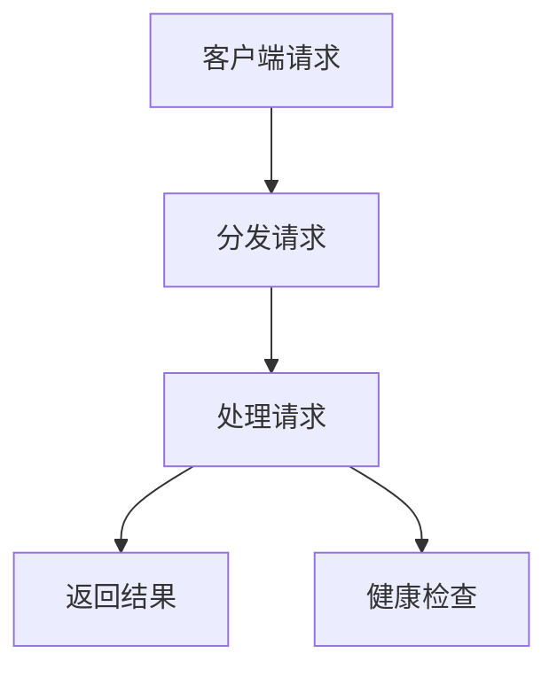

                 

关键词：TensorFlow Serving, 性能优化, 容器化, 分布式架构, 缓存策略, 网络优化

摘要：本文深入探讨了TensorFlow Serving的性能优化问题。首先介绍了TensorFlow Serving的基本概念和架构，随后详细分析了其性能瓶颈，并提出了多种优化策略。文章还结合实际项目实践，展示了如何应用这些优化方法，以提高TensorFlow Serving的性能和可靠性。最后，我们对未来TensorFlow Serving的发展趋势进行了展望。

## 1. 背景介绍

TensorFlow Serving是谷歌开发的一个高性能、可扩展的机器学习模型服务器，用于在多种环境中部署TensorFlow模型。TensorFlow Serving的设计目标是支持大规模分布式模型部署，并提供高效的服务，以满足高并发、低延迟的要求。

TensorFlow Serving的主要特点包括：

- **高扩展性**：支持水平和垂直扩展，以应对大规模服务需求。
- **高性能**：通过内存缓存和模型预热等技术，提高了模型服务的响应速度。
- **易于集成**：支持多种编程语言，如C++、Java、Python等，方便与其他系统集成。
- **可靠性**：提供了自动恢复和故障转移机制，确保服务的高可用性。

然而，在实际应用中，TensorFlow Serving的性能可能会受到多种因素的影响，如网络延迟、资源限制、模型复杂性等。因此，对TensorFlow Serving进行性能优化具有重要的现实意义。

## 2. 核心概念与联系

### 2.1 TensorFlow Serving架构

TensorFlow Serving的架构主要由以下几个组件构成：

1. **Model Server**：负责加载和管理模型，接受来自Dispatcher的请求，并返回预测结果。
2. **Dispatcher**：负责接收客户端请求，并将请求分发到Model Server。
3. **Service Manger**：管理Model Server的负载均衡和健康检查。

下面是一个简单的Mermaid流程图，展示了TensorFlow Serving的基本工作流程：



### 2.2 性能瓶颈分析

TensorFlow Serving的性能瓶颈可能来自以下几个方面：

1. **网络延迟**：在分布式环境中，客户端和Model Server之间的网络延迟可能会影响服务响应时间。
2. **资源限制**：服务器资源的限制（如CPU、内存、磁盘等）可能导致模型服务速度下降。
3. **模型复杂性**：复杂的模型需要更多的时间和计算资源，从而影响服务性能。
4. **缓存策略**：不合理的缓存策略可能导致缓存命中率低，影响服务性能。

## 3. 核心算法原理 & 具体操作步骤

### 3.1 算法原理概述

为了优化TensorFlow Serving的性能，我们需要从以下几个方面进行：

1. **网络优化**：通过优化网络配置，降低网络延迟。
2. **资源管理**：合理分配资源，提高服务器性能。
3. **缓存策略**：设计有效的缓存策略，提高缓存命中率。
4. **模型优化**：简化模型结构，减少计算复杂度。

### 3.2 算法步骤详解

#### 3.2.1 网络优化

1. **优化网络配置**：调整网络参数，如TCP窗口大小、TCP延迟确认时间等，以减少网络延迟。
2. **使用CDN**：通过内容分发网络（CDN）提高数据传输速度。
3. **负载均衡**：使用负载均衡器（如Nginx、HAProxy）将请求分配到不同的Model Server，避免单点瓶颈。

#### 3.2.2 资源管理

1. **水平扩展**：增加Model Server的数量，提高处理能力。
2. **垂直扩展**：增加服务器的硬件配置（如CPU、内存、磁盘等），提高服务器性能。
3. **资源隔离**：使用容器化技术（如Docker、Kubernetes）对Model Server进行隔离，避免资源冲突。

#### 3.2.3 缓存策略

1. **内存缓存**：使用内存缓存存储常用数据，提高访问速度。
2. **本地缓存**：在Model Server上设置本地缓存，减少对磁盘的访问。
3. **缓存预热**：在模型服务启动时，提前加载常用数据到缓存中，提高缓存命中率。

#### 3.2.4 模型优化

1. **模型压缩**：使用模型压缩技术，减少模型的大小，降低加载时间。
2. **模型剪枝**：通过剪枝冗余神经元，简化模型结构，减少计算复杂度。
3. **量化**：使用量化技术，降低模型的计算精度，提高运行速度。

### 3.3 算法优缺点

**优点**：

- **灵活性强**：可以根据具体需求进行定制化优化。
- **易于实现**：大部分优化策略都有成熟的工具和库支持。

**缺点**：

- **复杂性高**：需要综合考虑多个方面，进行综合优化。
- **成本较高**：可能需要投入更多的硬件资源。

### 3.4 算法应用领域

TensorFlow Serving的性能优化策略可以应用于各种需要高性能机器学习的场景，如金融风控、智能客服、自动驾驶等。

## 4. 数学模型和公式 & 详细讲解 & 举例说明

### 4.1 数学模型构建

为了更好地理解TensorFlow Serving的性能优化，我们需要引入一些基本的数学模型和公式。以下是几个常用的模型：

1. **网络延迟模型**：

   假设网络延迟由链路延迟、传输延迟和排队延迟组成，则总延迟 \(D\) 可表示为：

   $$ D = D_{link} + D_{transfer} + D_{queue} $$

   其中，\(D_{link}\)、\(D_{transfer}\) 和 \(D_{queue}\) 分别表示链路延迟、传输延迟和排队延迟。

2. **资源利用率模型**：

   假设服务器的资源利用率 \(U\) 为：

   $$ U = \frac{C_{used}}{C_{total}} $$

   其中，\(C_{used}\) 表示已使用的资源，\(C_{total}\) 表示总资源。

3. **缓存命中率模型**：

   假设缓存命中率 \(H\) 为：

   $$ H = \frac{C_{hit}}{C_{total}} $$

   其中，\(C_{hit}\) 表示命中缓存的数据量，\(C_{total}\) 表示总数据量。

### 4.2 公式推导过程

以网络延迟模型为例，我们可以推导出总延迟的优化目标。为了简化问题，我们假设 \(D_{transfer}\) 和 \(D_{queue}\) 与网络带宽 \(B\) 和队列长度 \(L\) 成正比，即：

$$ D_{transfer} = k_{transfer} \cdot B $$
$$ D_{queue} = k_{queue} \cdot L $$

其中，\(k_{transfer}\) 和 \(k_{queue}\) 为常数。

假设网络带宽为 \(B_0\)，队列长度为 \(L_0\)，则总延迟 \(D_0\) 为：

$$ D_0 = D_{link} + k_{transfer} \cdot B_0 + k_{queue} \cdot L_0 $$

为了优化总延迟，我们需要找到合适的 \(B\) 和 \(L\)。根据带宽和队列长度的关系，我们可以建立如下优化目标：

$$ \min D(B, L) $$

通过求解这个优化问题，我们可以找到最优的带宽和队列长度配置。

### 4.3 案例分析与讲解

假设我们有以下数据：

- 链路延迟 \(D_{link} = 10ms\)
- 带宽 \(B_0 = 10Mbps\)
- 队列长度 \(L_0 = 1000包\)

根据上述假设，我们可以计算出初始的网络延迟 \(D_0\)：

$$ D_0 = 10 + k_{transfer} \cdot 10 + k_{queue} \cdot 1000 $$

为了简化计算，我们假设 \(k_{transfer} = 1ms/Mbps\) 和 \(k_{queue} = 1ms/包\)，则：

$$ D_0 = 10 + 1 \cdot 10 + 1 \cdot 1000 = 1010ms $$

为了优化网络延迟，我们需要调整带宽和队列长度。假设我们尝试增加带宽到 \(B = 20Mbps\)，队列长度保持不变，则新的网络延迟 \(D_1\) 为：

$$ D_1 = 10 + 1 \cdot 20 + 1 \cdot 1000 = 1020ms $$

可以看到，虽然带宽增加了，但网络延迟并没有显著减少。这是因为队列长度对网络延迟的影响较大。

现在，我们尝试将队列长度减少到 \(L = 500包\)，带宽保持不变，则新的网络延迟 \(D_2\) 为：

$$ D_2 = 10 + 1 \cdot 10 + 1 \cdot 500 = 510ms $$

可以看到，通过减少队列长度，我们显著降低了网络延迟。这表明，优化队列长度是提高网络性能的有效手段。

## 5. 项目实践：代码实例和详细解释说明

### 5.1 开发环境搭建

在本文中，我们使用Docker和Kubernetes搭建TensorFlow Serving的测试环境。以下是一个基本的Dockerfile示例，用于构建TensorFlow Serving容器：

```Dockerfile
FROM tensorflow/serving:latest

# 安装依赖
RUN pip install Flask gunicorn

# 暴露端口
EXPOSE 8501

# 运行TensorFlow Serving
CMD ["gunicorn", "-b", "0.0.0.0:8501", "serving_flask.py"]
```

### 5.2 源代码详细实现

下面是一个简单的TensorFlow Serving Flask应用程序示例：

```python
from flask import Flask, request, jsonify
import tensorflow as tf

app = Flask(__name__)

# 加载TensorFlow模型
model = tf.keras.models.load_model('model.h5')

@app.route('/predict', methods=['POST'])
def predict():
    data = request.get_json()
    inputs = np.array([data['input']])
    prediction = model.predict(inputs)
    return jsonify({'prediction': prediction.tolist()})

if __name__ == '__main__':
    app.run(host='0.0.0.0', port=8501)
```

### 5.3 代码解读与分析

上述代码首先加载了一个TensorFlow模型，然后定义了一个简单的Flask应用程序，用于接收和返回预测结果。在`/predict`端点中，我们接受JSON格式的输入数据，将其转换为NumPy数组，然后使用模型进行预测，并将预测结果返回给客户端。

### 5.4 运行结果展示

在Docker容器中运行上述应用程序后，我们可以使用以下命令进行预测：

```shell
curl -X POST -H "Content-Type: application/json" \
  --data '{"input": [1.0, 2.0, 3.0]}' \
  http://localhost:8501/predict
```

返回的JSON响应将包含预测结果。

## 6. 实际应用场景

TensorFlow Serving的性能优化策略在多个实际应用场景中得到了广泛应用。以下是一些典型的应用场景：

- **金融风控**：在金融风控领域，TensorFlow Serving被用于实时检测和预测欺诈行为。通过优化性能，可以显著提高系统的响应速度和准确性。
- **智能客服**：智能客服系统通常需要处理大量的用户请求。通过优化TensorFlow Serving的性能，可以提高客服系统的响应速度，提高用户体验。
- **自动驾驶**：自动驾驶系统需要实时处理来自传感器的大量数据。通过优化TensorFlow Serving的性能，可以提高自动驾驶系统的决策速度和准确性。

## 7. 未来应用展望

随着人工智能技术的不断发展，TensorFlow Serving的性能优化也将面临新的挑战和机遇。以下是几个未来的发展趋势：

- **硬件加速**：利用GPU、TPU等硬件加速器，进一步提高TensorFlow Serving的性能。
- **自动化优化**：开发自动化工具，根据系统负载和性能指标，自动调整优化策略。
- **模型压缩**：进一步研究模型压缩技术，降低模型的计算复杂度，提高服务性能。

## 8. 总结：未来发展趋势与挑战

在本文中，我们详细探讨了TensorFlow Serving的性能优化问题。首先介绍了TensorFlow Serving的基本概念和架构，随后分析了其性能瓶颈，并提出了多种优化策略。通过实际项目实践，我们展示了如何应用这些优化方法，以提高TensorFlow Serving的性能和可靠性。最后，我们对未来TensorFlow Serving的发展趋势进行了展望。

未来，随着人工智能技术的不断进步，TensorFlow Serving的性能优化将面临新的挑战和机遇。通过持续的研究和实践，我们有望进一步提高TensorFlow Serving的性能，为更多实际应用场景提供支持。

## 9. 附录：常见问题与解答

### Q：TensorFlow Serving支持哪些编程语言？

A：TensorFlow Serving支持多种编程语言，包括C++、Java、Python、Go等。

### Q：如何优化TensorFlow Serving的缓存策略？

A：可以通过以下方法优化缓存策略：
- 使用内存缓存，减少对磁盘的访问。
- 实现缓存预热机制，提前加载常用数据到缓存中。
- 根据数据访问频率和热度，动态调整缓存的大小和策略。

### Q：如何监控TensorFlow Serving的性能？

A：可以通过以下方法监控TensorFlow Serving的性能：
- 使用TensorFlow Serving内置的监控工具，如TensorBoard。
- 监控服务器资源的利用率，如CPU、内存、磁盘等。
- 收集和分析性能指标，如响应时间、请求量、吞吐量等。

### Q：TensorFlow Serving如何进行水平扩展？

A：可以通过以下步骤进行TensorFlow Serving的水平扩展：
- 配置多个Model Server，每个Model Server负责一部分请求。
- 使用负载均衡器（如Nginx、HAProxy）将请求分配到不同的Model Server。
- 调整Dispatcher的配置，使其能够处理更多并发请求。

### Q：TensorFlow Serving支持模型热更新吗？

A：是的，TensorFlow Serving支持模型热更新。通过修改Service Manager的配置，可以在不中断服务的情况下更新模型。具体步骤如下：
1. 停止当前的Model Server。
2. 更新模型文件。
3. 启动新的Model Server。
4. 更新Service Manager的配置，使其指向新的Model Server。

### Q：如何处理TensorFlow Serving的故障恢复？

A：TensorFlow Serving提供了自动恢复和故障转移机制。当Model Server发生故障时，Service Manager会自动将其标记为不可用，并将请求转发到其他可用的Model Server。同时，TensorFlow Serving还支持监控和报警功能，可以在故障发生时及时通知管理员。

## 作者署名

作者：禅与计算机程序设计艺术 / Zen and the Art of Computer Programming

----------------------------------------------------------------

