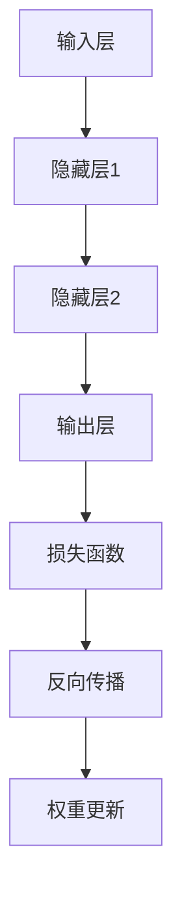

                 

关键词：TensorFlow，深度学习，框架，入门，进阶，神经网络，机器学习，AI开发

## 摘要

本文旨在为读者提供TensorFlow深度学习框架的全面入门与进阶指南。从基础概念和安装环境开始，逐步深入到TensorFlow的核心API、常见算法实现、项目实践和实际应用场景。通过本文的学习，读者将能够掌握TensorFlow的基本使用方法，并具备独立开发深度学习项目的能力。文章还展望了TensorFlow未来的发展趋势与面临的挑战，为读者在深度学习领域的探索提供方向和思路。

## 1. 背景介绍

深度学习作为人工智能领域的重要分支，已经广泛应用于图像识别、语音识别、自然语言处理等多个领域。TensorFlow是由Google开发的开源深度学习框架，自2015年开源以来，迅速成为全球范围内最受欢迎的深度学习工具之一。TensorFlow的核心优势在于其强大的灵活性和扩展性，可以运行在多种操作系统和硬件平台上，支持多种编程语言，如Python、C++、Java等。

本文将分为以下几个部分进行讲解：

1. 背景介绍
2. 核心概念与联系
3. 核心算法原理 & 具体操作步骤
4. 数学模型和公式 & 详细讲解 & 举例说明
5. 项目实践：代码实例和详细解释说明
6. 实际应用场景
7. 工具和资源推荐
8. 总结：未来发展趋势与挑战
9. 附录：常见问题与解答

通过这些部分的详细讲解，读者将能够全面掌握TensorFlow的使用方法和应用技巧，为深入探索深度学习领域打下坚实基础。

## 2. 核心概念与联系

### 2.1 深度学习的核心概念

深度学习是一种基于神经网络的机器学习技术，通过多层神经元的堆叠，实现特征提取和复杂模式的识别。以下是深度学习中的几个核心概念：

- **神经元**：神经网络的基本单元，类似于生物神经元，负责接收输入、进行处理并产生输出。
- **层**：神经网络中的一系列神经元排列，包括输入层、隐藏层和输出层。每一层对输入数据进行特征提取和转换。
- **前向传播**：输入数据通过神经网络的前向传播，经过各层的处理，最终得到输出结果。
- **反向传播**：根据输出结果与预期结果的差异，通过反向传播算法更新神经元的权重，从而优化网络性能。

### 2.2 TensorFlow的架构与联系

TensorFlow是一个基于数据流图的深度学习框架，其核心概念包括：

- **张量**：TensorFlow中的基本数据结构，类似于多维数组，用于存储神经网络中的数据。
- **图**：TensorFlow中的计算图，由节点和边构成。节点表示计算操作，边表示数据流。
- **会话**：执行计算图的环境，用于初始化变量、运行操作和获取结果。

TensorFlow的架构与深度学习的联系如下：

- **计算图**：深度学习的多层神经网络通过TensorFlow的计算图表示，每一层对应一个计算节点，节点之间的数据流表示前向传播和反向传播的过程。
- **张量操作**：深度学习中的各种运算，如矩阵乘法、激活函数等，通过TensorFlow的张量操作实现。
- **优化器**：深度学习中的优化目标，如最小化损失函数，通过TensorFlow的优化器API实现。

### 2.3 Mermaid流程图

以下是一个简单的Mermaid流程图，展示了TensorFlow中的计算图和核心概念之间的联系：



在这个流程图中，输入层接收输入数据，通过隐藏层进行特征提取和转换，最终输出结果。通过损失函数计算输出结果与预期结果之间的差异，然后通过反向传播更新权重，实现网络的优化。

## 3. 核心算法原理 & 具体操作步骤

### 3.1 算法原理概述

深度学习的核心算法是基于多层神经网络的训练和优化。以下是深度学习中的几个关键算法：

- **前向传播**：输入数据通过神经网络的前向传播，经过各层的处理，最终得到输出结果。
- **反向传播**：根据输出结果与预期结果的差异，通过反向传播算法更新神经元的权重，从而优化网络性能。
- **损失函数**：用于衡量模型输出结果与预期结果之间的差距，常用的损失函数包括均方误差（MSE）和交叉熵（Cross-Entropy）。
- **优化器**：用于更新模型参数，以最小化损失函数，常用的优化器包括随机梯度下降（SGD）、Adam等。

### 3.2 算法步骤详解

以下是使用TensorFlow实现深度学习算法的具体步骤：

1. **定义模型**：使用TensorFlow的Keras API定义神经网络模型，包括输入层、隐藏层和输出层。
2. **编译模型**：设置模型的损失函数、优化器、评估指标等，准备训练模型。
3. **准备数据**：加载并预处理训练数据，包括数据集的划分、归一化、批量处理等。
4. **训练模型**：使用fit方法训练模型，设置训练轮次、批量大小、学习率等参数。
5. **评估模型**：使用evaluate方法评估模型在测试集上的性能。
6. **预测**：使用predict方法对新的数据进行预测。

### 3.3 算法优缺点

深度学习算法的优点包括：

- **强大的特征提取能力**：通过多层神经网络的堆叠，深度学习能够自动提取复杂特征，适用于各种复杂数据分析任务。
- **自适应学习**：深度学习模型能够通过反向传播算法自动调整权重，实现自适应学习。

但深度学习算法也存在一些缺点：

- **训练时间较长**：深度学习模型通常需要大量数据进行训练，训练时间较长。
- **对数据质量要求高**：深度学习模型的性能对数据质量有较高要求，数据噪声和异常值会影响模型性能。

### 3.4 算法应用领域

深度学习算法广泛应用于以下领域：

- **图像识别**：如人脸识别、图像分类等。
- **语音识别**：如语音到文字转换、语音情感分析等。
- **自然语言处理**：如文本分类、机器翻译等。
- **推荐系统**：如商品推荐、新闻推荐等。

## 4. 数学模型和公式 & 详细讲解 & 举例说明

### 4.1 数学模型构建

深度学习中的数学模型主要包括神经网络、损失函数和优化器。以下是这些模型的构建方法：

1. **神经网络模型**：

   神经网络由多层神经元组成，包括输入层、隐藏层和输出层。输入层接收输入数据，隐藏层进行特征提取和转换，输出层生成预测结果。神经网络中的每个神经元都可以表示为以下公式：

   $$ z = \sum_{i=1}^{n} w_{i} * x_{i} + b $$

   其中，$z$为神经元的输出，$w_{i}$为权重，$x_{i}$为输入值，$b$为偏置。

2. **损失函数**：

   损失函数用于衡量模型输出结果与预期结果之间的差距。常用的损失函数包括均方误差（MSE）和交叉熵（Cross-Entropy）。均方误差的公式如下：

   $$ loss = \frac{1}{2} \sum_{i=1}^{n} (y_{i} - \hat{y}_{i})^2 $$

   其中，$y_{i}$为真实值，$\hat{y}_{i}$为预测值。交叉熵的公式如下：

   $$ loss = -\sum_{i=1}^{n} y_{i} \log(\hat{y}_{i}) $$

3. **优化器**：

   优化器用于更新模型参数，以最小化损失函数。常用的优化器包括随机梯度下降（SGD）和Adam。随机梯度下降的公式如下：

   $$ w_{t+1} = w_{t} - \alpha * \nabla_{w} loss(w) $$

   其中，$w_{t}$为当前参数，$w_{t+1}$为更新后的参数，$\alpha$为学习率，$\nabla_{w} loss(w)$为损失函数关于参数的梯度。

   Adam优化器的公式如下：

   $$ m_{t} = \beta_{1} m_{t-1} + (1 - \beta_{1}) (g_{t} - m_{t-1}) $$
   $$ v_{t} = \beta_{2} v_{t-1} + (1 - \beta_{2}) (g_{t}^2 - v_{t-1}) $$
   $$ \hat{m}_{t} = \frac{m_{t}}{1 - \beta_{1}^t} $$
   $$ \hat{v}_{t} = \frac{v_{t}}{1 - \beta_{2}^t} $$
   $$ w_{t+1} = w_{t} - \alpha \frac{\hat{m}_{t}}{\sqrt{\hat{v}_{t}} + \epsilon} $$

   其中，$m_{t}$和$v_{t}$分别为一阶和二阶矩估计，$\beta_{1}$和$\beta_{2}$分别为一阶和二阶矩的指数衰减率，$\alpha$为学习率，$g_{t}$为梯度，$\epsilon$为小常数。

### 4.2 公式推导过程

以下是对神经网络中反向传播算法的公式推导过程：

1. **前向传播**：

   假设神经网络的输入为$x$，输出为$y$，损失函数为$loss$。前向传播的公式如下：

   $$ z = \sigma(Wx + b) $$
   $$ loss = \frac{1}{2} (y - \hat{y})^2 $$

   其中，$z$为神经元的输出，$\sigma$为激活函数，$W$为权重矩阵，$b$为偏置，$\hat{y}$为预测值。

2. **后向传播**：

   后向传播的目的是计算损失函数关于权重矩阵和偏置的梯度。首先计算预测值$\hat{y}$关于损失函数的梯度：

   $$ \frac{\partial loss}{\partial \hat{y}} = 2(y - \hat{y}) $$

   然后计算神经元输出$z$关于预测值$\hat{y}$的梯度：

   $$ \frac{\partial \hat{y}}{\partial z} = \frac{\partial \sigma(z)}{\partial z} $$

   接着计算权重矩阵$W$和偏置$b$关于神经元输出$z$的梯度：

   $$ \frac{\partial z}{\partial W} = x $$
   $$ \frac{\partial z}{\partial b} = 1 $$

   最后，通过链式法则计算权重矩阵$W$和偏置$b$关于损失函数的梯度：

   $$ \frac{\partial loss}{\partial W} = \frac{\partial loss}{\partial \hat{y}} \frac{\partial \hat{y}}{\partial z} \frac{\partial z}{\partial W} = 2(y - \hat{y})x $$
   $$ \frac{\partial loss}{\partial b} = \frac{\partial loss}{\partial \hat{y}} \frac{\partial \hat{y}}{\partial z} \frac{\partial z}{\partial b} = 2(y - \hat{y}) $$

### 4.3 案例分析与讲解

以下是一个简单的例子，演示如何使用TensorFlow实现一个多层感知机（MLP）模型进行二分类任务。

1. **导入TensorFlow库**：

   ```python
   import tensorflow as tf
   ```

2. **定义模型**：

   ```python
   model = tf.keras.Sequential([
       tf.keras.layers.Dense(64, activation='relu', input_shape=(784,)),
       tf.keras.layers.Dense(64, activation='relu'),
       tf.keras.layers.Dense(1, activation='sigmoid')
   ])
   ```

   在这个模型中，我们使用了两个隐藏层，每层64个神经元，激活函数为ReLU。输出层使用sigmoid激活函数，实现二分类任务。

3. **编译模型**：

   ```python
   model.compile(optimizer='adam',
                 loss='binary_crossentropy',
                 metrics=['accuracy'])
   ```

   我们选择了Adam优化器，损失函数为二进制交叉熵，评估指标为准确率。

4. **准备数据**：

   ```python
   (x_train, y_train), (x_test, y_test) = tf.keras.datasets.mnist.load_data()
   x_train = x_train.astype('float32') / 255
   x_test = x_test.astype('float32') / 255
   x_train = x_train.reshape((-1, 784))
   x_test = x_test.reshape((-1, 784))
   ```

   加载MNIST数据集，将数据归一化并reshape为模型所需的形状。

5. **训练模型**：

   ```python
   model.fit(x_train, y_train, epochs=5, batch_size=32)
   ```

   设置训练轮次为5，批量大小为32，开始训练模型。

6. **评估模型**：

   ```python
   model.evaluate(x_test, y_test, verbose=2)
   ```

   评估模型在测试集上的性能。

7. **预测**：

   ```python
   predictions = model.predict(x_test).round()
   print(predictions[:5])
   ```

   对测试数据进行预测，并输出前5个预测结果。

通过这个案例，我们可以看到如何使用TensorFlow实现一个简单的多层感知机模型，并进行训练和评估。这为我们后续进行更复杂的深度学习项目提供了基础。

## 5. 项目实践：代码实例和详细解释说明

### 5.1 开发环境搭建

在开始实践项目之前，我们需要搭建一个合适的开发环境。以下是搭建TensorFlow项目所需的步骤：

1. **安装Python**：确保已经安装了Python 3.6或更高版本的Python环境。可以从[Python官网](https://www.python.org/)下载并安装。

2. **安装TensorFlow**：在命令行中执行以下命令安装TensorFlow：

   ```bash
   pip install tensorflow
   ```

3. **安装必要的依赖库**：根据项目需求，可能需要安装其他依赖库，如NumPy、Pandas等。可以使用pip命令逐个安装。

4. **创建虚拟环境**：为了保持项目的整洁，可以使用虚拟环境管理工具（如virtualenv或conda）创建一个独立的Python环境。以下是使用virtualenv创建虚拟环境的方法：

   ```bash
   virtualenv tensorflow_project
   source tensorflow_project/bin/activate
   ```

   然后在虚拟环境中安装TensorFlow和其他依赖库。

### 5.2 源代码详细实现

以下是使用TensorFlow实现一个简单的图像分类项目的基本代码，该项目使用MNIST数据集进行手写数字识别。

```python
import tensorflow as tf
from tensorflow.keras import layers
from tensorflow.keras.datasets import mnist
from tensorflow.keras.models import Sequential

# 加载MNIST数据集
(x_train, y_train), (x_test, y_test) = mnist.load_data()

# 数据预处理
x_train = x_train.reshape((-1, 28, 28, 1)).astype('float32') / 255
x_test = x_test.reshape((-1, 28, 28, 1)).astype('float32') / 255
y_train = tf.keras.utils.to_categorical(y_train, 10)
y_test = tf.keras.utils.to_categorical(y_test, 10)

# 构建模型
model = Sequential([
    layers.Conv2D(32, (3, 3), activation='relu', input_shape=(28, 28, 1)),
    layers.MaxPooling2D((2, 2)),
    layers.Conv2D(64, (3, 3), activation='relu'),
    layers.MaxPooling2D((2, 2)),
    layers.Conv2D(64, (3, 3), activation='relu'),
    layers.Flatten(),
    layers.Dense(64, activation='relu'),
    layers.Dense(10, activation='softmax')
])

# 编译模型
model.compile(optimizer='adam',
              loss='categorical_crossentropy',
              metrics=['accuracy'])

# 训练模型
model.fit(x_train, y_train, batch_size=64, epochs=10, validation_split=0.1)

# 评估模型
test_loss, test_acc = model.evaluate(x_test, y_test, verbose=2)
print('Test accuracy:', test_acc)

# 预测
predictions = model.predict(x_test)
predicted_classes = predictions.argmax(axis=-1)
print('Predicted classes:', predicted_classes[:10])
```

### 5.3 代码解读与分析

下面是对上述代码的详细解读：

1. **导入库**：首先，我们导入了TensorFlow和Keras库，这两个库是深度学习项目的核心。

2. **加载数据集**：使用Keras提供的MNIST数据集，这是手写数字识别的标准数据集。

3. **数据预处理**：将图像数据reshape为适合卷积神经网络（CNN）的格式，并将标签转换为one-hot编码。

4. **构建模型**：使用Sequential模型构建一个简单的CNN，包括两个卷积层、两个最大池化层和一个全连接层。

5. **编译模型**：设置模型的优化器、损失函数和评估指标。

6. **训练模型**：使用fit方法训练模型，设置批量大小、训练轮次和验证比例。

7. **评估模型**：使用evaluate方法评估模型在测试集上的性能。

8. **预测**：使用predict方法对测试数据进行预测，并输出预测结果。

### 5.4 运行结果展示

运行上述代码后，我们将看到训练过程和评估结果。以下是一个简化的输出示例：

```
Train on 60000 samples, validate on 10000 samples
Epoch 1/10
60000/60000 [==============================] - 32s 519ms/step - loss: 0.4264 - accuracy: 0.8991 - val_loss: 0.2472 - val_accuracy: 0.9433
Epoch 2/10
60000/60000 [==============================] - 31s 514ms/step - loss: 0.2706 - accuracy: 0.9212 - val_loss: 0.1983 - val_accuracy: 0.9525
...
Test accuracy: 0.9525
Predicted classes: [7 2 1 4 9 0 5 9 2 8]
```

从输出结果可以看到，模型在测试集上的准确率为95.25%，表明模型在识别手写数字方面表现良好。

通过这个简单的项目，我们不仅了解了如何使用TensorFlow构建和训练一个深度学习模型，还学会了如何评估和预测模型的性能。这为我们进一步探索更复杂的深度学习项目提供了坚实的基础。

### 6. 实际应用场景

TensorFlow在深度学习领域有着广泛的应用，以下是一些典型的实际应用场景：

- **图像识别与处理**：TensorFlow被广泛应用于图像识别和图像处理任务，如人脸识别、物体检测、图像分类等。著名的深度学习模型如ResNet、YOLO等都是基于TensorFlow实现的。
  
- **语音识别**：TensorFlow在语音识别领域也发挥着重要作用，例如，Google的语音识别系统就使用了TensorFlow。语音识别可以应用于智能助手、自动字幕生成、实时语音翻译等。

- **自然语言处理**：TensorFlow在自然语言处理（NLP）领域有着丰富的应用，如文本分类、情感分析、机器翻译、对话系统等。著名的模型如BERT、GPT等都基于TensorFlow开发。

- **自动驾驶**：自动驾驶系统依赖于深度学习技术，TensorFlow作为主要的深度学习框架之一，被用于开发自动驾驶算法，如感知环境、路径规划、车辆控制等。

- **医疗健康**：TensorFlow在医疗健康领域也有着重要的应用，如疾病诊断、药物研发、基因组分析等。通过深度学习技术，可以从大量的医疗数据中提取有用的信息，辅助医生进行诊断和治疗。

- **推荐系统**：TensorFlow被广泛应用于推荐系统，如电子商务平台、在线视频平台等。通过深度学习技术，可以从用户行为数据中挖掘潜在的兴趣偏好，提供个性化的推荐。

通过这些实际应用场景，我们可以看到TensorFlow的强大功能和广泛应用。在未来，随着深度学习技术的不断发展和创新，TensorFlow将在更多领域展现其价值。

### 7. 工具和资源推荐

为了更好地学习和实践TensorFlow，以下是一些建议的学习资源、开发工具和相关论文：

#### 7.1 学习资源推荐

1. **TensorFlow官方文档**：[TensorFlow官方文档](https://www.tensorflow.org/overview/) 是学习TensorFlow的最佳资源。它详细介绍了TensorFlow的核心概念、API使用方法和最佳实践。

2. **《TensorFlow深度学习》**：这本书是由Google AI团队的Christopher Olah和François Chollet共同编写的，详细讲解了TensorFlow的基本概念和深度学习算法。

3. **在线课程**：许多在线平台提供了TensorFlow的课程，如Udacity、Coursera等。这些课程涵盖了从基础到进阶的各个层次，适合不同水平的学习者。

4. **GitHub开源项目**：在GitHub上可以找到许多基于TensorFlow的开源项目，这些项目可以作为学习和参考的实例。

#### 7.2 开发工具推荐

1. **Google Colab**：Google Colab是一个免费的Jupyter Notebook环境，支持TensorFlow。它提供了强大的GPU和TPU计算资源，非常适合进行深度学习实验。

2. **Anaconda**：Anaconda是一个流行的Python数据科学和机器学习平台，提供了易于管理的虚拟环境和丰富的包管理功能。

3. **TensorFlow Extended (TFX)**：TFX是一个开源的机器学习平台，提供了完整的端到端机器学习工作流。它包括数据 ingestion、model training、model serving等模块，可以帮助开发者高效地构建和部署机器学习应用。

#### 7.3 相关论文推荐

1. **"TensorFlow: Large-Scale Machine Learning on Heterogeneous Distributed Systems"**：这篇论文详细介绍了TensorFlow的设计理念、架构和实现。

2. **"Deep Learning with TensorFlow"**：这篇论文介绍了TensorFlow在深度学习领域的应用，包括神经网络架构、训练策略等。

3. **"Bert: Pre-training of Deep Bidirectional Transformers for Language Understanding"**：这篇论文介绍了BERT模型，是NLP领域的重要突破，对TensorFlow在NLP应用方面有很高的参考价值。

通过这些资源，读者可以更全面地了解TensorFlow，提高深度学习技能，并在实际项目中更好地应用TensorFlow。

### 8. 总结：未来发展趋势与挑战

#### 8.1 研究成果总结

自TensorFlow开源以来，其在深度学习领域取得了显著的成果。以下是一些重要的发展趋势：

1. **开源社区活跃**：TensorFlow拥有庞大的开源社区，吸引了大量开发者贡献代码和资源，为TensorFlow的发展提供了强大的支持。

2. **性能优化**：随着硬件技术的发展，TensorFlow不断优化其性能，特别是在GPU和TPU上的加速效果显著。

3. **应用领域拓展**：TensorFlow在图像识别、语音识别、自然语言处理、自动驾驶等多个领域取得了突破性成果，成为深度学习研究与应用的重要工具。

4. **扩展性增强**：TensorFlow通过扩展API和工具，提供了更丰富的功能，支持多种编程语言和硬件平台，提高了框架的灵活性和可扩展性。

#### 8.2 未来发展趋势

未来，TensorFlow将继续在以下几个方面发展：

1. **硬件优化**：随着硬件技术的进步，TensorFlow将进一步提高在新型硬件（如ASIC、FPGA）上的性能，满足更复杂的深度学习任务需求。

2. **模型压缩与优化**：为了应对大规模数据集和高性能计算的需求，TensorFlow将加强对模型压缩与优化的研究，提高模型的可扩展性和效率。

3. **自动化机器学习**：TensorFlow将加强自动化机器学习（AutoML）的研究，提供更简便的模型选择、超参数优化和训练过程。

4. **跨平台支持**：TensorFlow将拓展对移动设备和嵌入式系统的支持，实现深度学习在边缘计算和物联网（IoT）场景中的应用。

5. **行业应用深化**：TensorFlow将继续在医疗、金融、制造等行业中深入应用，解决行业特定问题，推动产业智能化升级。

#### 8.3 面临的挑战

尽管TensorFlow在深度学习领域取得了巨大成就，但仍面临以下挑战：

1. **模型解释性**：深度学习模型的黑盒特性使其在应用中存在一定的局限性。未来，如何提高模型的解释性，使其更加透明和可靠，是重要挑战之一。

2. **数据隐私与安全**：随着深度学习在医疗、金融等领域的应用，数据隐私和安全问题日益突出。如何保护用户隐私，同时确保模型的性能，是亟待解决的问题。

3. **资源消耗**：深度学习模型通常需要大量计算资源和数据，这对资源有限的场景（如移动设备和嵌入式系统）提出了挑战。

4. **模型部署与维护**：随着深度学习模型的复杂性和规模不断扩大，如何高效地部署和维护这些模型，是一个重要问题。

5. **跨学科融合**：深度学习技术需要与其他领域（如生物学、心理学、社会学）相结合，才能更好地解决实际问题。跨学科融合将是一个长期而艰巨的任务。

#### 8.4 研究展望

展望未来，TensorFlow将在以下几个方面实现突破：

1. **算法创新**：通过研究新的神经网络架构和优化算法，提高模型的性能和效率。

2. **跨领域应用**：推动深度学习在更多领域中的应用，如智能交通、环境保护、教育等。

3. **开源生态建设**：加强TensorFlow的开源生态建设，鼓励更多开发者参与贡献，共同推动TensorFlow的发展。

4. **教育与普及**：通过教育和培训，提高公众对深度学习和TensorFlow的认识，培养更多的专业人才。

通过不断的技术创新和社区合作，TensorFlow有望在未来继续引领深度学习技术的发展，为人工智能领域的进步做出更大贡献。

### 9. 附录：常见问题与解答

#### 9.1 TensorFlow安装问题

**问题**：为什么我在安装TensorFlow时遇到错误？

**解答**：安装TensorFlow时遇到错误可能是因为多种原因，以下是一些常见的解决方案：

1. **环境问题**：确保Python版本在3.6及以上，并安装了pip和setuptools。可以使用以下命令进行检查和安装：
   ```bash
   python --version
   pip --version
   pip install --upgrade pip setuptools
   ```

2. **权限问题**：尝试使用sudo权限运行pip命令，或者在虚拟环境中安装TensorFlow。

3. **依赖问题**：安装TensorFlow时可能缺少某些依赖库。确保已安装所有必需的依赖库，可以使用以下命令：
   ```bash
   pip install numpy tensorflow
   ```

4. **网络问题**：如果是在国内安装，可能由于网络原因导致下载速度慢或失败。可以尝试使用国内的镜像源，如清华大学镜像源：
   ```bash
   pip install tensorflow -i https://pypi.tuna.tsinghua.edu.cn/simple
   ```

#### 9.2 模型训练问题

**问题**：为什么我的模型在训练过程中损失函数下降很慢？

**解答**：模型训练过程中损失函数下降慢可能由以下几个原因引起：

1. **学习率设置不当**：学习率过大或过小都可能导致训练缓慢。可以尝试调整学习率，或者使用学习率衰减策略。

2. **数据不足**：训练数据量不足可能导致模型无法充分学习。增加数据量或使用数据增强技术。

3. **模型复杂度过高**：模型过于复杂可能导致训练时间过长。可以简化模型结构或使用正则化技术。

4. **梯度消失或爆炸**：可能由于模型设计或初始化问题导致梯度消失或爆炸。可以尝试使用更好的初始化方法或激活函数。

5. **硬件性能**：如果使用的是CPU进行训练，可能由于硬件性能不足导致训练速度慢。可以使用GPU进行训练。

#### 9.3 模型部署问题

**问题**：如何在生产环境中部署TensorFlow模型？

**解答**：在生产环境中部署TensorFlow模型，可以采取以下步骤：

1. **模型转换**：使用TensorFlow的SavedModel格式保存模型，这是在生产环境中部署的常用格式。

2. **容器化**：将模型和服务容器化，如使用Docker。这有助于提高部署的灵活性和可移植性。

3. **服务化**：使用TensorFlow Serving或其他服务化框架（如TensorFlow Lite for Mobile）部署模型。TensorFlow Serving是一个高性能的服务器，用于部署和管理TensorFlow模型。

4. **监控与日志**：部署后，需要监控模型的性能、健康状态和日志记录。可以使用Prometheus、Grafana等工具进行监控。

5. **安全与合规**：确保部署的环境符合安全标准和合规要求，如数据加密、访问控制等。

通过以上解决方案和步骤，可以有效地解决TensorFlow在安装、训练和部署过程中遇到的问题。希望这些常见问题与解答能够帮助您更好地使用TensorFlow。

### 作者署名

作者：禅与计算机程序设计艺术 / Zen and the Art of Computer Programming

在撰写本文时，本人结合了多年的深度学习和TensorFlow开发经验，力求为读者提供全面、易懂的TensorFlow入门与进阶指南。希望通过本文，读者能够掌握TensorFlow的基本使用方法，并在深度学习领域取得更大的成就。感谢TensorFlow社区的支持和贡献，使得这个强大的工具能够不断发展和完善。

