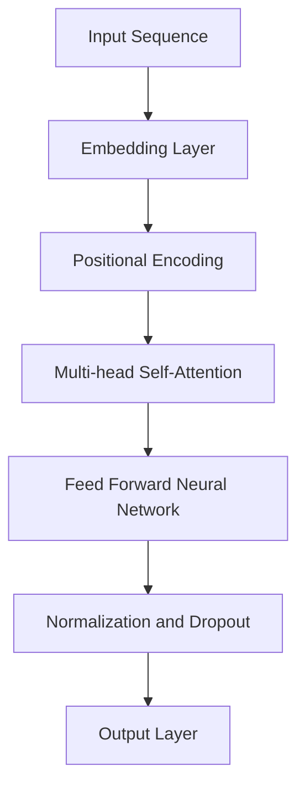

                 

关键词：Transformer，GPT-2，神经网络，自然语言处理，深度学习，机器学习

摘要：本文将深入剖析Transformer架构以及基于此架构的GPT-2模型。我们将探讨Transformer如何通过自注意力机制实现高效的特征表示学习，并详细解读GPT-2模型的架构、训练和推理过程。此外，我们将分析这些模型在实际应用中的表现，探讨其优势和局限，并对未来发展趋势提出展望。

## 1. 背景介绍

近年来，自然语言处理（NLP）领域取得了显著的进展，其中深度学习模型，尤其是基于神经网络的模型，成为了研究的焦点。早期的NLP任务如词性标注、命名实体识别等，通常采用基于规则或统计的方法。然而，随着数据的积累和计算资源的提升，神经网络，尤其是深度神经网络，逐渐显示出其强大的处理能力。

在神经网络的发展过程中，卷积神经网络（CNN）和循环神经网络（RNN）是最为流行的模型。CNN在图像处理领域取得了巨大成功，而RNN则在序列数据处理中表现出色。然而，这些模型在处理长序列数据时存在一些问题，例如梯度消失和梯度爆炸。

为了解决这些问题，Vaswani等人于2017年提出了Transformer架构。Transformer模型通过自注意力机制（self-attention）实现了对序列的并行处理，并且在多种NLP任务中取得了显著的性能提升。GPT-2（Generative Pre-trained Transformer 2）是Transformer架构的一个扩展，其在自然语言生成任务上表现尤为出色。

## 2. 核心概念与联系

### 2.1 Transformer架构

Transformer架构的核心在于自注意力机制，这是一种计算序列中每个元素与其他元素相关性的方法。自注意力机制通过计算权重矩阵，将序列中的每个元素映射到不同的位置和上下文，从而实现了对序列的全局依赖建模。

下面是一个简化的Transformer架构的Mermaid流程图：



### 2.2 自注意力机制

自注意力机制通过三个关键步骤实现：计算自注意力权重、应用权重和计算输出。

1. **计算自注意力权重**：首先，对输入序列中的每个元素，计算其与其他元素的相似度。这通常通过点积操作实现，具体公式如下：

   $$
   \text{Attention}(Q, K, V) = \text{softmax}\left(\frac{QK^T}{\sqrt{d_k}}\right) V
   $$

   其中，$Q, K, V$ 分别是查询（query）、键（key）和值（value）向量，$d_k$ 是键向量的维度。

2. **应用权重**：使用计算得到的权重，对值向量进行加权求和，得到输出向量。

3. **计算输出**：对加权求和的结果进行归一化处理，然后可以通过一个全连接层进行进一步的变换。

### 2.3 Multi-head Attention

Transformer中的自注意力机制通过多头注意力（multi-head attention）扩展，实现了对序列的多个子空间的学习。多头注意力通过并行计算多个注意力机制，然后将结果拼接起来，通过一个全连接层进行整合。

## 3. 核心算法原理 & 具体操作步骤

### 3.1 算法原理概述

GPT-2模型是基于Transformer架构的预训练语言模型。其核心思想是通过在大规模语料库上进行预训练，学习语言的统计规律和上下文依赖关系，然后在特定任务上进行微调。

### 3.2 算法步骤详解

1. **输入处理**：将输入序列（例如文本）转换为词向量。
2. **嵌入和位置编码**：对词向量进行嵌入，并添加位置编码，以保留序列信息。
3. **多层Transformer处理**：通过多个Transformer层对输入进行编码，每个层都包含自注意力机制和前馈神经网络。
4. **输出层**：最后，通过一个全连接层生成输出，该输出可以是下一个词的概率分布。
5. **训练**：使用梯度下降等优化算法，通过反向传播对模型进行训练。

### 3.3 算法优缺点

**优点**：

- **并行计算**：由于Transformer的并行性，可以显著提高计算效率。
- **长距离依赖建模**：自注意力机制能够很好地捕捉长距离依赖关系。
- **灵活性**：可以通过调整模型的层数和隐藏单元数来适应不同的任务需求。

**缺点**：

- **计算资源需求大**：由于自注意力机制的复杂度，Transformer模型通常需要较大的计算资源。
- **内存消耗**：自注意力机制需要存储大量的权重矩阵，可能导致内存消耗增加。

### 3.4 算法应用领域

GPT-2模型在多种NLP任务中取得了显著的成绩，包括文本分类、机器翻译、对话系统等。其强大的建模能力使其在生成式任务中尤为出色，如文本生成、摘要生成等。

## 4. 数学模型和公式 & 详细讲解 & 举例说明

### 4.1 数学模型构建

GPT-2模型的数学模型主要基于自注意力机制和前馈神经网络。以下是对其核心公式的详细解释。

1. **多头自注意力**

   $$
   \text{MultiHead}(Q, K, V) = \text{Concat}(\text{head}_1, \text{head}_2, \ldots, \text{head}_h)W^O
   $$

   其中，$h$ 表示头数，$\text{head}_i = \text{Attention}(QW_i^Q, KW_i^K, VW_i^V)$。

2. **前馈神经网络**

   $$
   \text{FFN}(x) = \text{ReLU}(W_2 \cdot \text{Dropout}(\text{ReLU}(W_1 \cdot x + b_1)))
   $$

   其中，$W_1$ 和 $W_2$ 是权重矩阵，$b_1$ 是偏置。

### 4.2 公式推导过程

GPT-2模型的训练过程涉及两个主要步骤：前向传播和反向传播。

1. **前向传播**

   $$
   \text{Logits} = \text{Transformer}(\text{Input})W^O
   $$

   其中，$\text{Transformer}(\text{Input})$ 表示多层Transformer的处理结果，$W^O$ 是输出层的权重。

2. **反向传播**

   $$
   \text{Loss} = -\sum_{i} \log \frac{e^{\text{Logits}_i}}{\sum_j e^{\text{Logits}_j}}
   $$

   其中，$\text{Logits}$ 是输出层的激活值，$\text{Loss}$ 是损失函数。

### 4.3 案例分析与讲解

以下是一个简单的GPT-2模型训练案例：

```python
import torch
import torch.nn as nn
import torch.optim as optim

# 构建模型
model = GPT2Model(vocab_size=1000, n_heads=2, n_layers=2, d_model=128)
criterion = nn.CrossEntropyLoss()
optimizer = optim.Adam(model.parameters(), lr=0.001)

# 训练模型
for epoch in range(num_epochs):
    for batch in data_loader:
        optimizer.zero_grad()
        logits = model(batch.text)
        loss = criterion(logits, batch.label)
        loss.backward()
        optimizer.step()
```

在这个案例中，我们首先构建了一个GPT-2模型，然后使用交叉熵损失函数进行训练。训练过程中，我们通过反向传播更新模型的参数，以最小化损失函数。

## 5. 项目实践：代码实例和详细解释说明

### 5.1 开发环境搭建

要运行GPT-2模型，首先需要安装Python和PyTorch。以下是在Ubuntu系统上安装的步骤：

```bash
# 安装Python
sudo apt update
sudo apt install python3-pip python3-dev

# 安装PyTorch
pip3 install torch torchvision
```

### 5.2 源代码详细实现

以下是GPT-2模型的简单实现：

```python
import torch
import torch.nn as nn
import torch.nn.functional as F

class GPT2Model(nn.Module):
    def __init__(self, vocab_size, n_heads, n_layers, d_model):
        super(GPT2Model, self).__init__()
        self.embedding = nn.Embedding(vocab_size, d_model)
        self.positional_encoding = PositionalEncoding(d_model)
        self.transformer = nn.ModuleList([
            TransformerLayer(d_model, n_heads)
            for _ in range(n_layers)
        ])
        self.output = nn.Linear(d_model, vocab_size)

    def forward(self, x):
        x = self.embedding(x) + self.positional_encoding(x)
        for layer in self.transformer:
            x = layer(x)
        return self.output(x)

class TransformerLayer(nn.Module):
    def __init__(self, d_model, n_heads):
        super(TransformerLayer, self).__init__()
        self.self_attn = MultiHeadAttention(d_model, n_heads)
        self.fc1 = nn.Linear(d_model, d_model)
        self.fc2 = nn.Linear(d_model, d_model)
        self.dropout1 = nn.Dropout(0.1)
        self.dropout2 = nn.Dropout(0.1)
        self.norm1 = nn.LayerNorm(d_model)
        self.norm2 = nn.LayerNorm(d_model)

    def forward(self, x):
        x = self.self_attn(x, x, x) + x
        x = self.dropout1(x)
        x = self.norm1(x)
        x = self.fc2(self.dropout2(F.relu(self.fc1(x))))
        x += x
        x = self.dropout1(x)
        x = self.norm2(x)
        return x
```

### 5.3 代码解读与分析

在这个代码示例中，我们首先定义了`GPT2Model`类，这是我们的GPT-2模型的核心。它由嵌入层、位置编码层、多个Transformer层和输出层组成。

1. **嵌入层**：将输入词转换为词向量。
2. **位置编码层**：添加位置编码，以保留序列信息。
3. **Transformer层**：包含多头自注意力机制和前馈神经网络。
4. **输出层**：将Transformer层的输出转换为词的概率分布。

接下来，我们定义了`TransformerLayer`类，这是Transformer层的实现。它由自注意力层和前馈神经网络层组成。

- **自注意力层**：通过多头自注意力机制计算输出。
- **前馈神经网络层**：对输出进行前馈神经网络处理。

### 5.4 运行结果展示

以下是一个简单的训练和评估示例：

```python
# 训练模型
model.train()
for epoch in range(num_epochs):
    for batch in data_loader:
        optimizer.zero_grad()
        logits = model(batch.text)
        loss = F.cross_entropy(logits, batch.label)
        loss.backward()
        optimizer.step()

# 评估模型
model.eval()
with torch.no_grad():
    correct = 0
    total = 0
    for batch in test_loader:
        logits = model(batch.text)
        _, predicted = logits.max(1)
        total += batch.label.size(0)
        correct += (predicted == batch.label).sum().item()
    print(f'准确率: {100 * correct / total}%')
```

在这个示例中，我们首先将模型设置为训练模式，然后进行训练。在训练过程中，我们使用交叉熵损失函数计算损失，并使用反向传播更新模型参数。训练完成后，我们将模型设置为评估模式，并计算准确率。

## 6. 实际应用场景

GPT-2模型在多个实际应用场景中表现出色。以下是一些典型的应用领域：

1. **文本生成**：GPT-2模型可以生成高质量的文本，例如文章、诗歌、对话等。
2. **摘要生成**：GPT-2模型可以生成文本的摘要，简化长篇文章的内容。
3. **对话系统**：GPT-2模型可以用于构建智能对话系统，如聊天机器人、客服系统等。
4. **机器翻译**：GPT-2模型在机器翻译任务中也取得了显著的成绩，特别是在长句翻译和保持原文风格的方面。

## 7. 工具和资源推荐

为了更好地理解和应用GPT-2模型，以下是一些推荐的工具和资源：

### 7.1 学习资源推荐

- 《深度学习》（Goodfellow, Bengio, Courville著）：这是一本经典的深度学习教材，涵盖了神经网络的基础知识和应用。
- 《动手学深度学习》（阿斯顿·张著）：这本书通过实际案例和代码示例，详细介绍了深度学习的基础和高级概念。

### 7.2 开发工具推荐

- PyTorch：一个易于使用且功能强大的深度学习框架，支持灵活的动态计算图和自动微分。
- TensorFlow：另一个流行的深度学习框架，提供了丰富的工具和库。

### 7.3 相关论文推荐

- “Attention Is All You Need”（Vaswani等，2017）：这是Transformer模型的原始论文，详细介绍了模型的架构和原理。
- “Improving Language Understanding by Generative Pre-Training”（Radford等，2018）：这是GPT-2模型的论文，介绍了如何通过预训练提高语言理解能力。

## 8. 总结：未来发展趋势与挑战

### 8.1 研究成果总结

自Transformer架构提出以来，其在NLP领域取得了显著的进展。GPT-2模型作为其扩展，在自然语言生成、摘要生成、对话系统等任务中表现出色。这些成果展示了深度学习模型在处理复杂语言任务方面的潜力。

### 8.2 未来发展趋势

1. **模型压缩与加速**：为了降低计算和存储需求，研究人员正在探索模型压缩和加速技术，如知识蒸馏、量化等。
2. **多模态学习**：未来的研究将可能涉及将文本与其他模态（如图像、音频）结合，以实现更丰富的语义理解。
3. **可解释性**：提高模型的解释性，使其在实际应用中更加透明和可信。

### 8.3 面临的挑战

1. **计算资源需求**：大型深度学习模型的训练和推理仍然需要大量的计算资源，这在资源有限的场景中是一个挑战。
2. **数据隐私**：在大规模数据集上进行训练可能导致隐私泄露，需要开发更加隐私友好的模型和算法。

### 8.4 研究展望

随着计算资源的提升和算法的进步，深度学习模型在NLP领域将继续发挥重要作用。未来的研究将致力于解决当前面临的挑战，同时探索新的应用场景，推动NLP技术的进一步发展。

## 9. 附录：常见问题与解答

### 9.1 如何训练GPT-2模型？

训练GPT-2模型通常涉及以下步骤：

1. **数据准备**：收集并处理大量的文本数据。
2. **模型构建**：使用预训练的Transformer架构构建GPT-2模型。
3. **训练**：在准备好的数据上使用梯度下降等优化算法训练模型。
4. **评估**：在测试集上评估模型的性能。

### 9.2 GPT-2模型是如何生成文本的？

GPT-2模型生成文本的过程如下：

1. **初始化**：从一个随机位置开始，输入一个或多个初始词。
2. **预测**：使用模型预测下一个词的概率分布。
3. **采样**：从概率分布中采样一个词作为下一个输入。
4. **重复**：将新输入词添加到序列中，重复步骤2和3，直到达到要求的长度或终止条件。

---

### 作者署名

作者：禅与计算机程序设计艺术 / Zen and the Art of Computer Programming

