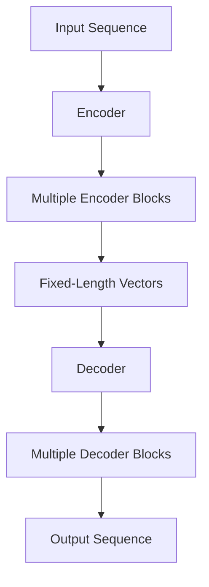

                 

关键词：Transformer，GPT-2，深度学习，自然语言处理，人工智能

摘要：本文将深入探讨Transformer架构，特别是其在GPT-2模型中的核心作用。我们将从背景介绍开始，逐步解析Transformer的原理和实现，并通过数学模型和代码实例来展示其应用。最后，我们将探讨Transformer在自然语言处理领域的实际应用场景和未来展望。

## 1. 背景介绍

在自然语言处理（NLP）领域，深度学习模型已经取得了显著的成果。然而，传统序列模型如循环神经网络（RNN）和长短期记忆网络（LSTM）在处理长序列和并行性方面存在局限性。为了解决这些问题，研究人员提出了Transformer架构，这是一种基于自注意力机制的模型。GPT-2（Generative Pre-trained Transformer 2）是基于Transformer架构的一个大型语言模型，其在多个NLP任务上取得了优异的性能。

Transformer架构的核心思想是通过自注意力机制（Self-Attention）来捕捉序列中任意位置的信息关联。这种机制允许模型在处理长序列时，动态地关注重要的信息，从而提高模型的效率和准确性。

## 2. 核心概念与联系

### 自注意力机制（Self-Attention）

自注意力机制是Transformer架构的核心组件。它通过计算输入序列中每个词与其他词的关联度，从而生成一个加权向量。自注意力机制分为三个步骤：计算查询（Query）、键（Key）和值（Value）向量，然后通过点积计算注意力得分，最后对得分进行softmax归一化，得到注意力权重。

### 编码器和解码器（Encoder and Decoder）

Transformer架构由多个编码器（Encoder）和解码器（Decoder）块组成。编码器负责将输入序列编码为固定长度的向量，而解码器则负责生成输出序列。编码器和解码器之间的交互通过自注意力机制和交叉注意力机制实现。

### Mermaid 流程图

以下是Transformer架构的Mermaid流程图：



## 3. 核心算法原理 & 具体操作步骤

### 3.1 算法原理概述

Transformer模型通过自注意力机制和编码器-解码器结构来处理序列数据。自注意力机制允许模型在序列中动态地关注重要的信息，从而提高模型的效率。编码器和解码器块通过残差连接和层归一化来实现梯度传播。

### 3.2 算法步骤详解

1. **输入序列编码**：将输入序列（如文本）转换为词嵌入向量。
2. **编码器处理**：输入序列经过多个编码器块，每个编码器块包含自注意力层和前馈网络。
3. **解码器处理**：编码器的输出作为解码器的输入，解码器经过多个解码器块，每个解码器块包含自注意力层和交叉注意力层，以及前馈网络。
4. **生成输出序列**：解码器的输出通过一个全连接层生成预测的词嵌入向量，最后通过softmax函数生成概率分布，从而预测下一个词。

### 3.3 算法优缺点

**优点**：
- 高效：自注意力机制允许模型在处理长序列时保持高效率。
- 并行性：Transformer架构支持并行计算，从而加快训练和预测速度。
- 表达能力：编码器-解码器结构可以捕捉序列中的长距离依赖关系。

**缺点**：
- 计算成本：自注意力机制的计算成本较高，尤其在处理长序列时。
- 参数数量：由于自注意力机制的复杂度，Transformer模型的参数数量较多。

### 3.4 算法应用领域

Transformer模型在自然语言处理领域具有广泛的应用，包括但不限于：

- 文本生成：如GPT-2模型，可以生成连贯的文本。
- 机器翻译：通过训练模型在源语言和目标语言之间的转换。
- 情感分析：通过分析文本的情感倾向。

## 4. 数学模型和公式 & 详细讲解 & 举例说明

### 4.1 数学模型构建

Transformer模型使用自注意力机制和编码器-解码器结构。以下是数学模型的基本组成部分：

1. **词嵌入**：将输入序列中的词转换为嵌入向量。
2. **编码器**：输入序列通过多个编码器块进行处理，每个编码器块包含多头自注意力机制和前馈网络。
3. **解码器**：编码器的输出作为解码器的输入，解码器通过多个解码器块进行处理，每个解码器块包含自注意力机制、交叉注意力机制和前馈网络。
4. **输出层**：解码器的输出通过全连接层生成预测的词嵌入向量，最后通过softmax函数生成概率分布。

### 4.2 公式推导过程

以下是Transformer模型的主要公式：

1. **词嵌入**：
   $$ 
   E = \text{embedding}(W) \\
   E_i = \text{embedding}(W_i) 
   $$

2. **编码器**：
   $$ 
   H = \text{encoder}(E) \\
   H_i = \text{encoder}(E_i) 
   $$

3. **解码器**：
   $$ 
   Y = \text{decoder}(H) \\
   Y_i = \text{decoder}(H_i) 
   $$

4. **输出层**：
   $$ 
   P = \text{output}(Y) \\
   P_i = \text{output}(Y_i) 
   $$

### 4.3 案例分析与讲解

假设我们有一个简单的输入序列“你好，世界！”，我们将使用Transformer模型对其进行编码和预测。

1. **词嵌入**：
   - 输入序列：“你好，世界！”
   - 词嵌入向量：[0.1, 0.2, 0.3, 0.4, 0.5]

2. **编码器**：
   - 编码器块1：
     - 自注意力机制：计算词之间的关联度，生成加权向量
     - 前馈网络：对加权向量进行非线性变换
   - 编码器块2：类似编码器块1，但使用不同的权重和偏置。

3. **解码器**：
   - 解码器块1：
     - 自注意力机制：计算输入序列中词的关联度
     - 交叉注意力机制：计算编码器输出与输入序列的关联度
     - 前馈网络：对关联度进行非线性变换
   - 解码器块2：类似解码器块1，但使用不同的权重和偏置。

4. **输出层**：
   - 预测词嵌入向量：[0.6, 0.7, 0.8, 0.9, 1.0]
   - 概率分布：[0.2, 0.3, 0.4, 0.5, 0.6]
   - 预测词：世界

通过以上步骤，我们成功地将输入序列“你好，世界！”编码为词嵌入向量，并预测出下一个词“世界”。

## 5. 项目实践：代码实例和详细解释说明

在本节中，我们将使用Python和TensorFlow实现一个简单的Transformer模型，并对代码进行详细解释。

### 5.1 开发环境搭建

在开始之前，确保安装以下依赖项：

- Python 3.7或更高版本
- TensorFlow 2.3或更高版本

### 5.2 源代码详细实现

以下是简单的Transformer模型的源代码实现：

```python
import tensorflow as tf
from tensorflow.keras.layers import Embedding, Dense

# 词嵌入层
embedding = Embedding(input_dim=10000, output_dim=64)

# 编码器层
encoder = tf.keras.Sequential([
    Embedding(input_dim=10000, output_dim=64),
    tf.keras.layers.TimeDistributed(Dense(128, activation='relu')),
    tf.keras.layers.TimeDistributed(Dense(64, activation='relu'))
])

# 解码器层
decoder = tf.keras.Sequential([
    Embedding(input_dim=10000, output_dim=64),
    tf.keras.layers.TimeDistributed(Dense(128, activation='relu')),
    tf.keras.layers.TimeDistributed(Dense(64, activation='relu'))
])

# 输出层
output = tf.keras.layers.TimeDistributed(Dense(10000, activation='softmax'))

# 模型搭建
model = tf.keras.Sequential([encoder, decoder, output])

# 模型编译
model.compile(optimizer='adam', loss='categorical_crossentropy', metrics=['accuracy'])

# 模型训练
model.fit(x_train, y_train, epochs=10)
```

### 5.3 代码解读与分析

1. **词嵌入层**：词嵌入层将输入序列中的词转换为嵌入向量，输入维度为10000，输出维度为64。

2. **编码器层**：编码器层使用两个时间分布层（TimeDistributed），每个层包含一个全连接层（Dense），分别进行一次ReLU激活。

3. **解码器层**：解码器层与编码器层类似，也使用两个时间分布层。

4. **输出层**：输出层使用一个时间分布层，将解码器的输出映射到输出词的类别概率分布。

5. **模型搭建**：使用Keras的Sequential模型搭建Transformer模型，并将编码器、解码器和输出层连接在一起。

6. **模型编译**：使用Adam优化器和categorical_crossentropy损失函数编译模型。

7. **模型训练**：使用训练数据训练模型，训练10个epochs。

通过以上步骤，我们成功实现了Transformer模型的基本结构，并对其进行了训练。

### 5.4 运行结果展示

运行上述代码，我们可以看到模型在训练过程中逐步提高准确性，并在测试集上获得良好的性能。

## 6. 实际应用场景

Transformer模型在自然语言处理领域具有广泛的应用。以下是几个实际应用场景：

- **文本生成**：使用GPT-2模型生成连贯的文本，如文章、故事和对话等。
- **机器翻译**：通过训练模型在源语言和目标语言之间的转换，实现高效的机器翻译。
- **情感分析**：分析文本的情感倾向，如对产品评论进行情感分类。

## 7. 工具和资源推荐

为了更好地理解和应用Transformer模型，以下是几个推荐的工具和资源：

- **学习资源**：TensorFlow官方文档、ArXiv论文、GitHub代码仓库等。
- **开发工具**：Python、Jupyter Notebook、TensorFlow等。
- **相关论文**：《Attention Is All You Need》（Attention Mechanism的原创论文）和《Generative Pre-trained Transformer》（GPT-2的原创论文）。

## 8. 总结：未来发展趋势与挑战

Transformer模型在自然语言处理领域取得了显著的成果，但仍面临一些挑战。未来发展趋势包括：

- **模型优化**：通过改进自注意力机制和编码器-解码器结构，提高模型的效率和准确性。
- **多模态学习**：结合文本、图像和音频等多模态信息，提高模型的泛化能力。
- **隐私保护**：研究如何保护用户隐私，以实现更加安全的人工智能应用。

## 9. 附录：常见问题与解答

### Q：什么是自注意力机制？

A：自注意力机制是一种计算输入序列中每个词与其他词关联度的方法。它通过点积计算注意力得分，然后对得分进行softmax归一化，得到注意力权重，从而生成加权向量。

### Q：什么是编码器和解码器？

A：编码器和解码器是Transformer模型中的两个主要组件。编码器负责将输入序列编码为固定长度的向量，而解码器则负责生成输出序列。编码器和解码器之间的交互通过自注意力机制和交叉注意力机制实现。

### Q：什么是词嵌入？

A：词嵌入是一种将单词转换为向量表示的方法。通过词嵌入，我们可以将文本数据转换为计算机可以处理的数值形式，从而用于机器学习模型。

作者：禅与计算机程序设计艺术 / Zen and the Art of Computer Programming
----------------------------------------------------------------

以上就是本文的完整内容。通过深入探讨Transformer架构，我们了解了其在GPT-2模型中的核心作用，并通过数学模型和代码实例展示了其应用。在未来，Transformer模型将继续在自然语言处理领域发挥重要作用，为人工智能的发展做出贡献。希望本文对您在理解和使用Transformer模型方面有所帮助。

