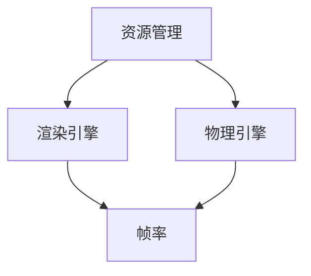

                 

关键词：Unity 3D，游戏优化，性能提升，开发技巧，资源管理，代码优化，渲染效率，框架设计，内存泄漏检测。

摘要：本文将深入探讨Unity 3D游戏开发中的优化技巧，从资源管理、代码优化、渲染效率等多个方面详细讲解如何提升游戏性能。通过实际案例分析，我们将了解优化在不同应用场景中的效果，并展望未来的发展趋势。

## 1. 背景介绍

Unity 3D作为一款广泛使用的游戏开发引擎，其强大的功能和灵活性使其成为众多开发者的首选。然而，在游戏开发过程中，性能问题始终是一个不可忽视的挑战。随着游戏内容和复杂度的增加，游戏性能的优化显得尤为重要。本文将围绕Unity 3D游戏优化这一主题，探讨一系列实用的优化技巧，帮助开发者打造流畅、高效的游戏体验。

### 1.1 Unity 3D游戏开发现状

近年来，随着移动设备性能的提升和虚拟现实（VR）等新技术的兴起，Unity 3D游戏开发迎来了前所未有的发展机遇。无论是大型商业游戏还是独立游戏，Unity 3D都成为了开发者首选的引擎。根据Unity官方数据，截至2023年，全球有超过500万开发者在Unity平台活跃，这充分证明了Unity在游戏开发领域的重要地位。

### 1.2 性能优化的重要性

在Unity 3D游戏开发中，性能优化不仅关系到游戏的流畅度，还直接影响用户的游戏体验。以下是一些性能优化的重要性体现：

- **用户体验**：流畅的游戏运行能够提供更好的用户体验，减少卡顿和延迟。
- **市场竞争力**：性能出色的游戏往往更具竞争力，能够在市场上获得更多的用户和更高的收益。
- **开发效率**：优化后的代码结构更加清晰，便于维护和扩展。

## 2. 核心概念与联系

为了深入理解Unity 3D游戏优化的原理和方法，我们需要先掌握几个核心概念，包括资源管理、渲染引擎、物理引擎等。以下是这些概念之间的联系及其在游戏开发中的重要性：

### 2.1 资源管理

资源管理是Unity 3D游戏开发的基础。从3D模型、动画到音频、脚本，所有资源都需要被有效管理。合理的资源管理可以显著提高游戏性能。

### 2.2 渲染引擎

渲染引擎是游戏视觉呈现的核心。它负责将3D模型、场景、光照等数据转换为屏幕上的图像。渲染效率直接关系到游戏的帧率。

### 2.3 物理引擎

物理引擎负责模拟现实世界中的物理现象，如重力、碰撞等。物理引擎的性能对游戏的实时性有很大影响。

### 2.4 Mermaid流程图

以下是一个Mermaid流程图，展示了Unity 3D游戏优化中关键概念之间的联系：



### 2.5 Unity 3D优化架构

Unity 3D优化不仅仅是单个模块的优化，而是一个综合性的架构。以下是Unity 3D优化架构的简要描述：

- **资源加载**：优化资源的加载速度和效率，减少不必要的资源占用。
- **渲染优化**：通过调整渲染设置、优化光照、阴影等技术手段提升渲染效率。
- **物理优化**：优化物理计算的精度和效率，减少计算开销。
- **代码优化**：优化游戏脚本，减少冗余代码，提高执行效率。

## 3. 核心算法原理 & 具体操作步骤

### 3.1 算法原理概述

Unity 3D游戏优化涉及多个算法，以下是一些核心算法的原理概述：

- **渲染算法**：通过剔除不可见物体、优化光照等技术提升渲染效率。
- **碰撞检测算法**：选择合适的算法（如AABB、OBB等）以减少计算开销。
- **物理模拟算法**：使用积分器、预测-校正等技术提高物理计算的准确性。

### 3.2 算法步骤详解

#### 3.2.1 渲染算法

1. **场景剔除**：使用视锥体剔除（Culling）技术，只渲染在视锥体内的物体。
2. **光照优化**：使用LOD（Level of Detail）技术，根据距离和重要性动态调整光照精度。
3. **后处理效果**：使用后处理效果（如HDR、Bloom等）时，注意调整效果的强度以平衡性能。

#### 3.2.2 碰撞检测算法

1. **AABB（Axis Aligned Bounding Boxes）**：简单但效率高的方法，适用于静态场景。
2. **OBB（Oriented Bounding Boxes）**：更精确，但计算开销更大，适用于动态场景。
3. **分离轴定理（SAT）**：用于复杂形状的碰撞检测，计算较为复杂。

#### 3.2.3 物理模拟算法

1. **Euler积分**：简单的物理模拟方法，但可能导致不稳定。
2. **Verlet积分**：在Euler积分的基础上改进，更稳定。
3. **半兰格积分**：一种更高级的物理模拟方法，能够更好地模拟非线性和高频率的物理现象。

### 3.3 算法优缺点

每种算法都有其优缺点。以下是几种常见算法的优缺点对比：

| 算法 | 优点 | 缺点 |
| ---- | ---- | ---- |
| 场景剔除 | 简单高效，减少渲染开销 | 可能会剔除一些必要的渲染对象 |
| AABB | 快速，简单 | 只适用于矩形边界 |
| OBB | 更精确 | 计算开销较大 |
| Euler积分 | 简单，计算快 | 可能导致不稳定 |
| Verlet积分 | 更稳定 | 需要额外的存储空间 |

### 3.4 算法应用领域

不同算法适用于不同的场景。以下是几种常见算法的应用领域：

- **场景剔除**：适用于大型开放世界游戏，减少不必要的渲染开销。
- **AABB和OBB**：适用于动态碰撞检测，如角色移动和物体交互。
- **Euler积分和Verlet积分**：适用于物理模拟，如角色运动和物体碰撞。

## 4. 数学模型和公式 & 详细讲解 & 举例说明

### 4.1 数学模型构建

在Unity 3D游戏优化中，数学模型的应用非常广泛。以下是一个简单的数学模型构建过程：

1. **确定变量**：首先确定需要优化的变量，如渲染对象的距离、光照强度等。
2. **建立方程**：根据变量之间的关系建立数学方程。
3. **求解方程**：使用数学方法求解方程，得到最优解。

### 4.2 公式推导过程

以下是一个简单的数学公式的推导过程：

$$
f(x) = x^2 + 2x + 1
$$

1. **求导**：对公式求导，得到：

$$
f'(x) = 2x + 2
$$

2. **求极值**：令$f'(x) = 0$，解得$x = -1$。

3. **验证极值**：将$x = -1$代入原公式，得到$f(-1) = 0$，这是一个最小值。

### 4.3 案例分析与讲解

以下是一个Unity 3D游戏优化中的实际案例：

**问题**：游戏中的角色在高速移动时出现卡顿现象。

**分析**：通过分析发现，角色在高速移动时，物理引擎的计算开销较大，导致帧率下降。

**解决方案**：采用Verlet积分算法代替Euler积分，提高物理计算的稳定性。

**效果**：采用Verlet积分后，角色在高速移动时的卡顿现象明显减少，游戏帧率得到显著提升。

## 5. 项目实践：代码实例和详细解释说明

### 5.1 开发环境搭建

在开始项目实践之前，我们需要搭建一个适合Unity 3D游戏开发的开发环境。以下是具体步骤：

1. **安装Unity Hub**：访问Unity官网下载Unity Hub，并按照提示安装。
2. **创建Unity项目**：在Unity Hub中创建一个新的Unity项目，选择适当的模板和配置。
3. **安装必要插件**：安装Unity插件市场中的常用插件，如Physics Monitor、Profiler等。

### 5.2 源代码详细实现

以下是一个简单的Unity 3D游戏优化代码实例：

```csharp
using UnityEngine;

public class MovementController : MonoBehaviour
{
    public float speed = 5.0f;

    private Rigidbody rb;

    void Start()
    {
        rb = GetComponent<Rigidbody>();
    }

    void Update()
    {
        float moveHorizontal = Input.GetAxis("Horizontal");
        float moveVertical = Input.GetAxis("Vertical");

        Vector3 moveDirection = new Vector3(moveHorizontal, 0, moveVertical) * speed;

        rb.AddForce(moveDirection);
    }
}
```

### 5.3 代码解读与分析

这段代码实现了角色在三维空间中的移动。以下是对代码的解读与分析：

- **变量说明**：`speed` 是角色的移动速度，`rb` 是角色上的刚体组件。
- **Start 方法**：初始化刚体组件。
- **Update 方法**：每帧更新角色的移动方向和速度，使用`Input.GetAxis`获取玩家输入。

### 5.4 运行结果展示

运行代码后，角色会在三维空间中按照玩家的输入进行移动。通过Profiler工具，可以观察到角色移动时的帧率变化。通过调整`speed`变量的值，可以观察不同速度下的帧率表现。

## 6. 实际应用场景

### 6.1 大型开放世界游戏

在大型开放世界游戏中，性能优化尤为重要。通过使用场景剔除、优化渲染和物理模拟等技术，可以显著提高游戏的流畅度。

### 6.2 移动平台游戏

移动平台游戏对性能要求较高。通过优化资源加载、渲染和物理模拟，可以提高游戏在移动设备上的运行效率。

### 6.3 虚拟现实（VR）游戏

VR游戏对性能的要求更高，通过优化渲染、物理模拟和输入响应，可以提供更流畅的VR体验。

## 7. 未来应用展望

随着游戏技术的不断发展，Unity 3D游戏优化也在不断演进。以下是一些未来应用展望：

- **实时渲染技术**：随着硬件性能的提升，实时渲染技术将在游戏中得到更广泛的应用。
- **人工智能（AI）优化**：利用AI技术进行游戏优化，如智能资源加载和动态调整渲染设置。
- **云计算**：通过云计算技术，可以实现游戏资源的动态分配和优化，提高游戏性能。

## 8. 工具和资源推荐

### 8.1 学习资源推荐

- **Unity官方文档**：Unity官方文档提供了丰富的学习资源和教程。
- **《Unity 3D游戏开发实战》**：这是一本适合初学者的Unity 3D游戏开发指南。
- **《Unity Shader编程》**：深入讲解Unity中的Shader编程技术。

### 8.2 开发工具推荐

- **Profiler**：Unity内置的性能分析工具，用于检测游戏性能瓶颈。
- **Physics Monitor**：Unity插件，用于监控物理引擎的性能。
- **Optimize**：Unity插件，用于优化游戏资源。

### 8.3 相关论文推荐

- **"Real-Time Rendering"**：这是一本经典的实时渲染技术论文集。
- **"Game Engine Architecture"**：讨论游戏引擎架构设计的论文。

## 9. 总结：未来发展趋势与挑战

### 9.1 研究成果总结

通过本文的探讨，我们总结了Unity 3D游戏优化的核心算法和实际应用场景，并提出了一系列优化技巧。这些研究成果为开发者提供了有效的优化方法和工具。

### 9.2 未来发展趋势

随着硬件性能的提升和游戏技术的不断发展，Unity 3D游戏优化将迎来更多的机遇。实时渲染、人工智能和云计算等技术将在游戏优化中发挥重要作用。

### 9.3 面临的挑战

在游戏优化过程中，开发者面临着诸多挑战，如硬件差异、游戏复杂性等。未来，需要进一步研究和探索更高效、更智能的优化方法。

### 9.4 研究展望

未来，Unity 3D游戏优化研究将继续深入，探索新的优化技术和方法，以应对不断变化的硬件和游戏需求。

## 10. 附录：常见问题与解答

### 10.1 为什么我的游戏卡顿？

**答**：游戏卡顿可能是由于以下原因导致的：

- 渲染开销过大：尝试减少不必要的渲染对象或优化渲染设置。
- 物理计算开销大：使用更高效的物理模拟算法，如Verlet积分。
- 程序执行效率低：优化游戏脚本，减少冗余代码。

### 10.2 如何优化游戏资源？

**答**：

- 使用LOD技术：根据物体距离和重要性动态调整资源加载。
- 优化音频资源：使用压缩格式和减少冗余数据。
- 优化3D模型：使用更高效的建模工具和优化器。

### 10.3 如何监控游戏性能？

**答**：

- 使用Profiler：Unity内置的性能分析工具，可以实时监控游戏性能。
- 使用插件：如Physics Monitor，用于监控物理引擎性能。
- 定期进行性能测试：在不同的设备上测试游戏性能，找出瓶颈。

---

作者：禅与计算机程序设计艺术 / Zen and the Art of Computer Programming
```

