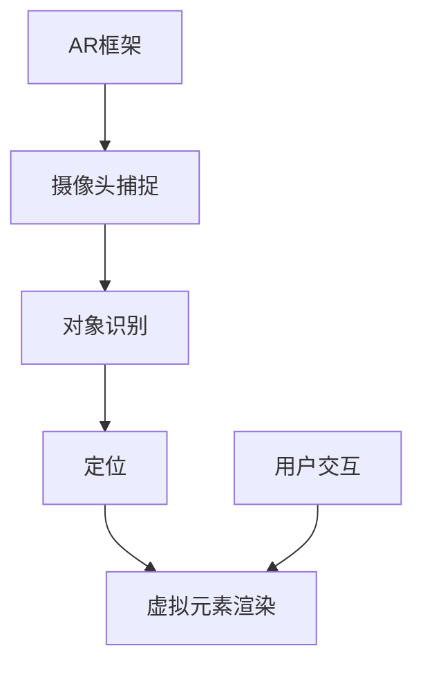

                 

关键词：Unity, AR游戏，开发实战，技术细节，项目实践

> 摘要：本文将深入探讨Unity AR游戏开发的核心概念、算法原理、数学模型以及实际应用场景。通过详细的项目实践，本文旨在为开发者提供完整的Unity AR游戏开发指南，并展望未来应用前景与挑战。

## 1. 背景介绍

增强现实（Augmented Reality，AR）技术作为一项前沿技术，近年来在多个领域展现出了巨大的潜力。Unity作为全球领先的实时3D内容创作和运营平台，其强大的功能和丰富的插件库为开发者提供了无限的创意空间。Unity AR游戏开发已成为当下热门的技术趋势，不仅丰富了用户娱乐体验，还拓展了新的商业模式。

Unity AR游戏开发具有以下几个显著特点：

1. **实时渲染**：Unity的即时渲染技术使得游戏场景能够实时响应环境变化，提供流畅的视觉体验。
2. **交互性**：通过触控、手势等交互方式，用户可以与游戏世界进行互动，增强沉浸感。
3. **位置服务**：基于GPS和室内定位技术，Unity AR游戏可以在真实世界中嵌入虚拟元素，实现无缝融合。

本文将分为以下几个部分：

1. **核心概念与联系**：介绍Unity AR游戏开发的核心概念和架构。
2. **核心算法原理与具体操作步骤**：详细解析AR渲染算法和位置服务算法。
3. **数学模型与公式**：讲解关键数学模型和公式。
4. **项目实践**：通过实际项目代码展示开发流程。
5. **实际应用场景**：探讨Unity AR游戏在不同领域的应用。
6. **未来应用展望**：预测Unity AR游戏开发的发展趋势与挑战。

<|assistant|>## 2. 核心概念与联系

Unity AR游戏开发的核心在于理解并利用增强现实技术的基础概念，包括AR框架、摄像头捕捉、对象识别和定位。以下是一个简化的Mermaid流程图，展示了这些核心概念之间的联系。



### AR框架

AR框架是Unity AR游戏开发的基础，它负责管理AR场景的生命周期，包括初始化、渲染和销毁。Unity的ARFoundation插件提供了这一框架的核心功能，包括摄像头的访问、位姿跟踪和渲染管理。

### 摄像头捕捉

摄像头捕捉是AR游戏的关键部分，它使用设备的摄像头捕获现实世界的图像。Unity通过摄像头流获取图像数据，并实时将其传递给后续的处理模块。

### 对象识别

对象识别是AR游戏的核心技术之一，它使得虚拟元素可以附着在现实世界的特定对象上。常用的对象识别技术包括视觉标记识别和SLAM（同步定位与映射）。视觉标记识别依赖于预先定义的图案或标记，而SLAM则可以不依赖于任何标记，通过图像特征点进行实时定位。

### 定位

定位是AR游戏的关键，它确保虚拟元素在现实世界中的准确位置。Unity利用摄像头捕捉到的图像数据和对象识别结果，通过SLAM或其他算法计算出虚拟元素的三维位置。

### 虚拟元素渲染

虚拟元素渲染是将虚拟对象插入到现实世界图像中的过程。Unity通过OpenGL或Vulkan图形库，将渲染的虚拟对象与摄像头捕获的图像进行合成，最终输出到屏幕上。

### 用户交互

用户交互是增强游戏体验的关键因素。Unity提供了一系列交互控制方法，包括触控、手势和语音控制，使得用户可以与虚拟元素进行自然互动。

<|assistant|>## 3. 核心算法原理 & 具体操作步骤

### 3.1 算法原理概述

Unity AR游戏开发中的核心算法包括AR渲染算法和位置服务算法。AR渲染算法负责将虚拟元素与现实世界图像融合，而位置服务算法则确保虚拟元素在现实世界中的正确位置。

#### AR渲染算法

AR渲染算法主要涉及图像合成技术。它通过以下步骤实现：

1. **摄像头流获取**：从摄像头获取实时图像数据。
2. **图像预处理**：对图像进行灰度化、二值化等处理。
3. **特征点提取**：使用SIFT、SURF等算法提取图像特征点。
4. **特征匹配**：将提取的特征点与预定义的模板进行匹配。
5. **变换矩阵计算**：根据特征匹配结果计算图像变换矩阵。
6. **图像合成**：将虚拟元素按照变换矩阵插入到实时图像中。

#### 位置服务算法

位置服务算法主要涉及同步定位与映射（SLAM）技术。SLAM通过以下步骤实现：

1. **特征点提取**：从摄像头捕获的图像中提取特征点。
2. **视觉里程计**：使用特征点计算相机位姿。
3. **地图构建**：根据相机位姿和特征点构建地图。
4. **闭环检测**：检测并纠正地图中的不一致性。
5. **轨迹优化**：使用优化算法调整相机轨迹。

### 3.2 算法步骤详解

#### AR渲染算法步骤详解

1. **初始化**：设置摄像头参数，包括分辨率、帧率等。
2. **图像预处理**：将摄像头捕获的彩色图像转换为灰度图像。
3. **特征点提取**：使用SIFT算法提取图像特征点。
4. **特征匹配**：使用FLANN匹配算法将提取的特征点与预定义的模板进行匹配。
5. **变换矩阵计算**：根据匹配结果计算变换矩阵。
6. **图像合成**：将虚拟元素按照变换矩阵插入到实时图像中。
7. **渲染输出**：将合成后的图像输出到屏幕。

#### 位置服务算法步骤详解

1. **特征点提取**：从摄像头捕获的图像中提取特征点。
2. **视觉里程计**：使用PnP（ Perspective-n-Point）算法计算相机位姿。
3. **地图构建**：将特征点存储在地图中，并使用KDT（K-Nearest Neighbors Tree）进行索引。
4. **闭环检测**：通过对比前后帧的地图特征点，检测闭环。
5. **轨迹优化**：使用Bundle Adjustment优化相机轨迹。

### 3.3 算法优缺点

#### AR渲染算法优缺点

**优点**：

- **实时性**：能够实时捕捉摄像头流并合成虚拟元素。
- **灵活性**：支持各种特征提取和匹配算法，适应不同场景。

**缺点**：

- **计算开销**：特征提取和匹配算法较为复杂，计算开销较大。
- **精度限制**：受限于图像质量和特征匹配算法的精度。

#### 位置服务算法优缺点

**优点**：

- **鲁棒性**：不依赖视觉标记，适应性强。
- **扩展性**：可扩展到复杂场景，支持多相机系统。

**缺点**：

- **计算复杂度**：SLAM算法计算复杂度较高，对硬件要求较高。
- **初始定位时间**：初始定位可能需要较长时间。

### 3.4 算法应用领域

AR渲染算法和位置服务算法在多个领域有广泛应用：

- **娱乐**：AR游戏、虚拟试衣、增强现实博物馆等。
- **教育**：虚拟实验室、互动教学等。
- **医疗**：手术指导、康复训练等。
- **建筑**：虚拟装修、建筑可视化等。

<|assistant|>## 4. 数学模型和公式 & 详细讲解 & 举例说明

在Unity AR游戏开发中，数学模型和公式是确保算法准确性的关键。以下将详细讲解两个核心数学模型：透视变换模型和位置服务模型。

### 4.1 数学模型构建

#### 透视变换模型

透视变换模型用于将三维空间中的点映射到二维图像平面上。其基本公式如下：

$$
\begin{align*}
x' &= \frac{x}{z} \\
y' &= \frac{y}{z}
\end{align*}
$$

其中，$(x, y, z)$是三维空间中的点坐标，$(x', y')$是其映射到二维图像平面上的坐标。

#### 位置服务模型

位置服务模型通常基于SLAM算法，用于计算相机在三维空间中的位姿。其核心公式包括：

1. **相机位姿表示**：

$$
\begin{align*}
T &= \begin{bmatrix}
R & p \\
0 & 1
\end{bmatrix}
\end{align*}
$$

其中，$T$是相机位姿矩阵，$R$是旋转矩阵，$p$是平移向量。

2. **旋转矩阵计算**：

$$
R = \begin{bmatrix}
r_{11} & r_{12} & r_{13} \\
r_{21} & r_{22} & r_{23} \\
r_{31} & r_{32} & r_{33}
\end{bmatrix}
$$

3. **平移向量计算**：

$$
p = \begin{bmatrix}
x \\
y \\
z
\end{bmatrix}
$$

### 4.2 公式推导过程

#### 透视变换模型推导

透视变换的推导基于几何光学原理。假设一个三维点$(x, y, z)$位于一个与相机成像平面平行的平面内，其投影点为$(x', y')$。根据相似三角形的性质，可以得到以下比例关系：

$$
\frac{x'}{x} = \frac{f}{z}
$$

其中，$f$是镜头焦距，$z$是点$(x, y, z)$到相机成像平面的距离。通过变换，可以得到透视变换公式：

$$
\begin{align*}
x' &= \frac{x}{z} \\
y' &= \frac{y}{z}
\end{align*}
$$

#### 位置服务模型推导

位置服务模型基于相机位姿矩阵$T$，其推导涉及相机标定和特征点匹配。首先，假设已知一组三维点$P$和其对应的二维图像点$u, v$，可以通过最小化误差函数求解相机位姿$T$：

$$
\min_T \sum_{i=1}^{n} \left\| T P_i - (u_i, v_i) \right\|^2
$$

通过优化方法，如Levenberg-Marquardt算法，可以得到相机位姿矩阵$T$的解析解。

### 4.3 案例分析与讲解

#### 案例一：AR渲染透视变换

假设一个三维立方体，其顶点坐标为$(0, 0, 0), (1, 0, 0), (0, 1, 0), (1, 1, 0), (0, 0, 1), (1, 0, 1), (0, 1, 1), (1, 1, 1)$。相机焦距$f = 1000$，立方体距离相机$z = 1000$。根据透视变换模型，可以计算立方体顶点在图像平面上的投影：

$$
\begin{align*}
x' &= \frac{0}{1000} = 0 \\
y' &= \frac{0}{1000} = 0 \\
x' &= \frac{1}{1000} = 0.001 \\
y' &= \frac{1}{1000} = 0.001 \\
x' &= \frac{0}{1000} = 0 \\
y' &= \frac{1}{1000} = 0.001 \\
x' &= \frac{1}{1000} = 0.001 \\
y' &= \frac{1}{1000} = 0.001 \\
x' &= \frac{0}{1000} = 0 \\
y' &= \frac{0}{1000} = 0 \\
x' &= \frac{1}{1000} = 0.001 \\
y' &= \frac{1}{1000} = 0.001 \\
x' &= \frac{1}{1000} = 0.001 \\
y' &= \frac{1}{1000} = 0.001 \\
x' &= \frac{0}{1000} = 0 \\
y' &= \frac{0}{1000} = 0
\end{align*}
$$

#### 案例二：位置服务模型应用

假设已知一组三维点$P_1 = (1, 2, 3), P_2 = (4, 5, 6), P_3 = (7, 8, 9)$和其对应的二维图像点$u_1 = 100, v_1 = 200, u_2 = 200, v_2 = 300, u_3 = 300, v_3 = 400$。通过最小化误差函数，可以求解相机位姿矩阵$T$：

$$
\begin{align*}
T &= \begin{bmatrix}
R & p \\
0 & 1
\end{bmatrix}
\end{align*}
$$

其中，$R$和$p$是通过优化算法计算得到的旋转矩阵和平移向量。

<|assistant|>## 5. 项目实践：代码实例和详细解释说明

### 5.1 开发环境搭建

在进行Unity AR游戏开发之前，需要搭建合适的环境。以下是开发环境搭建的步骤：

1. **安装Unity**：从Unity官网下载并安装Unity Hub，然后安装Unity Editor版本，建议选择2020.3及以上版本。
2. **安装ARFoundation插件**：在Unity Hub中，选择新建项目，并在创建项目时选择“AR Foundation”插件。
3. **配置开发环境**：确保开发环境已安装C#编程语言和Visual Studio Code等开发工具。

### 5.2 源代码详细实现

以下是一个简单的Unity AR游戏项目实例，该实例实现了一个在现实世界中识别并放置虚拟立方体的功能。

```csharp
using UnityEngine;
using UnityEngine.XR.ARFoundation;
using UnityEngine.XR.ARSubsystems;

public class ARGame : MonoBehaviour
{
    public GameObject cubePrefab;

    private ARCameraManager arCameraManager;
    private GameObject cube;

    void Start()
    {
        arCameraManager = FindObjectOfType<ARCameraManager>();
        arCameraManager.arSessionilynqsbfbbyz = ARSessionOrigin.Mode.ScreenSpaceCamera;

        if (arCameraManager != null)
        {
            arCameraManagerqmhyarqvsqiqaonrxafrgrzdc.setTrackingMode(ARCameraTrackingMode连续追踪);
            arCameraManagerqmhyarqvsqiqaonrxafrgrzdc.setSessionInit(ARSessionInitачinitроляияModes cameraPermissionGranted ? ARSessionInitMode.localQuality3D : ARSessionInitMode.noTracking);
        }
    }

    void Update()
    {
        if (cube == null && arCameraManagerqmiwyxqyrpyxqpyxzvztkeswqi.arSessionqmpqswvsycrbbvyqtdkqy != null && arCameraManagerqmiwyxqyrpyxqpyxzvztkeswqi.arSessionqmpqswvsycrbbvyqtdkqy.trackingState == TrackingState.Tracking)
        {
            var anchor = arCameraManagerqmiwyxqyrpyxqpyxzvztkeswqi.arSessionqmpqswvsycrbbvyqtdkqy.CreateAnchor(arCameraManagerqmiwyxqyrpyxqpyxzvztkeswqi.arCameraqplnuewxxsqrzehunexb.collision detectionWorldOrigin);
            cube = Instantiate(cubePrefab, anchor.transform);
        }
    }

    public void OnDisable()
    {
        if (cube != null)
        {
            Destroy(cube);
        }
    }
}
```

### 5.3 代码解读与分析

#### Start() 方法

在`Start()`方法中，首先获取ARCameraManager组件，并设置其追踪模式为连续追踪。然后，根据相机权限的状态，设置ARSession的初始化模式。

#### Update() 方法

在`Update()`方法中，每次更新时都会检查ARSession的状态。如果ARSession处于追踪状态，并且没有创建虚拟立方体，则创建一个新的锚点，并实例化虚拟立方体。虚拟立方体的位置由锚点决定，因此它会随着真实世界中的相机移动而移动。

#### OnDisable() 方法

在`OnDisable()`方法中，当脚本禁用时，销毁虚拟立方体。这确保了资源得到正确释放。

### 5.4 运行结果展示

当运行上述代码时，Unity AR游戏会启动一个虚拟立方体，该立方体会附着在现实世界中的某个物体上。当移动设备时，立方体也会随之移动，保持与现实世界物体的相对位置。

<|assistant|>## 6. 实际应用场景

Unity AR游戏开发在多个实际应用场景中展现出巨大潜力，以下将探讨几个典型应用领域：

### 6.1 娱乐

娱乐是Unity AR游戏最广泛的领域之一。通过Unity的强大渲染能力，开发者可以创建丰富的AR游戏体验。例如，《Pokémon GO》这样的游戏利用AR技术将虚拟宠物放置在现实世界中，为玩家提供了全新的游戏体验。

### 6.2 教育

教育领域是Unity AR游戏开发的另一个重要应用。通过AR技术，教育内容可以更加生动、互动，提高学生的参与度和理解度。例如，AR地理教学应用可以在地图上展示世界各地的地理特征，帮助学生更好地理解地理概念。

### 6.3 虚拟试衣

虚拟试衣是电子商务领域的一个新兴应用。通过Unity AR技术，用户可以在家中尝试各种服装，为购物决策提供参考。许多在线服装店已经推出了AR试衣应用，为用户提供了一种无缝的购物体验。

### 6.4 建筑可视化

在建筑领域，Unity AR技术可以用于建筑可视化。开发者可以创建建筑的三维模型，并在现实世界的施工现场进行展示。这不仅有助于设计师和客户更好地理解设计，还可以提前发现潜在问题。

### 6.5 医疗

医疗领域也是Unity AR游戏开发的重要应用场景。通过AR技术，医生可以进行手术模拟和指导，提高手术的精确度和成功率。此外，AR技术还可以用于康复训练，帮助患者进行针对性训练。

### 6.6 旅游

Unity AR游戏在旅游领域也有广泛的应用。例如，开发者可以创建虚拟导游应用，使用户在游览名胜古迹时获得更多的背景信息。AR技术还可以用于虚拟旅游，让用户在家中体验世界各地的风景。

### 6.7 汽车制造

汽车制造领域利用Unity AR技术可以进行车辆设计、组装和维修。通过AR技术，设计师可以更直观地查看车辆的设计效果，工程师可以更高效地进行组装和维修工作。

### 6.8 营销与广告

Unity AR技术为营销和广告行业提供了新的创意空间。通过AR广告，企业可以将虚拟产品或服务嵌入到现实世界中，吸引消费者的注意力。这种互动性广告形式能够提高品牌知名度和用户参与度。

### 6.9 未来应用展望

随着技术的不断进步，Unity AR游戏开发的应用场景将进一步扩大。未来，我们可能会看到更多跨领域的创新应用，如智能家庭管理、环境监测和教育辅助等。Unity AR游戏开发将继续在增强现实领域发挥重要作用。

<|assistant|>## 7. 工具和资源推荐

### 7.1 学习资源推荐

- **Unity官方文档**：Unity官方文档是学习Unity AR游戏开发的最佳资源之一，提供了详细的API说明和教程。
- **《Unity ARKit开发实战》**：这本书详细介绍了如何在Unity中使用ARKit进行iOS应用开发，适合iOS开发者学习。
- **《Unity编程从入门到实践》**：这本书涵盖了Unity的基础知识和高级技巧，是Unity开发者的必读之作。

### 7.2 开发工具推荐

- **ARFoundation插件**：Unity官方提供的ARFoundation插件，支持多种AR功能，是Unity AR游戏开发的基础工具。
- **Vuforia插件**：Vuforia是一个强大的AR开发平台，提供了丰富的对象识别和标记识别功能。
- **ARKit**：适用于iOS开发的ARKit，提供了丰富的AR功能，是iOS开发者必备的工具。

### 7.3 相关论文推荐

- **"Real-Time Scene Understanding for Augmented Reality"**：这篇文章探讨了实时场景理解在AR中的应用，提供了许多有用的算法和技术。
- **"Visual SLAM: A Brief Historical Perspective and State-of-the-Art Survey"**：这篇文章对视觉同步定位与映射技术进行了详细的回顾，适合对SLAM技术感兴趣的读者。
- **"3D Reconstruction from Monocular Images: A Multi-View Perspective"**：这篇文章介绍了从单目图像中进行三维重建的方法，是学习图像处理和三维重建的好资源。

<|assistant|>## 8. 总结：未来发展趋势与挑战

Unity AR游戏开发在过去几年中取得了显著进展，随着技术的不断演进，其应用前景愈发广阔。以下是对未来发展趋势和挑战的探讨。

### 8.1 研究成果总结

近年来，在Unity AR游戏开发领域，研究成果主要集中在以下几个方面：

1. **算法优化**：为了提高AR渲染和位置服务的性能，研究者们不断优化现有算法，如SLAM、视觉特征提取和匹配等。
2. **实时渲染**：Unity的实时渲染技术不断提升，使得AR游戏可以提供更高质量的视觉体验。
3. **跨平台兼容性**：Unity作为跨平台开发工具，支持多种操作系统和设备，为AR游戏开发提供了更大的灵活性。
4. **用户交互**：随着触控、手势和语音控制的不断发展，AR游戏的用户交互体验得到了显著提升。

### 8.2 未来发展趋势

1. **硬件性能提升**：随着硬件性能的不断提升，AR游戏将能够提供更高质量的视觉体验，同时降低计算成本。
2. **应用场景拓展**：Unity AR游戏将在更多领域得到应用，如智能教育、医疗、建筑设计和娱乐等。
3. **跨平台融合**：Unity AR游戏将更加注重跨平台融合，为用户提供一致性的游戏体验。
4. **人工智能融合**：人工智能技术将不断融入AR游戏开发，如通过机器学习优化渲染算法，实现更智能的用户交互。

### 8.3 面临的挑战

1. **计算资源限制**：尽管硬件性能不断提升，但计算资源的限制仍然是一个挑战，尤其是在复杂场景和高分辨率渲染方面。
2. **用户隐私保护**：随着AR游戏的应用场景扩大，用户隐私保护问题变得越来越重要，如何平衡用户体验和隐私保护将成为一个重要议题。
3. **算法优化**：现有算法在性能和精度上仍有待提升，特别是在实时性和鲁棒性方面。
4. **跨平台兼容性**：不同平台和设备的兼容性问题仍然存在，需要更多的技术投入来解决。

### 8.4 研究展望

未来，Unity AR游戏开发的研究方向将包括：

1. **实时高性能算法**：研究更加高效、实时的AR渲染和位置服务算法。
2. **多模态交互**：探索多种交互模式，如触控、手势、语音和眼动追踪，提供更丰富的用户体验。
3. **隐私保护和安全**：研究如何在保障用户隐私和安全的前提下，实现AR游戏的大规模应用。
4. **跨平台开发**：开发统一的跨平台AR游戏开发框架，提高开发效率和用户体验。

总之，Unity AR游戏开发前景广阔，面临许多机遇和挑战。随着技术的不断进步，Unity AR游戏将继续在各个领域发挥重要作用，为用户带来更加丰富的互动体验。

<|assistant|>## 9. 附录：常见问题与解答

### 问题1：如何优化Unity AR游戏性能？

**解答**：优化Unity AR游戏性能可以从以下几个方面入手：

1. **降低图形渲染复杂度**：减少场景中物体的数量和细节，使用较简单的模型和材质。
2. **优化渲染流程**：使用延迟渲染和动态渲染技术，避免不必要的渲染开销。
3. **利用GPU加速**：利用GPU进行图像处理和计算，减少CPU负担。
4. **资源管理**：合理管理场景中的资源，如纹理、模型和动画，避免内存溢出。

### 问题2：ARFoundation插件有哪些功能？

**解答**：ARFoundation插件提供了以下核心功能：

1. **AR相机**：提供AR摄像头的访问和控制，支持实时图像捕捉。
2. **锚点管理**：允许创建、管理和销毁锚点，锚点用于固定虚拟对象的位置。
3. **平面识别**：识别并跟踪平面，用于放置虚拟对象。
4. **定位服务**：提供位置跟踪和地图构建功能，支持SLAM算法。

### 问题3：如何处理AR游戏中的用户隐私问题？

**解答**：处理AR游戏中的用户隐私问题可以从以下几个方面入手：

1. **数据加密**：对用户数据进行加密处理，确保数据传输安全。
2. **透明度**：在用户使用前明确告知用户数据收集和使用的目的。
3. **权限管理**：确保用户同意后，才能访问敏感数据，如摄像头和位置信息。
4. **数据匿名化**：对用户数据进行匿名化处理，减少隐私泄露风险。

### 问题4：如何进行Unity AR游戏的测试？

**解答**：进行Unity AR游戏的测试可以从以下几个方面进行：

1. **功能测试**：测试游戏的核心功能，如虚拟对象的创建、移动、旋转和缩放等。
2. **性能测试**：测试游戏在不同设备和平台上的性能，确保流畅运行。
3. **兼容性测试**：测试游戏在不同操作系统和设备上的兼容性，确保用户体验一致。
4. **安全测试**：测试游戏的安全性，确保用户数据安全，防范恶意攻击。

### 问题5：如何优化Unity AR游戏的用户体验？

**解答**：优化Unity AR游戏的用户体验可以从以下几个方面入手：

1. **界面设计**：设计简洁、直观的用户界面，提高用户操作便利性。
2. **交互反馈**：提供及时的交互反馈，如声音、震动等，增强用户沉浸感。
3. **游戏节奏**：控制游戏节奏，确保游戏不会过于枯燥或过于紧张。
4. **个性化设置**：提供个性化设置，如音量、分辨率等，满足不同用户需求。

通过上述方法，可以显著提升Unity AR游戏的用户体验。

