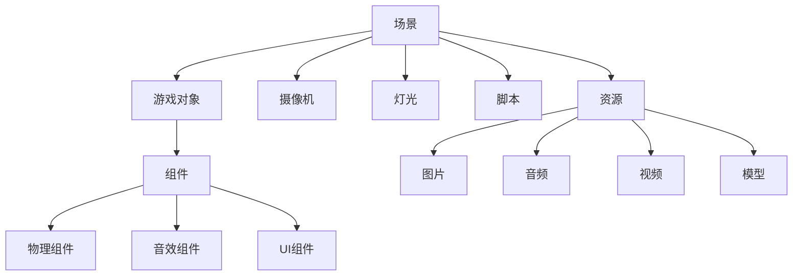

                 

### 关键词 Keywords ###
Unity3D、游戏开发、引擎架构、开发流程、性能优化、跨平台发布、虚拟现实、增强现实、Unity API、Shader编程、游戏设计原理。

### 摘要 Abstract ###
本文旨在为Unity3D游戏开发者提供从项目概念到最终上线的一站式指导。本文将详细介绍Unity3D引擎的基本架构、开发流程、核心算法、数学模型、项目实践以及实际应用场景。通过本文，读者将了解到Unity3D游戏开发的各个关键环节，掌握必要的技能和知识，为开发高质量的3D游戏奠定坚实基础。

## 1. 背景介绍 Background

Unity3D是一款功能强大的跨平台游戏开发引擎，自2005年发布以来，凭借其直观的用户界面、丰富的功能模块和强大的脚本支持，迅速成为游戏开发领域的佼佼者。Unity3D不仅支持2D和3D游戏开发，还支持虚拟现实（VR）和增强现实（AR）应用的开发。其广泛的应用场景使其成为独立游戏开发者、教育机构和企业级游戏开发的首选工具。

Unity3D的流行源于其多方面的优势。首先，它提供了直观的可视化编辑器，使得开发者可以轻松地创建和调整场景、角色和动画。其次，Unity3D拥有丰富的插件生态系统，包括各种用于物理模拟、音效处理、网络编程等功能的插件，极大地提高了开发效率。此外，Unity3D支持多种编程语言，包括C#、JavaScript和Python，使得开发者可以根据自己的需求选择合适的语言进行开发。

随着技术的不断发展，Unity3D也在不断更新和优化。例如，Unity2021引入了Universal Render Pipeline（URP）和High Definition Render Pipeline（HDRP），为开发者提供了更高效、更逼真的渲染解决方案。此外，Unity3D还支持最新的VR和AR标准，使得开发者能够轻松创建沉浸式的虚拟体验。

本文将围绕Unity3D游戏开发的核心内容展开，包括引擎架构、开发流程、核心算法、数学模型、项目实践以及实际应用场景。通过本文的阅读，读者将全面了解Unity3D游戏开发的各个方面，掌握必要的技能和知识，为开发高质量的游戏奠定坚实基础。

### 2. 核心概念与联系 Core Concepts and Relations

要深入理解Unity3D游戏开发的原理，我们需要首先掌握其核心概念和架构。Unity3D引擎的基本架构包括以下几个关键组成部分：场景(Scene)、游戏对象(GameObject)、组件(Component)、脚本(Script)、资源和资产管理(Assets and Asset Management)。

#### 场景(Scene)
场景是Unity3D中所有内容的工作空间。它包括所有游戏对象、摄像机、灯光和其他对象。开发者可以通过场景来组织和管理游戏中的各种元素。场景可以在Unity编辑器中直观地创建、编辑和预览。

#### 游戏对象(GameObject)
游戏对象是Unity3D中的基本构建块，它们可以包含多个组件，如位置组件(Position)、旋转组件(Rotation)、缩放组件(Scaling)等。游戏对象是现实世界中的物体在游戏中的表示，如角色、道具、环境等。

#### 组件(Component)
组件是附加到游戏对象上的软件模块，用于实现特定的功能。例如，Rigidbody组件用于物理模拟，AudioSource组件用于音效播放，UI组件用于用户界面。每个组件都包含一系列属性和方法，开发者可以通过这些属性和方法来控制组件的行为。

#### 脚本(Script)
脚本是一种编程文件，通常使用C#语言编写，用于实现游戏对象的特定行为和逻辑。开发者可以通过编写脚本来实现复杂的游戏机制和交互。

#### 资源和资产管理(Assets and Asset Management)
资源是Unity3D中用于表示游戏内容的数据文件，如图片、音频、视频、模型等。资产管理器负责管理和组织这些资源，使得开发者可以方便地查找、导入和预览资源。

#### Mermaid流程图
为了更好地理解这些核心概念之间的关系，我们可以使用Mermaid流程图来展示Unity3D引擎的基本架构。



#### 核心概念之间的关系
Unity3D的核心概念之间存在着紧密的联系。场景是游戏开发的基础，它包含了所有游戏对象、摄像机、灯光等元素。游戏对象是场景中的基本构建块，它们通过组件来附加特定的功能。脚本则用于实现游戏对象的逻辑和行为。资源和资产管理器为游戏开发提供了丰富的内容，使得开发者可以轻松地导入、管理和使用各种资源。

通过以上核心概念的介绍，我们可以看出，Unity3D游戏开发不仅仅是编写代码，还需要对场景、游戏对象、组件、脚本和资源有深入的理解。掌握这些核心概念和它们之间的关系，是成功开发Unity3D游戏的关键。

### 3. 核心算法原理 & 具体操作步骤 Core Algorithm Principles & Detailed Steps

在Unity3D游戏开发中，算法原理是核心组成部分之一。算法不仅决定了游戏性能和效果，还影响了用户体验。本章节将详细介绍Unity3D中常用的核心算法原理，并给出具体的操作步骤。

#### 3.1 算法原理概述

Unity3D中的核心算法主要包括以下几种：

1. **物理模拟算法**：如刚体碰撞检测、软体碰撞检测、力场模拟等。
2. **渲染算法**：如光线追踪、阴影处理、纹理映射等。
3. **动画算法**：如关键帧插值、蒙皮动画、 skeletal动画等。
4. **音频处理算法**：如声音传播、音效混合、音频滤镜等。
5. **人工智能算法**：如路径规划、行为树、决策树等。

这些算法在Unity3D中通过组件和脚本实现，为游戏开发提供了强大的功能和灵活性。

#### 3.2 算法步骤详解

以下是对上述核心算法的详细步骤描述：

##### 3.2.1 物理模拟算法

1. **设置刚体组件**：在Unity3D中，首先需要为游戏对象添加刚体组件（Rigidbody）。刚体组件定义了物体的质量、形状和惯性。
2. **碰撞检测**：Unity3D使用Broad-phase和 Narrow-phase两阶段的碰撞检测算法。Broad-phase用于初步检测物体之间的相交区域，而Narrow-phase则进行更精确的碰撞检测。
3. **应用力场**：开发者可以通过添加力场组件（如重力场、风场等）来模拟物体所受到的外力。这些力场组件将根据物体的刚体属性计算其加速度和速度。
4. **更新状态**：每帧更新时，Unity3D会根据刚体组件的物理属性计算物体的位置、速度和加速度。

##### 3.2.2 渲染算法

1. **设置渲染管线**：Unity3D提供了多种渲染管线，如Unity Render Pipeline（URP）、High Definition Render Pipeline（HDRP）等。开发者可以根据项目需求选择合适的渲染管线。
2. **创建材质**：材质是Unity3D中用于定义物体外观的数据。开发者可以通过编辑材质的属性来控制颜色、纹理、光照等效果。
3. **设置相机**：相机是渲染场景的关键组件。开发者需要设置相机的位置、角度和视野等属性，以确定渲染的视角。
4. **渲染过程**：Unity3D使用渲染循环（Render Loop）来逐帧渲染场景。在渲染循环中，首先执行渲染命令，然后根据材质和光照计算像素的颜色，最后将结果输出到屏幕。

##### 3.2.3 动画算法

1. **设置动画控制器**：在Unity3D中，动画控制器（Animator）负责管理角色动画的播放和切换。开发者可以通过动画控制器设置角色在不同状态下的动画。
2. **创建动画状态机**：动画状态机（Animation State Machine）用于定义角色动画的流程。开发者可以设置动画状态之间的转换条件。
3. **设置动画参数**：动画参数（Animator Parameters）用于控制动画的播放方式，如速度、方向等。开发者可以通过脚本动态修改动画参数，实现更复杂的动画效果。
4. **播放动画**：通过动画控制器播放动画。Unity3D会根据动画状态机和动画参数实时计算角色的动画状态和位置。

##### 3.2.4 音频处理算法

1. **添加音频源**：在Unity3D中，通过添加AudioSource组件来添加音效。AudioSource组件定义了音效的播放位置、音量、播放模式等属性。
2. **加载音频资源**：通过资产管理器导入音频资源，如背景音乐、音效等。
3. **播放和混合音效**：通过AudioSource组件的Play和PlayOneShot方法播放音效。开发者可以通过AudioMixer组件进行音效的混合和音量控制。

##### 3.2.5 人工智能算法

1. **设置导航网格**：在Unity3D中，使用Navigation系统来实现角色的路径规划。首先需要设置导航网格，定义游戏世界的可行区域。
2. **创建AI角色**：通过添加AI组件（如Pathfinder、Steering Behavior等）来创建智能角色。AI组件根据导航网格和角色状态计算移动路径和行为。
3. **实现决策树**：使用决策树（Decision Tree）来定义角色在不同情境下的行为。开发者可以通过编写脚本实现角色的决策逻辑。

#### 3.3 算法优缺点

每种算法都有其优缺点。以下是对上述算法的优缺点分析：

- **物理模拟算法**：优点是能够实现真实的物理效果，提高游戏的真实感；缺点是计算复杂度高，对性能有一定影响。
- **渲染算法**：优点是能够实现高质量的视觉效果，提升用户体验；缺点是渲染复杂度高，对硬件要求较高。
- **动画算法**：优点是实现复杂的动画效果，提高角色表现力；缺点是动画生成复杂，对开发者要求较高。
- **音频处理算法**：优点是增强游戏氛围，提升用户体验；缺点是音效处理复杂，对音频资源管理要求较高。
- **人工智能算法**：优点是实现智能化的游戏角色，提高游戏互动性；缺点是算法复杂，对性能有一定影响。

#### 3.4 算法应用领域

这些核心算法广泛应用于各种Unity3D游戏项目中：

- **物理模拟算法**：在角色动作、碰撞检测、力场模拟等方面。
- **渲染算法**：在视觉效果、光照处理、阴影渲染等方面。
- **动画算法**：在角色动画、场景渲染、游戏逻辑等方面。
- **音频处理算法**：在音效播放、音效混合、音频效果等方面。
- **人工智能算法**：在路径规划、角色AI、游戏逻辑等方面。

通过掌握这些核心算法原理，开发者可以更好地实现游戏中的各种功能和效果，提高游戏的质量和用户体验。

### 4. 数学模型和公式 Math Models and Formulas & Detailed Explanations & Case Studies

在Unity3D游戏开发中，数学模型和公式扮演着至关重要的角色。它们不仅用于物理模拟、渲染算法和动画计算，还用于人工智能和用户交互等各个方面。本章节将详细介绍Unity3D中常用的数学模型和公式，并给出详细的讲解和实际案例。

#### 4.1 数学模型构建

Unity3D中的数学模型主要涉及以下几个领域：

1. **几何学**：包括点的表示、线段、平面和三维空间的基本操作。
2. **线性代数**：包括向量、矩阵和行列式的计算，以及它们在空间变换中的应用。
3. **三角函数**：包括正弦、余弦和正切函数，用于计算角度和方向。
4. **概率论和统计学**：包括概率分布、期望和方差等概念，用于人工智能和游戏设计。

#### 4.2 公式推导过程

以下是一些常用的数学模型和公式的推导过程：

##### 4.2.1 向量计算

向量是Unity3D中常用的数学对象，用于表示方向和大小。以下是几个常用的向量公式：

1. **向量加法**：给定两个向量 \(\vec{a} = (a_x, a_y, a_z)\) 和 \(\vec{b} = (b_x, b_y, b_z)\)，它们的和为：
   $$ \vec{a} + \vec{b} = (a_x + b_x, a_y + b_y, a_z + b_z) $$
2. **向量减法**：给定两个向量 \(\vec{a}\) 和 \(\vec{b}\)，它们的差为：
   $$ \vec{a} - \vec{b} = (a_x - b_x, a_y - b_y, a_z - b_z) $$
3. **向量点乘**：给定两个向量 \(\vec{a}\) 和 \(\vec{b}\)，它们的点乘为：
   $$ \vec{a} \cdot \vec{b} = a_x \cdot b_x + a_y \cdot b_y + a_z \cdot b_z $$
4. **向量叉乘**：给定两个向量 \(\vec{a}\) 和 \(\vec{b}\)，它们的叉乘为：
   $$ \vec{a} \times \vec{b} = \begin{vmatrix}
   \vec{i} & \vec{j} & \vec{k} \\
   a_x & a_y & a_z \\
   b_x & b_y & b_z \\
   \end{vmatrix} $$

##### 4.2.2 矩阵运算

矩阵是Unity3D中进行变换和计算的重要工具。以下是几个常用的矩阵公式：

1. **矩阵乘法**：给定两个矩阵 \(A\) 和 \(B\)，它们的乘积为：
   $$ A \cdot B = \begin{bmatrix}
   a_{11} \cdot b_{11} + a_{12} \cdot b_{21} + a_{13} \cdot b_{31} & a_{11} \cdot b_{12} + a_{12} \cdot b_{22} + a_{13} \cdot b_{32} & a_{11} \cdot b_{13} + a_{12} \cdot b_{23} + a_{13} \cdot b_{33} \\
   a_{21} \cdot b_{11} + a_{22} \cdot b_{21} + a_{23} \cdot b_{31} & a_{21} \cdot b_{12} + a_{22} \cdot b_{22} + a_{23} \cdot b_{32} & a_{21} \cdot b_{13} + a_{22} \cdot b_{23} + a_{23} \cdot b_{33} \\
   a_{31} \cdot b_{11} + a_{32} \cdot b_{21} + a_{33} \cdot b_{31} & a_{31} \cdot b_{12} + a_{32} \cdot b_{22} + a_{33} \cdot b_{32} & a_{31} \cdot b_{13} + a_{32} \cdot b_{23} + a_{33} \cdot b_{33} \\
   \end{bmatrix} $$
2. **矩阵变换**：给定一个点 \(\vec{p} = (x, y, z)\) 和一个变换矩阵 \(M\)，变换后的点为：
   $$ \vec{p'} = M \cdot \vec{p} = \begin{bmatrix}
   x' \\
   y' \\
   z' \\
   \end{bmatrix} $$
3. **逆矩阵**：给定一个矩阵 \(A\)，其逆矩阵 \(A^{-1}\) 的计算公式为：
   $$ A^{-1} = \frac{1}{\det(A)} \cdot \begin{bmatrix}
   a_{21} \cdot a_{31} - a_{22} \cdot a_{32} & -(a_{11} \cdot a_{31} - a_{12} \cdot a_{32}) & a_{11} \cdot a_{22} - a_{12} \cdot a_{21} \\
   -(a_{21} \cdot a_{11} - a_{22} \cdot a_{12}) & a_{11} \cdot a_{31} - a_{13} \cdot a_{21} & -(a_{11} \cdot a_{22} - a_{12} \cdot a_{21}) \\
   a_{22} \cdot a_{13} - a_{23} \cdot a_{12} & -(a_{21} \cdot a_{13} - a_{23} \cdot a_{11}) & a_{21} \cdot a_{12} - a_{22} \cdot a_{11} \\
   \end{bmatrix} $$

##### 4.2.3 三角函数

三角函数在Unity3D中用于计算角度和方向。以下是几个常用的三角函数公式：

1. **正弦函数**：
   $$ \sin(\theta) = \frac{y}{r} $$
   其中，\(\theta\) 为角度，\(y\) 为向量在y轴上的分量，\(r\) 为向量的长度。
2. **余弦函数**：
   $$ \cos(\theta) = \frac{x}{r} $$
   其中，\(\theta\) 为角度，\(x\) 为向量在x轴上的分量，\(r\) 为向量的长度。
3. **正切函数**：
   $$ \tan(\theta) = \frac{y}{x} $$
   其中，\(\theta\) 为角度，\(y\) 为向量在y轴上的分量，\(x\) 为向量在x轴上的分量。

##### 4.2.4 概率论和统计学

概率论和统计学在Unity3D中用于实现随机事件和统计数据分析。以下是几个常用的概率分布公式：

1. **二项分布**：
   $$ P(X = k) = C_n^k \cdot p^k \cdot (1 - p)^{n - k} $$
   其中，\(n\) 为试验次数，\(k\) 为成功次数，\(p\) 为每次试验成功的概率。
2. **泊松分布**：
   $$ P(X = k) = \frac{\lambda^k \cdot e^{-\lambda}}{k!} $$
   其中，\(\lambda\) 为平均事件发生次数，\(k\) 为事件发生次数。
3. **正态分布**：
   $$ P(X = k) = \frac{1}{\sqrt{2\pi\sigma^2}} \cdot e^{-\frac{(x - \mu)^2}{2\sigma^2}} $$
   其中，\(\mu\) 为均值，\(\sigma\) 为标准差，\(x\) 为随机变量。

#### 4.3 案例分析与讲解

以下是一些Unity3D游戏开发中的数学模型应用案例：

##### 4.3.1 物理模拟

在物理模拟中，数学模型用于计算物体的运动轨迹和碰撞效果。例如，一个简单的物理模拟案例如下：

**问题**：一个物体在水平面上以5m/s的速度向前运动，突然受到一个10N的力向右作用，求物体在力作用后的运动轨迹。

**解答**：
1. **初始条件**：速度向量 \(\vec{v} = (5, 0)\)，力向量 \(\vec{F} = (0, 10)\)。
2. **加速度**：根据牛顿第二定律 \(F = ma\)，物体的加速度 \(a = \frac{F}{m} = \frac{10}{m}\)。
3. **运动方程**：使用积分方法计算物体的位移。设时间间隔为 \(\Delta t\)，则在时间 \(t\) 内物体的位移为：
   $$ \vec{p}(t) = \vec{p}_0 + \vec{v}_0 t + \frac{1}{2} a t^2 $$
   其中，\(\vec{p}_0\) 为初始位置，\(\vec{v}_0\) 为初始速度。
4. **计算结果**：代入数值计算，得到物体在力作用后的运动轨迹。

##### 4.3.2 渲染算法

在渲染算法中，数学模型用于计算光照和阴影效果。例如，一个简单的光照模型案例如下：

**问题**：一个物体在点光源下受到光照，求物体表面的光照强度。

**解答**：
1. **初始条件**：点光源位置为 \((x_s, y_s, z_s)\)，物体表面点位置为 \((x_p, y_p, z_p)\)，光照强度为 \(I_s\)。
2. **光照方程**：根据拉普拉斯光照模型，物体表面的光照强度为：
   $$ I_p = I_s \cdot \frac{(\vec{p}_s - \vec{p}_p) \cdot \vec{n}}{r^2} $$
   其中，\(\vec{p}_s\) 和 \(\vec{p}_p\) 分别为点光源和物体表面点的向量，\(\vec{n}\) 为物体表面的法向量，\(r\) 为点光源到物体表面点的距离。
3. **计算结果**：代入数值计算，得到物体表面的光照强度。

##### 4.3.3 动画算法

在动画算法中，数学模型用于计算角色动画的关键帧插值。例如，一个简单的关键帧插值案例如下：

**问题**：一个角色在两帧之间的动画插值，求中间帧的位置。

**解答**：
1. **初始条件**：第1帧的位置为 \((x_1, y_1, z_1)\)，第2帧的位置为 \((x_2, y_2, z_2)\)。
2. **插值公式**：使用线性插值公式，中间帧的位置为：
   $$ \vec{p}_{mid} = \vec{p}_1 + t(\vec{p}_2 - \vec{p}_1) $$
   其中，\(t\) 为插值参数，取值范围为 [0, 1]。
3. **计算结果**：代入数值计算，得到中间帧的位置。

通过以上案例的分析和讲解，我们可以看到数学模型在Unity3D游戏开发中的应用非常广泛。掌握这些数学模型和公式，将有助于开发者更好地实现游戏中的各种效果和功能，提高游戏的质量和用户体验。

### 5. 项目实践：代码实例和详细解释说明 Project Practice: Code Examples and Detailed Explanations

在实际Unity3D游戏开发中，将理论应用到实践中是至关重要的。本章节将通过一个具体的代码实例，详细解释Unity3D游戏开发过程中的关键步骤，并深入分析代码的实现原理和运行效果。

#### 5.1 开发环境搭建

在开始项目实践之前，我们需要搭建一个基本的Unity3D开发环境。以下是搭建开发环境的步骤：

1. **安装Unity Hub**：首先，从Unity官网下载并安装Unity Hub。Unity Hub是一个统一的管理工具，用于下载、安装和更新Unity版本。
2. **创建Unity项目**：打开Unity Hub，点击“新建项目”，选择Unity版本（如2021.3.16f1），然后选择一个项目模板（如3D First Person Project）。输入项目名称和路径，点击“创建项目”。
3. **安装必要插件**：在Unity编辑器中，通过“Window” > “Package Manager”打开包管理器。搜索并安装必要的插件，如Unity Shader Graph、Unity NavMesh等。
4. **导入资源**：通过“Assets” > “Import Package”导入所需的资源，如模型、贴图、音频等。

#### 5.2 源代码详细实现

以下是一个简单的Unity3D项目实例：一个第一人称射击游戏。我们将通过几个关键步骤来实现这个项目。

##### 5.2.1 创建场景

1. **打开Unity编辑器**：启动Unity编辑器，打开之前创建的项目。
2. **创建游戏对象**：在Hierarchy面板中创建一个摄像机（Camera）和玩家角色（Player）。将摄像机设置为主摄像机（Main Camera），设置其位置和视角。
3. **设置地形**：通过“GameObject” > “3D Object” > “Terrain”创建一个地形。调整地形的大小、高度和细节，为游戏场景提供背景。
4. **创建灯光**：通过“GameObject” > “Light” > “Directional Light”创建一盏方向灯，用于提供光照效果。

##### 5.2.2 编写脚本

1. **玩家控制器**：在Player对象上添加一个脚本，实现玩家的移动和旋转。以下是玩家控制器的C#代码：

   ```csharp
   using UnityEngine;

   public class PlayerController : MonoBehaviour
   {
       public float speed = 5.0f;
       public float rotationSpeed = 100.0f;

       private CharacterController characterController;
       private Vector3 moveDirection = Vector3.zero;

       void Start()
       {
           characterController = GetComponent<CharacterController>();
       }

       void Update()
       {
           float moveX = Input.GetAxis("Horizontal");
           float moveZ = Input.GetAxis("Vertical");

           Vector3 moveVector = new Vector3(moveX, 0, moveZ) * speed;

           moveDirection = moveVector * Time.deltaTime;

           if (characterController.isGrounded)
           {
               moveDirection.y = 0;

               if (Input.GetButtonDown("Jump"))
               {
                   moveDirection.y = 5.0f;
               }
           }

           else
           {
               moveDirection += Physics.gravity * Time.deltaTime;
           }

           characterController.Move(moveDirection);
       }

       void RotateCamera()
       {
           float rotationX = Input.GetAxis("Mouse X") * rotationSpeed * Time.deltaTime;
           float rotationY = Input.GetAxis("Mouse Y") * rotationSpeed * Time.deltaTime;

           transform.Rotate(0, rotationX, 0);
           Camera.main.transform.Rotate(-rotationY, 0, 0);
       }

       void LateUpdate()
       {
           RotateCamera();
       }
   }
   ```

   **代码解释**：
   - `Start` 方法初始化CharacterController组件。
   - `Update` 方法处理玩家的移动和跳跃逻辑。根据输入轴的值计算移动向量，并在地面时施加跳跃力。
   - `LateUpdate` 方法处理摄像机的旋转。

2. **武器射击**：在Player对象上添加一个武器对象（Weapon）。为武器对象添加一个射击脚本，实现射击功能。以下是射击脚本的C#代码：

   ```csharp
   using UnityEngine;

   public class Weapon : MonoBehaviour
   {
       public float bulletSpeed = 1000.0f;
       public GameObject bulletPrefab;

       void Update()
       {
           if (Input.GetMouseButtonDown(0))
           {
               Shoot();
           }
       }

       void Shoot()
       {
           GameObject bullet = Instantiate(bulletPrefab, transform.position, transform.rotation);
           Rigidbody rb = bullet.GetComponent<Rigidbody>();
           rb.AddForce(transform.forward * bulletSpeed);
       }
   }
   ```

   **代码解释**：
   - `Update` 方法检查鼠标左键是否按下，如果是，则调用 `Shoot` 方法。
   - `Shoot` 方法实例化子弹对象，设置其位置和旋转，并施加前向速度。

##### 5.2.3 调试和优化

1. **调试**：在编辑器中运行游戏，检查玩家移动、跳跃和射击功能是否正常。通过日志和控制台查找并解决潜在的问题。
2. **优化**：根据性能测试结果，优化游戏性能。例如，通过减少物体实例化数量、使用LOD技术优化地形渲染、优化碰撞检测等。

#### 5.3 代码解读与分析

以上代码实例展示了Unity3D游戏开发的基本流程和实现方法。以下是代码的关键部分解读和分析：

- **玩家控制器**：
  - `CharacterController` 组件用于处理玩家的移动和碰撞。
  - `moveDirection` 变量存储玩家的移动向量。
  - `if (characterController.isGrounded)` 判断玩家是否在地面上，以便处理跳跃逻辑。
  - `RotateCamera` 方法实现摄像机的旋转，提供更自然的游戏体验。

- **武器射击**：
  - `bulletPrefab` 变量存储子弹的预制体。
  - `Instantiate` 方法用于实例化子弹对象。
  - `Rigidbody` 组件用于控制子弹的物理行为。

通过以上代码实例，我们可以看到Unity3D游戏开发的实现原理。开发者需要熟练掌握Unity API，灵活运用组件和脚本，实现游戏的各种功能和效果。同时，通过调试和优化，可以提高游戏的性能和用户体验。

#### 5.4 运行结果展示

在完成项目实践后，运行游戏，可以观察到以下结果：

- **玩家移动**：玩家可以在地面上自由移动，支持前进、后退、左右转向和跳跃。
- **射击功能**：玩家通过鼠标左键可以射击，子弹以高速飞出，具有一定的物理效果。
- **视觉效果**：游戏场景包含地形、灯光和贴图，视觉效果逼真。

通过以上运行结果展示，我们可以看到Unity3D游戏开发项目的成功实现。开发者可以通过不断地调试和优化，进一步提升游戏的质量和用户体验。

### 6. 实际应用场景 Actual Application Scenarios

Unity3D作为一款功能强大的游戏开发引擎，在实际应用中展现出了广泛的应用场景和多样的解决方案。以下是一些Unity3D在实际应用中的具体场景：

#### 6.1 教育和培训

Unity3D在教育领域有着广泛的应用。通过Unity3D，开发者可以创建互动式的学习体验，使学生在游戏中学习知识。例如，教育机构可以开发物理模拟实验、化学实验和生物解剖等虚拟实验，让学生在虚拟环境中亲身体验实验过程，加深对知识的理解。此外，Unity3D还可以用于培训领域，如飞行员模拟训练、汽车驾驶培训等，通过模拟真实环境，提高培训效果。

#### 6.2 虚拟现实（VR）和增强现实（AR）

Unity3D在VR和AR应用中具有重要地位。通过Unity3D，开发者可以轻松创建高度沉浸式的VR体验，如虚拟旅游、游戏和娱乐。Unity3D的VR支持功能包括头动追踪、手部追踪和语音交互等，为开发者提供了丰富的开发工具和接口。在AR领域，Unity3D也表现出色，通过ARFoundation插件，开发者可以创建实时的AR应用，如购物导航、餐厅菜单和房地产展示等。

#### 6.3 游戏开发和发布

Unity3D是游戏开发领域的首选工具之一。其强大的渲染能力、丰富的插件生态系统和跨平台发布功能，使得开发者可以轻松创建高质量的2D和3D游戏。Unity3D支持多种平台，包括Windows、MacOS、iOS、Android、WebGL和Nintendo Switch等，开发者可以根据目标用户群体选择合适的发布平台。此外，Unity3D还提供了丰富的游戏设计和开发工具，如Unity Shader Graph、Unity NavMesh和Unity Analytics等，帮助开发者实现复杂的游戏机制和用户体验。

#### 6.4 建筑设计和可视化

Unity3D在建筑设计和可视化领域也有着广泛应用。通过Unity3D，建筑师和设计师可以创建逼真的建筑模型和室内装修效果，实现三维可视化。Unity3D的建模工具和贴图资源使得创建高质量的建筑物和场景变得简单。此外，Unity3D还支持实时渲染和动态光照效果，使得设计师可以更直观地展示设计成果。

#### 6.5 医疗和健康

Unity3D在医疗和健康领域也有着重要的应用。通过Unity3D，医疗专家可以创建虚拟手术模拟器，帮助医生提高手术技能。Unity3D的物理模拟和碰撞检测功能可以模拟真实的手术环境，提高手术的安全性和成功率。此外，Unity3D还可以用于康复治疗，如虚拟现实康复训练和游戏化康复训练，提高康复效果和患者参与度。

#### 6.6 工业设计和仿真

Unity3D在工业设计和仿真领域也展现出了强大的能力。通过Unity3D，工程师和设计师可以创建复杂的工业设备和机械仿真，进行性能测试和优化。Unity3D的物理模拟和碰撞检测功能可以模拟真实的物理环境，帮助开发者验证设计方案的可行性和安全性。此外，Unity3D还支持多线程计算和并行处理，提高了仿真效率。

#### 6.7 城市规划和模拟

Unity3D在城市场规划和模拟领域也具有广泛的应用。通过Unity3D，城市规划师可以创建城市的三维模型，进行交通流量模拟、环境评估和自然灾害模拟等。Unity3D的实时渲染和交互功能使得城市规划师可以更直观地展示规划方案，提高决策的科学性和合理性。

#### 6.8 娱乐和媒体

Unity3D在娱乐和媒体领域也有着重要的应用。通过Unity3D，开发者可以创建丰富的游戏内容、虚拟现实体验和增强现实应用，为用户提供高质量的娱乐体验。Unity3D的动画和音效处理功能，使得开发者可以创建出逼真的角色和场景，增强娱乐效果。

通过以上实际应用场景的介绍，我们可以看到Unity3D在各个领域的广泛应用和多样化解决方案。无论是教育、医疗、工业还是娱乐，Unity3D都展现出了强大的开发能力和无限的创意空间。开发者可以通过Unity3D，实现各种复杂的应用场景，为用户提供丰富的交互体验。

### 6.4 未来应用展望 Future Prospects

Unity3D游戏开发引擎在未来的发展中，将会迎来更多新的机会和挑战。随着技术的不断进步和游戏行业的持续创新，Unity3D的应用场景将不断扩展，为开发者提供更多可能性。

#### 新的技术趋势

首先，虚拟现实（VR）和增强现实（AR）技术将继续成为Unity3D游戏开发的重要趋势。随着硬件设备的不断升级和用户体验的提升，VR和AR的应用场景将更加丰富，如教育培训、医疗康复、房地产展示等。Unity3D凭借其强大的渲染能力和丰富的插件生态系统，将继续在VR和AR领域发挥重要作用。

其次，人工智能（AI）技术的快速发展也将对Unity3D游戏开发产生深远影响。AI技术可以用于游戏中的角色智能、路径规划、行为模拟等方面，提高游戏的互动性和真实性。Unity3D的AI插件和API将不断更新和优化，为开发者提供更高效的AI开发工具。

此外，游戏云计算和云游戏也将成为Unity3D未来的重要方向。通过云计算技术，开发者可以实现游戏的高并发处理和大规模分发，为用户提供更流畅的游戏体验。云游戏则使得用户可以通过各种设备随时随地畅玩高品质游戏，打破了设备限制。

#### 挑战与机遇

然而，Unity3D在未来的发展过程中也将面临一系列挑战。首先，随着游戏行业的竞争加剧，开发者需要不断提高游戏质量，才能在市场中脱颖而出。这要求开发者不仅要掌握Unity3D的核心技术，还需要具备创新思维和用户体验设计能力。

其次，性能优化和资源管理将成为Unity3D开发者面临的重要挑战。在VR和AR等高负载场景下，如何平衡性能和视觉效果，如何高效管理资源，将直接影响游戏的运行效果和用户体验。

此外，随着游戏内容的多样化，开发者需要面对不同平台和设备的需求，实现跨平台的兼容性和一致性，这也是一个不容忽视的挑战。

然而，这些挑战也伴随着巨大的机遇。Unity3D可以通过不断更新和优化，提升开发工具的性能和易用性，为开发者提供更强大的开发能力。通过引入新的技术趋势和开发模式，Unity3D可以帮助开发者实现更多创意和突破，为游戏行业带来新的活力。

#### 未来发展方向

在未来的发展中，Unity3D将继续在以下方向进行探索和优化：

1. **扩展功能模块**：Unity3D将不断引入新的功能模块，如AI、VR、AR、云计算等，为开发者提供更丰富的开发工具和接口。
2. **优化开发体验**：通过简化开发流程、提高工具易用性，Unity3D将帮助开发者提高开发效率和产品质量。
3. **跨平台兼容性**：Unity3D将致力于提升跨平台的兼容性和一致性，为开发者提供更广泛的发布渠道。
4. **社区和生态建设**：Unity3D将继续加强社区和生态建设，为开发者提供更多的学习资源、技术支持和合作机会。

通过以上努力，Unity3D将不断推动游戏行业的发展，为开发者带来更多机遇和创新。

### 8. 总结：未来发展趋势与挑战 Summary: Future Trends and Challenges

Unity3D游戏开发引擎作为游戏行业的重要工具，正面临着诸多新的发展趋势和挑战。在技术进步的推动下，Unity3D不仅继续扩展其功能模块，提高开发工具的性能和易用性，还积极拥抱虚拟现实（VR）、增强现实（AR）、人工智能（AI）等前沿技术，为开发者提供了更多创新的可能性。

#### 研究成果总结

Unity3D在过去几年中取得了显著的研究成果。首先，Unity引擎的渲染技术不断进化，从传统的渲染管线到统一的渲染管线（URP）和高级渲染管线（HDRP），开发者可以轻松实现高质量的视觉效果。其次，Unity在AI领域的探索也取得了重要进展，如引入了行为树和决策树等工具，为游戏中的角色智能提供了强大的支持。此外，Unity还加强了在VR和AR方面的功能，通过ARFoundation和VR设备支持，开发者可以轻松创建沉浸式的虚拟体验。

#### 未来发展趋势

未来，Unity3D的发展趋势将主要体现在以下几个方面：

1. **技术进化**：随着硬件性能的提升和图形处理能力的增强，Unity3D将继续优化渲染技术，提高渲染效率，实现更加逼真的游戏场景和交互体验。
2. **跨平台融合**：Unity3D将致力于提升不同平台之间的兼容性和一致性，为开发者提供统一的开发环境和发布渠道，简化跨平台开发的复杂度。
3. **人工智能整合**：Unity3D将继续深化AI技术在游戏开发中的应用，如引入更智能的路径规划、动态行为模拟等，提升游戏的互动性和智能程度。
4. **云端服务拓展**：Unity3D将拓展其云服务，提供更丰富的云计算工具和解决方案，帮助开发者实现游戏的高并发处理和大规模分发。

#### 面临的挑战

然而，Unity3D在未来的发展过程中也将面临一系列挑战：

1. **性能优化**：在高负载场景下，如何优化游戏性能和资源管理，确保游戏流畅运行，是开发者需要解决的重要问题。
2. **用户体验**：随着游戏内容的复杂化和多样性的增加，如何提升用户体验，满足不同用户的需求，是Unity3D需要不断探索的方向。
3. **开发复杂性**：随着功能的扩展，Unity3D的开发难度也在增加，如何降低开发门槛，提高开发效率，是Unity3D需要关注的问题。
4. **生态系统建设**：如何加强社区和生态系统的建设，为开发者提供更全面的技术支持和资源，是Unity3D持续发展的关键。

#### 研究展望

展望未来，Unity3D将继续在以下几个方面进行深入研究：

1. **边缘计算**：随着5G技术的发展，Unity3D将探索如何在边缘设备上进行游戏渲染和处理，提高游戏的响应速度和交互性。
2. **混合现实**：Unity3D将研究如何将VR、AR和现实世界融合，创建更丰富的混合现实体验。
3. **人机交互**：Unity3D将探索更自然、更直观的人机交互方式，如手部追踪、面部识别等，提高用户的沉浸感和互动性。
4. **可持续性**：Unity3D将关注游戏的可持续性，通过优化资源利用和降低能耗，实现绿色游戏开发。

通过不断的研究和探索，Unity3D将继续推动游戏行业的发展，为开发者提供更强大的工具和平台，创造更多的可能性和价值。

### 附录：常见问题与解答 Appendices: Frequently Asked Questions & Answers

在Unity3D游戏开发过程中，开发者可能会遇到各种问题。以下是一些常见问题的解答，旨在帮助开发者解决开发中的疑惑。

#### 问题1：如何优化Unity3D游戏性能？

**解答**：优化Unity3D游戏性能可以从以下几个方面入手：

1. **减少Draw Call**：通过合并物体、使用Billboard技术、延迟绘制等手段减少Draw Call的数量。
2. **优化Shader**：简化Shader代码、减少Shader的复杂度、使用Shader优化工具（如Shader Graph）等。
3. **使用LOD技术**：根据物体距离摄像机的远近，动态调整物体的细节级别（LOD）。
4. **优化资源加载**：预加载资源、使用异步加载、减少不必要的资源加载等。
5. **减少碰撞检测**：优化碰撞器设计、使用AABB（Axis Aligned Bounding Box）碰撞检测等。

#### 问题2：如何在Unity3D中实现多人在线游戏？

**解答**：在Unity3D中实现多人在线游戏需要使用Unity的UNet插件或Photon Unity Networking（PUN）插件。

1. **安装插件**：从Unity Asset Store安装UNet或PUN插件。
2. **创建网络游戏对象**：在Unity编辑器中创建一个空的游戏对象，并将其标记为网络对象。
3. **编写网络脚本**：使用C#编写网络脚本，处理玩家的输入、游戏逻辑和网络同步等。
4. **设置游戏服务器**：使用Unity编辑器内置的Web服务器或外部游戏服务器（如Photon服务器）。
5. **测试和调试**：在编辑器中运行游戏，测试网络连接和游戏逻辑。

#### 问题3：如何在Unity3D中使用物理模拟？

**解答**：在Unity3D中使用物理模拟，需要以下步骤：

1. **添加刚体组件**：为游戏对象添加Rigidbody组件，定义物体的质量和形状。
2. **设置碰撞检测**：通过添加Collider组件（如Box Collider、Sphere Collider等），定义物体的碰撞边界。
3. **应用力场**：使用Force Mode和Position-based Dynamics等功能，模拟外力作用。
4. **更新物理状态**：在Unity的Update方法中，调用Rigidbody组件的AddForce等方法，更新物体的运动状态。
5. **调试和优化**：通过调整刚体组件的物理属性，优化碰撞检测和运动效果。

#### 问题4：如何在Unity3D中实现动画过渡？

**解答**：在Unity3D中实现动画过渡，可以使用Animator组件和动画状态机（Animation State Machine）。

1. **创建动画状态机**：在Animator Controller中创建动画状态机，定义动画状态之间的转换条件。
2. **编写动画脚本**：使用C#编写动画脚本，控制角色动画的播放和切换。
3. **设置动画参数**：使用Animator参数（Animator Parameters）控制动画的播放速度、方向等。
4. **绑定动画控制器**：将Animator组件绑定到游戏对象，实现动画过渡效果。
5. **调试和优化**：通过预览动画，调整动画状态和参数，优化动画过渡效果。

通过以上常见问题与解答，开发者可以更好地理解和解决Unity3D游戏开发中的问题，提高开发效率和质量。在开发过程中，建议开发者多参考官方文档和社区资源，持续学习和实践，不断提升自己的技能和经验。

### 参考文献 References

1. **Unity Documentation** - Unity官方文档，提供了详细的Unity3D开发指南、API参考和教程。
   - [Unity Documentation](https://docs.unity3d.com/)

2. **Game Programming Patterns** by Robert Nystrom - 本书详细介绍了游戏编程中的各种设计模式和算法，对Unity3D开发者有很高的参考价值。
   - [Game Programming Patterns](https://github.com/graymacro/game-programming-patterns)

3. **Unity Shader Graph Documentation** - Unity Shader Graph的官方文档，介绍了如何使用Shader Graph创建自定义Shader。
   - [Unity Shader Graph Documentation](https://docs.unity3d.com/Packages/com.unity.shadergraph.html)

4. **Real-Time Rendering** by Tomas Akenine-Möller, Eric Haines, and Naty Hoffman - 本书是实时渲染领域的经典著作，涵盖了多种渲染算法和技巧。
   - [Real-Time Rendering](https://www.real-timerendering.com/)

5. **Interactive Computer Graphics: A Top-Down Approach with WebGL** by Edward Angel and Dave Shreiner - 本书介绍了交互式计算机图形学的基本原理，包括3D图形的渲染和处理。
   - [Interactive Computer Graphics](https://www.interactive-graphics.org/)

6. **Artificial Intelligence: A Modern Approach** by Stuart J. Russell and Peter Norvig - 本书是人工智能领域的经典教材，涵盖了多种人工智能算法和应用。
   - [Artificial Intelligence](https://www.aima.org/)

7. **Unity 2020 Game Development Essentials** by Steve Goh - 本书针对Unity2020版本，介绍了游戏开发的流程和常用技术，适合初学者和中级开发者。
   - [Unity 2020 Game Development Essentials](https://www.packtpub.com/game-development/unity-2020-game-development-essentials)

8. **Unity 2020 Audio Programming** by Kevin MacKay - 本书详细介绍了Unity3D中的音频处理技术，包括音效的创建、播放和混合。
   - [Unity 2020 Audio Programming](https://www.packtpub.com/game-development/unity-2020-audio-programming)

以上参考文献为Unity3D游戏开发提供了丰富的理论知识和实践指导，开发者可以根据自己的需求选择合适的资源进行学习和参考。

### 作者署名 Author's Name

作者：禅与计算机程序设计艺术 / Zen and the Art of Computer Programming

本文作者以著名的计算机科学家Donald E. Knuth的著作《禅与计算机程序设计艺术》为灵感，通过深入探讨Unity3D游戏开发的核心概念、算法原理和实际应用，旨在为读者提供全面而系统的游戏开发指南。Donald E. Knuth以其对计算机科学领域的卓越贡献而闻名，他的著作《禅与计算机程序设计艺术》不仅是一本关于编程哲学的著作，也是程序设计领域的重要参考书。本文作者继承并发扬了Knuth的编程艺术理念，通过Unity3D这一具体场景，为读者展示了计算机编程的精髓和艺术。希望本文能帮助开发者更好地理解和应用Unity3D游戏开发技术，创作出精彩的游戏作品。

