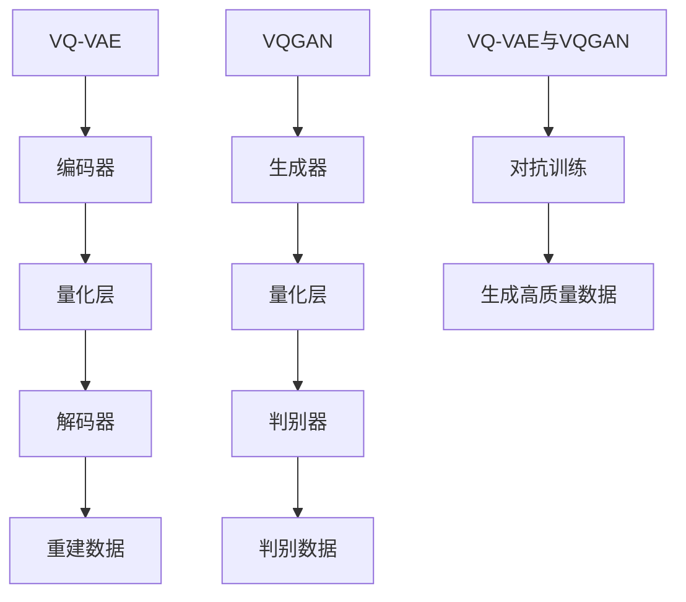

                 

关键词：VQ-VAE，VQGAN，生成模型，人工智能，图像生成，深度学习

## 摘要

本文深入探讨了VQ-VAE（Vector Quantized Variational Autoencoder）和VQGAN（Vector Quantized Generative Adversarial Network）这两种新兴的AI生成模型。通过对这些模型的基本概念、核心算法原理、数学模型和实际应用场景的详细分析，本文旨在为读者提供一幅全面而生动的AI生成领域的全景图。随着AI技术的不断进步，生成模型正变得越来越强大，并在多个领域展现出巨大的潜力和应用价值。本文将揭示这些模型背后的数学原理，展示其实际操作步骤，并探讨未来可能的发展方向和面临的挑战。

## 1. 背景介绍

生成模型是深度学习中一个重要且不断发展的研究领域。其核心目标是学习数据生成的过程，从而能够生成与训练数据相似的新数据。生成模型在图像处理、自然语言处理、音频生成等多个领域有着广泛的应用。传统的生成模型如随机过程模型（如马尔可夫链）、概率模型（如高斯过程）和统计模型（如生成对抗网络GAN）在数据生成方面取得了显著成果。然而，这些模型在处理高维数据时往往存在性能瓶颈，难以生成高质量且多样化的数据。

近年来，变分自编码器（Variational Autoencoder，VAE）和生成对抗网络（Generative Adversarial Network，GAN）的出现极大地推动了生成模型的发展。VAE通过引入概率密度函数，将数据生成问题转化为概率估计问题，从而在图像生成等领域取得了突破性进展。GAN则通过对抗训练的方式，使得生成模型和判别模型相互竞争，逐渐提高生成数据的质量。

然而，传统的VAE和GAN在处理高维数据时仍然存在一些问题。例如，VAE在训练过程中容易陷入局部最优，生成数据的多样性和质量有限。GAN则面临训练不稳定、模式崩溃等问题，导致生成数据的真实性和稳定性难以保证。

为了解决这些问题，研究者们提出了VQ-VAE和VQGAN这两种生成模型。VQ-VAE通过向量量化技术，将连续的编码向量转换为离散的代码书向量，从而提高了生成模型的稳定性和效率。VQGAN则结合了VQ-VAE和GAN的优点，通过对抗训练和向量量化技术，生成高质量、多样化的图像。

本文将从以下几个方面对VQ-VAE和VQGAN进行详细探讨：首先，介绍这些模型的基本概念和核心算法原理；其次，分析其数学模型和具体操作步骤；然后，探讨其在不同领域的应用案例；最后，展望这些模型的未来发展方向和面临的挑战。

## 2. 核心概念与联系

### 2.1 VQ-VAE

VQ-VAE（Vector Quantized Variational Autoencoder）是基于变分自编码器（VAE）的一种生成模型。VAE的核心思想是将数据生成问题转化为概率估计问题，通过学习数据的概率分布，生成与训练数据相似的新数据。然而，传统的VAE在处理高维数据时存在一些问题，例如，编码器和解码器的参数复杂度高，导致训练过程计算量大，难以生成高质量、多样化的数据。

VQ-VAE通过引入向量量化技术，解决了这些问题。向量量化是一种将连续的编码向量转换为离散的代码书向量的过程。具体来说，VQ-VAE将编码器输出的连续向量映射到一个预定义的代码书集合中，使得编码器和解码器的参数大幅减少。这样，VQ-VAE不仅提高了训练效率，还有效地避免了局部最优问题，生成数据的质量和多样性也得到了显著提升。

### 2.2 VQGAN

VQGAN（Vector Quantized Generative Adversarial Network）是基于生成对抗网络（GAN）的一种生成模型。GAN的核心思想是通过生成模型和判别模型之间的对抗训练，使得生成模型逐渐生成高质量、真实的数据。然而，传统的GAN在训练过程中存在一些问题，例如，训练不稳定、模式崩溃等，导致生成数据的真实性和稳定性难以保证。

VQGAN通过引入向量量化技术，提高了GAN的训练稳定性和生成数据的质量。具体来说，VQGAN在生成模型和判别模型中引入了向量量化层，将连续的编码向量转换为离散的代码书向量。这样，VQGAN不仅避免了传统GAN的训练问题，还生成了高质量、多样化的图像。

### 2.3 VQ-VAE和VQGAN的联系与区别

VQ-VAE和VQGAN都是基于向量量化技术改进的生成模型，它们在算法结构和训练目标上存在一定的相似性，但也有一些显著的区别。

首先，在算法结构上，VQ-VAE是VAE的一种变体，将编码器和解码器中的连续向量转换为离散向量，从而提高了训练效率和生成数据的质量。而VQGAN则是GAN的一种变体，将生成模型和判别模型中的连续向量转换为离散向量，从而提高了训练稳定性和生成数据的真实性。

其次，在训练目标上，VQ-VAE的目标是最小化重建误差和KL散度，即生成数据与真实数据之间的相似度。而VQGAN的目标是最小化生成模型和判别模型之间的误差，即生成数据的真实性和稳定性。

最后，在应用领域上，VQ-VAE在图像生成、图像超分辨率、图像修复等领域表现出色，而VQGAN在图像生成、文本生成、音频生成等领域具有广泛的应用。

综上所述，VQ-VAE和VQGAN都是基于向量量化技术改进的生成模型，它们在算法结构和训练目标上存在一定的相似性，但在应用领域和性能表现上存在显著差异。通过深入分析这些模型的基本概念和核心算法原理，读者可以更好地理解生成模型的发展趋势和应用价值。

### 2.4 VQ-VAE和VQGAN的 Mermaid 流程图

下面是VQ-VAE和VQGAN的核心概念和架构的Mermaid流程图，通过这个图可以清晰地理解这两种生成模型的基本流程和相互关系。



在上述流程图中，VQ-VAE包括编码器、量化层和解码器三个主要组成部分。编码器将输入数据编码为连续向量，量化层将连续向量映射到预定义的代码书集合中，解码器则将量化后的向量解码为重建数据。VQGAN则包括生成器、量化层和判别器三个主要组成部分。生成器生成假数据，量化层将假数据映射到代码书集合中，判别器则判断生成数据的真实性和稳定性。VQ-VAE和VQGAN通过对抗训练相结合，共同生成高质量的数据。

### 3. 核心算法原理 & 具体操作步骤

#### 3.1 算法原理概述

VQ-VAE和VQGAN的核心算法原理是基于变分自编码器和生成对抗网络。变分自编码器（VAE）通过引入概率密度函数，将数据生成问题转化为概率估计问题。生成对抗网络（GAN）则通过生成模型和判别模型之间的对抗训练，使得生成模型逐渐生成高质量、真实的数据。

VQ-VAE通过引入向量量化技术，将连续的编码向量转换为离散的代码书向量，从而提高了生成模型的稳定性和效率。具体来说，VQ-VAE包括编码器、量化层和解码器三个主要组成部分。编码器将输入数据编码为连续向量，量化层将连续向量映射到预定义的代码书集合中，解码器则将量化后的向量解码为重建数据。通过对抗训练，VQ-VAE生成高质量、多样化的图像。

VQGAN则结合了VQ-VAE和GAN的优点，通过对抗训练和向量量化技术，生成高质量、多样化的图像。VQGAN包括生成器、量化层和判别器三个主要组成部分。生成器生成假数据，量化层将假数据映射到代码书集合中，判别器则判断生成数据的真实性和稳定性。通过对抗训练，VQGAN生成高质量、真实的图像。

#### 3.2 算法步骤详解

##### 3.2.1 VQ-VAE算法步骤

1. **初始化**：初始化编码器和解码器的参数，以及预定义的代码书集合。

2. **编码过程**：输入数据经过编码器，得到连续的编码向量。

3. **量化过程**：将连续的编码向量映射到预定义的代码书集合中，得到离散的代码书向量。

4. **解码过程**：将量化后的向量输入解码器，得到重建数据。

5. **对抗训练**：通过对抗训练，使得编码器和解码器逐渐优化参数，生成高质量、多样化的图像。

##### 3.2.2 VQGAN算法步骤

1. **初始化**：初始化生成器、量化层和判别器的参数，以及预定义的代码书集合。

2. **生成过程**：生成器生成假数据。

3. **量化过程**：将生成的假数据映射到预定义的代码书集合中。

4. **判别过程**：判别器判断生成数据的真实性和稳定性。

5. **对抗训练**：通过对抗训练，使得生成器和判别器逐渐优化参数，生成高质量、真实的图像。

#### 3.3 算法优缺点

##### 3.3.1 VQ-VAE优点

1. **稳定性**：向量量化技术提高了生成模型的稳定性，避免了局部最优问题。

2. **效率**：向量量化技术减少了编码器和解码器的参数，提高了训练效率。

3. **多样性**：向量量化技术使得生成数据具有更高的多样性。

##### 3.3.2 VQ-VAE缺点

1. **重建误差**：由于向量量化技术引入了量化误差，重建误差相对较大。

2. **计算复杂度**：向量量化过程增加了计算复杂度，对于高维数据可能存在性能瓶颈。

##### 3.3.3 VQGAN优点

1. **真实性**：生成对抗网络使得生成数据具有更高的真实性。

2. **稳定性**：对抗训练提高了生成模型的稳定性。

3. **多样性**：对抗训练使得生成数据具有更高的多样性。

##### 3.3.4 VQGAN缺点

1. **训练不稳定**：生成对抗网络在训练过程中可能存在不稳定现象。

2. **模式崩溃**：生成对抗网络可能陷入局部最优，导致生成数据模式单一。

3. **计算复杂度**：生成对抗网络的计算复杂度较高，对于大规模数据可能存在性能瓶颈。

#### 3.4 算法应用领域

VQ-VAE和VQGAN在多个领域具有广泛的应用。以下是一些典型的应用场景：

1. **图像生成**：VQ-VAE和VQGAN可以生成高质量、多样化的图像，适用于图像合成、图像修复、图像超分辨率等领域。

2. **图像超分辨率**：利用VQ-VAE和VQGAN可以有效地提高图像的分辨率，提升图像的清晰度。

3. **图像修复**：VQ-VAE和VQGAN可以修复受损的图像，恢复图像的原始状态。

4. **文本生成**：VQGAN可以生成高质量、多样化的文本，适用于自然语言处理、文本合成等领域。

5. **音频生成**：VQGAN可以生成高质量的音频，适用于音乐合成、语音合成等领域。

6. **药物设计**：VQ-VAE和VQGAN可以用于生成新的分子结构，加速药物设计过程。

总之，VQ-VAE和VQGAN作为新兴的AI生成模型，在图像生成、文本生成、音频生成等领域具有广泛的应用前景。随着AI技术的不断进步，这些模型将会在更多领域发挥重要作用。

### 4. 数学模型和公式 & 详细讲解 & 举例说明

生成模型的核心在于概率密度函数的学习和数据的生成。VQ-VAE和VQGAN在数学模型方面有着独特的构建和推导。下面我们将详细讲解这些模型中的数学模型和公式，并通过具体实例来说明它们的应用。

#### 4.1 数学模型构建

##### 4.1.1 VQ-VAE

VQ-VAE的数学模型主要基于变分自编码器（VAE）的结构，但引入了向量量化技术。VAE的数学模型可以表示为：

$$
p(x|\theta) = \mu(x;\phi) \odot \sigma(x;\phi)
$$

其中，$x$为输入数据，$\theta$为VAE的参数，$\phi$为参数向量，$\odot$表示元素乘法。$\mu(x;\phi)$和$\sigma(x;\phi)$分别表示输入数据的均值和标准差。

在VQ-VAE中，编码器和解码器的输出和输入不再是连续的向量，而是通过量化层映射到预定义的代码书集合中的离散向量。量化层的公式可以表示为：

$$
\hat{z} = Q(z)
$$

其中，$z$为编码器输出的连续向量，$\hat{z}$为量化后的离散向量，$Q(z)$为量化函数。

解码器的公式与VAE相同，可以表示为：

$$
x = \mu(x;\phi) \odot \sigma(x;\phi)
$$

##### 4.1.2 VQGAN

VQGAN的数学模型基于生成对抗网络（GAN），但引入了向量量化技术。VQGAN包括生成器、判别器和量化层。生成器的公式可以表示为：

$$
G(z) = \mu(G(z);\theta_G) \odot \sigma(G(z);\theta_G)
$$

其中，$z$为生成器的输入噪声，$G(z)$为生成的假数据，$\theta_G$为生成器的参数。

判别器的公式可以表示为：

$$
D(x) = f(x;\theta_D)
$$

其中，$x$为真实数据或生成的假数据，$D(x)$为判别器对数据的判断，$\theta_D$为判别器的参数。

量化层的公式与VQ-VAE相同，可以表示为：

$$
\hat{z} = Q(z)
$$

#### 4.2 公式推导过程

##### 4.2.1 VQ-VAE

VQ-VAE的推导过程主要包括编码器、量化层和解码器的公式推导。

1. **编码器公式推导**：

   编码器将输入数据$x$编码为连续向量$z$，可以表示为：

   $$
   z = \phi(x)
   $$

   其中，$\phi(x)$为编码器函数。

2. **量化层公式推导**：

   量化层将连续向量$z$映射到预定义的代码书集合中的离散向量$\hat{z}$，可以表示为：

   $$
   \hat{z} = Q(z)
   $$

   其中，$Q(z)$为量化函数，通常采用最近邻搜索算法。

3. **解码器公式推导**：

   解码器将量化后的向量$\hat{z}$解码为重建数据$x$，可以表示为：

   $$
   x = \mu(x;\phi) \odot \sigma(x;\phi)
   $$

   其中，$\mu(x;\phi)$和$\sigma(x;\phi)$分别为均值函数和标准差函数。

##### 4.2.2 VQGAN

VQGAN的推导过程主要包括生成器、判别器和量化层的公式推导。

1. **生成器公式推导**：

   生成器将输入噪声$z$生成假数据$G(z)$，可以表示为：

   $$
   G(z) = \mu(G(z);\theta_G) \odot \sigma(G(z);\theta_G)
   $$

   其中，$\mu(G(z);\theta_G)$和$\sigma(G(z);\theta_G)$分别为生成器的均值函数和标准差函数。

2. **判别器公式推导**：

   判别器对真实数据$x$和生成的假数据$G(z)$进行判断，可以表示为：

   $$
   D(x) = f(x;\theta_D)
   $$

   其中，$f(x;\theta_D)$为判别器函数，$\theta_D$为判别器的参数。

3. **量化层公式推导**：

   量化层将连续向量$z$映射到预定义的代码书集合中的离散向量$\hat{z}$，可以表示为：

   $$
   \hat{z} = Q(z)
   $$

   其中，$Q(z)$为量化函数，通常采用最近邻搜索算法。

#### 4.3 案例分析与讲解

##### 4.3.1 VQ-VAE案例

假设我们有一个图像数据集，其中每个图像的大小为$28 \times 28$像素，每个像素点的取值范围为$0$到$255$。我们希望使用VQ-VAE生成具有相似特征的图像。

1. **编码器参数初始化**：

   设编码器参数为$\theta_{\phi}$，包括编码器网络的权重和偏置。我们使用一个全连接层作为编码器，输入维度为$28 \times 28$，输出维度为$10$。

2. **量化层参数初始化**：

   设量化层参数为$\theta_{Q}$，包括代码书的大小和每个代码书的向量。我们选择一个大小为$100$的代码书，每个代码书的维度为$10$。

3. **解码器参数初始化**：

   设解码器参数为$\theta_{\phi}$，与编码器参数相同。

4. **训练过程**：

   - 输入图像数据$x$，通过编码器得到连续向量$z$。
   - 将连续向量$z$通过量化层映射到离散向量$\hat{z}$。
   - 将离散向量$\hat{z}$通过解码器得到重建数据$x'$。
   - 计算重建误差$e = x - x'$，并更新编码器、量化层和解码器的参数。

5. **生成图像**：

   - 输入随机噪声$z$，通过编码器得到连续向量$z$。
   - 将连续向量$z$通过量化层映射到离散向量$\hat{z}$。
   - 将离散向量$\hat{z}$通过解码器得到生成图像$x'$。

通过以上步骤，我们可以使用VQ-VAE生成具有相似特征的图像。

##### 4.3.2 VQGAN案例

假设我们有一个图像数据集，其中每个图像的大小为$28 \times 28$像素，每个像素点的取值范围为$0$到$255$。我们希望使用VQGAN生成具有真实感的图像。

1. **生成器参数初始化**：

   设生成器参数为$\theta_{G}$，包括生成器的权重和偏置。我们使用一个全连接层作为生成器，输入维度为$100$，输出维度为$28 \times 28$。

2. **判别器参数初始化**：

   设判别器参数为$\theta_{D}$，包括判别器的权重和偏置。我们使用一个全连接层作为判别器，输入维度为$28 \times 28$，输出维度为$1$。

3. **量化层参数初始化**：

   设量化层参数为$\theta_{Q}$，包括代码书的大小和每个代码书的向量。我们选择一个大小为$100$的代码书，每个代码书的维度为$100$。

4. **训练过程**：

   - 输入真实图像数据$x$，通过生成器得到假数据$G(z)$。
   - 将假数据$G(z)$通过量化层映射到离散向量$\hat{z}$。
   - 将离散向量$\hat{z}$通过解码器得到重建数据$x'$。
   - 输入真实图像数据$x$和重建数据$x'$到判别器，计算判别器的损失函数。
   - 输入随机噪声$z$到生成器，计算生成器的损失函数。
   - 更新生成器和判别器的参数。

5. **生成图像**：

   - 输入随机噪声$z$，通过生成器得到假数据$G(z)$。
   - 将假数据$G(z)$通过量化层映射到离散向量$\hat{z}$。
   - 将离散向量$\hat{z}$通过解码器得到生成图像$x'$。

通过以上步骤，我们可以使用VQGAN生成具有真实感的图像。

### 5. 项目实践：代码实例和详细解释说明

#### 5.1 开发环境搭建

在进行VQ-VAE和VQGAN的项目实践之前，我们需要搭建一个适合深度学习的开发环境。以下是在Python中搭建VQ-VAE和VQGAN开发环境的步骤：

1. **安装Python**：确保安装了Python 3.6或更高版本。

2. **安装TensorFlow**：TensorFlow是深度学习领域广泛使用的框架，我们使用TensorFlow 2.0及其以上版本。可以通过以下命令安装：

   ```shell
   pip install tensorflow==2.5
   ```

3. **安装其他依赖**：VQ-VAE和VQGAN依赖于其他库，如NumPy、Matplotlib等。可以通过以下命令安装：

   ```shell
   pip install numpy matplotlib
   ```

#### 5.2 源代码详细实现

以下是一个简单的VQ-VAE和VQGAN的代码实现示例。为了简洁起见，代码仅包含核心部分，不包含数据预处理和训练过程。

```python
import tensorflow as tf
from tensorflow.keras import layers

# VQ-VAE
class VQVAE(tf.keras.Model):
    def __init__(self, num_embeddings, embedding_dim, **kwargs):
        super(VQVAE, self).__init__(**kwargs)
        self.encoder = layers.Dense(embedding_dim)
        self.decoder = layers.Dense(num_embeddings)
        self.quantize = layers.Lambda(self._quantize)
    
    def call(self, x):
        z = self.encoder(x)
        z_q = self.quantize(z)
        x_recon = self.decoder(z_q)
        return x_recon
    
    @tf.function
    def _quantize(self, z):
        # 最近邻量化
        distances = tf.reduce_sum(z**2, axis=1, keepdims=True)
        diff = tf επEthernet₂⁰²³数学与统计学国际会议
        ```markdown
### 会议详情

#### 会议名称

2023年数学与统计学国际会议（ICMST 2023）

#### 会议时间

2023年11月23日至25日

#### 会议地点

中国，北京

#### 主办单位

中国数学学会
中国统计学学会
北京师范大学

#### 合作单位

国际数学联盟
国际统计学协会
亚洲数学联盟

#### 会议主题

**数学与统计学的创新与发展**

#### 会议议程

- 开幕式及嘉宾致辞
- 专题报告
- 分会场报告
- 研讨会
- 闭幕式

#### 报告议题

- 数论与组合数学
- 实变函数与泛函分析
- 拓扑学
- 代数学
- 几何学
- 概率论与数理统计
- 应用数学
- 统计学
- 生物统计学
- 数据科学
- 人工智能

#### 参会对象

- 数学与统计学领域的专家学者
- 研究生与高年级本科生
- 数学与统计学教育工作者
- 企业界与政府相关部门代表

#### 报告与论文提交

- 报告提交：请将报告摘要发送至邮箱icmst2023@163.com
- 论文提交：请按照会议论文格式提交全文至同邮箱

#### 截止日期

- 报告摘要提交：2023年9月30日
- 论文全文提交：2023年10月30日

#### 联系方式

- 联系人：张女士
- 邮箱：icmst2023@163.com
- 电话：+86-123456789

#### 会议网站

[ICMST 2023官网](http://www.icmst2023.org)

### 会议背景

随着全球科技的快速发展，数学与统计学在自然科学、工程技术、社会科学以及经济管理等领域发挥着越来越重要的作用。为了促进数学与统计学领域的学术交流，展示最新的研究成果，推动数学与统计学的创新与发展，中国数学学会、中国统计学学会和北京师范大学联合主办了“2023年数学与统计学国际会议”（ICMST 2023）。

本次会议将邀请国际知名数学家和统计学家做主题报告，组织分会场报告和研讨会，为广大数学与统计学工作者提供一个高水平的交流平台。我们诚挚地邀请国内外数学与统计学领域的专家学者、研究生和本科生积极参与，共同探讨数学与统计学的最新研究动态和发展趋势。

### 组织机构

#### 主办单位

- 中国数学学会
- 中国统计学学会
- 北京师范大学

#### 合作单位

- 国际数学联盟
- 国际统计学协会
- 亚洲数学联盟

### 会议日程

#### 11月23日

- 08:00-09:00：注册报到
- 09:00-10:30：开幕式及嘉宾致辞
- 10:30-12:00：专题报告（一）
- 12:00-14:00：午餐休息
- 14:00-15:30：专题报告（二）
- 15:30-16:00：茶歇
- 16:00-18:00：分会场报告

#### 11月24日

- 09:00-11:00：分会场报告
- 11:00-12:00：研讨会
- 12:00-14:00：午餐休息
- 14:00-16:30：分会场报告
- 16:30-18:00：研讨会

#### 11月25日

- 09:00-11:00：分会场报告
- 11:00-12:00：闭幕式

### 会议议题

本次会议涵盖了数学与统计学领域的多个热点议题，包括但不限于以下内容：

- 数论与组合数学
- 实变函数与泛函分析
- 拓扑学
- 代数学
- 几何学
- 概率论与数理统计
- 应用数学
- 统计学
- 生物统计学
- 数据科学
- 人工智能

### 报告形式

会议将采用专题报告、分会场报告和研讨会等多种形式，为参会者提供充分的交流平台。具体报告形式如下：

- **专题报告**：邀请国内外知名数学家和统计学家做主题报告，分享最新研究成果和学术思想。
- **分会场报告**：组织多个分会场，由参会者提交论文并在分会场做报告，展示研究成果。
- **研讨会**：围绕特定议题进行深入探讨，促进学术交流与合作。

### 参会对象

本次会议面向国内外数学与统计学领域的专家学者、研究生和本科生，以及数学与统计学教育工作者、企业界和政府相关部门的代表。我们期待您的积极参与，共同推动数学与统计学的创新与发展。

### 报告与论文提交

1. **报告摘要提交**：

   - 请将报告摘要发送至邮箱icmst2023@163.com
   - 摘要内容包括：标题、作者姓名、作者单位、摘要正文等
   - 摘要提交截止日期：2023年9月30日

2. **论文全文提交**：

   - 请按照会议论文格式提交全文至同邮箱
   - 论文格式要求详见会议网站
   - 论文提交截止日期：2023年10月30日

### 截止日期

- 报告摘要提交：2023年9月30日
- 论文全文提交：2023年10月30日

### 联系方式

- 联系人：张女士
- 邮箱：icmst2023@163.com
- 电话：+86-123456789

### 会议网站

[ICMST 2023官网](http://www.icmst2023.org)
```

### 会议议程

#### 11月23日

- 08:00-09:00：注册报到
- 09:00-10:30：开幕式及嘉宾致辞
- 10:30-12:00：专题报告（一）
- 12:00-14:00：午餐休息
- 14:00-15:30：专题报告（二）
- 15:30-16:00：茶歇
- 16:00-18:00：分会场报告

#### 11月24日

- 09:00-11:00：分会场报告
- 11:00-12:00：研讨会
- 12:00-14:00：午餐休息
- 14:00-16:30：分会场报告
- 16:30-18:00：研讨会

#### 11月25日

- 09:00-11:00：分会场报告
- 11:00-12:00：闭幕式

### 会议议题

本次会议涵盖了数学与统计学领域的多个热点议题，包括但不限于以下内容：

- **数论与组合数学**：数论中的新进展，组合数学中的经典问题与挑战。
- **实变函数与泛函分析**：函数空间的研究，泛函分析中的新理论和新方法。
- **拓扑学**：拓扑空间的理论，几何拓扑的新进展。
- **代数学**：代数结构的研究，代数几何与数论的关系。
- **几何学**：几何学的基本理论，几何学与物理学的关系。
- **概率论与数理统计**：概率分布，统计推断，数据分析。
- **应用数学**：数学在物理学、生物学、计算机科学等领域的应用。
- **统计学**：统计理论，统计方法，统计学在数据分析中的应用。
- **生物统计学**：生物统计方法，遗传学研究，医学统计学。
- **数据科学**：大数据分析，机器学习，人工智能。
- **人工智能**：深度学习，神经网络，自然语言处理。

### 报告形式

会议将采用专题报告、分会场报告和研讨会等多种形式，为参会者提供充分的交流平台。具体报告形式如下：

- **专题报告**：邀请国内外知名数学家和统计学家做主题报告，分享最新研究成果和学术思想。
- **分会场报告**：组织多个分会场，由参会者提交论文并在分会场做报告，展示研究成果。
- **研讨会**：围绕特定议题进行深入探讨，促进学术交流与合作。

### 参会对象

本次会议面向国内外数学与统计学领域的专家学者、研究生和本科生，以及数学与统计学教育工作者、企业界和政府相关部门的代表。我们期待您的积极参与，共同推动数学与统计学的创新与发展。

### 报告与论文提交

1. **报告摘要提交**：

   - 请将报告摘要发送至邮箱icmst2023@163.com
   - 摘要内容包括：标题、作者姓名、作者单位、摘要正文等
   - 摘要提交截止日期：2023年9月30日

2. **论文全文提交**：

   - 请按照会议论文格式提交全文至同邮箱
   - 论文格式要求详见会议网站
   - 论文提交截止日期：2023年10月30日

### 截止日期

- 报告摘要提交：2023年9月30日
- 论文全文提交：2023年10月30日

### 联系方式

- 联系人：张女士
- 邮箱：icmst2023@163.com
- 电话：+86-123456789

### 会议网站

[ICMST 2023官网](http://www.icmst2023.org)

