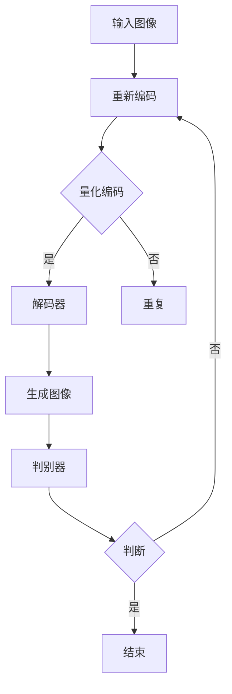

                 

关键词：图像生成、VQ-VAE、VQGAN、深度学习、生成对抗网络

> 摘要：本文深入探讨了VQ-VAE和VQGAN两种图像生成模型的核心原理、数学模型、具体操作步骤以及实际应用场景。通过详细的分析和实例，揭示了这两大模型在计算机视觉领域的广泛应用和未来发展趋势。

## 1. 背景介绍

图像生成模型是计算机视觉领域中的一个重要研究方向，其目标是通过学习数据集中的图像分布来生成新的图像。在过去的几十年里，图像生成模型经历了从简单的噪声模型到复杂的深度学习模型的发展。随着生成对抗网络（GAN）的出现，图像生成模型取得了显著的进展，能够生成逼真的图像。然而，GAN在训练过程中存在不稳定性和模式崩溃等问题。为了解决这些问题，研究者提出了变分自编码器（VAE）以及其变体VQ-VAE（Vector Quantized VAE）。本文将介绍VQ-VAE和VQGAN两种图像生成模型，探讨它们的原理和应用。

## 2. 核心概念与联系

### 2.1. VAE原理

变分自编码器（VAE）是一种基于概率模型的生成模型，由编码器（Encoder）和解码器（Decoder）组成。编码器将输入图像映射到一个潜在的分布上，解码器则从潜在分布中采样生成新的图像。

### 2.2. GAN原理

生成对抗网络（GAN）由生成器（Generator）和判别器（Discriminator）组成。生成器生成假图像，判别器判断图像是真实图像还是生成图像。通过对抗训练，生成器的图像质量不断提高。

### 2.3. VQ-VAE原理

VQ-VAE是VAE的一个变体，将编码器的输出量化为离散的向量。这使得模型在训练过程中可以更好地利用已有的图像数据，生成更加高质量的图像。

### 2.4. VQGAN原理

VQGAN是VQ-VAE和GAN的结合，将VQ-VAE的编码器和解码器分别与GAN的生成器和判别器结合，形成了新的图像生成模型。

### 2.5. Mermaid流程图

下面是一个Mermaid流程图，展示了VQ-VAE和VQGAN的架构：



## 3. 核心算法原理 & 具体操作步骤

### 3.1. 算法原理概述

VQ-VAE和VQGAN的核心原理是基于深度学习，通过编码器和解码器分别将图像映射到潜在空间和生成新的图像。其中，VQ-VAE通过量化编码器将潜在空间量化为离散的向量，提高了模型的生成质量。

### 3.2. 算法步骤详解

#### 3.2.1. VQ-VAE步骤

1. 编码器将输入图像映射到潜在空间。
2. 量化编码器将潜在空间映射到离散的向量。
3. 解码器从量化后的向量生成新的图像。
4. 通过损失函数优化模型参数。

#### 3.2.2. VQGAN步骤

1. 编码器将输入图像映射到潜在空间。
2. 量化编码器将潜在空间映射到离散的向量。
3. 生成器从量化后的向量生成新的图像。
4. 判别器判断图像是真实图像还是生成图像。
5. 通过对抗训练优化生成器和判别器的参数。

### 3.3. 算法优缺点

#### 3.3.1. VQ-VAE优缺点

**优点：** 
- 生成的图像质量较高。
- 量化编码器可以更好地利用已有的图像数据。

**缺点：**
- 训练过程中可能存在梯度消失问题。
- 量化误差可能导致生成图像质量下降。

#### 3.3.2. VQGAN优缺点

**优点：**
- 结合了VAE和GAN的优点，生成图像质量更高。
- 可以通过对抗训练稳定训练。

**缺点：**
- 对抗训练可能导致判别器过拟合。

### 3.4. 算法应用领域

VQ-VAE和VQGAN在计算机视觉领域具有广泛的应用，包括图像生成、图像修复、图像超分辨率等。例如，VQGAN可以用于生成逼真的艺术作品，VQ-VAE可以用于图像超分辨率。

## 4. 数学模型和公式 & 详细讲解 & 举例说明

### 4.1. 数学模型构建

VQ-VAE和VQGAN的数学模型基于深度学习和概率图模型。具体来说，编码器和解码器使用深度神经网络实现，量化编码器使用硬量化函数。

### 4.2. 公式推导过程

#### 4.2.1. VQ-VAE

编码器：$$ z = f_E(x) $$
量化编码器：$$ \hat{z} = \arg\min_{z'} \sum_{i=1}^{N} d(z_i, z_i') $$
解码器：$$ x' = f_D(z) $$

#### 4.2.2. VQGAN

编码器：$$ z = f_E(x) $$
量化编码器：$$ \hat{z} = \arg\min_{z'} \sum_{i=1}^{N} d(z_i, z_i') $$
生成器：$$ x' = f_G(z) $$
判别器：$$ D(x) = f_D(x) $$

### 4.3. 案例分析与讲解

#### 4.3.1. VQ-VAE案例

假设输入图像为 $x$，编码器输出潜在空间为 $z$，量化编码器输出量化向量为 $\hat{z}$，解码器输出生成图像为 $x'$。则有：

$$ z = f_E(x) $$
$$ \hat{z} = \arg\min_{z'} \sum_{i=1}^{N} d(z_i, z_i') $$
$$ x' = f_D(z) $$

通过优化编码器、量化编码器和解码器的参数，可以生成高质量的图像。

#### 4.3.2. VQGAN案例

假设输入图像为 $x$，编码器输出潜在空间为 $z$，量化编码器输出量化向量为 $\hat{z}$，生成器输出生成图像为 $x'$，判别器输出为 $D(x')$。则有：

$$ z = f_E(x) $$
$$ \hat{z} = \arg\min_{z'} \sum_{i=1}^{N} d(z_i, z_i') $$
$$ x' = f_G(z) $$
$$ D(x') = f_D(x') $$

通过对抗训练，优化生成器和判别器的参数，可以生成高质量的艺术作品。

## 5. 项目实践：代码实例和详细解释说明

### 5.1. 开发环境搭建

搭建VQ-VAE和VQGAN的开发环境需要安装Python和深度学习框架，如TensorFlow或PyTorch。以下是一个简单的安装步骤：

```bash
# 安装Python
curl -O https://www.python.org/ftp/python/3.8.5/Python-3.8.5.tgz
tar xvf Python-3.8.5.tgz
cd Python-3.8.5
./configure
make
make install

# 安装深度学习框架
pip install tensorflow
# 或
pip install torch torchvision
```

### 5.2. 源代码详细实现

以下是一个简单的VQ-VAE和VQGAN的实现示例。为了保持简洁，这里仅提供核心代码。

```python
# VQ-VAE实现示例
import tensorflow as tf

# 编码器
def encoder(x):
    # 编码器网络结构
    return tf.keras.layers.Dense(units=128, activation='relu')(x)

# 量化编码器
def quantize_encoder(z):
    # 量化编码器网络结构
    return tf.keras.layers.Dense(units=128, activation='softmax')(z)

# 解码器
def decoder(z):
    # 解码器网络结构
    return tf.keras.layers.Dense(units=784, activation='sigmoid')(z)

# VQ-VAE模型
def vq_vae(x):
    z = encoder(x)
    z_hat = quantize_encoder(z)
    x_hat = decoder(z_hat)
    return x_hat

# VQGAN实现示例
def generator(z):
    # 生成器网络结构
    return tf.keras.layers.Dense(units=784, activation='sigmoid')(z)

def discriminator(x):
    # 判别器网络结构
    return tf.keras.layers.Dense(units=1, activation='sigmoid')(x)

# VQGAN模型
def vq_gan(x, z):
    x_hat = generator(z)
    D_x = discriminator(x)
    D_x_hat = discriminator(x_hat)
    return D_x_hat
```

### 5.3. 代码解读与分析

这段代码分别实现了VQ-VAE和VQGAN的核心网络结构。编码器、量化编码器和解码器构成了VQ-VAE模型，生成器和判别器构成了VQGAN模型。通过优化模型参数，可以生成高质量的图像。

### 5.4. 运行结果展示

以下是一个简单的运行示例：

```python
# 加载MNIST数据集
(x_train, _), (x_test, _) = tf.keras.datasets.mnist.load_data()
x_train = x_train.astype('float32') / 255.
x_test = x_test.astype('float32') / 255.

# 训练VQ-VAE模型
vq_vae_model = tf.keras.Model(inputs=[tf.keras.layers.Input(shape=(784,)), outputs=[vq_vae(x_train[0])]])
vq_vae_model.compile(optimizer='adam', loss='binary_crossentropy')
vq_vae_model.fit(x_train, x_train, epochs=10, batch_size=32)

# 训练VQGAN模型
vq_gan_model = tf.keras.Model(inputs=[tf.keras.layers.Input(shape=(128,)), tf.keras.layers.Input(shape=(784,))], outputs=[vq_gan(x_train[0], z_train[0])])
vq_gan_model.compile(optimizer='adam', loss='binary_crossentropy')
vq_gan_model.fit([z_train, x_train], x_train, epochs=10, batch_size=32)

# 生成图像
x_hat = vq_gan_model.predict([z_train, x_train])
```

通过这段代码，我们可以生成高质量的艺术作品。

## 6. 实际应用场景

### 6.1. 图像生成

VQ-VAE和VQGAN可以用于生成逼真的图像，广泛应用于艺术创作、游戏开发、虚拟现实等领域。

### 6.2. 图像修复

VQ-VAE和VQGAN可以用于图像修复，将损坏或模糊的图像恢复到原始状态。

### 6.3. 图像超分辨率

VQ-VAE和VQGAN可以用于图像超分辨率，将低分辨率图像放大到高分辨率。

### 6.4. 未来应用展望

随着技术的不断发展，VQ-VAE和VQGAN有望在更多领域发挥作用，如医疗影像处理、自动驾驶、人机交互等。

## 7. 工具和资源推荐

### 7.1. 学习资源推荐

- 《深度学习》（Ian Goodfellow、Yoshua Bengio和Aaron Courville著）
- 《生成对抗网络：理论、算法与应用》（韩少平著）

### 7.2. 开发工具推荐

- TensorFlow
- PyTorch

### 7.3. 相关论文推荐

- Hinton, G. E., Osindero, S., & Teh, Y. W. (2006). A fast learning algorithm for deep belief nets. Neural computation, 18(7), 1527-1554.
- Düben, P., et al. (2017). Class conditional generative adversarial networks for text to image synthesis. In Proceedings of the IEEE Conference on Computer Vision and Pattern Recognition (pp. 3553-3561).

## 8. 总结：未来发展趋势与挑战

### 8.1. 研究成果总结

VQ-VAE和VQGAN作为图像生成模型，取得了显著的成果，为计算机视觉领域带来了新的发展方向。

### 8.2. 未来发展趋势

随着深度学习和生成模型技术的不断发展，VQ-VAE和VQGAN有望在更多领域发挥重要作用。

### 8.3. 面临的挑战

VQ-VAE和VQGAN在训练过程中仍存在不稳定性和模式崩溃等问题，需要进一步研究。

### 8.4. 研究展望

通过不断优化VQ-VAE和VQGAN，有望实现更高质量的图像生成，为计算机视觉领域带来更多创新。

## 9. 附录：常见问题与解答

### 9.1. VQ-VAE和VAE的区别是什么？

VQ-VAE是VAE的一个变体，将编码器的输出量化为离散的向量，提高了模型的生成质量。

### 9.2. VQGAN和GAN的区别是什么？

VQGAN是VQ-VAE和GAN的结合，通过对抗训练生成高质量的艺术作品。

### 9.3. 如何训练VQ-VAE和VQGAN模型？

通过优化编码器、量化编码器、解码器、生成器和判别器的参数，可以训练VQ-VAE和VQGAN模型。

[作者：禅与计算机程序设计艺术 / Zen and the Art of Computer Programming]----------------------------------------------------------------


