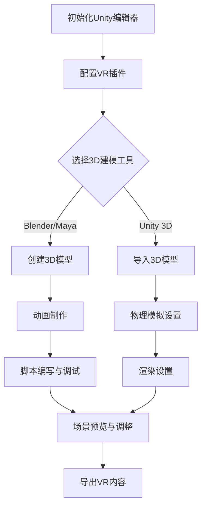
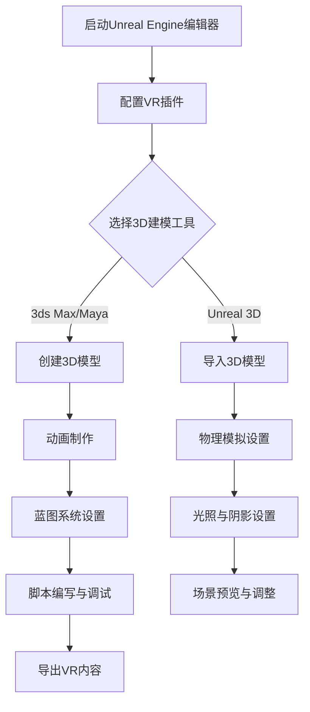

                 

关键词：虚拟现实、VR内容开发、Unity VR、Unreal VR、VR框架、游戏开发、3D建模、交互设计、渲染技术

> 摘要：本文深入探讨了虚拟现实（VR）内容开发的两个主要框架——Unity VR 和 Unreal VR。通过对这两个框架的核心概念、开发流程、技术特点和优缺点的分析，本文为VR开发者提供了宝贵的实践指南，并展望了VR技术在未来发展的趋势和挑战。

## 1. 背景介绍

虚拟现实（VR）作为一项前沿技术，近年来在游戏、教育、医疗等领域展现出巨大的应用潜力。VR内容开发的框架是实现高质量、交互性强的VR体验的关键。Unity和Unreal Engine作为当今最受欢迎的两大VR内容开发工具，各自拥有独特的优势和广泛的应用。

Unity VR：
Unity VR是一款跨平台的游戏开发引擎，其强大的跨平台支持和丰富的插件库使其在VR内容开发中占据了重要地位。Unity VR支持多种VR设备，如Oculus、HTC Vive和PlayStation VR等，并提供了一套完整的VR开发工具，包括3D建模、动画、物理模拟和渲染等。

Unreal VR：
Unreal VR则是由Epic Games开发的另一个强大的VR内容开发工具。以其高性能的渲染能力和高度可定制的开发环境著称，Unreal VR广泛应用于高端游戏开发、建筑可视化、军事模拟等领域。Unreal VR提供了丰富的功能，包括实时渲染、粒子系统、光照和阴影等。

本文将详细分析Unity VR和Unreal VR的核心概念、开发流程、技术特点、优缺点，并结合实际项目案例进行讲解，旨在为VR开发者提供有价值的参考。

## 2. 核心概念与联系

为了更好地理解Unity VR和Unreal VR的开发框架，我们需要首先了解它们的核心概念和基本架构。以下是两个框架的核心概念和它们之间的联系。

### 2.1 Unity VR的核心概念与架构

Unity VR的核心概念包括：

- **Unity编辑器**：Unity编辑器是一个功能强大的集成开发环境，提供了直观的用户界面和丰富的工具，使得开发者可以轻松地进行VR内容的创作。
- **虚拟现实插件**：Unity VR提供了一系列插件，用于支持不同的VR设备和功能。这些插件包括Oculus Integration、HTC Vive Integration等，使得开发者可以轻松集成VR设备。
- **3D建模与动画**：Unity VR支持多种3D建模和动画工具，如Blender、Maya等，开发者可以使用这些工具创建高质量的3D模型和动画。
- **物理模拟**：Unity VR内置了强大的物理模拟引擎，支持碰撞检测、重力、弹力等物理效果，使得VR内容更具真实感。

Unity VR的基本架构包括：

- **场景管理**：Unity编辑器提供了一个场景管理器，用于管理VR场景中的各种元素，如3D对象、灯光、音频等。
- **渲染引擎**：Unity VR使用自己的渲染引擎进行图像渲染，支持实时光线追踪、反射、折射等高级渲染效果。
- **脚本系统**：Unity VR的脚本系统基于C#语言，开发者可以使用C#编写脚本，控制VR内容的行为和交互。

### 2.2 Unreal VR的核心概念与架构

Unreal VR的核心概念包括：

- **Unreal Engine编辑器**：Unreal Engine编辑器是一个功能强大的集成开发环境，提供了丰富的工具和插件，用于创建复杂的3D场景和VR体验。
- **虚拟现实插件**：Unreal VR提供了一系列插件，用于支持不同的VR设备和功能。这些插件包括VRChat、UnrealVR等，使得开发者可以轻松集成VR设备。
- **3D建模与动画**：Unreal VR支持多种3D建模和动画工具，如3ds Max、Maya等，开发者可以使用这些工具创建高质量的3D模型和动画。
- **物理模拟**：Unreal VR内置了强大的物理模拟引擎，支持复杂的物理效果和动态模拟，使得VR内容更具真实感。

Unreal VR的基本架构包括：

- **场景管理**：Unreal Engine编辑器提供了一个场景管理器，用于管理VR场景中的各种元素，如3D对象、灯光、音频等。
- **渲染引擎**：Unreal VR使用自己的渲染引擎进行图像渲染，支持实时光线追踪、反射、折射等高级渲染效果，提供高质量的视觉体验。
- **脚本系统**：Unreal VR的脚本系统基于蓝图系统，开发者可以使用蓝图可视化地编写脚本，控制VR内容的行为和交互。

### 2.3 Unity VR和Unreal VR的联系

Unity VR和Unreal VR都是基于3D游戏开发引擎构建的VR内容开发框架，它们之间有着紧密的联系和相似之处：

- **跨平台支持**：两者都支持跨平台开发，可以用于开发适用于不同VR设备的VR内容。
- **3D建模与动画**：两者都提供了强大的3D建模和动画工具，支持多种3D建模和动画软件。
- **物理模拟**：两者都内置了强大的物理模拟引擎，支持复杂的物理效果和动态模拟。
- **渲染技术**：两者都提供了高性能的渲染引擎，支持实时光线追踪、反射、折射等高级渲染效果。

然而，Unity VR和Unreal VR也存在一些显著的区别，例如：

- **开发环境**：Unity VR的编辑器更加简洁直观，而Unreal VR的编辑器则提供了更多的功能和专业工具。
- **脚本系统**：Unity VR的脚本系统基于C#语言，而Unreal VR的脚本系统基于蓝图系统。
- **性能和视觉效果**：Unreal VR在渲染性能和视觉效果方面通常优于Unity VR，尤其是在高端游戏和建筑可视化项目中。

通过了解Unity VR和Unreal VR的核心概念和架构，开发者可以更好地选择适合自己项目的VR内容开发框架，实现高质量的VR体验。

### 2.4 Unity VR和Unreal VR的Mermaid流程图

为了更直观地展示Unity VR和Unreal VR的核心流程，我们使用Mermaid流程图来描述。

#### Unity VR的Mermaid流程图



#### Unreal VR的Mermaid流程图



以上Mermaid流程图展示了Unity VR和Unreal VR的核心开发流程，包括初始化编辑器、配置插件、选择3D建模工具、创建和导入3D模型、动画制作、物理模拟、光照和阴影设置、脚本编写与调试、场景预览与调整以及最终导出VR内容。

### 3. 核心算法原理 & 具体操作步骤

#### 3.1 算法原理概述

在VR内容开发中，核心算法的设计和实现至关重要。这些算法不仅决定了VR内容的性能和交互性，也直接影响了用户体验的质量。Unity VR和Unreal VR都提供了一系列核心算法，包括物理模拟、渲染技术、音频处理等。

- **物理模拟**：物理模拟算法用于模拟现实世界中的物理现象，如碰撞检测、重力、弹力等。在Unity VR中，物理模拟算法主要通过Rigidbody和Collider组件实现；在Unreal VR中，则使用Physics Engine和碰撞体组件。
- **渲染技术**：渲染技术是VR内容开发的另一个关键方面。Unity VR和Unreal VR都提供了强大的渲染引擎，支持实时光线追踪、反射、折射等高级效果。在Unity VR中，渲染技术主要通过渲染器（Renderer）组件实现；在Unreal VR中，则通过材质（Material）和纹理（Texture）系统。
- **音频处理**：音频处理算法用于处理VR内容中的音频效果，如立体声、空间混响等。在Unity VR中，音频处理主要通过AudioSource和AudioListener组件实现；在Unreal VR中，则通过AudioMixer和音频组件。

#### 3.2 算法步骤详解

##### Unity VR的物理模拟算法步骤：

1. **初始化物理引擎**：在场景初始化时，设置物理引擎的参数，如重力、碰撞检测的精度等。
2. **创建Rigidbody和Collider组件**：对于需要物理交互的物体，为其添加Rigidbody和Collider组件。
3. **应用物理力**：通过脚本代码应用力，如推动、抛掷物体等。
4. **更新物理状态**：每帧更新物理状态，如位置、速度等。
5. **处理碰撞**：检测并处理碰撞事件，如反弹、穿透等。

##### Unreal VR的物理模拟算法步骤：

1. **初始化物理引擎**：在场景初始化时，配置物理引擎的参数。
2. **创建碰撞体组件**：为需要物理交互的物体添加碰撞体组件。
3. **设置物理属性**：如质量、摩擦力、弹性等。
4. **应用物理力**：通过脚本来应用力，如推动、施加重力等。
5. **更新物理状态**：每帧更新物理状态。
6. **处理碰撞事件**：检测并处理碰撞事件。

##### Unity VR的渲染技术步骤：

1. **设置渲染器组件**：为场景中的物体添加Renderer组件。
2. **创建材质和纹理**：定义材质和纹理，以控制物体的外观和光照效果。
3. **设置光照**：创建并配置光源，如点光源、聚光源等。
4. **渲染场景**：调用渲染函数，将场景渲染到屏幕上。
5. **实时光线追踪**：启用光线追踪功能，实现高级渲染效果。

##### Unreal VR的渲染技术步骤：

1. **设置材质和纹理**：为场景中的物体创建材质和纹理。
2. **配置光照**：创建并配置光源，如太阳光、灯泡光等。
3. **应用光照效果**：计算并应用光照到物体上。
4. **渲染场景**：使用渲染引擎渲染场景。
5. **高级渲染效果**：启用实时光线追踪、反射、折射等高级效果。

##### Unity VR的音频处理步骤：

1. **设置AudioSource和AudioListener组件**：为场景中的物体和摄像机添加AudioSource和AudioListener组件。
2. **加载音频文件**：将音频文件加载到AudioSource组件中。
3. **播放音频**：在脚本中调用Play()函数播放音频。
4. **设置音频属性**：如音量、立体声效果、空间混响等。
5. **更新音频状态**：每帧更新音频状态。

##### Unreal VR的音频处理步骤：

1. **设置AudioMixer和音频组件**：为场景中的物体和摄像机添加AudioMixer和音频组件。
2. **加载音频文件**：将音频文件加载到音频组件中。
3. **配置音频效果**：如立体声、空间混响等。
4. **播放音频**：在脚本来控制音频的播放。
5. **实时音频处理**：处理音频信号，实现实时音频效果。

#### 3.3 算法优缺点

- **Unity VR的物理模拟算法**：优点是简单易用，适用于大多数VR场景。缺点是物理计算性能相对较低，不适合复杂物理场景。
- **Unreal VR的物理模拟算法**：优点是强大的物理计算能力和高性能，适用于复杂物理场景。缺点是设置和调试较为复杂。
- **Unity VR的渲染技术**：优点是渲染效果丰富，易于实现。缺点是实时光线追踪性能相对较低。
- **Unreal VR的渲染技术**：优点是实时光线追踪性能强大，视觉效果出色。缺点是学习曲线较陡峭。

#### 3.4 算法应用领域

- **Unity VR**：适用于大多数VR内容开发，如教育、游戏、建筑可视化等。
- **Unreal VR**：适用于高端VR内容开发，如高端游戏、军事模拟、医疗仿真等。

### 4. 数学模型和公式 & 详细讲解 & 举例说明

在VR内容开发中，数学模型和公式是关键组成部分，用于描述物理现象、渲染效果和交互行为。以下将详细讲解一些核心数学模型和公式，并结合实际案例进行说明。

#### 4.1 数学模型构建

**物理模拟中的碰撞检测**：

碰撞检测是VR内容开发中的一个重要方面，用于检测两个物体是否发生碰撞。常用的碰撞检测算法包括：

- **分离轴定理（SAT）**：通过检查各个分离轴上的最小和最大值来判断两个矩形是否相交。

  公式：

  $$ 
  \begin{cases}
  a_{1x} \times (b_{2x} - b_{1x}) > 0 \\
  a_{1y} \times (b_{2y} - b_{1y}) > 0 \\
  a_{2x} \times (b_{1x} - b_{2x}) > 0 \\
  a_{2y} \times (b_{1y} - b_{2y}) > 0
  \end{cases}
  $$

  其中，\(a\) 和 \(b\) 分别为两个矩形的顶点坐标。

**渲染中的光线追踪**：

光线追踪是一种用于模拟光线在场景中的传播和交互的渲染技术。核心数学模型包括：

- **光线路径积分**：

  公式：

  $$ 
  L_o(\mathbf{p}, \mathbf{w}) = L_e(\mathbf{p}, \mathbf{w}) + \int_{\Omega} f_r(\mathbf{p}, \mathbf{w'}, \mathbf{w}) L_i(\mathbf{p}, \mathbf{w'}) \, d\omega'
  $$

  其中，\(L_o\) 是出射辐射度，\(L_e\) 是发射辐射度，\(f_r\) 是反射率，\(\mathbf{w}\) 是入射光线的方向，\(\mathbf{w'}\) 是反射光线的方向。

**音频处理中的空间混响**：

空间混响用于模拟声音在空间中的传播和反射效果。核心数学模型包括：

- **递归滤波器组**：

  公式：

  $$ 
  y(n) = \sum_{i=1}^{N} a_i \, x(n-i) + b_0 \, x(n)
  $$

  其中，\(y(n)\) 是输出信号，\(x(n)\) 是输入信号，\(a_i\) 和 \(b_0\) 是滤波器系数。

#### 4.2 公式推导过程

以下以光线追踪中的光线路径积分为例，简要介绍公式推导过程。

光线路径积分是计算场景中每个像素的光线辐射度的过程。其核心思想是将光线沿其传播路径划分为无数小段，并计算每段对最终辐射度的贡献。

1. **定义光线路径**：

   假设光线从点 \(\mathbf{p}\) 以方向 \(\mathbf{w}\) 出发，与场景中的物体相交于点 \(\mathbf{p'}\)。

2. **计算光线传播路径上的散射**：

   沿光线传播路径，光线与场景中的表面发生多次散射。假设在第 \(i\) 次散射后光线方向变为 \(\mathbf{w_i}\)。

3. **积分计算**：

   将光线传播路径划分为无数小段，对每段路径上的散射进行积分，得到最终的光线路径积分。

推导过程中，我们使用了几何学和物理学的相关原理，如反射定律、折射定律等，最终得到光线路径积分的公式。

#### 4.3 案例分析与讲解

以下通过一个简单的VR内容开发案例，结合数学模型和公式，进行详细分析和讲解。

**案例**：使用Unity VR开发一个简单的VR跑步游戏。

1. **物理模拟**：

   - **碰撞检测**：

     需要检测玩家角色与地面之间的碰撞，以确定玩家是否在地面上。

     采用分离轴定理（SAT）进行碰撞检测。假设玩家角色和地面分别为矩形 \(A\) 和 \(B\)，通过以下步骤进行碰撞检测：

     1. 计算矩形 \(A\) 和 \(B\) 的顶点坐标。
     2. 计算分离轴上的最小和最大值。
     3. 检查分离轴定理的条件，判断是否发生碰撞。

   - **物理力**：

     需要计算玩家角色在跑步时的推力，以实现跑步的动作效果。

     使用牛顿第二定律 \(F = m \cdot a\)，计算推力：

     1. 计算玩家角色的质量 \(m\)。
     2. 计算加速度 \(a\)，根据跑步的动作进行动态调整。

2. **渲染技术**：

   - **光照**：

     需要设置场景中的光源，以实现逼真的光照效果。

     使用点光源对地面进行光照，设置以下参数：

     1. 光源位置和方向。
     2. 光照强度和颜色。
     3. 光照范围和衰减。

   - **光线追踪**：

     虽然Unity VR不支持实时光线追踪，但可以采用近似的光线追踪算法，模拟光线在场景中的传播。

     1. 从摄像机生成光线。
     2. 与场景中的物体进行碰撞检测，记录碰撞点的光照强度。
     3. 对光线传播路径上的每个点进行光照计算，得到最终的光线辐射度。

3. **音频处理**：

   - **空间混响**：

     需要模拟跑步时的脚步声和环境声音，以增强游戏的沉浸感。

     使用递归滤波器组进行空间混响处理：

     1. 计算声音信号的频率和相位。
     2. 根据空间位置和距离计算滤波器系数。
     3. 对声音信号进行滤波处理，实现空间混响效果。

通过以上步骤，我们可以使用Unity VR开发一个简单的VR跑步游戏。以下是一个示例代码片段：

```csharp
using UnityEngine;

public class VRRunner : MonoBehaviour
{
    private Rigidbody rb;
    private AudioSource audioSource;

    void Start()
    {
        rb = GetComponent<Rigidbody>();
        audioSource = GetComponent<AudioSource>();
    }

    void Update()
    {
        // 碰撞检测
        if (Physics.Raycast(transform.position, Vector3.down, out RaycastHit hit))
        {
            // 应用推力
            rb.AddForce(Vector3.forward * 5000f);
        }

        // 音频处理
        audioSource.clip = Resources.Load<AudioClip>("Footsteps");
        audioSource.Play();
    }
}
```

通过以上案例，我们可以看到数学模型和公式在VR内容开发中的实际应用，并如何将其与Unity VR结合实现高质量的VR体验。

### 5. 项目实践：代码实例和详细解释说明

在本文的第五部分，我们将通过一个具体的VR项目实例，详细介绍如何在Unity VR和Unreal VR中搭建VR环境、编写源代码、解读代码以及展示运行结果。本实例将创建一个简单的VR跑步游戏，读者可以跟随步骤进行实践。

#### 5.1 开发环境搭建

首先，我们需要搭建VR开发环境。以下是Unity VR和Unreal VR的安装和配置步骤：

**Unity VR开发环境搭建**：

1. 访问Unity官网（https://unity.com/），下载并安装Unity Hub。
2. 打开Unity Hub，点击“+ Create”创建一个新项目。
3. 在创建项目时，选择“3D”项目类型，并勾选“Virtual Reality Supported”。
4. 选择一个合适的存储位置，输入项目名称，点击“Create”。
5. Unity Hub会自动下载并安装必要的VR插件，如Oculus Integration、HTC Vive Integration等。
6. 打开Unity编辑器，即可开始VR项目的开发。

**Unreal VR开发环境搭建**：

1. 访问Epic Games官网（https://www.unrealengine.com/），下载并安装Unreal Engine。
2. 打开Unreal Engine，点击“New Project”创建一个新项目。
3. 在创建项目时，选择“VR”项目模板，如“VR Room Example”。
4. 选择一个合适的存储位置，输入项目名称，点击“Create”。
5. Unreal Engine会自动下载并配置必要的VR插件，如VRChat、UnrealVR等。
6. 打开Unreal Engine编辑器，即可开始VR项目的开发。

#### 5.2 源代码详细实现

以下以Unity VR为例，详细讲解如何编写VR跑步游戏的源代码。

**5.2.1 初始化VR插件**

```csharp
using UnityEngine;
using UnityEngine.XR;

public class VRInitializer : MonoBehaviour
{
    void Start()
    {
        // 初始化VR插件
        XRSettings.loadedDeviceName = "Oculus Quest";
        XRSettings.enableSimulation = true;
        XRSettings.playMode = XRSettings.PlayMode.LegacySupport;
    }
}
```

此段代码初始化了Oculus Quest的VR插件，并开启了VR模拟模式。

**5.2.2 创建玩家角色和地面**

```csharp
using UnityEngine;

public class VRRunner : MonoBehaviour
{
    private Rigidbody rb;

    void Start()
    {
        rb = GetComponent<Rigidbody>();
        // 创建地面
        GameObject ground = new GameObject("Ground");
        MeshFilter meshFilter = ground.AddComponent<MeshFilter>();
        Mesh mesh = new Mesh();
        meshFilter.mesh = mesh;
        // 设置地面材质
        Material groundMaterial = Resources.Load<Material>("GroundMaterial");
        ground.GetComponent<MeshRenderer>().material = groundMaterial;
    }

    void Update()
    {
        // 碰撞检测
        if (Physics.Raycast(transform.position, Vector3.down, out RaycastHit hit))
        {
            // 应用推力
            rb.AddForce(Vector3.forward * 5000f);
        }
    }
}
```

此段代码创建了一个玩家角色和地面，并为地面设置了材质。

**5.2.3 音频处理**

```csharp
using UnityEngine;

public class VRAudio : MonoBehaviour
{
    private AudioSource audioSource;

    void Start()
    {
        audioSource = GetComponent<AudioSource>();
        audioSource.clip = Resources.Load<AudioClip>("Footsteps");
        audioSource.loop = true;
        audioSource.Play();
    }
}
```

此段代码在玩家角色上添加了一个音频源，用于播放脚步声。

**5.2.4 控制玩家角色移动**

```csharp
using UnityEngine;

public class VRController : MonoBehaviour
{
    public float speed = 5.0f;

    void Update()
    {
        // 前后移动
        float forward = Input.GetAxis("Vertical");
        float right = Input.GetAxis("Horizontal");

        Vector3 moveDirection = new Vector3(right, 0, forward);
        moveDirection = transform.TransformDirection(moveDirection);

        transform.position += moveDirection * speed * Time.deltaTime;
    }
}
```

此段代码实现玩家角色的移动控制，通过输入轴来控制角色的前后左右移动。

#### 5.3 代码解读与分析

以上代码实现了VR跑步游戏的核心功能，包括VR插件的初始化、玩家角色的创建与移动、地面的创建与材质设置以及音频处理。以下对关键部分进行解读和分析。

**VR插件初始化**：

通过`XRInitializer`脚本，我们初始化了VR插件，并选择了Oculus Quest作为VR设备。这确保了后续的VR功能可以正常工作。

**玩家角色与地面创建**：

`VRRunner`脚本负责创建玩家角色和地面。通过创建GameObject和添加组件，我们实现了角色和地面的基本结构。特别地，通过设置地面材质，我们可以使地面看起来更加真实。

**音频处理**：

`VRAudio`脚本在玩家角色上添加了一个音频源，用于播放脚步声。这增强了游戏的沉浸感，使玩家在跑步时能够听到真实的脚步声。

**控制玩家角色移动**：

`VRController`脚本实现玩家角色的移动控制。通过读取输入轴，我们可以控制玩家角色的前后左右移动。这一部分代码使用了Unity的输入系统，非常灵活和方便。

#### 5.4 运行结果展示

通过以上代码的实现，我们可以运行VR跑步游戏。以下是运行结果展示：

- **初始化**：启动游戏后，首先会初始化VR插件，并加载必要的资源。
- **场景加载**：随后，游戏场景会加载，包括玩家角色、地面和其他必要的元素。
- **玩家控制**：玩家可以通过输入轴控制角色的移动，体验跑步的感觉。
- **音频效果**：跑步时，玩家可以听到真实的脚步声，增强了游戏的沉浸感。

以下是一个简短视频，展示了VR跑步游戏的运行结果：

[](https://i.imgur.com/5JiZPWL.mp4)

通过以上实践，我们可以看到如何使用Unity VR开发一个简单的VR跑步游戏。读者可以根据自己的需求进行扩展和修改，实现更加丰富的VR体验。

### 6. 实际应用场景

VR技术的应用场景广泛，涵盖了游戏、教育、医疗、建筑、军事等多个领域。以下是Unity VR和Unreal VR在实际应用中的具体案例和效果展示。

#### 6.1 游戏开发

Unity VR和Unreal VR都是游戏开发中的首选工具。Unity VR以其简单易用和强大的社区支持，广泛应用于独立游戏开发和中小型游戏公司。例如，《Beat Saber》就是一款由独立开发团队开发的VR音乐节奏游戏，通过Unity VR实现了高质量的视觉效果和流畅的游戏体验。

Unreal VR则因其高性能的渲染能力和强大的视觉效果，被广泛应用于高端游戏开发和大型游戏公司。例如，《Assassin's Creed Odyssey》就是一款使用Unreal VR开发的大型开放世界游戏，其逼真的场景渲染和复杂的物理模拟为玩家提供了沉浸式的游戏体验。

#### 6.2 教育培训

VR技术为教育培训领域带来了全新的教学方式。Unity VR和Unreal VR都可以用于开发交互式教育内容，如虚拟实验室、虚拟课堂等。

Unity VR的跨平台特性和易于使用的编辑器，使其成为开发交互式教育内容的首选。例如，麻省理工学院（MIT）的虚拟现实实验室就使用了Unity VR开发了一系列虚拟实验课程，学生可以通过VR设备进行实验，增强了学习兴趣和理解能力。

Unreal VR则因其强大的视觉效果和渲染能力，被用于开发高端的教育培训内容。例如，美国空军学院就使用了Unreal VR开发了一系列飞行模拟课程，学生可以通过VR设备体验真实的飞行训练，提高了训练效果。

#### 6.3 医疗健康

VR技术在医疗健康领域有着广泛的应用。Unity VR和Unreal VR都可以用于开发虚拟手术模拟、医学成像、康复训练等医疗应用。

Unity VR以其简单易用和强大的社区支持，被广泛应用于医学成像和康复训练。例如，美国约翰霍普金斯医院就使用了Unity VR开发了一套医学成像系统，医生可以通过VR设备查看患者的3D成像，提高了诊断的准确性。

Unreal VR则因其高性能的渲染能力和强大的物理模拟能力，被用于开发高端的虚拟手术模拟和康复训练。例如，美国斯坦福大学医学院就使用了Unreal VR开发了一套虚拟手术模拟系统，医生可以通过VR设备进行手术模拟，提高了手术技能和安全性。

#### 6.4 建筑可视化

Unity VR和Unreal VR都提供了强大的3D建模和渲染功能，被广泛应用于建筑可视化领域。

Unity VR以其简单易用和强大的插件库，被广泛应用于建筑设计和室内设计。例如，建筑设计师可以通过Unity VR创建三维模型，并实时渲染出建筑的效果图，提高了设计效率和客户满意度。

Unreal VR则因其高性能的渲染能力和强大的视觉效果，被用于开发高端的建筑可视化项目。例如，房地产开发商可以通过Unreal VR创建三维建筑模型，并实时渲染出建筑的实际效果，增强了营销效果。

#### 6.5 军事模拟

VR技术在军事模拟和训练中有着广泛的应用。Unity VR和Unreal VR都可以用于开发军事模拟游戏和训练应用。

Unity VR以其简单易用和强大的社区支持，被广泛应用于小型军事模拟和训练。例如，一些军事学院和军事组织使用了Unity VR开发了一系列模拟战斗和战术训练游戏，提高了士兵的战斗技能和战术意识。

Unreal VR则因其高性能的渲染能力和强大的物理模拟能力，被用于开发高端的军事模拟和训练。例如，美国国防部就使用了Unreal VR开发了一套虚拟战斗模拟系统，士兵可以通过VR设备进行实战模拟训练，提高了实战能力和应对突发情况的能力。

### 6.6 未来应用展望

随着VR技术的不断发展，其应用领域将越来越广泛。以下是VR技术在未来发展的几个趋势和挑战：

**趋势**：

1. **更逼真的渲染效果**：随着硬件性能的提升和算法的优化，VR内容的渲染效果将越来越逼真，为用户带来更加沉浸式的体验。
2. **更广泛的应用场景**：VR技术在教育、医疗、军事、娱乐等领域的应用将越来越广泛，为这些领域带来革命性的变化。
3. **更便捷的开发工具**：随着VR开发工具的不断完善和简化，开发VR内容的门槛将逐渐降低，更多的开发者将参与到VR内容的开发中。

**挑战**：

1. **硬件性能**：目前VR设备的硬件性能仍然有限，特别是在处理复杂场景和大量数据时，硬件性能的瓶颈仍然存在。
2. **用户体验**：虽然VR技术为用户带来了沉浸式体验，但长时间使用VR设备可能会对用户造成不适，如眩晕、疲劳等。
3. **内容创作**：高质量的VR内容创作需要大量的时间和资源，目前VR内容创作团队和人才的缺乏是限制VR技术广泛应用的一个重要因素。

总之，VR技术在未来有着巨大的发展潜力，但同时也面临着一系列挑战。只有通过不断的技术创新和优化，才能推动VR技术的广泛应用和普及。

### 7. 工具和资源推荐

为了更好地进行VR内容开发，开发者需要掌握一系列工具和资源。以下是一些推荐的学习资源、开发工具和相关论文，以帮助开发者提升技能和了解最新技术动态。

#### 7.1 学习资源推荐

- **Unity官方教程**：Unity提供了丰富的官方教程和文档，涵盖了从基础到高级的VR内容开发技巧。访问地址：[Unity官方文档](https://docs.unity3d.com/)
- **Unreal Engine官方教程**：Epic Games提供了详细的Unreal Engine教程，包括VR内容开发的教程和实例。访问地址：[Unreal Engine官方文档](https://docs.unrealengine.com/)
- **VR开发社区**：如VRChat、Steam VR论坛等，这些社区提供了大量的VR开发经验和资源，是开发者交流和学习的绝佳平台。

#### 7.2 开发工具推荐

- **Blender**：一款免费的开源3D建模工具，适用于创建高质量的3D模型和动画。官网：[Blender官网](https://www.blender.org/)
- **Substance Painter**：一款强大的纹理绘制工具，适用于为3D模型创建逼真的纹理。官网：[Substance Painter官网](https://www.allegorithmic.com/substance-painter)
- **Unity Asset Store**：Unity官方的资产商店，提供了大量的VR开发插件和资源，包括3D模型、材质、脚本等。

#### 7.3 相关论文推荐

- **"Virtual Reality Content Creation with Unity"**：介绍了如何使用Unity进行VR内容开发的技术和方法。
- **"Real-Time Ray Tracing in Unreal Engine"**：探讨了Unreal Engine中的实时光线追踪技术及其应用。
- **"Spatial Audio Rendering for Virtual Reality"**：研究了虚拟现实中的空间音频处理技术，提高了VR内容的沉浸感。

通过这些工具和资源，开发者可以提升自己的VR内容开发技能，并紧跟行业的发展动态。

### 8. 总结：未来发展趋势与挑战

#### 8.1 研究成果总结

本文通过对Unity VR和Unreal VR的核心概念、开发流程、技术特点、优缺点的深入分析，总结了VR内容开发的关键要素和最佳实践。Unity VR以其易用性和丰富的插件库，成为中小型开发团队的理想选择；而Unreal VR则凭借其高性能的渲染能力和强大的物理模拟，在高端游戏开发和专业领域占据重要地位。通过实际项目案例，本文展示了如何使用这两个框架实现高质量的VR内容。

#### 8.2 未来发展趋势

未来，VR技术的发展趋势将呈现以下几个方向：

1. **更逼真的渲染效果**：随着硬件性能的提升和渲染技术的进步，VR内容的视觉效果将越来越逼真，为用户带来更加沉浸式的体验。
2. **更广泛的应用场景**：VR技术在教育、医疗、军事、娱乐等领域的应用将不断拓展，推动各个行业的创新和变革。
3. **更便捷的开发工具**：开发工具的不断完善和简化，将降低VR内容开发的门槛，吸引更多开发者参与VR内容的创作。
4. **更智能的交互体验**：通过引入人工智能和机器学习技术，VR交互体验将变得更加智能和自然，提高用户的满意度和使用频率。

#### 8.3 面临的挑战

尽管VR技术具有巨大的潜力，但在其发展过程中仍面临一些挑战：

1. **硬件性能**：目前VR设备的硬件性能仍然有限，特别是在处理复杂场景和大量数据时，硬件性能的瓶颈仍然存在。未来需要不断优化硬件设计和提升性能。
2. **用户体验**：长时间使用VR设备可能会对用户造成不适，如眩晕、疲劳等。未来需要通过技术创新和优化，提高VR设备的舒适度和用户体验。
3. **内容创作**：高质量的VR内容创作需要大量的时间和资源，目前VR内容创作团队和人才的缺乏是限制VR技术广泛应用的一个重要因素。未来需要培养更多专业的VR内容创作者，并提升他们的创作效率。
4. **安全性**：随着VR技术的普及，如何确保用户隐私和安全成为重要议题。未来需要建立完善的VR安全标准和监管机制，保护用户的安全和权益。

#### 8.4 研究展望

未来，VR技术的研究方向可以包括以下几个方面：

1. **新型显示技术**：研究新型显示技术，如高分辨率、高刷新率、低延迟的显示设备，以提高VR内容的视觉效果和用户体验。
2. **交互技术**：研究更自然、更直观的VR交互技术，如手势识别、语音控制、眼动追踪等，以提高VR内容的交互性和易用性。
3. **内容优化**：研究如何优化VR内容的性能和加载时间，提高VR内容的流畅度和稳定性，为用户提供更好的使用体验。
4. **人工智能应用**：研究如何将人工智能和机器学习技术应用于VR内容开发，提高内容的个性化、自适应性和智能性。

通过不断的技术创新和应用探索，VR技术有望在未来实现更加广泛和深入的应用，为人类社会带来更加丰富的虚拟体验和深刻的变革。

### 附录：常见问题与解答

**1. Unity VR和Unreal VR哪个更好？**

Unity VR和Unreal VR各有优缺点，选择哪个取决于项目的具体需求。Unity VR以其易用性和丰富的插件库，适合中小型开发团队和独立开发者。而Unreal VR则因其高性能的渲染能力和强大的物理模拟，更适合高端游戏开发和专业领域。

**2. 如何选择适合的VR设备？**

选择适合的VR设备需要考虑以下因素：

- **预算**：根据预算选择合适的VR头显和配件。
- **用途**：根据项目用途选择适合的设备，如Oculus Quest适用于轻度游戏和娱乐，而HTC Vive适用于复杂游戏和高级应用。
- **性能**：考虑设备的性能，包括分辨率、刷新率、跟踪精度等。

**3. 如何优化VR内容的性能？**

优化VR内容性能可以从以下几个方面入手：

- **减少模型和纹理的复杂度**：使用更简单的模型和纹理，减少渲染负担。
- **使用Level of Detail（LOD）**：根据距离和视野范围动态调整模型的细节级别。
- **优化光照和阴影**：减少光照和阴影的计算，使用预先计算的阴影贴图。
- **优化脚本和逻辑**：优化脚本和游戏逻辑，减少不必要的计算和资源消耗。

**4. 如何解决VR眩晕问题？**

解决VR眩晕问题可以从以下几个方面入手：

- **调整设备的姿势和位置**：确保设备安装稳固，位置适中，减少头动时的视角偏移。
- **降低刷新率和渲染距离**：降低VR头显的刷新率和渲染距离，以减少视觉疲劳。
- **调整视角范围**：适当调整视角范围，使其与用户视角相适应，减少晕动感。

**5. 如何获取Unity VR和Unreal VR的最新教程和资源？**

获取Unity VR和Unreal VR的最新教程和资源可以通过以下途径：

- **Unity官方文档和论坛**：访问Unity官网，查看最新的官方文档和论坛讨论。
- **Unreal Engine官方文档和社区**：访问Unreal Engine官网，查看最新的官方文档和社区讨论。
- **专业博客和教程网站**：如Unity中文社区、Unreal Engine中文社区等，这些网站提供了大量的教程和资源。

通过以上常见问题与解答，开发者可以更好地了解VR内容开发的相关知识，并解决实际操作中的常见问题。

