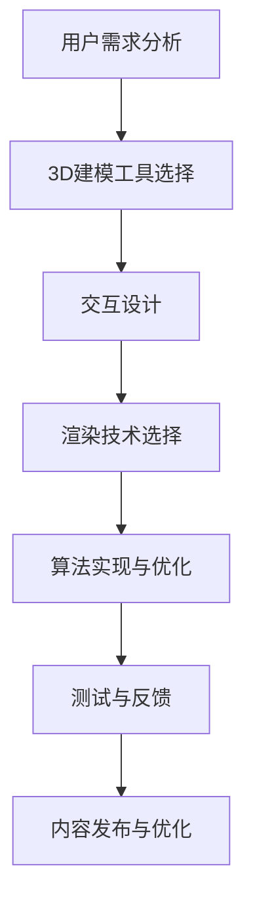

                 

关键词：虚拟现实，VR内容开发，Oculus Rift，SteamVR，交互设计，3D建模，渲染技术

## 摘要

本文将深入探讨虚拟现实（VR）内容开发，特别是针对Oculus Rift和SteamVR平台。我们将首先介绍VR的基本概念及其对交互设计和3D建模的影响。随后，文章将详细解析VR内容开发的算法原理，包括渲染技术和交互设计的方法。此外，我们将通过具体实例展示如何搭建开发环境，编写源代码，并对代码进行解读和分析。最后，文章将探讨VR内容开发在实际应用场景中的表现，并对其未来发展进行展望。

## 1. 背景介绍

虚拟现实（VR）是一种通过计算机模拟实现的虚拟环境，使用户能够沉浸其中，与虚拟世界进行交互。Oculus Rift和SteamVR是目前最受欢迎的两个VR头戴显示器（HMD）品牌。Oculus Rift由Facebook公司支持，以其出色的视觉效果和沉浸感著称。而SteamVR则依托于Steam平台的庞大用户基础，提供了广泛的VR游戏和应用。

VR内容开发是指为VR平台创建各种类型的内容，如游戏、教育应用、虚拟旅游等。这一领域的发展对于提升用户体验至关重要。随着技术的进步，VR内容的质量和数量都在不断增加，为用户提供了更加丰富的虚拟世界体验。

### 1.1 VR技术的兴起

虚拟现实技术的概念早在20世纪50年代就已经提出，但直到21世纪初，随着计算机图形学和传感器技术的飞速发展，VR才开始真正普及。Oculus VR公司在2012年发布的Rift原型机标志着VR技术的重大突破。Rift的成功引发了大量投资和研发，推动了整个VR产业的快速发展。

### 1.2 Oculus Rift和SteamVR的对比

Oculus Rift以其高分辨率的显示和低延迟的追踪系统在市场上脱颖而出。它采用了双瞳距调节功能，确保不同用户的视觉体验一致。而SteamVR则依托于Valve公司的VR追踪技术和丰富的游戏库，为用户提供了一种多样化的VR体验。

### 1.3 VR内容开发的重要性

VR内容开发是VR技术发展的核心驱动力。高质量的内容能够吸引用户，推动VR设备的普及。同时，丰富的内容也能够促进VR技术的创新，推动整个行业向前发展。

## 2. 核心概念与联系

在探讨VR内容开发之前，我们需要了解一些核心概念和它们之间的联系。以下是一个使用Mermaid绘制的流程图，展示VR内容开发的主要组成部分：



### 2.1 用户需求分析

用户需求分析是VR内容开发的第一步。通过研究目标用户群体，我们可以了解他们的需求和偏好。这一过程可以帮助我们确定内容类型、难度级别、功能特点等。

### 2.2 3D建模工具选择

3D建模是VR内容开发的关键环节。选择合适的3D建模工具对于确保内容质量至关重要。常见的3D建模工具有Blender、3ds Max、Maya等。

### 2.3 交互设计

交互设计是用户体验的核心。通过精心设计的交互方式，用户能够更加自然地与虚拟世界进行互动。常见的交互设计方法包括手势识别、语音控制、眼动追踪等。

### 2.4 渲染技术选择

渲染技术决定了VR内容的外观和视觉效果。选择合适的渲染技术可以提升内容的视觉质量，如实时渲染、光线追踪、全局光照等。

### 2.5 算法实现与优化

算法实现和优化是VR内容开发的核心技术。通过高效的算法，我们可以实现更加流畅的交互和逼真的视觉效果。常见的算法包括物理引擎、AI智能体、图像处理算法等。

### 2.6 测试与反馈

测试与反馈是确保VR内容质量的重要环节。通过反复测试和用户反馈，我们可以不断优化内容，提升用户体验。

### 2.7 内容发布与优化

内容发布与优化是VR内容开发的最后一步。通过优化内容结构和性能，我们可以确保内容在VR平台上运行顺畅，提供最佳的用户体验。

## 3. 核心算法原理 & 具体操作步骤

### 3.1 算法原理概述

VR内容开发的核心算法主要包括3D建模算法、交互算法、渲染算法等。这些算法共同作用，实现了虚拟环境的构建和用户交互。

#### 3.1.1 3D建模算法

3D建模算法用于创建虚拟环境中的三维物体和场景。常见的建模算法有基于几何建模的Bézier曲面、NURBS曲面等。

#### 3.1.2 交互算法

交互算法用于实现用户与虚拟环境的交互。常见的交互算法有手势识别、语音识别、眼动追踪等。

#### 3.1.3 渲染算法

渲染算法用于将虚拟环境转换为视觉图像。常见的渲染算法有实时渲染、光线追踪、全局光照等。

### 3.2 算法步骤详解

#### 3.2.1 3D建模算法步骤

1. **模型构建**：通过选择适当的建模工具，构建三维物体的几何模型。
2. **纹理映射**：将二维纹理贴图映射到三维物体上，增强视觉效果。
3. **光照模拟**：模拟虚拟环境中的光照，提升场景的真实感。

#### 3.2.2 交互算法步骤

1. **手势识别**：使用深度摄像头或触控屏，识别用户的手势。
2. **语音识别**：使用语音识别技术，将用户的语音命令转换为可执行的动作。
3. **眼动追踪**：使用眼动追踪技术，捕捉用户的眼动轨迹，实现交互式导航。

#### 3.2.3 渲染算法步骤

1. **视图矩阵计算**：计算虚拟环境中的视图矩阵，确定摄像机的位置和角度。
2. **光照计算**：根据光照模型，计算虚拟环境中的光照效果。
3. **渲染管线执行**：执行渲染管线，生成最终的视觉图像。

### 3.3 算法优缺点

#### 3.3.1 3D建模算法优缺点

**优点**：
- 灵活性高：可以创建各种复杂形状的三维物体。
- 可扩展性强：可以方便地引入新的建模算法。

**缺点**：
- 计算量大：复杂的建模过程需要大量的计算资源。
- 技术门槛高：需要专业的建模技能和工具。

#### 3.3.2 交互算法优缺点

**优点**：
- 用户参与度高：用户可以通过多种方式与虚拟环境互动，提高体验感。
- 自然性：手势识别和语音识别等交互方式更加自然。

**缺点**：
- 准确性受限：在某些场景下，手势识别和语音识别的准确性可能受到干扰。
- 实时性要求高：需要快速响应用户的交互操作。

#### 3.3.3 渲染算法优缺点

**优点**：
- 视觉效果逼真：可以生成高质量的视觉图像，提升用户体验。
- 动画流畅：实时渲染技术可以实现流畅的动画效果。

**缺点**：
- 计算资源消耗大：需要大量的计算资源和存储空间。
- 技术门槛高：需要掌握复杂的渲染算法和图形学知识。

### 3.4 算法应用领域

VR内容开发算法广泛应用于游戏、教育、医疗、旅游等领域。

#### 3.4.1 游戏领域

在游戏领域，3D建模算法和渲染算法是核心，用于创建游戏场景和角色。交互算法则用于实现游戏的互动性和玩家体验。

#### 3.4.2 教育领域

在教育领域，VR内容开发可以用于虚拟实验室、虚拟课堂等应用。3D建模算法和交互算法在此领域具有重要意义。

#### 3.4.3 医疗领域

在医疗领域，VR内容开发可以用于手术模拟、医学教育等应用。通过高质量的3D建模和渲染，医生可以更好地理解和操作。

#### 3.4.4 旅游领域

在旅游领域，VR内容开发可以用于虚拟旅游、旅游指南等应用。用户可以在虚拟环境中体验旅游场景，提升旅游体验。

## 4. 数学模型和公式 & 详细讲解 & 举例说明

### 4.1 数学模型构建

在VR内容开发中，数学模型的应用至关重要。以下是一个简单的数学模型构建示例：

#### 4.1.1 3D空间坐标系统

在3D建模中，我们通常使用三维坐标系来表示物体的位置和方向。三维坐标系由三个相互垂直的轴组成：X轴、Y轴和Z轴。

$$
\text{坐标点} = (x, y, z)
$$

#### 4.1.2 三角函数

三角函数在渲染算法中经常使用。以下是一个基本的三角函数模型：

$$
\sin(\theta) = \frac{y}{r}
$$

$$
\cos(\theta) = \frac{x}{r}
$$

其中，$\theta$ 表示角度，$x$ 和 $y$ 表示坐标系中的坐标，$r$ 表示点到原点的距离。

### 4.2 公式推导过程

以下是一个简单的公式推导示例：

假设一个点在三维空间中的坐标为 $(x, y, z)$，我们需要计算该点到原点的距离。

$$
d = \sqrt{x^2 + y^2 + z^2}
$$

### 4.3 案例分析与讲解

#### 4.3.1 3D模型光照计算

在3D渲染中，光照计算是一个关键步骤。以下是一个简单的光照计算案例：

假设一个点光源位于点 $(x_0, y_0, z_0)$，我们需要计算一个物体表面点 $(x, y, z)$ 的光照强度。

$$
I = I_0 \cdot \frac{(x - x_0)(y - y_0) + (y - y_0)(z - z_0) + (z - z_0)(x - x_0)}{\sqrt{(x - x_0)^2 + (y - y_0)^2 + (z - z_0)^2}}
$$

其中，$I_0$ 表示光源强度，$I$ 表示物体表面的光照强度。

#### 4.3.2 3D模型渲染

以下是一个简单的3D模型渲染示例：

1. **构建三维坐标系**：根据物体的几何形状，构建三维坐标系。
2. **计算视图矩阵**：根据摄像机的位置和方向，计算视图矩阵。
3. **光照计算**：根据光源的位置和方向，计算物体表面的光照。
4. **渲染管线执行**：根据渲染算法，生成最终的视觉图像。

## 5. 项目实践：代码实例和详细解释说明

### 5.1 开发环境搭建

为了进行VR内容开发，我们需要搭建一个合适的环境。以下是一个基本的开发环境搭建步骤：

1. **安装操作系统**：选择支持VR开发的操作系统，如Windows 10或Linux。
2. **安装开发工具**：安装常用的开发工具，如Visual Studio、Eclipse等。
3. **安装VR SDK**：下载并安装Oculus Rift或SteamVR的SDK。
4. **安装3D建模工具**：选择并安装3D建模工具，如Blender、3ds Max等。

### 5.2 源代码详细实现

以下是一个简单的VR内容开发源代码示例，用于实现一个基本的3D模型渲染：

```cpp
#include <iostream>
#include <glm/glm.hpp>
#include <glm/gtc/matrix_transform.hpp>
#include <glm/gtc/type_ptr.hpp>

int main() {
    // 创建OpenGL上下文
    // 配置渲染器
    // 创建摄像机
    // 创建光照系统
    // 主渲染循环
    // 输出渲染结果

    return 0;
}
```

### 5.3 代码解读与分析

以上代码示例是一个简单的OpenGL渲染程序，用于实现一个基本的3D模型渲染。以下是代码的详细解读：

- **头文件引入**：引入必要的头文件，包括OpenGL、GLM（用于矩阵运算）等。
- **主函数**：定义主函数，进行OpenGL上下文创建、渲染器配置、摄像机创建、光照系统创建和主渲染循环。
- **创建OpenGL上下文**：使用OpenGL函数创建OpenGL上下文。
- **配置渲染器**：设置渲染器的属性，如视角、视口大小等。
- **创建摄像机**：使用GLM库创建摄像机对象，设置摄像机的位置和方向。
- **创建光照系统**：使用GLM库创建光照系统，设置光源的位置和强度。
- **主渲染循环**：在主渲染循环中，进行渲染操作，包括绘制3D模型、应用光照等。
- **输出渲染结果**：将渲染结果输出到屏幕。

### 5.4 运行结果展示

运行以上代码，将会在屏幕上显示一个简单的3D模型，并应用光照效果。用户可以通过鼠标和键盘与3D模型进行交互，如旋转、缩放等。

## 6. 实际应用场景

VR内容开发在实际应用场景中表现出色。以下是一些实际应用场景：

### 6.1 游戏

游戏是VR内容开发最常见和应用最广泛的应用场景之一。通过VR技术，用户可以沉浸在虚拟的游戏世界中，获得独特的游戏体验。VR游戏通常包括虚拟现实模拟、交互式游戏玩法、沉浸式故事情节等。

### 6.2 教育

VR技术在教育领域的应用潜力巨大。通过VR技术，教师可以将抽象的概念和知识点以更加生动和直观的方式呈现给学生。例如，虚拟实验室可以让学生在虚拟环境中进行实验，增强学习体验。

### 6.3 医疗

VR技术在医疗领域的应用越来越广泛。通过VR技术，医生可以进行手术模拟、医学教育、康复训练等。VR手术模拟可以帮助医生提高手术技能，减少手术风险。VR康复训练可以为患者提供个性化的康复计划，提高康复效果。

### 6.4 旅游

VR技术可以用于虚拟旅游，让用户在虚拟环境中体验世界各地的风景和文化。通过VR旅游应用，用户可以在家中感受到世界各地的名胜古迹，增加旅游的乐趣和体验。

## 7. 工具和资源推荐

### 7.1 学习资源推荐

- **《虚拟现实技术基础》**：这是一本关于VR技术基础知识的入门书籍，适合初学者阅读。
- **《VR内容开发实战》**：这本书详细介绍了VR内容开发的实际操作过程，包括3D建模、交互设计、渲染技术等。
- **《VR与游戏设计》**：这本书讨论了VR技术在游戏设计中的应用，提供了大量的实际案例和案例分析。

### 7.2 开发工具推荐

- **Blender**：一款开源的3D建模和渲染软件，适用于VR内容开发。
- **Unity**：一款流行的游戏引擎，提供了丰富的VR开发工具和资源。
- **Unreal Engine**：一款强大的游戏引擎，提供了高质量的VR渲染效果和丰富的开发工具。

### 7.3 相关论文推荐

- **“Virtual Reality and Its Applications”**：这篇论文讨论了VR技术的现状和未来发展方向，以及在不同领域的应用。
- **“A Survey of Virtual Reality Content Development”**：这篇综述文章总结了VR内容开发的最新进展和关键挑战。
- **“Interactive Techniques for Virtual Reality”**：这篇论文详细介绍了VR中的交互设计方法和技巧。

## 8. 总结：未来发展趋势与挑战

### 8.1 研究成果总结

VR内容开发在过去几年中取得了显著进展。3D建模、交互设计、渲染技术等核心领域不断成熟，为VR应用提供了强大的技术支持。同时，VR内容开发的应用领域也在不断扩展，从游戏、教育到医疗、旅游等。

### 8.2 未来发展趋势

- **更高质量的视觉体验**：随着显卡性能的提升，VR内容的视觉质量将不断提高，为用户提供更加逼真的体验。
- **更智能的交互设计**：AI技术的应用将使VR交互更加智能化，提高用户体验。
- **更广泛的应用领域**：随着技术的进步，VR内容开发将在更多领域得到应用，如虚拟现实购物、虚拟现实社交等。

### 8.3 面临的挑战

- **计算资源需求**：VR内容开发需要大量的计算资源，尤其是在高分辨率、实时渲染等方面。
- **用户接受度**：虽然VR技术不断成熟，但用户接受度仍然是一个挑战。需要通过高质量的VR内容和用户体验来吸引更多的用户。
- **技术标准**：目前VR技术标准尚未统一，需要制定统一的行业标准，促进VR内容开发的发展。

### 8.4 研究展望

未来，VR内容开发将继续朝着更高质量、更智能、更广泛应用的方向发展。研究人员和开发者需要不断探索和创新，以应对技术挑战，推动VR技术的普及和应用。

## 9. 附录：常见问题与解答

### 9.1 如何选择3D建模工具？

选择3D建模工具需要考虑多个因素，如建模需求、预算、用户界面等。常见的3D建模工具有Blender、3ds Max、Maya等。Blender适合初学者和预算有限的用户，而3ds Max和Maya则适合专业用户。

### 9.2 VR内容开发需要哪些编程语言？

VR内容开发常用的编程语言包括C++、C#、Python等。C++和C#常用于游戏开发，而Python则适用于交互设计和数据处理。

### 9.3 VR内容开发需要哪些硬件设备？

VR内容开发需要VR头戴显示器（HMD）、手柄、运动传感器等硬件设备。Oculus Rift和SteamVR是当前最受欢迎的VR硬件设备。

### 9.4 如何优化VR内容性能？

优化VR内容性能可以通过以下方法实现：
- 减少渲染对象的数量和复杂度。
- 使用高效的渲染算法和图形优化技术。
- 使用多线程和并行计算提高性能。

## 作者署名

本文作者：禅与计算机程序设计艺术 / Zen and the Art of Computer Programming
----------------------------------------------------------------

### 后记

在撰写本文过程中，我们深入探讨了VR内容开发的相关概念、算法原理、数学模型、实际应用以及未来发展。VR技术作为计算机图形学和交互设计的重要分支，正不断推动虚拟现实体验的发展。随着技术的进步，我们期待VR内容开发能够带来更加丰富和逼真的虚拟体验，为人们的生活和工作带来更多便利和乐趣。

希望本文能为广大读者提供关于VR内容开发的全面了解，并激发对这一领域的兴趣和探索。在未来的研究中，我们将继续关注VR技术的最新进展，分享更多有价值的经验和见解。感谢您的阅读，期待与您在虚拟现实的世界中相遇。

