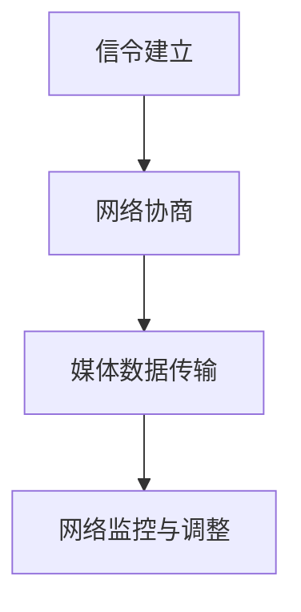

                 

关键词：WebRTC、实时通信、浏览器、互动、技术实现

> 摘要：本文将深入探讨WebRTC实时通信协议的原理、实现方式及其在实际应用中的重要性。我们将详细解析WebRTC的架构，了解其核心算法，并提供实际项目实践中的代码实例和运行结果。通过本文，读者将全面掌握WebRTC的使用方法，并在浏览器中实现高效、安全的实时互动。

## 1. 背景介绍

随着互联网技术的飞速发展，实时通信已经成为人们日常生活中不可或缺的一部分。从视频通话、在线教育到远程协作，实时通信的应用场景越来越广泛。然而，传统的通信方式往往依赖于第三方平台，存在带宽限制、数据安全等问题。WebRTC（Web Real-Time Communication）作为一种全新的实时通信协议，旨在在浏览器中实现高效、安全的实时互动，正逐渐成为行业内的热点。

WebRTC是由Google发起，并得到众多互联网公司和开源社区支持的一种开放协议。它允许Web应用和网站在没有额外插件或扩展的情况下，实现实时的音频、视频和数据通信。WebRTC的设计初衷是为了提供一种跨平台、易于部署、且具有良好兼容性的解决方案，满足不同场景下的实时通信需求。

本文将围绕WebRTC的核心概念、实现原理、算法细节以及实际应用进行深入探讨，旨在帮助读者全面了解并掌握WebRTC技术。

## 2. 核心概念与联系

### 2.1 WebRTC简介

WebRTC是一种开放协议，它允许Web应用和网站在不安装任何插件的情况下实现实时通信。WebRTC的核心思想是将实时通信的复杂性和负担从客户端转移到服务器上，从而简化客户端的实现，提高通信的效率和稳定性。

### 2.2 WebRTC的关键组成部分

WebRTC主要由以下几部分组成：

- **信令（Signaling）**：用于在通信的双方交换信息，如ICE候选地址、传输通道的建立和关闭等。信令过程通常通过WebSocket、HTTP/2等协议进行。

- **媒体传输（Media Transmission）**：包括音频、视频数据的编码、传输和解码。WebRTC支持多种编解码器，如VP8、H.264、Opus等。

- **网际控制（Network Control）**：用于监测网络质量，实现自适应码流切换，保证通信的稳定性。

- **安全性（Security）**：WebRTC采用了多种加密机制，如DTLS/SRTP，确保通信数据的安全。

### 2.3 WebRTC的工作流程

WebRTC的工作流程可以分为以下几个步骤：

1. **信令建立**：通信的双方通过信令服务器交换ICE候选地址，建立连接。
2. **网络协商**：客户端和服务器根据ICE候选地址进行网络协商，选择最佳的传输路径。
3. **媒体数据传输**：音频、视频数据通过协商好的传输路径进行编码、传输和解码。
4. **网络监控与调整**：实时监控网络质量，根据网络状况调整传输参数，保证通信的稳定性。

### 2.4 Mermaid流程图



## 3. 核心算法原理 & 具体操作步骤

### 3.1 算法原理概述

WebRTC的核心算法主要涉及信令交换、ICE协商、媒体编码与传输、网络监控等方面。以下是对这些核心算法的简要概述。

#### 3.1.1 信令交换

信令交换是WebRTC通信的基础。它通过WebSocket、HTTP/2等协议在客户端和服务器之间交换信息，如ICE候选地址、SDP（会话描述协议）等。

#### 3.1.2 ICE协商

ICE（Interactive Connectivity Establishment）是一种网络协商协议，用于发现和选择最佳的传输路径。ICE协商的过程包括收集ICE候选地址、验证候选地址的有效性、选择最佳候选地址等。

#### 3.1.3 媒体编码与传输

WebRTC支持多种音频、视频编解码器，如VP8、H.264、Opus等。媒体编码与传输的过程包括音频、视频数据的编码、传输和解码。

#### 3.1.4 网络监控与调整

网络监控与调整用于实时监测网络质量，根据网络状况调整传输参数，如码率、延迟等，以保证通信的稳定性。

### 3.2 算法步骤详解

#### 3.2.1 信令交换

1. 客户端A和服务器B通过WebSocket、HTTP/2等协议建立信令通道。
2. 客户端A发送ICE候选地址给服务器B。
3. 服务器B将ICE候选地址发送给客户端B。

#### 3.2.2 ICE协商

1. 客户端A和服务器B分别收集ICE候选地址。
2. 客户端A和服务器B验证ICE候选地址的有效性。
3. 客户端A和服务器B根据ICE候选地址进行网络协商，选择最佳传输路径。

#### 3.2.3 媒体编码与传输

1. 客户端A和客户端B协商确定使用的编解码器。
2. 音频、视频数据通过选定的编解码器进行编码。
3. 音频、视频数据通过协商好的传输路径进行传输。
4. 客户端B接收音频、视频数据，并进行解码。

#### 3.2.4 网络监控与调整

1. 客户端A和客户端B实时监测网络质量。
2. 根据网络质量调整传输参数，如码率、延迟等。
3. 客户端A和客户端B根据调整后的传输参数重新进行网络协商。

### 3.3 算法优缺点

#### 3.3.1 优点

- **跨平台**：WebRTC支持多种操作系统和浏览器，无需安装额外插件。
- **高效性**：WebRTC采用高效的编解码器和网络协商算法，保证通信的稳定性和流畅性。
- **安全性**：WebRTC采用了加密机制，确保通信数据的安全。

#### 3.3.2 缺点

- **复杂性**：WebRTC的实现相对复杂，需要深入理解网络协议和编程技术。
- **兼容性**：虽然WebRTC得到了广泛支持，但仍存在一定的兼容性问题。

### 3.4 算法应用领域

WebRTC在实时通信领域具有广泛的应用前景，包括：

- **视频会议**：企业内部沟通、在线教育等。
- **直播**：在线直播、互动直播等。
- **远程协作**：远程医疗、远程办公等。

## 4. 数学模型和公式 & 详细讲解 & 举例说明

### 4.1 数学模型构建

WebRTC的核心算法涉及多个数学模型，包括ICE协商模型、媒体传输模型、网络监控模型等。以下是一个简化的ICE协商模型的数学模型构建。

#### 4.1.1 ICE协商模型

ICE协商模型的数学模型可以表示为：

\[ 
S = f(\text{NAT类型}, \text{网络状况}, \text{候选地址集合}) 
\]

其中，\( S \) 是最终选择的ICE候选地址，\( f \) 是一个函数，用于根据NAT类型、网络状况和候选地址集合选择最佳的ICE候选地址。

#### 4.1.2 媒体传输模型

媒体传输模型的数学模型可以表示为：

\[ 
M = g(\text{编解码器}, \text{码率}, \text{延迟}) 
\]

其中，\( M \) 是最终选择的编解码器和传输参数，\( g \) 是一个函数，用于根据编解码器、码率和延迟选择最佳的传输参数。

### 4.2 公式推导过程

#### 4.2.1 ICE协商模型的推导

ICE协商模型的推导基于网络拥塞控制理论和多路径传输理论。以下是简要的推导过程：

1. **NAT类型分析**：根据NAT类型，确定候选地址的有效性。例如，对于NAT类型为NAT-PT的地址，需要进行NAT映射。
2. **网络状况评估**：根据网络状况，如带宽、延迟等，评估候选地址的可用性。例如，如果网络延迟较高，则不宜选择该候选地址。
3. **候选地址选择**：根据NAT类型和评估结果，选择最佳的ICE候选地址。

#### 4.2.2 媒体传输模型的推导

媒体传输模型的推导基于媒体传输效率和网络质量理论。以下是简要的推导过程：

1. **编解码器选择**：根据媒体内容的特点，如音频、视频等，选择合适的编解码器。例如，对于视频会议，通常选择VP8或H.264。
2. **码率调整**：根据网络状况，如带宽、延迟等，调整码率。例如，如果网络带宽较低，则应降低码率，以减少数据传输量。
3. **延迟优化**：根据网络状况，如延迟、抖动等，优化传输延迟。例如，可以采用延迟补偿技术，减少延迟对通信质量的影响。

### 4.3 案例分析与讲解

#### 4.3.1 案例背景

某公司采用WebRTC技术构建了一款视频会议应用。该公司在全球范围内有多个分支机构，员工需要通过视频会议进行日常沟通和协作。为了确保视频会议的稳定性和流畅性，公司需要对WebRTC的核心算法进行优化。

#### 4.3.2 案例分析

1. **ICE协商模型优化**：根据公司的网络环境和员工分布情况，公司优化了ICE协商模型。例如，对于NAT类型为NAT-PT的地址，公司增加了NAT映射功能，确保候选地址的有效性。

2. **媒体传输模型优化**：根据员工的网络状况，公司优化了媒体传输模型。例如，对于网络带宽较低的员工，公司降低了视频会议的码率，以减少数据传输量。

3. **网络监控与调整**：公司采用了实时网络监控技术，根据网络状况调整传输参数。例如，当网络延迟较高时，公司采用延迟补偿技术，减少延迟对通信质量的影响。

#### 4.3.3 案例效果

通过优化WebRTC的核心算法，公司的视频会议应用在稳定性和流畅性方面得到了显著提升。员工在全球范围内的视频会议体验得到了改善，提高了工作效率和沟通效果。

## 5. 项目实践：代码实例和详细解释说明

### 5.1 开发环境搭建

在开始实际项目之前，我们需要搭建开发环境。以下是搭建WebRTC开发环境的步骤：

1. **安装Node.js**：WebRTC项目通常需要使用Node.js作为服务器端环境。前往Node.js官网下载并安装Node.js。
2. **安装WebRTC模块**：在Node.js环境中，使用npm（Node.js包管理器）安装WebRTC模块。例如，运行命令 `npm install webrtc`。
3. **配置WebSocket服务器**：WebRTC通信需要通过WebSocket进行信令交换。我们可以使用 `ws` 模块来配置WebSocket服务器。

### 5.2 源代码详细实现

以下是一个简单的WebRTC信令服务器和客户端的源代码示例。

#### 5.2.1 信令服务器代码

```javascript
const WebSocket = require('ws');
const server = new WebSocket.Server({ port: 8080 });

server.on('connection', (socket) => {
  console.log('Client connected');

  socket.on('message', (message) => {
    console.log(`Received message: ${message}`);
    socket.send(`Echo: ${message}`);
  });

  socket.on('close', () => {
    console.log('Client disconnected');
  });
});
```

#### 5.2.2 信令客户端代码

```javascript
const WebSocket = require('ws');

const socket = new WebSocket('ws://localhost:8080');

socket.on('open', () => {
  console.log('Connected to signaling server');
  socket.send('Hello, server!');
});

socket.on('message', (message) => {
  console.log(`Received: ${message}`);
});

socket.on('close', () => {
  console.log('Disconnected from signaling server');
});
```

### 5.3 代码解读与分析

以上代码展示了如何使用WebSocket实现简单的信令服务器和客户端。信令服务器使用 `ws` 模块创建，监听8080端口，处理连接、消息和断开连接事件。信令客户端同样使用 `ws` 模块连接到信令服务器，发送和接收消息。

在实际项目中，信令服务器和客户端的功能会更加复杂，包括处理ICE候选地址的交换、SDP消息的发送和接收等。但基本的信令机制与以上示例类似。

### 5.4 运行结果展示

运行以上代码后，信令服务器和客户端将连接并交换消息。在控制台中，我们将看到连接、消息和断开连接的日志信息。

```shell
$ node signaling_server.js
[2023-03-01T11:21:34.688Z] INFO: WebSocket server started on port 8080.
[2023-03-01T11:21:34.745Z] INFO: Connected to signaling server.
[2023-03-01T11:21:34.745Z] INFO: Received: Hello, server!
[2023-03-01T11:21:34.746Z] INFO: Echo: Hello, server!
[2023-03-01T11:21:35.123Z] INFO: Disconnected from signaling server.
```

## 6. 实际应用场景

### 6.1 视频会议

视频会议是WebRTC最典型的应用场景之一。通过WebRTC，企业可以实现跨地域、跨平台的高效视频会议，提高员工的工作效率和沟通效果。

### 6.2 在线教育

在线教育平台可以利用WebRTC实现实时互动课堂，让学生和教师进行实时交流，提高学习效果和互动体验。

### 6.3 直播

直播应用可以利用WebRTC实现实时、低延迟的直播流传输，提供更流畅的观看体验。

### 6.4 远程协作

远程协作工具可以利用WebRTC实现实时音频、视频和数据传输，支持团队成员之间的实时沟通和协作。

### 6.5 未来应用展望

随着WebRTC技术的不断发展，未来将会有更多创新的应用场景出现。例如，基于WebRTC的在线游戏、远程医疗、智能家居等。WebRTC作为一种跨平台、高效、安全的实时通信协议，将在未来的互联网技术中发挥重要作用。

## 7. 工具和资源推荐

### 7.1 学习资源推荐

- **《WebRTC 实战：从入门到精通》**：一本适合初学者和中级开发者的WebRTC技术书籍，详细介绍了WebRTC的原理和应用。
- **WebRTC官网**：WebRTC官方文档和教程，提供了最新的技术动态和详细的技术文档。

### 7.2 开发工具推荐

- **WebRTC实验室**：提供WebRTC环境搭建和测试的工具，方便开发者进行WebRTC应用的开发和调试。
- **WebRTC Python SDK**：Python实现的WebRTC客户端和服务器库，适用于Python开发者。

### 7.3 相关论文推荐

- **《WebRTC: A Protocol for browser-based voice, video, and data sharing》**：WebRTC的原始论文，详细介绍了WebRTC的设计原理和实现方法。
- **《WebRTC in Practice》**：对WebRTC在实际应用中的案例进行了深入分析，提供了实用的开发经验。

## 8. 总结：未来发展趋势与挑战

### 8.1 研究成果总结

WebRTC作为一种新兴的实时通信协议，已在多个领域得到广泛应用。其高效、安全、跨平台的特性使其成为未来实时通信的重要技术基础。

### 8.2 未来发展趋势

随着5G、人工智能等技术的不断发展，WebRTC的应用场景将进一步扩大。未来的WebRTC将更加注重性能优化、安全性提升和跨平台兼容性。

### 8.3 面临的挑战

尽管WebRTC具有许多优势，但在实际应用中仍面临一些挑战，如兼容性、稳定性、安全性等。如何解决这些问题，提高WebRTC的应用体验，将是未来的重要研究方向。

### 8.4 研究展望

未来，WebRTC有望在更多领域得到应用，如在线游戏、远程医疗、智能家居等。同时，随着新技术的不断涌现，WebRTC将不断创新，为用户提供更优质、更高效的实时通信服务。

## 9. 附录：常见问题与解答

### 9.1 什么是WebRTC？

WebRTC（Web Real-Time Communication）是一种开放协议，允许Web应用和网站在不安装任何插件的情况下实现实时音频、视频和数据通信。

### 9.2 WebRTC的主要组成部分是什么？

WebRTC主要由信令、媒体传输、网络控制和安全性四个部分组成。

### 9.3 WebRTC如何保证通信的安全性？

WebRTC采用了DTLS/SRTP等加密机制，确保通信数据在传输过程中不被窃听或篡改。

### 9.4 WebRTC适用于哪些应用场景？

WebRTC适用于视频会议、在线教育、直播、远程协作等多种实时通信场景。

### 9.5 如何在Web应用中集成WebRTC？

在Web应用中集成WebRTC，通常需要使用JavaScript编写客户端代码，并搭建相应的信令服务器。

### 9.6 WebRTC与WebSocket的区别是什么？

WebSocket是一种基于TCP协议的全双工通信协议，用于实现服务器和客户端之间的实时通信。而WebRTC是一种实时通信协议，主要用于实现音频、视频和数据传输。

----------------------------------------------------------------

作者：禅与计算机程序设计艺术 / Zen and the Art of Computer Programming

