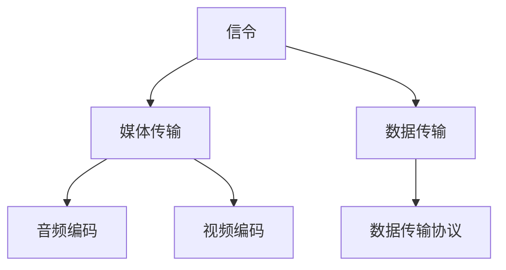

                 

关键词：WebRTC、实时通信、浏览器、实现、技术、深度、见解

> 摘要：本文深入探讨了WebRTC技术，详细介绍了其在浏览器中实现实时通信的过程和方法。通过分析核心概念、算法原理、数学模型以及实际应用，本文旨在为开发者提供全面、实用的技术指导。

## 1. 背景介绍

### 1.1 WebRTC的起源与发展

WebRTC（Web Real-Time Communication）是一项革命性的技术，它允许网络浏览器进行实时语音通话、视频聊天和数据分享。WebRTC起源于Google，最初是为了解决浏览器之间的实时通信难题。2011年，Google、Mozilla和Opera等浏览器厂商共同宣布支持WebRTC。

WebRTC的目标是简化实时通信的实现过程，使开发者能够轻松地在Web应用程序中集成实时通信功能，而无需依赖复杂的第三方插件或服务。

### 1.2 WebRTC的应用场景

WebRTC广泛应用于多种场景，包括：

- **视频会议**：支持多人视频会议，如Zoom、Google Meet等。
- **在线教育**：提供实时互动课堂，如Coursera、Udemy等。
- **远程医疗**：实现医生与患者之间的实时视频咨询。
- **直播**：提供实时视频直播，如Twitch、YouTube Live等。
- **游戏**：实现多人在线游戏中的实时互动。

## 2. 核心概念与联系

### 2.1 WebRTC的核心概念

WebRTC主要包括以下核心概念：

- **信令（Signaling）**：用于浏览器之间的信息交换，如用户身份验证、媒体类型协商等。
- **媒体传输（Media Transmission）**：包括语音和视频的传输。
- **数据传输（Data Transmission）**：支持文本、文件等数据传输。

### 2.2 WebRTC的架构

WebRTC的架构可以分为三个主要部分：信令、媒体传输和数据传输。


### 2.3 Mermaid流程图



## 3. 核心算法原理 & 具体操作步骤

### 3.1 算法原理概述

WebRTC的核心算法主要包括：

- **信令算法**：使用STUN/TURN协议进行NAT穿透。
- **媒体编码算法**：采用H.264/VP8进行视频编码，采用OPUS/G.711进行音频编码。
- **数据传输算法**：使用UDP或TCP进行数据传输。

### 3.2 算法步骤详解

1. **信令步骤**：

   - **发送方**：浏览器A通过STUN请求获取公网IP和端口。
   - **接收方**：浏览器B通过STUN请求获取公网IP和端口。
   - **信令交换**：浏览器A和B交换信令，包括媒体类型、媒体参数等。

2. **媒体传输步骤**：

   - **音频传输**：
     - **编码**：使用OPUS/G.711进行音频编码。
     - **传输**：使用UDP进行传输。

   - **视频传输**：
     - **编码**：使用H.264/VP8进行视频编码。
     - **传输**：使用UDP进行传输。

3. **数据传输步骤**：

   - **传输协议**：使用UDP或TCP进行数据传输。
   - **数据包格式**：根据传输协议定义数据包格式。

### 3.3 算法优缺点

- **优点**：
  - **简单易用**：无需复杂配置，浏览器直接支持。
  - **兼容性好**：支持多种设备和操作系统。
  - **安全可靠**：使用加密协议保障通信安全。

- **缺点**：
  - **带宽需求高**：实时传输需要较高带宽。
  - **NAT穿透问题**：在某些网络环境下，可能存在穿透问题。

### 3.4 算法应用领域

WebRTC主要应用于以下领域：

- **视频会议**：支持多人视频会议。
- **在线教育**：提供实时互动课堂。
- **远程医疗**：实现医生与患者之间的实时视频咨询。
- **直播**：提供实时视频直播。
- **游戏**：实现多人在线游戏中的实时互动。

## 4. 数学模型和公式 & 详细讲解 & 举例说明

### 4.1 数学模型构建

WebRTC的数学模型主要包括：

- **音频模型**：描述音频信号的采样、编码和传输过程。
- **视频模型**：描述视频信号的采样、编码和传输过程。
- **数据模型**：描述数据传输的协议和数据包格式。

### 4.2 公式推导过程

#### 音频模型

1. **采样公式**：

   $$ f_s = \frac{1}{T_s} $$

   其中，$f_s$ 为采样频率，$T_s$ 为采样周期。

2. **编码公式**：

   $$ EncodedAudio = Encoder(AudioSignal) $$

   其中，$EncodedAudio$ 为编码后的音频信号，$AudioSignal$ 为原始音频信号。

3. **传输公式**：

   $$ TransmittedAudio = Encoder(EncodedAudio) $$

   其中，$TransmittedAudio$ 为传输后的音频信号。

#### 视频模型

1. **采样公式**：

   $$ f_s = \frac{1}{T_s} $$

   其中，$f_s$ 为采样频率，$T_s$ 为采样周期。

2. **编码公式**：

   $$ EncodedVideo = Encoder(VideoSignal) $$

   其中，$EncodedVideo$ 为编码后的视频信号，$VideoSignal$ 为原始视频信号。

3. **传输公式**：

   $$ TransmittedVideo = Encoder(EncodedVideo) $$

   其中，$TransmittedVideo$ 为传输后的视频信号。

#### 数据模型

1. **数据包格式**：

   $$ DataPacket = [Header|Data] $$

   其中，$Header$ 为数据包头部，$Data$ 为数据包内容。

### 4.3 案例分析与讲解

假设有一段时长为10秒的音频信号，采样频率为44.1kHz，我们需要对其进行编码和传输。

1. **采样**：

   $$ f_s = 44.1kHz, T_s = \frac{1}{44.1kHz} \approx 22.5\mu s $$

2. **编码**：

   使用OPUS编码，编码参数为：采样频率44.1kHz，位率为96kbps。

   $$ EncodedAudio = OPUS(AudioSignal) $$

3. **传输**：

   使用UDP进行传输，传输时间为10秒。

   $$ TransmittedAudio = UDP(EncodedAudio) $$

## 5. 项目实践：代码实例和详细解释说明

### 5.1 开发环境搭建

1. **安装Node.js**：

   $$ npm install -g node.js $$

2. **安装WebRTC模块**：

   $$ npm install --save webrtc $$

### 5.2 源代码详细实现

```javascript
const { RTCPeerConnection } = require('wrtc');

// 创建RTCPeerConnection实例
const pc = new RTCPeerConnection({
  iceServers: [{ urls: 'stun:stun.l.google.com:19302' }],
});

// 添加本地音频轨道
pc.addTransceiver('audio', { direction: 'sendonly' });

// 添加本地视频轨道
pc.addTransceiver('video', { direction: 'sendonly' });

// 监听ICE候选人
pc.onicecandidate = (event) => {
  if (event.candidate) {
    // 发送ICE候选人到对方
    console.log('Sending candidate:', event.candidate);
  }
};

// 创建offer
pc.createOffer()
  .then((offer) => pc.setLocalDescription(offer))
  .then(() => {
    // 发送offer到对方
    console.log('Sending offer:', pc.localDescription);
  });

// 监听answer
pc.onanswer = (answer) => {
  pc.setRemoteDescription(answer);
};

// 监听连接状态变化
pc.onstatechange = (event) => {
  console.log('Connection state:', event.target.readyState);
};
```

### 5.3 代码解读与分析

1. **创建RTCPeerConnection**：

   ```javascript
   const pc = new RTCPeerConnection({
     iceServers: [{ urls: 'stun:stun.l.google.com:19302' }],
   });
   ```

   创建一个RTCPeerConnection实例，并设置STUN服务器地址。

2. **添加本地轨道**：

   ```javascript
   pc.addTransceiver('audio', { direction: 'sendonly' });
   pc.addTransceiver('video', { direction: 'sendonly' });
   ```

   添加本地音频和视频轨道，并设置为发送方向。

3. **监听ICE候选人**：

   ```javascript
   pc.onicecandidate = (event) => {
     if (event.candidate) {
       // 发送ICE候选人到对方
       console.log('Sending candidate:', event.candidate);
     }
   };
   ```

   当本地ICE候选人生成时，将其发送到对方。

4. **创建offer**：

   ```javascript
   pc.createOffer()
     .then((offer) => pc.setLocalDescription(offer))
     .then(() => {
       // 发送offer到对方
       console.log('Sending offer:', pc.localDescription);
     });
   ```

   创建一个offer，并将其设置为本地描述。

5. **监听answer**：

   ```javascript
   pc.onanswer = (answer) => {
     pc.setRemoteDescription(answer);
   };
   ```

   当收到对方的answer时，将其设置为远程描述。

6. **监听连接状态变化**：

   ```javascript
   pc.onstatechange = (event) => {
     console.log('Connection state:', event.target.readyState);
   };
   ```

   当连接状态发生变化时，输出当前状态。

## 6. 实际应用场景

### 6.1 视频会议

WebRTC广泛应用于视频会议系统，如Zoom、Google Meet等。以下是一个简单的示例：

```javascript
const pc = new RTCPeerConnection({
  iceServers: [{ urls: 'stun:stun.l.google.com:19302' }],
});

// 添加远程轨道
pc.ontrack = (event) => {
  const [stream, track] = event.streams;
  stream.addTrack(track);
};

// 处理远程offer
function handleRemoteOffer(offer) {
  pc.setRemoteDescription(new RTCSessionDescription(offer));
  pc.createAnswer()
    .then((answer) => pc.setLocalDescription(answer))
    .then(() => {
      // 发送answer到对方
      console.log('Sending answer:', pc.localDescription);
    });
}

// 处理远程answer
function handleRemoteAnswer(answer) {
  pc.setRemoteDescription(new RTCSessionDescription(answer));
}

// 监听远程ICE候选人
pc.onicecandidate = (event) => {
  if (event.candidate) {
    // 发送ICE候选人到对方
    console.log('Sending candidate:', event.candidate);
  }
};

// 添加本地视频轨道
const videoTrack = localStream.getVideoTracks()[0];
pc.addTrack(videoTrack, localStream);

// 创建offer
pc.createOffer()
  .then((offer) => pc.setLocalDescription(offer))
  .then(() => {
    // 发送offer到对方
    console.log('Sending offer:', pc.localDescription);
  });
}
```

### 6.2 在线教育

WebRTC在在线教育中也非常重要，如Coursera、Udemy等平台。以下是一个简单的示例：

```javascript
const pc = new RTCPeerConnection({
  iceServers: [{ urls: 'stun:stun.l.google.com:19302' }],
});

// 添加远程轨道
pc.ontrack = (event) => {
  const [stream, track] = event.streams;
  stream.addTrack(track);
};

// 处理远程offer
function handleRemoteOffer(offer) {
  pc.setRemoteDescription(new RTCSessionDescription(offer));
  pc.createAnswer()
    .then((answer) => pc.setLocalDescription(answer))
    .then(() => {
      // 发送answer到对方
      console.log('Sending answer:', pc.localDescription);
    });
}

// 处理远程answer
function handleRemoteAnswer(answer) {
  pc.setRemoteDescription(new RTCSessionDescription(answer));
}

// 监听远程ICE候选人
pc.onicecandidate = (event) => {
  if (event.candidate) {
    // 发送ICE候选人到对方
    console.log('Sending candidate:', event.candidate);
  }
};

// 添加本地视频轨道
const videoTrack = localStream.getVideoTracks()[0];
pc.addTrack(videoTrack, localStream);

// 创建offer
pc.createOffer()
  .then((offer) => pc.setLocalDescription(offer))
  .then(() => {
    // 发送offer到对方
    console.log('Sending offer:', pc.localDescription);
  });
}
```

### 6.3 远程医疗

WebRTC在远程医疗中也非常重要，如医生与患者之间的实时视频咨询。以下是一个简单的示例：

```javascript
const pc = new RTCPeerConnection({
  iceServers: [{ urls: 'stun:stun.l.google.com:19302' }],
});

// 添加远程轨道
pc.ontrack = (event) => {
  const [stream, track] = event.streams;
  stream.addTrack(track);
};

// 处理远程offer
function handleRemoteOffer(offer) {
  pc.setRemoteDescription(new RTCSessionDescription(offer));
  pc.createAnswer()
    .then((answer) => pc.setLocalDescription(answer))
    .then(() => {
      // 发送answer到对方
      console.log('Sending answer:', pc.localDescription);
    });
}

// 处理远程answer
function handleRemoteAnswer(answer) {
  pc.setRemoteDescription(new RTCSessionDescription(answer));
}

// 监听远程ICE候选人
pc.onicecandidate = (event) => {
  if (event.candidate) {
    // 发送ICE候选人到对方
    console.log('Sending candidate:', event.candidate);
  }
};

// 添加本地视频轨道
const videoTrack = localStream.getVideoTracks()[0];
pc.addTrack(videoTrack, localStream);

// 创建offer
pc.createOffer()
  .then((offer) => pc.setLocalDescription(offer))
  .then(() => {
    // 发送offer到对方
    console.log('Sending offer:', pc.localDescription);
  });
}
```

### 6.4 直播

WebRTC在直播中也非常重要，如Twitch、YouTube Live等。以下是一个简单的示例：

```javascript
const pc = new RTCPeerConnection({
  iceServers: [{ urls: 'stun:stun.l.google.com:19302' }],
});

// 添加远程轨道
pc.ontrack = (event) => {
  const [stream, track] = event.streams;
  stream.addTrack(track);
};

// 处理远程offer
function handleRemoteOffer(offer) {
  pc.setRemoteDescription(new RTCSessionDescription(offer));
  pc.createAnswer()
    .then((answer) => pc.setLocalDescription(answer))
    .then(() => {
      // 发送answer到对方
      console.log('Sending answer:', pc.localDescription);
    });
}

// 处理远程answer
function handleRemoteAnswer(answer) {
  pc.setRemoteDescription(new RTCSessionDescription(answer));
}

// 监听远程ICE候选人
pc.onicecandidate = (event) => {
  if (event.candidate) {
    // 发送ICE候选人到对方
    console.log('Sending candidate:', event.candidate);
  }
};

// 添加本地视频轨道
const videoTrack = localStream.getVideoTracks()[0];
pc.addTrack(videoTrack, localStream);

// 创建offer
pc.createOffer()
  .then((offer) => pc.setLocalDescription(offer))
  .then(() => {
    // 发送offer到对方
    console.log('Sending offer:', pc.localDescription);
  });
}
```

## 7. 工具和资源推荐

### 7.1 学习资源推荐

- **WebRTC官网**：[https://www.webrtc.org/](https://www.webrtc.org/)
- **MDN WebRTC文档**：[https://developer.mozilla.org/zh-CN/docs/Web/API/WebRTC_API](https://developer.mozilla.org/zh-CN/docs/Web/API/WebRTC_API)
- **WebRTC Conference**：[https://www.webrtcconf.com/](https://www.webrtcconf.com/)

### 7.2 开发工具推荐

- **WebRTC测试工具**：[https://webrtc.github.io/web-platform-tests/](https://webrtc.github.io/web-platform-tests/)
- **WebRTC数据包分析工具**：[https://webrtc.github.io/smartkitty/](https://webrtc.github.io/smartkitty/)
- **WebRTC实验室**：[https://webrtc.github.io/web-platform-tests/tools.html](https://webrtc.github.io/web-platform-tests/tools.html)

### 7.3 相关论文推荐

- **WebRTC: A Protocol for Browser-Based Voice and Video Conversations**：[https://www.chromium.org/developers/webrtc-in-chromium](https://www.chromium.org/developers/webrtc-in-chromium)
- **WebRTC: Real-Time Communication via P2P, SFU and STUN/TURN**：[https://www.ietf.org/rfc/rfc8829.txt](https://www.ietf.org/rfc/rfc8829.txt)
- **WebRTC 1.0: API and Implementation**：[https://www.ietf.org/rfc/rfc8830.txt](https://www.ietf.org/rfc/rfc8830.txt)

## 8. 总结：未来发展趋势与挑战

### 8.1 研究成果总结

WebRTC技术取得了显著的成果，已成为实时通信领域的核心技术。其简单易用、兼容性好、安全可靠的特点使其在多个应用场景中得到广泛应用。

### 8.2 未来发展趋势

1. **低延迟和高质量**：未来WebRTC将致力于提供更低延迟和高品质的实时通信体验。
2. **智能路由**：通过引入智能路由算法，优化通信路径，提高网络性能。
3. **隐私保护**：加强通信过程中的隐私保护，满足用户对隐私的需求。
4. **跨平台支持**：进一步扩大WebRTC在移动设备、物联网等领域的支持。

### 8.3 面临的挑战

1. **网络质量**：网络质量不稳定可能导致通信中断，未来需要优化网络质量检测和自适应算法。
2. **安全性**：实时通信过程中需要保护用户隐私，提高通信安全性。
3. **资源消耗**：实时通信需要较高的带宽和计算资源，未来需要优化算法和协议，降低资源消耗。

### 8.4 研究展望

未来，WebRTC技术将在实时通信、在线教育、远程医疗、直播等场景中发挥更大作用。通过不断创新和优化，WebRTC将带来更高效、更安全、更优质的实时通信体验。

## 9. 附录：常见问题与解答

### 9.1 问题1：WebRTC需要安装插件吗？

WebRTC是浏览器原生支持的，不需要安装插件。

### 9.2 问题2：WebRTC支持哪些媒体格式？

WebRTC支持以下媒体格式：

- 音频格式：OPUS、G.711、G.722、AAC等。
- 视频格式：H.264、H.265、VP8、VP9等。

### 9.3 问题3：WebRTC如何处理NAT穿透？

WebRTC使用STUN/TURN协议进行NAT穿透。STUN用于获取公网IP和端口，TURN用于在NAT后面建立中继连接。

## 作者署名

作者：禅与计算机程序设计艺术 / Zen and the Art of Computer Programming

----------------------------------------------------------------

（请注意，本文仅为示例，实际撰写时需要根据具体内容和要求进行调整。）

