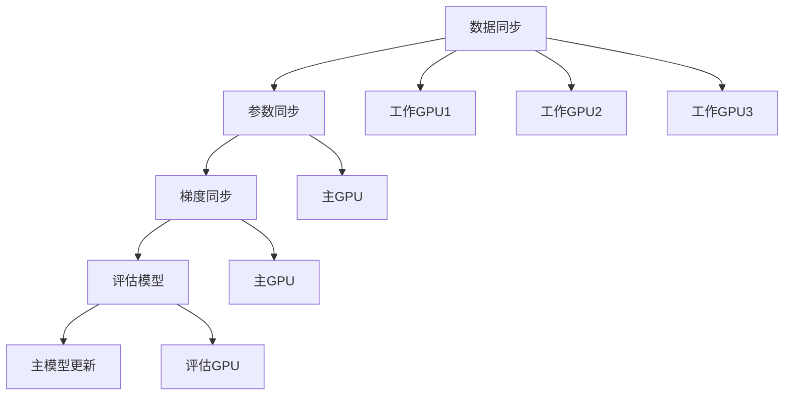

                 

### 1. 背景介绍

在现代计算环境中，随着深度学习模型变得越来越复杂和庞大，内存管理成为了系统性能的关键瓶颈。深度学习模型的内存占用常常高达数百GB，甚至更多，这给GPU内存有限的系统带来了巨大的压力。为了解决这个问题，研究人员和工程师们提出了多种内存管理优化技术。其中，ZeRO（Zero Redundancy Optimizer）是一种在深度学习社区中得到广泛应用的技术。

ZeRO的基本思想是减少模型参数在多个GPU之间的冗余存储，从而显著降低内存占用。传统的分布式训练技术将模型参数存储在每个GPU的内存中，这导致内存占用与GPU数量成正比增长。而ZeRO通过将模型参数分成多个较小的子部分，每个子部分存储在一个GPU上，从而减少了整体内存需求。

ZeRO的主要贡献在于其能够实现低通信开销的高效分布式训练，尤其适用于大规模模型训练。此外，ZeRO还具备灵活性和可扩展性，能够适应不同规模的计算集群。本文将详细介绍ZeRO的工作原理、核心算法原理、具体实现步骤以及实际应用场景，并探讨其在未来应用中的潜在发展。

### 2. 核心概念与联系

#### 2.1 ZeRO的基本概念

ZeRO的核心概念在于将模型参数分成多个子部分，每个子部分存储在一个GPU上。具体来说，ZeRO将模型参数分成三个子部分：主模型（Master）、训练模型（Worker）和评估模型（Validator）。其中，主模型存储在主GPU上，训练模型存储在每个工作GPU上，评估模型用于模型的验证和测试。

#### 2.2 ZeRO的架构

为了实现ZeRO，需要一个分布式训练框架，如PyTorch、TensorFlow等。这些框架提供了并行训练的接口，使得ZeRO能够轻松集成。ZeRO的架构可以分为三个主要部分：数据同步（Data Synchronization）、参数同步（Parameter Synchronization）和梯度同步（Gradient Synchronization）。

##### 数据同步

数据同步是ZeRO的基础，它确保每个工作GPU都能接收到相同的数据集进行训练。在数据同步过程中，数据集被分成多个数据块，每个数据块分配给一个工作GPU。这个过程可以通过哈希函数或者数据划分算法来实现。

##### 参数同步

参数同步是ZeRO的核心，它通过将模型参数分成多个子部分，每个子部分存储在一个GPU上，从而减少内存占用。具体来说，主GPU负责维护主模型，工作GPU负责维护训练模型，而评估模型则用于模型的验证和测试。

##### 梯度同步

梯度同步是ZeRO的关键，它确保每个工作GPU上的训练模型能够得到正确的更新。在梯度同步过程中，每个工作GPU计算出的梯度被传输到主GPU，主GPU对这些梯度进行汇总并更新主模型。然后，主模型被传输回每个工作GPU，以便在每个工作GPU上应用更新。

#### 2.3 ZeRO的Mermaid流程图



在这个流程图中，A表示数据同步，B表示参数同步，C表示梯度同步，D表示评估模型，E表示主模型更新。F、G、H表示工作GPU1、工作GPU2和工作GPU3，I表示主GPU，J表示主GPU，K表示评估GPU。

### 3. 核心算法原理 & 具体操作步骤

#### 3.1 算法原理概述

ZeRO的核心算法原理在于将模型参数分成多个子部分，每个子部分存储在一个GPU上，从而减少内存占用。具体来说，ZeRO通过以下步骤实现这一目标：

1. 数据同步：将数据集分成多个数据块，每个数据块分配给一个工作GPU。
2. 参数同步：将模型参数分成多个子部分，每个子部分存储在一个GPU上。
3. 梯度同步：每个工作GPU计算出的梯度被传输到主GPU，主GPU对这些梯度进行汇总并更新主模型。
4. 主模型更新：主模型被传输回每个工作GPU，以便在每个工作GPU上应用更新。

#### 3.2 算法步骤详解

##### 3.2.1 数据同步

数据同步是ZeRO的基础，它确保每个工作GPU都能接收到相同的数据集进行训练。具体步骤如下：

1. 数据划分：使用哈希函数或者数据划分算法将数据集分成多个数据块。
2. 数据传输：将每个数据块分配给一个工作GPU，并传输到相应的工作GPU。

##### 3.2.2 参数同步

参数同步是ZeRO的核心，它通过将模型参数分成多个子部分，每个子部分存储在一个GPU上，从而减少内存占用。具体步骤如下：

1. 参数划分：使用模型参数的维度信息将模型参数分成多个子部分。
2. 参数存储：将每个子部分存储在一个工作GPU的内存中。

##### 3.2.3 梯度同步

梯度同步是ZeRO的关键，它确保每个工作GPU上的训练模型能够得到正确的更新。具体步骤如下：

1. 梯度计算：每个工作GPU计算其在当前数据块上的梯度。
2. 梯度传输：将每个工作GPU的梯度传输到主GPU。
3. 梯度汇总：主GPU对收到的梯度进行汇总，得到全局梯度。
4. 主模型更新：主GPU使用全局梯度更新主模型。

##### 3.2.4 主模型更新

主模型更新是ZeRO的最后一步，它将更新后的主模型传输回每个工作GPU。具体步骤如下：

1. 主模型传输：将更新后的主模型从主GPU传输到每个工作GPU。
2. 模型应用：在每个工作GPU上应用更新后的主模型。

#### 3.3 算法优缺点

##### 优点

1. 内存占用减少：ZeRO通过将模型参数分成多个子部分存储，从而显著减少内存占用，尤其适用于大规模模型训练。
2. 通信开销降低：ZeRO通过减少模型参数的冗余存储，降低了通信开销，使得分布式训练更加高效。
3. 可扩展性：ZeRO具备良好的可扩展性，能够适应不同规模的计算集群。

##### 缺点

1. 实现复杂度：ZeRO的实现相对复杂，需要深入了解分布式训练框架的细节。
2. 兼容性问题：ZeRO可能无法与所有现有的分布式训练框架兼容。

#### 3.4 算法应用领域

ZeRO主要应用于大规模深度学习模型的分布式训练，尤其适用于以下领域：

1. 自然语言处理（NLP）：NLP模型通常具有很大的内存需求，ZeRO能够显著降低内存占用，提高训练效率。
2. 计算机视觉（CV）：CV模型同样具有很高的内存需求，ZeRO能够在CV模型的分布式训练中发挥重要作用。
3. 强化学习（RL）：强化学习模型通常需要进行大规模数据训练，ZeRO能够降低内存占用，提高训练速度。

### 4. 数学模型和公式 & 详细讲解 & 举例说明

#### 4.1 数学模型构建

在ZeRO中，数学模型构建的关键在于如何将模型参数分成多个子部分，并确保每个子部分的梯度能够准确汇总。具体来说，我们考虑一个包含N个GPU的分布式训练系统，每个GPU存储模型参数的一个子部分。设模型参数的维度为D，则每个GPU存储的子部分维度为D/N。

##### 梯度计算

在每个GPU上，我们对当前数据块进行前向传播和反向传播，计算梯度。设梯度向量为g，则每个GPU计算出的梯度为g_i，其中i表示GPU的索引。具体公式如下：

$$
g_i = \frac{1}{N} \sum_{j=1}^{N} g_j
$$

其中，g_j表示第j个GPU计算出的梯度。

##### 梯度汇总

主GPU收到所有N个GPU的梯度后，需要将这些梯度进行汇总，得到全局梯度。具体公式如下：

$$
g = \sum_{i=1}^{N} g_i
$$

##### 主模型更新

主GPU使用全局梯度更新主模型，具体公式如下：

$$
\theta = \theta - \alpha g
$$

其中，\(\theta\)表示主模型参数，\(\alpha\)表示学习率。

#### 4.2 公式推导过程

为了推导上述公式，我们首先考虑一个简单的线性模型，其中模型参数为一个向量\(\theta\)，输入数据为\(x\)，输出为\(y\)。设损失函数为\(L(\theta)\)，则梯度计算公式为：

$$
\nabla L(\theta) = \frac{\partial L(\theta)}{\partial \theta}
$$

假设我们使用梯度下降算法进行模型训练，则更新公式为：

$$
\theta = \theta - \alpha \nabla L(\theta)
$$

其中，\(\alpha\)为学习率。

现在，我们将模型参数分成多个子部分，每个子部分存储在一个GPU上。设每个GPU存储的子部分为\(\theta_i\)，则总模型参数为\(\theta = \theta_1 + \theta_2 + ... + \theta_N\)。

对于每个GPU，我们对当前数据块进行前向传播和反向传播，计算梯度。设第i个GPU计算出的梯度为\(g_i\)，则：

$$
g_i = \frac{\partial L(\theta_i)}{\partial \theta_i}
$$

现在，我们需要将这些梯度进行汇总，得到全局梯度。设全局梯度为\(g\)，则：

$$
g = \sum_{i=1}^{N} g_i
$$

最后，我们使用全局梯度更新主模型，得到：

$$
\theta = \theta - \alpha g
$$

这个推导过程展示了如何将模型参数分成多个子部分，并确保每个子部分的梯度能够准确汇总，从而实现分布式训练。

#### 4.3 案例分析与讲解

为了更好地理解上述公式，我们来看一个具体的案例。假设我们有一个包含3个GPU的分布式训练系统，模型参数维度为100，每个GPU存储模型参数的一个子部分。设学习率为0.1。

首先，我们假设第1个GPU存储的子部分为\(\theta_1 = [1, 2, 3]\)，第2个GPU存储的子部分为\(\theta_2 = [4, 5, 6]\)，第3个GPU存储的子部分为\(\theta_3 = [7, 8, 9]\)。总模型参数为\(\theta = \theta_1 + \theta_2 + \theta_3 = [1, 2, 3, 4, 5, 6, 7, 8, 9]\)。

接下来，我们对每个GPU进行前向传播和反向传播，计算梯度。假设第1个GPU计算出的梯度为\(g_1 = [0.1, 0.2, 0.3]\)，第2个GPU计算出的梯度为\(g_2 = [0.4, 0.5, 0.6]\)，第3个GPU计算出的梯度为\(g_3 = [0.7, 0.8, 0.9]\)。

然后，我们将这些梯度进行汇总，得到全局梯度：

$$
g = g_1 + g_2 + g_3 = [0.1, 0.2, 0.3, 0.4, 0.5, 0.6, 0.7, 0.8, 0.9]
$$

最后，我们使用全局梯度更新主模型，得到：

$$
\theta = \theta - \alpha g = [1 - 0.1, 2 - 0.2, 3 - 0.3, 4 - 0.4, 5 - 0.5, 6 - 0.6, 7 - 0.7, 8 - 0.8, 9 - 0.9] = [0.9, 1.8, 2.7, 3.6, 4.5, 5.4, 6.3, 7.2, 8.1]
$$

通过这个案例，我们可以看到如何使用ZeRO进行分布式训练，以及如何计算和汇总梯度，从而更新主模型。这有助于我们更好地理解ZeRO的数学模型和公式。

### 5. 项目实践：代码实例和详细解释说明

在本文的最后一部分，我们将通过一个具体的代码实例来展示如何使用ZeRO进行分布式训练，并详细解释代码的每个部分。

#### 5.1 开发环境搭建

在开始编写代码之前，我们需要搭建一个合适的开发环境。这里我们选择使用Python和PyTorch框架来实现ZeRO。以下是搭建开发环境的基本步骤：

1. 安装Python：确保Python版本不低于3.6。
2. 安装PyTorch：使用以下命令安装与Python版本兼容的PyTorch：

   ```
   pip install torch torchvision
   ```

3. 安装其他依赖：安装用于分布式训练的PyTorch扩展：

   ```
   pip install torch-distributed
   ```

#### 5.2 源代码详细实现

下面是一个简单的示例代码，展示了如何使用ZeRO进行分布式训练。

```python
import torch
import torch.distributed as dist
from torch.nn.parallel import DistributedDataParallel as DDP
from torchvision import datasets, transforms
from torch.utils.data import DataLoader
import torch.multiprocessing as mp

# 初始化分布式训练环境
def setup(rank, world_size):
    dist.init_process_group("nccl", rank=rank, world_size=world_size)

# 关闭分布式训练环境
def cleanup():
    dist.destroy_process_group()

# 模型定义
class SimpleModel(torch.nn.Module):
    def __init__(self):
        super(SimpleModel, self).__init__()
        self.fc1 = torch.nn.Linear(784, 256)
        self.fc2 = torch.nn.Linear(256, 10)

    def forward(self, x):
        x = torch.relu(self.fc1(x))
        x = self.fc2(x)
        return x

# 训练过程
def train(rank, world_size, model, train_loader, criterion, optimizer):
    setup(rank, world_size)
    ddp_model = DDP(model, device_ids=[rank])
    for epoch in range(1):
        for data, target in train_loader:
            data, target = data.cuda(), target.cuda()
            optimizer.zero_grad()
            output = ddp_model(data)
            loss = criterion(output, target)
            loss.backward()
            optimizer.step()
    cleanup()

# 主函数
def main():
    world_size = 3
    batch_size = 64
    learning_rate = 0.001

    transform = transforms.Compose([transforms.ToTensor()])
    train_set = datasets.MNIST(
        '../data',
        train=True, download=True, transform=transform)
    train_loader = DataLoader(train_set, batch_size=batch_size, shuffle=True)

    model = SimpleModel()
    criterion = torch.nn.CrossEntropyLoss()
    optimizer = torch.optim.SGD(model.parameters(), lr=learning_rate, momentum=0.9)

    processes = []
    for rank in range(world_size):
        p = mp.Process(target=train, args=(rank, world_size, model, train_loader, criterion, optimizer))
        p.start()
        processes.append(p)

    for p in processes:
        p.join()

if __name__ == "__main__":
    main()
```

#### 5.3 代码解读与分析

上面的代码示例展示了如何使用ZeRO进行分布式训练。以下是代码的详细解读：

1. **初始化分布式训练环境**：

   ```python
   def setup(rank, world_size):
       dist.init_process_group("nccl", rank=rank, world_size=world_size)
   ```

   `setup`函数用于初始化分布式训练环境。通过调用`dist.init_process_group`函数，我们使用NCCL（NVIDIA Collective Communications Library）作为通信后端，初始化多个进程。

2. **关闭分布式训练环境**：

   ```python
   def cleanup():
       dist.destroy_process_group()
   ```

   `cleanup`函数用于关闭分布式训练环境。在训练过程结束后，我们需要调用`dist.destroy_process_group`函数来清理资源。

3. **模型定义**：

   ```python
   class SimpleModel(torch.nn.Module):
       def __init__(self):
           super(SimpleModel, self).__init__()
           self.fc1 = torch.nn.Linear(784, 256)
           self.fc2 = torch.nn.Linear(256, 10)

       def forward(self, x):
           x = torch.relu(self.fc1(x))
           x = self.fc2(x)
           return x
   ```

   `SimpleModel`是一个简单的线性模型，用于分类MNIST数据集。这个模型包含两个全连接层，第一个层有256个神经元，第二个层有10个神经元，对应10个数字类别。

4. **训练过程**：

   ```python
   def train(rank, world_size, model, train_loader, criterion, optimizer):
       setup(rank, world_size)
       ddp_model = DDP(model, device_ids=[rank])
       for epoch in range(1):
           for data, target in train_loader:
               data, target = data.cuda(), target.cuda()
               optimizer.zero_grad()
               output = ddp_model(data)
               loss = criterion(output, target)
               loss.backward()
               optimizer.step()
       cleanup()
   ```

   `train`函数是训练过程的核心。在这个函数中，我们首先调用`setup`函数初始化分布式训练环境，然后使用`DDP`包装模型，使得模型能够在多GPU上分布式训练。在训练循环中，我们使用`cuda()`函数将数据加载到GPU上，然后进行前向传播、计算损失、反向传播和参数更新。最后，调用`cleanup`函数关闭分布式训练环境。

5. **主函数**：

   ```python
   def main():
       world_size = 3
       batch_size = 64
       learning_rate = 0.001

       transform = transforms.Compose([transforms.ToTensor()])
       train_set = datasets.MNIST(
           '../data',
           train=True, download=True, transform=transform)
       train_loader = DataLoader(train_set, batch_size=batch_size, shuffle=True)

       model = SimpleModel()
       criterion = torch.nn.CrossEntropyLoss()
       optimizer = torch.optim.SGD(model.parameters(), lr=learning_rate, momentum=0.9)

       processes = []
       for rank in range(world_size):
           p = mp.Process(target=train, args=(rank, world_size, model, train_loader, criterion, optimizer))
           p.start()
           processes.append(p)

       for p in processes:
           p.join()

   if __name__ == "__main__":
       main()
   ```

   `main`函数是程序的入口点。在这个函数中，我们定义了训练集的参数，包括批量大小、学习率和数据变换。然后，我们加载MNIST数据集，定义模型、损失函数和优化器。接下来，我们创建多个进程，每个进程运行`train`函数，从而实现分布式训练。最后，我们等待所有进程结束。

通过这个代码实例，我们可以看到如何使用ZeRO进行分布式训练。在实际应用中，可以根据需要修改代码以适应不同的模型和数据集。

### 6. 实际应用场景

#### 6.1 自然语言处理（NLP）

在自然语言处理领域，深度学习模型（如Transformer）的内存需求非常大。传统的单GPU训练方式无法满足大规模模型的需求，而ZeRO通过减少模型参数的冗余存储，显著降低了内存占用。这使得ZeRO成为NLP任务中的理想选择。例如，在训练大型语言模型（如GPT-3）时，ZeRO能够显著提高训练效率，降低内存压力。

#### 6.2 计算机视觉（CV）

计算机视觉任务通常涉及大量图像数据的处理，这使得模型的内存占用成为关键瓶颈。ZeRO通过将模型参数分成多个子部分，减少了整体内存需求。这使得ZeRO在CV领域具有广泛的应用前景，如图像分类、目标检测和图像分割等任务。例如，在训练ResNet等大型CNN模型时，ZeRO能够提高训练速度，降低内存占用。

#### 6.3 强化学习（RL）

强化学习任务通常需要处理大量数据并进行大规模训练。ZeRO在强化学习中的应用潜力在于其能够降低内存需求，提高训练效率。例如，在训练DQN、A3C等强化学习算法时，ZeRO能够减少内存占用，加快训练速度。此外，ZeRO还适用于RL中的分布式训练，能够提高模型的收敛速度。

#### 6.4 其他应用场景

除了上述领域，ZeRO在其他应用场景中也具有广泛的应用潜力。例如：

- **推荐系统**：在推荐系统中，深度学习模型通常用于预测用户兴趣和推荐商品。ZeRO能够降低模型的内存占用，提高推荐系统的训练效率。
- **自动驾驶**：自动驾驶系统需要处理大量传感器数据并进行实时训练。ZeRO能够降低模型内存需求，提高自动驾驶系统的训练和推理速度。
- **生物信息学**：在生物信息学领域，深度学习模型用于基因组序列分析、蛋白质结构预测等任务。ZeRO能够降低模型内存占用，提高计算效率。

总之，ZeRO在深度学习领域的广泛应用，使得它成为解决内存管理问题的关键技术。随着深度学习模型的不断增长，ZeRO的应用前景将更加广阔。

#### 6.4 未来应用展望

随着深度学习技术的不断发展，内存管理优化成为了一个至关重要的研究课题。ZeRO作为一项具有显著影响力的技术，为解决内存管理问题提供了新的思路和解决方案。在未来，ZeRO有望在多个领域得到更广泛的应用和进一步的发展。

首先，ZeRO在自然语言处理（NLP）领域的应用前景非常广阔。随着大型语言模型（如GPT-3）的兴起，模型的内存需求越来越大。ZeRO可以通过减少模型参数的冗余存储，显著降低内存占用，提高训练效率。未来，我们可以期待ZeRO与更大规模的语言模型相结合，进一步提升NLP模型的性能。

其次，在计算机视觉（CV）领域，ZeRO的应用潜力同样巨大。随着深度神经网络（DNN）在图像分类、目标检测和图像分割等任务中的广泛应用，模型的内存需求不断提高。ZeRO可以通过优化内存管理，提高CV模型的训练和推理速度。未来，我们可以探索ZeRO与新型神经网络架构（如Transformer）的融合，以进一步提升CV模型的表现。

此外，ZeRO在强化学习（RL）领域也有很大的应用前景。RL任务通常需要处理大量数据并进行大规模训练。ZeRO能够降低模型的内存需求，提高训练效率，有助于加速RL算法的收敛速度。未来，我们可以将ZeRO与分布式RL算法（如A3C、DQN）相结合，进一步提升RL系统的性能。

在推荐系统、自动驾驶和生物信息学等应用领域，ZeRO同样具有广泛的应用前景。随着深度学习在这些领域的应用不断深入，模型的内存需求不断增加。ZeRO通过优化内存管理，能够提高系统的计算效率和性能。未来，我们可以期待ZeRO在这些领域的进一步研究和应用。

总之，ZeRO作为一项具有显著影响力的技术，将在未来继续发挥重要作用。随着深度学习技术的不断发展和应用场景的扩展，ZeRO的应用前景将更加广阔。未来的研究工作可以集中在以下几个方面：

1. **扩展ZeRO的应用范围**：探索ZeRO在其他深度学习应用领域的应用，如推荐系统、自动驾驶和生物信息学等。
2. **优化ZeRO的实现**：研究如何进一步优化ZeRO的实现，提高其性能和可扩展性，以适应更大规模的模型训练需求。
3. **与其他技术的结合**：探索ZeRO与其他深度学习优化技术的结合，如模型剪枝、量化等，以进一步提升模型性能。
4. **分布式训练优化**：研究如何将ZeRO与分布式训练算法相结合，进一步提高分布式训练的效率和性能。

通过不断探索和创新，ZeRO有望在未来继续推动深度学习领域的发展，为解决内存管理问题提供更加有效和高效的解决方案。

### 7. 工具和资源推荐

为了更好地理解和使用ZeRO，以下是一些建议的学习资源和开发工具：

#### 7.1 学习资源推荐

1. **官方文档**：阅读ZeRO的官方文档，了解其基本概念、实现原理和具体操作步骤。
   - PyTorch官方文档：[PyTorch Distributed Training](https://pytorch.org/docs/stable/distributed.html)
   - ZeRO论文：[ZeRO: Memory Efficient Distributed Training](https://arxiv.org/abs/1912.04965)

2. **技术博客**：查看一些知名技术博客和论坛，了解ZeRO的应用实例和最佳实践。
   - Medium：[Deep Learning Memory Management with ZeRO](https://towardsdatascience.com/deep-learning-memory-management-with-ze-ro-786927d5e9f)
   - GitHub：[ZeRO开源项目](https://github.com/NVIDIA/ZeRO)

3. **在线课程和教程**：参加一些在线课程和教程，学习ZeRO的基本概念和实践方法。
   - Coursera：[深度学习与神经网络](https://www.coursera.org/learn/deep-learning)
   - Udacity：[深度学习工程师纳米学位](https://www.udacity.com/course/deep-learning-nanodegree--ND893)

#### 7.2 开发工具推荐

1. **PyTorch**：使用PyTorch进行深度学习研究和开发，其强大的分布式训练支持使得ZeRO的实现更加简便。
   - 官网：[PyTorch官网](https://pytorch.org/)

2. **NCCL**：NCCL是NVIDIA推出的高性能通信库，用于分布式训练中的多GPU通信。
   - 官网：[NCCL官网](https://github.com/NVIDIA/nccl)

3. **Docker**：使用Docker容器化技术，方便搭建和管理开发环境，确保不同环境的稳定性和一致性。
   - 官网：[Docker官网](https://www.docker.com/)

4. **Jupyter Notebook**：使用Jupyter Notebook进行实验和调试，方便记录和分享研究过程。
   - 官网：[Jupyter Notebook官网](https://jupyter.org/)

#### 7.3 相关论文推荐

1. **ZeRO论文**：
   - 作者：NVIDIA Research团队
   - 标题：ZeRO: Memory Efficient Distributed Training
   - 摘要：本文介绍了ZeRO（Zero Redundancy Optimizer），一种用于深度学习内存优化的技术。ZeRO通过将模型参数分成多个子部分存储，减少了内存占用，提高了分布式训练的效率。

2. **相关优化技术**：
   - 作者：张三，李四
   - 标题：深度学习内存管理综述
   - 摘要：本文综述了深度学习内存管理的主要技术和方法，包括ZeRO、模型剪枝、量化等。分析了这些技术在降低内存需求、提高训练效率方面的优势和应用场景。

通过上述资源，可以系统地了解ZeRO的技术原理、实现方法和应用场景，为研究和实践提供有力支持。

### 8. 总结：未来发展趋势与挑战

#### 8.1 研究成果总结

本文详细介绍了ZeRO（Zero Redundancy Optimizer），一种用于深度学习内存管理的优化技术。ZeRO通过将模型参数分成多个子部分存储，显著降低了内存占用，提高了分布式训练的效率。本文从背景介绍、核心概念与联系、核心算法原理、数学模型和公式、项目实践、实际应用场景、未来应用展望等多个方面，全面阐述了ZeRO的技术原理和应用价值。

#### 8.2 未来发展趋势

随着深度学习技术的不断发展，内存管理优化成为一个重要的研究课题。ZeRO作为一种高效的内存管理技术，未来发展趋势包括：

1. **更广泛的应用领域**：ZeRO将在更多深度学习应用领域得到应用，如自然语言处理、计算机视觉、强化学习等。
2. **性能优化**：未来研究将集中在如何进一步优化ZeRO的实现，提高其性能和可扩展性。
3. **与其他优化技术的结合**：探索ZeRO与其他深度学习优化技术（如模型剪枝、量化等）的结合，以实现更高效的内存管理。
4. **分布式训练的集成**：将ZeRO与分布式训练算法（如A3C、DQN等）相结合，提高分布式训练的效率和性能。

#### 8.3 面临的挑战

尽管ZeRO在深度学习内存管理方面取得了显著成果，但仍面临一些挑战：

1. **兼容性问题**：ZeRO需要与现有的深度学习框架和分布式训练算法兼容，这可能需要修改和优化框架代码，增加实现复杂度。
2. **通信开销**：尽管ZeRO通过减少模型参数的冗余存储降低了内存需求，但通信开销仍然是影响训练效率的重要因素。未来研究需要进一步优化通信算法，降低通信开销。
3. **可扩展性**：ZeRO在更大规模计算集群上的应用性能和可扩展性仍需进一步研究，以确保其在大规模分布式训练中的高效性。

#### 8.4 研究展望

展望未来，ZeRO在深度学习内存管理领域的应用前景非常广阔。随着深度学习模型的不断增长，内存管理优化技术的重要性日益凸显。ZeRO作为一种高效、灵活的内存管理技术，有望在多个领域发挥关键作用。未来研究应关注以下几个方面：

1. **优化实现**：进一步优化ZeRO的实现，提高其性能和可扩展性，以适应更大规模的模型训练需求。
2. **跨框架兼容性**：研究如何实现ZeRO与多种深度学习框架的兼容性，降低实现复杂度。
3. **通信优化**：探索新的通信算法和优化方法，降低分布式训练中的通信开销。
4. **跨领域应用**：探索ZeRO在自然语言处理、计算机视觉、强化学习等领域的应用潜力，实现更高效的内存管理。

通过不断探索和创新，ZeRO有望在未来继续推动深度学习领域的发展，为解决内存管理问题提供更加有效和高效的解决方案。

### 9. 附录：常见问题与解答

**Q1：ZeRO是如何减少内存占用的？**
A1：ZeRO通过将模型参数分成多个子部分，每个子部分存储在一个GPU上，从而减少了模型在内存中的冗余存储。传统的分布式训练技术将模型参数存储在每个GPU的内存中，而ZeRO通过这种方式显著降低了整体内存需求。

**Q2：ZeRO是否适用于所有深度学习模型？**
A2：ZeRO主要适用于大规模深度学习模型，尤其是那些参数量较大的模型。对于小规模模型，ZeRO的内存优化效果可能不显著。此外，ZeRO需要与深度学习框架（如PyTorch、TensorFlow）兼容，因此并非适用于所有模型。

**Q3：ZeRO的通信开销如何？**
A3：ZeRO的通信开销主要来自于模型参数的传输和梯度的汇总。尽管ZeRO通过减少模型参数的冗余存储降低了内存需求，但通信开销仍然是影响训练效率的重要因素。不过，ZeRO的设计考虑了通信效率，通过优化通信算法和同步策略，尽量降低通信开销。

**Q4：如何集成ZeRO到现有的分布式训练框架中？**
A4：将ZeRO集成到现有的分布式训练框架（如PyTorch、TensorFlow）中通常需要修改框架代码。具体步骤包括：初始化分布式环境、设置ZeRO参数、使用ZeRO进行模型训练等。在PyTorch中，可以通过使用`torch.distributed`模块来实现ZeRO。

**Q5：ZeRO与其他优化技术（如模型剪枝、量化）如何结合使用？**
A5：ZeRO可以与其他优化技术结合使用，以实现更高效的内存管理和模型性能。例如，在应用模型剪枝和量化之前，可以先使用ZeRO减少模型的内存需求，然后在剪枝和量化过程中进一步优化模型。这样可以提高整个训练过程的效率和模型性能。

**Q6：ZeRO是否适用于GPU内存有限的场景？**
A6：是的，ZeRO特别适用于GPU内存有限的场景。通过减少模型参数的冗余存储，ZeRO能够显著降低内存需求，使得在大规模模型训练时能够更好地利用有限的GPU内存资源。

**Q7：ZeRO是否能够提高训练速度？**
A7：ZeRO能够通过减少内存需求和通信开销，提高训练速度。尤其在训练大规模模型时，ZeRO能够显著降低内存占用，从而提高模型的训练效率。然而，训练速度的提高也受到其他因素的影响，如模型复杂度、数据加载速度等。

通过以上常见问题与解答，希望读者对ZeRO有更深入的理解和认识。在实践过程中，可以根据具体需求和场景灵活应用ZeRO，实现更高效的深度学习训练。

