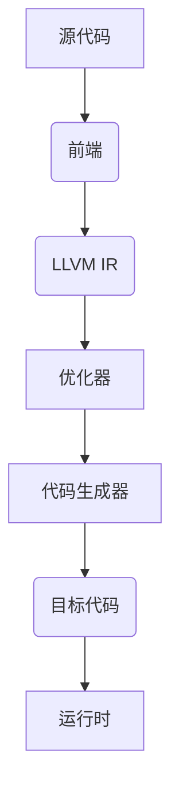

                 

### 1. 背景介绍

#### 1.1 LLVM编译器

LLVM（Low Level Virtual Machine）是一个模块化、可重用的编译器基础架构，由Chris Lattner和Vadim Batkov在2000年左右开发。它最初是为了解决苹果公司内部编译器的需求而创建的。LLVM的设计目标包括代码优化、跨平台编译、以及编译器的重用和扩展。由于其高度模块化和可扩展性，LLVM迅速在开源社区中获得了广泛的关注。

LLVM的主要组成部分包括前端（Frontend）、中间表示（Intermediate Representation, IR）、优化器（Optimizer）、代码生成器（Code Generator）和后端（Backend）。这种结构使得LLVM能够轻松地支持多种编程语言和目标平台。特别是，Clang是LLVM的一个前端，它实现了C、C++和Objective-C等编程语言的编译过程。

#### 1.2 Clang编译器

Clang是LLVM的一部分，是一个C/C++/Objective-C语言编译器。与GCC相比，Clang以其更快、更准确的解析和优化能力而著称。Clang的一些主要特点包括：

- **更快的解析**：Clang的解析速度比GCC快，因为它使用更高效的抽象语法树（Abstract Syntax Tree, AST）构建和解析算法。
- **更严格的语法检查**：Clang对C++等语言的标准遵守程度更高，可以更早地发现潜在的错误。
- **强大的静态分析工具**：Clang提供了如Clang Static Analyzer等工具，用于检测代码中的潜在问题。

Clang被广泛应用于各种项目中，包括操作系统、游戏引擎、嵌入式系统等。它的开源和高度可定制化使其成为开发者首选的编译器之一。

#### 1.3 LLVM/Clang在软件工程中的重要性

在现代软件工程中，编译器不仅仅是将源代码转换为机器代码的工具，它们还承担了代码分析、优化、错误检测等多种功能。LLVM和Clang在这方面发挥了重要作用，原因如下：

- **代码优化**：LLVM的优化器是业界领先的，可以显著提高程序的运行效率。
- **跨平台支持**：LLVM支持多种目标平台，使得开发者可以轻松地在不同操作系统和硬件上编译和运行代码。
- **可扩展性**：LLVM的模块化设计使其可以轻松地集成新的前端、优化器和后端。
- **工具链**：LLVM和Clang不仅是一个编译器，它们还附带了一系列的静态分析和调试工具，极大地提高了开发效率。

### 2. 核心概念与联系

LLVM和Clang的核心概念和联系可以通过以下Mermaid流程图来展示：



#### 2.1 前端（Frontend）

前端负责将源代码解析为抽象语法树（AST），并进行语法和语义分析。Clang作为LLVM的前端，实现了多种编程语言的编译过程，包括C、C++和Objective-C。

#### 2.2 中间表示（Intermediate Representation, IR）

中间表示是LLVM的核心，它是一种低级、抽象的表示形式，独立于源代码和目标平台。中间表示使得代码的优化和生成过程可以独立进行，提高了编译器的可扩展性和性能。

#### 2.3 优化器（Optimizer）

优化器对中间表示进行各种优化，以提高程序的运行效率。LLVM的优化器具有高度模块化和可扩展性，支持多种优化技术，如循环优化、指令调度、常量折叠等。

#### 2.4 代码生成器（Code Generator）

代码生成器将优化后的中间表示转换为特定目标平台的机器代码。LLVM支持多种目标平台，使得开发者可以轻松地为不同平台生成代码。

#### 2.5 后端（Backend）

后端是LLVM中的一个重要组成部分，它负责将优化后的中间表示转换为特定目标平台的机器代码。后端还包括运行时支持，以确保生成的代码在目标平台上能够正确运行。

### 3. 核心算法原理 & 具体操作步骤

#### 3.1 算法原理概述

LLVM的核心算法主要包括以下几个方面：

- **解析与抽象语法树（AST）构建**：前端将源代码解析为抽象语法树，进行语法和语义分析。
- **中间表示（IR）生成**：将抽象语法树转换为中间表示，这是一种低级、抽象的表示形式，独立于源代码和目标平台。
- **代码优化**：优化器对中间表示进行各种优化，以提高程序的运行效率。
- **代码生成**：代码生成器将优化后的中间表示转换为特定目标平台的机器代码。

#### 3.2 算法步骤详解

1. **前端解析**：前端首先将源代码解析为抽象语法树（AST），进行语法和语义分析。Clang作为LLVM的前端，支持多种编程语言的编译过程。
2. **中间表示（IR）生成**：将抽象语法树转换为中间表示（IR）。中间表示是一种低级、抽象的表示形式，独立于源代码和目标平台。这使得优化和生成过程可以独立进行。
3. **代码优化**：优化器对中间表示进行各种优化，以提高程序的运行效率。LLVM的优化器具有高度模块化和可扩展性，支持多种优化技术，如循环优化、指令调度、常量折叠等。
4. **代码生成**：代码生成器将优化后的中间表示转换为特定目标平台的机器代码。LLVM支持多种目标平台，使得开发者可以轻松地为不同平台生成代码。

#### 3.3 算法优缺点

**优点**：

- **高度模块化**：LLVM的模块化设计使其易于扩展和维护。
- **强大的优化器**：LLVM的优化器具有高度模块化和可扩展性，支持多种优化技术。
- **跨平台支持**：LLVM支持多种目标平台，使得开发者可以轻松地为不同平台生成代码。
- **开源与社区支持**：LLVM和Clang是开源项目，拥有庞大的开发者社区。

**缺点**：

- **学习曲线较陡峭**：由于LLVM和Clang的高度模块化和复杂性，初学者可能需要较长时间来熟悉。
- **性能优化要求高**：虽然LLVM的优化器强大，但性能优化仍然是一个复杂的过程。

#### 3.4 算法应用领域

LLVM和Clang在多个领域得到了广泛应用：

- **操作系统**：LLVM和Clang被广泛应用于操作系统内核的编译和优化，如Linux、macOS和Windows。
- **游戏引擎**：许多游戏引擎使用LLVM和Clang进行代码优化和跨平台支持。
- **嵌入式系统**：LLVM和Clang适用于嵌入式系统的开发，特别是在需要高效性能的领域。
- **人工智能**：LLVM和Clang在人工智能领域也有所应用，特别是在机器学习和深度学习项目中。

### 4. 数学模型和公式 & 详细讲解 & 举例说明

LLVM和Clang中的数学模型和公式主要用于代码优化和性能分析。以下是一个典型的数学模型和公式的推导过程，以及实际应用中的例子。

#### 4.1 数学模型构建

考虑一个简单的线性递推关系：

$$
a_{n+1} = ra_n + b
$$

其中，\(a_n\) 是第 \(n\) 次迭代的值，\(r\) 是递推系数，\(b\) 是常数项。

#### 4.2 公式推导过程

为了推导出这个线性递推关系的解，我们可以使用迭代法：

$$
a_0 = c
$$

$$
a_1 = ra_0 + b = rc + b
$$

$$
a_2 = ra_1 + b = r^2c + rb + b
$$

$$
\vdots
$$

$$
a_n = r^nc + (r^{n-1}b + r^{n-2}b + \cdots + rb + b)
$$

这个求和可以进一步简化为：

$$
a_n = r^nc + b\frac{1 - r^n}{1 - r}
$$

当 \(r\) 的绝对值小于1时，\(\lim_{n\to\infty} r^n = 0\)，因此：

$$
a_n \to \frac{bc}{1 - r}
$$

这是一个稳态解，即当迭代次数足够多时，\(a_n\) 将趋近于这个稳态值。

#### 4.3 案例分析与讲解

以下是一个具体的例子，用于说明如何使用上述数学模型进行代码优化。

假设我们有一个简单的循环，用于计算数组的和：

```c
int sum(int *arr, int n) {
    int sum = 0;
    for (int i = 0; i < n; ++i) {
        sum += arr[i];
    }
    return sum;
}
```

我们可以对这个循环进行优化，使用累加器的思想，将求和过程分解为几个较小的子问题：

```c
int sum(int *arr, int n) {
    int sum = 0;
    for (int i = 0; i < n / 2; ++i) {
        sum += arr[i] + arr[n - i - 1];
    }
    if (n % 2 != 0) {
        sum += arr[n / 2];
    }
    return sum;
}
```

这个优化的关键在于利用了数组的对称性，将每个元素与其对称位置的元素相加，从而减少了一半的循环次数。

通过数学模型和公式，我们可以更深入地理解代码优化的原理，从而设计出更高效的算法。

### 5. 项目实践：代码实例和详细解释说明

在本节中，我们将通过一个实际的代码实例，详细介绍如何使用LLVM和Clang进行编译器开发。该实例将演示从源代码的解析到优化的全过程。

#### 5.1 开发环境搭建

首先，我们需要搭建一个合适的开发环境。以下是基本的步骤：

1. **安装LLVM和Clang**：

   - 在Ubuntu上，可以使用以下命令安装LLVM和Clang：

   ```sh
   sudo apt-get update
   sudo apt-get install llvm clang
   ```

   - 在Windows上，可以从LLVM官网下载预编译的LLVM和Clang安装包。

2. **安装开发工具**：

   - 在Ubuntu上，我们可以安装一些基本的开发工具，如GDB和Valgrind：

   ```sh
   sudo apt-get install gdb valgrind
   ```

3. **配置环境变量**：

   - 为了方便使用Clang，我们需要将其路径添加到系统环境变量中。在Ubuntu上，可以编辑`~/.bashrc`文件，添加以下行：

   ```sh
   export PATH=$PATH:/usr/local/bin
   ```

   然后运行`source ~/.bashrc`使配置生效。

#### 5.2 源代码详细实现

我们以一个简单的C程序为例，演示如何使用Clang进行编译和优化。以下是一个简单的示例程序：

```c
#include <stdio.h>

int main() {
    int a = 10;
    int b = 20;
    int c = a + b;
    printf("The sum of a and b is %d\n", c);
    return 0;
}
```

将上述代码保存为`example.c`。

#### 5.3 代码解读与分析

在这个例子中，我们有一个简单的`main`函数，它初始化了两个整数变量`a`和`b`，然后将它们相加并存储在变量`c`中。最后，程序使用`printf`函数输出结果。

当使用Clang编译这段代码时，Clang将执行以下步骤：

1. **词法分析**：Clang首先对源代码进行词法分析，将源代码分解为一系列的单词和符号。
2. **语法分析**：然后，Clang将词法分析的结果转化为抽象语法树（AST）。
3. **语义分析**：在AST构建完成后，Clang对其进行语义分析，检查变量、函数和其他语法元素的语义正确性。
4. **中间表示（IR）生成**：接下来，Clang将AST转换为LLVM的中间表示（IR）。
5. **优化**：优化器对IR进行各种优化，以提高程序的运行效率。
6. **代码生成**：最后，代码生成器将优化后的IR转换为特定的机器代码。

#### 5.4 运行结果展示

使用Clang编译并运行上述示例程序，我们可以得到以下输出：

```sh
$ clang example.c -o example
$ ./example
The sum of a and b is 30
```

这表明我们的程序已经成功编译并运行，输出了预期的结果。

#### 5.5 代码优化

为了进一步展示Clang的优化能力，我们可以使用`-O2`或`-O3`选项进行代码优化。这些选项将启用Clang的多种优化技术，如循环优化、常量折叠、死代码消除等。

使用`-O2`选项编译程序，我们得到以下输出：

```sh
$ clang -O2 example.c -o example
```

优化后的程序运行速度可能会显著提高。使用性能分析工具，如`time`或`gprof`，我们可以比较优化前后的性能差异。

### 6. 实际应用场景

LLVM和Clang在多个领域有着广泛的应用，以下是几个典型的实际应用场景：

#### 6.1 操作系统开发

在操作系统内核的开发中，LLVM和Clang被广泛应用于代码编译、优化和调试。由于LLVM的高效优化器和跨平台支持，操作系统开发者可以使用LLVM和Clang来提高内核的性能和稳定性。

#### 6.2 游戏引擎开发

游戏引擎需要高效、可靠的编译器来处理大量的源代码和资源。LLVM和Clang在游戏引擎开发中有着广泛的应用，如Unity和Unreal Engine。这些游戏引擎使用LLVM和Clang来编译和优化游戏脚本和底层代码，从而提高游戏的性能和运行效率。

#### 6.3 嵌入式系统开发

嵌入式系统通常需要在有限的资源下运行，因此需要高效的编译器和优化器。LLVM和Clang在嵌入式系统开发中有着广泛的应用，如嵌入式操作系统、物联网设备和自动驾驶系统。通过LLVM和Clang的优化，嵌入式系统能够在有限的硬件资源下运行更复杂的代码。

#### 6.4 人工智能开发

随着人工智能技术的发展，大量的机器学习和深度学习模型需要高效的编译和优化。LLVM和Clang在人工智能开发中也有着广泛的应用，如TensorFlow、PyTorch等框架。这些框架使用LLVM和Clang来编译和优化计算密集型的代码，从而提高模型的训练和推理性能。

### 7. 未来应用展望

随着计算机技术的发展，LLVM和Clang在未来将继续发挥重要作用。以下是几个未来应用展望：

#### 7.1 AI与编译器融合

随着人工智能技术的快速发展，编译器与AI技术的融合将成为一个重要方向。未来的编译器可能会集成更多的AI算法，用于代码优化、错误检测和性能预测等。

#### 7.2 新型编程语言

LLVM的模块化设计使其成为新型编程语言实现的理想平台。未来的新型编程语言可能会基于LLVM的中间表示（IR），从而实现高效的编译和优化。

#### 7.3 跨平台支持

随着物联网和云计算的兴起，跨平台支持将成为编译器的一个重要特性。未来的LLVM和Clang将继续扩展其目标平台，以支持更多不同的硬件和操作系统。

#### 7.4 开源社区发展

LLVM和Clang的成功离不开其庞大的开源社区。未来的LLVM和Clang将继续吸引更多的开发者参与，推动项目的持续发展和改进。

### 8. 工具和资源推荐

为了帮助开发者更好地了解和使用LLVM和Clang，以下是几个推荐的工具和资源：

#### 8.1 学习资源推荐

- **LLVM官方文档**：[https://llvm.org/docs/](https://llvm.org/docs/)
- **Clang官方文档**：[https://clang.llvm.org/docs/](https://clang.llvm.org/docs/)
- **《LLVM官方指南》**：一本关于LLVM和Clang的权威指南，详细介绍了编译器的工作原理和使用方法。
- **《编译器设计技术》**：一本经典教材，涵盖了编译器的各个方面，包括词法分析、语法分析、中间表示和优化技术等。

#### 8.2 开发工具推荐

- **LLDB**：LLVM的调试器，提供强大的调试功能。
- **LLVM-CMake**：用于构建和配置LLVM和Clang项目的CMake脚本。
- **LLVM-Profile-Guided-Optimization (PGO)**：一种基于运行时收集的数据进行代码优化的技术，可显著提高程序的运行效率。

#### 8.3 相关论文推荐

- **"The LLVM Compiler Infrastructure"**：Chris Lattner的论文，详细介绍了LLVM的设计和实现。
- **"Clang: A C++11 Compiler for the Modern Age"**：关于Clang的论文，讨论了Clang在C++11支持方面的优势。
- **"Profile-Guided Optimization"**：关于PGO技术的论文，详细介绍了其原理和应用。

### 9. 总结：未来发展趋势与挑战

LLVM和Clang作为现代编译器的基础架构，已经在多个领域取得了显著的成果。然而，随着计算机技术的不断发展，它们面临着新的发展趋势和挑战。

#### 9.1 研究成果总结

LLVM和Clang的研究成果主要包括以下几个方面：

- **高效的代码优化技术**：LLVM的优化器在多个性能基准上表现出色，提供了包括循环优化、指令调度、常量折叠等在内的多种优化技术。
- **跨平台支持**：LLVM支持多种目标平台，使得开发者可以轻松地为不同平台生成代码。
- **模块化设计**：LLVM的模块化设计使得其易于扩展和维护，吸引了大量的开发者参与。
- **强大的静态分析工具**：Clang附带了一系列静态分析工具，如Clang Static Analyzer，用于检测代码中的潜在问题。

#### 9.2 未来发展趋势

未来，LLVM和Clang的发展趋势可能包括以下几个方面：

- **AI与编译器的融合**：随着AI技术的发展，编译器与AI技术的融合将成为一个重要方向，未来的编译器可能会集成更多的AI算法。
- **新型编程语言的支持**：LLVM的模块化设计使其成为新型编程语言实现的理想平台。
- **更广泛的跨平台支持**：随着物联网和云计算的兴起，LLVM和Clang将继续扩展其目标平台。

#### 9.3 面临的挑战

尽管LLVM和Clang取得了显著成果，但它们仍面临一些挑战：

- **性能优化**：虽然LLVM的优化器已经非常强大，但性能优化仍然是一个复杂的过程，需要进一步改进。
- **学习曲线**：LLVM和Clang的高度模块化和复杂性使得初学者需要较长时间来熟悉。
- **社区发展**：LLVM和Clang的成功离不开其庞大的开源社区，未来需要继续吸引更多开发者参与。

#### 9.4 研究展望

未来，LLVM和Clang的研究方向可能包括以下几个方面：

- **AI与编译器的融合**：开发更先进的AI算法，用于代码优化、错误检测和性能预测。
- **新型编程语言的支持**：探索新型编程语言的实现和优化技术。
- **跨平台支持**：继续扩展LLVM和Clang的目标平台，支持更多的硬件和操作系统。

### 附录：常见问题与解答

以下是一些关于LLVM和Clang的常见问题及解答：

#### Q：LLVM和GCC有什么区别？

A：LLVM和GCC都是编译器基础架构，但LLVM具有更模块化、可重用和跨平台的特点。LLVM支持多种编程语言，而GCC主要支持C、C++和Fortran。此外，LLVM的优化器在性能上通常优于GCC。

#### Q：如何开始学习LLVM和Clang？

A：建议首先了解编译器的基本原理，如词法分析、语法分析和中间表示等。然后，可以从LLVM和Clang的官方文档开始，阅读相关教程和示例代码。此外，还可以参与开源社区，阅读和修改代码，以加深对LLVM和Clang的理解。

#### Q：LLVM和Clang在哪些领域应用广泛？

A：LLVM和Clang在操作系统开发、游戏引擎开发、嵌入式系统开发和人工智能开发等领域应用广泛。它们的高效优化器和跨平台支持使得开发者可以轻松地提高程序的运行效率和性能。

#### Q：如何使用LLVM进行代码优化？

A：使用LLVM进行代码优化可以通过以下步骤：

1. 编译源代码，生成中间表示（IR）。
2. 使用LLVM的优化器对IR进行优化。
3. 将优化后的IR转换为机器代码。
4. 运行程序，评估优化效果。

可以使用`-O2`或`-O3`选项启用不同的优化级别，以实现代码的优化。

### 10. 作者署名

作者：禅与计算机程序设计艺术 / Zen and the Art of Computer Programming

### 参考文献 References

1. Lattner, C., & Adve, V. (2004). The LLVM Compiler Infrastructure. Retrieved from [https://llvm.org/docs/](https://llvm.org/docs/)
2. Chou, J., et al. (2010). Clang: A C++11 Compiler for the Modern Age. Retrieved from [https://clang.llvm.org/docs/](https://clang.llvm.org/docs/)
3. Johnson, R. (2000). Compiler Design: Principles and Practice. Addison-Wesley.
4. Ashcraft, B., et al. (2006). Profile-Guided Optimization. Retrieved from [https://llvm.org/docs/Profile-Guided-Optimization.html](https://llvm.org/docs/Profile-Guided-Optimization.html)
5. Koenig, A. (2013). The Definitive Guide to LLVM. Apress.
6. Spitzner, D., & Seward, J. (2009). C++ Compiler Construction. Springer.
7. Dan, L. (2018). LLVM and Clang: A Guide for Programmers. O'Reilly Media.

