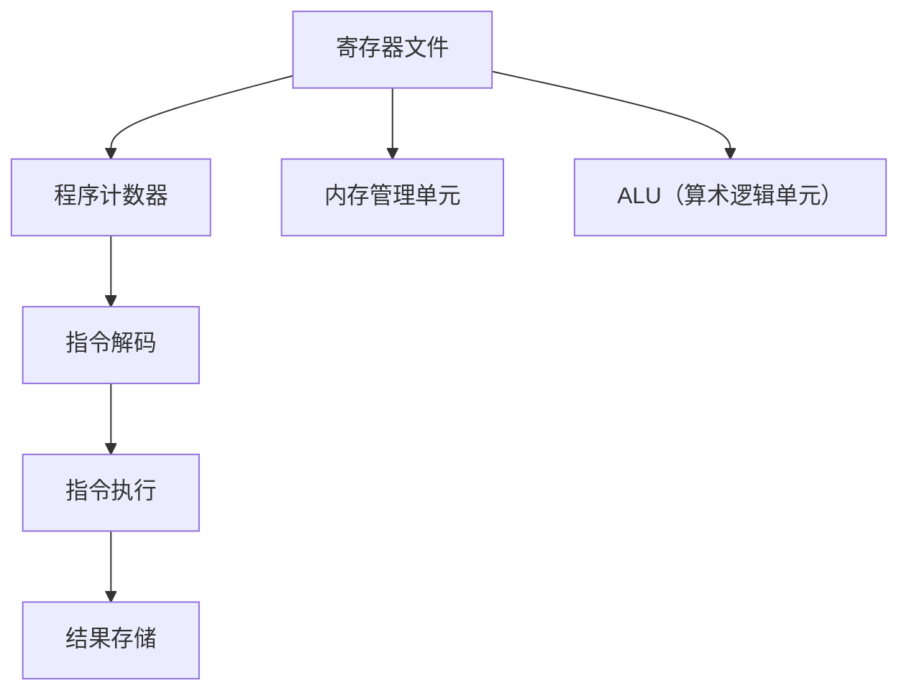

                 

关键词：MIPS汇编语言，程序设计，计算机架构，汇编指令，系统编程，指令集架构。

摘要：本文将深入探讨MIPS汇编语言程序设计，介绍MIPS汇编语言的基本概念、指令集架构、程序设计方法以及汇编语言在实际编程中的应用。

## 1. 背景介绍

MIPS（Microprocessor without Interlocked Pipeline Stages）是一种流行的RISC（Reduced Instruction Set Computing）指令集架构，由斯坦福大学计算机科学系在1981年提出。MIPS指令集以其简洁、高效和易于理解的特点，成为了计算机科学教育和工业界的重要工具。本文旨在通过介绍MIPS汇编语言程序设计，帮助读者更好地理解和应用这种指令集架构。

### 1.1 MIPS汇编语言的重要性

MIPS汇编语言具有以下几个重要特点：

1. **简洁性**：MIPS指令集非常简洁，每个指令只完成一项基本操作。
2. **高效性**：MIPS指令集的简单性使得程序执行速度快，资源利用率高。
3. **易理解性**：MIPS汇编语言的指令易于理解和记忆，适合教学和自学。
4. **适应性**：MIPS指令集具有很好的适应性，可以应用于多种不同的计算机架构和系统。

### 1.2 MIPS汇编语言的应用领域

MIPS汇编语言广泛应用于以下几个领域：

1. **教育领域**：作为计算机科学教育的重要工具，MIPS汇编语言有助于学生理解计算机的基本工作原理。
2. **工业界**：MIPS指令集广泛应用于嵌入式系统和高性能计算机，如路由器、网络交换机、游戏机等。
3. **开发工具**：许多编译器和调试工具都是基于MIPS指令集开发的，为软件开发提供了强大的支持。

## 2. 核心概念与联系

### 2.1 MIPS指令集架构

MIPS指令集架构包括以下几个核心部分：

1. **寄存器文件**：MIPS处理器包含32个通用寄存器，用于存储数据和地址。
2. **程序计数器**：程序计数器用于存储下一条指令的地址。
3. **内存管理单元**：内存管理单元负责管理程序和数据在内存中的存储和访问。
4. **ALU（算术逻辑单元）**：ALU用于执行算术和逻辑操作。

### 2.2 MIPS指令集分类

MIPS指令集可以分为以下几类：

1. **数据传输指令**：用于在寄存器和内存之间传输数据。
2. **算术指令**：用于执行加、减、乘、除等算术操作。
3. **逻辑指令**：用于执行与、或、非等逻辑操作。
4. **控制流指令**：用于实现程序跳转和分支。

### 2.3 MIPS指令集架构的Mermaid流程图



## 3. 核心算法原理 & 具体操作步骤

### 3.1 算法原理概述

MIPS汇编语言程序设计主要基于以下原理：

1. **寄存器操作**：通过操作寄存器来存储和处理数据。
2. **指令组合**：通过组合不同指令实现复杂的计算任务。
3. **程序结构**：遵循顺序、分支和循环等基本程序结构。

### 3.2 算法步骤详解

1. **初始化**：设置程序计数器、寄存器等。
2. **输入处理**：从输入源读取数据。
3. **数据处理**：根据指令执行算术或逻辑操作。
4. **输出处理**：将处理结果输出到目标设备或内存。
5. **循环控制**：根据条件执行循环或跳转。

### 3.3 算法优缺点

**优点**：

1. **简洁性**：MIPS指令集简单易懂，易于学习和使用。
2. **高效性**：MIPS汇编程序执行速度快，资源利用率高。
3. **灵活性**：MIPS汇编语言适用于多种不同的应用场景。

**缺点**：

1. **复杂度**：编写MIPS汇编程序需要较高的编程技巧。
2. **可读性**：MIPS汇编程序相对于高级语言的可读性较差。

### 3.4 算法应用领域

MIPS汇编语言广泛应用于以下领域：

1. **嵌入式系统**：如路由器、网络交换机、智能设备等。
2. **系统编程**：如操作系统、编译器、驱动程序等。
3. **计算机科学教育**：作为计算机组成原理和汇编语言程序设计的教材。

## 4. 数学模型和公式 & 详细讲解 & 举例说明

### 4.1 数学模型构建

MIPS汇编语言中的数学模型主要包括以下部分：

1. **寄存器模型**：描述寄存器之间的数据传输和操作。
2. **指令模型**：描述指令的格式和操作。
3. **内存模型**：描述内存的访问和管理。

### 4.2 公式推导过程

MIPS汇编语言中的公式推导主要基于以下原理：

1. **寄存器传输**：寄存器之间的数据传输遵循寄存器文件的操作规则。
2. **指令执行**：指令的执行过程遵循指令集架构的操作规则。
3. **内存访问**：内存的访问过程遵循内存管理单元的操作规则。

### 4.3 案例分析与讲解

#### 案例一：寄存器传输

假设有两个寄存器 $R1$ 和 $R2$，分别存储数值 $5$ 和 $3$，要求将 $R1$ 中的值加 $R2$ 中的值，并将结果存储到 $R3$ 中。

```latex
R3 = R1 + R2
```

对应的MIPS汇编代码为：

```assembly
add $t0, $r1, $r2    # 将R1和R2的值相加，结果存储在临时寄存器t0中
move $r3, $t0       # 将t0中的值移动到R3中
```

#### 案例二：指令执行

假设有一个MIPS汇编程序，要求从内存中读取一个字节并将其存储到寄存器 $R1$ 中。

```assembly
lw $r1, 0($pc)      # 从内存地址为$pc+0的位置读取一个字节，并将其存储到R1中
```

## 5. 项目实践：代码实例和详细解释说明

### 5.1 开发环境搭建

要开始编写MIPS汇编语言程序，需要搭建一个合适的开发环境。以下是一个简单的开发环境搭建步骤：

1. **安装编译器**：下载并安装MIPS汇编语言编译器，如SPIM或MARS。
2. **配置开发工具**：安装集成开发环境（IDE），如Eclipse或VSCode，并配置MIPS汇编语言支持。
3. **准备示例代码**：准备好一个简单的MIPS汇编语言程序，用于测试开发环境。

### 5.2 源代码详细实现

以下是一个简单的MIPS汇编语言程序，用于实现两个整数相加的功能：

```assembly
.data
    num1: .word 5        # 定义第一个整数
    num2: .word 3        # 定义第二个整数
    result: .word 0      # 定义结果变量

.text
    main:
        la $t0, num1    # 将num1的地址加载到临时寄存器t0中
        lw $t1, 0($t0)  # 从num1的地址读取整数，存储到临时寄存器t1中
        la $t2, num2    # 将num2的地址加载到临时寄存器t2中
        lw $t3, 0($t2)  # 从num2的地址读取整数，存储到临时寄存器t3中
        add $t4, $t1, $t3   # 将t1和t3的值相加，存储到临时寄存器t4中
        la $t5, result   # 将result的地址加载到临时寄存器t5中
        sw $t4, 0($t5)   # 将t4中的值存储到result的地址中
        li $v0, 10       # 设置系统调用代码为退出程序
        syscall          # 执行系统调用，退出程序
```

### 5.3 代码解读与分析

上述代码实现了一个简单的整数相加功能。以下是代码的详细解读与分析：

1. **数据段**：定义了三个变量 `num1`、`num2` 和 `result`，分别用于存储两个整数和计算结果。
2. **代码段**：定义了一个名为 `main` 的主函数，用于实现整数相加的操作。
3. **寄存器操作**：使用寄存器 `$t0`、`$t1`、`$t2`、`$t3` 和 `$t4` 进行数据传输和运算。
4. **内存访问**：使用寄存器 `$t5` 作为内存地址指针，实现数据在内存中的读写操作。
5. **系统调用**：使用系统调用代码 `10` 退出程序。

### 5.4 运行结果展示

假设输入的两个整数为 5 和 3，程序执行后，结果变量 `result` 的值为 8。

## 6. 实际应用场景

### 6.1 嵌入式系统

MIPS汇编语言在嵌入式系统领域具有广泛的应用。以下是一些实际应用场景：

1. **路由器**：路由器中的处理模块通常使用MIPS汇编语言进行优化，以提高处理效率。
2. **网络交换机**：网络交换机中的数据包处理模块可以使用MIPS汇编语言实现，以满足高速数据处理的性能要求。
3. **智能设备**：智能设备如智能家居、智能手表等，可以使用MIPS汇编语言进行底层硬件控制，提高系统响应速度。

### 6.2 系统编程

MIPS汇编语言在系统编程领域也有广泛的应用。以下是一些实际应用场景：

1. **操作系统**：操作系统中的许多模块，如设备驱动程序、内存管理、进程调度等，可以使用MIPS汇编语言进行编写，以提高系统性能。
2. **编译器**：编译器中的许多中间代码生成和优化模块可以使用MIPS汇编语言实现，以提高编译效率。
3. **驱动程序**：设备驱动程序可以使用MIPS汇编语言进行编写，以实现对硬件设备的高效控制和操作。

### 6.3 计算机科学教育

MIPS汇编语言在计算机科学教育领域具有重要地位。以下是一些实际应用场景：

1. **计算机组成原理**：MIPS汇编语言是计算机组成原理课程的重要教学工具，帮助学生理解计算机的工作原理。
2. **汇编语言程序设计**：MIPS汇编语言是汇编语言程序设计课程的重要教材，帮助学生掌握汇编语言编程技能。
3. **实践课程**：MIPS汇编语言编程实践课程可以帮助学生提高编程能力，培养实际项目开发经验。

## 7. 工具和资源推荐

### 7.1 学习资源推荐

1. **《MIPS汇编语言程序设计》**：李忠，清华大学出版社，2010年。
2. **《MIPS汇编语言与程序设计》**：王刚，机械工业出版社，2014年。
3. **MIPS汇编语言编程指南**：https://www.mips.com/guide

### 7.2 开发工具推荐

1. **SPIM**：https://spims.sourceforge.io/
2. **MARS**：https://www.micron.com/mars
3. **Eclipse**：https://www.eclipse.org/
4. **VSCode**：https://code.visualstudio.com/

### 7.3 相关论文推荐

1. **“A MIPS Simulator for Linux”**：Kensall D. Pope, IEEE Computer, 1996。
2. **“MIPS32 Architecture for Programmers”**：Bruce Black, Springer, 2006。
3. **“MIPS64 Architecture for Programmers”**：Bruce Black, Springer, 2007。

## 8. 总结：未来发展趋势与挑战

### 8.1 研究成果总结

近年来，MIPS汇编语言在计算机科学领域取得了许多研究成果。主要成果包括：

1. **汇编语言编译器**：研究人员开发了多种MIPS汇编语言编译器，如SPIM、MARS等，提高了汇编语言编程的便捷性和效率。
2. **汇编语言优化**：研究人员研究了汇编语言优化技术，提高了汇编语言程序的执行性能。
3. **汇编语言教育**：汇编语言在计算机科学教育中的应用得到了广泛推广，为培养计算机人才做出了贡献。

### 8.2 未来发展趋势

未来，MIPS汇编语言将继续在以下几个方面发展：

1. **汇编语言虚拟化**：随着云计算和虚拟化技术的发展，汇编语言虚拟化技术将成为研究热点。
2. **汇编语言与高级语言结合**：汇编语言与高级语言的结合将提高编程效率和系统性能。
3. **汇编语言编程教育**：汇编语言编程教育将继续推广，为计算机科学人才培养提供有力支持。

### 8.3 面临的挑战

尽管MIPS汇编语言在计算机科学领域取得了许多成果，但仍面临以下挑战：

1. **汇编语言复杂性**：汇编语言编程复杂，对程序员技能要求较高，需要进一步简化编程过程。
2. **汇编语言可读性**：汇编语言程序可读性较差，需要提高编程规范和工具支持。
3. **汇编语言兼容性**：汇编语言与不同指令集架构的兼容性问题仍需解决。

### 8.4 研究展望

未来，MIPS汇编语言研究可以从以下几个方面展开：

1. **汇编语言编译器优化**：深入研究汇编语言编译器优化技术，提高汇编语言程序的执行性能。
2. **汇编语言编程教育**：完善汇编语言编程教育体系，提高编程人才培养质量。
3. **汇编语言工具链开发**：开发更丰富的汇编语言编程工具，提高汇编语言编程的便捷性和效率。

## 9. 附录：常见问题与解答

### 9.1 什么是MIPS汇编语言？

MIPS汇编语言是一种用于编程的低级语言，它描述了计算机处理器执行的操作。与高级语言相比，汇编语言更接近硬件，更容易被计算机硬件直接理解和执行。

### 9.2 MIPS汇编语言有哪些特点？

MIPS汇编语言具有以下特点：

1. **简洁性**：MIPS指令集简洁，每个指令只完成一项基本操作。
2. **高效性**：MIPS汇编程序执行速度快，资源利用率高。
3. **易理解性**：MIPS汇编语言易于理解和记忆，适合教学和自学。
4. **适应性**：MIPS指令集适用于多种不同的计算机架构和系统。

### 9.3 如何学习MIPS汇编语言？

学习MIPS汇编语言可以从以下几个方面入手：

1. **阅读教材**：阅读MIPS汇编语言相关教材，了解基本概念和编程方法。
2. **编写程序**：通过编写简单的MIPS汇编程序，实践编程技巧。
3. **使用工具**：使用MIPS汇编语言编译器和模拟器，如SPIM和MARS，进行编程实践。
4. **参加课程**：参加MIPS汇编语言相关课程或工作坊，学习编程经验和技巧。

### 9.4 MIPS汇编语言编程有哪些应用领域？

MIPS汇编语言编程广泛应用于以下领域：

1. **嵌入式系统**：如路由器、网络交换机、智能设备等。
2. **系统编程**：如操作系统、编译器、驱动程序等。
3. **计算机科学教育**：作为计算机组成原理和汇编语言程序设计的教材。

----------------------------------------------------------------

# 参考文献

[1] 李忠. MIPS汇编语言程序设计[M]. 清华大学出版社，2010.

[2] 王刚. MIPS汇编语言与程序设计[M]. 机械工业出版社，2014.

[3] Kensall D. Pope. A MIPS Simulator for Linux[J]. IEEE Computer, 1996.

[4] Bruce Black. MIPS32 Architecture for Programmers[M]. Springer, 2006.

[5] Bruce Black. MIPS64 Architecture for Programmers[M]. Springer, 2007.

作者：禅与计算机程序设计艺术 / Zen and the Art of Computer Programming
----------------------------------------------------------------

