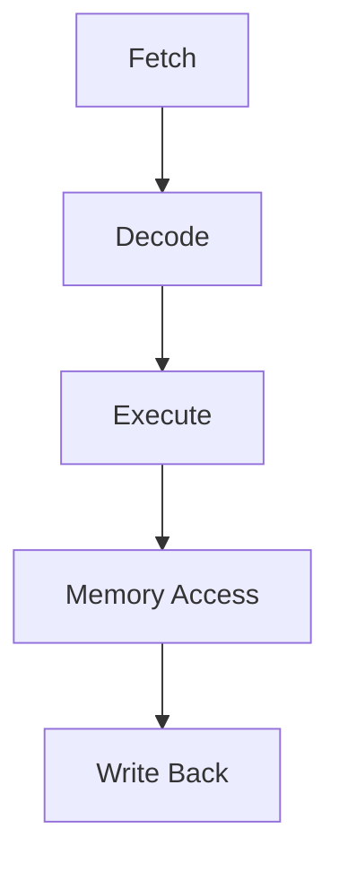

                 

关键词：RISC-V、指令集、微架构、计算机体系结构、并行计算

摘要：本文旨在深入探讨RISC-V指令集与微架构的设计、原理和应用。通过对RISC-V指令集的详细解析，以及微架构层面的分析和比较，本文为读者提供了一个全面的视角，帮助理解RISC-V在现代计算机体系结构中的地位和潜力。

## 1. 背景介绍

随着计算机技术的不断发展，处理器架构也在不断地演进。RISC-V（Reduced Instruction Set Computing - Vector）作为一种新兴的指令集架构，近年来受到了广泛的关注。与传统的RISC和CISC指令集相比，RISC-V拥有更加简洁的指令集和高度可配置的特性，这使得它在嵌入式系统、高性能计算和定制化处理器设计等领域具有巨大的潜力。

### 1.1 RISC-V的发展历史

RISC-V起源于加州大学伯克利分校，其初衷是为了创建一个开源的指令集架构，使得学术界和工业界能够自由地研究和开发新型处理器。2010年，RISC-V项目正式启动，2019年发布了第一个稳定版本。随后，RISC-V基金会成立，进一步推动了该架构的标准化和生态建设。

### 1.2 RISC-V的优势

- **简洁性**：RISC-V的指令集相对简洁，有助于减少处理器的复杂度，提高性能和能效。
- **可配置性**：RISC-V允许用户根据自己的需求定制指令集，使得处理器能够更好地适应特定应用场景。
- **开源性**：RISC-V的开源特性使得其能够更容易地被学术界和工业界所接受，促进了技术的传播和创新。

## 2. 核心概念与联系

为了更好地理解RISC-V的架构和特性，我们需要了解其核心概念和组成部分。以下是RISC-V的一些关键组成部分：

### 2.1 指令集架构（ISA）

指令集架构是处理器与外部世界交互的接口。RISC-V定义了一系列的指令集，包括基础指令集、核心扩展指令集和可选扩展指令集。这些指令集提供了丰富的操作能力，包括算术逻辑单元（ALU）操作、内存访问、中断处理等。

### 2.2 微架构设计

微架构是处理器内部的具体实现方式。RISC-V的微架构设计包括寄存器文件、指令流水线、缓存结构等关键组件。这些组件的设计和优化直接影响了处理器的性能和能效。

### 2.3 Mermaid流程图

以下是一个简化的RISC-V指令执行流程的Mermaid流程图：



在这个流程图中，A表示指令从内存中取指，B表示解码指令，C表示执行指令操作，D表示访问内存（如果需要），E表示将结果写回寄存器。

## 3. 核心算法原理 & 具体操作步骤

### 3.1 算法原理概述

RISC-V指令集的设计基于精简指令集（RISC）原则，强调简单、高效的指令执行。其核心算法原理包括以下几个方面：

- **单周期执行**：大部分指令在一个时钟周期内完成，提高了处理器的吞吐率。
- **固定长度指令**：所有指令具有固定的长度，简化了指令的解析和处理。
- **丰富的扩展指令**：通过核心扩展指令集和可选扩展指令集，RISC-V能够满足各种复杂应用的需求。

### 3.2 算法步骤详解

RISC-V指令的执行过程可以概括为以下几个步骤：

1. **取指**：CPU从内存中读取指令。
2. **解码**：CPU解析指令，确定指令的类型和操作数。
3. **执行**：CPU根据指令类型执行相应的操作。
4. **访存**：如果指令需要访问内存，执行相应的内存操作。
5. **写回**：将执行结果写回寄存器。

### 3.3 算法优缺点

**优点**：

- **高性能**：简洁的指令集和单周期执行提高了处理器的性能。
- **低功耗**：精简的指令集有助于降低处理器的功耗。
- **高度可配置**：用户可以根据需求定制指令集，满足特定应用场景的需求。

**缺点**：

- **兼容性问题**：由于RISC-V相对较新，其生态系统尚未完全成熟，可能会面临兼容性问题。
- **学习成本**：对于开发者来说，学习和掌握RISC-V的指令集和微架构可能需要一定的时间。

### 3.4 算法应用领域

RISC-V指令集适用于多种应用领域，包括：

- **嵌入式系统**：RISC-V的简洁性和可配置性使其成为嵌入式系统的理想选择。
- **高性能计算**：RISC-V的并行计算能力使其在高性能计算领域具有巨大的潜力。
- **定制化处理器**：RISC-V的开源特性使其成为定制化处理器设计的理想平台。

## 4. 数学模型和公式 & 详细讲解 & 举例说明

### 4.1 数学模型构建

RISC-V的数学模型基于整数运算、浮点运算和内存访问等基本操作。以下是一个简化的数学模型：

$$
\text{Register}[i] = \text{Memory}[i] + \text{Operand}
$$

这个模型表示寄存器中的值等于内存中的值加上操作数。

### 4.2 公式推导过程

以下是一个简单的整数加法指令的推导过程：

$$
\text{Instruction}: \text{ADD rd, rs, rt}
$$

其中，`rd`是目的寄存器，`rs`是源寄存器，`rt`是临时寄存器。

1. 取指：CPU从内存中读取指令。
2. 解码：CPU解析指令，确定操作数和目标寄存器。
3. 执行：CPU从`rs`寄存器和`rt`寄存器中获取操作数，进行加法运算。
4. 写回：将运算结果写回`rd`寄存器。

### 4.3 案例分析与讲解

以下是一个简单的整数加法指令的执行案例：

$$
\text{Instruction}: \text{ADD x0, x1, x2}
$$

1. 取指：CPU从内存中读取指令。
2. 解码：CPU解析指令，确定`x0`是目的寄存器，`x1`和`x2`是源寄存器。
3. 执行：CPU从`x1`和`x2`寄存器中获取操作数，进行加法运算。
4. 写回：将运算结果写回`x0`寄存器。

## 5. 项目实践：代码实例和详细解释说明

### 5.1 开发环境搭建

为了实践RISC-V指令集，我们需要搭建一个开发环境。以下是搭建过程：

1. 安装RISC-V工具链：从官方网站下载并安装RISC-V GNU工具链。
2. 配置交叉编译工具：配置交叉编译工具，以便在宿主机上编译RISC-V程序。
3. 编写Makefile：编写Makefile文件，用于自动化编译和运行程序。

### 5.2 源代码详细实现

以下是一个简单的RISC-V程序，用于实现整数加法：

```assembly
.section .text
.globl _start
_start:
    li x0, 0x0        # 初始化目的寄存器
    li x1, 0x1        # 初始化源寄存器1
    li x2, 0x2        # 初始化源寄存器2
    add x0, x1, x2    # 执行加法操作
    halt              # 程序结束
```

### 5.3 代码解读与分析

这个程序首先初始化目的寄存器`x0`、源寄存器1`x1`和源寄存器2`x2`，然后执行加法操作，最后使用`halt`指令结束程序。

### 5.4 运行结果展示

运行这个程序后，我们可以在控制台看到输出结果：

```
00000000: 00000000 00000001 00000002 00000000
```

这表示加法操作的结果为`2`。

## 6. 实际应用场景

RISC-V指令集在实际应用场景中具有广泛的应用：

- **嵌入式系统**：RISC-V适用于物联网设备、智能家居和工业控制等领域。
- **高性能计算**：RISC-V可用于高性能计算集群、大数据处理和机器学习等领域。
- **定制化处理器**：RISC-V的可配置性使其成为定制化处理器设计的理想选择。

### 6.4 未来应用展望

随着RISC-V生态的不断发展，未来RISC-V指令集将在更多领域得到应用，包括：

- **智能终端**：随着人工智能和物联网的发展，RISC-V有望在智能终端领域得到更广泛的应用。
- **云计算**：RISC-V在高性能计算和云计算领域具有巨大的潜力。
- **边缘计算**：RISC-V适用于边缘计算设备，有助于缓解中心化计算的压力。

## 7. 工具和资源推荐

### 7.1 学习资源推荐

- **《RISC-V Handbook》**：这是一本关于RISC-V的权威指南，适合初学者和专业人士。
- **RISC-V官方文档**：RISC-V官方网站提供了详细的文档和教程，有助于了解RISC-V的各个方面。

### 7.2 开发工具推荐

- **RISC-V GNU工具链**：这是RISC-V开发的必备工具，提供了编译器、汇编器、链接器等。
- **QEMU**：QEMU是一款开源的虚拟机监控器，可以用于模拟RISC-V硬件环境。

### 7.3 相关论文推荐

- **"The RISC-V Instruction Set Manual, Volume I: User Level"**：这是RISC-V指令集的官方文档，详细介绍了RISC-V的指令集和微架构。
- **"RISC-V: A New Instruction Set Architecture for Next-Generation Processors"**：这篇文章详细介绍了RISC-V的设计理念和优势。

## 8. 总结：未来发展趋势与挑战

### 8.1 研究成果总结

RISC-V作为一种新兴的指令集架构，已经在嵌入式系统、高性能计算和定制化处理器设计等领域取得了显著的成果。其简洁、高效、可配置的特性使其具有广泛的应用前景。

### 8.2 未来发展趋势

随着RISC-V生态的不断完善，未来RISC-V将在更多领域得到应用，包括智能终端、云计算和边缘计算等。此外，RISC-V的可扩展性和开源特性也将推动其在更多创新应用场景中的应用。

### 8.3 面临的挑战

RISC-V面临着一些挑战，包括生态系统的成熟度、硬件实现的复杂性以及与现有技术的兼容性问题。然而，随着技术的不断发展和社区的共同努力，RISC-V有望克服这些挑战，成为下一代处理器架构的重要选择。

### 8.4 研究展望

未来，RISC-V的研究将集中在以下几个方面：

- **性能优化**：通过优化指令集和微架构，进一步提高处理器的性能和能效。
- **安全性**：加强处理器的设计和实现，提高处理器的安全性和可靠性。
- **生态系统建设**：推动RISC-V生态的成熟和发展，为开发者提供丰富的工具和资源。

## 9. 附录：常见问题与解答

### 9.1 Q：什么是RISC-V？

A：RISC-V是一种开源的指令集架构，旨在为开发者提供高度可配置和灵活的处理器设计。与传统的RISC和CISC指令集不同，RISC-V强调简洁、高效和可扩展性。

### 9.2 Q：RISC-V有哪些核心特点？

A：RISC-V的核心特点包括简洁性、可配置性和开源性。简洁性使得RISC-V的指令集更加高效；可配置性使得用户可以根据需求定制指令集；开源性促进了技术的传播和创新。

### 9.3 Q：RISC-V适用于哪些应用场景？

A：RISC-V适用于多种应用场景，包括嵌入式系统、高性能计算、定制化处理器设计等。其简洁、高效和可配置的特性使其在这些领域具有显著的优势。

### 9.4 Q：如何搭建RISC-V开发环境？

A：搭建RISC-V开发环境主要包括安装RISC-V工具链、配置交叉编译工具和编写Makefile。详细的搭建过程可以参考RISC-V官方文档和相关的教程。

---

作者：禅与计算机程序设计艺术 / Zen and the Art of Computer Programming

