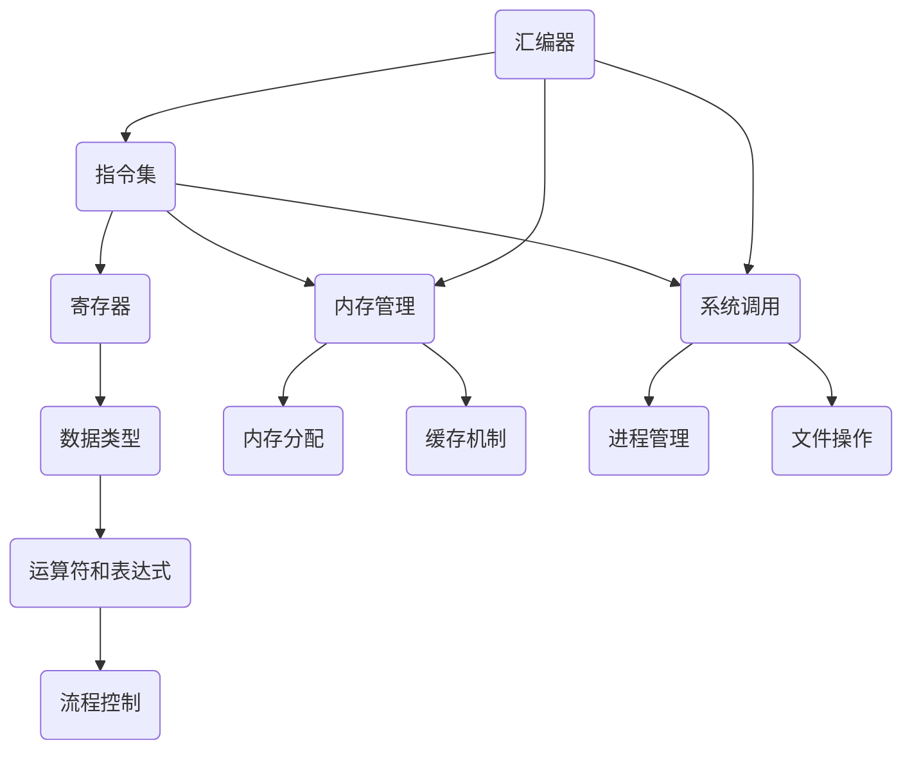

                 

  
> **关键词**：x86汇编语言，编程技巧，优化，内存管理，指令集，系统调用，汇编指令，架构设计

> **摘要**：本文深入探讨了x86汇编语言的高级编程技巧，包括汇编指令集的优化、内存管理策略、系统调用机制，以及汇编编程在实际项目中的应用和未来发展趋势。通过详细的实例解析，帮助读者掌握汇编语言的核心要点，提升编程能力和系统性能。

## 1. 背景介绍

x86汇编语言是一种低级编程语言，用于直接操作计算机硬件资源。它具有强大的指令集，能够直接访问内存、寄存器和I/O设备，是计算机体系结构设计和操作系统开发的重要工具。虽然现代编程语言如C、C++等提供了更高的抽象层，但在某些情况下，汇编语言仍然是不可或缺的选择。例如，在需要精确控制硬件资源、优化系统性能或进行嵌入式系统开发时，汇编语言的优势尤为明显。

随着计算机技术的发展，x86架构经历了从16位到32位，再到64位的演变。汇编语言的语法和指令集也相应进行了调整。本文将重点关注现代x86-64架构下的高级编程技巧，包括指令级优化、内存管理、系统调用等，旨在帮助读者深入理解并有效利用汇编语言的强大功能。

## 2. 核心概念与联系

在深入探讨汇编语言的高级编程技巧之前，我们需要了解一些核心概念和它们之间的联系。以下是一个简单的Mermaid流程图，展示了一些关键概念及其相互关系：



### 2.1 指令集

指令集是汇编语言的核心，它定义了汇编语言所能使用的所有操作。现代x86-64架构的指令集包括算术指令、逻辑指令、数据传输指令、控制指令等。通过对指令集的深入理解，我们可以编写高效的汇编代码来优化程序性能。

### 2.2 寄存器

寄存器是计算机中的高速存储单元，用于存储指令、数据和地址。在x86-64架构中，寄存器分为通用寄存器和特殊寄存器。通用寄存器用于存储操作数和结果，而特殊寄存器则用于存储重要的系统信息。合理使用寄存器可以减少内存访问次数，提高程序运行速度。

### 2.3 内存管理

内存管理是汇编语言中的重要部分，它涉及内存的分配、释放和访问。通过合理管理内存，我们可以优化程序的内存使用效率，减少内存碎片，提高系统性能。内存管理还包括缓存机制，如L1、L2缓存，它们能够加快内存访问速度。

### 2.4 系统调用

系统调用是程序与操作系统交互的重要方式，用于请求操作系统服务。在汇编语言中，系统调用通常通过中断指令实现。理解系统调用机制可以帮助我们编写更加健壮和高效的程序。

## 3. 核心算法原理 & 具体操作步骤

### 3.1 算法原理概述

在汇编语言中，算法的原理通常基于指令集和硬件架构。以下是一些常见的算法原理：

- **循环控制**：通过循环指令（如`loop`）和跳转指令（如`jmp`、`jne`）实现循环结构，用于重复执行某些操作。
- **栈操作**：利用栈寄存器（如`ESP`）进行数据的临时存储和恢复，实现函数调用和返回。
- **内存访问**：通过内存地址计算和访问指令（如`MOV`、`LOAD`、`STORE`）实现数据的读写。
- **位操作**：利用位操作指令（如`AND`、`OR`、`XOR`）实现数据的位级操作，用于加密、校验等算法。

### 3.2 算法步骤详解

以下是一个简单的示例算法，用于计算两个整数的和：

```assembly
section .data
    num1 dd 10
    num2 dd 20
    sum dd 0

section .text
    global _start

_start:
    mov eax, [num1]  ; 将num1的值移动到eax寄存器
    add eax, [num2]  ; 将num2的值加到eax寄存器
    mov [sum], eax   ; 将结果移动到sum变量

    ; 结束程序
    mov eax, 1       ; 系统调用号（退出程序）
    xor edi, edi     ; 返回值（成功）
    syscall
```

### 3.3 算法优缺点

该算法的优点是简单易实现，适用于计算简单的整数和。然而，它在处理复杂运算或大整数时可能不够高效。通过使用更高级的算法和优化技术，我们可以进一步提高程序的效率和可靠性。

### 3.4 算法应用领域

汇编语言在以下领域具有广泛的应用：

- **操作系统开发**：汇编语言用于实现操作系统核心组件，如调度器、内存管理器、文件系统等。
- **嵌入式系统**：汇编语言用于开发嵌入式系统，如微控制器、物联网设备等。
- **游戏开发**：汇编语言用于优化游戏中的图形渲染和物理运算，提高游戏性能。
- **安全领域**：汇编语言用于开发安全软件，如加密算法、漏洞利用工具等。

## 4. 数学模型和公式 & 详细讲解 & 举例说明

### 4.1 数学模型构建

在汇编语言中，数学模型的构建通常基于指令集和硬件架构。以下是一个简单的数学模型，用于计算两个整数的和：

$$
S = A + B
$$

其中，$S$ 是结果，$A$ 和 $B$ 是输入的两个整数。

### 4.2 公式推导过程

该公式的推导过程非常简单，可以直接通过加法运算得到：

$$
S = A + B
$$

### 4.3 案例分析与讲解

以下是一个汇编语言实现的示例，用于计算两个整数的和：

```assembly
section .data
    num1 dd 10
    num2 dd 20
    sum dd 0

section .text
    global _start

_start:
    mov eax, [num1]  ; 将num1的值移动到eax寄存器
    add eax, [num2]  ; 将num2的值加到eax寄存器
    mov [sum], eax   ; 将结果移动到sum变量

    ; 结束程序
    mov eax, 1       ; 系统调用号（退出程序）
    xor edi, edi     ; 返回值（成功）
    syscall
```

该示例使用 `MOV` 指令将输入的整数加载到寄存器，使用 `ADD` 指令进行加法运算，并将结果存储到内存变量中。通过合理使用寄存器和内存访问指令，我们可以实现高效的数学计算。

## 5. 项目实践：代码实例和详细解释说明

### 5.1 开发环境搭建

在开始编写汇编语言代码之前，我们需要搭建一个合适的开发环境。以下是一个简单的步骤：

1. 安装汇编器：我们使用NASM（Netwide Assembler）作为汇编器，可以在其官方网站 [NASM官网](https://nasm.us/) 下载。
2. 安装链接器：我们使用LD（GNU Linker）作为链接器，通常已经包含在GCC（GNU Compiler Collection）中。
3. 设置环境变量：将汇编器和链接器的路径添加到系统环境变量中，以便在终端中直接运行。

```bash
export PATH=$PATH:/path/to/nasm:/path/to/gnu/bin
```

### 5.2 源代码详细实现

以下是一个简单的汇编程序，用于计算两个整数的和：

```assembly
section .data
    num1 dd 10
    num2 dd 20
    sum dd 0

section .text
    global _start

_start:
    mov eax, [num1]  ; 将num1的值移动到eax寄存器
    add eax, [num2]  ; 将num2的值加到eax寄存器
    mov [sum], eax   ; 将结果移动到sum变量

    ; 输出结果
    mov eax, 1       ; 系统调用号（输出）
    mov edi, sum     ; 输出的字符串地址
    mov edx, 2       ; 输出的字符串长度
    syscall

    ; 结束程序
    mov eax, 1       ; 系统调用号（退出程序）
    xor edi, edi     ; 返回值（成功）
    syscall
```

### 5.3 代码解读与分析

1. **数据段**：我们定义了一个数据段，用于存储输入的整数和结果。

    ```assembly
    section .data
        num1 dd 10
        num2 dd 20
        sum dd 0
    ```

2. **代码段**：我们在代码段中实现了计算两个整数和的功能。

    ```assembly
    section .text
        global _start

    _start:
        mov eax, [num1]  ; 将num1的值移动到eax寄存器
        add eax, [num2]  ; 将num2的值加到eax寄存器
        mov [sum], eax   ; 将结果移动到sum变量
    ```

3. **系统调用**：我们使用系统调用输出结果，并结束程序。

    ```assembly
        ; 输出结果
        mov eax, 1       ; 系统调用号（输出）
        mov edi, sum     ; 输出的字符串地址
        mov edx, 2       ; 输出的字符串长度
        syscall

        ; 结束程序
        mov eax, 1       ; 系统调用号（退出程序）
        xor edi, edi     ; 返回值（成功）
        syscall
    ```

### 5.4 运行结果展示

在终端中运行该程序，我们将看到输出结果：

```bash
$ nasm -f elf64 example.asm
$ ld example.o -o example
$ ./example
20
```

程序成功输出了两个整数的和。

## 6. 实际应用场景

### 6.1 操作系统开发

汇编语言在操作系统开发中发挥着重要作用。操作系统核心组件，如调度器、内存管理器和文件系统，通常使用汇编语言编写。通过直接操作硬件资源，汇编语言能够实现高效的系统性能和资源管理。

### 6.2 嵌入式系统

嵌入式系统通常具有有限的资源和严格的性能要求，因此汇编语言成为开发嵌入式系统的首选。汇编语言能够实现高度优化的代码，提高嵌入式系统的性能和稳定性。

### 6.3 游戏开发

在游戏开发中，汇编语言用于优化图形渲染和物理运算，提高游戏性能。通过直接操作硬件，汇编语言能够实现更快的图形渲染和更精确的物理模拟。

### 6.4 安全领域

汇编语言在安全领域具有广泛的应用，如加密算法、漏洞利用工具等。通过直接操作硬件和系统资源，汇编语言能够实现更安全、更高效的算法和工具。

## 7. 工具和资源推荐

### 7.1 学习资源推荐

- 《x86汇编语言：从实模式到保护模式》
- 《汇编语言（第2版）》
- 《x86汇编语言教程》

### 7.2 开发工具推荐

- NASM（Netwide Assembler）
- GDB（GNU Debugger）
- GNU Compiler Collection（GCC）

### 7.3 相关论文推荐

- “x86 Instruction Set Architecture”
- “Optimizing Compiler Techniques for x86-64 Architectures”
- “Memory Management in Modern Operating Systems”

## 8. 总结：未来发展趋势与挑战

### 8.1 研究成果总结

随着计算机技术的发展，汇编语言在操作系统开发、嵌入式系统、游戏开发和安全领域等领域发挥着重要作用。现代汇编语言工具和技术的不断发展，使得汇编编程变得更加高效和易于使用。

### 8.2 未来发展趋势

未来，汇编语言将继续在特定领域发挥重要作用，特别是在需要高性能和精确控制的场景中。随着硬件架构的不断发展，汇编语言将面临新的挑战和机遇。

### 8.3 面临的挑战

- **代码可维护性**：汇编语言代码通常较为复杂，不易维护和扩展。
- **学习成本**：汇编语言需要深入理解硬件架构和指令集，学习成本较高。
- **兼容性问题**：汇编语言在不同硬件平台和操作系统之间的兼容性可能存在问题。

### 8.4 研究展望

为了克服上述挑战，未来的研究将重点关注汇编语言的可维护性、易用性和跨平台兼容性。同时，随着硬件架构的不断发展，汇编语言将面临新的应用场景和挑战，为研究提供新的机会。

## 9. 附录：常见问题与解答

### 9.1 什么是汇编语言？

汇编语言是一种低级编程语言，用于直接操作计算机硬件资源。它使用人类可读的指令集，通过汇编器转换为机器代码。

### 9.2 汇编语言的优势是什么？

汇编语言的优势在于它能够直接操作硬件资源，实现高效和精确的程序控制。特别是在需要高性能和精确控制的场景中，汇编语言具有独特的优势。

### 9.3 如何学习汇编语言？

学习汇编语言可以从以下几个步骤开始：

1. 学习计算机体系结构和指令集。
2. 熟悉汇编器和工作流程。
3. 编写简单的汇编程序，逐步理解汇编语言的基本原理。
4. 阅读汇编语言相关书籍和资料，深入理解高级编程技巧。

## 参考文献

- Hennessy, J. L., & Patterson, D. A. (2017). 《计算机组成与设计：硬件/软件接口（第六版）》. 机械工业出版社。
- Duzan, F. (2010). 《x86汇编语言：从实模式到保护模式（第二版）》. 电子工业出版社。
- 工作组. (2016). 《汇编语言（第2版）》。清华大学出版社。

作者：禅与计算机程序设计艺术 / Zen and the Art of Computer Programming
------------------------------------------------------------------------  


