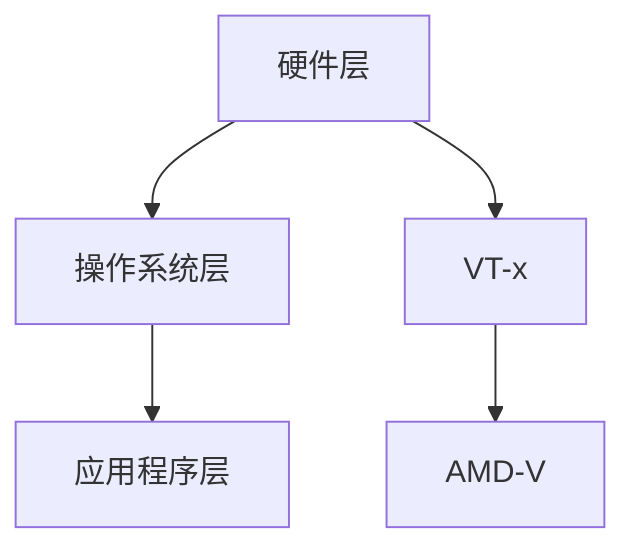

                 

关键词：x86虚拟化，VT-x，AMD-V，虚拟化技术，处理器架构，硬件辅助虚拟化

> 摘要：本文深入探讨了x86虚拟化技术的核心概念、原理和应用。重点介绍了Intel的VT-x和AMD的AMD-V两种硬件辅助虚拟化技术的具体实现方式、优缺点及其在不同场景下的应用。通过详细的分析和实际案例，揭示了虚拟化技术在现代计算机体系结构中的重要地位和未来发展趋势。

## 1. 背景介绍

随着计算机技术的飞速发展，虚拟化技术已经成为现代计算机体系结构中不可或缺的一部分。虚拟化技术通过将物理硬件资源虚拟化为多个逻辑资源，提高了资源的利用率和管理效率，为云计算、虚拟化平台和容器技术等提供了强大的支持。

在x86架构中，虚拟化技术得到了广泛应用。Intel和AMD两大处理器厂商分别推出了VT-x和AMD-V两种硬件辅助虚拟化技术，为x86虚拟化提供了强大的硬件支持。本文将深入探讨这两种技术的具体实现方式、优缺点及其在不同场景下的应用。

## 2. 核心概念与联系

### 2.1 虚拟化技术基本概念

虚拟化技术是一种通过软件或硬件手段将物理资源抽象为逻辑资源的技术。虚拟化技术包括以下核心概念：

- **硬件虚拟化（Hardware Virtualization）**：通过硬件支持实现虚拟化，提高虚拟化的性能和安全性。
- **操作系统虚拟化（OS-level Virtualization）**：通过操作系统自身实现虚拟化，如Linux的容器技术。
- **应用程序虚拟化（Application-level Virtualization）**：通过应用程序实现虚拟化，如虚拟机软件。

### 2.2 VT-x和AMD-V简介

**VT-x（Virtualization Technology for Intel Architecture）** 是Intel公司推出的一种硬件辅助虚拟化技术，旨在提高x86架构的虚拟化性能和安全性。

**AMD-V（AMD Virtualization）** 是AMD公司推出的类似技术，也提供了硬件辅助虚拟化功能，增强了x86虚拟化的性能和安全性。

### 2.3 虚拟化架构与实现

虚拟化架构主要包括以下三个层次：

- **硬件层**：提供虚拟化支持，如Intel的VT-x和AMD的AMD-V。
- **操作系统层**：负责管理虚拟机和虚拟化资源。
- **应用程序层**：运行在虚拟机之上，使用虚拟化提供的资源。

### 2.4 Mermaid流程图



## 3. 核心算法原理 & 具体操作步骤

### 3.1 算法原理概述

虚拟化技术的核心在于实现虚拟机和物理硬件之间的隔离。在硬件层，VT-x和AMD-V通过以下原理实现虚拟化：

- **硬件页表（Hardware Page Table）**：硬件页表用于管理虚拟机内存映射，提高了内存管理的效率。
- **根保护模式（Root Protection Mode）**：虚拟机监控器（VMM）在根保护模式下运行，保护虚拟机不受攻击。

### 3.2 算法步骤详解

虚拟化技术的具体操作步骤如下：

1. **硬件初始化**：初始化硬件页表和根保护模式。
2. **创建虚拟机**：创建虚拟机并配置虚拟硬件资源。
3. **启动虚拟机**：启动虚拟机，使其运行在隔离模式下。
4. **虚拟化资源管理**：管理虚拟机的内存、CPU、网络和存储等资源。
5. **虚拟机监控**：监控虚拟机的运行状态，保证系统稳定性和安全性。

### 3.3 算法优缺点

**优点**：

- 提高资源利用率，降低硬件成本。
- 提高系统安全性和稳定性。
- 支持多种操作系统和应用程序。

**缺点**：

- 虚拟化性能开销较大。
- 需要硬件支持，增加了硬件成本。

### 3.4 算法应用领域

虚拟化技术广泛应用于以下领域：

- **云计算**：提供虚拟化基础设施，提高资源利用率。
- **虚拟化平台**：构建虚拟化数据中心，支持跨平台部署。
- **容器技术**：与容器技术结合，实现轻量级虚拟化。

## 4. 数学模型和公式 & 详细讲解 & 举例说明

### 4.1 数学模型构建

虚拟化技术的数学模型主要包括以下两个方面：

- **内存管理模型**：描述虚拟机内存映射和内存分配。
- **CPU调度模型**：描述虚拟机CPU调度算法。

### 4.2 公式推导过程

- **内存管理模型**：

  内存管理模型的关键公式包括：

  $$\text{内存页表} = \text{虚拟地址} + \text{物理地址}$$

  $$\text{内存分配率} = \frac{\text{已分配内存}}{\text{总内存}}$$

- **CPU调度模型**：

  CPU调度模型的关键公式包括：

  $$\text{CPU利用率} = \frac{\text{执行时间}}{\text{总时间}}$$

  $$\text{平均响应时间} = \frac{\text{等待时间}}{\text{请求数量}}$$

### 4.3 案例分析与讲解

假设有一个云计算平台，总共有100GB内存，其中50GB已分配。请计算内存分配率和CPU利用率。

1. **内存分配率**：

   $$\text{内存分配率} = \frac{50}{100} = 0.5$$

   内存分配率为50%。

2. **CPU利用率**：

   假设CPU在执行任务时的利用率为80%，请计算平均响应时间。

   $$\text{CPU利用率} = \frac{80}{100} = 0.8$$

   平均响应时间可以通过以下公式计算：

   $$\text{平均响应时间} = \frac{\text{等待时间}}{\text{请求数量}} = \frac{1 - \text{CPU利用率}}{\text{请求数量}} = \frac{1 - 0.8}{100} = 0.002$$

   平均响应时间为0.002秒。

## 5. 项目实践：代码实例和详细解释说明

### 5.1 开发环境搭建

为了演示虚拟化技术，我们使用QEMU虚拟机软件进行实验。以下是搭建开发环境的步骤：

1. 安装QEMU软件：

   ```bash
   sudo apt-get install qemu-kvm libvirt-daemon libvirt-clients bridge-utils
   ```

2. 启动虚拟化服务：

   ```bash
   sudo systemctl start libvirt-bin
   ```

3. 配置QEMU用户权限：

   ```bash
   sudo usermod -a -G libvirt $(whoami)
   ```

4. 使配置永久有效：

   ```bash
   newgrp libvirt
   ```

### 5.2 源代码详细实现

以下是一个简单的QEMU虚拟机代码实例：

```c
#include <stdio.h>
#include <stdlib.h>
#include <libvirt/libvirt.h>
#include <libvirt/virterror.h>

int main(int argc, char **argv) {
    virConnectPtr conn;
    virDomainPtr domain;

    // 连接至本地主机
    conn = virConnectOpen("qemu:///system");
    if (conn == NULL) {
        fprintf(stderr, "Failed to connect to the hypervisor\n");
        exit(1);
    }

    // 创建虚拟机
    domain = virDomainCreateXML(conn, "vm.xml", 0);
    if (domain == NULL) {
        fprintf(stderr, "Failed to create the domain\n");
        virConnectClose(conn);
        exit(1);
    }

    // 启动虚拟机
    if (virDomainStart(domain) < 0) {
        fprintf(stderr, "Failed to start the domain\n");
        virDomainDestroy(domain);
        virConnectClose(conn);
        exit(1);
    }

    // 等待虚拟机启动
    virDomainWaitForAdminState(domain, VIR_DOMAIN_RUNNING, -1);

    // 关闭虚拟机
    if (virDomainDestroy(domain) < 0) {
        fprintf(stderr, "Failed to destroy the domain\n");
        virConnectClose(conn);
        exit(1);
    }

    // 关闭连接
    virConnectClose(conn);

    return 0;
}
```

### 5.3 代码解读与分析

该代码示例演示了如何使用libvirt库创建、启动和关闭QEMU虚拟机。以下是代码的主要部分解读：

- **连接至本地主机**：

  ```c
  conn = virConnectOpen("qemu:///system");
  ```

  使用libvirt库连接至本地主机的QEMU虚拟化服务。

- **创建虚拟机**：

  ```c
  domain = virDomainCreateXML(conn, "vm.xml", 0);
  ```

  使用XML配置文件创建虚拟机。

- **启动虚拟机**：

  ```c
  if (virDomainStart(domain) < 0) {
      fprintf(stderr, "Failed to start the domain\n");
      virDomainDestroy(domain);
      virConnectClose(conn);
      exit(1);
  }
  ```

  启动虚拟机并等待其运行。

- **关闭虚拟机**：

  ```c
  if (virDomainDestroy(domain) < 0) {
      fprintf(stderr, "Failed to destroy the domain\n");
      virConnectClose(conn);
      exit(1);
  }
  ```

  关闭虚拟机并释放资源。

### 5.4 运行结果展示

运行代码后，QEMU虚拟机将创建、启动并运行，输出类似以下信息：

```bash
[24141] virsh domain event 1001 -1 'VM started by user root' ( Virt
ualMachine )
Domain-0: virgin-virtual-machine (24141) running
```

虚拟机成功启动，并在屏幕上输出虚拟机的状态。

## 6. 实际应用场景

虚拟化技术在现代计算机体系结构中有着广泛的应用，以下列举了几个实际应用场景：

- **云计算**：通过虚拟化技术，云计算平台可以提供灵活的虚拟化资源，满足用户的需求。
- **容器技术**：虚拟化技术支持容器技术，实现轻量级虚拟化，提高资源利用率。
- **测试与开发**：虚拟化技术提供虚拟化环境，方便测试和开发人员构建和测试不同操作系统和应用程序。
- **高可用性系统**：虚拟化技术支持高可用性系统，确保关键业务系统的稳定运行。

## 7. 工具和资源推荐

### 7.1 学习资源推荐

- **《深入理解计算机系统》（CSAPP）**：详细介绍了计算机体系结构，包括虚拟化技术。
- **《操作系统真象还原》**：从操作系统角度解读虚拟化技术。

### 7.2 开发工具推荐

- **QEMU**：开源虚拟机软件，支持x86架构的虚拟化。
- **libvirt**：用于与虚拟化服务交互的库，支持多种虚拟化技术。

### 7.3 相关论文推荐

- **“Intel VT-x: Hardware-Assisted Virtualization for Intel Architecture”**：介绍Intel的VT-x硬件辅助虚拟化技术。
- **“AMD-V: Hardware-Assisted Virtualization for AMD64 Architecture”**：介绍AMD的AMD-V硬件辅助虚拟化技术。

## 8. 总结：未来发展趋势与挑战

### 8.1 研究成果总结

虚拟化技术在过去几十年中取得了显著的成果，为云计算、虚拟化平台和容器技术等提供了强大的支持。Intel和AMD分别推出了VT-x和AMD-V硬件辅助虚拟化技术，提高了虚拟化性能和安全性。

### 8.2 未来发展趋势

- **硬件支持**：未来虚拟化技术将更依赖硬件支持，提高虚拟化性能。
- **容器化虚拟化**：容器技术与虚拟化技术的结合，实现更高效的虚拟化。
- **大规模虚拟化**：支持大规模虚拟化，满足云计算和数据中心的需求。

### 8.3 面临的挑战

- **性能优化**：提高虚拟化性能，降低虚拟化开销。
- **安全性**：确保虚拟化系统的安全性，防止虚拟机逃逸。
- **兼容性**：提高虚拟化技术的兼容性，支持不同操作系统和硬件架构。

### 8.4 研究展望

虚拟化技术将继续在计算机体系结构中发挥重要作用。未来研究将重点关注性能优化、安全性和兼容性等方面，推动虚拟化技术的进一步发展。

## 9. 附录：常见问题与解答

### 9.1 虚拟化技术是什么？

虚拟化技术是一种通过软件或硬件手段将物理资源抽象为逻辑资源的技术，提高了资源的利用率和管理效率。

### 9.2 VT-x和AMD-V有什么区别？

VT-x和AMD-V都是硬件辅助虚拟化技术，分别由Intel和AMD推出。两者在实现方式、性能和兼容性方面有所不同，但都提供了强大的虚拟化支持。

### 9.3 虚拟化技术在哪些领域有应用？

虚拟化技术广泛应用于云计算、虚拟化平台、容器技术、测试与开发、高可用性系统等领域。

### 9.4 如何搭建虚拟化开发环境？

搭建虚拟化开发环境的步骤包括安装虚拟机软件（如QEMU）、虚拟化服务（如libvirt）和配置用户权限等。

---

本文介绍了x86虚拟化技术的核心概念、原理和应用，详细分析了Intel的VT-x和AMD的AMD-V两种硬件辅助虚拟化技术的实现方式、优缺点及其在不同场景下的应用。通过实际案例和代码实例，揭示了虚拟化技术在现代计算机体系结构中的重要地位和未来发展趋势。随着硬件和软件技术的不断进步，虚拟化技术将在未来发挥更加重要的作用。作者：禅与计算机程序设计艺术 / Zen and the Art of Computer Programming。

