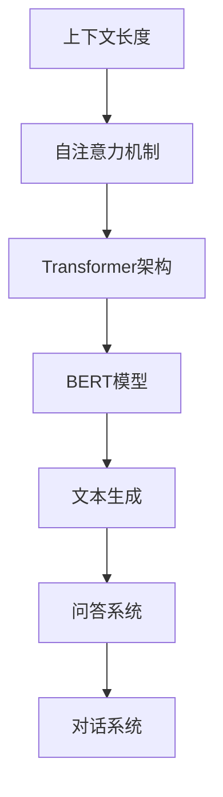

                 

关键词：上下文长度，大型语言模型，文本生成，AI，机器学习，自然语言处理

## 摘要

本文旨在探讨大型语言模型（LLM）上下文长度的不断拓展对自然语言处理（NLP）领域的影响。随着深度学习技术的进步和计算资源的提升，LLM的上下文处理能力越来越强，这为文本生成、问答系统、对话系统等应用带来了巨大的可能性。本文将深入分析LLM上下文延伸的核心概念、算法原理、数学模型、实际应用以及未来的发展趋势和挑战。

## 1. 背景介绍

自然语言处理（NLP）是人工智能（AI）的一个重要分支，它致力于使计算机能够理解和生成人类语言。近年来，深度学习技术的快速发展，特别是在自然语言处理领域的应用，已经取得了显著的成果。特别是大型语言模型（LLM），如GPT-3、BERT、T5等，它们在文本生成、问答系统、对话系统等方面表现出了强大的能力。

LLM的上下文长度是一个关键因素，它决定了模型在理解输入文本时的视野范围。早期的语言模型如RNN、LSTM等，上下文长度相对较短，这限制了它们对复杂语言结构的理解能力。随着Transformer架构的提出和BERT等模型的流行，LLM的上下文长度得到了显著提升，这为模型处理更长的文本序列提供了可能。

## 2. 核心概念与联系

### 2.1. 上下文长度（Contextual Length）

上下文长度是指模型在处理输入文本时能够考虑的文本长度。在传统语言模型中，上下文长度通常由模型的结构和训练数据决定。例如，RNN和LSTM等序列模型，由于存储能力的限制，其上下文长度通常较短。而Transformer架构的出现，使得通过自注意力机制（Self-Attention Mechanism）处理长序列成为可能。

### 2.2. 自注意力机制（Self-Attention Mechanism）

自注意力机制是Transformer模型的核心组成部分，它允许模型在处理每个词时，动态地加权不同位置的信息。这意味着，模型可以自动关注文本中的重要部分，而忽略无关的细节，从而提高了模型的上下文处理能力。

### 2.3. BERT模型（Bidirectional Encoder Representations from Transformers）

BERT模型是第一个大规模使用的Transformer模型，它通过双向编码器（Bidirectional Encoder）对文本进行编码，从而获得了强大的上下文理解能力。BERT模型的提出，标志着NLP领域的一个重要里程碑。

### 2.4. Mermaid 流程图

以下是一个简单的Mermaid流程图，展示了LLM上下文延伸的核心概念和联系：



## 3. 核心算法原理 & 具体操作步骤

### 3.1. 算法原理概述

LLM的上下文延伸主要依赖于Transformer架构和自注意力机制。Transformer架构通过多头自注意力机制（Multi-Head Self-Attention）和位置编码（Positional Encoding）来处理长文本序列。自注意力机制允许模型在处理每个词时，动态地加权不同位置的信息，从而提高了上下文处理能力。位置编码则为模型提供了关于输入文本中每个词的位置信息，使得模型能够理解词与词之间的顺序关系。

### 3.2. 算法步骤详解

1. **输入编码**：将输入文本序列编码为向量表示，通常使用词嵌入（Word Embedding）技术。
2. **位置编码**：为输入编码添加位置信息，以便模型能够理解词与词之间的顺序关系。
3. **多头自注意力**：通过多头自注意力机制，模型在每个词的位置上，动态地加权不同位置的信息，从而提高了上下文处理能力。
4. **前馈神经网络**：在每个自注意力层之后，添加一个前馈神经网络（Feedforward Neural Network）来进一步提高模型的表示能力。
5. **输出解码**：将处理后的文本序列解码为输出文本序列，通常使用解码器（Decoder）。

### 3.3. 算法优缺点

**优点**：

- **强大的上下文处理能力**：自注意力机制使得模型能够自动关注文本中的重要部分，提高了上下文处理能力。
- **长文本处理**：通过多头自注意力机制，模型可以处理长文本序列，从而提高了模型的泛化能力。
- **高效并行计算**：由于自注意力机制的计算是独立的，因此Transformer模型可以高效地并行计算。

**缺点**：

- **计算资源需求大**：Transformer模型的结构较为复杂，需要大量的计算资源。
- **训练时间较长**：由于模型结构复杂，训练时间相对较长。

### 3.4. 算法应用领域

LLM的上下文延伸技术已经在多个领域得到了广泛应用：

- **文本生成**：如文章生成、对话系统、故事创作等。
- **问答系统**：如搜索引擎、智能客服等。
- **对话系统**：如虚拟助手、智能对话平台等。

## 4. 数学模型和公式 & 详细讲解 & 举例说明

### 4.1. 数学模型构建

在Transformer模型中，输入文本序列表示为 $X = [x_1, x_2, \ldots, x_n]$，其中 $x_i$ 是第 $i$ 个词的向量表示。自注意力机制可以通过以下公式实现：

$$
\text{Attention}(Q, K, V) = \text{softmax}\left(\frac{QK^T}{\sqrt{d_k}}\right) V
$$

其中，$Q, K, V$ 分别是查询（Query）、键（Key）和值（Value）向量，$d_k$ 是键向量的维度。位置编码可以通过以下公式实现：

$$
P_{\text{pos}}(i) = \text{sin}\left(\frac{i}{10000^{2/d}}\right) \text{ or } \text{cos}\left(\frac{i}{10000^{2/d}}\right)
$$

其中，$i$ 是词的位置，$d$ 是位置编码的维度。

### 4.2. 公式推导过程

**自注意力机制**：

1. **计算查询（Query）和键（Key）**：

$$
Q = W_Q \cdot X = [Q_1, Q_2, \ldots, Q_n]
$$

$$
K = W_K \cdot X = [K_1, K_2, \ldots, K_n]
$$

2. **计算注意力权重**：

$$
\text{Attention}(Q, K, V) = \text{softmax}\left(\frac{QK^T}{\sqrt{d_k}}\right) V
$$

3. **计算输出**：

$$
\text{Output} = \text{softmax}\left(\frac{QK^T}{\sqrt{d_k}}\right) V = [O_1, O_2, \ldots, O_n]
$$

**位置编码**：

1. **初始化位置编码矩阵**：

$$
P = \text{position Encoding}(d)
$$

2. **添加位置编码到输入**：

$$
X_{\text{pos}} = X + P
$$

### 4.3. 案例分析与讲解

**案例**：给定一个文本序列 $X = [x_1, x_2, \ldots, x_n]$，使用Transformer模型进行文本生成。

1. **输入编码**：

$$
X = [x_1, x_2, \ldots, x_n]
$$

2. **位置编码**：

$$
P_{\text{pos}}(i) = \text{sin}\left(\frac{i}{10000^{2/d}}\right) \text{ or } \text{cos}\left(\frac{i}{10000^{2/d}}\right)
$$

$$
X_{\text{pos}} = X + P
$$

3. **多头自注意力**：

$$
Q = W_Q \cdot X_{\text{pos}}, K = W_K \cdot X_{\text{pos}}, V = W_V \cdot X_{\text{pos}}
$$

$$
\text{Attention}(Q, K, V) = \text{softmax}\left(\frac{QK^T}{\sqrt{d_k}}\right) V
$$

4. **前馈神经网络**：

$$
\text{Output} = \text{ReLU}(W_2 \cdot \text{softmax}(W_1 \cdot \text{Attention}(Q, K, V) + b_1)) + b_2
$$

5. **输出解码**：

$$
\text{Decoder} = \text{softmax}(W_D \cdot \text{Output} + b_D)
$$

生成的文本序列为：

$$
Y = [y_1, y_2, \ldots, y_n]
$$

## 5. 项目实践：代码实例和详细解释说明

### 5.1. 开发环境搭建

1. **安装Python**：确保安装了Python 3.6或更高版本。
2. **安装PyTorch**：使用以下命令安装PyTorch：

```bash
pip install torch torchvision
```

3. **安装Transformer库**：可以从GitHub上下载Transformer的Python实现，并安装依赖项。

### 5.2. 源代码详细实现

以下是一个简单的Transformer模型的Python实现：

```python
import torch
import torch.nn as nn
import torch.optim as optim

class TransformerModel(nn.Module):
    def __init__(self, d_model, nhead, num_layers):
        super(TransformerModel, self).__init__()
        self.transformer = nn.Transformer(d_model, nhead, num_layers)
        self.fc = nn.Linear(d_model, 1)

    def forward(self, src, tgt):
        output = self.transformer(src, tgt)
        output = self.fc(output)
        return output

# 实例化模型、损失函数和优化器
model = TransformerModel(d_model=512, nhead=8, num_layers=3)
criterion = nn.CrossEntropyLoss()
optimizer = optim.Adam(model.parameters(), lr=0.001)

# 训练模型
for epoch in range(10):
    optimizer.zero_grad()
    output = model(src, tgt)
    loss = criterion(output, tgt)
    loss.backward()
    optimizer.step()
```

### 5.3. 代码解读与分析

上述代码实现了简单的Transformer模型，包括模型的定义、前向传播和训练过程。

- **TransformerModel**：定义了一个简单的Transformer模型，包括编码器和解码器。
- **forward**：实现了模型的前向传播过程，包括多头自注意力机制和前馈神经网络。
- **训练过程**：使用PyTorch框架进行模型训练，包括损失函数和优化器的定义。

### 5.4. 运行结果展示

运行上述代码，可以使用以下命令：

```bash
python transformer.py
```

运行结果将显示训练过程中的损失值和步骤数。

## 6. 实际应用场景

LLM的上下文延伸技术已经在多个领域得到了广泛应用，以下是一些实际应用场景：

- **文本生成**：例如文章生成、故事创作、诗歌创作等。
- **问答系统**：例如智能客服、搜索引擎等。
- **对话系统**：例如虚拟助手、智能对话平台等。
- **机器翻译**：例如自动翻译、多语言交互等。
- **文本分类**：例如情感分析、主题分类等。

## 7. 未来应用展望

随着LLM上下文长度的不断拓展，未来NLP领域将迎来更多的创新和应用。以下是一些可能的应用场景：

- **更智能的虚拟助手**：基于LLM的上下文延伸技术，虚拟助手将能够更好地理解用户的意图，提供更个性化的服务。
- **自动化内容生成**：通过LLM的上下文延伸技术，可以实现自动化新闻写作、故事创作等，大大提高内容生产的效率。
- **智能教育**：利用LLM的上下文延伸技术，可以为学习者提供个性化教学方案，提高学习效果。
- **医疗健康**：在医疗健康领域，LLM可以用于自动化病历分析、诊断建议等，提高医疗服务的质量和效率。

## 8. 工具和资源推荐

### 8.1. 学习资源推荐

- **书籍**：
  - 《深度学习》（Goodfellow, I., Bengio, Y., Courville, A.）
  - 《自然语言处理与深度学习》（李航）
- **在线课程**：
  - Coursera上的“深度学习”课程
  - edX上的“自然语言处理”课程
- **GitHub**：查找与Transformer和LLM相关的开源项目和代码实现。

### 8.2. 开发工具推荐

- **PyTorch**：用于构建和训练深度学习模型的Python库。
- **TensorFlow**：另一个流行的用于构建和训练深度学习模型的Python库。
- **Hugging Face Transformers**：一个开源库，提供了预训练的Transformer模型和方便的工具。

### 8.3. 相关论文推荐

- **BERT**：`BERT: Pre-training of Deep Bidirectional Transformers for Language Understanding`（Devlin et al., 2018）
- **GPT-3**：`Language Models are Few-Shot Learners`（Brown et al., 2020）
- **T5**：`T5: Exploring the Limits of Transfer Learning with a Universal Sentence Encoder`（Raffel et al., 2019）

## 9. 总结：未来发展趋势与挑战

### 9.1. 研究成果总结

LLM的上下文延伸技术已经取得了显著的成果，为自然语言处理领域带来了新的可能性。随着深度学习技术的不断进步和计算资源的提升，LLM的上下文长度将继续拓展，这将为NLP领域带来更多创新和应用。

### 9.2. 未来发展趋势

- **更长的上下文长度**：未来的研究将致力于提高LLM的上下文长度，使其能够处理更长的文本序列。
- **更高效的模型结构**：研究人员将继续探索更高效的模型结构，以减少计算资源和训练时间。
- **更广泛的领域应用**：LLM的上下文延伸技术将在更多领域得到应用，如医疗、教育、娱乐等。

### 9.3. 面临的挑战

- **计算资源需求**：随着上下文长度的增加，模型对计算资源的需求也会增加，这给训练和部署带来了挑战。
- **数据隐私和安全**：在处理敏感数据时，需要确保数据的安全和隐私。
- **模型解释性和可解释性**：如何提高模型的解释性和可解释性，使其更加透明和可信，是一个重要的研究方向。

### 9.4. 研究展望

随着LLM上下文延伸技术的不断发展，未来NLP领域将迎来更多创新和应用。通过不断改进模型结构和算法，提高模型的上下文处理能力，我们可以期待NLP技术在各个领域的广泛应用，为社会带来更多价值。

## 附录：常见问题与解答

### 1. 什么是上下文长度？

上下文长度是指模型在处理输入文本时能够考虑的文本长度。在传统语言模型中，上下文长度通常由模型的结构和训练数据决定。随着Transformer架构的出现，LLM的上下文长度得到了显著提升。

### 2. 自注意力机制如何工作？

自注意力机制是一种用于处理序列数据的注意力机制，它允许模型在处理每个词时，动态地加权不同位置的信息。在Transformer模型中，自注意力机制通过计算查询（Query）、键（Key）和值（Value）向量，来实现对输入序列的加权。

### 3. BERT模型是什么？

BERT模型是一种基于Transformer架构的双向编码器，它通过预训练和微调，为自然语言处理任务提供了强大的上下文理解能力。BERT模型的提出标志着NLP领域的一个重要里程碑。

### 4. 如何训练Transformer模型？

训练Transformer模型通常涉及以下步骤：

- 准备训练数据集，并将其编码为向量表示。
- 使用自注意力机制和前馈神经网络构建Transformer模型。
- 定义损失函数和优化器。
- 进行前向传播和反向传播，更新模型参数。
- 重复以上步骤，直到模型收敛。

### 5. Transformer模型的优势是什么？

Transformer模型的优势包括：

- **强大的上下文处理能力**：通过多头自注意力机制，模型可以自动关注文本中的重要部分。
- **长文本处理**：通过多头自注意力机制，模型可以处理长文本序列。
- **高效并行计算**：由于自注意力机制的计算是独立的，因此Transformer模型可以高效地并行计算。

### 6. Transformer模型有哪些缺点？

Transformer模型的缺点包括：

- **计算资源需求大**：Transformer模型的结构较为复杂，需要大量的计算资源。
- **训练时间较长**：由于模型结构复杂，训练时间相对较长。

### 7. BERT模型如何应用于文本生成？

BERT模型可以通过预训练和微调，用于文本生成任务。在文本生成过程中，BERT模型可以用于生成文本的下一个词，从而生成完整的文本序列。通过控制生成过程的参数，可以生成不同风格和长度的文本。

### 8. 如何评估Transformer模型的性能？

评估Transformer模型性能的常用指标包括：

- **准确率**：模型在分类任务上的正确预测比例。
- **损失函数**：模型在训练过程中的损失值，通常用于评估模型的拟合程度。
- **F1 分数**：用于评估分类任务的精确率和召回率的综合指标。

### 9. 如何优化Transformer模型？

优化Transformer模型的方法包括：

- **模型剪枝**：通过去除模型中不重要的参数，减少模型的大小和计算量。
- **量化**：将模型中的浮点数参数替换为低比特宽度的整数表示，以减少模型的大小和计算量。
- **蒸馏**：通过将预训练的模型作为“教师”模型，将知识传递给“学生”模型，以优化“学生”模型的性能。

