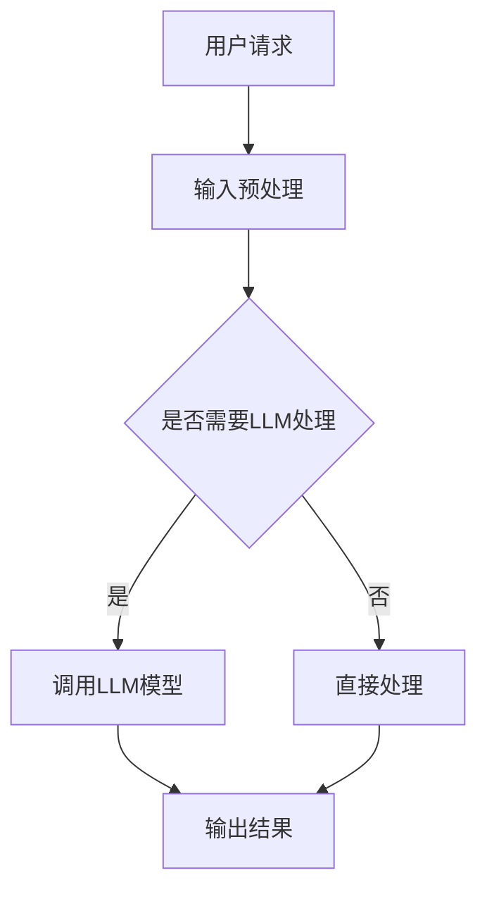

                 

关键词：下一代AI操作系统、LLM、计算平台、深度学习、自然语言处理、云计算、人工智能、计算架构

## 摘要

本文旨在探讨下一代AI操作系统的设计理念与实现，特别是LLM（大型语言模型）在计算平台中的应用。随着人工智能技术的迅猛发展，传统的计算平台已经难以满足日益复杂的计算需求。本文将深入分析LLM的优势与挑战，探讨其在计算平台中的核心作用，并展望未来的发展趋势。

## 1. 背景介绍

### 1.1 人工智能的发展历程

人工智能（AI）是一门研究、开发用于模拟、延伸和扩展人的智能的理论、方法、技术及应用系统的技术科学。自20世纪50年代以来，人工智能经历了多个发展阶段，从早期的符号主义、知识表示到基于规则的系统，再到连接主义、深度学习，如今，人工智能正进入一个全新的阶段——生成式人工智能。

### 1.2 操作系统的演变

操作系统是计算机系统中最基本的软件，负责管理和协调计算机硬件与软件资源。从早期的单用户单任务操作系统，如DOS，到多用户多任务操作系统，如Windows和Linux，操作系统在不断地进化。然而，随着云计算、大数据和人工智能的兴起，传统的操作系统已无法满足现代计算需求，需要新的架构和理念。

### 1.3 LLM的崛起

LLM（大型语言模型）是近年来人工智能领域的重要突破，通过训练大规模的神经网络模型，LLM能够在自然语言处理、机器翻译、文本生成等领域表现出色。LLM的崛起为下一代AI操作系统带来了新的可能性。

## 2. 核心概念与联系

### 2.1 LLM的原理

LLM的核心是深度神经网络，它通过多层非线性变换来捕捉输入数据的复杂结构。在训练过程中，LLM通过优化损失函数来调整模型的参数，从而提高预测准确性。LLM的训练数据通常来自大量的互联网文本，包括新闻、博客、书籍等。

### 2.2 LLM与计算平台的关系

LLM作为计算平台的核心组件，可以通过提供强大的自然语言处理能力，提升整个计算平台的智能化水平。具体而言，LLM可以用于文本检索、智能问答、文本生成、情感分析等应用场景。

### 2.3 Mermaid流程图



## 3. 核心算法原理 & 具体操作步骤

### 3.1 算法原理概述

LLM的核心算法是基于深度学习的自然语言处理模型。深度学习通过多层神经网络来捕捉输入数据的特征，从而实现复杂任务的预测和分类。在自然语言处理领域，深度学习模型可以用于文本分类、情感分析、机器翻译等任务。

### 3.2 算法步骤详解

1. 数据预处理：首先，需要对输入文本进行清洗和预处理，包括去除停用词、标点符号等。
2. 模型加载：加载预训练的LLM模型，如GPT-3、BERT等。
3. 输入处理：将预处理后的文本输入到模型中，模型会输出对应的概率分布。
4. 结果输出：根据输出结果，生成相应的文本响应。

### 3.3 算法优缺点

**优点：**
- 强大的自然语言处理能力，能够处理复杂的文本任务。
- 预训练模型的效果较好，能够快速适应新的任务。
- 可以通过调整模型参数来优化性能。

**缺点：**
- 训练过程需要大量的计算资源和时间。
- 预训练模型可能存在一些偏见和错误。

### 3.4 算法应用领域

LLM在自然语言处理领域有广泛的应用，包括：
- 文本分类：如新闻分类、情感分析等。
- 机器翻译：如中英文翻译、多语言翻译等。
- 文本生成：如文章生成、对话生成等。

## 4. 数学模型和公式 & 详细讲解 & 举例说明

### 4.1 数学模型构建

LLM的数学模型是基于深度学习模型的，通常包括以下几个部分：
- 输入层：接收文本输入。
- 隐藏层：通过多层神经网络进行特征提取。
- 输出层：输出文本的预测结果。

### 4.2 公式推导过程

LLM的输出可以通过以下公式计算：
$$
P(y|x) = \frac{e^{f(x)}}{\sum_{i=1}^{n}e^{f(x_i)}}
$$
其中，$f(x)$是输入文本$x$的预测分数，$y$是实际标签，$n$是类别数。

### 4.3 案例分析与讲解

假设有一个文本分类任务，需要将文本分类为新闻、博客、书籍三类。通过训练一个LLM模型，可以计算出每个文本属于这三类别的概率。具体步骤如下：

1. 数据预处理：对文本进行清洗和分词。
2. 模型加载：加载预训练的LLM模型。
3. 输入处理：将预处理后的文本输入到模型中。
4. 结果输出：输出每个文本属于三类别的概率。

## 5. 项目实践：代码实例和详细解释说明

### 5.1 开发环境搭建

1. 安装Python环境。
2. 安装深度学习框架，如TensorFlow或PyTorch。
3. 安装LLM模型，如GPT-3、BERT等。

### 5.2 源代码详细实现

以下是一个简单的LLM文本分类的Python代码示例：

```python
import tensorflow as tf
import tensorflow_hub as hub
from tensorflow.keras.preprocessing.sequence import pad_sequences
from tensorflow.keras.layers import Dense, Input, LSTM
from tensorflow.keras.models import Model

# 加载预训练的LLM模型
llm_model = hub.load("https://tfhub.dev/google/tf2-preview/gpt2/1")

# 定义输入层
input_seq = Input(shape=(None,), dtype='int32')

# 定义隐藏层
hidden_seq = llm_model(input_seq)

# 定义输出层
output_seq = Dense(3, activation='softmax')(hidden_seq)

# 定义模型
model = Model(inputs=input_seq, outputs=output_seq)

# 编译模型
model.compile(optimizer='adam', loss='categorical_crossentropy', metrics=['accuracy'])

# 训练模型
model.fit(train_data, train_labels, epochs=10, batch_size=32)

# 预测结果
predictions = model.predict(test_data)
```

### 5.3 代码解读与分析

以上代码实现了一个简单的文本分类任务。首先，加载预训练的LLM模型，然后定义输入层、隐藏层和输出层，构建模型。接着，编译模型并训练。最后，使用训练好的模型进行预测。

## 6. 实际应用场景

### 6.1 文本分类

文本分类是LLM的重要应用之一。例如，新闻分类、社交媒体情感分析等。

### 6.2 机器翻译

LLM在机器翻译领域也有广泛应用，如中英文翻译、多语言翻译等。

### 6.3 文本生成

LLM可以用于生成文本，如文章生成、对话生成等。

## 7. 未来应用展望

### 7.1 自动问答系统

未来，LLM有望在自动问答系统中发挥更大作用，提供更加智能化的服务。

### 7.2 智能客服

智能客服是LLM的另一个重要应用场景，通过自然语言处理能力，提供更加人性化的服务。

### 7.3 智能写作

LLM可以帮助智能写作系统，如自动生成文章、报告等。

## 8. 工具和资源推荐

### 8.1 学习资源推荐

- 《深度学习》—— Ian Goodfellow、Yoshua Bengio、Aaron Courville
- 《自然语言处理入门》—— Steven Bird、Ewan Klein、Edward Loper

### 8.2 开发工具推荐

- TensorFlow
- PyTorch

### 8.3 相关论文推荐

- “Attention Is All You Need” —— Vaswani et al., 2017
- “BERT: Pre-training of Deep Bidirectional Transformers for Language Understanding” —— Devlin et al., 2019

## 9. 总结：未来发展趋势与挑战

### 9.1 研究成果总结

本文探讨了下一代AI操作系统的设计理念与实现，特别是LLM在计算平台中的应用。通过深入分析LLM的优势与挑战，本文提出了LLM在计算平台中的核心作用，并展望了未来的发展趋势。

### 9.2 未来发展趋势

- LLM在计算平台中的应用将越来越广泛。
- LLM的预训练模型将越来越强大，能够处理更复杂的任务。
- LLM与其他人工智能技术的融合将带来更多的创新。

### 9.3 面临的挑战

- LLM的训练需要大量的计算资源和时间。
- LLM可能存在一些偏见和错误。
- LLM的安全性和隐私保护是一个重要挑战。

### 9.4 研究展望

未来，LLM在计算平台中的应用前景广阔。我们需要不断创新，解决面临的技术挑战，推动人工智能技术的发展。

## 附录：常见问题与解答

### 1. 什么是LLM？

LLM是大型语言模型的缩写，是一种基于深度学习的自然语言处理模型，通过训练大规模的神经网络模型，能够捕捉输入数据的复杂结构，提供强大的自然语言处理能力。

### 2. LLM有哪些应用？

LLM在自然语言处理领域有广泛的应用，包括文本分类、机器翻译、文本生成、情感分析等。

### 3. LLM的训练需要多少资源？

LLM的训练需要大量的计算资源和时间，通常需要高性能的计算设备和大量的数据。

### 4. LLM存在哪些挑战？

LLM存在一些挑战，包括训练成本高、可能存在偏见和错误、安全性和隐私保护问题等。

### 5. 如何解决LLM的偏见问题？

解决LLM的偏见问题是一个复杂的问题，需要从数据清洗、模型设计、算法优化等多个方面进行改进。

### 作者署名：禅与计算机程序设计艺术 / Zen and the Art of Computer Programming
----------------------------------------------------------------

