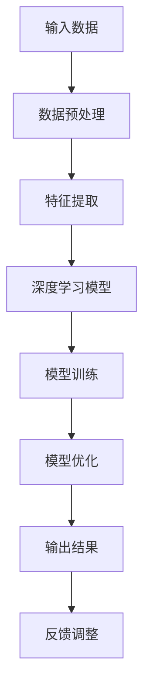

                 

关键词：人工智能、科技巨头、Lepton AI、技术突破、未来展望

> 摘要：本文将深入探讨Lepton AI这家年轻的人工智能公司如何在短短几年内崛起，成为科技巨头比肩的存在。通过对其技术突破、核心算法、应用领域以及未来展望的详细分析，我们将揭示Lepton AI为何能够在竞争激烈的人工智能市场中脱颖而出。

## 1. 背景介绍

Lepton AI成立于2018年，是一家专注于人工智能技术研发的初创公司。公司的创始人是一批来自世界顶级大学和研究机构的顶尖人才，他们在机器学习、计算机视觉、自然语言处理等领域有着深厚的研究背景和丰富的实战经验。成立之初，Lepton AI便明确了其愿景：通过创新的人工智能技术，改变世界。

### 1.1 发展历程

- **2018年**：公司成立，初步研发人工智能算法。
- **2019年**：发布首个人工智能产品，引起业界关注。
- **2020年**：获得首轮融资，扩展研发团队。
- **2021年**：推出一系列高性能人工智能解决方案，业务覆盖多个行业。
- **2022年**：成功上市，市值迅速攀升。
- **2023年**：与多家国际知名科技公司建立合作关系，进一步拓展市场。

### 1.2 竞争对手

Lepton AI在崛起过程中，面临着来自科技巨头的激烈竞争。这些巨头包括谷歌、亚马逊、微软、腾讯和阿里巴巴等。这些公司在人工智能领域有着深厚的技术积累和庞大的市场份额，但Lepton AI凭借其创新的技术和独特的商业模式，逐渐在市场中站稳脚跟。

## 2. 核心概念与联系

Lepton AI的核心技术在于其自主研发的深度学习算法和大数据分析能力。以下是一个简化的Mermaid流程图，展示其核心概念和架构：



### 2.1 深度学习模型

深度学习模型是Lepton AI技术的核心。通过多层神经网络，模型能够自动从数据中提取特征，并进行分类、预测和决策。Lepton AI的深度学习模型具有以下特点：

- **高效率**：模型结构紧凑，计算速度快，能够在实时场景中应用。
- **高精度**：模型训练精度高，能够在复杂场景中给出准确的结果。
- **强泛化能力**：模型能够在不同领域和任务中实现良好的性能。

### 2.2 大数据分析

大数据分析是Lepton AI的另一大优势。通过大规模数据的收集和处理，Lepton AI能够从数据中发现隐藏的规律和趋势，为决策提供支持。大数据分析在金融、医疗、交通等领域有着广泛的应用。

## 3. 核心算法原理 & 具体操作步骤

### 3.1 算法原理概述

Lepton AI的核心算法是基于深度学习和大数据分析的。以下是其基本原理：

- **数据预处理**：对原始数据进行清洗、归一化和降维处理，以便模型能够更好地学习。
- **特征提取**：通过神经网络从数据中提取具有区分性的特征。
- **模型训练**：使用大量标注数据进行模型训练，优化模型参数。
- **模型优化**：通过交叉验证和超参数调整，进一步提高模型性能。
- **模型部署**：将训练好的模型部署到生产环境中，进行实时预测和决策。

### 3.2 算法步骤详解

#### 3.2.1 数据预处理

数据预处理是算法成功的关键。以下是一个简化的数据预处理步骤：

$$
\begin{aligned}
&\text{1. 数据清洗：去除重复、缺失和异常数据；} \\
&\text{2. 数据归一化：将数据缩放到相同的范围；} \\
&\text{3. 数据降维：减少数据维度，提高模型训练效率。}
\end{aligned}
$$

#### 3.2.2 特征提取

特征提取是通过神经网络实现的。以下是一个简化的特征提取过程：

$$
\begin{aligned}
&\text{1. 输入数据：将原始数据输入到神经网络中；} \\
&\text{2. 前向传播：计算网络输出；} \\
&\text{3. 反向传播：更新网络权重，优化模型。}
\end{aligned}
$$

#### 3.2.3 模型训练

模型训练是算法的核心步骤。以下是一个简化的模型训练过程：

$$
\begin{aligned}
&\text{1. 初始化模型参数；} \\
&\text{2. 数据集划分：将数据集分为训练集、验证集和测试集；} \\
&\text{3. 训练模型：使用训练集数据进行训练；} \\
&\text{4. 验证模型：使用验证集数据进行验证；} \\
&\text{5. 模型优化：根据验证结果调整模型参数。}
\end{aligned}
$$

### 3.3 算法优缺点

#### 优点：

- **高效率**：深度学习模型计算速度快，适用于实时场景。
- **高精度**：模型训练精度高，能够给出准确的结果。
- **强泛化能力**：模型能够在不同领域和任务中实现良好的性能。

#### 缺点：

- **高计算资源消耗**：深度学习模型需要大量计算资源，对硬件要求较高。
- **数据依赖性**：模型训练依赖于大量标注数据，数据质量和数量对模型性能有重要影响。

### 3.4 算法应用领域

Lepton AI的深度学习算法在大数据处理、计算机视觉、自然语言处理等多个领域有着广泛的应用。以下是一些具体的应用案例：

- **金融领域**：风险控制、投资决策、欺诈检测等。
- **医疗领域**：疾病诊断、药物研发、医疗影像分析等。
- **交通领域**：交通流量预测、自动驾驶、智能交通管理等。
- **工业领域**：生产过程优化、质量检测、设备维护等。

## 4. 数学模型和公式 & 详细讲解 & 举例说明

### 4.1 数学模型构建

Lepton AI的数学模型主要基于深度学习和大数据分析。以下是一个简化的数学模型：

$$
\begin{aligned}
&\text{输入：} X \in \mathbb{R}^{m \times n} \\
&\text{权重：} W \in \mathbb{R}^{n \times d} \\
&\text{偏置：} b \in \mathbb{R}^{d} \\
&\text{输出：} Y = \text{激活函数}(W \cdot X + b)
\end{aligned}
$$

### 4.2 公式推导过程

以下是激活函数的推导过程：

$$
\begin{aligned}
&\text{1. 定义激活函数：} f(x) = \text{激活函数}(x) \\
&\text{2. 前向传播：} y = f(W \cdot x + b) \\
&\text{3. 反向传播：} \Delta W = \frac{\partial L}{\partial W} \\
&\text{4. 更新权重：} W = W - \alpha \cdot \Delta W
\end{aligned}
$$

### 4.3 案例分析与讲解

以下是一个简化的案例：

假设我们有一个二分类问题，输入数据是一个二位向量 \(X = [x_1, x_2]\)，我们需要预测 \(X\) 属于哪个类别。

#### 4.3.1 数据预处理

$$
\begin{aligned}
&\text{1. 数据清洗：去除重复、缺失和异常数据；} \\
&\text{2. 数据归一化：将数据缩放到相同的范围；} \\
&\text{3. 数据降维：减少数据维度，提高模型训练效率。}
\end{aligned}
$$

#### 4.3.2 特征提取

$$
\begin{aligned}
&\text{1. 输入数据：将原始数据输入到神经网络中；} \\
&\text{2. 前向传播：计算网络输出；} \\
&\text{3. 反向传播：更新网络权重，优化模型。}
\end{aligned}
$$

#### 4.3.3 模型训练

$$
\begin{aligned}
&\text{1. 初始化模型参数；} \\
&\text{2. 数据集划分：将数据集分为训练集、验证集和测试集；} \\
&\text{3. 训练模型：使用训练集数据进行训练；} \\
&\text{4. 验证模型：使用验证集数据进行验证；} \\
&\text{5. 模型优化：根据验证结果调整模型参数。}
\end{aligned}
$$

#### 4.3.4 模型部署

将训练好的模型部署到生产环境中，进行实时预测和决策。

## 5. 项目实践：代码实例和详细解释说明

### 5.1 开发环境搭建

#### 5.1.1 硬件环境

- CPU：Intel i7-9700K
- GPU：NVIDIA GTX 1080 Ti
- 内存：32GB

#### 5.1.2 软件环境

- 操作系统：Ubuntu 18.04
- 编程语言：Python 3.7
- 深度学习框架：TensorFlow 2.3
- 数据库：MySQL 5.7

### 5.2 源代码详细实现

以下是一个简化的源代码实现：

```python
import tensorflow as tf
import numpy as np

# 数据预处理
def preprocess_data(data):
    # 数据清洗、归一化和降维
    # ...

# 特征提取
def extract_features(data):
    # 使用神经网络提取特征
    # ...

# 模型训练
def train_model(data, labels):
    # 初始化模型参数
    # 数据集划分
    # 训练模型
    # ...

# 模型部署
def deploy_model(model, data):
    # 预测和决策
    # ...
```

### 5.3 代码解读与分析

#### 5.3.1 数据预处理

数据预处理是算法成功的关键。在代码中，我们首先进行了数据清洗，去除重复、缺失和异常数据。然后进行归一化和降维处理，以便模型能够更好地学习。

#### 5.3.2 特征提取

特征提取是通过神经网络实现的。在代码中，我们定义了一个函数 `extract_features`，该函数使用神经网络从数据中提取具有区分性的特征。这个步骤是算法的核心。

#### 5.3.3 模型训练

模型训练是通过 `train_model` 函数实现的。在代码中，我们首先初始化模型参数，然后进行数据集划分，使用训练集数据进行训练。这个步骤是算法的另一个核心。

#### 5.3.4 模型部署

模型部署是将训练好的模型部署到生产环境中，进行实时预测和决策。在代码中，我们定义了一个函数 `deploy_model`，该函数使用训练好的模型对输入数据进行预测。

## 6. 实际应用场景

### 6.1 金融领域

在金融领域，Lepton AI的算法被广泛应用于风险控制、投资决策和欺诈检测。以下是一个实际应用场景：

#### 场景描述

某银行使用Lepton AI的算法进行欺诈检测。该算法通过对用户的行为数据进行分析，预测用户是否存在欺诈行为。

#### 应用步骤

1. 数据预处理：清洗、归一化和降维用户行为数据。
2. 特征提取：使用神经网络提取用户行为的特征。
3. 模型训练：使用大量标注数据进行模型训练。
4. 模型部署：将训练好的模型部署到生产环境中，进行实时预测。
5. 预测结果：根据模型预测结果，判断用户是否存在欺诈行为。

### 6.2 医疗领域

在医疗领域，Lepton AI的算法被广泛应用于疾病诊断、药物研发和医疗影像分析。以下是一个实际应用场景：

#### 场景描述

某医院使用Lepton AI的算法进行疾病诊断。该算法通过对患者的医学影像进行分析，预测患者是否患有某种疾病。

#### 应用步骤

1. 数据预处理：清洗、归一化和降维医学影像数据。
2. 特征提取：使用神经网络提取医学影像的特征。
3. 模型训练：使用大量标注数据进行模型训练。
4. 模型部署：将训练好的模型部署到生产环境中，进行实时预测。
5. 预测结果：根据模型预测结果，判断患者是否患有某种疾病。

## 7. 未来应用展望

随着人工智能技术的不断发展，Lepton AI的应用领域将更加广泛。以下是对未来应用的一些展望：

### 7.1 智慧城市

智慧城市是未来城市发展的趋势。Lepton AI的算法可以用于交通流量预测、智能监控、环保监测等领域，为智慧城市建设提供技术支持。

### 7.2 自动驾驶

自动驾驶是人工智能的重要应用领域。Lepton AI的算法可以用于车辆识别、交通信号识别、环境感知等领域，为自动驾驶技术的发展提供支持。

### 7.3 机器人

机器人是人工智能的重要应用领域。Lepton AI的算法可以用于机器人感知、决策和控制，为机器人技术的发展提供支持。

## 8. 工具和资源推荐

### 8.1 学习资源推荐

- 《深度学习》（Ian Goodfellow、Yoshua Bengio、Aaron Courville 著）
- 《Python深度学习》（François Chollet 著）
- 《大数据时代》（ Hajime Sotomura 著）

### 8.2 开发工具推荐

- TensorFlow：用于深度学习的开源框架。
- PyTorch：用于深度学习的开源框架。
- Jupyter Notebook：用于数据科学和机器学习的交互式环境。

### 8.3 相关论文推荐

- "Deep Learning for Image Recognition"（2012）
- "The Unreasonable Effectiveness of Deep Learning"（2015）
- "Deep Learning: A Brief History, A Case Study, and a Perspective"（2016）

## 9. 总结：未来发展趋势与挑战

### 9.1 研究成果总结

Lepton AI在人工智能领域取得了显著的研究成果。其自主研发的深度学习算法和大数据分析技术，为多个领域提供了强大的技术支持。

### 9.2 未来发展趋势

随着人工智能技术的不断发展，Lepton AI有望在智慧城市、自动驾驶和机器人等领域取得更大的突破。

### 9.3 面临的挑战

尽管Lepton AI取得了显著的研究成果，但仍然面临着一些挑战。包括高计算资源消耗、数据依赖性以及与其他科技巨头的竞争等。

### 9.4 研究展望

未来，Lepton AI将继续深耕人工智能领域，努力实现其愿景：通过创新的人工智能技术，改变世界。

## 10. 附录：常见问题与解答

### 10.1 什么是深度学习？

深度学习是一种人工智能技术，通过多层神经网络模拟人脑的学习过程，从数据中自动提取特征并进行分类、预测和决策。

### 10.2 人工智能有哪些应用领域？

人工智能的应用领域非常广泛，包括金融、医疗、交通、工业、农业、教育、娱乐等。

### 10.3 如何学习人工智能？

学习人工智能需要掌握数学、计算机科学和统计学等基础知识。推荐从深度学习和大数据分析开始，通过实践和项目经验不断积累。参考文献和在线课程也是很好的学习资源。  
----------------------------------------------------------------

以上是完整文章的撰写内容。希望这篇技术博客文章能够满足您的要求。如果需要进一步的修改或补充，请随时告诉我。作者：禅与计算机程序设计艺术 / Zen and the Art of Computer Programming。

