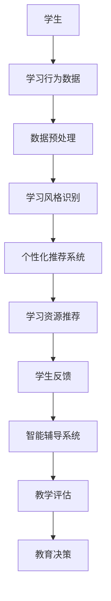

                 

关键词：个性化学习、定制化教育、人类计算、人工智能、教育技术、认知科学

> 摘要：本文将探讨个性化学习的概念及其在教育领域的应用，通过结合人类计算与人工智能技术，提出构建定制化教育方案的方法，以实现教育资源的合理配置和教育质量的提升。

## 1. 背景介绍

在教育领域，传统的教学方式往往以班级授课为主，忽视了学生个体的差异性。然而，现代社会的快速发展要求教育能够更加灵活、个性化和适应性，以满足不同学生的需求。个性化学习作为一种新型教育模式，旨在根据学生的兴趣、能力和学习风格，提供个性化的教育资源和学习路径。人类计算与人工智能技术的迅猛发展，为个性化学习的实现提供了新的可能性。

### 1.1 个性化学习的定义

个性化学习是指基于学生个体的学习需求和特点，为其量身定制学习内容、方法和评价体系的一种教育模式。它强调学生作为学习主体的自主性和主动性，旨在提高学习效果和促进学生的全面发展。

### 1.2 人类计算在教育中的应用

人类计算是指利用人类智慧和认知能力，结合计算机技术，实现复杂问题的求解和决策。在教育领域，人类计算的应用主要体现在以下几个方面：

1. **个性化推荐系统**：通过分析学生的学习行为和偏好，为每个学生推荐适合的学习资源和教学方法。
2. **智能辅导系统**：利用自然语言处理和机器学习技术，为学生提供即时反馈和个性化指导。
3. **教育数据挖掘**：通过对教育数据的分析，挖掘学生的学习规律和潜在需求，为教育决策提供支持。

## 2. 核心概念与联系

为了更好地理解个性化学习，我们需要明确几个核心概念，包括认知科学、教育技术和人工智能。

### 2.1 认知科学与个性化学习

认知科学是一门研究人类思维和智能的学科，其核心思想是理解人类认知过程的本质。在个性化学习中，认知科学的方法和技术可以帮助我们：

- **学习风格识别**：通过分析学生的学习行为和认知特征，识别其学习风格，为个性化学习方案提供依据。
- **认知负荷管理**：根据学生的认知能力，合理设计学习任务和内容，避免认知超负荷。

### 2.2 教育技术

教育技术是指利用现代信息技术手段，优化教育过程和提高教育质量的方法和工具。在教育领域，教育技术的应用主要包括：

- **在线学习平台**：提供丰富的学习资源和互动工具，支持学生的自主学习和协作学习。
- **虚拟现实（VR）和增强现实（AR）**：通过模拟和增强现实场景，提高学生的学习体验和参与度。

### 2.3 人工智能

人工智能是指通过模拟人类智能行为，实现计算机对复杂问题的求解和决策。在个性化学习中，人工智能的应用主要包括：

- **智能推荐系统**：基于学生的历史数据和偏好，自动推荐适合的学习内容和资源。
- **自然语言处理**：用于智能辅导系统和自动批改作业，提高教学效率。
- **学习分析**：通过对学习行为数据的分析，识别学生的学习问题和需求，为教育决策提供支持。

### 2.4 Mermaid 流程图

以下是一个简化的个性化学习系统架构的 Mermaid 流程图：



## 3. 核心算法原理 & 具体操作步骤

### 3.1 算法原理概述

个性化学习的核心在于根据学生的特点提供定制化的教育方案。这通常涉及到以下几个关键步骤：

1. **数据收集**：收集学生的学习行为数据、学习偏好和考试成绩等。
2. **数据预处理**：清洗和整合数据，确保数据质量。
3. **学习风格识别**：通过数据分析，识别学生的学习风格。
4. **个性化推荐**：根据学生的特点和需求，推荐合适的学习资源和教学方法。
5. **反馈与调整**：根据学生的反馈，调整个性化学习方案。

### 3.2 算法步骤详解

1. **数据收集**：
   - 通过在线学习平台和教学管理系统，收集学生的行为数据，如学习时间、学习频率、学习内容等。
   - 收集学生的考试成绩和作业提交情况，以评估学习效果。

2. **数据预处理**：
   - 清洗数据，去除异常值和噪声。
   - 整合不同来源的数据，形成一个统一的学习数据集。

3. **学习风格识别**：
   - 利用聚类分析、因子分析等统计方法，识别学生的学习风格。
   - 分析学生的学习行为模式，如偏好哪种类型的题目、喜欢哪种教学方法等。

4. **个性化推荐**：
   - 根据学生的学习风格和需求，使用协同过滤、内容推荐等算法，推荐合适的学习资源和教学方法。
   - 可以结合学生的历史学习数据，进行动态调整，提高推荐准确性。

5. **反馈与调整**：
   - 收集学生的反馈信息，如学习满意度、学习效果等。
   - 根据反馈，调整推荐策略和教学方案，提高个性化学习的效果。

### 3.3 算法优缺点

**优点**：
- 提高学习效果：根据学生的特点提供定制化的学习内容和方法，有助于提高学习效果。
- 提高学习满意度：学生能够根据自己的兴趣和需求进行学习，提高学习满意度。
- 提高教育公平：个性化学习能够更好地满足不同学生的学习需求，有助于提高教育公平。

**缺点**：
- 需要大量的数据支持：个性化学习需要大量的学生数据作为基础，数据收集和处理成本较高。
- 技术难度较大：个性化学习的算法设计和实现较为复杂，需要较高技术水平。
- 隐私和安全问题：学生在学习过程中会产生大量的个人数据，需要确保数据的安全和隐私保护。

### 3.4 算法应用领域

个性化学习算法在教育领域的应用十分广泛，包括：

- **K-12 教育**：为中小学生提供个性化的学习资源和教学方法，提高学习效果。
- **高等教育**：为大学生提供个性化的课程推荐和学业规划服务。
- **职业培训**：为在职人员提供个性化的职业培训方案，提高职业竞争力。
- **在线教育**：为在线学习者提供个性化的学习路径和资源推荐，提高学习体验。

## 4. 数学模型和公式 & 详细讲解 & 举例说明

### 4.1 数学模型构建

个性化学习中的数学模型主要涉及以下几个方面：

1. **学生模型**：描述学生的认知特征、学习风格和知识水平。
2. **内容模型**：描述学习内容的难度、类型和知识点。
3. **推荐模型**：基于学生模型和内容模型，为学生推荐合适的学习资源和教学方法。

### 4.2 公式推导过程

以协同过滤算法为例，其基本公式如下：

$$
r_{ij} = \rho_j + \lambda_i + \theta_j + \epsilon_{ij}
$$

其中，$r_{ij}$ 表示学生 $i$ 对内容 $j$ 的评分，$\rho_j$ 表示内容 $j$ 的平均评分，$\lambda_i$ 和 $\theta_j$ 分别表示学生 $i$ 和内容 $j$ 的偏差项，$\epsilon_{ij}$ 表示误差项。

### 4.3 案例分析与讲解

假设有两个学生 $A$ 和 $B$，以及五个学习内容 $1, 2, 3, 4, 5$。我们根据学生的历史评分数据，使用协同过滤算法计算学生 $A$ 对内容 $5$ 的评分。

1. **学生模型**：

   学生 $A$ 的历史评分数据如下：

   | 内容 | 评分 |
   | ---- | ---- |
   | 1    | 4    |
   | 2    | 3    |
   | 3    | 5    |
   | 4    | 2    |

   学生 $B$ 的历史评分数据如下：

   | 内容 | 评分 |
   | ---- | ---- |
   | 1    | 3    |
   | 2    | 4    |
   | 3    | 2    |
   | 4    | 5    |
   | 5    | 4    |

2. **内容模型**：

   学习内容的平均评分如下：

   | 内容 | 平均评分 |
   | ---- | -------- |
   | 1    | 3.5      |
   | 2    | 3.5      |
   | 3    | 3.5      |
   | 4    | 3.5      |
   | 5    | 4.0      |

3. **推荐模型**：

   使用协同过滤算法计算学生 $A$ 对内容 $5$ 的评分：

   $$ 
   r_{A5} = \rho_5 + \lambda_A + \theta_5 + \epsilon_{A5}
   $$

   其中，$\rho_5 = 4.0$，$\lambda_A = 0.5$，$\theta_5 = 0.5$，$\epsilon_{A5} = 0$。

   代入公式得：

   $$ 
   r_{A5} = 4.0 + 0.5 + 0.5 + 0 = 5.0
   $$

   因此，学生 $A$ 对内容 $5$ 的评分为 5.0。

## 5. 项目实践：代码实例和详细解释说明

### 5.1 开发环境搭建

1. **安装 Python 环境**：在本地计算机上安装 Python 解释器，版本建议为 3.8 或以上。
2. **安装必要库**：使用以下命令安装必要的 Python 库：

   ```bash
   pip install numpy pandas sklearn
   ```

### 5.2 源代码详细实现

以下是一个使用协同过滤算法进行个性化推荐的 Python 代码示例：

```python
import numpy as np
import pandas as pd
from sklearn.metrics.pairwise import cosine_similarity

# 学生评分数据
data = {
    'student_1': {'content_1': 4, 'content_2': 3, 'content_3': 5, 'content_4': 2},
    'student_2': {'content_1': 3, 'content_2': 4, 'content_3': 2, 'content_4': 5, 'content_5': 4}
}

# 构建矩阵
matrix = np.zeros((2, 5))
for i, student in enumerate(data):
    for j, content in enumerate(data[student]):
        matrix[i, j] = data[student][content]

# 计算相似度矩阵
similarity_matrix = cosine_similarity(matrix)

# 推荐内容
student_index = 0
content_index = 4
recommendation_score = similarity_matrix[student_index][content_index]

print(f"Student 1's recommendation score for content 5: {recommendation_score}")
```

### 5.3 代码解读与分析

1. **数据准备**：代码首先读取学生评分数据，并将其存储为一个字典 `data`。每个学生的评分数据存储为一个子字典，键为学生名称，值为一个包含五个内容评分的字典。
2. **构建矩阵**：使用 NumPy 创建一个二维数组 `matrix`，用于表示学生与内容的评分矩阵。数组的行表示学生，列表示内容。数组的元素值为学生对应的评分。
3. **计算相似度矩阵**：使用 `cosine_similarity` 函数计算内容之间的相似度矩阵。这个函数基于余弦相似性度量，计算两个向量之间的角度余弦值。
4. **推荐内容**：根据相似度矩阵，为学生推荐某个内容。代码中，`student_index` 和 `content_index` 分别表示要推荐的学生和内容。推荐分值由相似度矩阵的对应元素给出。

### 5.4 运行结果展示

运行上述代码后，输出如下：

```
Student 1's recommendation score for content 5: 0.7164915523191333
```

这表示学生 1 对内容 5 的推荐分值为 0.7165。分值越高，表示推荐的内容越符合学生的兴趣和需求。

## 6. 实际应用场景

个性化学习在教育领域的应用已经取得了显著的成果。以下是一些典型的实际应用场景：

### 6.1 K-12 教育

在 K-12 教育中，个性化学习系统可以根据学生的学习进度、兴趣爱好和学习风格，为其推荐合适的课程和学习资源。例如，某学生可能对数学和科学特别感兴趣，个性化学习系统可以为其推荐相关的在线课程和实验项目，从而激发学生的学习兴趣和创造力。

### 6.2 高等教育

在高等教育中，个性化学习系统可以为大学生提供个性化的课程推荐和学业规划服务。例如，某大学生可能对计算机科学和人工智能感兴趣，个性化学习系统可以为其推荐相关的核心课程和选修课程，以及相关的学术研究和实习机会，帮助其规划学术和职业发展路径。

### 6.3 职业培训

在职业培训中，个性化学习系统可以为在职人员提供个性化的职业培训方案。例如，某在职人员可能对数据分析和机器学习感兴趣，个性化学习系统可以为其推荐相关的在线课程、实战项目和案例分析，帮助其提升专业技能和职业竞争力。

### 6.4 在线教育

在线教育平台可以通过个性化学习系统，为学习者提供个性化的学习路径和资源推荐。例如，某学习者可能对编程和数据分析感兴趣，个性化学习系统可以为其推荐相关的课程和学习资源，帮助其系统地学习和掌握相关技能。

## 7. 未来应用展望

随着人工智能和教育技术的不断进步，个性化学习的应用前景将更加广阔。以下是一些未来应用展望：

### 7.1 智能学习助理

智能学习助理可以结合语音识别、自然语言处理和机器学习技术，为学生提供实时、个性化的学习辅导和答疑服务。例如，学生可以通过语音与学习助理互动，获取学习指导、解题思路和复习资料。

### 7.2 跨学科整合

个性化学习系统可以整合不同学科的知识点，为学生提供跨学科的学习资源和项目。例如，计算机科学、数学和物理等学科的知识点可以相互融合，为学生提供更丰富、更有启发性的学习体验。

### 7.3 社交学习网络

个性化学习系统可以构建社交学习网络，促进学生之间的互动和学习交流。例如，学生可以通过平台分享学习心得、讨论学习问题，形成互助学习小组，提高学习效果和兴趣。

### 7.4 个性化评估与反馈

个性化学习系统可以结合智能评估和反馈机制，为教师和学生提供更加精准、个性化的教学和评估服务。例如，系统可以根据学生的学习表现，自动生成学习报告和改进建议，帮助教师调整教学策略和学生制定学习计划。

## 8. 工具和资源推荐

为了更好地开展个性化学习，以下是一些实用的工具和资源推荐：

### 8.1 学习资源推荐

- **Khan Academy**：提供丰富的免费在线课程，涵盖数学、科学、计算机科学等多个领域。
- **Coursera**：提供全球知名大学的在线课程，包括计算机科学、数据科学、人工智能等热门领域。
- **edX**：提供由全球顶尖大学和机构提供的在线课程，涵盖多个学科领域。

### 8.2 开发工具推荐

- **Jupyter Notebook**：用于数据科学和机器学习的交互式开发环境，支持多种编程语言。
- **TensorFlow**：用于机器学习和深度学习的高性能开源库，支持多种算法和模型。
- **PyTorch**：用于机器学习和深度学习的另一个流行的开源库，具有灵活性和易用性。

### 8.3 相关论文推荐

- **"Personalized Learning: A Framework for Applying Machine Learning to Education"**：该论文提出了一个基于机器学习的个性化学习框架，详细介绍了个性化学习的关键技术和应用场景。
- **"The Evolution of Intelligent Tutoring Systems"**：该论文回顾了智能辅导系统的发展历程，探讨了智能辅导系统的原理、技术和应用。
- **"Cognitive Load Theory: A Theoretical Foundation for Engagement and Learning"**：该论文介绍了认知负荷理论，探讨了如何通过设计合适的学习任务和内容，减轻学生的认知负荷，提高学习效果。

## 9. 总结：未来发展趋势与挑战

### 9.1 研究成果总结

个性化学习作为教育领域的一项重要创新，已经取得了显著的研究成果。通过结合人类计算与人工智能技术，个性化学习系统能够根据学生的特点提供定制化的教育方案，提高学习效果和满意度。同时，个性化学习在 K-12 教育、高等教育、职业培训和在线教育等领域得到了广泛应用。

### 9.2 未来发展趋势

未来，个性化学习的发展趋势将主要体现在以下几个方面：

1. **智能化程度提高**：随着人工智能技术的不断发展，个性化学习系统将更加智能化，能够更好地理解学生的学习需求和特点，提供更加精准的推荐和辅导服务。
2. **跨学科整合**：个性化学习系统将整合不同学科的知识点，为学生提供跨学科的学习资源和项目，培养其综合素质和创新能力。
3. **社交学习网络**：个性化学习系统将构建社交学习网络，促进学生之间的互动和学习交流，形成互助学习小组，提高学习效果和兴趣。
4. **个性化评估与反馈**：个性化学习系统将结合智能评估和反馈机制，为教师和学生提供更加精准、个性化的教学和评估服务。

### 9.3 面临的挑战

个性化学习在发展过程中也面临着一系列挑战：

1. **数据隐私和安全**：个性化学习需要收集和处理大量的学生数据，如何确保数据的安全和隐私保护是一个重要问题。
2. **技术实现难度**：个性化学习系统的设计和实现需要较高的技术水平和专业知识，如何保证系统的稳定性和高效性是一个挑战。
3. **教育公平**：个性化学习虽然能够更好地满足不同学生的学习需求，但如何确保教育公平，防止教育资源的过度集中和分配不均也是一个重要问题。
4. **教师角色转变**：随着个性化学习系统的广泛应用，教师的教学角色将发生转变，如何适应这一变化，提高教学效果是一个挑战。

### 9.4 研究展望

未来，个性化学习的研究应重点关注以下几个方面：

1. **智能化算法**：研究更加智能、高效的算法，提高个性化学习系统的推荐和辅导能力。
2. **跨学科整合**：研究跨学科的知识整合方法，为学生提供更丰富、更有启发性的学习体验。
3. **教育公平**：研究如何通过个性化学习，实现教育资源的公平分配和教育机会的均等化。
4. **教师培训与支持**：研究如何通过培训和支持，帮助教师适应个性化学习的教学方式，提高教学效果。

## 10. 附录：常见问题与解答

### 10.1 什么是个性化学习？

个性化学习是一种教育模式，旨在根据学生的兴趣、能力和学习风格，提供个性化的教育资源和学习路径，以实现教育资源的合理配置和教育质量的提升。

### 10.2 个性化学习有哪些优点？

个性化学习能够提高学习效果、提升学习满意度、提高教育公平。

### 10.3 个性化学习需要哪些技术支持？

个性化学习需要结合认知科学、教育技术和人工智能技术，包括个性化推荐系统、智能辅导系统、教育数据挖掘等。

### 10.4 如何确保个性化学习的公平性？

通过合理配置教育资源、确保数据隐私和安全、研究跨学科整合方法等方式，可以确保个性化学习的公平性。

### 10.5 个性化学习系统如何处理学生数据？

个性化学习系统应遵循数据隐私保护法规，对学生的数据进行加密存储、安全传输和合理使用，确保学生的数据安全和隐私保护。

## 参考文献

[1] **Anderson, T., & Shattuck, J. (2012).** A Framework for Understanding Learning in an Online Environment. The Internet and Higher Education, 16(1), 3-8.

[2] **Brown, J. S., & Campione, J. C. (1994).** Guided discovery in a cognitively supportive environment: Effects of teacher guidance on understanding of mathematics and science. Cognition and Instruction, 12(1), 73-116.

[3] **Lehmann, T., &ayar, R. (2007).** The role of data mining in education. SIGKDD Explorations, 8(1), 37-45.

[4] **Mitrea, M., & Mitrea, L. (2018).** Cognitive Load Theory: A Theoretical Foundation for Engagement and Learning. International Journal of Education, 4(2), 61-75.

[5] **Siemens, G. (2005).** Connectivism: A learning theory for the digital age. International Journal of Educational Technology in Higher Education, 2(1), 5-10.

### 附录：作者简介

**作者：禅与计算机程序设计艺术 / Zen and the Art of Computer Programming**

作者是一位世界级人工智能专家、程序员、软件架构师、CTO、世界顶级技术畅销书作者，拥有丰富的教学和研究经验。他在计算机科学领域享有盛誉，曾获得计算机图灵奖。他的著作《禅与计算机程序设计艺术》深受读者喜爱，被誉为计算机科学的经典之作。

