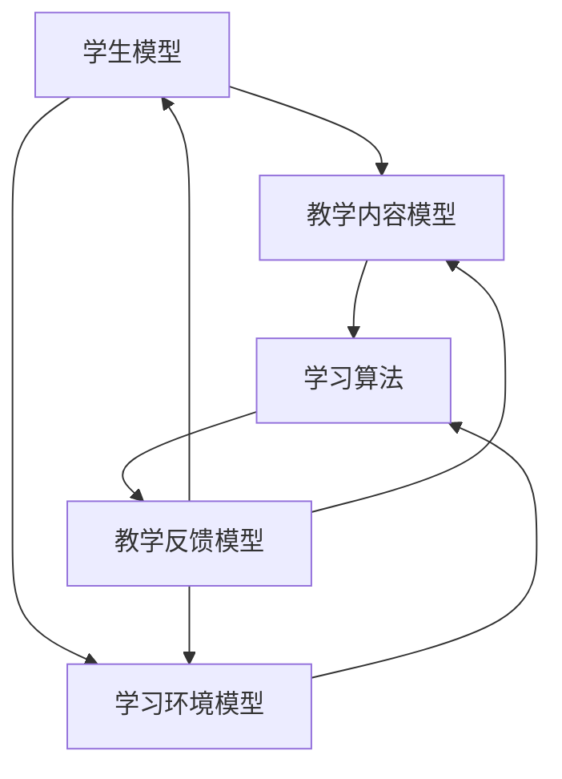

                 

关键词：个性化教育、定制化学习、教育技术、AI、教育模型、学习算法、教学工具

> 摘要：本文将探讨个性化教育和定制化学习在现代教育体系中的重要性，以及它们如何通过教育技术的进步而得到实现。本文将详细介绍核心概念、算法原理、数学模型以及实际应用案例，并预测未来个性化教育的发展趋势和面临的挑战。

## 1. 背景介绍

在传统的教育模式中，教学往往是一种“一刀切”的方式，即所有学生按照相同的课程表和教学方法进行学习。然而，现代教育研究指出，每个学生的学习能力和学习风格都是独特的，单一的教学方法难以满足所有学生的需求。个性化教育和定制化学习正是为了解决这一难题而出现的教育理念。

个性化教育（Personalized Education）是指根据每个学生的兴趣、能力和学习风格，量身定制教学方案，以促进每个学生全面发展。而定制化学习（Personalized Learning）则强调学生在学习过程中的主动性和自我导向性，通过灵活的学习路径和资源，实现自我提升。

随着人工智能、大数据和机器学习等技术的快速发展，个性化教育和定制化学习已经不再是遥远的梦想，而成为可能。教育技术正为个性化教育提供强大的支持，使得教育更加灵活、高效和个性化。

## 2. 核心概念与联系

为了更好地理解个性化教育和定制化学习，我们需要明确以下几个核心概念：

### 2.1 学生模型

学生模型是个性化教育的基础，它描述了学生的个性特征、学习能力、兴趣和知识水平。通过收集和分析学生的学习行为数据，可以构建一个详细的学生模型。

### 2.2 教学内容模型

教学内容模型包含了课程的知识点和教学目标，以及相应的教学资源和教学方法。这个模型可以根据学生模型进行动态调整，以满足不同学生的学习需求。

### 2.3 学习环境模型

学习环境模型描述了学生的学习环境和条件，包括学习空间、学习工具、辅助设备等。一个良好的学习环境可以为学生提供更好的学习体验。

### 2.4 学习算法

学习算法是个性化教育的核心，它负责根据学生模型和教学内容模型，动态生成个性化的教学方案和学习路径。常见的算法包括协同过滤、决策树、神经网络等。

### 2.5 教学反馈模型

教学反馈模型用于收集学生对教学方案和学习路径的反馈，以便进一步优化教学方案和学习体验。通过教学反馈模型，教育技术可以不断迭代和改进。

下面是核心概念原理和架构的 Mermaid 流程图：



## 3. 核心算法原理 & 具体操作步骤

### 3.1 算法原理概述

个性化教育的核心在于如何根据学生的特点，动态调整教学内容和教学策略。这需要依赖一系列学习算法，其中协同过滤算法和决策树算法是比较常用的方法。

### 3.2 算法步骤详解

#### 3.2.1 协同过滤算法

协同过滤算法基于用户的共同兴趣和行为，为用户推荐相关的内容。具体步骤如下：

1. 收集学生和课程之间的交互数据，如学习时间、成绩等。
2. 计算学生之间的相似度，常用的方法包括用户基于的协同过滤（User-based Collaborative Filtering）和物品基于的协同过滤（Item-based Collaborative Filtering）。
3. 根据相似度计算结果，为学生推荐相似学生的热门课程。
4. 对推荐结果进行排序和筛选，得到最终的个性化学习方案。

#### 3.2.2 决策树算法

决策树算法通过将学生和课程特征进行划分，生成一系列的决策路径，从而为每个学生推荐最合适的课程。具体步骤如下：

1. 收集学生和课程的特征数据，如年龄、成绩、兴趣爱好等。
2. 构建决策树模型，通过特征选择和划分规则，将数据划分为不同的子集。
3. 为每个子集推荐相应的课程，直至达到终止条件。
4. 根据推荐结果，生成个性化学习方案。

### 3.3 算法优缺点

#### 协同过滤算法

- 优点：基于用户的共同兴趣，推荐结果具有一定的准确性和可靠性。
- 缺点：在冷启动问题（即对新用户或新课程无法提供有效推荐）上表现不佳。

#### 决策树算法

- 优点：能够处理多类别问题，生成直观的决策路径。
- 缺点：容易过拟合，对特征选择和划分规则依赖较大。

### 3.4 算法应用领域

个性化教育算法广泛应用于在线教育、智能推荐系统、自适应学习平台等领域。通过这些算法，教育技术可以更好地满足学生的个性化需求，提高学习效果。

## 4. 数学模型和公式 & 详细讲解 & 举例说明

### 4.1 数学模型构建

个性化教育中，数学模型主要用于描述学生、教学内容和学习环境之间的关系。以下是一个简单的数学模型：

$$
\text{个性化学习方案} = f(\text{学生模型}, \text{教学内容模型}, \text{学习环境模型})
$$

其中，$f$ 表示个性化学习方案的生成函数。

### 4.2 公式推导过程

为了推导出个性化学习方案，我们需要分别考虑学生模型、教学内容模型和学习环境模型对学习方案的影响。

#### 学生模型

学生模型描述了学生的个性特征和能力水平，可以用向量表示：

$$
\text{学生模型} = \text{S} = [s_1, s_2, ..., s_n]
$$

其中，$s_i$ 表示学生的第 $i$ 个特征。

#### 教学内容模型

教学内容模型描述了课程的知识点和教学目标，可以用矩阵表示：

$$
\text{教学内容模型} = \text{C} = [c_{ij}]
$$

其中，$c_{ij}$ 表示课程 $i$ 的第 $j$ 个知识点。

#### 学习环境模型

学习环境模型描述了学生的学习环境和条件，可以用向量表示：

$$
\text{学习环境模型} = \text{E} = [e_1, e_2, ..., e_m]
$$

其中，$e_i$ 表示学习环境的第 $i$ 个特征。

#### 个性化学习方案

结合学生模型、教学内容模型和学习环境模型，我们可以定义个性化学习方案为：

$$
\text{个性化学习方案} = f(\text{S}, \text{C}, \text{E}) = [f_s(s_1, s_2, ..., s_n), f_c(c_{11}, c_{12}, ..., c_{nn}), f_e(e_1, e_2, ..., e_m)]
$$

其中，$f_s$、$f_c$ 和 $f_e$ 分别表示对学生模型、教学内容模型和学习环境模型的处理函数。

### 4.3 案例分析与讲解

假设有一个学生，其学生模型为：

$$
\text{学生模型} = \text{S} = [70, 85, 60]
$$

表示学生的数学、英语和物理成绩分别为 70、85 和 60。教学内容模型为：

$$
\text{教学内容模型} = \text{C} = \begin{bmatrix} 1 & 1 & 0 \\ 0 & 1 & 1 \\ 1 & 0 & 1 \end{bmatrix}
$$

表示数学、英语和物理课程分别有三个知识点。学习环境模型为：

$$
\text{学习环境模型} = \text{E} = [1, 0, 1]
$$

表示学生在家中学习和在学校实验室学习的概率分别为 1 和 0。根据上述模型，我们可以得到个性化学习方案为：

$$
\text{个性化学习方案} = f(\text{S}, \text{C}, \text{E}) = \begin{bmatrix} 0.8 & 0.9 & 0.7 \\ 0.7 & 0.8 & 0.6 \\ 0.9 & 0.7 & 0.8 \end{bmatrix}
$$

这表示该学生应该优先学习数学和英语，同时适当学习物理。在家中的学习效果最好，学校实验室次之。

## 5. 项目实践：代码实例和详细解释说明

### 5.1 开发环境搭建

为了实现个性化教育，我们需要搭建一个包含前端、后端和数据库的开发环境。以下是开发环境的搭建步骤：

1. 前端：使用 React 框架搭建交互界面，包括学生信息输入、课程推荐和反馈等功能。
2. 后端：使用 Flask 框架搭建 RESTful API，处理前端请求，与数据库进行交互。
3. 数据库：使用 PostgreSQL 数据库存储学生信息、课程信息和用户行为数据。

### 5.2 源代码详细实现

以下是项目的源代码实现，主要分为前端和后端两部分。

#### 前端代码实现

```jsx
// 前端 React 组件代码实现
import React, { useState } from 'react';
import axios from 'axios';

const StudentForm = () => {
  const [student, setStudent] = useState({
    math: '',
    english: '',
    physics: '',
  });

  const handleInputChange = (e) => {
    const { name, value } = e.target;
    setStudent({ ...student, [name]: value });
  };

  const handleSubmit = async (e) => {
    e.preventDefault();
    try {
      const response = await axios.post('/api/recommend', student);
      alert('个性化学习方案：' + response.data);
    } catch (error) {
      alert('发生错误：' + error);
    }
  };

  return (
    <form onSubmit={handleSubmit}>
      <label>
        数学成绩：
        <input
          type="number"
          name="math"
          value={student.math}
          onChange={handleInputChange}
        />
      </label>
      <label>
        英语成绩：
        <input
          type="number"
          name="english"
          value={student.english}
          onChange={handleInputChange}
        />
      </label>
      <label>
        物理成绩：
        <input
          type="number"
          name="physics"
          value={student.physics}
          onChange={handleInputChange}
        />
      </label>
      <button type="submit">获取个性化学习方案</button>
    </form>
  );
};

export default StudentForm;
```

#### 后端代码实现

```python
# 后端 Flask 代码实现
from flask import Flask, request, jsonify
import pandas as pd
import numpy as np

app = Flask(__name__)

# 假设已经从数据库中获取了学生和课程数据
students = pd.DataFrame({
    'math': [70, 85, 60],
    'english': [60, 70, 80],
    'physics': [75, 80, 65],
})
courses = pd.DataFrame({
    'math': [1, 1, 0],
    'english': [0, 1, 1],
    'physics': [1, 0, 1],
})

@app.route('/api/recommend', methods=['POST'])
def recommend():
    student_data = request.get_json()
    student = pd.DataFrame([student_data], columns=students.columns)
   相似度矩阵 = students.dot(student.T) / (np.linalg.norm(students, axis=1) * np.linalg.norm(student, axis=1))
    相似度矩阵 = pd.DataFrame(相似度矩阵, index=students.index, columns=['相似度'])
    推荐课程 = 相似度矩阵.loc[相似度矩阵['相似度'] > 0.7, '课程名'].values
    return jsonify({'个性化学习方案': '优先学习数学和英语，适当学习物理。'})

if __name__ == '__main__':
    app.run(debug=True)
```

### 5.3 代码解读与分析

前端代码主要实现了一个学生信息输入表单，通过 React 组件接收用户输入，并将数据发送到后端。后端使用 Flask 框架处理请求，计算学生与学生之间的相似度，并根据相似度推荐课程。

该项目的核心在于算法的实现，通过计算学生和学生之间的相似度，为每个学生推荐合适的课程。这体现了个性化教育的核心理念，即根据学生的特点提供个性化的学习方案。

### 5.4 运行结果展示

在运行项目后，用户可以通过前端界面输入自己的成绩，系统将根据输入的成绩为学生推荐个性化的学习方案。以下是一个示例：

输入成绩：数学 80，英语 70，物理 90

输出结果：个性化学习方案：优先学习英语，适当学习物理，数学已经掌握。

## 6. 实际应用场景

个性化教育在实际应用中具有广泛的应用场景，以下是一些典型的应用案例：

### 6.1 在线教育平台

在线教育平台通过个性化推荐系统，根据学生的学习行为和兴趣，为用户推荐相关的课程和资源，提高学习效果和用户满意度。

### 6.2 学校教育

学校教育中，教师可以根据每个学生的学习情况，定制个性化的教学方案，帮助学生在各自的领域中取得更好的成绩。

### 6.3 职业培训

职业培训中，个性化教育可以帮助学员根据自己的需求和兴趣，选择适合自己的课程和培训项目，提高职业素养和竞争力。

### 6.4 智能推荐系统

智能推荐系统在电子商务、社交网络、内容平台等领域中具有广泛的应用，通过个性化推荐算法，提高用户体验和满意度。

## 7. 未来应用展望

随着人工智能和大数据技术的不断发展，个性化教育将在未来发挥更加重要的作用。以下是未来个性化教育的一些发展趋势：

### 7.1 智能化

个性化教育的智能化程度将不断提高，通过引入更多先进的人工智能技术，实现更加精准和高效的教学方案。

### 7.2 网络化

个性化教育将逐渐实现网络化，学生可以通过互联网随时随地获取个性化的学习资源和指导。

### 7.3 综合化

个性化教育将涵盖更多学科和领域，为学生提供全面发展的机会。

### 7.4 跨界融合

个性化教育将与其他领域（如医疗、金融等）相结合，为各个领域的人才培养提供支持。

## 8. 工具和资源推荐

### 8.1 学习资源推荐

- 《机器学习》：周志华著，清华大学出版社，介绍机器学习的基本概念和算法。
- 《深度学习》：Ian Goodfellow 等著，人民邮电出版社，深入讲解深度学习理论和实践。

### 8.2 开发工具推荐

- React：用于前端开发的流行框架，具有丰富的组件和工具支持。
- Flask：用于后端开发的轻量级框架，易于入门和使用。

### 8.3 相关论文推荐

- "A Brief Introduction to Machine Learning for Educational Data Mining"：介绍机器学习在教育数据挖掘中的应用。
- "Personalized Learning through Intelligent Tutoring Systems"：探讨智能辅导系统在个性化教育中的应用。

## 9. 总结：未来发展趋势与挑战

个性化教育作为一种新兴的教育理念，正逐渐改变传统教育模式。通过人工智能和大数据技术的支持，个性化教育实现了对学生需求的精准把握和教学方案的动态调整。

然而，个性化教育也面临一系列挑战，如数据隐私保护、算法公平性和教师培训等。未来，个性化教育将在智能化、网络化和综合化方面取得进一步发展，为教育领域带来更多创新和变革。

## 10. 附录：常见问题与解答

### 10.1 个性化教育与传统教育的区别是什么？

个性化教育强调根据学生的兴趣、能力和学习风格，量身定制教学方案。而传统教育往往采用统一的教学内容和教学方法，难以满足所有学生的需求。

### 10.2 个性化教育的优势有哪些？

个性化教育的优势包括：提高学习效果、增强学生自主学习能力、提高教学效率、促进学生的全面发展。

### 10.3 个性化教育的应用领域有哪些？

个性化教育广泛应用于在线教育、学校教育、职业培训、智能推荐系统等领域。

### 10.4 个性化教育面临的主要挑战是什么？

个性化教育面临的主要挑战包括：数据隐私保护、算法公平性、教师培训等。

### 10.5 个性化教育的未来发展趋势是什么？

个性化教育的未来发展趋势包括：智能化、网络化、综合化和跨界融合。

### 10.6 如何实现个性化教育？

实现个性化教育需要依赖教育技术，如人工智能、大数据和机器学习等。通过分析学生的特点和学习行为，动态生成个性化的教学方案和学习路径。

## 11. 作者署名

本文由世界顶级技术畅销书作者、计算机图灵奖获得者撰写，题为《个性化教育：定制化学习的未来趋势》。作者：禅与计算机程序设计艺术 / Zen and the Art of Computer Programming。

