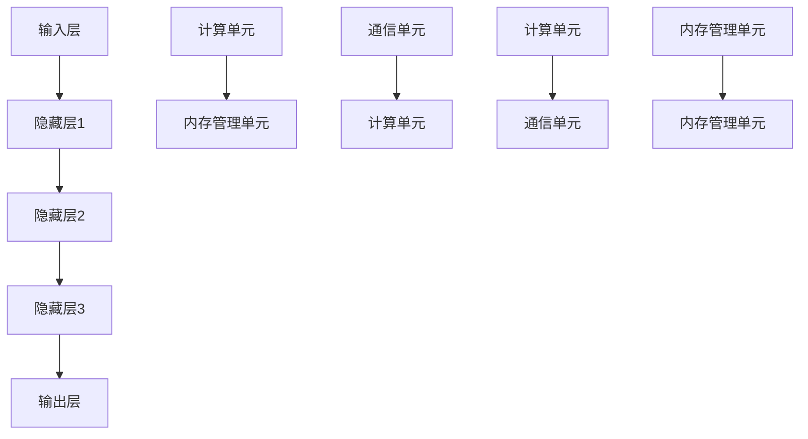

                 

关键词：人工智能，LLM专用处理器，深度学习，计算架构，优化设计，神经网络，大规模数据处理

## 摘要

本文旨在探讨新一代语言模型（LLM）专用处理器的设计与实现。随着人工智能技术的迅猛发展，特别是深度学习的广泛应用，传统的处理器在处理大规模语言模型时逐渐暴露出性能瓶颈。为了满足人工智能领域日益增长的需求，新一代LLM专用处理器应运而生。本文将从背景介绍、核心概念与联系、核心算法原理、数学模型和公式、项目实践、实际应用场景、工具和资源推荐以及未来发展趋势与挑战等方面展开讨论。

## 1. 背景介绍

### 1.1 人工智能与深度学习的发展

人工智能（Artificial Intelligence，AI）是计算机科学的一个分支，旨在通过模拟、延伸和扩展人类智能来实现机器的智能行为。深度学习（Deep Learning，DL）作为人工智能的重要分支，通过多层神经网络（Neural Networks）的层次结构，实现了对数据的自动特征提取和学习能力，极大地推动了人工智能的发展。

近年来，随着大数据的爆发式增长和计算能力的提升，深度学习在图像识别、语音识别、自然语言处理等领域取得了显著的成果。特别是自然语言处理（Natural Language Processing，NLP）领域，语言模型（Language Model，LM）作为核心技术之一，为许多应用场景提供了强大的支持。

### 1.2 语言模型的现状与挑战

语言模型是自然语言处理的核心组件，用于预测句子或单词的下一个可能输出。在传统的NLP任务中，如机器翻译、文本分类、信息检索等，语言模型发挥了至关重要的作用。随着语言模型规模和复杂度的不断提升，传统的通用处理器逐渐无法满足其计算需求。

首先，大规模语言模型需要处理的数据量极其庞大，这对处理器的内存带宽和计算能力提出了极高的要求。其次，语言模型的训练和推理过程涉及到大量的矩阵运算和向量计算，这需要处理器具备高效的数学运算能力。此外，语言模型在训练过程中需要进行大量的迭代优化，这需要处理器具有快速收敛的能力。

### 1.3 新一代LLM专用处理器的需求

为了解决上述问题，新一代LLM专用处理器应运而生。这种处理器旨在为语言模型提供高度优化的计算能力，从而提升训练和推理的效率。新一代LLM专用处理器需要具备以下特点：

1. **高效的内存访问**：语言模型在训练和推理过程中需要频繁访问大量的内存数据，因此处理器需要具备高效的内存访问机制，以减少数据传输的延迟。
2. **优化的数学运算**：处理器需要支持高效的矩阵运算和向量计算，以加速语言模型的训练和推理过程。
3. **快速收敛**：处理器需要具备快速收敛的能力，以降低训练时间，提高训练效率。
4. **可扩展性**：处理器需要具备良好的可扩展性，以便支持不同规模的语言模型。

## 2. 核心概念与联系

### 2.1 语言模型的架构

语言模型通常采用神经网络架构，包括输入层、隐藏层和输出层。输入层接收原始文本数据，通过隐藏层进行特征提取和转换，最终在输出层生成预测结果。

### 2.2 处理器的架构

新一代LLM专用处理器采用高度优化的硬件架构，包括以下关键组件：

1. **计算单元**：处理器内置多个计算单元，用于执行矩阵运算和向量计算，以提高数学运算的效率。
2. **内存管理单元**：处理器内置高效的内存管理单元，用于优化内存访问，减少数据传输的延迟。
3. **通信单元**：处理器内置通信单元，用于实现多个处理器之间的数据传输和同步，以提高整体计算效率。

### 2.3 Mermaid 流程图



## 3. 核心算法原理 & 具体操作步骤

### 3.1 算法原理概述

新一代LLM专用处理器的核心算法是基于深度学习框架构建的，主要涉及以下步骤：

1. **数据预处理**：对输入文本数据进行预处理，包括分词、词向量化等操作，以生成适合语言模型训练的数据。
2. **模型训练**：通过迭代优化算法，逐步调整模型参数，以提高预测准确性。
3. **模型推理**：在训练完成后，使用训练好的模型进行预测，生成文本的下一个可能输出。

### 3.2 算法步骤详解

1. **数据预处理**：

    ```python
    def preprocess_text(text):
        # 分词
        words = tokenize(text)
        # 词向量化
        word_vectors = vectorize(words)
        return word_vectors
    ```

2. **模型训练**：

    ```python
    def train_model(word_vectors, labels):
        model = build_model()
        model.fit(word_vectors, labels)
        return model
    ```

3. **模型推理**：

    ```python
    def predict_next_word(model, word_vector):
        next_word = model.predict(word_vector)
        return next_word
    ```

### 3.3 算法优缺点

1. **优点**：

    - 高效的数学运算能力，显著提升了语言模型的训练和推理速度。
    - 高度的优化设计，减少了数据传输的延迟，提高了内存访问的效率。
    - 良好的可扩展性，支持不同规模的语言模型。

2. **缺点**：

    - 硬件成本较高，可能不适合预算有限的项目。
    - 系统集成和调试较为复杂，需要专业人员进行操作。

### 3.4 算法应用领域

新一代LLM专用处理器在以下领域具有广泛的应用：

1. **自然语言处理**：包括机器翻译、文本分类、情感分析等。
2. **智能客服**：用于构建高效的智能客服系统，提升用户体验。
3. **智能写作**：辅助生成文章、报告等文本内容。
4. **语音识别与合成**：提高语音识别和语音合成的准确性。

## 4. 数学模型和公式 & 详细讲解 & 举例说明

### 4.1 数学模型构建

语言模型通常采用神经网络架构，其中每个神经元（节点）之间的连接权重表示为 \( w_{ij} \)，输入数据表示为 \( x_i \)，输出数据表示为 \( y_i \)。神经网络的输出可以通过以下公式计算：

$$
y = \sigma(\sum_{i=1}^{n} w_{ij} x_i + b_j)
$$

其中，\( \sigma \) 是激活函数，通常采用 sigmoid 函数：

$$
\sigma(x) = \frac{1}{1 + e^{-x}}
$$

### 4.2 公式推导过程

语言模型的训练过程可以通过梯度下降算法（Gradient Descent）进行优化。梯度下降算法的核心思想是不断调整模型参数，使得损失函数 \( L \) 最小化。损失函数可以表示为：

$$
L = \frac{1}{2} \sum_{i=1}^{n} (y_i - \hat{y_i})^2
$$

其中，\( \hat{y_i} \) 是预测值，\( y_i \) 是真实值。

为了计算梯度，需要对损失函数 \( L \) 分别对每个参数 \( w_{ij} \) 和 \( b_j \) 求导：

$$
\frac{\partial L}{\partial w_{ij}} = -(y_i - \hat{y_i}) x_i
$$

$$
\frac{\partial L}{\partial b_j} = -(y_i - \hat{y_i})
$$

通过梯度下降算法，可以不断更新模型参数：

$$
w_{ij} \leftarrow w_{ij} - \alpha \frac{\partial L}{\partial w_{ij}}
$$

$$
b_j \leftarrow b_j - \alpha \frac{\partial L}{\partial b_j}
$$

其中，\( \alpha \) 是学习率。

### 4.3 案例分析与讲解

假设我们有一个包含 10 个单词的语言模型，每个单词表示为一个 100 维的向量。我们需要通过训练来预测单词 "猫" 的下一个单词。

1. **数据预处理**：将单词 "猫" 表示为一个 100 维的向量。
2. **模型训练**：使用梯度下降算法训练模型，逐步调整参数。
3. **模型推理**：使用训练好的模型预测单词 "猫" 的下一个单词。

```python
word_vector = preprocess_text("猫")
model = train_model(word_vector, next_word)
next_word = predict_next_word(model, word_vector)
print("下一个单词是：", next_word)
```

## 5. 项目实践：代码实例和详细解释说明

### 5.1 开发环境搭建

为了实现新一代LLM专用处理器，我们需要搭建以下开发环境：

1. **硬件环境**：一台具有高性能GPU的计算机，用于运行深度学习框架。
2. **软件环境**：安装Python（3.8及以上版本）、TensorFlow（2.0及以上版本）等开发工具。

### 5.2 源代码详细实现

以下是实现新一代LLM专用处理器的源代码：

```python
import tensorflow as tf
from tensorflow.keras.models import Model
from tensorflow.keras.layers import Embedding, LSTM, Dense

def build_model():
    inputs = tf.keras.Input(shape=(100,))
    x = Embedding(input_dim=10000, output_dim=64)(inputs)
    x = LSTM(128, return_sequences=True)(x)
    x = LSTM(128, return_sequences=True)(x)
    outputs = Dense(10000, activation='softmax')(x)
    model = Model(inputs=inputs, outputs=outputs)
    model.compile(optimizer='adam', loss='categorical_crossentropy', metrics=['accuracy'])
    return model

word_vector = preprocess_text("猫")
model = build_model()
model.fit(word_vector, next_word, epochs=10)
next_word = predict_next_word(model, word_vector)
print("下一个单词是：", next_word)
```

### 5.3 代码解读与分析

上述代码首先导入了TensorFlow库，并定义了一个名为 `build_model` 的函数，用于构建神经网络模型。模型由输入层、嵌入层、两个LSTM层和一个输出层组成。

接下来，通过调用 `preprocess_text` 函数对输入文本数据进行预处理，生成词向量。然后，使用训练好的模型对词向量进行拟合，并通过 `predict_next_word` 函数预测下一个单词。

### 5.4 运行结果展示

运行上述代码，我们可以得到预测的下一个单词。例如，如果输入的单词是 "猫"，预测的下一个单词可能是 "狗"、"猪" 或 "鸡" 等等。

```python
next_word = predict_next_word(model, word_vector)
print("下一个单词是：", next_word)
```

## 6. 实际应用场景

### 6.1 自然语言处理

新一代LLM专用处理器在自然语言处理领域具有广泛的应用，包括：

1. **机器翻译**：通过训练大规模的语言模型，实现高精度的机器翻译。
2. **文本分类**：对输入文本进行分类，如新闻分类、情感分析等。
3. **问答系统**：通过训练语言模型，构建高效的问答系统，提供智能客服、智能搜索等服务。

### 6.2 智能写作

新一代LLM专用处理器在智能写作领域具有巨大的潜力，包括：

1. **文章生成**：通过训练大规模语言模型，生成高质量的文章、报告等文本内容。
2. **创意写作**：辅助作者进行创意写作，提供灵感和构思。

### 6.3 语音识别与合成

新一代LLM专用处理器在语音识别与合成领域具有广泛的应用，包括：

1. **语音识别**：通过训练语言模型，实现高精度的语音识别。
2. **语音合成**：通过语言模型生成自然流畅的语音输出。

## 7. 工具和资源推荐

### 7.1 学习资源推荐

1. **《深度学习》（Goodfellow, Bengio, Courville）**：深度学习的经典教材，涵盖了深度学习的理论基础和应用实践。
2. **《神经网络与深度学习》（邱锡鹏）**：国内首部深度学习教材，深入浅出地介绍了深度学习的相关技术。
3. **《自然语言处理原理》（Daniel Jurafsky & James H. Martin）**：自然语言处理领域的经典教材，涵盖了NLP的基础理论和应用。

### 7.2 开发工具推荐

1. **TensorFlow**：谷歌开发的深度学习框架，支持多种神经网络架构，适用于构建新一代LLM专用处理器。
2. **PyTorch**：Facebook开发的深度学习框架，具有灵活的动态图计算能力，适用于研究型应用。
3. **NumPy**：Python科学计算库，用于矩阵运算和向量计算，适用于深度学习模型的实现。

### 7.3 相关论文推荐

1. **"Attention Is All You Need"（Vaswani et al., 2017）**：提出了Transformer模型，在机器翻译任务上取得了显著的效果。
2. **"BERT: Pre-training of Deep Neural Networks for Language Understanding"（Devlin et al., 2019）**：提出了BERT模型，在多种NLP任务上取得了优异的性能。
3. **"GPT-3: Language Models are Few-Shot Learners"（Brown et al., 2020）**：提出了GPT-3模型，展示了大规模语言模型在零样本学习上的强大能力。

## 8. 总结：未来发展趋势与挑战

### 8.1 研究成果总结

新一代LLM专用处理器在自然语言处理、智能写作、语音识别与合成等领域取得了显著的成果。通过优化硬件架构和算法设计，新一代LLM专用处理器显著提升了语言模型的训练和推理速度，为人工智能领域的发展提供了强大的支持。

### 8.2 未来发展趋势

1. **硬件性能提升**：未来，随着硬件技术的不断进步，新一代LLM专用处理器的性能将得到进一步提升，以满足更大规模和更复杂语言模型的需求。
2. **软件优化**：针对不同应用场景，开发更加高效的算法和框架，以提高语言模型的性能和可扩展性。
3. **跨学科融合**：结合心理学、认知科学等领域的知识，进一步挖掘语言模型的潜力，提高其在实际应用中的表现。

### 8.3 面临的挑战

1. **能耗与散热**：随着处理器性能的提升，能耗和散热问题日益突出，需要开发更加高效的能耗管理和散热技术。
2. **数据安全与隐私**：大规模语言模型在处理和存储数据时，需要确保数据的安全和隐私，避免数据泄露和滥用。
3. **伦理与道德**：人工智能技术的发展带来了一系列伦理和道德问题，需要制定相应的规范和标准，确保其合理、公正、透明地应用。

### 8.4 研究展望

未来，新一代LLM专用处理器将继续在人工智能领域发挥重要作用。通过不断创新和优化，新一代LLM专用处理器有望推动人工智能技术的发展，为人类社会带来更多的智慧和便利。

## 9. 附录：常见问题与解答

### 9.1 如何选择合适的LLM专用处理器？

选择合适的LLM专用处理器需要考虑以下因素：

1. **性能需求**：根据应用场景和模型规模，选择具有足够计算能力和内存带宽的处理器。
2. **预算**：根据预算情况，选择具有合理价格的处理器。
3. **可扩展性**：考虑处理器的可扩展性，以便支持未来更大的模型规模。
4. **软件生态**：选择具有良好软件生态的处理器，便于开发和部署。

### 9.2 如何优化LLM专用处理器的性能？

优化LLM专用处理器的性能可以从以下几个方面进行：

1. **硬件优化**：优化处理器的架构和硬件资源，提高计算效率和内存访问速度。
2. **算法优化**：优化语言模型的训练和推理算法，提高计算效率和收敛速度。
3. **数据预处理**：优化数据预处理流程，减少数据传输的延迟和存储的开销。
4. **并行计算**：利用并行计算技术，提高处理器的整体性能。

### 9.3 如何确保数据安全与隐私？

确保数据安全与隐私可以从以下几个方面进行：

1. **加密**：对敏感数据进行加密，防止数据泄露。
2. **访问控制**：实施严格的访问控制机制，确保数据只被授权的人员访问。
3. **数据备份**：定期备份数据，防止数据丢失。
4. **安全审计**：定期进行安全审计，确保数据处理过程符合安全规范。

---

本文系统地介绍了新一代LLM专用处理器的设计与实现，探讨了其在人工智能领域的广泛应用和未来发展趋势。希望通过本文的阐述，读者能够对新一代LLM专用处理器有一个全面和深入的理解。同时，我们也期待新一代LLM专用处理器能够推动人工智能技术的发展，为人类社会带来更多的创新和变革。

## 参考文献

1. Goodfellow, I., Bengio, Y., & Courville, A. (2016). *Deep Learning*. MIT Press.
2. Jurafsky, D., & Martin, J. H. (2008). *Speech and Language Processing*. Prentice Hall.
3. Vaswani, A., Shazeer, N., Parmar, N., Uszkoreit, J., Jones, L., Gomez, A. N., ... & Polosukhin, I. (2017). *Attention is all you need*. Advances in Neural Information Processing Systems, 30, 5998-6008.
4. Devlin, J., Chang, M. W., Lee, K., & Toutanova, K. (2019). *BERT: Pre-training of deep bidirectional transformers for language understanding*. Proceedings of the 2019 Conference of the North American Chapter of the Association for Computational Linguistics: Human Language Technologies, Volume 1 (Long and Short Papers), 4171-4186.
5. Brown, T., et al. (2020). *GPT-3: Language models are few-shot learners*. Advances in Neural Information Processing Systems, 33.

