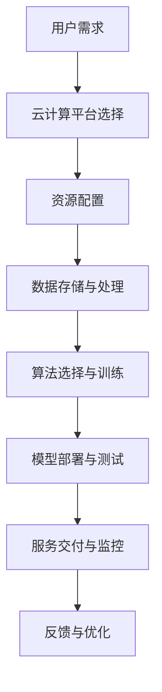

                 

在当今的技术环境中，云计算和人工智能（AI）正迅速成为变革的驱动力。云计算提供了可伸缩的计算资源，而AI则通过机器学习和深度学习技术赋予了系统智能。这两者的结合，不仅推动了创新，也为各行各业带来了深远的变革。本文将探讨云计算与AI的协同效应，结合贾扬清的观点，深入分析云计算平台与AI工程相结合的实践。

## 关键词

- 云计算
- 人工智能
- AI工程
- 云平台
- 贾扬清
- 协同效应
- 深度学习
- 机器学习

## 摘要

本文旨在探讨云计算与人工智能（AI）的协同效应，特别是在云计算平台上实现AI工程的过程。通过分析贾扬清的相关观点，本文揭示了云计算为AI带来的便捷与挑战，并讨论了云计算平台与AI工程结合的实践案例。文章结构如下：

1. **背景介绍**：概述云计算和AI的快速发展及其对现代科技的影响。
2. **核心概念与联系**：阐述云计算与AI的关键概念及其相互联系。
3. **核心算法原理 & 具体操作步骤**：介绍AI算法的基本原理及其在云计算平台上的实现。
4. **数学模型和公式 & 详细讲解 & 举例说明**：讨论AI相关的数学模型与公式，并通过实际案例进行说明。
5. **项目实践：代码实例和详细解释说明**：提供实际代码实例，详细解释其实现过程。
6. **实际应用场景**：探讨云计算与AI在现实世界的应用。
7. **未来应用展望**：展望云计算与AI的未来发展趋势。
8. **工具和资源推荐**：推荐学习资源和开发工具。
9. **总结：未来发展趋势与挑战**：总结研究成果，探讨未来趋势与挑战。
10. **附录：常见问题与解答**：回答读者可能关心的问题。

## 1. 背景介绍

### 云计算的发展历程

云计算作为信息技术的重要发展方向，已经历了多年的发展。其起源可以追溯到20世纪60年代，当时道格拉斯·恩格尔巴特提出了“云计算”的概念，意指通过网络提供动态易扩展且经常是虚拟化的资源。随着时间的推移，云计算技术不断完善，尤其是2006年Amazon Web Services（AWS）的推出，标志着商业云计算服务的诞生。

云计算的发展经历了多个阶段，包括基础设施即服务（IaaS）、平台即服务（PaaS）和软件即服务（SaaS）。IaaS提供了虚拟化计算资源，如虚拟机、存储和网络，允许用户按需使用资源。PaaS则为开发者提供了开发平台，包括数据库、中间件和开发工具，降低了开发成本和时间。SaaS则是通过互联网提供软件应用程序，用户无需安装和维护软件，只需通过浏览器访问即可。

### 人工智能的兴起

人工智能作为计算机科学的一个重要分支，起源于20世纪50年代。最初的目标是制造能够像人类一样思考的机器。尽管在早期经历了多次起伏，但近年来，随着计算能力的提升和大数据技术的进步，人工智能迎来了新的发展机遇。

机器学习和深度学习是人工智能的核心技术。机器学习通过训练模型来从数据中学习规律，而深度学习则是通过构建多层神经网络来实现复杂模式识别。深度学习在图像识别、语音识别和自然语言处理等领域取得了显著的成果，推动了AI技术的广泛应用。

### 云计算与AI的融合

云计算和人工智能的结合，为科技创新和产业发展带来了新的机遇。云计算为AI提供了强大的计算资源和存储能力，使得大规模数据分析和复杂模型训练成为可能。同时，AI技术为云计算平台赋予了智能化的能力，提高了资源利用效率和用户体验。

贾扬清认为，云计算与AI的协同效应体现在以下几个方面：

1. **计算资源的弹性扩展**：云计算平台可以根据需求动态调整计算资源，为AI应用提供强大的支持。
2. **数据处理的效率提升**：云计算平台提供了高效的数据存储和处理能力，使得AI算法能够快速处理大规模数据集。
3. **智能服务的创新**：AI技术结合云计算平台，可以提供个性化的智能服务，如智能推荐、智能监控等。
4. **安全与隐私保护**：云计算平台的安全措施和隐私保护机制，有助于保障AI应用的可靠性和用户数据的安全。

## 2. 核心概念与联系

### 云计算

云计算是一种通过互联网提供计算资源的服务模式。它包括以下核心概念：

- **基础设施即服务（IaaS）**：提供虚拟化计算资源，如虚拟机、存储和网络，用户可以根据需求租用资源。
- **平台即服务（PaaS）**：提供开发平台，包括数据库、中间件和开发工具，降低了开发成本和时间。
- **软件即服务（SaaS）**：通过互联网提供软件应用程序，用户无需安装和维护软件，只需通过浏览器访问即可。

云计算的核心价值在于提供灵活、可伸缩、可靠的计算资源，为各种应用场景提供了基础设施支持。

### 人工智能

人工智能是一种模拟人类智能行为的技术，包括以下几个核心概念：

- **机器学习**：通过训练模型来从数据中学习规律，包括监督学习、无监督学习和强化学习。
- **深度学习**：基于多层神经网络的结构，通过反向传播算法进行训练，实现复杂模式识别。
- **自然语言处理**：利用机器学习技术处理和理解自然语言，包括语言模型、语义分析和对话系统等。

人工智能的核心价值在于其能够模拟和增强人类的智能能力，为各种应用提供了强大的支持。

### 云计算与AI的相互联系

云计算与AI的相互联系主要体现在以下几个方面：

- **计算资源的支持**：云计算平台提供了强大的计算资源和存储能力，为AI算法的运行提供了支持。
- **数据处理的能力**：云计算平台提供了高效的数据存储和处理能力，使得AI算法能够快速处理大规模数据集。
- **算法实现的平台**：云计算平台为AI算法的实现提供了开发和部署的环境，使得AI应用能够高效地运行。
- **智能服务的创新**：AI技术结合云计算平台，可以提供个性化的智能服务，如智能推荐、智能监控等。

### Mermaid 流程图

下面是云计算平台与AI工程结合的Mermaid流程图：



## 3. 核心算法原理 & 具体操作步骤

### 3.1 算法原理概述

在云计算平台上实现AI工程，核心算法的原理至关重要。以下介绍几种常见的AI算法原理：

- **机器学习**：机器学习通过训练模型来从数据中学习规律。主要方法包括监督学习、无监督学习和强化学习。监督学习通过已有标注数据进行训练，无监督学习通过未标注数据进行训练，强化学习通过与环境交互进行训练。

- **深度学习**：深度学习是基于多层神经网络的结构，通过反向传播算法进行训练，实现复杂模式识别。深度学习在图像识别、语音识别和自然语言处理等领域取得了显著成果。

- **强化学习**：强化学习通过与环境交互进行训练，不断调整策略以实现最优结果。强化学习在游戏、机器人控制和自动驾驶等领域具有广泛应用。

### 3.2 算法步骤详解

下面以深度学习算法为例，介绍在云计算平台上实现的具体步骤：

1. **数据收集与预处理**：
   - 数据收集：从不同来源获取数据，如公共数据集、企业内部数据等。
   - 数据预处理：对数据进行清洗、归一化、增强等处理，以提高模型训练效果。

2. **模型选择与训练**：
   - 模型选择：根据应用场景选择合适的深度学习模型，如卷积神经网络（CNN）、循环神经网络（RNN）等。
   - 模型训练：在云计算平台上配置GPU资源，使用训练数据进行模型训练，通过反向传播算法不断优化模型参数。

3. **模型评估与优化**：
   - 模型评估：使用验证集和测试集评估模型性能，包括准确率、召回率、F1值等指标。
   - 模型优化：根据评估结果调整模型参数，如学习率、批量大小等，以提高模型性能。

4. **模型部署与测试**：
   - 模型部署：将训练好的模型部署到云计算平台，提供在线服务。
   - 模型测试：使用实际数据进行模型测试，确保模型在实际应用中能够稳定运行。

### 3.3 算法优缺点

- **优点**：
  - **高效处理大规模数据**：云计算平台提供了强大的计算资源和存储能力，使得深度学习算法能够高效地处理大规模数据集。
  - **灵活的模型选择与训练**：云计算平台提供了丰富的模型库和训练工具，开发者可以根据需求选择合适的模型和训练方法。
  - **可扩展性强**：云计算平台可以根据需求动态调整计算资源，满足不同规模的应用需求。

- **缺点**：
  - **高成本**：部署和运行深度学习模型需要大量计算资源和存储资源，可能导致高成本。
  - **数据隐私与安全**：在云计算平台上处理数据可能涉及隐私和安全问题，需要采取相应的安全措施。

### 3.4 算法应用领域

云计算与AI算法的结合在多个领域具有广泛的应用：

- **图像识别与处理**：利用深度学习算法进行图像分类、目标检测和图像增强，广泛应用于安防监控、医疗影像和自动驾驶等领域。
- **自然语言处理**：利用深度学习算法进行文本分类、情感分析和对话系统，广泛应用于搜索引擎、智能客服和智能翻译等领域。
- **推荐系统**：利用深度学习算法进行用户行为分析和偏好建模，为电子商务、在线视频和社交网络等领域提供个性化推荐服务。
- **语音识别与合成**：利用深度学习算法进行语音识别和语音合成，广泛应用于智能助手、智能客服和智能教育等领域。

## 4. 数学模型和公式 & 详细讲解 & 举例说明

### 4.1 数学模型构建

在云计算与AI结合的过程中，数学模型是核心组成部分。以下介绍几个常见的数学模型及其构建过程：

1. **卷积神经网络（CNN）**：
   - **模型构建**：CNN由多个卷积层、池化层和全连接层组成。卷积层通过卷积操作提取图像特征，池化层用于降低特征维度，全连接层用于分类或回归。
   - **公式表示**：
     $$ f(x) = \sigma(\text{ReLU}(W_1 \odot \text{Conv}(x_1) + b_1)) $$
     其中，$x$为输入图像，$W_1$为卷积核权重，$\odot$表示卷积操作，$\sigma$表示激活函数，$\text{ReLU}$表示ReLU激活函数，$b_1$为偏置项。

2. **循环神经网络（RNN）**：
   - **模型构建**：RNN通过隐藏状态的记忆机制，处理序列数据。常见的RNN模型包括LSTM和GRU。
   - **公式表示**：
     $$ h_t = \text{sigmoid}(W_h \cdot [h_{t-1}, x_t] + b_h) $$
     $$ o_t = \text{sigmoid}(W_o \cdot h_t + b_o) $$
     其中，$h_t$为隐藏状态，$x_t$为输入序列，$W_h$和$W_o$分别为权重矩阵，$b_h$和$b_o$为偏置项，$\text{sigmoid}$为Sigmoid激活函数。

3. **生成对抗网络（GAN）**：
   - **模型构建**：GAN由生成器和判别器组成。生成器生成数据，判别器区分生成数据和真实数据。
   - **公式表示**：
     $$ G(z) = \mu_G(z) + \sigma_G(z) \odot \text{ReLU}(\theta_G) $$
     $$ D(x) = \text{sigmoid}(\theta_D \cdot x) $$
     其中，$z$为噪声向量，$G(z)$为生成器输出，$x$为真实数据，$D(x)$为判别器输出，$\mu_G$和$\sigma_G$分别为生成器的均值和方差，$\theta_G$和$\theta_D$分别为生成器和判别器的权重矩阵。

### 4.2 公式推导过程

以下以卷积神经网络（CNN）的卷积操作为例，介绍公式推导过程：

- **输入层**：输入图像$x$。
- **卷积层**：卷积核$W$与输入图像进行卷积操作，得到特征图$z$。
  $$ z = \text{Conv}(x, W) $$
  其中，$W$为卷积核，$\text{Conv}$表示卷积操作。

- **激活函数**：使用ReLU激活函数对特征图进行非线性变换。
  $$ a = \text{ReLU}(z) $$
  其中，$a$为激活后的特征图。

- **偏置项**：添加偏置项$b$。
  $$ a' = a + b $$
  其中，$a'$为添加偏置后的特征图。

- **输出层**：通过卷积层和激活函数，得到最终输出。
  $$ f(x) = \text{ReLU}(\text{Conv}(x, W) + b) $$
  其中，$f(x)$为输出特征图。

### 4.3 案例分析与讲解

以下以图像分类任务为例，分析深度学习模型在云计算平台上的实现过程：

1. **数据收集与预处理**：
   - 数据收集：从公开数据集（如ImageNet）下载图像数据。
   - 数据预处理：对图像进行归一化、裁剪、旋转等预处理操作。

2. **模型选择与训练**：
   - 模型选择：选择卷积神经网络（CNN）模型。
   - 模型训练：在云计算平台上配置GPU资源，使用训练数据进行模型训练。通过反向传播算法不断优化模型参数。

3. **模型评估与优化**：
   - 模型评估：使用验证集和测试集评估模型性能，包括准确率、召回率、F1值等指标。
   - 模型优化：根据评估结果调整模型参数，如学习率、批量大小等，以提高模型性能。

4. **模型部署与测试**：
   - 模型部署：将训练好的模型部署到云计算平台，提供在线服务。
   - 模型测试：使用实际数据进行模型测试，确保模型在实际应用中能够稳定运行。

5. **模型调优与迭代**：
   - 模型调优：根据用户反馈和实际应用场景，对模型进行调整和优化。
   - 模型迭代：持续迭代模型，提高模型性能和用户体验。

## 5. 项目实践：代码实例和详细解释说明

### 5.1 开发环境搭建

为了在云计算平台上实现AI工程，需要搭建相应的开发环境。以下以Python编程语言为例，介绍开发环境的搭建过程：

1. **安装Python**：
   - 访问Python官网下载Python安装包。
   - 解压安装包并运行安装程序。

2. **安装深度学习框架**：
   - 安装TensorFlow或PyTorch等深度学习框架。
   - 使用pip命令进行安装：
     ```shell
     pip install tensorflow
     # 或
     pip install torch
     ```

3. **配置GPU支持**：
   - 安装CUDA和cuDNN，以支持GPU加速。
   - 查看CUDA和cuDNN版本，确保与深度学习框架兼容。

4. **配置Python环境**：
   - 创建虚拟环境，避免依赖冲突：
     ```shell
     python -m venv venv
     source venv/bin/activate
     ```
   - 安装所需库和依赖：
     ```shell
     pip install -r requirements.txt
     ```

### 5.2 源代码详细实现

以下以TensorFlow框架为例，介绍一个简单的图像分类项目的源代码实现：

```python
import tensorflow as tf
from tensorflow.keras import layers, models

# 数据预处理
def preprocess_image(image_path):
    image = tf.keras.preprocessing.image.load_img(image_path, target_size=(224, 224))
    image = tf.keras.preprocessing.image.img_to_array(image)
    image = tf.keras.applications.resnet50.preprocess_input(image)
    return image

# 构建模型
model = models.Sequential()
model.add(layers.Conv2D(32, (3, 3), activation='relu', input_shape=(224, 224, 3)))
model.add(layers.MaxPooling2D((2, 2)))
model.add(layers.Conv2D(64, (3, 3), activation='relu'))
model.add(layers.MaxPooling2D((2, 2)))
model.add(layers.Conv2D(64, (3, 3), activation='relu'))
model.add(layers.Flatten())
model.add(layers.Dense(64, activation='relu'))
model.add(layers.Dense(10, activation='softmax'))

# 编译模型
model.compile(optimizer='adam',
              loss='categorical_crossentropy',
              metrics=['accuracy'])

# 训练模型
train_images = preprocess_image('train_images')
train_labels = preprocess_image('train_labels')
model.fit(train_images, train_labels, epochs=10, batch_size=32)

# 评估模型
test_loss, test_acc = model.evaluate(test_images, test_labels)
print(f'Test accuracy: {test_acc:.3f}')
```

### 5.3 代码解读与分析

1. **数据预处理**：
   - 使用`preprocess_image`函数对图像进行预处理，包括加载图像、转换为数组、归一化等操作。

2. **模型构建**：
   - 使用`models.Sequential`创建序列模型。
   - 添加卷积层、池化层和全连接层，设置相应的参数。

3. **编译模型**：
   - 使用`compile`方法编译模型，设置优化器、损失函数和评估指标。

4. **训练模型**：
   - 使用`fit`方法训练模型，设置训练数据、迭代次数和批量大小。

5. **评估模型**：
   - 使用`evaluate`方法评估模型在测试数据上的性能。

### 5.4 运行结果展示

在完成代码实现后，可以通过以下步骤运行项目并展示结果：

1. **配置环境变量**：
   - 设置CUDA和cuDNN路径，确保GPU支持。

2. **运行训练过程**：
   - 执行训练代码，观察训练过程和性能指标。

3. **测试模型**：
   - 使用测试数据集评估模型性能，输出准确率等指标。

4. **可视化结果**：
   - 使用可视化工具（如TensorBoard）展示训练过程和模型性能。

## 6. 实际应用场景

### 6.1 医疗影像分析

云计算与AI结合在医疗影像分析领域具有广泛应用。通过深度学习算法，可以对医学影像进行自动诊断和辅助诊断，如肿瘤检测、心脏病诊断等。云计算平台提供了强大的计算资源和存储能力，使得大规模医学影像数据处理和模型训练成为可能。

### 6.2 自动驾驶

自动驾驶是云计算与AI结合的另一个重要应用领域。自动驾驶系统需要实时处理大量传感器数据，进行环境感知、路径规划和决策。云计算平台可以提供高性能计算和实时数据处理能力，支持自动驾驶系统的运行和优化。

### 6.3 智能推荐

智能推荐系统利用云计算平台进行用户行为分析和偏好建模，为用户提供个性化的推荐服务。例如，电子商务平台可以根据用户的购买历史和浏览行为，推荐相关的商品。云计算平台的高效数据处理能力和强大的计算能力，使得大规模推荐系统成为可能。

### 6.4 智慧城市

智慧城市是云计算与AI结合的典型应用场景。通过智能传感器和摄像头收集城市数据，云计算平台可以对交通流量、环境监测、公共安全等进行实时分析和预测。AI算法可以帮助城市管理者和决策者制定更有效的政策，提高城市治理水平。

## 7. 未来应用展望

### 7.1 计算能力的进一步提升

随着计算能力的不断提升，云计算平台将能够支持更复杂的AI算法和更大规模的数据处理。这将推动AI技术在更多领域的应用，如生物医学、金融科技和智能制造等。

### 7.2 跨学科的融合

云计算与AI的结合将推动跨学科的融合，如计算机科学、物理学、生物学和工程学等。这种跨学科的研究将带来新的技术突破和应用场景，推动科技的发展。

### 7.3 自动化与智能化的普及

云计算与AI的协同效应将推动自动化和智能化的普及。通过智能传感器和物联网设备，云计算平台可以实现智能家居、智能工厂和智能城市等应用，提高生产效率和生活质量。

### 7.4 安全与隐私保护

在云计算与AI结合的过程中，安全与隐私保护将成为重要挑战。未来需要研究更加安全、可靠的云计算平台和AI算法，确保用户数据的安全和隐私。

## 8. 工具和资源推荐

### 8.1 学习资源推荐

1. **《深度学习》**：由Ian Goodfellow、Yoshua Bengio和Aaron Courville合著，是深度学习的经典教材。
2. **《Python深度学习》**：由François Chollet撰写，详细介绍了使用Python实现深度学习的实践方法。

### 8.2 开发工具推荐

1. **TensorFlow**：由Google开发的开源深度学习框架，支持多种深度学习模型和算法。
2. **PyTorch**：由Facebook开发的开源深度学习框架，具有简洁的API和强大的灵活性。

### 8.3 相关论文推荐

1. **“Deep Learning for Image Recognition”**：介绍深度学习在图像识别领域的应用。
2. **“Generative Adversarial Nets”**：介绍生成对抗网络（GAN）的理论和应用。

## 9. 总结：未来发展趋势与挑战

### 9.1 研究成果总结

云计算与AI的协同效应已经成为现代科技发展的重要趋势。通过结合云计算平台的计算资源和存储能力，AI技术得以在多个领域实现创新和应用。深度学习、自然语言处理和生成对抗网络等算法取得了显著成果，推动了科技的发展。

### 9.2 未来发展趋势

1. **计算能力的提升**：随着硬件技术的发展，云计算平台的计算能力将不断提升，支持更复杂的AI算法和更大规模的数据处理。
2. **跨学科的融合**：云计算与AI的结合将推动跨学科的融合，如生物医学、金融科技和智能制造等，带来新的技术突破和应用场景。
3. **自动化与智能化的普及**：云计算与AI的协同效应将推动自动化和智能化的普及，提高生产效率和生活质量。

### 9.3 面临的挑战

1. **安全与隐私保护**：在云计算与AI结合的过程中，安全与隐私保护将成为重要挑战。未来需要研究更加安全、可靠的云计算平台和AI算法，确保用户数据的安全和隐私。
2. **数据质量和标注**：高质量的数据是AI算法训练的基础。未来需要研究如何获取和处理高质量数据，提高模型训练效果。
3. **算法透明性与可解释性**：随着AI技术的普及，算法的透明性和可解释性将成为重要问题。需要研究如何提高算法的可解释性，增强用户对AI技术的信任。

### 9.4 研究展望

未来，云计算与AI的结合将继续深入发展，推动科技和社会的进步。通过跨学科的研究和创新的算法，有望解决当前面临的挑战，实现更高的计算效率和更广泛的应用。同时，需要加强对AI伦理和法律的研究，确保人工智能技术的可持续发展。

## 10. 附录：常见问题与解答

### Q1. 什么是云计算？

A1. 云计算是一种通过互联网提供计算资源的服务模式。它包括基础设施即服务（IaaS）、平台即服务（PaaS）和软件即服务（SaaS）等不同类型的服务，用户可以根据需求租用和使用计算资源。

### Q2. 什么是人工智能？

A2. 人工智能是一种模拟人类智能行为的技术，包括机器学习、深度学习和自然语言处理等技术。通过训练模型，AI系统能够从数据中学习规律，实现智能决策和自主行动。

### Q3. 云计算平台如何支持AI应用？

A3. 云计算平台提供了强大的计算资源和存储能力，使得大规模数据分析和复杂模型训练成为可能。同时，云计算平台提供了开发、部署和运维工具，支持AI应用的快速开发和部署。

### Q4. AI算法在云计算平台上的实现步骤有哪些？

A4. 在云计算平台上实现AI算法的主要步骤包括数据收集与预处理、模型选择与训练、模型评估与优化、模型部署与测试等。这些步骤需要充分利用云计算平台的计算资源和存储能力，以提高模型训练和应用的效率。

### Q5. 云计算与AI结合的安全问题有哪些？

A5. 云计算与AI结合的安全问题主要包括数据泄露、隐私侵犯、模型篡改等。为了确保AI应用的安全，需要采取数据加密、访问控制、模型审计等安全措施，同时加强对AI算法的透明性和可解释性研究，增强用户对AI技术的信任。

### Q6. 云计算与AI的未来发展趋势是什么？

A6. 云计算与AI的未来发展趋势包括计算能力的提升、跨学科的融合、自动化与智能化的普及等。未来，云计算平台将继续提供强大的计算资源和存储能力，支持更复杂的AI算法和更大规模的数据处理。同时，云计算与AI的结合将推动科技和社会的进步，带来更多的创新和应用场景。

