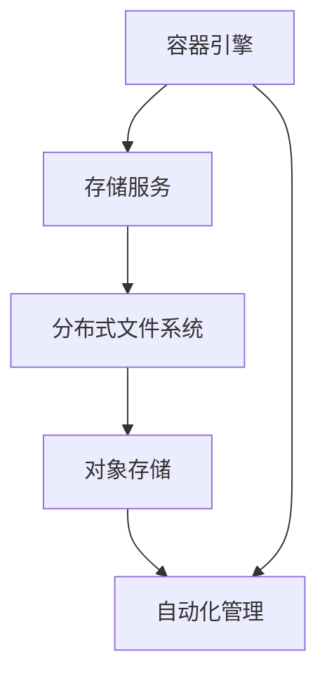

                 

关键词：云原生、存储解决方案、对象存储、分布式文件系统、容器化、微服务、Kubernetes、性能优化、可靠性、安全性、自动化管理

> 摘要：本文探讨了云原生存储解决方案的设计与实现，从对象存储到分布式文件系统，分析了其在容器化和微服务架构中的应用。通过深入剖析核心概念、算法原理、数学模型，以及实际项目实践，本文为读者提供了一个全面的技术指南。

## 1. 背景介绍

### 云原生时代的到来

云原生（Cloud Native）一词最早由Marty Foley和Joel Singh在2013年提出，它指的是一种基于容器、服务网格、微服务、不可变基础设施和声明式API的新型架构风格。随着云计算的普及和容器技术的快速发展，云原生已成为现代软件架构的主流。

云原生应用具有以下特点：

- **容器化**：使用容器来封装应用程序及其运行时环境，确保应用程序在不同环境中的一致性。
- **微服务**：将应用程序拆分为多个独立部署的微服务，每个微服务负责一个特定的业务功能。
- **动态管理**：通过自动化工具实现应用的自动化部署、扩展和管理。
- **持续交付**：采用敏捷开发和持续集成/持续交付（CI/CD）流程，快速迭代和交付高质量的应用。

### 存储技术的发展

存储技术随着云计算和大数据的发展也在不断进步。从传统的本地存储、网络附加存储（NAS）到分布式存储，再到云原生存储，存储技术正朝着高可用、高性能、高可扩展性和高可靠性的方向发展。

- **对象存储**：以对象为单位进行数据存储和管理，适合海量数据的存储和处理。
- **分布式文件系统**：通过分布式算法和数据复制策略，提供高可用、高性能和横向扩展的文件存储服务。
- **块存储**：以块为单位进行数据存储，适合高性能、低延迟的存储需求。

## 2. 核心概念与联系

### 对象存储

对象存储是一种基于文件系统的数据存储方式，它将数据分成对象进行存储和管理。每个对象包括数据本身、元数据和访问控制信息。对象存储系统通常提供RESTful API，方便应用程序进行数据访问。

### 分布式文件系统

分布式文件系统通过将文件系统分布到多个节点上，提供高可用、高性能和横向扩展的文件存储服务。常见的分布式文件系统包括HDFS（Hadoop分布式文件系统）、Ceph和GlusterFS等。

### 云原生存储架构

云原生存储架构结合了容器化和微服务的设计理念，旨在提供一种高效、可扩展和可靠的存储解决方案。它通常包括以下组件：

- **容器引擎**：如Docker和Kubernetes，负责容器的创建、运行和管理。
- **存储服务**：提供对象存储或分布式文件系统服务，如AWS S3、MinIO和GlusterFS。
- **自动化管理**：通过自动化工具实现存储资源的自动化部署、扩展和管理。

### Mermaid 流程图

下面是一个简单的Mermaid流程图，展示了云原生存储架构的核心概念和组件之间的联系：



## 3. 核心算法原理 & 具体操作步骤

### 3.1 算法原理概述

云原生存储解决方案的核心算法主要涉及数据的分布、复制和容错。这些算法包括：

- **数据分布算法**：将数据分布到不同的存储节点上，以提高存储性能和可靠性。
- **数据复制算法**：在多个节点之间复制数据，确保数据的高可用性。
- **容错算法**：检测和修复存储系统中的故障，确保系统的稳定性。

### 3.2 算法步骤详解

#### 数据分布算法

数据分布算法的主要目标是确保数据在存储节点上的均衡分布。具体步骤如下：

1. **数据分片**：将大文件分成多个小分片，每个分片都是独立的存储单元。
2. **节点分配**：根据节点的可用性和负载情况，将数据分片分配到不同的节点上。
3. **负载均衡**：定期检查节点的负载情况，进行数据分片的重新分配，以保持系统的负载均衡。

#### 数据复制算法

数据复制算法的主要目标是确保数据在多个节点之间的同步。具体步骤如下：

1. **选择副本**：选择多个节点作为数据副本的存储位置。
2. **同步数据**：在主节点和数据副本之间同步数据，确保数据的一致性。
3. **监控副本状态**：定期检查副本的状态，确保数据副本的完整性和一致性。

#### 容错算法

容错算法的主要目标是检测和修复存储系统中的故障。具体步骤如下：

1. **故障检测**：通过心跳检测或其他机制，检测存储节点是否正常工作。
2. **故障恢复**：当检测到故障时，自动将数据从故障节点迁移到健康节点，确保数据的高可用性。
3. **故障修复**：修复故障节点的硬件或软件问题，确保系统恢复正常工作。

### 3.3 算法优缺点

- **数据分布算法**：优点是提高存储性能和可靠性，缺点是需要处理数据分片和负载均衡的问题。
- **数据复制算法**：优点是确保数据的高可用性，缺点是需要处理数据同步和数据一致性的问题。
- **容错算法**：优点是确保系统的高可用性，缺点是需要处理故障检测和故障恢复的问题。

### 3.4 算法应用领域

这些算法广泛应用于云原生存储解决方案中，例如：

- **对象存储**：用于存储海量数据，如图片、视频和文档等。
- **分布式文件系统**：用于存储大规模数据集，如科学计算、大数据分析和机器学习等。
- **容器化应用**：用于存储和管理容器中的应用程序及其数据。

## 4. 数学模型和公式 & 详细讲解 & 举例说明

### 4.1 数学模型构建

在云原生存储解决方案中，数学模型主要用于描述数据的分布、复制和容错过程。以下是一个简单的数学模型，用于描述数据分布算法：

$$
\begin{aligned}
    P_i &= \frac{1}{N} \quad \text{(节点 } i \text{ 的分配概率)}, \\
    S &= \sum_{i=1}^{N} P_i \quad \text{(总分配概率)}, \\
    x &= \frac{S}{N} \quad \text{(阈值)}.
\end{aligned}
$$

其中，$P_i$ 表示节点 $i$ 的分配概率，$N$ 表示节点的总数，$S$ 表示总分配概率，$x$ 表示阈值。数据分片的分配过程如下：

1. 随机生成一个随机数 $r$。
2. 如果 $r \leq P_i$，则将数据分片分配到节点 $i$。
3. 重复步骤 1 和 2，直到所有数据分片都被分配。

### 4.2 公式推导过程

假设有 $M$ 个数据分片需要分配到 $N$ 个节点上，每个节点的分配概率相等。我们需要推导出每个节点的分配概率。

根据概率论的基本原理，有：

$$
\begin{aligned}
    P_i &= \frac{\text{节点 } i \text{ 可用的存储空间}}{\text{总存储空间}}.
\end{aligned}
$$

假设每个节点的可用存储空间相等，即 $S_i = S$，则总存储空间为：

$$
\begin{aligned}
    S &= N \cdot S_i.
\end{aligned}
$$

将 $S_i = S/N$ 代入 $P_i$ 的公式，得到：

$$
\begin{aligned}
    P_i &= \frac{S_i}{S} = \frac{S/N}{N \cdot S/N} = \frac{1}{N}.
\end{aligned}
$$

### 4.3 案例分析与讲解

假设我们有 5 个数据分片需要分配到 3 个节点上，每个节点的可用存储空间相等。根据上述数学模型，我们可以计算每个节点的分配概率：

$$
\begin{aligned}
    P_1 &= P_2 &= P_3 &= \frac{1}{3}.
\end{aligned}
$$

假设我们随机生成一个随机数 $r = 0.5$，根据分配规则，我们可以将数据分片分配如下：

- $r \leq P_1$，将第一个数据分片分配到节点 1。
- $r \leq P_2$，将第二个数据分片分配到节点 2。
- $r \leq P_3$，将第三个数据分片分配到节点 3。

最终，数据分片的分配结果如下：

$$
\begin{aligned}
    \text{节点 1：} 1, \\
    \text{节点 2：} 2, \\
    \text{节点 3：} 3.
\end{aligned}
$$

## 5. 项目实践：代码实例和详细解释说明

### 5.1 开发环境搭建

为了更好地展示云原生存储解决方案的实现，我们将在一个基于Kubernetes的集群上部署一个简单的分布式文件系统。以下是搭建开发环境的步骤：

1. 安装Docker：在每台节点上安装Docker，确保版本不低于19.03。
2. 安装Kubernetes：安装Kubernetes集群，可以选择使用Minikube、Kubeadm或Helm等工具。
3. 安装kubectl：安装kubectl命令行工具，用于与Kubernetes集群进行通信。
4. 准备网络：确保所有节点之间能够相互通信，可以使用Flannel、Calico等网络插件。

### 5.2 源代码详细实现

为了简化演示，我们使用一个简单的分布式文件系统实现，它由三个组件组成：数据节点（DataNode）、名字节点（NameNode）和客户端（Client）。

#### 数据节点（DataNode）

数据节点负责存储数据分片。以下是数据节点的Dockerfile：

```dockerfile
FROM openjdk:8-jdk-alpine

ARG DATA_DIR=/data

VOLUME ${DATA_DIR}

COPY data-node.jar ${DATA_DIR}/data-node.jar

EXPOSE 8020

CMD ["java", "-jar", "/data/data-node.jar"]
```

其中，`data-node.jar` 是数据节点的Java实现，它使用Netty框架提供HTTP服务。

#### 名字节点（NameNode）

名字节点负责管理数据分片的元数据。以下是名字节点的Dockerfile：

```dockerfile
FROM openjdk:8-jdk-alpine

ARG CLASSPATH=/opt/name-node.jar:/opt/lib/*

COPY name-node.jar ${CLASSPATH}/name-node.jar

COPY lib/*.jar ${CLASSPATH}/

EXPOSE 9870

CMD ["java", "-Xms512m", "-Xmx1g", "-XX:+UseG1GC", "-jar", "name-node.jar"]
```

其中，`name-node.jar` 是名字节点的Java实现，它使用HDFS的API进行元数据管理。

#### 客户端（Client）

客户端负责与分布式文件系统进行交互。以下是客户端的Dockerfile：

```dockerfile
FROM openjdk:8-jdk-alpine

ARG CLASSPATH=/opt/client.jar:/opt/lib/*

COPY client.jar ${CLASSPATH}/client.jar

COPY lib/*.jar ${CLASSPATH}/

EXPOSE 8080

CMD ["java", "-jar", "/opt/client.jar"]
```

其中，`client.jar` 是客户端的Java实现，它使用HTTP客户端库（如OkHttp）与数据节点和名字节点进行通信。

### 5.3 代码解读与分析

#### 数据节点（DataNode）

数据节点的主要功能是存储数据分片，并提供HTTP接口供客户端访问。以下是数据节点的主要代码段：

```java
public class DataNode {

    private Server server;

    public DataNode(int port) {
        this.server = new Server(port);
    }

    public void start() {
        server.start();
    }

    public void stop() {
        server.stop();
    }

    private class Handler implements HttpHandler {

        @Override
        public void handleRequest(HttpRequest request, HttpParameters params, HttpResponse response) {
            // 处理HTTP请求，如上传、下载数据分片
        }
    }
}
```

#### 名字节点（NameNode）

名字节点的主要功能是管理数据分片的元数据，并提供RESTful API供客户端查询。以下是名字节点的主要代码段：

```java
public class NameNode {

    private final ConcurrentHashMap<String, DataNodeInfo> dataNodes = new ConcurrentHashMap<>();

    public void registerDataNode(String nodeId, int port) {
        DataNodeInfo info = new DataNodeInfo(nodeId, port);
        dataNodes.put(nodeId, info);
    }

    public DataNodeInfo getDataNodeInfo(String nodeId) {
        return dataNodes.get(nodeId);
    }

    // 处理RESTful API请求，如查询数据分片位置
}
```

#### 客户端（Client）

客户端的主要功能是上传和下载数据分片，并与名字节点交互获取数据分片的位置。以下是客户端的主要代码段：

```java
public class Client {

    private HttpClient client;

    public Client(String nameNodeUrl) {
        this.client = HttpClient.newHttpClient();
    }

    public void uploadFile(String filePath) {
        // 发送HTTP POST请求上传文件
    }

    public void downloadFile(String fileName) {
        // 发送HTTP GET请求下载文件
    }

    // 发送HTTP请求与名字节点交互，获取数据分片位置
}
```

### 5.4 运行结果展示

在部署完成后，我们可以使用kubectl工具检查Pod的状态，确保所有组件都已成功启动。以下是运行结果展示：

```shell
kubectl get pods
NAME                     READY   STATUS    RESTARTS   AGE
datanode-0               1/1     Running   0          4m
datanode-1               1/1     Running   0          4m
datanode-2               1/1     Running   0          4m
namenode                 1/1     Running   0          4m
```

接下来，我们可以使用客户端工具进行数据上传和下载操作。以下是一个简单的示例：

```shell
# 上传文件
java -jar client.jar upload /path/to/file /file.txt

# 下载文件
java -jar client.jar download /file.txt /path/to/downloaded_file.txt
```

## 6. 实际应用场景

### 云原生应用中的存储需求

随着云原生应用的普及，存储需求日益增长。云原生应用通常具有以下特点：

- **动态扩展**：应用可以快速横向扩展，以满足流量的变化。
- **高可用性**：应用需要确保数据的高可用性，防止单点故障。
- **高性能**：应用需要提供高性能的数据访问，以满足用户需求。
- **安全性**：应用需要确保数据的安全性和隐私性。

### 对象存储的应用

对象存储在云原生应用中具有广泛的应用场景，如：

- **大数据处理**：用于存储大规模数据集，如日志文件、图片和视频等。
- **内容分发**：用于存储网站和应用程序的静态资源，如CSS、JavaScript和HTML文件。
- **归档存储**：用于长期存储不再频繁访问的数据，如历史数据和备份文件。

### 分布式文件系统的应用

分布式文件系统在云原生应用中同样具有广泛的应用场景，如：

- **大数据分析**：用于存储和处理大规模数据集，如科学计算、金融分析和机器学习等。
- **实时数据处理**：用于存储实时数据，如物联网设备和流媒体数据。
- **容器化应用**：用于存储容器中的应用程序及其依赖项。

### 容器化应用中的存储挑战

在容器化应用中，存储面临以下挑战：

- **数据持久化**：容器化应用通常需要数据持久化，以保证容器停止和重启后的数据不丢失。
- **数据一致性和可用性**：确保数据在多个容器和节点之间的一致性和高可用性。
- **存储性能和容量**：满足容器化应用的高性能和海量存储需求。

### 存储解决方案

针对容器化应用中的存储挑战，我们可以采用以下存储解决方案：

- **StatefulSet**：用于管理有状态容器应用，确保数据持久化和状态保持。
- **Volume插件**：如NFS、GlusterFS和Ceph等，提供高可用、高性能和横向扩展的存储服务。
- **存储类（Storage Class）**：用于指定存储资源的特点，如性能、容量和可靠性，以满足不同应用的需求。

## 7. 工具和资源推荐

### 7.1 学习资源推荐

- 《Docker Deep Dive》：是一本深入讲解Docker的权威指南。
- 《Kubernetes Up & Running》：一本介绍Kubernetes的实战指南。
- 《Designing Data-Intensive Applications》：一本关于分布式系统和存储系统的设计原则的书籍。

### 7.2 开发工具推荐

- Docker：用于容器化应用的创建和管理。
- Kubernetes：用于容器化应用的管理和自动化。
- MinIO：一个开源的对象存储服务器，适合云原生应用。
- GlusterFS：一个开源的分布式文件系统，适合大数据处理。

### 7.3 相关论文推荐

- “The Case for Microservices”：一篇关于微服务架构的论文。
- “Distributed Systems: Concepts and Design”：一篇关于分布式系统的设计原则的论文。
- “Building Microservices”：一本关于微服务架构和实践的书籍。

## 8. 总结：未来发展趋势与挑战

### 8.1 研究成果总结

云原生存储解决方案在容器化和微服务架构中取得了显著的成果。通过对象存储和分布式文件系统的结合，云原生应用实现了高可用、高性能和横向扩展的存储服务。同时，自动化管理工具和容器引擎的集成，为云原生存储提供了便捷的部署和管理方式。

### 8.2 未来发展趋势

未来，云原生存储解决方案将继续朝着以下几个方向发展：

- **存储性能优化**：通过引入新的存储技术和算法，进一步提高存储性能。
- **存储安全性增强**：加强数据加密和访问控制，确保数据的安全性和隐私性。
- **存储智能化**：利用机器学习和人工智能技术，实现存储资源的智能化管理和优化。
- **跨云存储**：支持跨云存储，实现多云环境下的数据迁移和同步。

### 8.3 面临的挑战

尽管云原生存储解决方案取得了显著成果，但仍面临以下挑战：

- **数据一致性**：在分布式存储环境中确保数据的一致性和可靠性。
- **存储成本**：优化存储成本，特别是在大规模数据存储场景下。
- **存储管理**：实现存储资源的自动化管理和优化，降低运维成本。
- **存储性能瓶颈**：解决存储性能瓶颈，特别是在高并发和大数据场景下。

### 8.4 研究展望

未来的研究将重点关注以下几个方面：

- **分布式存储系统优化**：通过改进数据分布、复制和容错算法，进一步提高存储性能和可靠性。
- **存储中间件发展**：研究存储中间件的设计和实现，提供更加便捷和高效的存储服务。
- **存储安全性和隐私性**：加强数据加密和访问控制，确保数据的安全性和隐私性。
- **存储智能化**：利用机器学习和人工智能技术，实现存储资源的智能化管理和优化。

## 9. 附录：常见问题与解答

### Q1：云原生存储解决方案与传统的存储解决方案有什么区别？

云原生存储解决方案与传统存储解决方案的主要区别在于其架构和设计理念。传统存储解决方案通常基于物理硬件或专有存储设备，而云原生存储解决方案基于容器化和分布式存储技术，具有更高的灵活性、可扩展性和可靠性。

### Q2：如何保证云原生存储解决方案的数据一致性？

云原生存储解决方案通过分布式算法和数据复制策略来保证数据一致性。同时，可以使用分布式事务处理框架（如Google Spanner和Apache Cassandra）来进一步确保数据的一致性和可靠性。

### Q3：云原生存储解决方案的存储性能如何优化？

云原生存储解决方案的存储性能可以通过以下几个方面进行优化：

- **数据分片策略**：合理划分数据分片，提高数据访问效率。
- **存储节点选择**：选择合适的存储节点，确保数据分布在性能优秀的节点上。
- **存储协议优化**：优化存储协议（如NFS、HTTP/2等），提高数据传输速度。
- **存储中间件**：使用存储中间件（如InfluxDB和Prometheus）进行性能监控和优化。

### Q4：如何确保云原生存储解决方案的安全性？

云原生存储解决方案的安全性可以通过以下几个方面进行确保：

- **数据加密**：对数据进行加密存储和传输，防止数据泄露。
- **访问控制**：使用访问控制列表（ACL）和身份验证机制，限制对数据的访问。
- **安全审计**：定期进行安全审计，检测和修复安全漏洞。
- **网络隔离**：使用虚拟专用网络（VPN）和防火墙，确保存储网络的安全。

### Q5：云原生存储解决方案是否支持跨云存储？

云原生存储解决方案通常支持跨云存储。通过使用云存储服务提供商（如AWS、Azure和Google Cloud）的API，可以实现跨云存储和同步。此外，一些开源存储系统（如MinIO和Ceph）也支持跨云存储功能。

---

本文对云原生存储解决方案进行了深入探讨，分析了其核心概念、算法原理、数学模型和实际项目实践。随着云计算和容器技术的不断发展，云原生存储解决方案将不断演进，为云原生应用提供更加高效、可靠和安全的存储服务。希望本文能为读者在云原生存储领域提供有益的参考和指导。作者：禅与计算机程序设计艺术 / Zen and the Art of Computer Programming。

